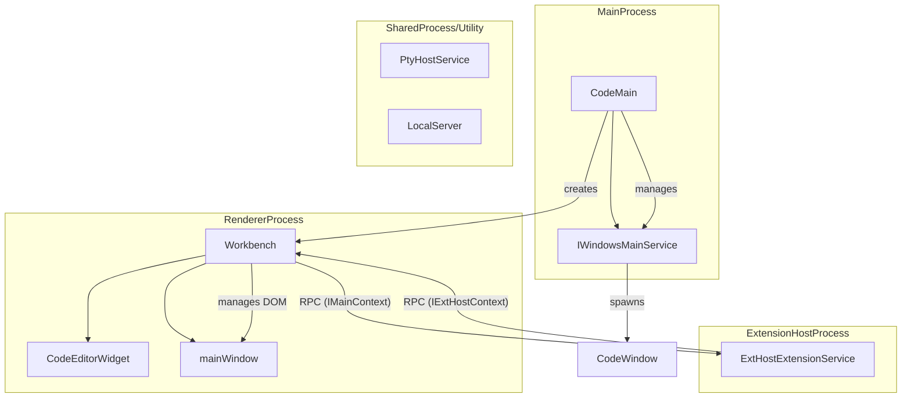
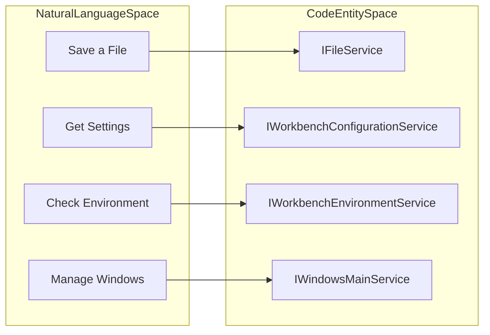
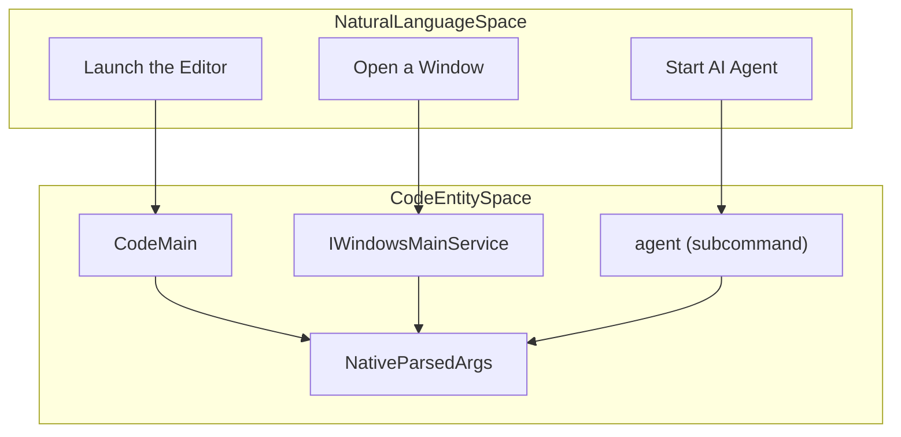

# VS Code Architecture Overview

Relevant source files

The following files were used as context for generating this wiki page:

- [.npmrc](https://github.com/microsoft/vscode/blob/HEAD/.npmrc)
- [.nvmrc](https://github.com/microsoft/vscode/blob/HEAD/.nvmrc)
- [build/azure-pipelines/linux/setup-env.sh](https://github.com/microsoft/vscode/blob/HEAD/build/azure-pipelines/linux/setup-env.sh)
- [build/checksums/electron.txt](https://github.com/microsoft/vscode/blob/HEAD/build/checksums/electron.txt)
- [build/checksums/nodejs.txt](https://github.com/microsoft/vscode/blob/HEAD/build/checksums/nodejs.txt)
- [build/lib/i18n.resources.json](https://github.com/microsoft/vscode/blob/HEAD/build/lib/i18n.resources.json)
- [build/linux/debian/calculate-deps.ts](https://github.com/microsoft/vscode/blob/HEAD/build/linux/debian/calculate-deps.ts)
- [build/linux/debian/dep-lists.ts](https://github.com/microsoft/vscode/blob/HEAD/build/linux/debian/dep-lists.ts)
- [build/linux/dependencies-generator.ts](https://github.com/microsoft/vscode/blob/HEAD/build/linux/dependencies-generator.ts)
- [build/linux/rpm/dep-lists.ts](https://github.com/microsoft/vscode/blob/HEAD/build/linux/rpm/dep-lists.ts)
- [cgmanifest.json](https://github.com/microsoft/vscode/blob/HEAD/cgmanifest.json)
- [cli/src/bin/code/legacy_args.rs](https://github.com/microsoft/vscode/blob/HEAD/cli/src/bin/code/legacy_args.rs)
- [cli/src/tunnels/paths.rs](https://github.com/microsoft/vscode/blob/HEAD/cli/src/tunnels/paths.rs)
- [extensions/copilot/chat-lib/package-lock.json](https://github.com/microsoft/vscode/blob/HEAD/extensions/copilot/chat-lib/package-lock.json)
- [extensions/copilot/chat-lib/package.json](https://github.com/microsoft/vscode/blob/HEAD/extensions/copilot/chat-lib/package.json)
- [extensions/copilot/package-lock.json](https://github.com/microsoft/vscode/blob/HEAD/extensions/copilot/package-lock.json)
- [package-lock.json](https://github.com/microsoft/vscode/blob/HEAD/package-lock.json)
- [package.json](https://github.com/microsoft/vscode/blob/HEAD/package.json)
- [remote/.npmrc](https://github.com/microsoft/vscode/blob/HEAD/remote/.npmrc)
- [remote/package-lock.json](https://github.com/microsoft/vscode/blob/HEAD/remote/package-lock.json)
- [remote/package.json](https://github.com/microsoft/vscode/blob/HEAD/remote/package.json)
- [remote/web/package-lock.json](https://github.com/microsoft/vscode/blob/HEAD/remote/web/package-lock.json)
- [remote/web/package.json](https://github.com/microsoft/vscode/blob/HEAD/remote/web/package.json)
- [resources/completions/bash/code](https://github.com/microsoft/vscode/blob/HEAD/resources/completions/bash/code)
- [resources/completions/zsh/_code](https://github.com/microsoft/vscode/blob/HEAD/resources/completions/zsh/_code)
- [src/vs/base/browser/indexedDB.ts](https://github.com/microsoft/vscode/blob/HEAD/src/vs/base/browser/indexedDB.ts)
- [src/vs/base/common/codiconsLibrary.ts](https://github.com/microsoft/vscode/blob/HEAD/src/vs/base/common/codiconsLibrary.ts)
- [src/vs/base/test/browser/indexedDB.test.ts](https://github.com/microsoft/vscode/blob/HEAD/src/vs/base/test/browser/indexedDB.test.ts)
- [src/vs/code/browser/workbench/callback.html](https://github.com/microsoft/vscode/blob/HEAD/src/vs/code/browser/workbench/callback.html)
- [src/vs/code/browser/workbench/workbench-dev.html](https://github.com/microsoft/vscode/blob/HEAD/src/vs/code/browser/workbench/workbench-dev.html)
- [src/vs/code/browser/workbench/workbench.html](https://github.com/microsoft/vscode/blob/HEAD/src/vs/code/browser/workbench/workbench.html)
- [src/vs/code/browser/workbench/workbench.ts](https://github.com/microsoft/vscode/blob/HEAD/src/vs/code/browser/workbench/workbench.ts)
- [src/vs/code/electron-main/app.ts](https://github.com/microsoft/vscode/blob/HEAD/src/vs/code/electron-main/app.ts)
- [src/vs/code/electron-main/main.ts](https://github.com/microsoft/vscode/blob/HEAD/src/vs/code/electron-main/main.ts)
- [src/vs/code/electron-utility/sharedProcess/sharedProcessMain.ts](https://github.com/microsoft/vscode/blob/HEAD/src/vs/code/electron-utility/sharedProcess/sharedProcessMain.ts)
- [src/vs/code/node/cliProcessMain.ts](https://github.com/microsoft/vscode/blob/HEAD/src/vs/code/node/cliProcessMain.ts)
- [src/vs/platform/auxiliaryWindow/electron-main/auxiliaryWindow.ts](https://github.com/microsoft/vscode/blob/HEAD/src/vs/platform/auxiliaryWindow/electron-main/auxiliaryWindow.ts)
- [src/vs/platform/auxiliaryWindow/electron-main/auxiliaryWindows.ts](https://github.com/microsoft/vscode/blob/HEAD/src/vs/platform/auxiliaryWindow/electron-main/auxiliaryWindows.ts)
- [src/vs/platform/auxiliaryWindow/electron-main/auxiliaryWindowsMainService.ts](https://github.com/microsoft/vscode/blob/HEAD/src/vs/platform/auxiliaryWindow/electron-main/auxiliaryWindowsMainService.ts)
- [src/vs/platform/extensionManagement/common/extensionManagementCLI.ts](https://github.com/microsoft/vscode/blob/HEAD/src/vs/platform/extensionManagement/common/extensionManagementCLI.ts)
- [src/vs/platform/files/browser/indexedDBFileSystemProvider.ts](https://github.com/microsoft/vscode/blob/HEAD/src/vs/platform/files/browser/indexedDBFileSystemProvider.ts)
- [src/vs/platform/launch/electron-main/launchMainService.ts](https://github.com/microsoft/vscode/blob/HEAD/src/vs/platform/launch/electron-main/launchMainService.ts)
- [src/vs/platform/native/common/native.ts](https://github.com/microsoft/vscode/blob/HEAD/src/vs/platform/native/common/native.ts)
- [src/vs/platform/native/electron-main/nativeHostMainService.ts](https://github.com/microsoft/vscode/blob/HEAD/src/vs/platform/native/electron-main/nativeHostMainService.ts)
- [src/vs/platform/window/common/window.ts](https://github.com/microsoft/vscode/blob/HEAD/src/vs/platform/window/common/window.ts)
- [src/vs/platform/window/electron-main/window.ts](https://github.com/microsoft/vscode/blob/HEAD/src/vs/platform/window/electron-main/window.ts)
- [src/vs/platform/windows/electron-main/windowImpl.ts](https://github.com/microsoft/vscode/blob/HEAD/src/vs/platform/windows/electron-main/windowImpl.ts)
- [src/vs/platform/windows/electron-main/windows.ts](https://github.com/microsoft/vscode/blob/HEAD/src/vs/platform/windows/electron-main/windows.ts)
- [src/vs/platform/windows/electron-main/windowsMainService.ts](https://github.com/microsoft/vscode/blob/HEAD/src/vs/platform/windows/electron-main/windowsMainService.ts)
- [src/vs/platform/windows/test/electron-main/windowsFinder.test.ts](https://github.com/microsoft/vscode/blob/HEAD/src/vs/platform/windows/test/electron-main/windowsFinder.test.ts)
- [src/vs/server/node/remoteExtensionHostAgentCli.ts](https://github.com/microsoft/vscode/blob/HEAD/src/vs/server/node/remoteExtensionHostAgentCli.ts)
- [src/vs/server/node/serverServices.ts](https://github.com/microsoft/vscode/blob/HEAD/src/vs/server/node/serverServices.ts)
- [src/vs/sessions/sessions.common.main.ts](https://github.com/microsoft/vscode/blob/HEAD/src/vs/sessions/sessions.common.main.ts)
- [src/vs/sessions/sessions.desktop.main.ts](https://github.com/microsoft/vscode/blob/HEAD/src/vs/sessions/sessions.desktop.main.ts)
- [src/vs/sessions/sessions.web.main.ts](https://github.com/microsoft/vscode/blob/HEAD/src/vs/sessions/sessions.web.main.ts)
- [src/vs/workbench/api/browser/extensionHost.contribution.ts](https://github.com/microsoft/vscode/blob/HEAD/src/vs/workbench/api/browser/extensionHost.contribution.ts)
- [src/vs/workbench/api/browser/mainThreadCLICommands.ts](https://github.com/microsoft/vscode/blob/HEAD/src/vs/workbench/api/browser/mainThreadCLICommands.ts)
- [src/vs/workbench/api/common/extHost.common.services.ts](https://github.com/microsoft/vscode/blob/HEAD/src/vs/workbench/api/common/extHost.common.services.ts)
- [src/vs/workbench/api/common/extHostLogService.ts](https://github.com/microsoft/vscode/blob/HEAD/src/vs/workbench/api/common/extHostLogService.ts)
- [src/vs/workbench/api/node/extHost.node.services.ts](https://github.com/microsoft/vscode/blob/HEAD/src/vs/workbench/api/node/extHost.node.services.ts)
- [src/vs/workbench/api/node/extHostCLIServer.ts](https://github.com/microsoft/vscode/blob/HEAD/src/vs/workbench/api/node/extHostCLIServer.ts)
- [src/vs/workbench/api/node/extHostLoggerService.ts](https://github.com/microsoft/vscode/blob/HEAD/src/vs/workbench/api/node/extHostLoggerService.ts)
- [src/vs/workbench/api/worker/extHost.worker.services.ts](https://github.com/microsoft/vscode/blob/HEAD/src/vs/workbench/api/worker/extHost.worker.services.ts)
- [src/vs/workbench/browser/web.api.ts](https://github.com/microsoft/vscode/blob/HEAD/src/vs/workbench/browser/web.api.ts)
- [src/vs/workbench/browser/web.factory.ts](https://github.com/microsoft/vscode/blob/HEAD/src/vs/workbench/browser/web.factory.ts)
- [src/vs/workbench/browser/web.main.ts](https://github.com/microsoft/vscode/blob/HEAD/src/vs/workbench/browser/web.main.ts)
- [src/vs/workbench/contrib/relauncher/browser/relauncher.contribution.ts](https://github.com/microsoft/vscode/blob/HEAD/src/vs/workbench/contrib/relauncher/browser/relauncher.contribution.ts)
- [src/vs/workbench/electron-browser/desktop.main.ts](https://github.com/microsoft/vscode/blob/HEAD/src/vs/workbench/electron-browser/desktop.main.ts)
- [src/vs/workbench/services/host/browser/browserHostService.ts](https://github.com/microsoft/vscode/blob/HEAD/src/vs/workbench/services/host/browser/browserHostService.ts)
- [src/vs/workbench/services/host/browser/host.ts](https://github.com/microsoft/vscode/blob/HEAD/src/vs/workbench/services/host/browser/host.ts)
- [src/vs/workbench/test/electron-browser/workbenchTestServices.ts](https://github.com/microsoft/vscode/blob/HEAD/src/vs/workbench/test/electron-browser/workbenchTestServices.ts)
- [src/vs/workbench/workbench.common.main.ts](https://github.com/microsoft/vscode/blob/HEAD/src/vs/workbench/workbench.common.main.ts)
- [src/vs/workbench/workbench.desktop.main.ts](https://github.com/microsoft/vscode/blob/HEAD/src/vs/workbench/workbench.desktop.main.ts)
- [src/vs/workbench/workbench.web.main.internal.ts](https://github.com/microsoft/vscode/blob/HEAD/src/vs/workbench/workbench.web.main.internal.ts)
- [src/vs/workbench/workbench.web.main.ts](https://github.com/microsoft/vscode/blob/HEAD/src/vs/workbench/workbench.web.main.ts)

Visual Studio Code is built on a multi-process, layered architecture designed to provide a highly responsive user interface while supporting heavy-duty features like language intelligence, debugging, and terminal integration. It is designed to run as a desktop application (via Electron), in the web browser, or connected to a remote server.

## Multi-Process Model

VS Code distributes work across several processes to ensure that the UI remains responsive even when extensions or language servers are performing heavy computations.

*   **Main Process**: The entry point for the Electron application. It manages the application lifecycle, window creation, and native OS integration via `CodeApplication` and `WindowsMainService`. [src/vs/code/electron-main/app.ts:58-80](https://github.com/microsoft/vscode/blob/HEAD/src/vs/code/electron-main/app.ts#L58-L80).
*   **Renderer Process**: Each window runs in its own renderer process. It hosts the `Workbench` UI and the Monaco Editor. [src/vs/workbench/browser/web.main.ts:13-13](https://github.com/microsoft/vscode/blob/HEAD/src/vs/workbench/browser/web.main.ts#L13).
*   **Extension Host**: Extensions run in a dedicated process (`ExtensionHost`) to prevent them from blocking the UI thread. [src/vs/workbench/workbench.common.main.ts:10-10](https://github.com/microsoft/vscode/blob/HEAD/src/vs/workbench/workbench.common.main.ts#L10).
*   **Utility Processes**: Separate processes for tasks like the Integrated Terminal (PTY host), file watching, and search. [package-lock.json:68-68](https://github.com/microsoft/vscode/blob/HEAD/package-lock.json#L68).
*   **Remote Extension Host (REH)**: When using remote development, a server-side process hosts extensions and provides file/terminal access. [remote/package.json:2-5](https://github.com/microsoft/vscode/blob/HEAD/remote/package.json#L2-L5).

### Process Interaction Diagram

The following diagram illustrates the relationship between the primary processes and their code entry points.

**Sources:**
- `src/vs/code/electron-main/app.ts` [58-80](https://github.com/microsoft/vscode/blob/HEAD/src/vs/code/electron-main/app.ts#L58-L80)
- `src/vs/workbench/browser/web.main.ts` [13-13](https://github.com/microsoft/vscode/blob/HEAD/src/vs/workbench/browser/web.main.ts#L13)
- `package.json` [9-10](https://github.com/microsoft/vscode/blob/HEAD/package.json#L9-L10)
- `remote/package.json` [2-5](https://github.com/microsoft/vscode/blob/HEAD/remote/package.json#L2-L5)

## Repository Structure and Build System

The repository is organized to support multiple targets (Electron desktop, REH server, web) from a single codebase.

*   **`src/`**: The core TypeScript source code.
*   **`extensions/`**: Built-in extensions like Git, Markdown, and the `copilot` chat extension. [package.json:27-27](https://github.com/microsoft/vscode/blob/HEAD/package.json#L27)
*   **`build/`**: Gulp, Rspack, and Vite configurations for the build pipeline. [package.json:55-55, 75-75](https://github.com/microsoft/vscode/blob/HEAD/package.json#L55)
*   **`cli/`**: The Rust-based command-line interface. [remote/package.json:43-43](https://github.com/microsoft/vscode/blob/HEAD/remote/package.json#L43)
*   **`remote/`**: Configuration and dependencies for the Remote Extension Host (REH) and Web server. [remote/package.json:1-5](https://github.com/microsoft/vscode/blob/HEAD/remote/package.json#L1-L5)

VS Code uses a multi-target build system defined in `package.json`. It supports transpilation for the desktop application (`compile-client`), the Copilot features (`compile-copilot`), and web-based targets (`compile-web`). [package.json:25-27, 74-74](https://github.com/microsoft/vscode/blob/HEAD/package.json#L25-L27)

For details, see [Repository Structure and Build System](#1.1).

**Sources:**
- `package.json` [25-27, 73-77](https://github.com/microsoft/vscode/blob/HEAD/package.json#L25-L27)
- `remote/package.json` [1-5, 43-43](https://github.com/microsoft/vscode/blob/HEAD/remote/package.json#L1-L5)

## Core Architectural Layers

The codebase follows a strict layering model to manage dependencies and ensure portability across platforms.

1.  **`base`**: General utilities (e.g., `Event`, `IDisposable`, `VSBuffer`) and UI building blocks. [src/vs/workbench/browser/web.main.ts:11-11](https://github.com/microsoft/vscode/blob/HEAD/src/vs/workbench/browser/web.main.ts#L11)
2.  **`platform`**: Common services (Files, Configuration, Telemetry) and the Dependency Injection (DI) system. [src/vs/platform/instantiation/common/instantiation.ts:58-59](https://github.com/microsoft/vscode/blob/HEAD/src/vs/platform/instantiation/common/instantiation.ts#L58-L59)
3.  **`editor`**: The "Monaco" editor core, including the text model and rendering pipeline. [src/vs/workbench/workbench.common.main.ts:8-8](https://github.com/microsoft/vscode/blob/HEAD/src/vs/workbench/workbench.common.main.ts#L8)
4.  **`workbench`**: The UI framework surrounding the editor (Sidebars, Panels, Activity Bar). [src/vs/workbench/browser/web.main.ts:13-13](https://github.com/microsoft/vscode/blob/HEAD/src/vs/workbench/browser/web.main.ts#L13)
5.  **`sessions`**: Specialized layer for AI-centric orchestration and "Agents Windows". [src/vs/workbench/workbench.common.main.ts:14-20](https://github.com/microsoft/vscode/blob/HEAD/src/vs/workbench/workbench.common.main.ts#L14-L20)

Imports are strictly enforced by the `valid-layers-check` script to prevent layer violations. [package.json:68-68](https://github.com/microsoft/vscode/blob/HEAD/package.json#L68)

For details, see [Core Architectural Layers](#1.2).

**Sources:**
- `package.json` [68-68](https://github.com/microsoft/vscode/blob/HEAD/package.json#L68)
- `src/vs/workbench/workbench.common.main.ts` [8-20](https://github.com/microsoft/vscode/blob/HEAD/src/vs/workbench/workbench.common.main.ts#L8-L20)
- `src/vs/platform/instantiation/common/instantiation.ts` [58-59](https://github.com/microsoft/vscode/blob/HEAD/src/vs/platform/instantiation/common/instantiation.ts#L58-L59)

## Major Subsystems

VS Code functionality is partitioned into several large subsystems that interact via the service layer:

| Subsystem | Primary Responsibility | Key Service/Entry Point |
| :--- | :--- | :--- |
| **Workbench** | Layout, Views, and UI Parts | `IWorkbenchLayoutService`, `IEditorService` |
| **Monaco** | Text rendering and language features | `ITextModel`, `ICodeEditor` |
| **Extension Host** | Running 3rd party code safely | `IExtensionService` |
| **Terminal** | Integrated shell access | `ITerminalService` |
| **AI/Copilot** | Chat, Inline completions, and Agents | `IChatService`, `IAgentService` |
| **Notebooks** | Interactive document execution | `INotebookService` |

**Sources:**
- `src/vs/workbench/workbench.common.main.ts` [53-150](https://github.com/microsoft/vscode/blob/HEAD/src/vs/workbench/workbench.common.main.ts#L53-L150)
- `src/vs/workbench/browser/web.main.ts` [8-86](https://github.com/microsoft/vscode/blob/HEAD/src/vs/workbench/browser/web.main.ts#L8-L86)

## Code Navigation and Services

VS Code uses a custom Dependency Injection (DI) system. Most functionality is exposed as services identified by a decorator (e.g., `IFileService`).

### Service Association Diagram

This diagram shows how system-level concepts map to specific service identifiers and their implementations used in the code.

### CLI Entry Points Diagram

Navigating the codebase often starts with the command-line arguments handled in the `NativeParsedArgs` interface.

**Sources:**
- `src/vs/platform/environment/common/argv.ts` [43-43](https://github.com/microsoft/vscode/blob/HEAD/src/vs/platform/environment/common/argv.ts#L43)
- `src/vs/workbench/browser/web.main.ts` [8-25](https://github.com/microsoft/vscode/blob/HEAD/src/vs/workbench/browser/web.main.ts#L8-L25)

## Getting Started

To begin contributing, you must set up the development environment, which involves installing dependencies and running the build scripts.

*   **Setup**: Run `npm install`. This triggers `postinstall.ts` to configure the repository. [package.json:24-24](https://github.com/microsoft/vscode/blob/HEAD/package.json#L24)
*   **Compilation**: Use `npm run compile` or `npm run watch` for incremental builds. [package.json:25-33](https://github.com/microsoft/vscode/blob/HEAD/package.json#L25-L33)
*   **Testing**: Unit tests can be run via `npm run test-node` or `npm run test-browser`. [package.json:14-16](https://github.com/microsoft/vscode/blob/HEAD/package.json#L14-L16)
*   **Execution**: Launch the development version using the `electron` script. [package.json:56-56](https://github.com/microsoft/vscode/blob/HEAD/package.json#L56)

For details, see [Getting Started: Development Environment](#1.3).

**Sources:**
- `package.json` [12-56, 23-24](https://github.com/microsoft/vscode/blob/HEAD/package.json#L12-L56)

## Child Pages
- [Repository Structure and Build System](#1.1)
- [Core Architectural Layers](#1.2)
- [Getting Started: Development Environment](#1.3)
- [Contribution Workflow and Repo Automation](#1.4)