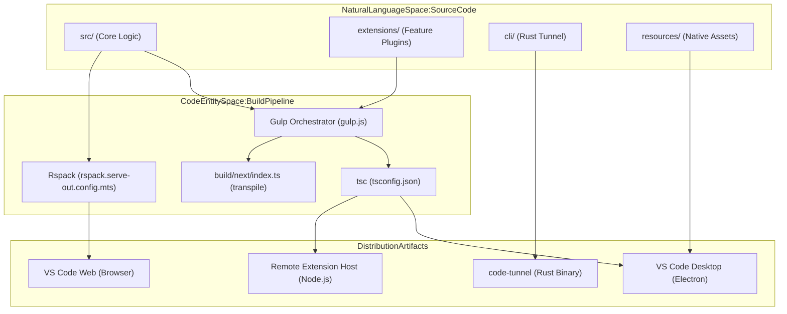
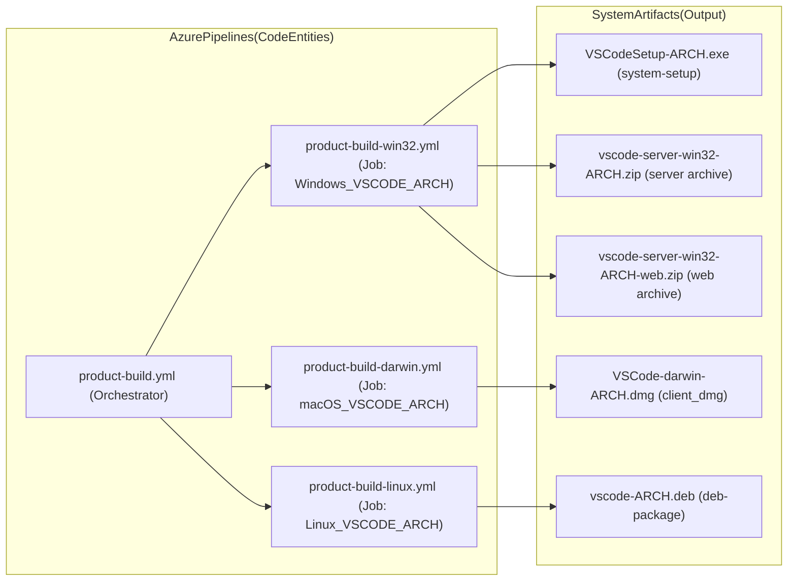

# Repository Structure and Build System

Relevant source files

The following files were used as context for generating this wiki page:

- [.github/agents/demonstrate.md](https://github.com/microsoft/vscode/blob/HEAD/.github/agents/demonstrate.md)
- [.github/instructions/buildNext.instructions.md](https://github.com/microsoft/vscode/blob/HEAD/.github/instructions/buildNext.instructions.md)
- [.github/prompts/codenotify.prompt.md](https://github.com/microsoft/vscode/blob/HEAD/.github/prompts/codenotify.prompt.md)
- [.github/prompts/component.prompt.md](https://github.com/microsoft/vscode/blob/HEAD/.github/prompts/component.prompt.md)
- [.github/prompts/fixIssueNo.prompt.md](https://github.com/microsoft/vscode/blob/HEAD/.github/prompts/fixIssueNo.prompt.md)
- [.github/prompts/implement.prompt.md](https://github.com/microsoft/vscode/blob/HEAD/.github/prompts/implement.prompt.md)
- [.github/prompts/no-any.prompt.md](https://github.com/microsoft/vscode/blob/HEAD/.github/prompts/no-any.prompt.md)
- [.github/prompts/plan-deep.prompt.md](https://github.com/microsoft/vscode/blob/HEAD/.github/prompts/plan-deep.prompt.md)
- [.github/prompts/plan-fast.prompt.md](https://github.com/microsoft/vscode/blob/HEAD/.github/prompts/plan-fast.prompt.md)
- [.github/prompts/setup-environment.prompt.md](https://github.com/microsoft/vscode/blob/HEAD/.github/prompts/setup-environment.prompt.md)
- [.github/prompts/update-instructions.prompt.md](https://github.com/microsoft/vscode/blob/HEAD/.github/prompts/update-instructions.prompt.md)
- [.npmrc](https://github.com/microsoft/vscode/blob/HEAD/.npmrc)
- [.nvmrc](https://github.com/microsoft/vscode/blob/HEAD/.nvmrc)
- [.vscode-test.js](https://github.com/microsoft/vscode/blob/HEAD/.vscode-test.js)
- [.vscode/launch.json](https://github.com/microsoft/vscode/blob/HEAD/.vscode/launch.json)
- [.vscode/mcp.json](https://github.com/microsoft/vscode/blob/HEAD/.vscode/mcp.json)
- [.vscode/settings.json](https://github.com/microsoft/vscode/blob/HEAD/.vscode/settings.json)
- [.vscode/tasks.json](https://github.com/microsoft/vscode/blob/HEAD/.vscode/tasks.json)
- [build/.cachesalt](https://github.com/microsoft/vscode/blob/HEAD/build/.cachesalt)
- [build/.moduleignore](https://github.com/microsoft/vscode/blob/HEAD/build/.moduleignore)
- [build/.webignore](https://github.com/microsoft/vscode/blob/HEAD/build/.webignore)
- [build/azure-pipelines/alpine/product-build-alpine-node-modules.yml](https://github.com/microsoft/vscode/blob/HEAD/build/azure-pipelines/alpine/product-build-alpine-node-modules.yml)
- [build/azure-pipelines/alpine/product-build-alpine.yml](https://github.com/microsoft/vscode/blob/HEAD/build/azure-pipelines/alpine/product-build-alpine.yml)
- [build/azure-pipelines/cli/cli-compile.yml](https://github.com/microsoft/vscode/blob/HEAD/build/azure-pipelines/cli/cli-compile.yml)
- [build/azure-pipelines/common/createBuild.ts](https://github.com/microsoft/vscode/blob/HEAD/build/azure-pipelines/common/createBuild.ts)
- [build/azure-pipelines/common/publish.ts](https://github.com/microsoft/vscode/blob/HEAD/build/azure-pipelines/common/publish.ts)
- [build/azure-pipelines/common/releaseBuild.ts](https://github.com/microsoft/vscode/blob/HEAD/build/azure-pipelines/common/releaseBuild.ts)
- [build/azure-pipelines/copilot/setup-steps.yml](https://github.com/microsoft/vscode/blob/HEAD/build/azure-pipelines/copilot/setup-steps.yml)
- [build/azure-pipelines/darwin/product-build-darwin-node-modules.yml](https://github.com/microsoft/vscode/blob/HEAD/build/azure-pipelines/darwin/product-build-darwin-node-modules.yml)
- [build/azure-pipelines/darwin/product-build-darwin-universal.yml](https://github.com/microsoft/vscode/blob/HEAD/build/azure-pipelines/darwin/product-build-darwin-universal.yml)
- [build/azure-pipelines/darwin/product-build-darwin.yml](https://github.com/microsoft/vscode/blob/HEAD/build/azure-pipelines/darwin/product-build-darwin.yml)
- [build/azure-pipelines/darwin/steps/product-build-darwin-compile.yml](https://github.com/microsoft/vscode/blob/HEAD/build/azure-pipelines/darwin/steps/product-build-darwin-compile.yml)
- [build/azure-pipelines/linux/product-build-linux-node-modules.yml](https://github.com/microsoft/vscode/blob/HEAD/build/azure-pipelines/linux/product-build-linux-node-modules.yml)
- [build/azure-pipelines/linux/product-build-linux.yml](https://github.com/microsoft/vscode/blob/HEAD/build/azure-pipelines/linux/product-build-linux.yml)
- [build/azure-pipelines/linux/setup-env.sh](https://github.com/microsoft/vscode/blob/HEAD/build/azure-pipelines/linux/setup-env.sh)
- [build/azure-pipelines/linux/steps/product-build-linux-compile.yml](https://github.com/microsoft/vscode/blob/HEAD/build/azure-pipelines/linux/steps/product-build-linux-compile.yml)
- [build/azure-pipelines/product-build.yml](https://github.com/microsoft/vscode/blob/HEAD/build/azure-pipelines/product-build.yml)
- [build/azure-pipelines/product-publish.yml](https://github.com/microsoft/vscode/blob/HEAD/build/azure-pipelines/product-publish.yml)
- [build/azure-pipelines/product-quality-checks.yml](https://github.com/microsoft/vscode/blob/HEAD/build/azure-pipelines/product-quality-checks.yml)
- [build/azure-pipelines/product-release.yml](https://github.com/microsoft/vscode/blob/HEAD/build/azure-pipelines/product-release.yml)
- [build/azure-pipelines/upload-cdn.ts](https://github.com/microsoft/vscode/blob/HEAD/build/azure-pipelines/upload-cdn.ts)
- [build/azure-pipelines/upload-nlsmetadata.ts](https://github.com/microsoft/vscode/blob/HEAD/build/azure-pipelines/upload-nlsmetadata.ts)
- [build/azure-pipelines/upload-sourcemaps.ts](https://github.com/microsoft/vscode/blob/HEAD/build/azure-pipelines/upload-sourcemaps.ts)
- [build/azure-pipelines/web/product-build-web-node-modules.yml](https://github.com/microsoft/vscode/blob/HEAD/build/azure-pipelines/web/product-build-web-node-modules.yml)
- [build/azure-pipelines/web/product-build-web.yml](https://github.com/microsoft/vscode/blob/HEAD/build/azure-pipelines/web/product-build-web.yml)
- [build/azure-pipelines/win32/product-build-win32-node-modules.yml](https://github.com/microsoft/vscode/blob/HEAD/build/azure-pipelines/win32/product-build-win32-node-modules.yml)
- [build/azure-pipelines/win32/product-build-win32.yml](https://github.com/microsoft/vscode/blob/HEAD/build/azure-pipelines/win32/product-build-win32.yml)
- [build/azure-pipelines/win32/sdl-scan-win32.yml](https://github.com/microsoft/vscode/blob/HEAD/build/azure-pipelines/win32/sdl-scan-win32.yml)
- [build/azure-pipelines/win32/steps/product-build-win32-compile.yml](https://github.com/microsoft/vscode/blob/HEAD/build/azure-pipelines/win32/steps/product-build-win32-compile.yml)
- [build/buildfile.ts](https://github.com/microsoft/vscode/blob/HEAD/build/buildfile.ts)
- [build/checksums/electron.txt](https://github.com/microsoft/vscode/blob/HEAD/build/checksums/electron.txt)
- [build/checksums/nodejs.txt](https://github.com/microsoft/vscode/blob/HEAD/build/checksums/nodejs.txt)
- [build/checksums/vscode-sysroot.txt](https://github.com/microsoft/vscode/blob/HEAD/build/checksums/vscode-sysroot.txt)
- [build/darwin/create-universal-app.ts](https://github.com/microsoft/vscode/blob/HEAD/build/darwin/create-universal-app.ts)
- [build/darwin/verify-macho.ts](https://github.com/microsoft/vscode/blob/HEAD/build/darwin/verify-macho.ts)
- [build/gulpfile.reh.ts](https://github.com/microsoft/vscode/blob/HEAD/build/gulpfile.reh.ts)
- [build/gulpfile.vscode.ts](https://github.com/microsoft/vscode/blob/HEAD/build/gulpfile.vscode.ts)
- [build/gulpfile.vscode.web.ts](https://github.com/microsoft/vscode/blob/HEAD/build/gulpfile.vscode.web.ts)
- [build/lib/copilot.ts](https://github.com/microsoft/vscode/blob/HEAD/build/lib/copilot.ts)
- [build/lib/nls.ts](https://github.com/microsoft/vscode/blob/HEAD/build/lib/nls.ts)
- [build/lib/npmPackage.ts](https://github.com/microsoft/vscode/blob/HEAD/build/lib/npmPackage.ts)
- [build/lib/osProxyResolver.ts](https://github.com/microsoft/vscode/blob/HEAD/build/lib/osProxyResolver.ts)
- [build/lib/test/copilot.test.ts](https://github.com/microsoft/vscode/blob/HEAD/build/lib/test/copilot.test.ts)
- [build/lib/test/osProxyResolver.test.ts](https://github.com/microsoft/vscode/blob/HEAD/build/lib/test/osProxyResolver.test.ts)
- [build/linux/debian/calculate-deps.ts](https://github.com/microsoft/vscode/blob/HEAD/build/linux/debian/calculate-deps.ts)
- [build/linux/debian/dep-lists.ts](https://github.com/microsoft/vscode/blob/HEAD/build/linux/debian/dep-lists.ts)
- [build/linux/debian/install-sysroot.ts](https://github.com/microsoft/vscode/blob/HEAD/build/linux/debian/install-sysroot.ts)
- [build/linux/dependencies-generator.ts](https://github.com/microsoft/vscode/blob/HEAD/build/linux/dependencies-generator.ts)
- [build/linux/rpm/dep-lists.ts](https://github.com/microsoft/vscode/blob/HEAD/build/linux/rpm/dep-lists.ts)
- [build/next/build-fast.ts](https://github.com/microsoft/vscode/blob/HEAD/build/next/build-fast.ts)
- [build/next/index.ts](https://github.com/microsoft/vscode/blob/HEAD/build/next/index.ts)
- [build/next/nls-plugin.ts](https://github.com/microsoft/vscode/blob/HEAD/build/next/nls-plugin.ts)
- [build/next/private-to-property.ts](https://github.com/microsoft/vscode/blob/HEAD/build/next/private-to-property.ts)
- [build/next/test/build-fast.test.ts](https://github.com/microsoft/vscode/blob/HEAD/build/next/test/build-fast.test.ts)
- [build/next/test/nls-sourcemap.test.ts](https://github.com/microsoft/vscode/blob/HEAD/build/next/test/nls-sourcemap.test.ts)
- [build/next/test/private-to-property.test.ts](https://github.com/microsoft/vscode/blob/HEAD/build/next/test/private-to-property.test.ts)
- [build/next/transpile.ts](https://github.com/microsoft/vscode/blob/HEAD/build/next/transpile.ts)
- [build/package-lock.json](https://github.com/microsoft/vscode/blob/HEAD/build/package-lock.json)
- [build/package.json](https://github.com/microsoft/vscode/blob/HEAD/build/package.json)
- [cgmanifest.json](https://github.com/microsoft/vscode/blob/HEAD/cgmanifest.json)
- [cli/Cargo.lock](https://github.com/microsoft/vscode/blob/HEAD/cli/Cargo.lock)
- [cli/Cargo.toml](https://github.com/microsoft/vscode/blob/HEAD/cli/Cargo.toml)
- [cli/src/async_pipe.rs](https://github.com/microsoft/vscode/blob/HEAD/cli/src/async_pipe.rs)
- [cli/src/auth.rs](https://github.com/microsoft/vscode/blob/HEAD/cli/src/auth.rs)
- [cli/src/bin/code/main.rs](https://github.com/microsoft/vscode/blob/HEAD/cli/src/bin/code/main.rs)
- [cli/src/commands.rs](https://github.com/microsoft/vscode/blob/HEAD/cli/src/commands.rs)
- [cli/src/commands/agent.rs](https://github.com/microsoft/vscode/blob/HEAD/cli/src/commands/agent.rs)
- [cli/src/commands/agent_discovery.rs](https://github.com/microsoft/vscode/blob/HEAD/cli/src/commands/agent_discovery.rs)
- [cli/src/commands/agent_host.rs](https://github.com/microsoft/vscode/blob/HEAD/cli/src/commands/agent_host.rs)
- [cli/src/commands/agent_kill.rs](https://github.com/microsoft/vscode/blob/HEAD/cli/src/commands/agent_kill.rs)
- [cli/src/commands/agent_logs.rs](https://github.com/microsoft/vscode/blob/HEAD/cli/src/commands/agent_logs.rs)
- [cli/src/commands/agent_ps.rs](https://github.com/microsoft/vscode/blob/HEAD/cli/src/commands/agent_ps.rs)
- [cli/src/commands/agent_stop.rs](https://github.com/microsoft/vscode/blob/HEAD/cli/src/commands/agent_stop.rs)
- [cli/src/commands/args.rs](https://github.com/microsoft/vscode/blob/HEAD/cli/src/commands/args.rs)
- [cli/src/commands/serve_web.rs](https://github.com/microsoft/vscode/blob/HEAD/cli/src/commands/serve_web.rs)
- [cli/src/commands/tunnels.rs](https://github.com/microsoft/vscode/blob/HEAD/cli/src/commands/tunnels.rs)
- [cli/src/constants.rs](https://github.com/microsoft/vscode/blob/HEAD/cli/src/constants.rs)
- [cli/src/desktop/version_manager.rs](https://github.com/microsoft/vscode/blob/HEAD/cli/src/desktop/version_manager.rs)
- [cli/src/download_cache.rs](https://github.com/microsoft/vscode/blob/HEAD/cli/src/download_cache.rs)
- [cli/src/lib.rs](https://github.com/microsoft/vscode/blob/HEAD/cli/src/lib.rs)
- [cli/src/log.rs](https://github.com/microsoft/vscode/blob/HEAD/cli/src/log.rs)
- [cli/src/msgpack_rpc.rs](https://github.com/microsoft/vscode/blob/HEAD/cli/src/msgpack_rpc.rs)
- [cli/src/options.rs](https://github.com/microsoft/vscode/blob/HEAD/cli/src/options.rs)
- [cli/src/self_update.rs](https://github.com/microsoft/vscode/blob/HEAD/cli/src/self_update.rs)
- [cli/src/state.rs](https://github.com/microsoft/vscode/blob/HEAD/cli/src/state.rs)
- [cli/src/tunnels.rs](https://github.com/microsoft/vscode/blob/HEAD/cli/src/tunnels.rs)
- [cli/src/tunnels/agent_host.rs](https://github.com/microsoft/vscode/blob/HEAD/cli/src/tunnels/agent_host.rs)
- [cli/src/tunnels/challenge.rs](https://github.com/microsoft/vscode/blob/HEAD/cli/src/tunnels/challenge.rs)
- [cli/src/tunnels/code_server.rs](https://github.com/microsoft/vscode/blob/HEAD/cli/src/tunnels/code_server.rs)
- [cli/src/tunnels/control_server.rs](https://github.com/microsoft/vscode/blob/HEAD/cli/src/tunnels/control_server.rs)
- [cli/src/tunnels/dev_tunnels.rs](https://github.com/microsoft/vscode/blob/HEAD/cli/src/tunnels/dev_tunnels.rs)
- [cli/src/tunnels/local_forwarding.rs](https://github.com/microsoft/vscode/blob/HEAD/cli/src/tunnels/local_forwarding.rs)
- [cli/src/tunnels/port_forwarder.rs](https://github.com/microsoft/vscode/blob/HEAD/cli/src/tunnels/port_forwarder.rs)
- [cli/src/tunnels/protocol.rs](https://github.com/microsoft/vscode/blob/HEAD/cli/src/tunnels/protocol.rs)
- [cli/src/tunnels/server_bridge.rs](https://github.com/microsoft/vscode/blob/HEAD/cli/src/tunnels/server_bridge.rs)
- [cli/src/tunnels/service.rs](https://github.com/microsoft/vscode/blob/HEAD/cli/src/tunnels/service.rs)
- [cli/src/tunnels/service_linux.rs](https://github.com/microsoft/vscode/blob/HEAD/cli/src/tunnels/service_linux.rs)
- [cli/src/tunnels/service_macos.rs](https://github.com/microsoft/vscode/blob/HEAD/cli/src/tunnels/service_macos.rs)
- [cli/src/tunnels/service_windows.rs](https://github.com/microsoft/vscode/blob/HEAD/cli/src/tunnels/service_windows.rs)
- [cli/src/tunnels/singleton_client.rs](https://github.com/microsoft/vscode/blob/HEAD/cli/src/tunnels/singleton_client.rs)
- [cli/src/tunnels/singleton_server.rs](https://github.com/microsoft/vscode/blob/HEAD/cli/src/tunnels/singleton_server.rs)
- [cli/src/tunnels/socket_signal.rs](https://github.com/microsoft/vscode/blob/HEAD/cli/src/tunnels/socket_signal.rs)
- [cli/src/util/command.rs](https://github.com/microsoft/vscode/blob/HEAD/cli/src/util/command.rs)
- [cli/src/util/errors.rs](https://github.com/microsoft/vscode/blob/HEAD/cli/src/util/errors.rs)
- [cli/src/util/io.rs](https://github.com/microsoft/vscode/blob/HEAD/cli/src/util/io.rs)
- [cli/src/util/sync.rs](https://github.com/microsoft/vscode/blob/HEAD/cli/src/util/sync.rs)
- [extensions/copilot/.vscode/settings.json](https://github.com/microsoft/vscode/blob/HEAD/extensions/copilot/.vscode/settings.json)
- [extensions/copilot/.vscodeignore](https://github.com/microsoft/vscode/blob/HEAD/extensions/copilot/.vscodeignore)
- [extensions/copilot/chat-lib/package-lock.json](https://github.com/microsoft/vscode/blob/HEAD/extensions/copilot/chat-lib/package-lock.json)
- [extensions/copilot/chat-lib/package.json](https://github.com/microsoft/vscode/blob/HEAD/extensions/copilot/chat-lib/package.json)
- [extensions/copilot/package-lock.json](https://github.com/microsoft/vscode/blob/HEAD/extensions/copilot/package-lock.json)
- [extensions/copilot/script/postinstall.ts](https://github.com/microsoft/vscode/blob/HEAD/extensions/copilot/script/postinstall.ts)
- [extensions/copilot/src/extension/chatSessions/copilotcli/vscode-node/test/copilotCLISDKUpgrade.spec.ts](https://github.com/microsoft/vscode/blob/HEAD/extensions/copilot/src/extension/chatSessions/copilotcli/vscode-node/test/copilotCLISDKUpgrade.spec.ts)
- [extensions/tunnel-forwarding/.vscode/launch.json](https://github.com/microsoft/vscode/blob/HEAD/extensions/tunnel-forwarding/.vscode/launch.json)
- [extensions/tunnel-forwarding/.vscodeignore](https://github.com/microsoft/vscode/blob/HEAD/extensions/tunnel-forwarding/.vscodeignore)
- [extensions/tunnel-forwarding/src/extension.ts](https://github.com/microsoft/vscode/blob/HEAD/extensions/tunnel-forwarding/src/extension.ts)
- [package-lock.json](https://github.com/microsoft/vscode/blob/HEAD/package-lock.json)
- [package.json](https://github.com/microsoft/vscode/blob/HEAD/package.json)
- [remote/.npmrc](https://github.com/microsoft/vscode/blob/HEAD/remote/.npmrc)
- [remote/package-lock.json](https://github.com/microsoft/vscode/blob/HEAD/remote/package-lock.json)
- [remote/package.json](https://github.com/microsoft/vscode/blob/HEAD/remote/package.json)
- [remote/web/package-lock.json](https://github.com/microsoft/vscode/blob/HEAD/remote/web/package-lock.json)
- [remote/web/package.json](https://github.com/microsoft/vscode/blob/HEAD/remote/web/package.json)
- [scripts/test-integration.bat](https://github.com/microsoft/vscode/blob/HEAD/scripts/test-integration.bat)
- [scripts/test-integration.sh](https://github.com/microsoft/vscode/blob/HEAD/scripts/test-integration.sh)
- [scripts/test-remote-integration.bat](https://github.com/microsoft/vscode/blob/HEAD/scripts/test-remote-integration.bat)
- [scripts/test-remote-integration.sh](https://github.com/microsoft/vscode/blob/HEAD/scripts/test-remote-integration.sh)
- [scripts/test-web-integration.bat](https://github.com/microsoft/vscode/blob/HEAD/scripts/test-web-integration.bat)
- [scripts/test-web-integration.sh](https://github.com/microsoft/vscode/blob/HEAD/scripts/test-web-integration.sh)
- [src/vs/base/common/codiconsLibrary.ts](https://github.com/microsoft/vscode/blob/HEAD/src/vs/base/common/codiconsLibrary.ts)
- [src/vs/nls.ts](https://github.com/microsoft/vscode/blob/HEAD/src/vs/nls.ts)
- [src/vs/platform/environment/test/node/nativeModules.integrationTest.ts](https://github.com/microsoft/vscode/blob/HEAD/src/vs/platform/environment/test/node/nativeModules.integrationTest.ts)
- [test/automation/package-lock.json](https://github.com/microsoft/vscode/blob/HEAD/test/automation/package-lock.json)
- [test/automation/package.json](https://github.com/microsoft/vscode/blob/HEAD/test/automation/package.json)
- [test/automation/src/electron.ts](https://github.com/microsoft/vscode/blob/HEAD/test/automation/src/electron.ts)
- [test/automation/src/playwrightBrowser.ts](https://github.com/microsoft/vscode/blob/HEAD/test/automation/src/playwrightBrowser.ts)
- [test/automation/src/playwrightElectron.ts](https://github.com/microsoft/vscode/blob/HEAD/test/automation/src/playwrightElectron.ts)
- [test/integration/browser/package-lock.json](https://github.com/microsoft/vscode/blob/HEAD/test/integration/browser/package-lock.json)
- [test/integration/browser/package.json](https://github.com/microsoft/vscode/blob/HEAD/test/integration/browser/package.json)
- [test/mcp/README.md](https://github.com/microsoft/vscode/blob/HEAD/test/mcp/README.md)
- [test/mcp/package-lock.json](https://github.com/microsoft/vscode/blob/HEAD/test/mcp/package-lock.json)
- [test/mcp/package.json](https://github.com/microsoft/vscode/blob/HEAD/test/mcp/package.json)
- [test/mcp/src/application.ts](https://github.com/microsoft/vscode/blob/HEAD/test/mcp/src/application.ts)
- [test/mcp/src/automation.ts](https://github.com/microsoft/vscode/blob/HEAD/test/mcp/src/automation.ts)
- [test/mcp/src/automationTools/chat.ts](https://github.com/microsoft/vscode/blob/HEAD/test/mcp/src/automationTools/chat.ts)
- [test/mcp/src/automationTools/core.ts](https://github.com/microsoft/vscode/blob/HEAD/test/mcp/src/automationTools/core.ts)
- [test/mcp/src/automationTools/index.ts](https://github.com/microsoft/vscode/blob/HEAD/test/mcp/src/automationTools/index.ts)
- [test/mcp/src/automationTools/settings.ts](https://github.com/microsoft/vscode/blob/HEAD/test/mcp/src/automationTools/settings.ts)
- [test/mcp/src/automationTools/windows.ts](https://github.com/microsoft/vscode/blob/HEAD/test/mcp/src/automationTools/windows.ts)
- [test/mcp/src/evidence.ts](https://github.com/microsoft/vscode/blob/HEAD/test/mcp/src/evidence.ts)
- [test/mcp/src/options.ts](https://github.com/microsoft/vscode/blob/HEAD/test/mcp/src/options.ts)
- [test/mcp/src/stdio.ts](https://github.com/microsoft/vscode/blob/HEAD/test/mcp/src/stdio.ts)
- [test/mcp/src/utils.ts](https://github.com/microsoft/vscode/blob/HEAD/test/mcp/src/utils.ts)
- [test/smoke/package-lock.json](https://github.com/microsoft/vscode/blob/HEAD/test/smoke/package-lock.json)
- [test/smoke/package.json](https://github.com/microsoft/vscode/blob/HEAD/test/smoke/package.json)

The VS Code repository is a multi-target project designed to produce several distinct distributions: the Electron-based desktop application, the Remote Extension Host (REH) server, and the web-based editor. The build system manages these targets through a unified Gulp-based pipeline, augmented by modern tools like Rspack and Vite for web targets and component exploration.

## Top-Level Directory Layout

The repository is organized into several key directories, each serving a specific role in the development and build lifecycle.

| Directory | Purpose | Key Contents |
| :--- | :--- | :--- |
| `src/` | Core source code | TypeScript source for base, platform, editor, workbench, and sessions. |
| `extensions/` | Built-in extensions | Extensions like TypeScript, Markdown, and Copilot [package.json:25-27](https://github.com/microsoft/vscode/blob/HEAD/package.json#L25-L27). |
| `build/` | Build infrastructure | Gulp tasks, CI configuration, and compilation scripts [build/package.json:1-5](https://github.com/microsoft/vscode/blob/HEAD/build/package.json#L1-L5). |
| `cli/` | Command Line Interface | Rust-based source for the `code` tunnel and CLI client [cli/Cargo.toml:1-10](https://github.com/microsoft/vscode/blob/HEAD/cli/Cargo.toml#L1-L10). |
| `resources/` | Static assets | Icons, platform-specific installers, and platform metadata. |
| `scripts/` | Helper scripts | Developer utilities for launching, testing, and profiling [package.json:90-92](https://github.com/microsoft/vscode/blob/HEAD/package.json#L90-L92). |
| `remote/` | Remote Server | Server-specific `package.json` and web-target dependencies [remote/package.json:1-5](https://github.com/microsoft/vscode/blob/HEAD/remote/package.json#L1-L5). |

**Sources:** [package.json:1-98](https://github.com/microsoft/vscode/blob/HEAD/package.json#L1-L98), [remote/package.json:1-5](https://github.com/microsoft/vscode/blob/HEAD/remote/package.json#L1-L5), [build/package.json:1-5](https://github.com/microsoft/vscode/blob/HEAD/build/package.json#L1-L5), [remote/web/package.json:1-5](https://github.com/microsoft/vscode/blob/HEAD/remote/web/package.json#L1-L5), [cli/Cargo.toml:1-10](https://github.com/microsoft/vscode/blob/HEAD/cli/Cargo.toml#L1-L10)

## Multi-Target Build System

VS Code uses a multi-layered build approach to support different execution environments. The primary entry point for build tasks is managed through Gulp, with logic distributed across specialized gulpfiles.

### Distribution Targets
1.  **Electron Desktop:** The standard VS Code application. It combines the `src/` code with the Electron runtime [package.json:56](https://github.com/microsoft/vscode/blob/HEAD/package.json#L56).
2.  **REH (Remote Extension Host):** A Node.js server that runs on a remote machine (e.g., WSL, SSH, or Containers) [remote/package.json:2](https://github.com/microsoft/vscode/blob/HEAD/remote/package.json#L2).
3.  **Web:** A browser-based version of the workbench, often served by the REH or standalone [remote/web/package.json:2](https://github.com/microsoft/vscode/blob/HEAD/remote/web/package.json#L2).

### Build Pipelines
The build system utilizes different compilers and bundlers depending on the target and development mode:

*   **Gulp:** The primary orchestrator for the entire build process, including task definition and file manipulation [package.json:55](https://github.com/microsoft/vscode/blob/HEAD/package.json#L55). Key tasks include `compile-client` [package.json:26](https://github.com/microsoft/vscode/blob/HEAD/package.json#L26), `minify-vscode` [package.json:84](https://github.com/microsoft/vscode/blob/HEAD/package.json#L84), and `core-ci` [package.json:88](https://github.com/microsoft/vscode/blob/HEAD/package.json#L88).
*   **TypeScript (tsc):** Used for type checking and transpilation. Compilation is often handled via `tsc` for specific projects like the main workbench [package.json:30](https://github.com/microsoft/vscode/blob/HEAD/package.json#L30) or the Monaco editor [package.json:65](https://github.com/microsoft/vscode/blob/HEAD/package.json#L65).
*   **Rspack/Vite:** Modern bundlers used for the web targets and component exploration. Rspack is specifically utilized for high-performance bundling of the web workbench via `rspack.serve-out.config.mts` [package.json:75](https://github.com/microsoft/vscode/blob/HEAD/package.json#L75). Integration with Vite is also supported for component exploration [package.json:96-98](https://github.com/microsoft/vscode/blob/HEAD/package.json#L96-L98).
*   **Esbuild:** Frequently used within the `build/` scripts for fast transpilation of build-time utilities and next-generation transpilation pipelines [build/package.json:50](https://github.com/microsoft/vscode/blob/HEAD/build/package.json#L50).

### Build Data Flow
The following diagram illustrates how source code is transformed into the final artifacts, mapping directory structures to the build entities.

Title: VS Code Build Transformation Pipeline

**Sources:** [package.json:25-47](https://github.com/microsoft/vscode/blob/HEAD/package.json#L25-L47), [package.json:73-77](https://github.com/microsoft/vscode/blob/HEAD/package.json#L73-L77), [build/package.json:50](https://github.com/microsoft/vscode/blob/HEAD/build/package.json#L50), [build/next/index.ts:1-10](https://github.com/microsoft/vscode/blob/HEAD/build/next/index.ts#L1-L10), [cli/Cargo.toml:1-10](https://github.com/microsoft/vscode/blob/HEAD/cli/Cargo.toml#L1-L10)

## CI/CD Configuration (Azure Pipelines)

VS Code uses Azure Pipelines for its continuous integration and delivery. The configuration is modularized by platform and target.

### Main Pipeline Stages
The root pipeline is defined in `build/azure-pipelines/product-build.yml`. It orchestrates builds across Windows, Linux, macOS, and Web [build/azure-pipelines/product-build.yml:54-101](https://github.com/microsoft/vscode/blob/HEAD/build/azure-pipelines/product-build.yml#L54-L101).

*   **Parameters:** Allow triggering specific architecture builds (x64, arm64, armhf) and qualities (insider, stable, exploration) [build/azure-pipelines/product-build.yml:31-45](https://github.com/microsoft/vscode/blob/HEAD/build/azure-pipelines/product-build.yml#L31-L45).
*   **Platform Templates:** Each OS has a dedicated template:
    *   Windows: `build/azure-pipelines/win32/product-build-win32.yml` [build/azure-pipelines/win32/product-build-win32.yml:19-20](https://github.com/microsoft/vscode/blob/HEAD/build/azure-pipelines/win32/product-build-win32.yml#L19-L20)
    *   macOS: `build/azure-pipelines/darwin/product-build-darwin.yml` [build/azure-pipelines/darwin/product-build-darwin.yml:17-18](https://github.com/microsoft/vscode/blob/HEAD/build/azure-pipelines/darwin/product-build-darwin.yml#L17-L18)
    *   Linux: `build/azure-pipelines/linux/product-build-linux.yml`
    *   Web: `build/azure-pipelines/web/product-build-web.yml`

### CI Build Artifacts
The pipeline produces several artifacts per platform:
1.  **System/User Setups:** Executable installers for Windows [build/azure-pipelines/win32/product-build-win32.yml:51-63](https://github.com/microsoft/vscode/blob/HEAD/build/azure-pipelines/win32/product-build-win32.yml#L51-L63).
2.  **Archives:** `.zip`, `.dmg`, or `.tar.gz` files for portable use across macOS and Linux [build/azure-pipelines/darwin/product-build-darwin.yml:49-57](https://github.com/microsoft/vscode/blob/HEAD/build/azure-pipelines/darwin/product-build-darwin.yml#L49-L57).
3.  **Server/Web Builds:** Optimized bundles for remote and browser scenarios [build/azure-pipelines/win32/product-build-win32.yml:72-84](https://github.com/microsoft/vscode/blob/HEAD/build/azure-pipelines/win32/product-build-win32.yml#L72-L84).

### CI/CD Pipeline Architecture
This diagram bridges the CI configuration to the resulting system artifacts.

Title: Azure Pipelines CI/CD Architecture

**Sources:** [build/azure-pipelines/product-build.yml:159-168](https://github.com/microsoft/vscode/blob/HEAD/build/azure-pipelines/product-build.yml#L159-L168), [build/azure-pipelines/win32/product-build-win32.yml:51-84](https://github.com/microsoft/vscode/blob/HEAD/build/azure-pipelines/win32/product-build-win32.yml#L51-L84), [build/azure-pipelines/darwin/product-build-darwin.yml:73-78](https://github.com/microsoft/vscode/blob/HEAD/build/azure-pipelines/darwin/product-build-darwin.yml#L73-L78)

## Meta Tooling and Repo Orientation

The repository includes extensive meta-tooling to support contributors and enforce standards.

*   **.github/:** Contains GitHub-specific automation, including issue templates, PR templates, and GitHub Actions workflows.
*   **.devcontainer/:** Configuration for developing VS Code inside a container, ensuring a consistent environment.
*   **.vscode/:** Shared workspace settings, launch configurations for debugging the workbench, and task definitions [ .vscode/settings.json:1-10](https://github.com/microsoft/vscode/blob/HEAD/.vscode/settings.json#L1-L10).
*   **scripts/:** Houses developer utilities like `code.sh` or `code.bat` for launching the built editor, and test runners like `test.sh` [package.json:13](https://github.com/microsoft/vscode/blob/HEAD/package.json#L13).
*   **.eslint-plugin-local/:** Contains local ESLint rules specific to the VS Code codebase, such as enforcing layering rules.
*   **build/checker/:** Contains custom linting and architectural enforcement tools like the `layersChecker.ts` which ensures the strict layering model is not violated [package.json:68](https://github.com/microsoft/vscode/blob/HEAD/package.json#L68).

## Key Build Scripts and Commands

The `package.json` defines numerous scripts for local development and build automation.

| Command | Action |
| :--- | :--- |
| `npm run compile` | Runs Gulp to compile the client and Copilot extension [package.json:25](https://github.com/microsoft/vscode/blob/HEAD/package.json#L25). |
| `npm run watch` | Starts a multi-process watch mode for the client, extensions, and Copilot [package.json:33](https://github.com/microsoft/vscode/blob/HEAD/package.json#L33). |
| `npm run gulp -- <task>` | Direct access to the Gulp task runner with high memory limits (8GB) [package.json:55](https://github.com/microsoft/vscode/blob/HEAD/package.json#L55). |
| `npm run hygiene` | Runs Gulp hygiene tasks for code quality and linting [package.json:87](https://github.com/microsoft/vscode/blob/HEAD/package.json#L87). |
| `npm run valid-layers-check` | Enforces the strict layering model via `layersChecker.ts` [package.json:68](https://github.com/microsoft/vscode/blob/HEAD/package.json#L68). |
| `npm run test-node` | Runs unit tests in the Node.js environment via Mocha [package.json:16](https://github.com/microsoft/vscode/blob/HEAD/package.json#L16). |
| `npm run test-browser` | Installs Playwright and runs unit tests in the browser [package.json:14](https://github.com/microsoft/vscode/blob/HEAD/package.json#L14). |
| `npm run eslint` | Executes the ESLint configuration defined in `build/eslint.ts` [package.json:79](https://github.com/microsoft/vscode/blob/HEAD/package.json#L79). |
| `npm run build-fast` | Optimized transpilation using `build/next/index.ts` [package.json:28](https://github.com/microsoft/vscode/blob/HEAD/package.json#L28), [package.json:44](https://github.com/microsoft/vscode/blob/HEAD/package.json#L44). |

**Sources:** [package.json:12-98](https://github.com/microsoft/vscode/blob/HEAD/package.json#L12-L98), [build/package.json:67-73](https://github.com/microsoft/vscode/blob/HEAD/build/package.json#L67-L73), [build/azure-pipelines/product-build.yml:1-30](https://github.com/microsoft/vscode/blob/HEAD/build/azure-pipelines/product-build.yml#L1-L30), [.vscode/settings.json:1-10](https://github.com/microsoft/vscode/blob/HEAD/.vscode/settings.json#L1-L10)