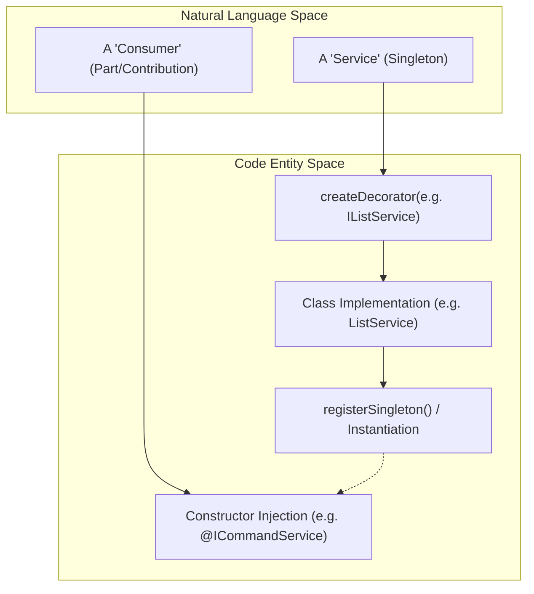
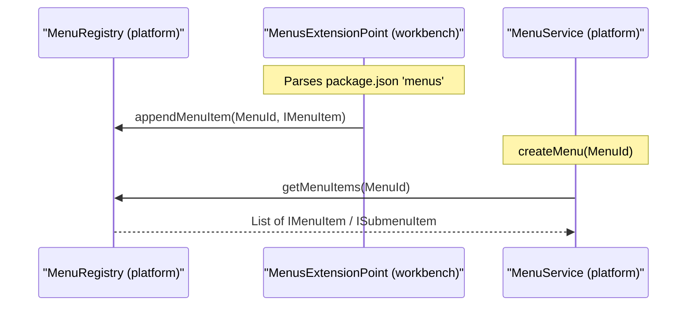
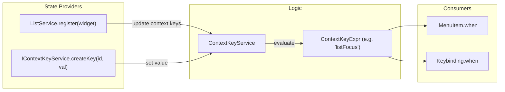

# Core Architectural Layers

Relevant source files

The following files were used as context for generating this wiki page:

- [extensions/git/src/staging.ts](https://github.com/microsoft/vscode/blob/HEAD/extensions/git/src/staging.ts)
- [extensions/theme-defaults/themes/dark_modern.json](https://github.com/microsoft/vscode/blob/HEAD/extensions/theme-defaults/themes/dark_modern.json)
- [extensions/theme-defaults/themes/light_modern.json](https://github.com/microsoft/vscode/blob/HEAD/extensions/theme-defaults/themes/light_modern.json)
- [src/vs/base/browser/contextmenu.ts](https://github.com/microsoft/vscode/blob/HEAD/src/vs/base/browser/contextmenu.ts)
- [src/vs/base/browser/keyboardEvent.ts](https://github.com/microsoft/vscode/blob/HEAD/src/vs/base/browser/keyboardEvent.ts)
- [src/vs/base/browser/ui/actionbar/actionViewItems.ts](https://github.com/microsoft/vscode/blob/HEAD/src/vs/base/browser/ui/actionbar/actionViewItems.ts)
- [src/vs/base/browser/ui/actionbar/actionbar.ts](https://github.com/microsoft/vscode/blob/HEAD/src/vs/base/browser/ui/actionbar/actionbar.ts)
- [src/vs/base/browser/ui/contextview/contextview.ts](https://github.com/microsoft/vscode/blob/HEAD/src/vs/base/browser/ui/contextview/contextview.ts)
- [src/vs/base/browser/ui/dropdown/dropdown.ts](https://github.com/microsoft/vscode/blob/HEAD/src/vs/base/browser/ui/dropdown/dropdown.ts)
- [src/vs/base/browser/ui/dropdown/dropdownActionViewItem.ts](https://github.com/microsoft/vscode/blob/HEAD/src/vs/base/browser/ui/dropdown/dropdownActionViewItem.ts)
- [src/vs/base/browser/ui/list/list.ts](https://github.com/microsoft/vscode/blob/HEAD/src/vs/base/browser/ui/list/list.ts)
- [src/vs/base/browser/ui/list/listPaging.ts](https://github.com/microsoft/vscode/blob/HEAD/src/vs/base/browser/ui/list/listPaging.ts)
- [src/vs/base/browser/ui/list/listView.ts](https://github.com/microsoft/vscode/blob/HEAD/src/vs/base/browser/ui/list/listView.ts)
- [src/vs/base/browser/ui/list/listWidget.ts](https://github.com/microsoft/vscode/blob/HEAD/src/vs/base/browser/ui/list/listWidget.ts)
- [src/vs/base/browser/ui/list/rangeMap.ts](https://github.com/microsoft/vscode/blob/HEAD/src/vs/base/browser/ui/list/rangeMap.ts)
- [src/vs/base/browser/ui/menu/menu.ts](https://github.com/microsoft/vscode/blob/HEAD/src/vs/base/browser/ui/menu/menu.ts)
- [src/vs/base/browser/ui/menu/menubar.ts](https://github.com/microsoft/vscode/blob/HEAD/src/vs/base/browser/ui/menu/menubar.ts)
- [src/vs/base/browser/ui/toolbar/toolbar.ts](https://github.com/microsoft/vscode/blob/HEAD/src/vs/base/browser/ui/toolbar/toolbar.ts)
- [src/vs/base/browser/ui/tree/abstractTree.ts](https://github.com/microsoft/vscode/blob/HEAD/src/vs/base/browser/ui/tree/abstractTree.ts)
- [src/vs/base/browser/ui/tree/asyncDataTree.ts](https://github.com/microsoft/vscode/blob/HEAD/src/vs/base/browser/ui/tree/asyncDataTree.ts)
- [src/vs/base/browser/ui/tree/compressedObjectTreeModel.ts](https://github.com/microsoft/vscode/blob/HEAD/src/vs/base/browser/ui/tree/compressedObjectTreeModel.ts)
- [src/vs/base/browser/ui/tree/dataTree.ts](https://github.com/microsoft/vscode/blob/HEAD/src/vs/base/browser/ui/tree/dataTree.ts)
- [src/vs/base/browser/ui/tree/indexTree.ts](https://github.com/microsoft/vscode/blob/HEAD/src/vs/base/browser/ui/tree/indexTree.ts)
- [src/vs/base/browser/ui/tree/indexTreeModel.ts](https://github.com/microsoft/vscode/blob/HEAD/src/vs/base/browser/ui/tree/indexTreeModel.ts)
- [src/vs/base/browser/ui/tree/objectTree.ts](https://github.com/microsoft/vscode/blob/HEAD/src/vs/base/browser/ui/tree/objectTree.ts)
- [src/vs/base/browser/ui/tree/objectTreeModel.ts](https://github.com/microsoft/vscode/blob/HEAD/src/vs/base/browser/ui/tree/objectTreeModel.ts)
- [src/vs/base/browser/ui/tree/tree.ts](https://github.com/microsoft/vscode/blob/HEAD/src/vs/base/browser/ui/tree/tree.ts)
- [src/vs/base/common/actions.ts](https://github.com/microsoft/vscode/blob/HEAD/src/vs/base/common/actions.ts)
- [src/vs/base/common/errors.ts](https://github.com/microsoft/vscode/blob/HEAD/src/vs/base/common/errors.ts)
- [src/vs/base/common/event.ts](https://github.com/microsoft/vscode/blob/HEAD/src/vs/base/common/event.ts)
- [src/vs/base/common/iterator.ts](https://github.com/microsoft/vscode/blob/HEAD/src/vs/base/common/iterator.ts)
- [src/vs/base/common/keyCodes.ts](https://github.com/microsoft/vscode/blob/HEAD/src/vs/base/common/keyCodes.ts)
- [src/vs/base/common/keybindingLabels.ts](https://github.com/microsoft/vscode/blob/HEAD/src/vs/base/common/keybindingLabels.ts)
- [src/vs/base/common/lifecycle.ts](https://github.com/microsoft/vscode/blob/HEAD/src/vs/base/common/lifecycle.ts)
- [src/vs/base/test/browser/ui/contextview/contextview.test.ts](https://github.com/microsoft/vscode/blob/HEAD/src/vs/base/test/browser/ui/contextview/contextview.test.ts)
- [src/vs/base/test/browser/ui/list/rangeMap.test.ts](https://github.com/microsoft/vscode/blob/HEAD/src/vs/base/test/browser/ui/list/rangeMap.test.ts)
- [src/vs/base/test/browser/ui/menu/menu.test.ts](https://github.com/microsoft/vscode/blob/HEAD/src/vs/base/test/browser/ui/menu/menu.test.ts)
- [src/vs/base/test/browser/ui/splitview/splitview.test.ts](https://github.com/microsoft/vscode/blob/HEAD/src/vs/base/test/browser/ui/splitview/splitview.test.ts)
- [src/vs/base/test/browser/ui/toolbar/toolbar.test.ts](https://github.com/microsoft/vscode/blob/HEAD/src/vs/base/test/browser/ui/toolbar/toolbar.test.ts)
- [src/vs/base/test/browser/ui/tree/asyncDataTree.test.ts](https://github.com/microsoft/vscode/blob/HEAD/src/vs/base/test/browser/ui/tree/asyncDataTree.test.ts)
- [src/vs/base/test/browser/ui/tree/compressedObjectTreeModel.test.ts](https://github.com/microsoft/vscode/blob/HEAD/src/vs/base/test/browser/ui/tree/compressedObjectTreeModel.test.ts)
- [src/vs/base/test/browser/ui/tree/indexTreeModel.test.ts](https://github.com/microsoft/vscode/blob/HEAD/src/vs/base/test/browser/ui/tree/indexTreeModel.test.ts)
- [src/vs/base/test/browser/ui/tree/objectTree.test.ts](https://github.com/microsoft/vscode/blob/HEAD/src/vs/base/test/browser/ui/tree/objectTree.test.ts)
- [src/vs/base/test/browser/ui/tree/objectTreeModel.test.ts](https://github.com/microsoft/vscode/blob/HEAD/src/vs/base/test/browser/ui/tree/objectTreeModel.test.ts)
- [src/vs/base/test/common/errors.test.ts](https://github.com/microsoft/vscode/blob/HEAD/src/vs/base/test/common/errors.test.ts)
- [src/vs/base/test/common/event.test.ts](https://github.com/microsoft/vscode/blob/HEAD/src/vs/base/test/common/event.test.ts)
- [src/vs/base/test/common/iterator.test.ts](https://github.com/microsoft/vscode/blob/HEAD/src/vs/base/test/common/iterator.test.ts)
- [src/vs/base/test/common/keyCodes.test.ts](https://github.com/microsoft/vscode/blob/HEAD/src/vs/base/test/common/keyCodes.test.ts)
- [src/vs/base/test/common/lifecycle.test.ts](https://github.com/microsoft/vscode/blob/HEAD/src/vs/base/test/common/lifecycle.test.ts)
- [src/vs/base/test/common/utils.ts](https://github.com/microsoft/vscode/blob/HEAD/src/vs/base/test/common/utils.ts)
- [src/vs/editor/browser/config/elementSizeObserver.ts](https://github.com/microsoft/vscode/blob/HEAD/src/vs/editor/browser/config/elementSizeObserver.ts)
- [src/vs/editor/browser/widget/diffEditor/commands.ts](https://github.com/microsoft/vscode/blob/HEAD/src/vs/editor/browser/widget/diffEditor/commands.ts)
- [src/vs/editor/browser/widget/diffEditor/diffEditor.contribution.ts](https://github.com/microsoft/vscode/blob/HEAD/src/vs/editor/browser/widget/diffEditor/diffEditor.contribution.ts)
- [src/vs/editor/contrib/hover/test/browser/hoverCopyButton.test.ts](https://github.com/microsoft/vscode/blob/HEAD/src/vs/editor/contrib/hover/test/browser/hoverCopyButton.test.ts)
- [src/vs/editor/standalone/browser/standalone-tokens.css](https://github.com/microsoft/vscode/blob/HEAD/src/vs/editor/standalone/browser/standalone-tokens.css)
- [src/vs/platform/action/common/action.ts](https://github.com/microsoft/vscode/blob/HEAD/src/vs/platform/action/common/action.ts)
- [src/vs/platform/actions/browser/actionViewItemService.ts](https://github.com/microsoft/vscode/blob/HEAD/src/vs/platform/actions/browser/actionViewItemService.ts)
- [src/vs/platform/actions/browser/menuEntryActionViewItem.ts](https://github.com/microsoft/vscode/blob/HEAD/src/vs/platform/actions/browser/menuEntryActionViewItem.ts)
- [src/vs/platform/actions/browser/toolbar.ts](https://github.com/microsoft/vscode/blob/HEAD/src/vs/platform/actions/browser/toolbar.ts)
- [src/vs/platform/actions/common/actions.ts](https://github.com/microsoft/vscode/blob/HEAD/src/vs/platform/actions/common/actions.ts)
- [src/vs/platform/actions/common/menuService.ts](https://github.com/microsoft/vscode/blob/HEAD/src/vs/platform/actions/common/menuService.ts)
- [src/vs/platform/actions/test/common/menuService.test.ts](https://github.com/microsoft/vscode/blob/HEAD/src/vs/platform/actions/test/common/menuService.test.ts)
- [src/vs/platform/contextkey/browser/contextKeyService.ts](https://github.com/microsoft/vscode/blob/HEAD/src/vs/platform/contextkey/browser/contextKeyService.ts)
- [src/vs/platform/contextkey/common/contextkey.ts](https://github.com/microsoft/vscode/blob/HEAD/src/vs/platform/contextkey/common/contextkey.ts)
- [src/vs/platform/contextkey/common/scanner.ts](https://github.com/microsoft/vscode/blob/HEAD/src/vs/platform/contextkey/common/scanner.ts)
- [src/vs/platform/contextkey/test/browser/contextkey.test.ts](https://github.com/microsoft/vscode/blob/HEAD/src/vs/platform/contextkey/test/browser/contextkey.test.ts)
- [src/vs/platform/contextkey/test/common/contextkey.test.ts](https://github.com/microsoft/vscode/blob/HEAD/src/vs/platform/contextkey/test/common/contextkey.test.ts)
- [src/vs/platform/contextkey/test/common/parser.test.ts](https://github.com/microsoft/vscode/blob/HEAD/src/vs/platform/contextkey/test/common/parser.test.ts)
- [src/vs/platform/contextkey/test/common/scanner.test.ts](https://github.com/microsoft/vscode/blob/HEAD/src/vs/platform/contextkey/test/common/scanner.test.ts)
- [src/vs/platform/contextview/browser/contextMenuHandler.ts](https://github.com/microsoft/vscode/blob/HEAD/src/vs/platform/contextview/browser/contextMenuHandler.ts)
- [src/vs/platform/contextview/browser/contextMenuService.ts](https://github.com/microsoft/vscode/blob/HEAD/src/vs/platform/contextview/browser/contextMenuService.ts)
- [src/vs/platform/contextview/browser/contextView.ts](https://github.com/microsoft/vscode/blob/HEAD/src/vs/platform/contextview/browser/contextView.ts)
- [src/vs/platform/contextview/browser/contextViewService.ts](https://github.com/microsoft/vscode/blob/HEAD/src/vs/platform/contextview/browser/contextViewService.ts)
- [src/vs/platform/keybinding/common/abstractKeybindingService.ts](https://github.com/microsoft/vscode/blob/HEAD/src/vs/platform/keybinding/common/abstractKeybindingService.ts)
- [src/vs/platform/keybinding/common/baseResolvedKeybinding.ts](https://github.com/microsoft/vscode/blob/HEAD/src/vs/platform/keybinding/common/baseResolvedKeybinding.ts)
- [src/vs/platform/keybinding/common/keybinding.ts](https://github.com/microsoft/vscode/blob/HEAD/src/vs/platform/keybinding/common/keybinding.ts)
- [src/vs/platform/keybinding/common/keybindingResolver.ts](https://github.com/microsoft/vscode/blob/HEAD/src/vs/platform/keybinding/common/keybindingResolver.ts)
- [src/vs/platform/keybinding/common/keybindingsRegistry.ts](https://github.com/microsoft/vscode/blob/HEAD/src/vs/platform/keybinding/common/keybindingsRegistry.ts)
- [src/vs/platform/keybinding/common/resolvedKeybindingItem.ts](https://github.com/microsoft/vscode/blob/HEAD/src/vs/platform/keybinding/common/resolvedKeybindingItem.ts)
- [src/vs/platform/keybinding/common/usLayoutResolvedKeybinding.ts](https://github.com/microsoft/vscode/blob/HEAD/src/vs/platform/keybinding/common/usLayoutResolvedKeybinding.ts)
- [src/vs/platform/keybinding/test/common/keybindingResolver.test.ts](https://github.com/microsoft/vscode/blob/HEAD/src/vs/platform/keybinding/test/common/keybindingResolver.test.ts)
- [src/vs/platform/keybinding/test/common/mockKeybindingService.ts](https://github.com/microsoft/vscode/blob/HEAD/src/vs/platform/keybinding/test/common/mockKeybindingService.ts)
- [src/vs/platform/list/browser/listService.ts](https://github.com/microsoft/vscode/blob/HEAD/src/vs/platform/list/browser/listService.ts)
- [src/vs/platform/observable/common/platformObservableUtils.ts](https://github.com/microsoft/vscode/blob/HEAD/src/vs/platform/observable/common/platformObservableUtils.ts)
- [src/vs/platform/telemetry/browser/errorTelemetry.ts](https://github.com/microsoft/vscode/blob/HEAD/src/vs/platform/telemetry/browser/errorTelemetry.ts)
- [src/vs/platform/telemetry/common/errorTelemetry.ts](https://github.com/microsoft/vscode/blob/HEAD/src/vs/platform/telemetry/common/errorTelemetry.ts)
- [src/vs/platform/telemetry/electron-main/errorTelemetry.ts](https://github.com/microsoft/vscode/blob/HEAD/src/vs/platform/telemetry/electron-main/errorTelemetry.ts)
- [src/vs/platform/telemetry/node/errorTelemetry.ts](https://github.com/microsoft/vscode/blob/HEAD/src/vs/platform/telemetry/node/errorTelemetry.ts)
- [src/vs/platform/theme/common/colorRegistry.ts](https://github.com/microsoft/vscode/blob/HEAD/src/vs/platform/theme/common/colorRegistry.ts)
- [src/vs/platform/userData/common/fileUserDataProvider.ts](https://github.com/microsoft/vscode/blob/HEAD/src/vs/platform/userData/common/fileUserDataProvider.ts)
- [src/vs/platform/userData/test/browser/fileUserDataProvider.test.ts](https://github.com/microsoft/vscode/blob/HEAD/src/vs/platform/userData/test/browser/fileUserDataProvider.test.ts)
- [src/vs/sessions/browser/parts/sessionBarStyles.ts](https://github.com/microsoft/vscode/blob/HEAD/src/vs/sessions/browser/parts/sessionBarStyles.ts)
- [src/vs/workbench/api/browser/mainThreadErrors.ts](https://github.com/microsoft/vscode/blob/HEAD/src/vs/workbench/api/browser/mainThreadErrors.ts)
- [src/vs/workbench/browser/actions/listCommands.ts](https://github.com/microsoft/vscode/blob/HEAD/src/vs/workbench/browser/actions/listCommands.ts)
- [src/vs/workbench/browser/parts/titlebar/menubarControl.ts](https://github.com/microsoft/vscode/blob/HEAD/src/vs/workbench/browser/parts/titlebar/menubarControl.ts)
- [src/vs/workbench/contrib/chat/browser/chatEditing/chatEditing.ts](https://github.com/microsoft/vscode/blob/HEAD/src/vs/workbench/contrib/chat/browser/chatEditing/chatEditing.ts)
- [src/vs/workbench/contrib/commands/common/commands.contribution.ts](https://github.com/microsoft/vscode/blob/HEAD/src/vs/workbench/contrib/commands/common/commands.contribution.ts)
- [src/vs/workbench/services/actions/common/menusExtensionPoint.ts](https://github.com/microsoft/vscode/blob/HEAD/src/vs/workbench/services/actions/common/menusExtensionPoint.ts)
- [src/vs/workbench/services/extensions/test/browser/extensionStorageMigration.test.ts](https://github.com/microsoft/vscode/blob/HEAD/src/vs/workbench/services/extensions/test/browser/extensionStorageMigration.test.ts)
- [src/vs/workbench/services/keybinding/browser/keybindingService.ts](https://github.com/microsoft/vscode/blob/HEAD/src/vs/workbench/services/keybinding/browser/keybindingService.ts)
- [src/vs/workbench/services/keybinding/common/keybindingIO.ts](https://github.com/microsoft/vscode/blob/HEAD/src/vs/workbench/services/keybinding/common/keybindingIO.ts)
- [src/vs/workbench/services/keybinding/common/macLinuxKeyboardMapper.ts](https://github.com/microsoft/vscode/blob/HEAD/src/vs/workbench/services/keybinding/common/macLinuxKeyboardMapper.ts)
- [src/vs/workbench/services/keybinding/common/windowsKeyboardMapper.ts](https://github.com/microsoft/vscode/blob/HEAD/src/vs/workbench/services/keybinding/common/windowsKeyboardMapper.ts)
- [src/vs/workbench/services/keybinding/test/browser/keybindingEditing.test.ts](https://github.com/microsoft/vscode/blob/HEAD/src/vs/workbench/services/keybinding/test/browser/keybindingEditing.test.ts)
- [src/vs/workbench/services/keybinding/test/browser/keybindingIO.test.ts](https://github.com/microsoft/vscode/blob/HEAD/src/vs/workbench/services/keybinding/test/browser/keybindingIO.test.ts)

The VS Code codebase is organized into a strict layering model designed to ensure portability across different environments (Desktop Electron, Web Browser, and Remote Server) while maintaining a clean separation of concerns. This model is enforced by ESLint rules that prevent lower layers from importing from higher layers.

## Layering Model

The architecture follows a unidirectional dependency flow: `base` → `platform` → `editor` → `workbench` → `sessions`.

| Layer | Purpose | Key Contents |
| :--- | :--- | :--- |
| **base** | General-purpose utilities and UI libraries. No dependencies on other layers. | `vs/base/common/event.ts` [src/vs/base/common/event.ts:1-48](https://github.com/microsoft/vscode/blob/HEAD/src/vs/base/common/event.ts#L1-L48), `vs/base/common/lifecycle.ts` [src/vs/base/common/lifecycle.ts:8-14](https://github.com/microsoft/vscode/blob/HEAD/src/vs/base/common/lifecycle.ts#L8-L14) |
| **platform** | Shared services and infrastructure used across the editor and workbench. | `vs/platform/instantiation` [src/vs/platform/instantiation/common/instantiation.ts:15-15](https://github.com/microsoft/vscode/blob/HEAD/src/vs/platform/instantiation/common/instantiation.ts#L15), `vs/platform/contextkey` [src/vs/platform/contextkey/common/contextkey.ts:14-14](https://github.com/microsoft/vscode/blob/HEAD/src/vs/platform/contextkey/common/contextkey.ts#L14), `vs/platform/list` [src/vs/platform/list/browser/listService.ts:36-36](https://github.com/microsoft/vscode/blob/HEAD/src/vs/platform/list/browser/listService.ts#L36) |
| **editor** | The "Monaco" editor core. Can be used standalone without the workbench. | `vs/editor/common/model/textModel.ts` [src/vs/editor/common/model/textModelTokens.ts:1-10](https://github.com/microsoft/vscode/blob/HEAD/src/vs/editor/common/model/textModelTokens.ts#L1-L10) |
| **workbench** | The shell surrounding the editor (Side Bar, Panel, Status Bar, etc.). | `vs/workbench/services/actions/common/menusExtensionPoint.ts` [src/vs/workbench/services/actions/common/menusExtensionPoint.ts:12-12](https://github.com/microsoft/vscode/blob/HEAD/src/vs/workbench/services/actions/common/menusExtensionPoint.ts#L12) |
| **sessions** | Specialized layers for agent-based workflows and the Agents Window. | `vs/sessions/browser/workbench.ts` [src/vs/sessions/browser/workbench.ts:1-10](https://github.com/microsoft/vscode/blob/HEAD/src/vs/sessions/browser/workbench.ts#L1-L10) |

### Layering Rules and Enforcement
The layering is strictly enforced by ESLint. Low-level layers like `vs/base` provide primitives like `IDisposable` [src/vs/base/common/lifecycle.ts:11-11](https://github.com/microsoft/vscode/blob/HEAD/src/vs/base/common/lifecycle.ts#L11) and `Event<T>` [src/vs/base/common/event.ts:46-48](https://github.com/microsoft/vscode/blob/HEAD/src/vs/base/common/event.ts#L46-L48) which are used by all subsequent layers. Higher layers like `workbench` depend on `platform` services to handle cross-cutting concerns like keybindings via `IKeybindingService` [src/vs/platform/keybinding/common/keybinding.ts:37-37](https://github.com/microsoft/vscode/blob/HEAD/src/vs/platform/keybinding/common/keybinding.ts#L37).

**Sources:** [src/vs/base/common/lifecycle.ts:1-17](https://github.com/microsoft/vscode/blob/HEAD/src/vs/base/common/lifecycle.ts#L1-L17), [src/vs/base/common/event.ts:1-50](https://github.com/microsoft/vscode/blob/HEAD/src/vs/base/common/event.ts#L1-L50), [src/vs/platform/instantiation/common/instantiation.ts:1-15](https://github.com/microsoft/vscode/blob/HEAD/src/vs/platform/instantiation/common/instantiation.ts#L1-L15).

---

## Dependency Injection (DI)

VS Code uses a custom dependency injection system to manage service lifecycles and decoupling. Services are identified by decorators created via `createDecorator`.

### Service Definition and Registration
Services are typically split into an interface (in a `common` folder) and one or more implementations (in `browser`, `node`, or `electron-browser` folders).

1.  **Create Decorator**: Define a service identifier using `createDecorator<T>(serviceId: string)`. [src/vs/platform/instantiation/common/instantiation.ts:15-15](https://github.com/microsoft/vscode/blob/HEAD/src/vs/platform/instantiation/common/instantiation.ts#L15)
2.  **Registration**: Implementations are often registered as singletons. For example, `IListService` [src/vs/platform/list/browser/listService.ts:36-36](https://github.com/microsoft/vscode/blob/HEAD/src/vs/platform/list/browser/listService.ts#L36) is implemented by `ListService` [src/vs/platform/list/browser/listService.ts:53-53](https://github.com/microsoft/vscode/blob/HEAD/src/vs/platform/list/browser/listService.ts#L53).
3.  **Consumption**: Use the decorator in a constructor to inject the service. For example, `MenuEntryActionViewItem` injects `IKeybindingService`, `ICommandService`, and others to resolve action states [src/vs/platform/actions/browser/menuEntryActionViewItem.ts:26-30](https://github.com/microsoft/vscode/blob/HEAD/src/vs/platform/actions/browser/menuEntryActionViewItem.ts#L26-L30).

### Mapping Code Entities to DI Concepts

Title: Dependency Injection Entity Mapping

**Sources:** [src/vs/platform/instantiation/common/instantiation.ts:11-15](https://github.com/microsoft/vscode/blob/HEAD/src/vs/platform/instantiation/common/instantiation.ts#L11-L15), [src/vs/platform/list/browser/listService.ts:36-55](https://github.com/microsoft/vscode/blob/HEAD/src/vs/platform/list/browser/listService.ts#L36-L55), [src/vs/platform/actions/browser/menuEntryActionViewItem.ts:23-39](https://github.com/microsoft/vscode/blob/HEAD/src/vs/platform/actions/browser/menuEntryActionViewItem.ts#L23-L39).

---

## Contribution and Registry Pattern

The workbench is extended via a "Contribution" pattern. Features register themselves into global registries, allowing the system to remain decoupled.

### Key Registries and Implementation
*   **Registry**: The global entry point for all registries, accessed via `Registry.as<T>(ID)`. [src/vs/platform/registry/common/platform.ts:30-30](https://github.com/microsoft/vscode/blob/HEAD/src/vs/platform/registry/common/platform.ts#L30)
*   **MenuRegistry**: Handles command-to-menu mappings. Items are added via `MenuRegistry.appendMenuItem` or `MenuRegistry.addCommand`. [src/vs/platform/actions/common/actions.ts:70-134](https://github.com/microsoft/vscode/blob/HEAD/src/vs/platform/actions/common/actions.ts#L70-L134)
*   **ColorRegistry**: Manages workbench colors and themeable tokens. [src/vs/platform/theme/common/colorRegistry.ts:1-19](https://github.com/microsoft/vscode/blob/HEAD/src/vs/platform/theme/common/colorRegistry.ts#L1-L19)
*   **ExtensionsRegistry**: Used to register extension points like `menus` [src/vs/workbench/services/actions/common/menusExtensionPoint.ts:10-12](https://github.com/microsoft/vscode/blob/HEAD/src/vs/workbench/services/actions/common/menusExtensionPoint.ts#L10-L12).

### Data Flow for Feature Contributions
Title: Contribution Registration Flow

**Sources:** [src/vs/platform/registry/common/platform.ts:1-30](https://github.com/microsoft/vscode/blob/HEAD/src/vs/platform/registry/common/platform.ts#L1-L30), [src/vs/platform/actions/common/actions.ts:12-134](https://github.com/microsoft/vscode/blob/HEAD/src/vs/platform/actions/common/actions.ts#L12-L134), [src/vs/workbench/services/actions/common/menusExtensionPoint.ts:1-181](https://github.com/microsoft/vscode/blob/HEAD/src/vs/workbench/services/actions/common/menusExtensionPoint.ts#L1-L181).

---

## Core Utilities: Events and Lifecycle

The `base` layer provides the fundamental building blocks for reactivity and resource management.

### Lifecycle Management (`IDisposable`)
VS Code uses the `IDisposable` pattern to prevent memory leaks.
*   **Disposable**: A base class that provides a `_register` method to track child disposables. [src/vs/base/common/lifecycle.ts:14-14](https://github.com/microsoft/vscode/blob/HEAD/src/vs/base/common/lifecycle.ts#L14)
*   **DisposableStore**: A container that holds multiple disposables and disposes them all at once. [src/vs/base/common/lifecycle.ts:11-11](https://github.com/microsoft/vscode/blob/HEAD/src/vs/base/common/lifecycle.ts#L11)
*   **MutableDisposable**: A wrapper for a single disposable that can be replaced, automatically disposing the old one. [src/vs/base/common/lifecycle.ts:9-9](https://github.com/microsoft/vscode/blob/HEAD/src/vs/base/common/lifecycle.ts#L9)

### Eventing (`Event<T>`)
An `Event` is a function that takes a listener and returns an `IDisposable`. [src/vs/base/common/event.ts:46-48](https://github.com/microsoft/vscode/blob/HEAD/src/vs/base/common/event.ts#L46-L48)
*   **Emitter**: The standard way to create an event. Calling `fire(data)` on an `Emitter<T>` triggers all listeners. [src/vs/base/common/event.ts:49-50](https://github.com/microsoft/vscode/blob/HEAD/src/vs/base/common/event.ts#L49-L50)
*   **Relay**: A utility that can forward events from different sources. [src/vs/base/browser/ui/tree/abstractTree.ts:28-28](https://github.com/microsoft/vscode/blob/HEAD/src/vs/base/browser/ui/tree/abstractTree.ts#L28)

**Sources:** [src/vs/base/common/lifecycle.ts:1-31](https://github.com/microsoft/vscode/blob/HEAD/src/vs/base/common/lifecycle.ts#L1-L31), [src/vs/base/common/event.ts:1-60](https://github.com/microsoft/vscode/blob/HEAD/src/vs/base/common/event.ts#L1-L60).

---

## Context Keys and UI State

The `platform` layer provides the `ContextKey` system, which allows the UI and keybindings to react to state changes.

*   **ContextKeyExpr**: A language for defining boolean expressions (e.g., `when` clauses in `package.json`). [src/vs/platform/contextkey/common/contextkey.ts:14-14](https://github.com/microsoft/vscode/blob/HEAD/src/vs/platform/contextkey/common/contextkey.ts#L14)
*   **IContextKeyService**: Manages the hierarchy of contexts and evaluates expressions. [src/vs/platform/contextkey/common/contextkey.ts:23-23](https://github.com/microsoft/vscode/blob/HEAD/src/vs/platform/contextkey/common/contextkey.ts#L23)
*   **Workbench Context Keys**: Specific keys like `listFocus` [src/vs/platform/list/browser/listService.ts:116-116](https://github.com/microsoft/vscode/blob/HEAD/src/vs/platform/list/browser/listService.ts#L116) or `listMultiSelection` [src/vs/platform/list/browser/listService.ts:122-122](https://github.com/microsoft/vscode/blob/HEAD/src/vs/platform/list/browser/listService.ts#L122) are used to control command availability.

Title: Context Key State Flow

**Sources:** [src/vs/platform/contextkey/common/contextkey.ts:14-23](https://github.com/microsoft/vscode/blob/HEAD/src/vs/platform/contextkey/common/contextkey.ts#L14-L23), [src/vs/platform/list/browser/listService.ts:108-125](https://github.com/microsoft/vscode/blob/HEAD/src/vs/platform/list/browser/listService.ts#L108-L125).

---

## UI Foundations: Lists and Trees

VS Code uses a highly optimized virtualization engine for lists and trees, located in `vs/base/browser/ui`.

*   **ListView**: The core virtualization engine that manages the DOM for large sets of items. [src/vs/base/browser/ui/list/listView.ts:115-115](https://github.com/microsoft/vscode/blob/HEAD/src/vs/base/browser/ui/list/listView.ts#L115)
*   **List**: A widget that adds selection, focus, and keyboard navigation logic. [src/vs/base/browser/ui/list/listWidget.ts:117-117](https://github.com/microsoft/vscode/blob/HEAD/src/vs/base/browser/ui/list/listWidget.ts#L117)
*   **AbstractTree**: A base class for tree structures that maps hierarchical data to a flat list for virtualization. [src/vs/base/browser/ui/tree/abstractTree.ts:65-65](https://github.com/microsoft/vscode/blob/HEAD/src/vs/base/browser/ui/tree/abstractTree.ts#L65)
*   **AsyncDataTree**: A specialized tree for data that is loaded lazily via an `IAsyncDataSource`. It handles loading states and twistie rendering [src/vs/base/browser/ui/tree/asyncDataTree.ts:96-126](https://github.com/microsoft/vscode/blob/HEAD/src/vs/base/browser/ui/tree/asyncDataTree.ts#L96-L126).

**Sources:** [src/vs/base/browser/ui/list/listWidget.ts:1-117](https://github.com/microsoft/vscode/blob/HEAD/src/vs/base/browser/ui/list/listWidget.ts#L1-L117), [src/vs/base/browser/ui/tree/abstractTree.ts:1-65](https://github.com/microsoft/vscode/blob/HEAD/src/vs/base/browser/ui/tree/abstractTree.ts#L1-L65), [src/vs/base/browser/ui/list/listView.ts:1-115](https://github.com/microsoft/vscode/blob/HEAD/src/vs/base/browser/ui/list/listView.ts#L1-L115), [src/vs/base/browser/ui/tree/asyncDataTree.ts:30-133](https://github.com/microsoft/vscode/blob/HEAD/src/vs/base/browser/ui/tree/asyncDataTree.ts#L30-L133).1a:T2b6f