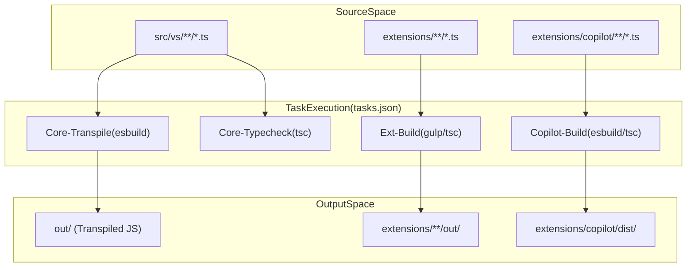
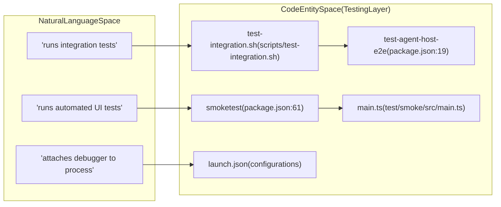

# Getting Started: Development Environment

Relevant source files

The following files were used as context for generating this wiki page:

- [.npmrc](https://github.com/microsoft/vscode/blob/HEAD/.npmrc)
- [.nvmrc](https://github.com/microsoft/vscode/blob/HEAD/.nvmrc)
- [.vscode-test.js](https://github.com/microsoft/vscode/blob/HEAD/.vscode-test.js)
- [.vscode/launch.json](https://github.com/microsoft/vscode/blob/HEAD/.vscode/launch.json)
- [.vscode/tasks.json](https://github.com/microsoft/vscode/blob/HEAD/.vscode/tasks.json)
- [build/azure-pipelines/linux/setup-env.sh](https://github.com/microsoft/vscode/blob/HEAD/build/azure-pipelines/linux/setup-env.sh)
- [build/checksums/electron.txt](https://github.com/microsoft/vscode/blob/HEAD/build/checksums/electron.txt)
- [build/checksums/nodejs.txt](https://github.com/microsoft/vscode/blob/HEAD/build/checksums/nodejs.txt)
- [build/linux/debian/calculate-deps.ts](https://github.com/microsoft/vscode/blob/HEAD/build/linux/debian/calculate-deps.ts)
- [build/linux/debian/dep-lists.ts](https://github.com/microsoft/vscode/blob/HEAD/build/linux/debian/dep-lists.ts)
- [build/linux/dependencies-generator.ts](https://github.com/microsoft/vscode/blob/HEAD/build/linux/dependencies-generator.ts)
- [build/linux/rpm/dep-lists.ts](https://github.com/microsoft/vscode/blob/HEAD/build/linux/rpm/dep-lists.ts)
- [cgmanifest.json](https://github.com/microsoft/vscode/blob/HEAD/cgmanifest.json)
- [extensions/copilot/chat-lib/package-lock.json](https://github.com/microsoft/vscode/blob/HEAD/extensions/copilot/chat-lib/package-lock.json)
- [extensions/copilot/chat-lib/package.json](https://github.com/microsoft/vscode/blob/HEAD/extensions/copilot/chat-lib/package.json)
- [extensions/copilot/package-lock.json](https://github.com/microsoft/vscode/blob/HEAD/extensions/copilot/package-lock.json)
- [package-lock.json](https://github.com/microsoft/vscode/blob/HEAD/package-lock.json)
- [package.json](https://github.com/microsoft/vscode/blob/HEAD/package.json)
- [remote/.npmrc](https://github.com/microsoft/vscode/blob/HEAD/remote/.npmrc)
- [remote/package-lock.json](https://github.com/microsoft/vscode/blob/HEAD/remote/package-lock.json)
- [remote/package.json](https://github.com/microsoft/vscode/blob/HEAD/remote/package.json)
- [remote/web/package-lock.json](https://github.com/microsoft/vscode/blob/HEAD/remote/web/package-lock.json)
- [remote/web/package.json](https://github.com/microsoft/vscode/blob/HEAD/remote/web/package.json)
- [scripts/test-integration.bat](https://github.com/microsoft/vscode/blob/HEAD/scripts/test-integration.bat)
- [scripts/test-integration.sh](https://github.com/microsoft/vscode/blob/HEAD/scripts/test-integration.sh)
- [scripts/test-remote-integration.bat](https://github.com/microsoft/vscode/blob/HEAD/scripts/test-remote-integration.bat)
- [scripts/test-remote-integration.sh](https://github.com/microsoft/vscode/blob/HEAD/scripts/test-remote-integration.sh)
- [scripts/test-web-integration.bat](https://github.com/microsoft/vscode/blob/HEAD/scripts/test-web-integration.bat)
- [scripts/test-web-integration.sh](https://github.com/microsoft/vscode/blob/HEAD/scripts/test-web-integration.sh)
- [src/typings/editContext.d.ts](https://github.com/microsoft/vscode/blob/HEAD/src/typings/editContext.d.ts)
- [src/vs/base/common/codiconsLibrary.ts](https://github.com/microsoft/vscode/blob/HEAD/src/vs/base/common/codiconsLibrary.ts)
- [src/vs/workbench/services/driver/browser/driver.ts](https://github.com/microsoft/vscode/blob/HEAD/src/vs/workbench/services/driver/browser/driver.ts)
- [test/automation/src/application.ts](https://github.com/microsoft/vscode/blob/HEAD/test/automation/src/application.ts)
- [test/automation/src/code.ts](https://github.com/microsoft/vscode/blob/HEAD/test/automation/src/code.ts)
- [test/automation/src/debug.ts](https://github.com/microsoft/vscode/blob/HEAD/test/automation/src/debug.ts)
- [test/automation/src/editor.ts](https://github.com/microsoft/vscode/blob/HEAD/test/automation/src/editor.ts)
- [test/automation/src/editors.ts](https://github.com/microsoft/vscode/blob/HEAD/test/automation/src/editors.ts)
- [test/automation/src/extensions.ts](https://github.com/microsoft/vscode/blob/HEAD/test/automation/src/extensions.ts)
- [test/automation/src/notebook.ts](https://github.com/microsoft/vscode/blob/HEAD/test/automation/src/notebook.ts)
- [test/automation/src/playwrightDriver.ts](https://github.com/microsoft/vscode/blob/HEAD/test/automation/src/playwrightDriver.ts)
- [test/automation/src/scm.ts](https://github.com/microsoft/vscode/blob/HEAD/test/automation/src/scm.ts)
- [test/automation/src/search.ts](https://github.com/microsoft/vscode/blob/HEAD/test/automation/src/search.ts)
- [test/automation/src/settings.ts](https://github.com/microsoft/vscode/blob/HEAD/test/automation/src/settings.ts)
- [test/smoke/src/areas/extensions/extensions.test.ts](https://github.com/microsoft/vscode/blob/HEAD/test/smoke/src/areas/extensions/extensions.test.ts)
- [test/smoke/src/areas/languages/languages.test.ts](https://github.com/microsoft/vscode/blob/HEAD/test/smoke/src/areas/languages/languages.test.ts)
- [test/smoke/src/areas/multiroot/multiroot.test.ts](https://github.com/microsoft/vscode/blob/HEAD/test/smoke/src/areas/multiroot/multiroot.test.ts)
- [test/smoke/src/areas/notebook/notebook.test.ts](https://github.com/microsoft/vscode/blob/HEAD/test/smoke/src/areas/notebook/notebook.test.ts)
- [test/smoke/src/areas/preferences/preferences.test.ts](https://github.com/microsoft/vscode/blob/HEAD/test/smoke/src/areas/preferences/preferences.test.ts)
- [test/smoke/src/areas/search/search.test.ts](https://github.com/microsoft/vscode/blob/HEAD/test/smoke/src/areas/search/search.test.ts)
- [test/smoke/src/areas/statusbar/statusbar.test.ts](https://github.com/microsoft/vscode/blob/HEAD/test/smoke/src/areas/statusbar/statusbar.test.ts)
- [test/smoke/src/areas/workbench/data-loss.test.ts](https://github.com/microsoft/vscode/blob/HEAD/test/smoke/src/areas/workbench/data-loss.test.ts)
- [test/smoke/src/areas/workbench/launch.test.ts](https://github.com/microsoft/vscode/blob/HEAD/test/smoke/src/areas/workbench/launch.test.ts)
- [test/smoke/src/areas/workbench/localization.test.ts](https://github.com/microsoft/vscode/blob/HEAD/test/smoke/src/areas/workbench/localization.test.ts)
- [test/smoke/src/main.ts](https://github.com/microsoft/vscode/blob/HEAD/test/smoke/src/main.ts)
- [test/smoke/src/utils.ts](https://github.com/microsoft/vscode/blob/HEAD/test/smoke/src/utils.ts)

This page describes how to set up, build, and verify the VS Code development environment. The repository uses a complex multi-process architecture requiring specific orchestration of build tasks, launch configurations, and test runners.

## Development Setup and Build System

VS Code uses a combination of `npm` scripts and `Gulp` to manage its build pipeline. The environment is optimized for a "watch" workflow where changes are transpiled in the background using `esbuild` for speed and `tsc` for type checking.

### Build Tasks
The primary entry point for building is the `VS Code - Build` task, which is a composite task defined in `[.vscode/tasks.json:233-245](https://github.com/microsoft/vscode/blob/HEAD/.vscode/tasks.json#L233-L245)`. It orchestrates four critical sub-watchers:

| Task Label | Script | Purpose |
| :--- | :--- | :--- |
| `Core - Transpile` | `watch-client-transpiled` | Uses `esbuild` to rapidly transpile core TypeScript to JS in `out/` `[.vscode/tasks.json:112-139](https://github.com/microsoft/vscode/blob/HEAD/.vscode/tasks.json#L112-L139)`. |
| `Core - Typecheck` | `watch-clientd` | Runs `tsc` in watch mode for background type safety across the core `[.vscode/tasks.json:142-170](https://github.com/microsoft/vscode/blob/HEAD/.vscode/tasks.json#L142-L170)`. |
| `Ext - Build` | `watch-extensionsd` | Compiles built-in extensions (like `npm`, `git`) using the extension build pipeline `[.vscode/tasks.json:172-199](https://github.com/microsoft/vscode/blob/HEAD/.vscode/tasks.json#L172-L199)`. |
| `Copilot - Build` | `watch-copilotd` | Specific build for the Copilot extension in `extensions/copilot` `[.vscode/tasks.json:201-231](https://github.com/microsoft/vscode/blob/HEAD/.vscode/tasks.json#L201-L231)`. |

Sources: `[.vscode/tasks.json:233-245](https://github.com/microsoft/vscode/blob/HEAD/.vscode/tasks.json#L233-L245)`, `[.vscode/tasks.json:112-231](https://github.com/microsoft/vscode/blob/HEAD/.vscode/tasks.json#L112-L231)`, `[package.json:33-53](https://github.com/microsoft/vscode/blob/HEAD/package.json#L33-L53)`

### Build Process Data Flow
The following diagram illustrates how source code is transformed into a runnable state by the internal build tooling.

**Build Pipeline Data Flow**

Sources: `[.vscode/tasks.json:4-231](https://github.com/microsoft/vscode/blob/HEAD/.vscode/tasks.json#L4-L231)`, `[package.json:25-53](https://github.com/microsoft/vscode/blob/HEAD/package.json#L25-L53)`

---

## Running and Debugging Locally

The repository includes pre-configured scripts and launch targets to run the Electron application or the web-based editor.

### Launching the Editor
- **Desktop (Electron):** Run `./scripts/code.sh` (Linux/macOS) or `.\scripts\code.bat` (Windows) via the `Run VS Code` task `[.vscode/tasks.json:17-30](https://github.com/microsoft/vscode/blob/HEAD/.vscode/tasks.json#L17-L30)`. This task sets the user data directory to `.profile-oss` `[.vscode/tasks.json:25-26](https://github.com/microsoft/vscode/blob/HEAD/.vscode/tasks.json#L25-L26)`.
- **Web/Server:** The `npm run web` script has been replaced by specific server scripts: `./scripts/code-server` and `./scripts/code-web` `[package.json:72](https://github.com/microsoft/vscode/blob/HEAD/package.json#L72)`.

### Debugger Attach Points
Because VS Code is multi-process, the debugger must attach to specific processes. Key configurations in `[.vscode/launch.json](https://github.com/microsoft/vscode/blob/HEAD/.vscode/launch.json)` include:

- **Attach to Main Process:** Port `5875`. Controls window lifecycle and native menus `[.vscode/launch.json:79-89](https://github.com/microsoft/vscode/blob/HEAD/.vscode/launch.json#L79-L89)`.
- **Attach to Extension Host:** Port `5870`. Debugs the environment where extensions run `[.vscode/launch.json:18-26](https://github.com/microsoft/vscode/blob/HEAD/.vscode/launch.json#L18-L26)`.
- **Attach to Shared Process:** Port `5879`. Handles file services and update logic `[.vscode/launch.json:31-37](https://github.com/microsoft/vscode/blob/HEAD/.vscode/launch.json#L31-L37)`.
- **Attach to Agent Host Process:** Port `5878`. Debugs AI agent orchestration and the protocol handler `[.vscode/launch.json:59-66](https://github.com/microsoft/vscode/blob/HEAD/.vscode/launch.json#L59-L66)`.
- **Attach to Pty Host Process:** Port `5877`. Debugs the terminal process management `[.vscode/launch.json:50-55](https://github.com/microsoft/vscode/blob/HEAD/.vscode/launch.json#L50-L55)`.
- **Attach to VS Code (Renderer):** Port `9222`. Attaches to the renderer process using Chrome DevTools Protocol `[.vscode/launch.json:236-248](https://github.com/microsoft/vscode/blob/HEAD/.vscode/launch.json#L236-L248)`.

Sources: `[.vscode/launch.json:18-89](https://github.com/microsoft/vscode/blob/HEAD/.vscode/launch.json#L18-L89)`, `[.vscode/tasks.json:17-30](https://github.com/microsoft/vscode/blob/HEAD/.vscode/tasks.json#L17-L30)`, `[package.json:72](https://github.com/microsoft/vscode/blob/HEAD/package.json#L72)`

---

## Testing Infrastructure

VS Code employs a tiered testing strategy: Unit tests, Integration tests, and Smoke tests.

### Unit and Integration Tests
Unit tests are categorized by environment (Node vs Browser).
- **Node Unit Tests:** Run via `mocha` using the configuration in `test/unit/node/index.js` `[package.json:16](https://github.com/microsoft/vscode/blob/HEAD/package.json#L16)`.
- **Browser Unit Tests:** Executed using Playwright via `test/unit/browser/index.js` `[package.json:14-15](https://github.com/microsoft/vscode/blob/HEAD/package.json#L14-L15)`.
- **Agent Host E2E:** Specific end-to-end tests for the AI agent host platform `[package.json:19](https://github.com/microsoft/vscode/blob/HEAD/package.json#L19)`.
- **Extension API Tests:** Integration tests for the extension API, including `vscode-api-tests` in both single-folder and workspace modes `[.vscode/launch.json:164-198](https://github.com/microsoft/vscode/blob/HEAD/.vscode/launch.json#L164-L198)`.

### Smoke Tests
Smoke tests use Playwright to automate a full instance of VS Code. The smoke test runner is defined in `test/smoke/src/main.ts` `[test/smoke/src/main.ts:1-38](https://github.com/microsoft/vscode/blob/HEAD/test/smoke/src/main.ts#L1-L38)` and supports Electron, Web, and Remote targets `[test/smoke/src/main.ts:75-103](https://github.com/microsoft/vscode/blob/HEAD/test/smoke/src/main.ts#L75-L103)`.

**Automation Entity Mapping**

Sources: `[package.json:13-21](https://github.com/microsoft/vscode/blob/HEAD/package.json#L13-L21)`, `[package.json:61-62](https://github.com/microsoft/vscode/blob/HEAD/package.json#L61-L62)`, `[.vscode/launch.json:1-89](https://github.com/microsoft/vscode/blob/HEAD/.vscode/launch.json#L1-L89)`, `[test/smoke/src/main.ts:1-103](https://github.com/microsoft/vscode/blob/HEAD/test/smoke/src/main.ts#L1-L103)`

### Test Execution Commands
| Target | Command |
| :--- | :--- |
| **Node Unit Tests** | `npm run test-node` `[package.json:16](https://github.com/microsoft/vscode/blob/HEAD/package.json#L16)` |
| **Browser Unit Tests** | `npm run test-browser` `[package.json:14](https://github.com/microsoft/vscode/blob/HEAD/package.json#L14)` |
| **Smoke Tests** | `npm run smoketest` `[package.json:61](https://github.com/microsoft/vscode/blob/HEAD/package.json#L61)` |
| **Agent Host E2E** | `npm run test-agent-host-e2e` `[package.json:19](https://github.com/microsoft/vscode/blob/HEAD/package.json#L19)` |

Sources: `[package.json:13-22](https://github.com/microsoft/vscode/blob/HEAD/package.json#L13-L22)`, `[package.json:61-62](https://github.com/microsoft/vscode/blob/HEAD/package.json#L61-L62)`

---

## Development Scripts and Utilities

The `scripts/` and `build/` directories contain essential utilities for environment maintenance:

- **Hygiene:** The `Gulp Build` launch configuration runs the `hygiene` task to ensure code quality and license headers `[.vscode/launch.json:7-13](https://github.com/microsoft/vscode/blob/HEAD/.vscode/launch.json#L7-L13)`, `[package.json:87](https://github.com/microsoft/vscode/blob/HEAD/package.json#L87)`.
- **Kill Build:** If background watchers hang, specific "kill" tasks like `Kill VS Code - Build` terminate the processes managing `esbuild` and `tsc` `[.vscode/tasks.json:295-303](https://github.com/microsoft/vscode/blob/HEAD/.vscode/tasks.json#L295-L303)`.
- **Cyclic Dependency Check:** A build script to ensure no cyclic dependencies exist in the output `[package.json:22](https://github.com/microsoft/vscode/blob/HEAD/package.json#L22)`.

### Build Environment Configuration
The build system itself is a standalone project.
- **Transpilation:** The `transpile-client` script uses the build orchestrator at `build/next/index.ts` `[package.json:44-45](https://github.com/microsoft/vscode/blob/HEAD/package.json#L44-L45)`.
- **Gulp Pipeline:** Core compilation and watching is managed via `node ./node_modules/gulp/bin/gulp.js` `[package.json:55](https://github.com/microsoft/vscode/blob/HEAD/package.json#L55)`.

Sources: `[package.json:22-55](https://github.com/microsoft/vscode/blob/HEAD/package.json#L22-L55)`, `[package.json:87](https://github.com/microsoft/vscode/blob/HEAD/package.json#L87)`, `[.vscode/tasks.json:295-303](https://github.com/microsoft/vscode/blob/HEAD/.vscode/tasks.json#L295-L303)`, `[.vscode/launch.json:7-13](https://github.com/microsoft/vscode/blob/HEAD/.vscode/launch.json#L7-L13)`