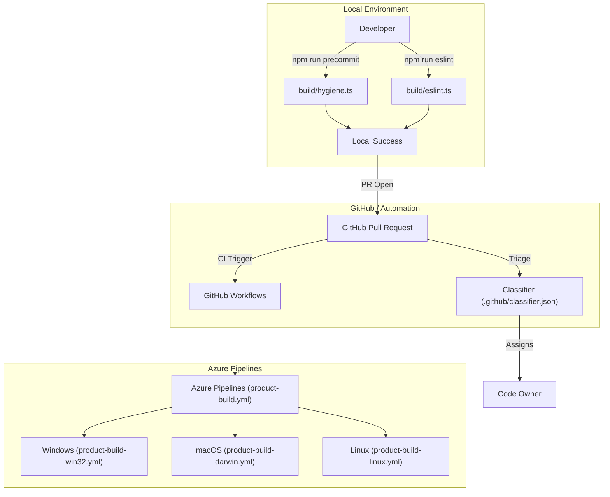
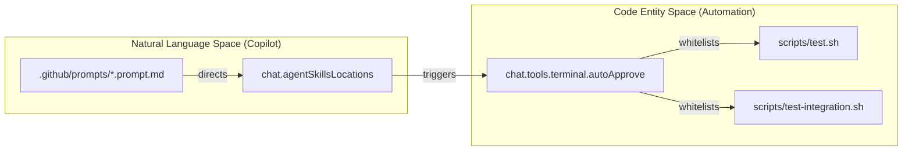

# Contribution Workflow and Repo Automation

Relevant source files

The following files were used as context for generating this wiki page:

- [.github/prompts/codenotify.prompt.md](https://github.com/microsoft/vscode/blob/HEAD/.github/prompts/codenotify.prompt.md)
- [.github/prompts/component.prompt.md](https://github.com/microsoft/vscode/blob/HEAD/.github/prompts/component.prompt.md)
- [.github/prompts/fixIssueNo.prompt.md](https://github.com/microsoft/vscode/blob/HEAD/.github/prompts/fixIssueNo.prompt.md)
- [.github/prompts/implement.prompt.md](https://github.com/microsoft/vscode/blob/HEAD/.github/prompts/implement.prompt.md)
- [.github/prompts/no-any.prompt.md](https://github.com/microsoft/vscode/blob/HEAD/.github/prompts/no-any.prompt.md)
- [.github/prompts/plan-deep.prompt.md](https://github.com/microsoft/vscode/blob/HEAD/.github/prompts/plan-deep.prompt.md)
- [.github/prompts/plan-fast.prompt.md](https://github.com/microsoft/vscode/blob/HEAD/.github/prompts/plan-fast.prompt.md)
- [.github/prompts/setup-environment.prompt.md](https://github.com/microsoft/vscode/blob/HEAD/.github/prompts/setup-environment.prompt.md)
- [.github/prompts/update-instructions.prompt.md](https://github.com/microsoft/vscode/blob/HEAD/.github/prompts/update-instructions.prompt.md)
- [.vscode/settings.json](https://github.com/microsoft/vscode/blob/HEAD/.vscode/settings.json)
- [build/.cachesalt](https://github.com/microsoft/vscode/blob/HEAD/build/.cachesalt)
- [build/azure-pipelines/alpine/product-build-alpine-node-modules.yml](https://github.com/microsoft/vscode/blob/HEAD/build/azure-pipelines/alpine/product-build-alpine-node-modules.yml)
- [build/azure-pipelines/alpine/product-build-alpine.yml](https://github.com/microsoft/vscode/blob/HEAD/build/azure-pipelines/alpine/product-build-alpine.yml)
- [build/azure-pipelines/cli/cli-compile.yml](https://github.com/microsoft/vscode/blob/HEAD/build/azure-pipelines/cli/cli-compile.yml)
- [build/azure-pipelines/common/createBuild.ts](https://github.com/microsoft/vscode/blob/HEAD/build/azure-pipelines/common/createBuild.ts)
- [build/azure-pipelines/common/publish.ts](https://github.com/microsoft/vscode/blob/HEAD/build/azure-pipelines/common/publish.ts)
- [build/azure-pipelines/common/releaseBuild.ts](https://github.com/microsoft/vscode/blob/HEAD/build/azure-pipelines/common/releaseBuild.ts)
- [build/azure-pipelines/copilot/setup-steps.yml](https://github.com/microsoft/vscode/blob/HEAD/build/azure-pipelines/copilot/setup-steps.yml)
- [build/azure-pipelines/darwin/product-build-darwin-node-modules.yml](https://github.com/microsoft/vscode/blob/HEAD/build/azure-pipelines/darwin/product-build-darwin-node-modules.yml)
- [build/azure-pipelines/darwin/product-build-darwin-universal.yml](https://github.com/microsoft/vscode/blob/HEAD/build/azure-pipelines/darwin/product-build-darwin-universal.yml)
- [build/azure-pipelines/darwin/product-build-darwin.yml](https://github.com/microsoft/vscode/blob/HEAD/build/azure-pipelines/darwin/product-build-darwin.yml)
- [build/azure-pipelines/darwin/steps/product-build-darwin-compile.yml](https://github.com/microsoft/vscode/blob/HEAD/build/azure-pipelines/darwin/steps/product-build-darwin-compile.yml)
- [build/azure-pipelines/linux/product-build-linux-node-modules.yml](https://github.com/microsoft/vscode/blob/HEAD/build/azure-pipelines/linux/product-build-linux-node-modules.yml)
- [build/azure-pipelines/linux/product-build-linux.yml](https://github.com/microsoft/vscode/blob/HEAD/build/azure-pipelines/linux/product-build-linux.yml)
- [build/azure-pipelines/linux/steps/product-build-linux-compile.yml](https://github.com/microsoft/vscode/blob/HEAD/build/azure-pipelines/linux/steps/product-build-linux-compile.yml)
- [build/azure-pipelines/product-build.yml](https://github.com/microsoft/vscode/blob/HEAD/build/azure-pipelines/product-build.yml)
- [build/azure-pipelines/product-publish.yml](https://github.com/microsoft/vscode/blob/HEAD/build/azure-pipelines/product-publish.yml)
- [build/azure-pipelines/product-quality-checks.yml](https://github.com/microsoft/vscode/blob/HEAD/build/azure-pipelines/product-quality-checks.yml)
- [build/azure-pipelines/product-release.yml](https://github.com/microsoft/vscode/blob/HEAD/build/azure-pipelines/product-release.yml)
- [build/azure-pipelines/upload-cdn.ts](https://github.com/microsoft/vscode/blob/HEAD/build/azure-pipelines/upload-cdn.ts)
- [build/azure-pipelines/upload-nlsmetadata.ts](https://github.com/microsoft/vscode/blob/HEAD/build/azure-pipelines/upload-nlsmetadata.ts)
- [build/azure-pipelines/upload-sourcemaps.ts](https://github.com/microsoft/vscode/blob/HEAD/build/azure-pipelines/upload-sourcemaps.ts)
- [build/azure-pipelines/web/product-build-web-node-modules.yml](https://github.com/microsoft/vscode/blob/HEAD/build/azure-pipelines/web/product-build-web-node-modules.yml)
- [build/azure-pipelines/web/product-build-web.yml](https://github.com/microsoft/vscode/blob/HEAD/build/azure-pipelines/web/product-build-web.yml)
- [build/azure-pipelines/win32/product-build-win32-node-modules.yml](https://github.com/microsoft/vscode/blob/HEAD/build/azure-pipelines/win32/product-build-win32-node-modules.yml)
- [build/azure-pipelines/win32/product-build-win32.yml](https://github.com/microsoft/vscode/blob/HEAD/build/azure-pipelines/win32/product-build-win32.yml)
- [build/azure-pipelines/win32/sdl-scan-win32.yml](https://github.com/microsoft/vscode/blob/HEAD/build/azure-pipelines/win32/sdl-scan-win32.yml)
- [build/azure-pipelines/win32/steps/product-build-win32-compile.yml](https://github.com/microsoft/vscode/blob/HEAD/build/azure-pipelines/win32/steps/product-build-win32-compile.yml)
- [build/checksums/vscode-sysroot.txt](https://github.com/microsoft/vscode/blob/HEAD/build/checksums/vscode-sysroot.txt)
- [build/lib/nls.ts](https://github.com/microsoft/vscode/blob/HEAD/build/lib/nls.ts)
- [build/linux/debian/install-sysroot.ts](https://github.com/microsoft/vscode/blob/HEAD/build/linux/debian/install-sysroot.ts)

This section documents the repository automation, governance, and developer tooling within the VS Code codebase. It covers the orchestration of GitHub workflows, CI/CD pipelines, repository hygiene, and the integration of AI-assisted development tools.

## Repository Governance and Automation

The VS Code repository utilizes extensive automation to manage a high volume of contributions, issues, and pull requests. This automation is primarily driven by GitHub Actions, custom triage logic, and scripts located in the `build/` and `.github/` directories.

### Issue Triage and Classification
The repository uses a deep-learning classifier to automatically assign labels and owners to incoming issues. This is configured in `.github/classifier.json`, which maps feature areas to specific engineering owners [ .github/classifier.json:1-163 ](https://github.com/microsoft/vscode/blob/HEAD/.github/classifier.json#L1-L163). For example, issues labeled `accessibility` are assigned to `meganrogge` [ .github/classifier.json:8-8 ](https://github.com/microsoft/vscode/blob/HEAD/.github/classifier.json#L8), while `git` related issues are routed to `lszomoru` [ .github/classifier.json:98-98 ](https://github.com/microsoft/vscode/blob/HEAD/.github/classifier.json#L98).

### Hygiene and Pre-commit Hooks
Before code is committed, the repository enforces strict hygiene rules. The `precommit` script (referenced in `package.json`) executes validation logic to check for common issues like incorrect line endings, missing headers, or disallowed patterns [ package.json:54-54 ](https://github.com/microsoft/vscode/blob/HEAD/package.json#L54). This is often handled by `build/hygiene.ts`.

### Repository Tooling
Key developer tools are managed at the root and within the `build/` directory:
*   **ESLint**: The repo uses flat config mode for linting, executed via `build/eslint.ts` [ package.json:79-79 ](https://github.com/microsoft/vscode/blob/HEAD/package.json#L79). Flat config is explicitly enabled in workspace settings [ .vscode/settings.json:190-190 ](https://github.com/microsoft/vscode/blob/HEAD/.vscode/settings.json#L190).
*   **Build Scripts**: The core build orchestration is handled by Gulp, with the binary located at `./node_modules/gulp/bin/gulp.js` [ package.json:55-55 ](https://github.com/microsoft/vscode/blob/HEAD/package.json#L55).
*   **Cyclic Dependency Check**: A dedicated script `build/lib/checkCyclicDependencies.ts` ensures architectural integrity [ package.json:22-22 ](https://github.com/microsoft/vscode/blob/HEAD/package.json#L22).
*   **Layer Validation**: The `valid-layers-check` script runs `build/checker/layersChecker.ts` to enforce the strict layering model (base → platform → editor → workbench) [ package.json:68-68 ](https://github.com/microsoft/vscode/blob/HEAD/package.json#L68).

### Data Flow: Contribution to Build
The following diagram illustrates how a developer contribution moves from local validation to the automated CI pipeline.

**Contribution Validation Pipeline**

**Sources:** [ .github/classifier.json:1-163 ](https://github.com/microsoft/vscode/blob/HEAD/.github/classifier.json#L1-L163), [ package.json:54-87 ](https://github.com/microsoft/vscode/blob/HEAD/package.json#L54-L87), [ build/azure-pipelines/product-build.yml:25-28 ](https://github.com/microsoft/vscode/blob/HEAD/build/azure-pipelines/product-build.yml#L25-L28)

---

## CI/CD and Build Orchestration

The build system is orchestrated via Azure Pipelines, defined in `build/azure-pipelines/`. The system supports multiple "qualities" (exploration, insider, stable) [ build/azure-pipelines/product-build.yml:31-38 ](https://github.com/microsoft/vscode/blob/HEAD/build/azure-pipelines/product-build.yml#L31-L38) and build types (Product, CI) [ build/azure-pipelines/product-build.yml:39-45 ](https://github.com/microsoft/vscode/blob/HEAD/build/azure-pipelines/product-build.yml#L39-L45).

### Build Pipeline Stages
The main pipeline (`product-build.yml`) coordinates platform-specific jobs. It uses a schedule to run builds at specific intervals (05:00, 11:00, 17:00, 23:00 UTC) for the `main` branch [ build/azure-pipelines/product-build.yml:3-23 ](https://github.com/microsoft/vscode/blob/HEAD/build/azure-pipelines/product-build.yml#L3-L23).

| Stage | Platform File | Key Artifacts |
| :--- | :--- | :--- |
| **Windows** | `win32/product-build-win32.yml` | System/User Setup (.exe), Server/Web Zip [ build/azure-pipelines/win32/product-build-win32.yml:50-84 ](https://github.com/microsoft/vscode/blob/HEAD/build/azure-pipelines/win32/product-build-win32.yml#L50-L84) |
| **macOS** | `darwin/product-build-darwin.yml` | .zip, .dmg, Server/Web Zip [ build/azure-pipelines/darwin/product-build-darwin.yml:48-78 ](https://github.com/microsoft/vscode/blob/HEAD/build/azure-pipelines/darwin/product-build-darwin.yml#L48-L78) |
| **Linux** | `linux/product-build-linux.yml` | .deb, .rpm, .snap, Server tar.gz [ build/azure-pipelines/linux/product-build-linux.yml:67-110 ](https://github.com/microsoft/vscode/blob/HEAD/build/azure-pipelines/linux/product-build-linux.yml#L67-L110) |
| **Alpine** | `alpine/product-build-alpine.yml` | MUSL Server tar.gz [ build/azure-pipelines/alpine/product-build-alpine.yml:20-51 ](https://github.com/microsoft/vscode/blob/HEAD/build/azure-pipelines/alpine/product-build-alpine.yml#L20-L51) |
| **Web** | `web/product-build-web.yml` | Standalone Web Archive, CDN Upload [ build/azure-pipelines/web/product-build-web.yml:13-19 ](https://github.com/microsoft/vscode/blob/HEAD/build/azure-pipelines/web/product-build-web.yml#L13-L19), [ build/azure-pipelines/web/product-build-web.yml:153-160 ](https://github.com/microsoft/vscode/blob/HEAD/build/azure-pipelines/web/product-build-web.yml#L153-L160) |

### Artifact Processing and Publishing
After successful platform builds, `product-publish.yml` coordinates the creation of a build version and artifact distribution [ build/azure-pipelines/product-publish.yml:105-107 ](https://github.com/microsoft/vscode/blob/HEAD/build/azure-pipelines/product-publish.yml#L105-L107). This involves:
1.  **Creation**: `build/azure-pipelines/common/createBuild.ts` registers the new version [ build/azure-pipelines/product-publish.yml:107-107 ](https://github.com/microsoft/vscode/blob/HEAD/build/azure-pipelines/product-publish.yml#L107).
2.  **Publishing**: `build/azure-pipelines/common/publish.ts` handles the actual upload and ESRP signing [ build/azure-pipelines/product-publish.yml:123-132 ](https://github.com/microsoft/vscode/blob/HEAD/build/azure-pipelines/product-publish.yml#L123-L132).
3.  **Release**: For scheduled Insider builds, `build/azure-pipelines/common/releaseBuild.ts` triggers the release [ build/azure-pipelines/product-publish.yml:134-143 ](https://github.com/microsoft/vscode/blob/HEAD/build/azure-pipelines/product-publish.yml#L134-L143).

**Sources:** [ build/azure-pipelines/product-build.yml:1-110 ](https://github.com/microsoft/vscode/blob/HEAD/build/azure-pipelines/product-build.yml#L1-L110), [ build/azure-pipelines/win32/product-build-win32.yml:1-103 ](https://github.com/microsoft/vscode/blob/HEAD/build/azure-pipelines/win32/product-build-win32.yml#L1-L103), [ build/azure-pipelines/darwin/product-build-darwin.yml:1-93 ](https://github.com/microsoft/vscode/blob/HEAD/build/azure-pipelines/darwin/product-build-darwin.yml#L1-L93), [ build/azure-pipelines/product-publish.yml:1-143 ](https://github.com/microsoft/vscode/blob/HEAD/build/azure-pipelines/product-publish.yml#L1-L143)

---

## AI and Agentic Tooling Automation

The repository includes specialized configurations for AI-assisted development, specifically for GitHub Copilot and agentic workflows.

### Prompt Engineering and Skills
The repository contains a set of reusable prompts and instructions for AI agents in `.github/prompts/`. These define specific behaviors for tasks such as:
*   **Issue Fixing**: `fixIssueNo.prompt.md` guides agents in resolving specific issues.
*   **Planning**: `plan-deep.prompt.md` and `plan-fast.prompt.md` provide different levels of task decomposition.
*   **Component Creation**: `component.prompt.md` defines standards for new UI components.

Developer settings in `.vscode/settings.json` define where these skills are located via `chat.agentSkillsLocations` [ .vscode/settings.json:214-218 ](https://github.com/microsoft/vscode/blob/HEAD/.vscode/settings.json#L214-L218).

### Agent Tooling Safety
To ensure safe execution of AI-generated commands, the repository uses an auto-approval mechanism for specific scripts. Tools like `scripts/test.sh` and `scripts/test-integration.sh` are pre-approved for terminal execution by AI agents [ .vscode/settings.json:4-9 ](https://github.com/microsoft/vscode/blob/HEAD/.vscode/settings.json#L4-L9).

**AI-Code Interaction Mapping**

**Sources:** [ .vscode/settings.json:1-219 ](https://github.com/microsoft/vscode/blob/HEAD/.vscode/settings.json#L1-L219), [ .github/prompts/plan-deep.prompt.md ](https://github.com/microsoft/vscode/blob/HEAD/.github/prompts/plan-deep.prompt.md), [ .github/prompts/fixIssueNo.prompt.md ](https://github.com/microsoft/vscode/blob/HEAD/.github/prompts/fixIssueNo.prompt.md)

---

## Milestone and Issue Management

The team uses "GitHub Issue Notebooks" (`.github-issues` files) to manage work across milestones. These files contain queries that filter issues for specific tasks like "Endgame" (release preparation) or "Grooming".

### Endgame and Verification
During the "Endgame" phase, developers use notebooks like `.vscode/notebooks/endgame.github-issues` to track:
*   **Open PRs and Issues** on the current milestone [ .vscode/notebooks/endgame.github-issues:15-21 ](https://github.com/microsoft/vscode/blob/HEAD/.vscode/notebooks/endgame.github-issues#L15-L21).
*   **Verification Needed**: Bugs that have been fixed but require manual verification by another team member [ .vscode/notebooks/endgame.github-issues:25-31 ](https://github.com/microsoft/vscode/blob/HEAD/.vscode/notebooks/endgame.github-issues#L25-L31).
*   **TPI (Test Plan Item) Tracking**: New bugs found during testing that need manual verification [ .vscode/notebooks/endgame.github-issues:45-51 ](https://github.com/microsoft/vscode/blob/HEAD/.vscode/notebooks/endgame.github-issues#L45-L51).

### Release Preparation (My Endgame)
Individual developers track their own release-readiness using `my-endgame.github-issues`. This includes:
*   **Macros**: Definitions for `$MILESTONE` and `$MINE` to reuse queries [ .vscode/notebooks/my-endgame.github-issues:10-10 ](https://github.com/microsoft/vscode/blob/HEAD/.vscode/notebooks/my-endgame.github-issues#L10).
*   **Verification Found**: Issues assigned to the developer where verification failed [ .vscode/notebooks/my-endgame.github-issues:140-146 ](https://github.com/microsoft/vscode/blob/HEAD/.vscode/notebooks/my-endgame.github-issues#L140-L146).
*   **Release Notes**: Tracking feature requests that need to be included in the official release notes [ .vscode/notebooks/my-endgame.github-issues:190-195 ](https://github.com/microsoft/vscode/blob/HEAD/.vscode/notebooks/my-endgame.github-issues#L190-L195).

**Sources:** [ .vscode/notebooks/endgame.github-issues:1-52 ](https://github.com/microsoft/vscode/blob/HEAD/.vscode/notebooks/endgame.github-issues#L1-L52), [ .vscode/notebooks/my-endgame.github-issues:1-195 ](https://github.com/microsoft/vscode/blob/HEAD/.vscode/notebooks/my-endgame.github-issues#L1-L195), [ .vscode/notebooks/my-work.github-issues:1-110 ](https://github.com/microsoft/vscode/blob/HEAD/.vscode/notebooks/my-work.github-issues#L1-L110)1c:T32