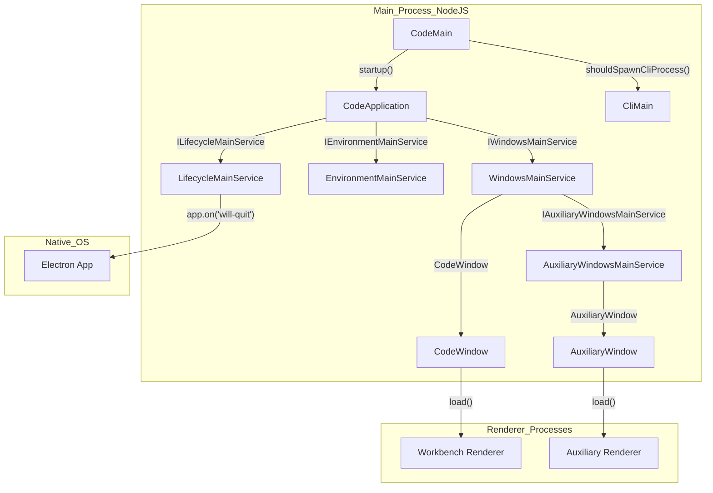
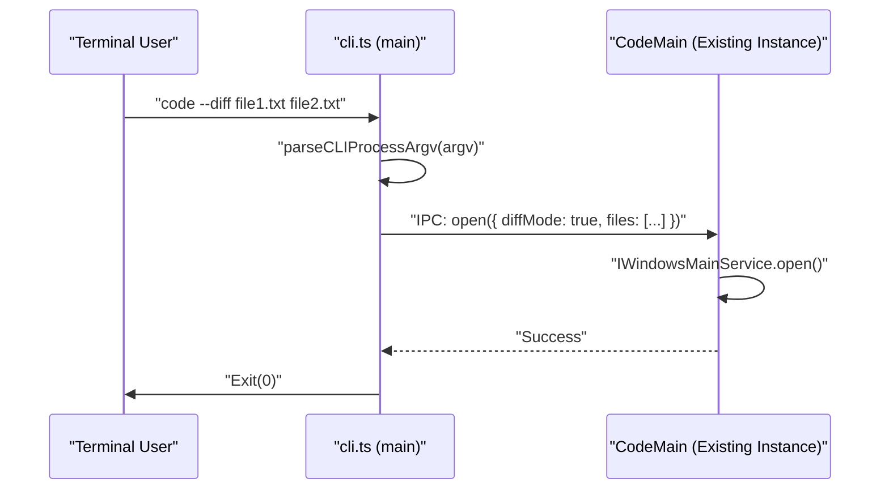

# Electron Main Process

Relevant source files

The following files were used as context for generating this wiki page:

- [cli/src/bin/code/legacy_args.rs](https://github.com/microsoft/vscode/blob/HEAD/cli/src/bin/code/legacy_args.rs)
- [product.json](https://github.com/microsoft/vscode/blob/HEAD/product.json)
- [resources/completions/bash/code](https://github.com/microsoft/vscode/blob/HEAD/resources/completions/bash/code)
- [resources/completions/zsh/_code](https://github.com/microsoft/vscode/blob/HEAD/resources/completions/zsh/_code)
- [src/vs/base/common/product.ts](https://github.com/microsoft/vscode/blob/HEAD/src/vs/base/common/product.ts)
- [src/vs/code/electron-main/app.ts](https://github.com/microsoft/vscode/blob/HEAD/src/vs/code/electron-main/app.ts)
- [src/vs/code/electron-main/main.ts](https://github.com/microsoft/vscode/blob/HEAD/src/vs/code/electron-main/main.ts)
- [src/vs/code/electron-utility/sharedProcess/sharedProcessMain.ts](https://github.com/microsoft/vscode/blob/HEAD/src/vs/code/electron-utility/sharedProcess/sharedProcessMain.ts)
- [src/vs/code/node/cli.ts](https://github.com/microsoft/vscode/blob/HEAD/src/vs/code/node/cli.ts)
- [src/vs/code/node/cliProcessMain.ts](https://github.com/microsoft/vscode/blob/HEAD/src/vs/code/node/cliProcessMain.ts)
- [src/vs/platform/auxiliaryWindow/electron-main/auxiliaryWindow.ts](https://github.com/microsoft/vscode/blob/HEAD/src/vs/platform/auxiliaryWindow/electron-main/auxiliaryWindow.ts)
- [src/vs/platform/auxiliaryWindow/electron-main/auxiliaryWindows.ts](https://github.com/microsoft/vscode/blob/HEAD/src/vs/platform/auxiliaryWindow/electron-main/auxiliaryWindows.ts)
- [src/vs/platform/auxiliaryWindow/electron-main/auxiliaryWindowsMainService.ts](https://github.com/microsoft/vscode/blob/HEAD/src/vs/platform/auxiliaryWindow/electron-main/auxiliaryWindowsMainService.ts)
- [src/vs/platform/environment/common/argv.ts](https://github.com/microsoft/vscode/blob/HEAD/src/vs/platform/environment/common/argv.ts)
- [src/vs/platform/environment/common/environment.ts](https://github.com/microsoft/vscode/blob/HEAD/src/vs/platform/environment/common/environment.ts)
- [src/vs/platform/environment/common/environmentService.ts](https://github.com/microsoft/vscode/blob/HEAD/src/vs/platform/environment/common/environmentService.ts)
- [src/vs/platform/environment/electron-main/environmentMainService.ts](https://github.com/microsoft/vscode/blob/HEAD/src/vs/platform/environment/electron-main/environmentMainService.ts)
- [src/vs/platform/environment/node/argv.ts](https://github.com/microsoft/vscode/blob/HEAD/src/vs/platform/environment/node/argv.ts)
- [src/vs/platform/environment/node/environmentService.ts](https://github.com/microsoft/vscode/blob/HEAD/src/vs/platform/environment/node/environmentService.ts)
- [src/vs/platform/environment/node/stdin.ts](https://github.com/microsoft/vscode/blob/HEAD/src/vs/platform/environment/node/stdin.ts)
- [src/vs/platform/extensionManagement/common/extensionManagementCLI.ts](https://github.com/microsoft/vscode/blob/HEAD/src/vs/platform/extensionManagement/common/extensionManagementCLI.ts)
- [src/vs/platform/launch/electron-main/launchMainService.ts](https://github.com/microsoft/vscode/blob/HEAD/src/vs/platform/launch/electron-main/launchMainService.ts)
- [src/vs/platform/log/browser/log.ts](https://github.com/microsoft/vscode/blob/HEAD/src/vs/platform/log/browser/log.ts)
- [src/vs/platform/native/common/native.ts](https://github.com/microsoft/vscode/blob/HEAD/src/vs/platform/native/common/native.ts)
- [src/vs/platform/native/electron-main/nativeHostMainService.ts](https://github.com/microsoft/vscode/blob/HEAD/src/vs/platform/native/electron-main/nativeHostMainService.ts)
- [src/vs/platform/product/common/product.ts](https://github.com/microsoft/vscode/blob/HEAD/src/vs/platform/product/common/product.ts)
- [src/vs/platform/window/common/window.ts](https://github.com/microsoft/vscode/blob/HEAD/src/vs/platform/window/common/window.ts)
- [src/vs/platform/window/electron-main/window.ts](https://github.com/microsoft/vscode/blob/HEAD/src/vs/platform/window/electron-main/window.ts)
- [src/vs/platform/windows/electron-main/windowImpl.ts](https://github.com/microsoft/vscode/blob/HEAD/src/vs/platform/windows/electron-main/windowImpl.ts)
- [src/vs/platform/windows/electron-main/windows.ts](https://github.com/microsoft/vscode/blob/HEAD/src/vs/platform/windows/electron-main/windows.ts)
- [src/vs/platform/windows/electron-main/windowsMainService.ts](https://github.com/microsoft/vscode/blob/HEAD/src/vs/platform/windows/electron-main/windowsMainService.ts)
- [src/vs/platform/windows/test/electron-main/windowsFinder.test.ts](https://github.com/microsoft/vscode/blob/HEAD/src/vs/platform/windows/test/electron-main/windowsFinder.test.ts)
- [src/vs/server/node/remoteExtensionHostAgentCli.ts](https://github.com/microsoft/vscode/blob/HEAD/src/vs/server/node/remoteExtensionHostAgentCli.ts)
- [src/vs/server/node/server.cli.ts](https://github.com/microsoft/vscode/blob/HEAD/src/vs/server/node/server.cli.ts)
- [src/vs/server/node/serverServices.ts](https://github.com/microsoft/vscode/blob/HEAD/src/vs/server/node/serverServices.ts)
- [src/vs/workbench/api/browser/mainThreadCLICommands.ts](https://github.com/microsoft/vscode/blob/HEAD/src/vs/workbench/api/browser/mainThreadCLICommands.ts)
- [src/vs/workbench/api/node/extHostCLIServer.ts](https://github.com/microsoft/vscode/blob/HEAD/src/vs/workbench/api/node/extHostCLIServer.ts)
- [src/vs/workbench/contrib/relauncher/browser/relauncher.contribution.ts](https://github.com/microsoft/vscode/blob/HEAD/src/vs/workbench/contrib/relauncher/browser/relauncher.contribution.ts)
- [src/vs/workbench/services/environment/browser/environmentService.ts](https://github.com/microsoft/vscode/blob/HEAD/src/vs/workbench/services/environment/browser/environmentService.ts)
- [src/vs/workbench/services/environment/common/environmentService.ts](https://github.com/microsoft/vscode/blob/HEAD/src/vs/workbench/services/environment/common/environmentService.ts)
- [src/vs/workbench/services/environment/electron-browser/environmentService.ts](https://github.com/microsoft/vscode/blob/HEAD/src/vs/workbench/services/environment/electron-browser/environmentService.ts)
- [src/vs/workbench/services/host/browser/browserHostService.ts](https://github.com/microsoft/vscode/blob/HEAD/src/vs/workbench/services/host/browser/browserHostService.ts)
- [src/vs/workbench/services/host/browser/host.ts](https://github.com/microsoft/vscode/blob/HEAD/src/vs/workbench/services/host/browser/host.ts)
- [src/vs/workbench/test/electron-browser/workbenchTestServices.ts](https://github.com/microsoft/vscode/blob/HEAD/src/vs/workbench/test/electron-browser/workbenchTestServices.ts)
- [src/vs/workbench/workbench.web.main.internal.ts](https://github.com/microsoft/vscode/blob/HEAD/src/vs/workbench/workbench.web.main.internal.ts)
- [test/integration/browser/src/index.ts](https://github.com/microsoft/vscode/blob/HEAD/test/integration/browser/src/index.ts)

The Electron Main Process is the entry point and backbone of the VS Code desktop application. It is responsible for the application lifecycle, managing all windows (main and auxiliary), integrating with the native operating system, and handling Command Line Interface (CLI) requests. It operates in a privileged Node.js environment and orchestrates the creation of renderer processes for the workbench.

## Core Architecture

The main process is centered around the `CodeApplication` class, which initializes the core services required for the application to run. It manages the communication between different processes via an IPC (Inter-Process Communication) server.

### Application Entry Points
The startup sequence begins in `src/vs/code/electron-main/main.ts`, which handles the initial environment setup and determines if a new instance should be started or if the request should be forwarded to an existing instance via a shared socket.

| Class | Responsibility | Location |
| :--- | :--- | :--- |
| `CodeMain` | Entry point logic, service initialization, and instance locking. | [src/vs/code/electron-main/main.ts:91-91](https://github.com/microsoft/vscode/blob/HEAD/src/vs/code/electron-main/main.ts#L91) |
| `CodeApplication` | Orchestrates the application lifecycle and starts core IPC servers. | [src/vs/code/electron-main/app.ts:145-145](https://github.com/microsoft/vscode/blob/HEAD/src/vs/code/electron-main/app.ts#L145) |
| `CliMain` | Handles extension management, MCP (Model Context Protocol) management, and telemetry tasks from the terminal. | [src/vs/code/node/cliProcessMain.ts:81-81](https://github.com/microsoft/vscode/blob/HEAD/src/vs/code/node/cliProcessMain.ts#L81) |

### System Overview Diagram

This diagram shows how the `CodeMain` entry point branches into either a full application or a CLI process, and how it manages windows.

Sources: [src/vs/code/electron-main/main.ts:91-140](https://github.com/microsoft/vscode/blob/HEAD/src/vs/code/electron-main/main.ts#L91-L140), [src/vs/code/electron-main/app.ts:145-300](https://github.com/microsoft/vscode/blob/HEAD/src/vs/code/electron-main/app.ts#L145-L300), [src/vs/platform/windows/electron-main/windowsMainService.ts:41-42](https://github.com/microsoft/vscode/blob/HEAD/src/vs/platform/windows/electron-main/windowsMainService.ts#L41-L42), [src/vs/platform/windows/electron-main/windowImpl.ts:39-39](https://github.com/microsoft/vscode/blob/HEAD/src/vs/platform/windows/electron-main/windowImpl.ts#L39), [src/vs/platform/auxiliaryWindow/electron-main/auxiliaryWindowsMainService.ts:22-22](https://github.com/microsoft/vscode/blob/HEAD/src/vs/platform/auxiliaryWindow/electron-main/auxiliaryWindowsMainService.ts#L22)

## Application Lifecycle and Window Management

The `ILifecycleMainService` manages the phases of the application, from the initial startup to the final shutdown. Window management is handled by the `IWindowsMainService`, which tracks all open `CodeWindow` instances. VS Code supports both primary workbench windows and "Auxiliary Windows" (e.g., floating editors).

*   **Lifecycle Phases:** Startup moves through phases like `Starting`, `Ready`, and `Eventually` to ensure services are initialized in the correct order [src/vs/platform/lifecycle/electron-main/lifecycleMainService.ts:63-63](https://github.com/microsoft/vscode/blob/HEAD/src/vs/platform/lifecycle/electron-main/lifecycleMainService.ts#L63).
*   **Window State:** The `WindowsStateHandler` persists window positions, sizes, and open folders to ensure they are restored correctly on restart [src/vs/platform/windows/electron-main/windowsMainService.ts:44-44](https://github.com/microsoft/vscode/blob/HEAD/src/vs/platform/windows/electron-main/windowsMainService.ts#L44).
*   **Auxiliary Windows:** Multi-window support is managed by `IAuxiliaryWindowsMainService`, allowing parts of the UI to be detached into separate native windows [src/vs/platform/auxiliaryWindow/electron-main/auxiliaryWindows.ts:14-14](https://github.com/microsoft/vscode/blob/HEAD/src/vs/platform/auxiliaryWindow/electron-main/auxiliaryWindows.ts#L14).
*   **Native Integration:** The `NativeHostMainService` provides a bridge for renderer processes to access native OS features like dialogs, power monitor, and shell integration [src/vs/platform/native/electron-main/nativeHostMainService.ts:58-58](https://github.com/microsoft/vscode/blob/HEAD/src/vs/platform/native/electron-main/nativeHostMainService.ts#L58).

For details, see [Application Lifecycle and Window Management](#2.1).

## CLI and Environment Services

VS Code's CLI allows users to open files, install extensions, and compare files from the terminal. The main process parses these arguments and resolves paths using various environment services.

*   **Argument Parsing:** `NativeParsedArgs` defines the schema for all supported CLI flags, such as `--diff`, `--wait`, and `--user-data-dir` [src/vs/platform/environment/common/argv.ts:50-50](https://github.com/microsoft/vscode/blob/HEAD/src/vs/platform/environment/common/argv.ts#L50).
*   **Environment Resolution:** The `IEnvironmentMainService` resolves critical system paths (logs, user data, extensions) and merges them with the `product.json` configuration [src/vs/platform/environment/node/environmentService.ts:24-24](https://github.com/microsoft/vscode/blob/HEAD/src/vs/platform/environment/node/environmentService.ts#L24).
*   **Single Instance Locking:** If an instance is already running, the CLI process communicates with the main process via a socket/named pipe to open files in the existing window [src/vs/code/electron-main/main.ts:555-570](https://github.com/microsoft/vscode/blob/HEAD/src/vs/code/electron-main/main.ts#L555-L570).
*   **Subcommands:** The CLI supports specific subcommands like `tunnel`, `serve-web`, and `agent` which may spawn separate processes or interact with the Rust-based CLI [src/vs/platform/environment/node/argv.ts:48-48](https://github.com/microsoft/vscode/blob/HEAD/src/vs/platform/environment/node/argv.ts#L48).

### CLI Command Flow

Sources: [src/vs/code/node/cli.ts:44-52](https://github.com/microsoft/vscode/blob/HEAD/src/vs/code/node/cli.ts#L44-L52), [src/vs/platform/environment/node/argvHelper.ts:36-36](https://github.com/microsoft/vscode/blob/HEAD/src/vs/platform/environment/node/argvHelper.ts#L36), [src/vs/code/electron-main/main.ts:555-570](https://github.com/microsoft/vscode/blob/HEAD/src/vs/code/electron-main/main.ts#L555-L570), [src/vs/platform/environment/common/argv.ts:104-105](https://github.com/microsoft/vscode/blob/HEAD/src/vs/platform/environment/common/argv.ts#L104-L105)

For details, see [CLI and Environment Services](#2.2).

## Native OS Integration

The main process acts as a proxy for native capabilities that are not available in the sandbox of the renderer process.

*   **File System:** While renderers use a virtual file system, the main process provides the `DiskFileSystemProvider` for direct local I/O [src/vs/platform/files/node/diskFileSystemProvider.ts:56-56](https://github.com/microsoft/vscode/blob/HEAD/src/vs/platform/files/node/diskFileSystemProvider.ts#L56).
*   **Native Dialogs:** Opening and saving files via OS-native dialogs is handled by `DialogMainService` [src/vs/platform/dialogs/electron-main/dialogMainService.ts:19-19](https://github.com/microsoft/vscode/blob/HEAD/src/vs/platform/dialogs/electron-main/dialogMainService.ts#L19).
*   **Global Menus:** The `MenubarMainService` manages the top-level application menu on macOS and the custom/native menubars on Windows/Linux [src/vs/platform/menubar/electron-main/menubarMainService.ts:25-25](https://github.com/microsoft/vscode/blob/HEAD/src/vs/platform/menubar/electron-main/menubarMainService.ts#L25).
*   **Native Host Services:** The `NativeHostMainService` implements `INativeHostMainService` to provide system-level statistics (CPU, memory), power management, and clipboard access [src/vs/platform/native/electron-main/nativeHostMainService.ts:58-58](https://github.com/microsoft/vscode/blob/HEAD/src/vs/platform/native/electron-main/nativeHostMainService.ts#L58).

Sources: [src/vs/code/electron-main/app.ts:6-28](https://github.com/microsoft/vscode/blob/HEAD/src/vs/code/electron-main/app.ts#L6-L28), [src/vs/platform/native/electron-main/nativeHostMainService.ts:8-9](https://github.com/microsoft/vscode/blob/HEAD/src/vs/platform/native/electron-main/nativeHostMainService.ts#L8-L9), [src/vs/platform/files/electron-main/diskFileSystemProviderServer.ts:17-17](https://github.com/microsoft/vscode/blob/HEAD/src/vs/platform/files/electron-main/diskFileSystemProviderServer.ts#L17)

## Configuration and Product Metadata

The behavior of the main process is heavily influenced by two static configurations:
1.  **`product.json`**: Contains build-time metadata like the application name, update URL, and default extensions [product.json:1-10](https://github.com/microsoft/vscode/blob/HEAD/product.json#L1-L10).
2.  **`IConfigurationService`**: Manages user settings (e.g., `window.restoreWindows`, `window.confirmBeforeClose`) that dictate how the main process behaves during startup and shutdown [src/vs/platform/configuration/common/configuration.ts:18-18](https://github.com/microsoft/vscode/blob/HEAD/src/vs/platform/configuration/common/configuration.ts#L18).

Sources: [product.json:1-10](https://github.com/microsoft/vscode/blob/HEAD/product.json#L1-L10), [src/vs/base/common/product.ts:99-122](https://github.com/microsoft/vscode/blob/HEAD/src/vs/base/common/product.ts#L99-L122)