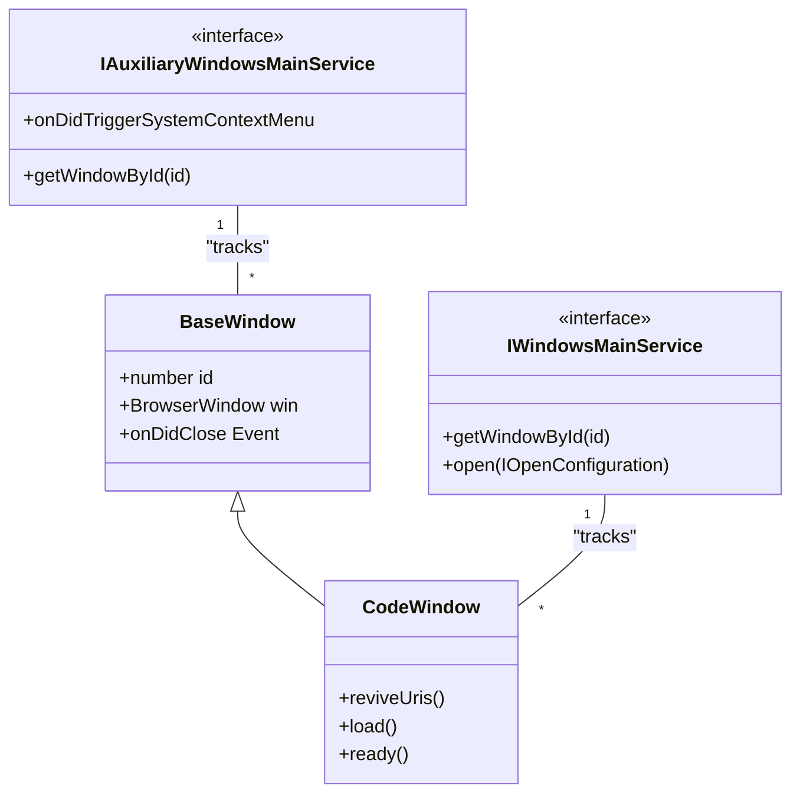

# Application Lifecycle and Window Management

<details>
<summary>Relevant source files</summary>

The following files were used as context for generating this wiki page:

- [cli/src/bin/code/legacy_args.rs](cli/src/bin/code/legacy_args.rs)
- [resources/completions/bash/code](resources/completions/bash/code)
- [resources/completions/zsh/_code](resources/completions/zsh/_code)
- [src/vs/code/electron-main/app.ts](src/vs/code/electron-main/app.ts)
- [src/vs/code/electron-main/main.ts](src/vs/code/electron-main/main.ts)
- [src/vs/code/electron-utility/sharedProcess/sharedProcessMain.ts](src/vs/code/electron-utility/sharedProcess/sharedProcessMain.ts)
- [src/vs/code/node/cliProcessMain.ts](src/vs/code/node/cliProcessMain.ts)
- [src/vs/platform/auxiliaryWindow/electron-main/auxiliaryWindow.ts](src/vs/platform/auxiliaryWindow/electron-main/auxiliaryWindow.ts)
- [src/vs/platform/auxiliaryWindow/electron-main/auxiliaryWindows.ts](src/vs/platform/auxiliaryWindow/electron-main/auxiliaryWindows.ts)
- [src/vs/platform/auxiliaryWindow/electron-main/auxiliaryWindowsMainService.ts](src/vs/platform/auxiliaryWindow/electron-main/auxiliaryWindowsMainService.ts)
- [src/vs/platform/extensionManagement/common/extensionManagementCLI.ts](src/vs/platform/extensionManagement/common/extensionManagementCLI.ts)
- [src/vs/platform/launch/electron-main/launchMainService.ts](src/vs/platform/launch/electron-main/launchMainService.ts)
- [src/vs/platform/native/common/native.ts](src/vs/platform/native/common/native.ts)
- [src/vs/platform/native/electron-main/nativeHostMainService.ts](src/vs/platform/native/electron-main/nativeHostMainService.ts)
- [src/vs/platform/window/common/window.ts](src/vs/platform/window/common/window.ts)
- [src/vs/platform/window/electron-main/window.ts](src/vs/platform/window/electron-main/window.ts)
- [src/vs/platform/windows/electron-main/windowImpl.ts](src/vs/platform/windows/electron-main/windowImpl.ts)
- [src/vs/platform/windows/electron-main/windows.ts](src/vs/platform/windows/electron-main/windows.ts)
- [src/vs/platform/windows/electron-main/windowsMainService.ts](src/vs/platform/windows/electron-main/windowsMainService.ts)
- [src/vs/platform/windows/test/electron-main/windowsFinder.test.ts](src/vs/platform/windows/test/electron-main/windowsFinder.test.ts)
- [src/vs/server/node/remoteExtensionHostAgentCli.ts](src/vs/server/node/remoteExtensionHostAgentCli.ts)
- [src/vs/server/node/serverServices.ts](src/vs/server/node/serverServices.ts)
- [src/vs/workbench/api/browser/mainThreadCLICommands.ts](src/vs/workbench/api/browser/mainThreadCLICommands.ts)
- [src/vs/workbench/api/node/extHostCLIServer.ts](src/vs/workbench/api/node/extHostCLIServer.ts)
- [src/vs/workbench/contrib/relauncher/browser/relauncher.contribution.ts](src/vs/workbench/contrib/relauncher/browser/relauncher.contribution.ts)
- [src/vs/workbench/services/host/browser/browserHostService.ts](src/vs/workbench/services/host/browser/browserHostService.ts)
- [src/vs/workbench/services/host/browser/host.ts](src/vs/workbench/services/host/browser/host.ts)
- [src/vs/workbench/test/electron-browser/workbenchTestServices.ts](src/vs/workbench/test/electron-browser/workbenchTestServices.ts)
- [src/vs/workbench/workbench.web.main.internal.ts](src/vs/workbench/workbench.web.main.internal.ts)

</details>


The application lifecycle and window management system in VS Code coordinates the transition from the Electron main process startup to the creation of the user interface. This system is responsible for managing the primary workbench window, auxiliary windows (detached editors), and the persistence of window states across sessions.

## CodeApplication Startup Sequence

The `CodeApplication` class is the entry point for the Electron main process. It orchestrates the initialization of core services and the eventual opening of the first window.

### Startup Phases
1.  **Initialization**: The app initializes basic Electron settings, such as configuring UNC host allowlists on Windows via `addUNCHostToAllowlist` and `disableUNCAccessRestrictions` [src/vs/code/electron-main/app.ts:7-8](). It also initializes Windows version information for compatibility [src/vs/code/electron-main/app.ts:10-10]().
2.  **Service Collection**: A `ServiceCollection` is populated with essential main-process services, including `IWindowsMainService`, `ILifecycleMainService`, and `IEnvironmentMainService` [src/vs/code/electron-main/app.ts:78-95]().
3.  **Environment Setup**: Resolves the shell environment using `getResolvedShellEnv` to ensure the renderer has access to the user's PATH and other variables [src/vs/code/electron-main/app.ts:46-46]().
4.  **Window Restoration**: Uses the `IWindowsMainService` to restore previous windows or open new ones based on the provided configuration [src/vs/platform/windows/electron-main/windowsMainService.ts:42-42]().

**Startup Flow Diagram**
```mermaid
graph TD
    subgraph MainProcess_src_vs_code_electron_main_ap ["MainProcess [src/vs/code/electron-main/app.ts]"]
        "CodeMain.main()"CodeMain_main["CodeMain.main()"] --> "CodeApplication.startup()"CodeApplication_startup["CodeApplication.startup()"]
        "CodeApplication.startup()" --> "CodeApplication.initServices()"CodeApplication_initServices["CodeApplication.initServices()"]
        "CodeApplication.initServices()" --> "getResolvedShellEnv()"getResolvedShellEnv["getResolvedShellEnv()"]
        "getResolvedShellEnv()" --> "IWindowsMainService.open()"IWindowsMainService_open["IWindowsMainService.open()"]
    end

    subgraph WindowManagement_src_vs_platform_windows ["WindowManagement [src/vs/platform/windows/electron-main/]"]
        "IWindowsMainService.open()" --> "WindowsStateHandler.restore()"WindowsStateHandler_restore["WindowsStateHandler.restore()"]
        "WindowsStateHandler.restore()" --> "CodeWindow.create()"CodeWindow_create["CodeWindow.create()"]
        "CodeWindow.create()" --> "new BrowserWindow()"new_BrowserWindow["new BrowserWindow()"]
    end

    "new BrowserWindow()" --> Renderer["Renderer Process (Workbench)"]
```
Sources: [src/vs/code/electron-main/app.ts:7-95](), [src/vs/platform/windows/electron-main/windowsMainService.ts:41-47]()

## IWindowsMainService and Window Tracking

The `IWindowsMainService` is the central authority for managing `ICodeWindow` instances in the main process. It tracks all open windows and handles the complex logic of opening files, folders, or workspaces.

### Key Responsibilities
*   **Window Creation**: Wraps the Electron `BrowserWindow` in a `CodeWindow` class (implemented in `windowImpl.ts`) to provide VS Code-specific functionality [src/vs/platform/windows/electron-main/windowImpl.ts:148-153]().
*   **Window Matching**: When a request comes in to open a path, it searches for an existing window using `findWindowOnWorkspaceOrFolder` or `findWindowOnFile` [src/vs/platform/windows/electron-main/windowsMainService.ts:43-43]().
*   **Lifecycle Coordination**: Handles window closing events and determines if the application should quit when the last window is closed via the `ILifecycleMainService` [src/vs/platform/windows/electron-main/windowsMainService.ts:34-34]().
*   **Specialized Windows**: Supports opening the "Agents Window" (Sessions layer) via `openAgentsWindow` [src/vs/platform/windows/electron-main/windows.ts:44-44]().

### Window Types
| Type | Class | Description |
| :--- | :--- | :--- |
| **Main Window** | `CodeWindow` | The primary workbench window containing the activity bar, sidebar, and editor area [src/vs/platform/windows/electron-main/windowImpl.ts:39-39](). |
| **Auxiliary Window** | `BaseWindow` | A secondary window (detached editor) managed via `IAuxiliaryWindowsMainService` [src/vs/platform/windows/electron-main/windowImpl.ts:112-112](). |

Sources: [src/vs/platform/windows/electron-main/windowsMainService.ts:41-58](), [src/vs/platform/windows/electron-main/windowImpl.ts:39-153](), [src/vs/platform/windows/electron-main/windows.ts:25-58]()

## Multi-Window Support and Auxiliary Windows

VS Code supports a multi-window architecture where editors can be floated into separate windows. This is managed by the `IAuxiliaryWindowsMainService` on the main process side and `registerWindow` utilities in the browser layer.

### Implementation Details
*   **AuxiliaryWindow Management**: The `IAuxiliaryWindowsMainService` tracks secondary windows and provides events for system context menus and fullscreen transitions [src/vs/platform/native/electron-main/nativeHostMainService.ts:44-45]().
*   **Window Identification**: Every window is assigned a unique ID (`windowId`), which is used to route IPC messages via `NativeHostMainService`. Events from both main and auxiliary windows are merged in the native host service [src/vs/platform/native/electron-main/nativeHostMainService.ts:82-104]().
*   **Base Class Hierarchy**: Both `CodeWindow` and auxiliary windows inherit from `BaseWindow`, which handles standard Electron events like `maximize`, `unmaximize`, and `fullscreen` [src/vs/platform/windows/electron-main/windowImpl.ts:112-153]().

**Window Entity Association**

Sources: [src/vs/platform/windows/electron-main/windowImpl.ts:112-153](), [src/vs/platform/native/electron-main/nativeHostMainService.ts:57-106](), [src/vs/platform/windows/electron-main/windows.ts:25-58]()

## Window State Persistence

The state of windows (position, size, opened folders) is persisted using the `WindowsStateHandler` and the `IStateService`.

*   **Persistence Trigger**: Window state is saved whenever a window is closed or the application shuts down. The `CodeWindow` class tracks its own state including `x`, `y`, `width`, `height`, and `mode` (maximized, fullscreen) [src/vs/platform/windows/electron-main/windowImpl.ts:39-52]().
*   **State Data**: Encapsulated in the `IWindowState` interface [src/vs/platform/window/electron-main/window.ts:39-39]().
*   **Restoration Logic**: On startup, `WindowsMainService` determines the set of windows to open by consulting the `RestoreWindowsSetting` (e.g., 'all', 'folders', 'one', 'none') [src/vs/platform/windows/electron-main/windowsMainService.ts:65-65]().

Sources: [src/vs/platform/windows/electron-main/windowsMainService.ts:44-65](), [src/vs/platform/windows/electron-main/windowImpl.ts:39-56](), [src/vs/platform/window/electron-main/window.ts:39-39]()

## Security and Window Configuration

Every window is initialized with an `INativeWindowConfiguration` which contains security-sensitive and environment-specific settings.

### Security Controls
*   **Sandbox**: VS Code uses Electron's sandbox for renderer processes. The `ISandboxHelperMainService` provides utilities for managing sandboxed processes [src/vs/code/electron-main/app.ts:51-52]().
*   **UNC Paths**: On Windows, the main process restricts access to UNC hosts unless they are explicitly allowed via the `addUNCHostToAllowlist` utility [src/vs/code/electron-main/app.ts:7-8]().
*   **Webview Security**: Handled via custom protocols and the `IProtocolMainService` to ensure webview content is isolated [src/vs/platform/windows/electron-main/windowImpl.ts:29-29]().

### Window Configuration Properties
| Property | Description |
| :--- | :--- |
| `titleBarStyle` | Determines if the window uses native or custom title bars [src/vs/platform/window/common/window.ts:35-35](). |
| `useNativeFullScreen` | Controls whether to use the OS-native full-screen mode [src/vs/platform/window/common/window.ts:35-35](). |
| `windowControlsOverlay` | Enables the Window Controls Overlay (WCO) for custom title bars on Windows/Linux [src/vs/platform/window/common/window.ts:35-35](). |
| `backgroundColor` | Initialized to reduce flicker during startup via `themeMainService.getBackgroundColor()` [src/vs/platform/windows/electron-main/windows.ts:143-143](). |

Sources: [src/vs/code/electron-main/app.ts:1-52](), [src/vs/platform/windows/electron-main/windowImpl.ts:35-40](), [src/vs/platform/window/common/window.ts:35-35](), [src/vs/platform/windows/electron-main/windows.ts:134-166]()