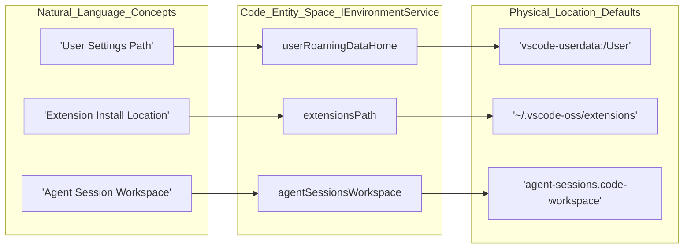

# CLI and Environment Services

<details>
<summary>Relevant source files</summary>

The following files were used as context for generating this wiki page:

- [cli/Cargo.lock](cli/Cargo.lock)
- [cli/Cargo.toml](cli/Cargo.toml)
- [cli/src/async_pipe.rs](cli/src/async_pipe.rs)
- [cli/src/auth.rs](cli/src/auth.rs)
- [cli/src/bin/code/main.rs](cli/src/bin/code/main.rs)
- [cli/src/commands.rs](cli/src/commands.rs)
- [cli/src/commands/agent.rs](cli/src/commands/agent.rs)
- [cli/src/commands/agent_discovery.rs](cli/src/commands/agent_discovery.rs)
- [cli/src/commands/agent_host.rs](cli/src/commands/agent_host.rs)
- [cli/src/commands/agent_kill.rs](cli/src/commands/agent_kill.rs)
- [cli/src/commands/agent_logs.rs](cli/src/commands/agent_logs.rs)
- [cli/src/commands/agent_ps.rs](cli/src/commands/agent_ps.rs)
- [cli/src/commands/agent_stop.rs](cli/src/commands/agent_stop.rs)
- [cli/src/commands/args.rs](cli/src/commands/args.rs)
- [cli/src/commands/serve_web.rs](cli/src/commands/serve_web.rs)
- [cli/src/commands/tunnels.rs](cli/src/commands/tunnels.rs)
- [cli/src/constants.rs](cli/src/constants.rs)
- [cli/src/desktop/version_manager.rs](cli/src/desktop/version_manager.rs)
- [cli/src/download_cache.rs](cli/src/download_cache.rs)
- [cli/src/lib.rs](cli/src/lib.rs)
- [cli/src/log.rs](cli/src/log.rs)
- [cli/src/msgpack_rpc.rs](cli/src/msgpack_rpc.rs)
- [cli/src/options.rs](cli/src/options.rs)
- [cli/src/self_update.rs](cli/src/self_update.rs)
- [cli/src/state.rs](cli/src/state.rs)
- [cli/src/tunnels.rs](cli/src/tunnels.rs)
- [cli/src/tunnels/agent_host.rs](cli/src/tunnels/agent_host.rs)
- [cli/src/tunnels/challenge.rs](cli/src/tunnels/challenge.rs)
- [cli/src/tunnels/code_server.rs](cli/src/tunnels/code_server.rs)
- [cli/src/tunnels/control_server.rs](cli/src/tunnels/control_server.rs)
- [cli/src/tunnels/dev_tunnels.rs](cli/src/tunnels/dev_tunnels.rs)
- [cli/src/tunnels/local_forwarding.rs](cli/src/tunnels/local_forwarding.rs)
- [cli/src/tunnels/port_forwarder.rs](cli/src/tunnels/port_forwarder.rs)
- [cli/src/tunnels/protocol.rs](cli/src/tunnels/protocol.rs)
- [cli/src/tunnels/server_bridge.rs](cli/src/tunnels/server_bridge.rs)
- [cli/src/tunnels/service.rs](cli/src/tunnels/service.rs)
- [cli/src/tunnels/service_linux.rs](cli/src/tunnels/service_linux.rs)
- [cli/src/tunnels/service_macos.rs](cli/src/tunnels/service_macos.rs)
- [cli/src/tunnels/service_windows.rs](cli/src/tunnels/service_windows.rs)
- [cli/src/tunnels/singleton_client.rs](cli/src/tunnels/singleton_client.rs)
- [cli/src/tunnels/singleton_server.rs](cli/src/tunnels/singleton_server.rs)
- [cli/src/tunnels/socket_signal.rs](cli/src/tunnels/socket_signal.rs)
- [cli/src/util/command.rs](cli/src/util/command.rs)
- [cli/src/util/errors.rs](cli/src/util/errors.rs)
- [cli/src/util/io.rs](cli/src/util/io.rs)
- [cli/src/util/sync.rs](cli/src/util/sync.rs)
- [extensions/tunnel-forwarding/.vscode/launch.json](extensions/tunnel-forwarding/.vscode/launch.json)
- [extensions/tunnel-forwarding/.vscodeignore](extensions/tunnel-forwarding/.vscodeignore)
- [extensions/tunnel-forwarding/src/extension.ts](extensions/tunnel-forwarding/src/extension.ts)
- [product.json](product.json)
- [src/vs/base/common/product.ts](src/vs/base/common/product.ts)
- [src/vs/code/node/cli.ts](src/vs/code/node/cli.ts)
- [src/vs/platform/environment/common/argv.ts](src/vs/platform/environment/common/argv.ts)
- [src/vs/platform/environment/common/environment.ts](src/vs/platform/environment/common/environment.ts)
- [src/vs/platform/environment/common/environmentService.ts](src/vs/platform/environment/common/environmentService.ts)
- [src/vs/platform/environment/electron-main/environmentMainService.ts](src/vs/platform/environment/electron-main/environmentMainService.ts)
- [src/vs/platform/environment/node/argv.ts](src/vs/platform/environment/node/argv.ts)
- [src/vs/platform/environment/node/environmentService.ts](src/vs/platform/environment/node/environmentService.ts)
- [src/vs/platform/environment/node/stdin.ts](src/vs/platform/environment/node/stdin.ts)
- [src/vs/platform/log/browser/log.ts](src/vs/platform/log/browser/log.ts)
- [src/vs/platform/product/common/product.ts](src/vs/platform/product/common/product.ts)
- [src/vs/server/node/server.cli.ts](src/vs/server/node/server.cli.ts)
- [src/vs/workbench/services/environment/browser/environmentService.ts](src/vs/workbench/services/environment/browser/environmentService.ts)
- [src/vs/workbench/services/environment/common/environmentService.ts](src/vs/workbench/services/environment/common/environmentService.ts)
- [src/vs/workbench/services/environment/electron-browser/environmentService.ts](src/vs/workbench/services/environment/electron-browser/environmentService.ts)
- [test/integration/browser/src/index.ts](test/integration/browser/src/index.ts)

</details>


The VS Code Command Line Interface (CLI) and Environment Services provide the infrastructure for argument parsing, application entry points, and the resolution of system-wide paths and configurations. This system ensures that the application behaves consistently whether launched from a terminal, an Electron shortcut, or a remote server.

## CLI Argument Parsing

VS Code uses a structured approach to CLI arguments, defining them in a central location to ensure type safety across processes. Arguments are parsed using the `minimist` library [src/vs/platform/environment/node/argv.ts:6-6]() and validated against a schema.

### NativeParsedArgs
The `NativeParsedArgs` interface defines the schema for all supported CLI flags and subcommands [src/vs/platform/environment/common/argv.ts:15-181](). This includes:
- **Subcommands**: `tunnel`, `serve-web`, `agent`, and `chat` [src/vs/platform/environment/node/argv.ts:48-82](). The `chat` subcommand supports specific options like `--mode`, `--add-file`, and `--maximize` [src/vs/platform/environment/node/argv.ts:51-64]().
- **File Operations**: `--diff`, `--merge`, `--goto`, and `--wait` [src/vs/platform/environment/node/argv.ts:104-112]().
- **Environment Overrides**: `--user-data-dir`, `--extensions-dir`, and `--profile` [src/vs/platform/environment/node/argv.ts:115-119]().
- **Troubleshooting**: `--verbose`, `--trace`, and `--open-devtools` [src/vs/platform/environment/common/argv.ts:67-72]().

### Parsing Logic
Arguments are processed by `parseCLIProcessArgv` and `parseMainProcessArgv` [src/vs/code/node/cli.ts:48-48](). These functions handle alias resolution and type conversion. The `OPTIONS` constant in `src/vs/platform/environment/node/argv.ts` provides the metadata for parsing, including descriptions and help categories like `optionsUpperCase` (Options), `extensionsManagement` (Extensions Management), and `mcp` (Model Context Protocol) [src/vs/platform/environment/node/argv.ts:14-31]().

**Sources:** [src/vs/platform/environment/common/argv.ts:15-181](), [src/vs/platform/environment/node/argv.ts:6-118](), [src/vs/code/node/cli.ts:44-52]()

## Application Entry Points

The entry point for the application depends on the execution context. The CLI acts as a gateway that either performs a task and exits or hands off control to the main Electron process.

### CLI Gateway (`vs/code/node/cli.ts`)
The `main` function in `src/vs/code/node/cli.ts` is the first point of execution for the desktop CLI [src/vs/code/node/cli.ts:44-44]().
- **Native Commands**: If subcommands like `tunnel`, `serve-web`, or `agent` are detected, it spawns the Rust-based CLI binary [src/vs/code/node/cli.ts:54-90]().
- **CLI Process Handoff**: For extension management (e.g., `--install-extension`), it imports and delegates to `cliProcessMain.js` [src/vs/code/node/cli.ts:127-145]().
- **Shell Integration**: Handles the `--locate-shell-integration-path` flag to return paths for `bash`, `pwsh`, `zsh`, or `fish` scripts [src/vs/code/node/cli.ts:110-124]().

### Rust CLI (`cli/src/`)
For remote tunneling and server management, VS Code utilizes a Rust-based CLI.
- **Integrated vs Standalone**: The CLI can run as an `IntegratedCli` (bundled with desktop) or `StandaloneCli` [cli/src/commands/args.rs:62-100]().
- **Subcommands**: Implements `tunnel`, `serve-web`, and `agent` logic [cli/src/commands/args.rs:166-192]().
- **Tunneling**: The `tunnel` command uses `DevTunnels` to create secure connections to `vscode.dev` [cli/src/commands/tunnels.rs:43-43]().

### CLI to Code Entity Mapping
```mermaid
graph TD
    subgraph Terminal_Shell ["Terminal_Shell"]
        A["'code --install-extension ms-python.python'"]
        B["'code tunnel'"]
    end

    subgraph Code_Entity_Space_Entry_Points ["Code_Entity_Space_Entry_Points"]
        C["main(argv: string[])" --> "vs/code/node/cli.ts"]
        D["cliProcessMain.main()" --> "vs/code/node/cliProcessMain.ts"]
        E["IntegratedCli" --> "cli/src/commands/args.rs"]
    end

    subgraph Service_Layer ["Service_Layer"]
        F["ExtensionManagementCLI" --> "vs/platform/extensionManagement/common/extensionManagementCLI.ts"]
        G["DevTunnels" --> "cli/src/tunnels/dev_tunnels.rs"]
        H["CodeServerArgs" --> "cli/src/tunnels/code_server.rs"]
    end

    A --> C
    B --> C
    C -- "shouldSpawnCliProcess() == true" --> D
    C -- "spawn tunnel binary" --> E
    D --> F
    E --> G
    E --> H
```
**Sources:** [src/vs/code/node/cli.ts:44-145](), [cli/src/commands/args.rs:62-192](), [cli/src/commands/tunnels.rs:22-62]()

## Environment Services

The `IEnvironmentService` hierarchy is responsible for resolving paths to user data, logs, and application resources.

### Service Hierarchy
- **INativeEnvironmentService**: Extends the base service with Node.js-specific paths like `userHome`, `appRoot`, and `cliDataDir` [src/vs/platform/environment/common/environment.ts:114-165]().
- **IBrowserWorkbenchEnvironmentService**: Used in the web context, mapping paths to virtual schemes like `vscode-userdata:/` [src/vs/workbench/services/environment/browser/environmentService.ts:23-40]().

### Path Resolution
The environment service determines critical locations using `product.json` values and CLI overrides:
- **User Data Dir**: Resolved via `user-data-dir` flag or defaults to platform-specific paths (e.g., `~/.vscode-oss`) [src/vs/workbench/services/environment/browser/environmentService.ts:105-105]().
- **Agent Sessions**: A specific workspace URI is resolved for AI agent sessions at `agent-sessions.code-workspace` [src/vs/workbench/services/environment/browser/environmentService.ts:145-145]().
- **Logs**: The `logsHome` property points to the root directory for all application logs [src/vs/workbench/services/environment/browser/environmentService.ts:99-99]().

**Environment Service Path Mapping**

**Sources:** [src/vs/platform/environment/common/environment.ts:114-165](), [src/vs/workbench/services/environment/browser/environmentService.ts:42-151]()

## Product Configuration (`product.json`)

The `product.json` file is a central configuration file that defines the "flavor" of the build. It is consumed by the `IProductService` and the `product` module [src/vs/platform/product/common/product.ts:24-24]().

Key properties include:
- **`nameShort` / `nameLong`**: Display names (e.g., "Code - OSS") [product.json:2-3]().
- **`dataFolderName`**: Folder name for user data (e.g., `.vscode-oss`) [product.json:5]().
- **`urlProtocol`**: Custom URI scheme (e.g., `code-oss`) [product.json:36]().
- **`defaultChatAgent`**: Configuration for the default AI provider, including extension IDs and API endpoints [product.json:89-152]().
- **`tunnelApplicationName`**: Name of the binary used for remote tunneling [product.json:16]().

**Sources:** [product.json:1-152](), [src/vs/base/common/product.ts:99-206](), [src/vs/platform/product/common/product.ts:37-68]()

## Server CLI and Remote Terminals

When running in a remote context, the server agent handles command execution.

- **Serve Web**: The `ServeWebArgs` in the Rust CLI define how the local web version of VS Code is hosted, including `host`, `port`, and `connection-token` [cli/src/commands/args.rs:195-235]().
- **Agent Host**: The `agent` subcommand manages AI agent host sessions, allowing binding to specific hosts and ports [cli/src/commands/args.rs:238-243]().
- **Command Shell**: A hidden command `command-shell` runs the control server on process stdin/stdout to facilitate communication between the renderer and the agent host [cli/src/commands/tunnels.rs:146-186]().

**Sources:** [cli/src/commands/args.rs:195-243](), [cli/src/commands/tunnels.rs:146-186]()