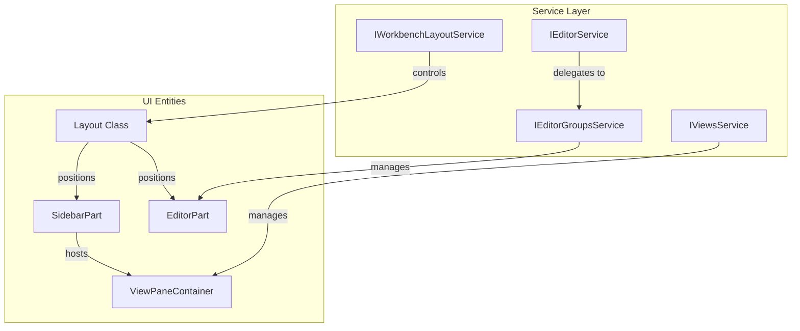
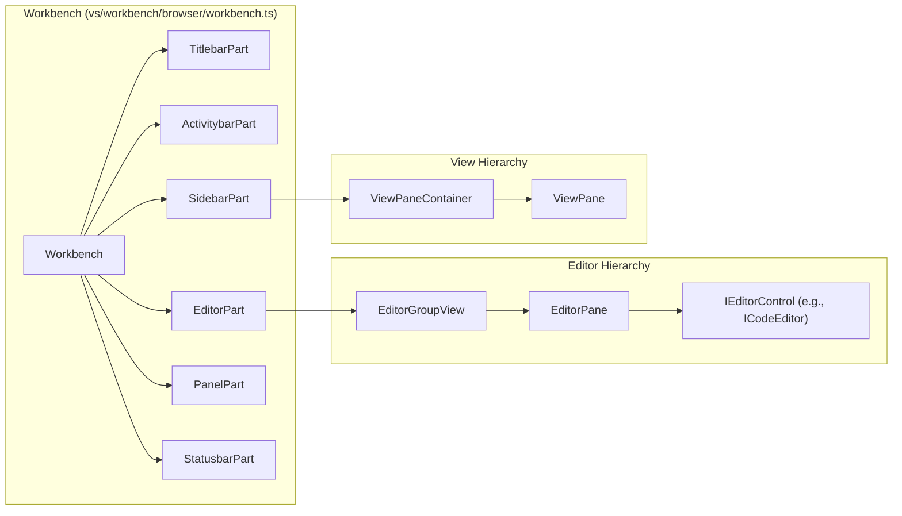

# Workbench UI Framework

Relevant source files

The following files were used as context for generating this wiki page:

- [src/vs/base/browser/ui/actionbar/actionbar.css](https://github.com/microsoft/vscode/blob/HEAD/src/vs/base/browser/ui/actionbar/actionbar.css)
- [src/vs/base/browser/ui/splitview/paneview.css](https://github.com/microsoft/vscode/blob/HEAD/src/vs/base/browser/ui/splitview/paneview.css)
- [src/vs/base/browser/ui/splitview/paneview.ts](https://github.com/microsoft/vscode/blob/HEAD/src/vs/base/browser/ui/splitview/paneview.ts)
- [src/vs/base/test/browser/ui/splitview/paneview.test.ts](https://github.com/microsoft/vscode/blob/HEAD/src/vs/base/test/browser/ui/splitview/paneview.test.ts)
- [src/vs/platform/editor/common/editor.ts](https://github.com/microsoft/vscode/blob/HEAD/src/vs/platform/editor/common/editor.ts)
- [src/vs/workbench/browser/actions/layoutActions.ts](https://github.com/microsoft/vscode/blob/HEAD/src/vs/workbench/browser/actions/layoutActions.ts)
- [src/vs/workbench/browser/actions/windowActions.ts](https://github.com/microsoft/vscode/blob/HEAD/src/vs/workbench/browser/actions/windowActions.ts)
- [src/vs/workbench/browser/actions/workspaceActions.ts](https://github.com/microsoft/vscode/blob/HEAD/src/vs/workbench/browser/actions/workspaceActions.ts)
- [src/vs/workbench/browser/actions/workspaceCommands.ts](https://github.com/microsoft/vscode/blob/HEAD/src/vs/workbench/browser/actions/workspaceCommands.ts)
- [src/vs/workbench/browser/composite.ts](https://github.com/microsoft/vscode/blob/HEAD/src/vs/workbench/browser/composite.ts)
- [src/vs/workbench/browser/contextkeys.ts](https://github.com/microsoft/vscode/blob/HEAD/src/vs/workbench/browser/contextkeys.ts)
- [src/vs/workbench/browser/layout.ts](https://github.com/microsoft/vscode/blob/HEAD/src/vs/workbench/browser/layout.ts)
- [src/vs/workbench/browser/media/floatingPanels.css](https://github.com/microsoft/vscode/blob/HEAD/src/vs/workbench/browser/media/floatingPanels.css)
- [src/vs/workbench/browser/panecomposite.ts](https://github.com/microsoft/vscode/blob/HEAD/src/vs/workbench/browser/panecomposite.ts)
- [src/vs/workbench/browser/part.ts](https://github.com/microsoft/vscode/blob/HEAD/src/vs/workbench/browser/part.ts)
- [src/vs/workbench/browser/parts/activitybar/activitybarPart.ts](https://github.com/microsoft/vscode/blob/HEAD/src/vs/workbench/browser/parts/activitybar/activitybarPart.ts)
- [src/vs/workbench/browser/parts/auxiliarybar/auxiliaryBarActions.ts](https://github.com/microsoft/vscode/blob/HEAD/src/vs/workbench/browser/parts/auxiliarybar/auxiliaryBarActions.ts)
- [src/vs/workbench/browser/parts/auxiliarybar/auxiliaryBarPart.ts](https://github.com/microsoft/vscode/blob/HEAD/src/vs/workbench/browser/parts/auxiliarybar/auxiliaryBarPart.ts)
- [src/vs/workbench/browser/parts/auxiliarybar/media/auxiliaryBarPart.css](https://github.com/microsoft/vscode/blob/HEAD/src/vs/workbench/browser/parts/auxiliarybar/media/auxiliaryBarPart.css)
- [src/vs/workbench/browser/parts/compositeBar.ts](https://github.com/microsoft/vscode/blob/HEAD/src/vs/workbench/browser/parts/compositeBar.ts)
- [src/vs/workbench/browser/parts/compositeBarActions.ts](https://github.com/microsoft/vscode/blob/HEAD/src/vs/workbench/browser/parts/compositeBarActions.ts)
- [src/vs/workbench/browser/parts/compositePart.ts](https://github.com/microsoft/vscode/blob/HEAD/src/vs/workbench/browser/parts/compositePart.ts)
- [src/vs/workbench/browser/parts/editor/auxiliaryEditorPart.ts](https://github.com/microsoft/vscode/blob/HEAD/src/vs/workbench/browser/parts/editor/auxiliaryEditorPart.ts)
- [src/vs/workbench/browser/parts/editor/editor.contribution.ts](https://github.com/microsoft/vscode/blob/HEAD/src/vs/workbench/browser/parts/editor/editor.contribution.ts)
- [src/vs/workbench/browser/parts/editor/editor.ts](https://github.com/microsoft/vscode/blob/HEAD/src/vs/workbench/browser/parts/editor/editor.ts)
- [src/vs/workbench/browser/parts/editor/editorActions.ts](https://github.com/microsoft/vscode/blob/HEAD/src/vs/workbench/browser/parts/editor/editorActions.ts)
- [src/vs/workbench/browser/parts/editor/editorCommands.ts](https://github.com/microsoft/vscode/blob/HEAD/src/vs/workbench/browser/parts/editor/editorCommands.ts)
- [src/vs/workbench/browser/parts/editor/editorGroupView.ts](https://github.com/microsoft/vscode/blob/HEAD/src/vs/workbench/browser/parts/editor/editorGroupView.ts)
- [src/vs/workbench/browser/parts/editor/editorPart.ts](https://github.com/microsoft/vscode/blob/HEAD/src/vs/workbench/browser/parts/editor/editorPart.ts)
- [src/vs/workbench/browser/parts/editor/editorParts.ts](https://github.com/microsoft/vscode/blob/HEAD/src/vs/workbench/browser/parts/editor/editorParts.ts)
- [src/vs/workbench/browser/parts/editor/media/modalEditorPart.css](https://github.com/microsoft/vscode/blob/HEAD/src/vs/workbench/browser/parts/editor/media/modalEditorPart.css)
- [src/vs/workbench/browser/parts/editor/modalEditorPart.ts](https://github.com/microsoft/vscode/blob/HEAD/src/vs/workbench/browser/parts/editor/modalEditorPart.ts)
- [src/vs/workbench/browser/parts/media/paneCompositePart.css](https://github.com/microsoft/vscode/blob/HEAD/src/vs/workbench/browser/parts/media/paneCompositePart.css)
- [src/vs/workbench/browser/parts/paneCompositeBar.ts](https://github.com/microsoft/vscode/blob/HEAD/src/vs/workbench/browser/parts/paneCompositeBar.ts)
- [src/vs/workbench/browser/parts/paneCompositePart.ts](https://github.com/microsoft/vscode/blob/HEAD/src/vs/workbench/browser/parts/paneCompositePart.ts)
- [src/vs/workbench/browser/parts/panel/media/panelpart.css](https://github.com/microsoft/vscode/blob/HEAD/src/vs/workbench/browser/parts/panel/media/panelpart.css)
- [src/vs/workbench/browser/parts/panel/panelActions.ts](https://github.com/microsoft/vscode/blob/HEAD/src/vs/workbench/browser/parts/panel/panelActions.ts)
- [src/vs/workbench/browser/parts/panel/panelPart.ts](https://github.com/microsoft/vscode/blob/HEAD/src/vs/workbench/browser/parts/panel/panelPart.ts)
- [src/vs/workbench/browser/parts/sidebar/media/sidebarpart.css](https://github.com/microsoft/vscode/blob/HEAD/src/vs/workbench/browser/parts/sidebar/media/sidebarpart.css)
- [src/vs/workbench/browser/parts/sidebar/sidebarPart.ts](https://github.com/microsoft/vscode/blob/HEAD/src/vs/workbench/browser/parts/sidebar/sidebarPart.ts)
- [src/vs/workbench/browser/parts/views/media/paneviewlet.css](https://github.com/microsoft/vscode/blob/HEAD/src/vs/workbench/browser/parts/views/media/paneviewlet.css)
- [src/vs/workbench/browser/parts/views/viewMenuActions.ts](https://github.com/microsoft/vscode/blob/HEAD/src/vs/workbench/browser/parts/views/viewMenuActions.ts)
- [src/vs/workbench/browser/parts/views/viewPane.ts](https://github.com/microsoft/vscode/blob/HEAD/src/vs/workbench/browser/parts/views/viewPane.ts)
- [src/vs/workbench/browser/parts/views/viewPaneContainer.ts](https://github.com/microsoft/vscode/blob/HEAD/src/vs/workbench/browser/parts/views/viewPaneContainer.ts)
- [src/vs/workbench/browser/workbench.contribution.ts](https://github.com/microsoft/vscode/blob/HEAD/src/vs/workbench/browser/workbench.contribution.ts)
- [src/vs/workbench/browser/workbench.ts](https://github.com/microsoft/vscode/blob/HEAD/src/vs/workbench/browser/workbench.ts)
- [src/vs/workbench/common/contextkeys.ts](https://github.com/microsoft/vscode/blob/HEAD/src/vs/workbench/common/contextkeys.ts)
- [src/vs/workbench/common/editor.ts](https://github.com/microsoft/vscode/blob/HEAD/src/vs/workbench/common/editor.ts)
- [src/vs/workbench/common/editor/editorGroupModel.ts](https://github.com/microsoft/vscode/blob/HEAD/src/vs/workbench/common/editor/editorGroupModel.ts)
- [src/vs/workbench/common/editor/filteredEditorGroupModel.ts](https://github.com/microsoft/vscode/blob/HEAD/src/vs/workbench/common/editor/filteredEditorGroupModel.ts)
- [src/vs/workbench/contrib/chat/test/browser/agentSessions/agentSessionsRenderer.test.ts](https://github.com/microsoft/vscode/blob/HEAD/src/vs/workbench/contrib/chat/test/browser/agentSessions/agentSessionsRenderer.test.ts)
- [src/vs/workbench/contrib/styleOverrides/browser/media/activityBar.css](https://github.com/microsoft/vscode/blob/HEAD/src/vs/workbench/contrib/styleOverrides/browser/media/activityBar.css)
- [src/vs/workbench/contrib/styleOverrides/browser/media/editorBorder.css](https://github.com/microsoft/vscode/blob/HEAD/src/vs/workbench/contrib/styleOverrides/browser/media/editorBorder.css)
- [src/vs/workbench/contrib/styleOverrides/browser/media/fontRamp.css](https://github.com/microsoft/vscode/blob/HEAD/src/vs/workbench/contrib/styleOverrides/browser/media/fontRamp.css)
- [src/vs/workbench/contrib/styleOverrides/browser/media/notificationsDialogs.css](https://github.com/microsoft/vscode/blob/HEAD/src/vs/workbench/contrib/styleOverrides/browser/media/notificationsDialogs.css)
- [src/vs/workbench/contrib/styleOverrides/browser/media/padding.css](https://github.com/microsoft/vscode/blob/HEAD/src/vs/workbench/contrib/styleOverrides/browser/media/padding.css)
- [src/vs/workbench/contrib/styleOverrides/browser/media/paneHeaders.css](https://github.com/microsoft/vscode/blob/HEAD/src/vs/workbench/contrib/styleOverrides/browser/media/paneHeaders.css)
- [src/vs/workbench/contrib/styleOverrides/browser/media/roundedCorners.css](https://github.com/microsoft/vscode/blob/HEAD/src/vs/workbench/contrib/styleOverrides/browser/media/roundedCorners.css)
- [src/vs/workbench/contrib/styleOverrides/browser/media/statusBar.css](https://github.com/microsoft/vscode/blob/HEAD/src/vs/workbench/contrib/styleOverrides/browser/media/statusBar.css)
- [src/vs/workbench/contrib/styleOverrides/browser/media/tabs.css](https://github.com/microsoft/vscode/blob/HEAD/src/vs/workbench/contrib/styleOverrides/browser/media/tabs.css)
- [src/vs/workbench/contrib/styleOverrides/browser/media/titlebar.css](https://github.com/microsoft/vscode/blob/HEAD/src/vs/workbench/contrib/styleOverrides/browser/media/titlebar.css)
- [src/vs/workbench/contrib/styleOverrides/browser/styleOverrides.contribution.ts](https://github.com/microsoft/vscode/blob/HEAD/src/vs/workbench/contrib/styleOverrides/browser/styleOverrides.contribution.ts)
- [src/vs/workbench/contrib/styleOverrides/test/browser/styleOverrides.contribution.test.ts](https://github.com/microsoft/vscode/blob/HEAD/src/vs/workbench/contrib/styleOverrides/test/browser/styleOverrides.contribution.test.ts)
- [src/vs/workbench/services/editor/browser/editorService.ts](https://github.com/microsoft/vscode/blob/HEAD/src/vs/workbench/services/editor/browser/editorService.ts)
- [src/vs/workbench/services/editor/common/editorGroupFinder.ts](https://github.com/microsoft/vscode/blob/HEAD/src/vs/workbench/services/editor/common/editorGroupFinder.ts)
- [src/vs/workbench/services/editor/common/editorGroupsService.ts](https://github.com/microsoft/vscode/blob/HEAD/src/vs/workbench/services/editor/common/editorGroupsService.ts)
- [src/vs/workbench/services/editor/common/editorService.ts](https://github.com/microsoft/vscode/blob/HEAD/src/vs/workbench/services/editor/common/editorService.ts)
- [src/vs/workbench/services/editor/test/browser/editorGroupsService.test.ts](https://github.com/microsoft/vscode/blob/HEAD/src/vs/workbench/services/editor/test/browser/editorGroupsService.test.ts)
- [src/vs/workbench/services/editor/test/browser/editorService.test.ts](https://github.com/microsoft/vscode/blob/HEAD/src/vs/workbench/services/editor/test/browser/editorService.test.ts)
- [src/vs/workbench/services/editor/test/browser/modalEditorGroup.test.ts](https://github.com/microsoft/vscode/blob/HEAD/src/vs/workbench/services/editor/test/browser/modalEditorGroup.test.ts)
- [src/vs/workbench/services/layout/browser/layoutService.ts](https://github.com/microsoft/vscode/blob/HEAD/src/vs/workbench/services/layout/browser/layoutService.ts)
- [src/vs/workbench/services/layout/test/browser/layoutService.test.ts](https://github.com/microsoft/vscode/blob/HEAD/src/vs/workbench/services/layout/test/browser/layoutService.test.ts)
- [src/vs/workbench/services/progress/browser/media/progressService.css](https://github.com/microsoft/vscode/blob/HEAD/src/vs/workbench/services/progress/browser/media/progressService.css)
- [src/vs/workbench/services/views/browser/viewDescriptorService.ts](https://github.com/microsoft/vscode/blob/HEAD/src/vs/workbench/services/views/browser/viewDescriptorService.ts)
- [src/vs/workbench/services/views/browser/viewsService.ts](https://github.com/microsoft/vscode/blob/HEAD/src/vs/workbench/services/views/browser/viewsService.ts)
- [src/vs/workbench/services/views/common/viewContainerModel.ts](https://github.com/microsoft/vscode/blob/HEAD/src/vs/workbench/services/views/common/viewContainerModel.ts)
- [src/vs/workbench/services/views/common/viewsService.ts](https://github.com/microsoft/vscode/blob/HEAD/src/vs/workbench/services/views/common/viewsService.ts)
- [src/vs/workbench/services/views/test/browser/viewContainerModel.test.ts](https://github.com/microsoft/vscode/blob/HEAD/src/vs/workbench/services/views/test/browser/viewContainerModel.test.ts)
- [src/vs/workbench/services/views/test/browser/viewDescriptorService.test.ts](https://github.com/microsoft/vscode/blob/HEAD/src/vs/workbench/services/views/test/browser/viewDescriptorService.test.ts)
- [src/vs/workbench/test/browser/part.test.ts](https://github.com/microsoft/vscode/blob/HEAD/src/vs/workbench/test/browser/part.test.ts)
- [src/vs/workbench/test/browser/parts/activitybar/activitybarPart.test.ts](https://github.com/microsoft/vscode/blob/HEAD/src/vs/workbench/test/browser/parts/activitybar/activitybarPart.test.ts)
- [src/vs/workbench/test/browser/parts/editor/editorGroupModel.test.ts](https://github.com/microsoft/vscode/blob/HEAD/src/vs/workbench/test/browser/parts/editor/editorGroupModel.test.ts)
- [src/vs/workbench/test/browser/parts/editor/filteredEditorGroupModel.test.ts](https://github.com/microsoft/vscode/blob/HEAD/src/vs/workbench/test/browser/parts/editor/filteredEditorGroupModel.test.ts)
- [src/vs/workbench/test/browser/workbenchTestServices.ts](https://github.com/microsoft/vscode/blob/HEAD/src/vs/workbench/test/browser/workbenchTestServices.ts)

The Workbench UI Framework provides the structural foundation for the VS Code interface. It manages a parts-based layout system that organizes the editor area, sidebars, panels, and toolbars into a cohesive user experience. The framework is built on a service-oriented architecture, using dependency injection to coordinate complex interactions between the layout, editor management, and view contributions.

## Layout and Parts System

The workbench is divided into several distinct **Parts**, each represented by a class extending `Part` [src/vs/workbench/browser/part.ts:29-29](https://github.com/microsoft/vscode/blob/HEAD/src/vs/workbench/browser/part.ts#L29). The `Layout` class [src/vs/workbench/browser/layout.ts:143-143](https://github.com/microsoft/vscode/blob/HEAD/src/vs/workbench/browser/layout.ts#L143) orchestrates the visibility, sizing, and positioning of these parts using a grid-based system.

*   **Main Parts**: Defined by the `Parts` enum, these include the `TITLEBAR_PART`, `EDITOR_PART`, `SIDEBAR_PART`, `PANEL_PART`, `AUXILIARYBAR_PART`, and `STATUSBAR_PART` [src/vs/workbench/services/layout/browser/layoutService.ts:15-15](https://github.com/microsoft/vscode/blob/HEAD/src/vs/workbench/services/layout/browser/layoutService.ts#L15).
*   **Grid Management**: The layout uses `SerializableGrid` [src/vs/workbench/browser/layout.ts:28-28](https://github.com/microsoft/vscode/blob/HEAD/src/vs/workbench/browser/layout.ts#L28) to maintain the proportional relationship between UI elements via a set of `LayoutClasses` such as `SIDEBAR_HIDDEN`, `PANEL_HIDDEN`, or `STATUSBAR_HIDDEN` [src/vs/workbench/browser/layout.ts:99-105](https://github.com/microsoft/vscode/blob/HEAD/src/vs/workbench/browser/layout.ts#L99-L105).
*   **Multi-Window Support**: The `IAuxiliaryWindowService` [src/vs/workbench/browser/layout.ts:51-51](https://github.com/microsoft/vscode/blob/HEAD/src/vs/workbench/browser/layout.ts#L51) allows the workbench to span across multiple native windows. The `AuxiliaryEditorPart` enables editor groups to be moved into these separate windows [src/vs/workbench/browser/parts/editor/auxiliaryEditorPart.ts:16-16](https://github.com/microsoft/vscode/blob/HEAD/src/vs/workbench/browser/parts/editor/auxiliaryEditorPart.ts#L16).

For details, see [Layout and Parts System](#3.1).

**Sources:** [src/vs/workbench/browser/layout.ts:143-143](https://github.com/microsoft/vscode/blob/HEAD/src/vs/workbench/browser/layout.ts#L143), [src/vs/workbench/services/layout/browser/layoutService.ts:15-15](https://github.com/microsoft/vscode/blob/HEAD/src/vs/workbench/services/layout/browser/layoutService.ts#L15), [src/vs/workbench/browser/part.ts:29-29](https://github.com/microsoft/vscode/blob/HEAD/src/vs/workbench/browser/part.ts#L29).

## Editor Groups and Editor Service

The Editor area is the central component of the workbench. It is managed by two primary services: `IEditorService` [src/vs/workbench/services/editor/common/editorService.ts:19-19](https://github.com/microsoft/vscode/blob/HEAD/src/vs/workbench/services/editor/common/editorService.ts#L19) and `IEditorGroupsService` [src/vs/workbench/services/editor/common/editorGroupsService.ts:35-35](https://github.com/microsoft/vscode/blob/HEAD/src/vs/workbench/services/editor/common/editorGroupsService.ts#L35).

*   **Editor Groups**: Editors are organized into groups (`EditorGroupView`), which can be split vertically or horizontally [src/vs/workbench/browser/parts/editor/editorGroupView.ts:65-65](https://github.com/microsoft/vscode/blob/HEAD/src/vs/workbench/browser/parts/editor/editorGroupView.ts#L65).
*   **Editor Inputs**: Every resource opened in the editor is represented by an `EditorInput` [src/vs/workbench/common/editor.ts:13-13](https://github.com/microsoft/vscode/blob/HEAD/src/vs/workbench/common/editor.ts#L13), such as `TextResourceEditorInput` [src/vs/workbench/browser/parts/editor/editor.contribution.ts:22-22](https://github.com/microsoft/vscode/blob/HEAD/src/vs/workbench/browser/parts/editor/editor.contribution.ts#L22) or `DiffEditorInput` [src/vs/workbench/browser/parts/editor/editor.contribution.ts:20-20](https://github.com/microsoft/vscode/blob/HEAD/src/vs/workbench/browser/parts/editor/editor.contribution.ts#L20).
*   **Models**: The `EditorGroupModel` tracks the state of editors within a group, including the Most Recently Used (MRU) order, pinned state, and sticky editors [src/vs/workbench/common/editor/editorGroupModel.ts:7-7](https://github.com/microsoft/vscode/blob/HEAD/src/vs/workbench/common/editor/editorGroupModel.ts#L7).

For details, see [Editor Groups and Editor Service](#3.2).

**Sources:** [src/vs/workbench/services/editor/browser/editorService.ts:39-39](https://github.com/microsoft/vscode/blob/HEAD/src/vs/workbench/services/editor/browser/editorService.ts#L39), [src/vs/workbench/browser/parts/editor/editorGroupView.ts:65-65](https://github.com/microsoft/vscode/blob/HEAD/src/vs/workbench/browser/parts/editor/editorGroupView.ts#L65), [src/vs/workbench/common/editor.ts:13-13](https://github.com/microsoft/vscode/blob/HEAD/src/vs/workbench/common/editor.ts#L13).

## Views, Panels, and Activity Bar

Views are specialized UI components (typically trees or lists) that reside within containers like the Sidebar or Panel.

*   **View Containers**: Managed by `IViewDescriptorService` [src/vs/workbench/common/views.ts:37-37](https://github.com/microsoft/vscode/blob/HEAD/src/vs/workbench/common/views.ts#L37), which handles the registration and location of view containers.
*   **View Panes**: Individual sections within a sidebar or panel are typically `ViewPane` instances [src/vs/workbench/browser/parts/views/viewPane.ts:33-33](https://github.com/microsoft/vscode/blob/HEAD/src/vs/workbench/browser/parts/views/viewPane.ts#L33).
*   **Activity Bar**: The `ActivitybarPart` [src/vs/workbench/browser/parts/activitybar/activitybarPart.ts:44-44](https://github.com/microsoft/vscode/blob/HEAD/src/vs/workbench/browser/parts/activitybar/activitybarPart.ts#L44) provides navigation for switching between view containers. It supports a standard width (48px) and a compact mode (36px) [src/vs/workbench/browser/parts/activitybar/activitybarPart.ts:49-50](https://github.com/microsoft/vscode/blob/HEAD/src/vs/workbench/browser/parts/activitybar/activitybarPart.ts#L49-L50).

For details, see [Views, Panels, and Activity Bar](#3.3).

**Sources:** [src/vs/workbench/common/views.ts:37-37](https://github.com/microsoft/vscode/blob/HEAD/src/vs/workbench/common/views.ts#L37), [src/vs/workbench/browser/parts/views/viewPane.ts:33-33](https://github.com/microsoft/vscode/blob/HEAD/src/vs/workbench/browser/parts/views/viewPane.ts#L33), [src/vs/workbench/browser/parts/activitybar/activitybarPart.ts:44-44](https://github.com/microsoft/vscode/blob/HEAD/src/vs/workbench/browser/parts/activitybar/activitybarPart.ts#L44).

## Workbench Service Layer

The following diagram illustrates how the core services interact to form the Workbench UI.

### UI Service Interaction

**Sources:** [src/vs/workbench/browser/layout.ts:143-143](https://github.com/microsoft/vscode/blob/HEAD/src/vs/workbench/browser/layout.ts#L143), [src/vs/workbench/services/editor/browser/editorService.ts:39-39](https://github.com/microsoft/vscode/blob/HEAD/src/vs/workbench/services/editor/browser/editorService.ts#L39), [src/vs/workbench/browser/parts/paneCompositePart.ts:21-21](https://github.com/microsoft/vscode/blob/HEAD/src/vs/workbench/browser/parts/paneCompositePart.ts#L21).

## Code Entity Mapping

This table bridges the conceptual UI parts to their primary implementation classes and associated services.

| UI Concept | Code Entity (Class) | Primary Service |
| :--- | :--- | :--- |
| **Main Layout** | `Layout` [src/vs/workbench/browser/layout.ts:143](https://github.com/microsoft/vscode/blob/HEAD/src/vs/workbench/browser/layout.ts#L143) | `IWorkbenchLayoutService` |
| **Editor Area** | `EditorPart` [src/vs/workbench/browser/parts/editor/editorPart.ts:89](https://github.com/microsoft/vscode/blob/HEAD/src/vs/workbench/browser/parts/editor/editorPart.ts#L89) | `IEditorGroupsService` |
| **Sidebar** | `SidebarPart` [src/vs/workbench/browser/parts/sidebar/sidebarPart.ts:13](https://github.com/microsoft/vscode/blob/HEAD/src/vs/workbench/browser/parts/sidebar/sidebarPart.ts#L13) | `IPaneCompositePartService` |
| **Activity Bar** | `ActivitybarPart` [src/vs/workbench/browser/parts/activitybar/activitybarPart.ts:44](https://github.com/microsoft/vscode/blob/HEAD/src/vs/workbench/browser/parts/activitybar/activitybarPart.ts#L44) | `IViewDescriptorService` |
| **Panel** | `PanelPart` [src/vs/workbench/browser/parts/panel/panelPart.ts:36](https://github.com/microsoft/vscode/blob/HEAD/src/vs/workbench/browser/parts/panel/panelPart.ts#L36) | `IPaneCompositePartService` |
| **Auxiliary Bar** | `AuxiliaryBarPart` [src/vs/workbench/browser/parts/auxiliarybar/auxiliaryBarPart.ts:16](https://github.com/microsoft/vscode/blob/HEAD/src/vs/workbench/browser/parts/auxiliarybar/auxiliaryBarPart.ts#L16) | `IPaneCompositePartService` |

### Workbench Composition Diagram

**Sources:** [src/vs/workbench/browser/parts/editor/editorGroupView.ts:65-65](https://github.com/microsoft/vscode/blob/HEAD/src/vs/workbench/browser/parts/editor/editorGroupView.ts#L65), [src/vs/workbench/browser/parts/views/viewPane.ts:33-33](https://github.com/microsoft/vscode/blob/HEAD/src/vs/workbench/browser/parts/views/viewPane.ts#L33), [src/vs/workbench/browser/parts/editor/editorPart.ts:89-89](https://github.com/microsoft/vscode/blob/HEAD/src/vs/workbench/browser/parts/editor/editorPart.ts#L89).

## Child Pages

*   [Layout and Parts System](#3.1) — Details on the grid layout, part lifecycle, and multi-window orchestration via `AuxiliaryWindowService`.
*   [Editor Groups and Editor Service](#3.2) — Deep dive into editor management, `EditorInput` types, and `EditorGroupModel`.
*   [Views, Panels, and Activity Bar](#3.3) — Explanation of the view contribution system, `ViewPaneContainer`, and the composite bar.
*   [Theming, Icons, and Styling](#3.4) — How the workbench applies colors, `ThemeIcon`, and CSS variables.
*   [Settings, Keybindings, and Configuration](#3.5) — The infrastructure for user preferences, `IConfigurationService`, and command shortcuts.20:T4bfb,#