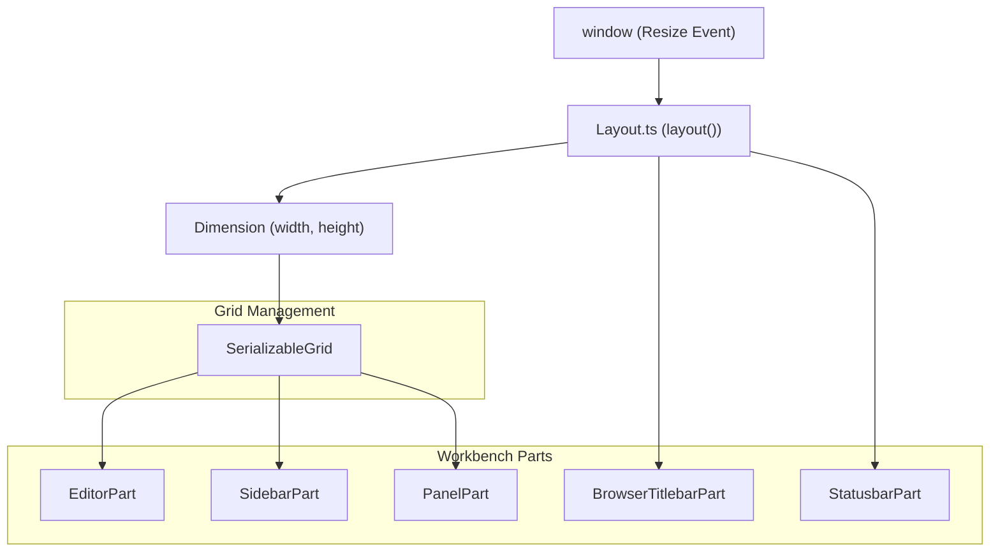
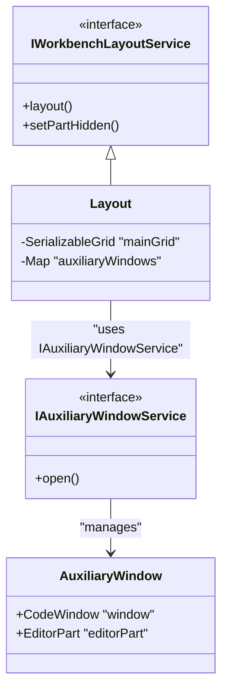

# Layout and Parts System

Relevant source files

The following files were used as context for generating this wiki page:

- [src/vs/base/browser/ui/actionbar/actionbar.css](https://github.com/microsoft/vscode/blob/HEAD/src/vs/base/browser/ui/actionbar/actionbar.css)
- [src/vs/base/browser/ui/splitview/paneview.css](https://github.com/microsoft/vscode/blob/HEAD/src/vs/base/browser/ui/splitview/paneview.css)
- [src/vs/base/browser/ui/splitview/paneview.ts](https://github.com/microsoft/vscode/blob/HEAD/src/vs/base/browser/ui/splitview/paneview.ts)
- [src/vs/base/test/browser/ui/splitview/paneview.test.ts](https://github.com/microsoft/vscode/blob/HEAD/src/vs/base/test/browser/ui/splitview/paneview.test.ts)
- [src/vs/platform/editor/common/editor.ts](https://github.com/microsoft/vscode/blob/HEAD/src/vs/platform/editor/common/editor.ts)
- [src/vs/workbench/browser/actions/layoutActions.ts](https://github.com/microsoft/vscode/blob/HEAD/src/vs/workbench/browser/actions/layoutActions.ts)
- [src/vs/workbench/browser/actions/windowActions.ts](https://github.com/microsoft/vscode/blob/HEAD/src/vs/workbench/browser/actions/windowActions.ts)
- [src/vs/workbench/browser/actions/workspaceActions.ts](https://github.com/microsoft/vscode/blob/HEAD/src/vs/workbench/browser/actions/workspaceActions.ts)
- [src/vs/workbench/browser/actions/workspaceCommands.ts](https://github.com/microsoft/vscode/blob/HEAD/src/vs/workbench/browser/actions/workspaceCommands.ts)
- [src/vs/workbench/browser/composite.ts](https://github.com/microsoft/vscode/blob/HEAD/src/vs/workbench/browser/composite.ts)
- [src/vs/workbench/browser/contextkeys.ts](https://github.com/microsoft/vscode/blob/HEAD/src/vs/workbench/browser/contextkeys.ts)
- [src/vs/workbench/browser/layout.ts](https://github.com/microsoft/vscode/blob/HEAD/src/vs/workbench/browser/layout.ts)
- [src/vs/workbench/browser/media/floatingPanels.css](https://github.com/microsoft/vscode/blob/HEAD/src/vs/workbench/browser/media/floatingPanels.css)
- [src/vs/workbench/browser/panecomposite.ts](https://github.com/microsoft/vscode/blob/HEAD/src/vs/workbench/browser/panecomposite.ts)
- [src/vs/workbench/browser/part.ts](https://github.com/microsoft/vscode/blob/HEAD/src/vs/workbench/browser/part.ts)
- [src/vs/workbench/browser/parts/activitybar/activitybarPart.ts](https://github.com/microsoft/vscode/blob/HEAD/src/vs/workbench/browser/parts/activitybar/activitybarPart.ts)
- [src/vs/workbench/browser/parts/auxiliarybar/auxiliaryBarActions.ts](https://github.com/microsoft/vscode/blob/HEAD/src/vs/workbench/browser/parts/auxiliarybar/auxiliaryBarActions.ts)
- [src/vs/workbench/browser/parts/auxiliarybar/auxiliaryBarPart.ts](https://github.com/microsoft/vscode/blob/HEAD/src/vs/workbench/browser/parts/auxiliarybar/auxiliaryBarPart.ts)
- [src/vs/workbench/browser/parts/auxiliarybar/media/auxiliaryBarPart.css](https://github.com/microsoft/vscode/blob/HEAD/src/vs/workbench/browser/parts/auxiliarybar/media/auxiliaryBarPart.css)
- [src/vs/workbench/browser/parts/compositeBar.ts](https://github.com/microsoft/vscode/blob/HEAD/src/vs/workbench/browser/parts/compositeBar.ts)
- [src/vs/workbench/browser/parts/compositeBarActions.ts](https://github.com/microsoft/vscode/blob/HEAD/src/vs/workbench/browser/parts/compositeBarActions.ts)
- [src/vs/workbench/browser/parts/compositePart.ts](https://github.com/microsoft/vscode/blob/HEAD/src/vs/workbench/browser/parts/compositePart.ts)
- [src/vs/workbench/browser/parts/editor/auxiliaryEditorPart.ts](https://github.com/microsoft/vscode/blob/HEAD/src/vs/workbench/browser/parts/editor/auxiliaryEditorPart.ts)
- [src/vs/workbench/browser/parts/editor/editor.contribution.ts](https://github.com/microsoft/vscode/blob/HEAD/src/vs/workbench/browser/parts/editor/editor.contribution.ts)
- [src/vs/workbench/browser/parts/editor/editor.ts](https://github.com/microsoft/vscode/blob/HEAD/src/vs/workbench/browser/parts/editor/editor.ts)
- [src/vs/workbench/browser/parts/editor/editorActions.ts](https://github.com/microsoft/vscode/blob/HEAD/src/vs/workbench/browser/parts/editor/editorActions.ts)
- [src/vs/workbench/browser/parts/editor/editorCommands.ts](https://github.com/microsoft/vscode/blob/HEAD/src/vs/workbench/browser/parts/editor/editorCommands.ts)
- [src/vs/workbench/browser/parts/editor/editorGroupView.ts](https://github.com/microsoft/vscode/blob/HEAD/src/vs/workbench/browser/parts/editor/editorGroupView.ts)
- [src/vs/workbench/browser/parts/editor/editorPart.ts](https://github.com/microsoft/vscode/blob/HEAD/src/vs/workbench/browser/parts/editor/editorPart.ts)
- [src/vs/workbench/browser/parts/editor/editorParts.ts](https://github.com/microsoft/vscode/blob/HEAD/src/vs/workbench/browser/parts/editor/editorParts.ts)
- [src/vs/workbench/browser/parts/editor/media/modalEditorPart.css](https://github.com/microsoft/vscode/blob/HEAD/src/vs/workbench/browser/parts/editor/media/modalEditorPart.css)
- [src/vs/workbench/browser/parts/editor/modalEditorPart.ts](https://github.com/microsoft/vscode/blob/HEAD/src/vs/workbench/browser/parts/editor/modalEditorPart.ts)
- [src/vs/workbench/browser/parts/media/paneCompositePart.css](https://github.com/microsoft/vscode/blob/HEAD/src/vs/workbench/browser/parts/media/paneCompositePart.css)
- [src/vs/workbench/browser/parts/paneCompositeBar.ts](https://github.com/microsoft/vscode/blob/HEAD/src/vs/workbench/browser/parts/paneCompositeBar.ts)
- [src/vs/workbench/browser/parts/paneCompositePart.ts](https://github.com/microsoft/vscode/blob/HEAD/src/vs/workbench/browser/parts/paneCompositePart.ts)
- [src/vs/workbench/browser/parts/panel/media/panelpart.css](https://github.com/microsoft/vscode/blob/HEAD/src/vs/workbench/browser/parts/panel/media/panelpart.css)
- [src/vs/workbench/browser/parts/panel/panelActions.ts](https://github.com/microsoft/vscode/blob/HEAD/src/vs/workbench/browser/parts/panel/panelActions.ts)
- [src/vs/workbench/browser/parts/panel/panelPart.ts](https://github.com/microsoft/vscode/blob/HEAD/src/vs/workbench/browser/parts/panel/panelPart.ts)
- [src/vs/workbench/browser/parts/sidebar/media/sidebarpart.css](https://github.com/microsoft/vscode/blob/HEAD/src/vs/workbench/browser/parts/sidebar/media/sidebarpart.css)
- [src/vs/workbench/browser/parts/sidebar/sidebarPart.ts](https://github.com/microsoft/vscode/blob/HEAD/src/vs/workbench/browser/parts/sidebar/sidebarPart.ts)
- [src/vs/workbench/browser/parts/views/media/paneviewlet.css](https://github.com/microsoft/vscode/blob/HEAD/src/vs/workbench/browser/parts/views/media/paneviewlet.css)
- [src/vs/workbench/browser/parts/views/viewMenuActions.ts](https://github.com/microsoft/vscode/blob/HEAD/src/vs/workbench/browser/parts/views/viewMenuActions.ts)
- [src/vs/workbench/browser/parts/views/viewPane.ts](https://github.com/microsoft/vscode/blob/HEAD/src/vs/workbench/browser/parts/views/viewPane.ts)
- [src/vs/workbench/browser/parts/views/viewPaneContainer.ts](https://github.com/microsoft/vscode/blob/HEAD/src/vs/workbench/browser/parts/views/viewPaneContainer.ts)
- [src/vs/workbench/browser/workbench.contribution.ts](https://github.com/microsoft/vscode/blob/HEAD/src/vs/workbench/browser/workbench.contribution.ts)
- [src/vs/workbench/browser/workbench.ts](https://github.com/microsoft/vscode/blob/HEAD/src/vs/workbench/browser/workbench.ts)
- [src/vs/workbench/common/contextkeys.ts](https://github.com/microsoft/vscode/blob/HEAD/src/vs/workbench/common/contextkeys.ts)
- [src/vs/workbench/common/editor.ts](https://github.com/microsoft/vscode/blob/HEAD/src/vs/workbench/common/editor.ts)
- [src/vs/workbench/common/editor/editorGroupModel.ts](https://github.com/microsoft/vscode/blob/HEAD/src/vs/workbench/common/editor/editorGroupModel.ts)
- [src/vs/workbench/common/editor/filteredEditorGroupModel.ts](https://github.com/microsoft/vscode/blob/HEAD/src/vs/workbench/common/editor/filteredEditorGroupModel.ts)
- [src/vs/workbench/contrib/chat/test/browser/agentSessions/agentSessionsRenderer.test.ts](https://github.com/microsoft/vscode/blob/HEAD/src/vs/workbench/contrib/chat/test/browser/agentSessions/agentSessionsRenderer.test.ts)
- [src/vs/workbench/contrib/styleOverrides/browser/media/activityBar.css](https://github.com/microsoft/vscode/blob/HEAD/src/vs/workbench/contrib/styleOverrides/browser/media/activityBar.css)
- [src/vs/workbench/contrib/styleOverrides/browser/media/editorBorder.css](https://github.com/microsoft/vscode/blob/HEAD/src/vs/workbench/contrib/styleOverrides/browser/media/editorBorder.css)
- [src/vs/workbench/contrib/styleOverrides/browser/media/fontRamp.css](https://github.com/microsoft/vscode/blob/HEAD/src/vs/workbench/contrib/styleOverrides/browser/media/fontRamp.css)
- [src/vs/workbench/contrib/styleOverrides/browser/media/notificationsDialogs.css](https://github.com/microsoft/vscode/blob/HEAD/src/vs/workbench/contrib/styleOverrides/browser/media/notificationsDialogs.css)
- [src/vs/workbench/contrib/styleOverrides/browser/media/padding.css](https://github.com/microsoft/vscode/blob/HEAD/src/vs/workbench/contrib/styleOverrides/browser/media/padding.css)
- [src/vs/workbench/contrib/styleOverrides/browser/media/paneHeaders.css](https://github.com/microsoft/vscode/blob/HEAD/src/vs/workbench/contrib/styleOverrides/browser/media/paneHeaders.css)
- [src/vs/workbench/contrib/styleOverrides/browser/media/roundedCorners.css](https://github.com/microsoft/vscode/blob/HEAD/src/vs/workbench/contrib/styleOverrides/browser/media/roundedCorners.css)
- [src/vs/workbench/contrib/styleOverrides/browser/media/statusBar.css](https://github.com/microsoft/vscode/blob/HEAD/src/vs/workbench/contrib/styleOverrides/browser/media/statusBar.css)
- [src/vs/workbench/contrib/styleOverrides/browser/media/tabs.css](https://github.com/microsoft/vscode/blob/HEAD/src/vs/workbench/contrib/styleOverrides/browser/media/tabs.css)
- [src/vs/workbench/contrib/styleOverrides/browser/media/titlebar.css](https://github.com/microsoft/vscode/blob/HEAD/src/vs/workbench/contrib/styleOverrides/browser/media/titlebar.css)
- [src/vs/workbench/contrib/styleOverrides/browser/styleOverrides.contribution.ts](https://github.com/microsoft/vscode/blob/HEAD/src/vs/workbench/contrib/styleOverrides/browser/styleOverrides.contribution.ts)
- [src/vs/workbench/contrib/styleOverrides/test/browser/styleOverrides.contribution.test.ts](https://github.com/microsoft/vscode/blob/HEAD/src/vs/workbench/contrib/styleOverrides/test/browser/styleOverrides.contribution.test.ts)
- [src/vs/workbench/services/editor/browser/editorService.ts](https://github.com/microsoft/vscode/blob/HEAD/src/vs/workbench/services/editor/browser/editorService.ts)
- [src/vs/workbench/services/editor/common/editorGroupFinder.ts](https://github.com/microsoft/vscode/blob/HEAD/src/vs/workbench/services/editor/common/editorGroupFinder.ts)
- [src/vs/workbench/services/editor/common/editorGroupsService.ts](https://github.com/microsoft/vscode/blob/HEAD/src/vs/workbench/services/editor/common/editorGroupsService.ts)
- [src/vs/workbench/services/editor/common/editorService.ts](https://github.com/microsoft/vscode/blob/HEAD/src/vs/workbench/services/editor/common/editorService.ts)
- [src/vs/workbench/services/editor/test/browser/editorGroupsService.test.ts](https://github.com/microsoft/vscode/blob/HEAD/src/vs/workbench/services/editor/test/browser/editorGroupsService.test.ts)
- [src/vs/workbench/services/editor/test/browser/editorService.test.ts](https://github.com/microsoft/vscode/blob/HEAD/src/vs/workbench/services/editor/test/browser/editorService.test.ts)
- [src/vs/workbench/services/editor/test/browser/modalEditorGroup.test.ts](https://github.com/microsoft/vscode/blob/HEAD/src/vs/workbench/services/editor/test/browser/modalEditorGroup.test.ts)
- [src/vs/workbench/services/layout/browser/layoutService.ts](https://github.com/microsoft/vscode/blob/HEAD/src/vs/workbench/services/layout/browser/layoutService.ts)
- [src/vs/workbench/services/layout/test/browser/layoutService.test.ts](https://github.com/microsoft/vscode/blob/HEAD/src/vs/workbench/services/layout/test/browser/layoutService.test.ts)
- [src/vs/workbench/services/progress/browser/media/progressService.css](https://github.com/microsoft/vscode/blob/HEAD/src/vs/workbench/services/progress/browser/media/progressService.css)
- [src/vs/workbench/services/views/browser/viewDescriptorService.ts](https://github.com/microsoft/vscode/blob/HEAD/src/vs/workbench/services/views/browser/viewDescriptorService.ts)
- [src/vs/workbench/services/views/browser/viewsService.ts](https://github.com/microsoft/vscode/blob/HEAD/src/vs/workbench/services/views/browser/viewsService.ts)
- [src/vs/workbench/services/views/common/viewContainerModel.ts](https://github.com/microsoft/vscode/blob/HEAD/src/vs/workbench/services/views/common/viewContainerModel.ts)
- [src/vs/workbench/services/views/common/viewsService.ts](https://github.com/microsoft/vscode/blob/HEAD/src/vs/workbench/services/views/common/viewsService.ts)
- [src/vs/workbench/services/views/test/browser/viewContainerModel.test.ts](https://github.com/microsoft/vscode/blob/HEAD/src/vs/workbench/services/views/test/browser/viewContainerModel.test.ts)
- [src/vs/workbench/services/views/test/browser/viewDescriptorService.test.ts](https://github.com/microsoft/vscode/blob/HEAD/src/vs/workbench/services/views/test/browser/viewDescriptorService.test.ts)
- [src/vs/workbench/test/browser/part.test.ts](https://github.com/microsoft/vscode/blob/HEAD/src/vs/workbench/test/browser/part.test.ts)
- [src/vs/workbench/test/browser/parts/activitybar/activitybarPart.test.ts](https://github.com/microsoft/vscode/blob/HEAD/src/vs/workbench/test/browser/parts/activitybar/activitybarPart.test.ts)
- [src/vs/workbench/test/browser/parts/editor/editorGroupModel.test.ts](https://github.com/microsoft/vscode/blob/HEAD/src/vs/workbench/test/browser/parts/editor/editorGroupModel.test.ts)
- [src/vs/workbench/test/browser/parts/editor/filteredEditorGroupModel.test.ts](https://github.com/microsoft/vscode/blob/HEAD/src/vs/workbench/test/browser/parts/editor/filteredEditorGroupModel.test.ts)
- [src/vs/workbench/test/browser/workbenchTestServices.ts](https://github.com/microsoft/vscode/blob/HEAD/src/vs/workbench/test/browser/workbenchTestServices.ts)

The VS Code workbench UI is organized into a set of discrete **Parts** managed by a central **Layout** engine. This system handles the positioning, sizing, and visibility of high-level UI components such as the Editor, Sidebar, and Panel, while supporting advanced states like Zen Mode, Centered Layout, and multi-window environments via auxiliary windows.

## The Layout Engine

The `Layout` class in `vs/workbench/browser/layout.ts` is the orchestrator for the workbench UI. It implements `IWorkbenchLayoutService` and is responsible for calculating the dimensions of every Part based on the window size and user configuration [src/vs/workbench/browser/layout.ts:15-15](https://github.com/microsoft/vscode/blob/HEAD/src/vs/workbench/browser/layout.ts#L15).

### Core Responsibilities
- **Part Orchestration**: Manages the lifecycle and visibility of the primary workbench parts [src/vs/workbench/browser/layout.ts:15-15](https://github.com/microsoft/vscode/blob/HEAD/src/vs/workbench/browser/layout.ts#L15).
- **Grid Management**: Uses a `SerializableGrid` to maintain the spatial relationship between the Sidebar, Editor, Panel, and Auxiliary Bar [src/vs/workbench/browser/layout.ts:27-28](https://github.com/microsoft/vscode/blob/HEAD/src/vs/workbench/browser/layout.ts#L27-L28).
- **State Persistence**: Saves and restores layout state (e.g., part sizes, visibility) via `IStorageService` [src/vs/workbench/browser/layout.ts:17-17](https://github.com/microsoft/vscode/blob/HEAD/src/vs/workbench/browser/layout.ts#L17).
- **Window Management**: Coordinates with `IAuxiliaryWindowService` to support parts in secondary floating windows [src/vs/workbench/browser/layout.ts:49-51](https://github.com/microsoft/vscode/blob/HEAD/src/vs/workbench/browser/layout.ts#L49-L51).

### Workbench Parts (The `Parts` Enum)
The workbench is divided into several functional areas defined in the `Parts` enum [src/vs/workbench/services/layout/browser/layoutService.ts:15-15](https://github.com/microsoft/vscode/blob/HEAD/src/vs/workbench/services/layout/browser/layoutService.ts#L15). Parts are categorized into `SINGLE_WINDOW_PARTS` (fixed to the main window, e.g., Status Bar) and `MULTI_WINDOW_PARTS` (can appear in auxiliary windows, e.g., Editor Part) [src/vs/workbench/services/layout/browser/layoutService.ts:15-15](https://github.com/microsoft/vscode/blob/HEAD/src/vs/workbench/services/layout/browser/layoutService.ts#L15).

| Part | Description | Implementation Class |
| :--- | :--- | :--- |
| `TITLEBAR_PART` | The top-most bar containing window controls and menu. | `BrowserTitlebarPart` [src/vs/workbench/browser/parts/titlebar/titlebarPart.ts:91-91](https://github.com/microsoft/vscode/blob/HEAD/src/vs/workbench/browser/parts/titlebar/titlebarPart.ts#L91) |
| `BANNER_PART` | A thin strip below the title bar for global notifications. | `BannerPart` [src/vs/workbench/browser/layout.ts:47-47](https://github.com/microsoft/vscode/blob/HEAD/src/vs/workbench/browser/layout.ts#L47) |
| `ACTIVITYBAR_PART` | The narrow vertical bar for switching view containers. | `ActivitybarPart` [src/vs/workbench/browser/parts/activitybar/activitybarPart.ts:44-44](https://github.com/microsoft/vscode/blob/HEAD/src/vs/workbench/browser/parts/activitybar/activitybarPart.ts#L44) |
| `SIDEBAR_PART` | The primary container for views (e.g., Explorer, Search). | `SidebarPart` [src/vs/workbench/browser/parts/sidebar/sidebarPart.ts:13-13](https://github.com/microsoft/vscode/blob/HEAD/src/vs/workbench/browser/parts/sidebar/sidebarPart.ts#L13) |
| `EDITOR_PART` | The central area where editor groups are rendered. | `EditorPart` [src/vs/workbench/browser/parts/editor/editorPart.ts:1-1](https://github.com/microsoft/vscode/blob/HEAD/src/vs/workbench/browser/parts/editor/editorPart.ts#L1) |
| `PANEL_PART` | The bottom (or side) area for Output, Terminal, etc. | `PanelPart` [src/vs/workbench/browser/parts/panel/panelPart.ts:36-36](https://github.com/microsoft/vscode/blob/HEAD/src/vs/workbench/browser/parts/panel/panelPart.ts#L36) |
| `AUXILIARYBAR_PART` | An additional sidebar on the opposite side of the Sidebar. | `AuxiliaryBarPart` [src/vs/workbench/browser/parts/auxiliarybar/auxiliaryBarPart.ts:49-49](https://github.com/microsoft/vscode/blob/HEAD/src/vs/workbench/browser/parts/auxiliarybar/auxiliaryBarPart.ts#L49) |
| `STATUSBAR_PART` | The bottom-most bar for status indicators and actions. | `StatusbarPart` [src/vs/workbench/browser/parts/statusbar/statusbarPart.ts:120-120](https://github.com/microsoft/vscode/blob/HEAD/src/vs/workbench/browser/parts/statusbar/statusbarPart.ts#L120) |

### Layout Logic Data Flow
The following diagram illustrates how the `Layout` class processes window resize events to update the Parts.

**Title: Layout Update Data Flow**

Sources: [src/vs/workbench/browser/layout.ts:15-121](https://github.com/microsoft/vscode/blob/HEAD/src/vs/workbench/browser/layout.ts#L15-L121), [src/vs/workbench/services/layout/browser/layoutService.ts:15-15](https://github.com/microsoft/vscode/blob/HEAD/src/vs/workbench/services/layout/browser/layoutService.ts#L15), [src/vs/workbench/browser/parts/panel/panelPart.ts:36-65](https://github.com/microsoft/vscode/blob/HEAD/src/vs/workbench/browser/parts/panel/panelPart.ts#L36-L65)

---

## Visibility and Toggling

The layout system provides methods to toggle the visibility of parts, which triggers a re-layout of the remaining visible parts.

- **Methods**: Functions like `setPartHidden(hidden, part)` modify the `ILayoutRuntimeState` [src/vs/workbench/browser/layout.ts:57-69](https://github.com/microsoft/vscode/blob/HEAD/src/vs/workbench/browser/layout.ts#L57-L69).
- **CSS Classes**: The layout engine applies specific CSS classes to the workbench container (e.g., `nosidebar`, `nopanel`, `fullscreen`) to hide elements via CSS and adjust grid spacing [src/vs/workbench/browser/layout.ts:99-121](https://github.com/microsoft/vscode/blob/HEAD/src/vs/workbench/browser/layout.ts#L99-L121).
- **Zen Mode**: A special state that hides all parts except the Editor and Titlebar (optional), managed via `zenMode.transitionDisposables` [src/vs/workbench/browser/layout.ts:66-68](https://github.com/microsoft/vscode/blob/HEAD/src/vs/workbench/browser/layout.ts#L66-L68). Configuration is defined in `ZenModeSettings` [src/vs/workbench/services/layout/browser/layoutService.ts:15-15](https://github.com/microsoft/vscode/blob/HEAD/src/vs/workbench/services/layout/browser/layoutService.ts#L15).

### Panel Alignment and Position
The Panel can be positioned at the `BOTTOM`, `LEFT`, or `RIGHT` [src/vs/workbench/services/layout/browser/layoutService.ts:15-15](https://github.com/microsoft/vscode/blob/HEAD/src/vs/workbench/services/layout/browser/layoutService.ts#L15). When at the bottom, it supports `PanelAlignment` (Left, Center, Right, Justify), which controls the horizontal span of the panel relative to the Sidebar and Auxiliary Bar [src/vs/workbench/services/layout/browser/layoutService.ts:15-15](https://github.com/microsoft/vscode/blob/HEAD/src/vs/workbench/services/layout/browser/layoutService.ts#L15). Alignment is toggled via actions like `TogglePanelAlignmentAction` [src/vs/workbench/browser/actions/layoutActions.ts:50-53](https://github.com/microsoft/vscode/blob/HEAD/src/vs/workbench/browser/actions/layoutActions.ts#L50-L53).

---

## Multi-Window Support

VS Code supports moving parts (specifically Editor Groups) into auxiliary windows. This is handled by the `IAuxiliaryWindowService`.

- **Auxiliary Windows**: Created via secondary windows but managed as first-class workbench windows [src/vs/workbench/browser/layout.ts:51-51](https://github.com/microsoft/vscode/blob/HEAD/src/vs/workbench/browser/layout.ts#L51).
- **Part Injection**: The `Layout` class distinguishes between `SINGLE_WINDOW_PARTS` (main window only) and `MULTI_WINDOW_PARTS` (can exist in auxiliary windows) [src/vs/workbench/services/layout/browser/layoutService.ts:15-15](https://github.com/microsoft/vscode/blob/HEAD/src/vs/workbench/services/layout/browser/layoutService.ts#L15).
- **Service Integration**: `IAuxiliaryWindowService` coordinates with `IWorkbenchLayoutService` to ensure appropriate parts are instantiated in the window's DOM [src/vs/workbench/browser/layout.ts:49-51](https://github.com/microsoft/vscode/blob/HEAD/src/vs/workbench/browser/layout.ts#L49-L51).

**Title: Multi-Window Entity Relationship**

Sources: [src/vs/workbench/browser/layout.ts:49-51](https://github.com/microsoft/vscode/blob/HEAD/src/vs/workbench/browser/layout.ts#L49-L51), [src/vs/workbench/services/layout/browser/layoutService.ts:15-15](https://github.com/microsoft/vscode/blob/HEAD/src/vs/workbench/services/layout/browser/layoutService.ts#L15)

---

## Implementation Details

### The Grid System
The core of the workbench layout is a `SerializableGrid` [src/vs/workbench/browser/layout.ts:28-28](https://github.com/microsoft/vscode/blob/HEAD/src/vs/workbench/browser/layout.ts#L28). This grid handles the complex math of "Sash" dragging and proportional resizing.
1. **View Descriptors**: Each Part implements `ISerializableView` [src/vs/workbench/browser/layout.ts:28-28](https://github.com/microsoft/vscode/blob/HEAD/src/vs/workbench/browser/layout.ts#L28).
2. **Orientation**: The grid uses `Orientation.VERTICAL` for the top-level (Titlebar, Main Area, Statusbar) and `Orientation.HORIZONTAL` within the Main Area (Sidebar, Editor, Auxiliary Bar) [src/vs/workbench/browser/layout.ts:28-28](https://github.com/microsoft/vscode/blob/HEAD/src/vs/workbench/browser/layout.ts#L28).

### Layout Lifecycle
1. **Initialization**: During startup, `Layout` processes the `ILayoutInitializationState` [src/vs/workbench/browser/layout.ts:76-92](https://github.com/microsoft/vscode/blob/HEAD/src/vs/workbench/browser/layout.ts#L76-L92).
2. **Creation**: The layout engine creates the workbench container and initializes the grid structure [src/vs/workbench/browser/layout.ts:99-121](https://github.com/microsoft/vscode/blob/HEAD/src/vs/workbench/browser/layout.ts#L99-L121).
3. **Bootstrap**: Coordinates with `ILifecycleService` for startup transitions [src/vs/workbench/browser/layout.ts:22-22](https://github.com/microsoft/vscode/blob/HEAD/src/vs/workbench/browser/layout.ts#L22).

### Modern UI and Style Overrides
Recent updates introduce "Modern UI" experiments (e.g., floating panels, rounded tabs). These are often controlled by `StyleOverridesContribution` and the `LayoutClasses.STYLE_OVERRIDE` class [src/vs/workbench/browser/layout.ts:114-118](https://github.com/microsoft/vscode/blob/HEAD/src/vs/workbench/browser/layout.ts#L114-L118).
- **Floating Panels**: Reduces the size of the Activity Bar and Status Bar to create a "floating" effect [src/vs/workbench/browser/parts/activitybar/activitybarPart.ts:52-55](https://github.com/microsoft/vscode/blob/HEAD/src/vs/workbench/browser/parts/activitybar/activitybarPart.ts#L52-L55).
- **Modern Tabs**: Implements transparent, rounded, borderless pills for editor tabs [src/vs/workbench/contrib/styleOverrides/browser/media/tabs.css:6-16](https://github.com/microsoft/vscode/blob/HEAD/src/vs/workbench/contrib/styleOverrides/browser/media/tabs.css#L6-L16).

Sources:
- [src/vs/workbench/browser/layout.ts:15-121](https://github.com/microsoft/vscode/blob/HEAD/src/vs/workbench/browser/layout.ts#L15-L121)
- [src/vs/workbench/services/layout/browser/layoutService.ts:15-15](https://github.com/microsoft/vscode/blob/HEAD/src/vs/workbench/services/layout/browser/layoutService.ts#L15)
- [src/vs/workbench/browser/parts/activitybar/activitybarPart.ts:44-97](https://github.com/microsoft/vscode/blob/HEAD/src/vs/workbench/browser/parts/activitybar/activitybarPart.ts#L44-L97)
- [src/vs/workbench/browser/parts/panel/panelPart.ts:36-112](https://github.com/microsoft/vscode/blob/HEAD/src/vs/workbench/browser/parts/panel/panelPart.ts#L36-L112)
- [src/vs/workbench/browser/parts/statusbar/statusbarPart.ts:120-140](https://github.com/microsoft/vscode/blob/HEAD/src/vs/workbench/browser/parts/statusbar/statusbarPart.ts#L120-L140)
- [src/vs/workbench/contrib/styleOverrides/browser/media/tabs.css:6-31](https://github.com/microsoft/vscode/blob/HEAD/src/vs/workbench/contrib/styleOverrides/browser/media/tabs.css#L6-L31)