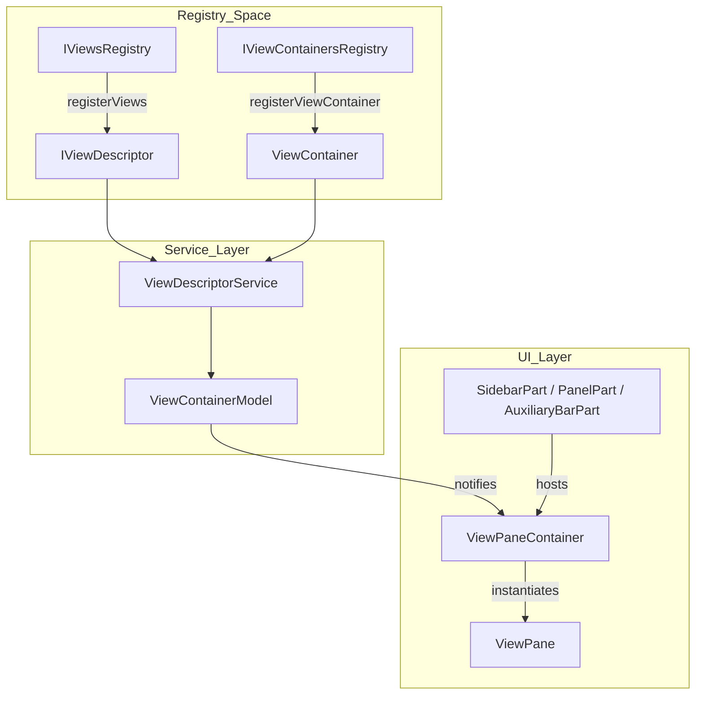
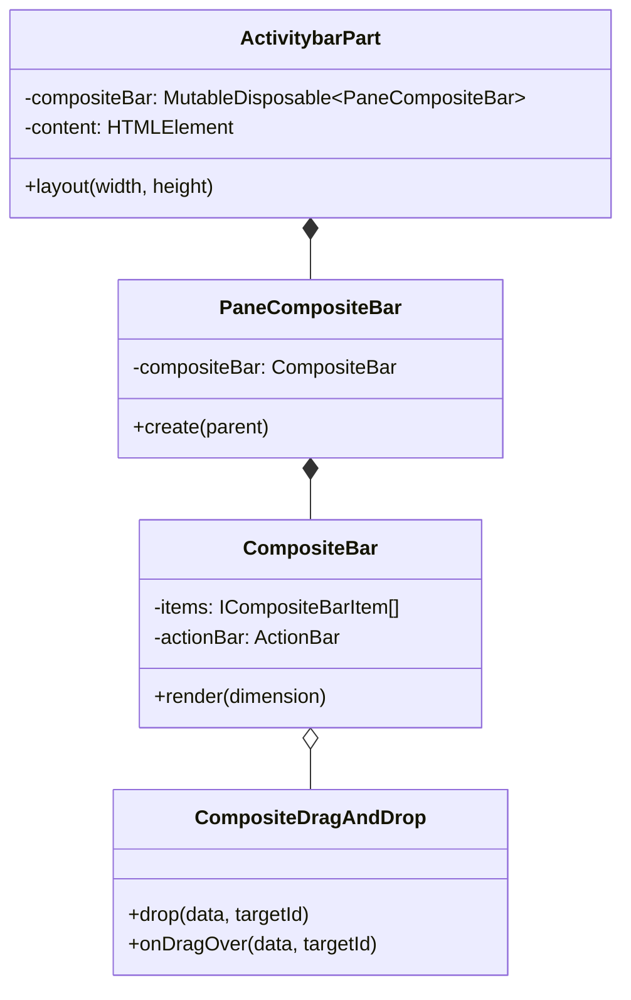

# Views, Panels, and Activity Bar

Relevant source files

The following files were used as context for generating this wiki page:

- [extensions/vscode-api-tests/src/singlefolder-tests/tree.test.ts](https://github.com/microsoft/vscode/blob/HEAD/extensions/vscode-api-tests/src/singlefolder-tests/tree.test.ts)
- [src/vs/base/browser/ui/actionbar/actionbar.css](https://github.com/microsoft/vscode/blob/HEAD/src/vs/base/browser/ui/actionbar/actionbar.css)
- [src/vs/base/browser/ui/keybindingLabel/keybindingLabel.ts](https://github.com/microsoft/vscode/blob/HEAD/src/vs/base/browser/ui/keybindingLabel/keybindingLabel.ts)
- [src/vs/base/browser/ui/splitview/paneview.css](https://github.com/microsoft/vscode/blob/HEAD/src/vs/base/browser/ui/splitview/paneview.css)
- [src/vs/base/browser/ui/splitview/paneview.ts](https://github.com/microsoft/vscode/blob/HEAD/src/vs/base/browser/ui/splitview/paneview.ts)
- [src/vs/base/test/browser/ui/splitview/paneview.test.ts](https://github.com/microsoft/vscode/blob/HEAD/src/vs/base/test/browser/ui/splitview/paneview.test.ts)
- [src/vs/workbench/api/browser/mainThreadCommands.ts](https://github.com/microsoft/vscode/blob/HEAD/src/vs/workbench/api/browser/mainThreadCommands.ts)
- [src/vs/workbench/api/browser/mainThreadDocumentContentProviders.ts](https://github.com/microsoft/vscode/blob/HEAD/src/vs/workbench/api/browser/mainThreadDocumentContentProviders.ts)
- [src/vs/workbench/api/browser/mainThreadLabelService.ts](https://github.com/microsoft/vscode/blob/HEAD/src/vs/workbench/api/browser/mainThreadLabelService.ts)
- [src/vs/workbench/api/browser/mainThreadTreeViews.ts](https://github.com/microsoft/vscode/blob/HEAD/src/vs/workbench/api/browser/mainThreadTreeViews.ts)
- [src/vs/workbench/api/common/extHostApiCommands.ts](https://github.com/microsoft/vscode/blob/HEAD/src/vs/workbench/api/common/extHostApiCommands.ts)
- [src/vs/workbench/api/common/extHostCommands.ts](https://github.com/microsoft/vscode/blob/HEAD/src/vs/workbench/api/common/extHostCommands.ts)
- [src/vs/workbench/api/common/extHostDocumentContentProviders.ts](https://github.com/microsoft/vscode/blob/HEAD/src/vs/workbench/api/common/extHostDocumentContentProviders.ts)
- [src/vs/workbench/api/common/extHostTreeViews.ts](https://github.com/microsoft/vscode/blob/HEAD/src/vs/workbench/api/common/extHostTreeViews.ts)
- [src/vs/workbench/api/test/browser/extHostCommands.test.ts](https://github.com/microsoft/vscode/blob/HEAD/src/vs/workbench/api/test/browser/extHostCommands.test.ts)
- [src/vs/workbench/api/test/browser/extHostDocumentContentProvider.test.ts](https://github.com/microsoft/vscode/blob/HEAD/src/vs/workbench/api/test/browser/extHostDocumentContentProvider.test.ts)
- [src/vs/workbench/api/test/browser/extHostTreeViews.test.ts](https://github.com/microsoft/vscode/blob/HEAD/src/vs/workbench/api/test/browser/extHostTreeViews.test.ts)
- [src/vs/workbench/api/test/browser/mainThreadBulkEdits.test.ts](https://github.com/microsoft/vscode/blob/HEAD/src/vs/workbench/api/test/browser/mainThreadBulkEdits.test.ts)
- [src/vs/workbench/api/test/browser/mainThreadCommands.test.ts](https://github.com/microsoft/vscode/blob/HEAD/src/vs/workbench/api/test/browser/mainThreadCommands.test.ts)
- [src/vs/workbench/api/test/browser/mainThreadDiagnostics.test.ts](https://github.com/microsoft/vscode/blob/HEAD/src/vs/workbench/api/test/browser/mainThreadDiagnostics.test.ts)
- [src/vs/workbench/api/test/browser/mainThreadDocumentContentProviders.test.ts](https://github.com/microsoft/vscode/blob/HEAD/src/vs/workbench/api/test/browser/mainThreadDocumentContentProviders.test.ts)
- [src/vs/workbench/api/test/browser/mainThreadTreeViews.test.ts](https://github.com/microsoft/vscode/blob/HEAD/src/vs/workbench/api/test/browser/mainThreadTreeViews.test.ts)
- [src/vs/workbench/api/test/common/testRPCProtocol.ts](https://github.com/microsoft/vscode/blob/HEAD/src/vs/workbench/api/test/common/testRPCProtocol.ts)
- [src/vs/workbench/browser/composite.ts](https://github.com/microsoft/vscode/blob/HEAD/src/vs/workbench/browser/composite.ts)
- [src/vs/workbench/browser/media/floatingPanels.css](https://github.com/microsoft/vscode/blob/HEAD/src/vs/workbench/browser/media/floatingPanels.css)
- [src/vs/workbench/browser/media/part.css](https://github.com/microsoft/vscode/blob/HEAD/src/vs/workbench/browser/media/part.css)
- [src/vs/workbench/browser/panecomposite.ts](https://github.com/microsoft/vscode/blob/HEAD/src/vs/workbench/browser/panecomposite.ts)
- [src/vs/workbench/browser/part.ts](https://github.com/microsoft/vscode/blob/HEAD/src/vs/workbench/browser/part.ts)
- [src/vs/workbench/browser/parts/activitybar/activitybarPart.ts](https://github.com/microsoft/vscode/blob/HEAD/src/vs/workbench/browser/parts/activitybar/activitybarPart.ts)
- [src/vs/workbench/browser/parts/auxiliarybar/auxiliaryBarPart.ts](https://github.com/microsoft/vscode/blob/HEAD/src/vs/workbench/browser/parts/auxiliarybar/auxiliaryBarPart.ts)
- [src/vs/workbench/browser/parts/auxiliarybar/media/auxiliaryBarPart.css](https://github.com/microsoft/vscode/blob/HEAD/src/vs/workbench/browser/parts/auxiliarybar/media/auxiliaryBarPart.css)
- [src/vs/workbench/browser/parts/compositeBar.ts](https://github.com/microsoft/vscode/blob/HEAD/src/vs/workbench/browser/parts/compositeBar.ts)
- [src/vs/workbench/browser/parts/compositeBarActions.ts](https://github.com/microsoft/vscode/blob/HEAD/src/vs/workbench/browser/parts/compositeBarActions.ts)
- [src/vs/workbench/browser/parts/compositePart.ts](https://github.com/microsoft/vscode/blob/HEAD/src/vs/workbench/browser/parts/compositePart.ts)
- [src/vs/workbench/browser/parts/editor/editorGroupWatermark.ts](https://github.com/microsoft/vscode/blob/HEAD/src/vs/workbench/browser/parts/editor/editorGroupWatermark.ts)
- [src/vs/workbench/browser/parts/editor/media/editorgroupview.css](https://github.com/microsoft/vscode/blob/HEAD/src/vs/workbench/browser/parts/editor/media/editorgroupview.css)
- [src/vs/workbench/browser/parts/media/paneCompositePart.css](https://github.com/microsoft/vscode/blob/HEAD/src/vs/workbench/browser/parts/media/paneCompositePart.css)
- [src/vs/workbench/browser/parts/paneCompositeBar.ts](https://github.com/microsoft/vscode/blob/HEAD/src/vs/workbench/browser/parts/paneCompositeBar.ts)
- [src/vs/workbench/browser/parts/paneCompositePart.ts](https://github.com/microsoft/vscode/blob/HEAD/src/vs/workbench/browser/parts/paneCompositePart.ts)
- [src/vs/workbench/browser/parts/panel/media/panelpart.css](https://github.com/microsoft/vscode/blob/HEAD/src/vs/workbench/browser/parts/panel/media/panelpart.css)
- [src/vs/workbench/browser/parts/panel/panelPart.ts](https://github.com/microsoft/vscode/blob/HEAD/src/vs/workbench/browser/parts/panel/panelPart.ts)
- [src/vs/workbench/browser/parts/sidebar/media/sidebarpart.css](https://github.com/microsoft/vscode/blob/HEAD/src/vs/workbench/browser/parts/sidebar/media/sidebarpart.css)
- [src/vs/workbench/browser/parts/sidebar/sidebarPart.ts](https://github.com/microsoft/vscode/blob/HEAD/src/vs/workbench/browser/parts/sidebar/sidebarPart.ts)
- [src/vs/workbench/browser/parts/views/media/paneviewlet.css](https://github.com/microsoft/vscode/blob/HEAD/src/vs/workbench/browser/parts/views/media/paneviewlet.css)
- [src/vs/workbench/browser/parts/views/media/views.css](https://github.com/microsoft/vscode/blob/HEAD/src/vs/workbench/browser/parts/views/media/views.css)
- [src/vs/workbench/browser/parts/views/treeView.ts](https://github.com/microsoft/vscode/blob/HEAD/src/vs/workbench/browser/parts/views/treeView.ts)
- [src/vs/workbench/browser/parts/views/viewFilter.ts](https://github.com/microsoft/vscode/blob/HEAD/src/vs/workbench/browser/parts/views/viewFilter.ts)
- [src/vs/workbench/browser/parts/views/viewMenuActions.ts](https://github.com/microsoft/vscode/blob/HEAD/src/vs/workbench/browser/parts/views/viewMenuActions.ts)
- [src/vs/workbench/browser/parts/views/viewPane.ts](https://github.com/microsoft/vscode/blob/HEAD/src/vs/workbench/browser/parts/views/viewPane.ts)
- [src/vs/workbench/browser/parts/views/viewPaneContainer.ts](https://github.com/microsoft/vscode/blob/HEAD/src/vs/workbench/browser/parts/views/viewPaneContainer.ts)
- [src/vs/workbench/common/composite.ts](https://github.com/microsoft/vscode/blob/HEAD/src/vs/workbench/common/composite.ts)
- [src/vs/workbench/common/panecomposite.ts](https://github.com/microsoft/vscode/blob/HEAD/src/vs/workbench/common/panecomposite.ts)
- [src/vs/workbench/common/views.ts](https://github.com/microsoft/vscode/blob/HEAD/src/vs/workbench/common/views.ts)
- [src/vs/workbench/contrib/chat/test/browser/agentSessions/agentSessionsRenderer.test.ts](https://github.com/microsoft/vscode/blob/HEAD/src/vs/workbench/contrib/chat/test/browser/agentSessions/agentSessionsRenderer.test.ts)
- [src/vs/workbench/contrib/preferences/browser/keybindingWidgets.ts](https://github.com/microsoft/vscode/blob/HEAD/src/vs/workbench/contrib/preferences/browser/keybindingWidgets.ts)
- [src/vs/workbench/contrib/scm/browser/scmInput.ts](https://github.com/microsoft/vscode/blob/HEAD/src/vs/workbench/contrib/scm/browser/scmInput.ts)
- [src/vs/workbench/contrib/styleOverrides/browser/media/activityBar.css](https://github.com/microsoft/vscode/blob/HEAD/src/vs/workbench/contrib/styleOverrides/browser/media/activityBar.css)
- [src/vs/workbench/contrib/styleOverrides/browser/media/editorBorder.css](https://github.com/microsoft/vscode/blob/HEAD/src/vs/workbench/contrib/styleOverrides/browser/media/editorBorder.css)
- [src/vs/workbench/contrib/styleOverrides/browser/media/fontRamp.css](https://github.com/microsoft/vscode/blob/HEAD/src/vs/workbench/contrib/styleOverrides/browser/media/fontRamp.css)
- [src/vs/workbench/contrib/styleOverrides/browser/media/notificationsDialogs.css](https://github.com/microsoft/vscode/blob/HEAD/src/vs/workbench/contrib/styleOverrides/browser/media/notificationsDialogs.css)
- [src/vs/workbench/contrib/styleOverrides/browser/media/padding.css](https://github.com/microsoft/vscode/blob/HEAD/src/vs/workbench/contrib/styleOverrides/browser/media/padding.css)
- [src/vs/workbench/contrib/styleOverrides/browser/media/paneHeaders.css](https://github.com/microsoft/vscode/blob/HEAD/src/vs/workbench/contrib/styleOverrides/browser/media/paneHeaders.css)
- [src/vs/workbench/contrib/styleOverrides/browser/media/roundedCorners.css](https://github.com/microsoft/vscode/blob/HEAD/src/vs/workbench/contrib/styleOverrides/browser/media/roundedCorners.css)
- [src/vs/workbench/contrib/styleOverrides/browser/media/statusBar.css](https://github.com/microsoft/vscode/blob/HEAD/src/vs/workbench/contrib/styleOverrides/browser/media/statusBar.css)
- [src/vs/workbench/contrib/styleOverrides/browser/media/tabs.css](https://github.com/microsoft/vscode/blob/HEAD/src/vs/workbench/contrib/styleOverrides/browser/media/tabs.css)
- [src/vs/workbench/contrib/styleOverrides/browser/media/titlebar.css](https://github.com/microsoft/vscode/blob/HEAD/src/vs/workbench/contrib/styleOverrides/browser/media/titlebar.css)
- [src/vs/workbench/contrib/styleOverrides/browser/styleOverrides.contribution.ts](https://github.com/microsoft/vscode/blob/HEAD/src/vs/workbench/contrib/styleOverrides/browser/styleOverrides.contribution.ts)
- [src/vs/workbench/contrib/styleOverrides/test/browser/styleOverrides.contribution.test.ts](https://github.com/microsoft/vscode/blob/HEAD/src/vs/workbench/contrib/styleOverrides/test/browser/styleOverrides.contribution.test.ts)
- [src/vs/workbench/services/layout/test/browser/layoutService.test.ts](https://github.com/microsoft/vscode/blob/HEAD/src/vs/workbench/services/layout/test/browser/layoutService.test.ts)
- [src/vs/workbench/services/progress/browser/media/progressService.css](https://github.com/microsoft/vscode/blob/HEAD/src/vs/workbench/services/progress/browser/media/progressService.css)
- [src/vs/workbench/services/progress/browser/progressIndicator.ts](https://github.com/microsoft/vscode/blob/HEAD/src/vs/workbench/services/progress/browser/progressIndicator.ts)
- [src/vs/workbench/services/progress/test/browser/progressIndicator.test.ts](https://github.com/microsoft/vscode/blob/HEAD/src/vs/workbench/services/progress/test/browser/progressIndicator.test.ts)
- [src/vs/workbench/services/views/browser/viewDescriptorService.ts](https://github.com/microsoft/vscode/blob/HEAD/src/vs/workbench/services/views/browser/viewDescriptorService.ts)
- [src/vs/workbench/services/views/browser/viewsService.ts](https://github.com/microsoft/vscode/blob/HEAD/src/vs/workbench/services/views/browser/viewsService.ts)
- [src/vs/workbench/services/views/common/viewContainerModel.ts](https://github.com/microsoft/vscode/blob/HEAD/src/vs/workbench/services/views/common/viewContainerModel.ts)
- [src/vs/workbench/services/views/common/viewsService.ts](https://github.com/microsoft/vscode/blob/HEAD/src/vs/workbench/services/views/common/viewsService.ts)
- [src/vs/workbench/services/views/test/browser/viewContainerModel.test.ts](https://github.com/microsoft/vscode/blob/HEAD/src/vs/workbench/services/views/test/browser/viewContainerModel.test.ts)
- [src/vs/workbench/services/views/test/browser/viewDescriptorService.test.ts](https://github.com/microsoft/vscode/blob/HEAD/src/vs/workbench/services/views/test/browser/viewDescriptorService.test.ts)
- [src/vs/workbench/test/browser/part.test.ts](https://github.com/microsoft/vscode/blob/HEAD/src/vs/workbench/test/browser/part.test.ts)
- [src/vs/workbench/test/browser/parts/activitybar/activitybarPart.test.ts](https://github.com/microsoft/vscode/blob/HEAD/src/vs/workbench/test/browser/parts/activitybar/activitybarPart.test.ts)
- [src/vs/workbench/test/browser/viewlet.test.ts](https://github.com/microsoft/vscode/blob/HEAD/src/vs/workbench/test/browser/viewlet.test.ts)

This page details the architectural components responsible for the management, layout, and rendering of views within the VS Code workbench. This includes the infrastructure for view containers (Sidebar, Panel, Auxiliary Bar), the services that track view state and locations, and the specific implementations for tree-based views.

## View Descriptor Service

The `ViewDescriptorService` is the central authority for managing the lifecycle, location, and visibility of all views in the workbench [src/vs/workbench/services/views/browser/viewDescriptorService.ts:37-37](https://github.com/microsoft/vscode/blob/HEAD/src/vs/workbench/services/views/browser/viewDescriptorService.ts#L37). It bridges the gap between static registrations (via extension points) and the runtime state (user customizations).

### Key Responsibilities
- **Registry Integration**: Monitors the `IViewsRegistry` and `IViewContainersRegistry` for new contributions [src/vs/workbench/services/views/browser/viewDescriptorService.ts:94-95](https://github.com/microsoft/vscode/blob/HEAD/src/vs/workbench/services/views/browser/viewDescriptorService.ts#L94-L95), [src/vs/workbench/common/views.ts:149-158](https://github.com/microsoft/vscode/blob/HEAD/src/vs/workbench/common/views.ts#L149-L158).
- **Location Management**: Tracks which `ViewContainer` a view belongs to and which `ViewContainerLocation` (Sidebar, Panel, or Auxiliary Bar) that container is currently in [src/vs/workbench/common/views.ts:39-43](https://github.com/microsoft/vscode/blob/HEAD/src/vs/workbench/common/views.ts#L39-L43).
- **Customizations Persistence**: Persists user-driven changes such as dragging a view from the Sidebar to the Panel or moving a View Container via the `views.customizations` storage key [src/vs/workbench/services/views/browser/viewDescriptorService.ts:41-41](https://github.com/microsoft/vscode/blob/HEAD/src/vs/workbench/services/views/browser/viewDescriptorService.ts#L41), [src/vs/workbench/services/views/browser/viewDescriptorService.ts:97-101](https://github.com/microsoft/vscode/blob/HEAD/src/vs/workbench/services/views/browser/viewDescriptorService.ts#L97-L101).
- **Context Key Management**: Manages context keys for view visibility and location (e.g., `view.explorer.visible`), allowing the UI and keybindings to react to state changes [src/vs/workbench/services/views/browser/viewDescriptorService.ts:89-92](https://github.com/microsoft/vscode/blob/HEAD/src/vs/workbench/services/views/browser/viewDescriptorService.ts#L89-L92).
- **Window Enablement**: Handles window-specific enablement via `WindowEnablement`, allowing certain views to be exclusive to the standard editor or the Agent Sessions window [src/vs/workbench/services/views/browser/viewDescriptorService.ts:73-87](https://github.com/microsoft/vscode/blob/HEAD/src/vs/workbench/services/views/browser/viewDescriptorService.ts#L73-L87), [src/vs/workbench/common/views.ts:64-77](https://github.com/microsoft/vscode/blob/HEAD/src/vs/workbench/common/views.ts#L64-L77).

### Data Flow: View Registration to UI
The following diagram illustrates how a view contribution from an extension reaches the physical UI parts.

Title: View Registration and UI Instantiation Flow

Sources: [src/vs/workbench/services/views/browser/viewDescriptorService.ts:37-74](https://github.com/microsoft/vscode/blob/HEAD/src/vs/workbench/services/views/browser/viewDescriptorService.ts#L37-L74), [src/vs/workbench/common/views.ts:149-203](https://github.com/microsoft/vscode/blob/HEAD/src/vs/workbench/common/views.ts#L149-L203), [src/vs/workbench/browser/parts/views/viewPaneContainer.ts:36-45](https://github.com/microsoft/vscode/blob/HEAD/src/vs/workbench/browser/parts/views/viewPaneContainer.ts#L36-L45), [src/vs/workbench/services/views/common/viewContainerModel.ts:19-19](https://github.com/microsoft/vscode/blob/HEAD/src/vs/workbench/services/views/common/viewContainerModel.ts#L19)

## View Containers and Panes

The UI is organized hierarchically: `Part` -> `ViewPaneContainer` -> `ViewPane`.

### ViewPaneContainer
A `ViewPaneContainer` is a composite UI component that renders multiple `ViewPane`s, typically using a `PaneView` (a split-view implementation) [src/vs/workbench/browser/parts/views/viewPaneContainer.ts:11-11](https://github.com/microsoft/vscode/blob/HEAD/src/vs/workbench/browser/parts/views/viewPaneContainer.ts#L11), [src/vs/workbench/browser/parts/views/viewPaneContainer.ts:36-37](https://github.com/microsoft/vscode/blob/HEAD/src/vs/workbench/browser/parts/views/viewPaneContainer.ts#L36-L37). 
- **Pane Management**: It manages the layout and sash-based resizing of individual panes via `IPaneViewOptions` [src/vs/workbench/browser/parts/views/viewPaneContainer.ts:53-55](https://github.com/microsoft/vscode/blob/HEAD/src/vs/workbench/browser/parts/views/viewPaneContainer.ts#L53-L55).
- **Single View Optimization**: Can merge the view header with the container header when only one view is visible if `mergeViewWithContainerWhenSingleView` is enabled [src/vs/workbench/browser/parts/views/viewPaneContainer.ts:54-54](https://github.com/microsoft/vscode/blob/HEAD/src/vs/workbench/browser/parts/views/viewPaneContainer.ts#L54).
- **Drag and Drop**: Supports drag-and-drop of panes within the container or between containers using `ViewPaneDropOverlay` [src/vs/workbench/browser/parts/views/viewPaneContainer.ts:71-100](https://github.com/microsoft/vscode/blob/HEAD/src/vs/workbench/browser/parts/views/viewPaneContainer.ts#L71-L100).

### ViewPane
The `ViewPane` is the base class for individual sections within a container (e.g., "Outline" or "Timeline" within the Explorer) [src/vs/workbench/browser/parts/views/viewPane.ts:59-59](https://github.com/microsoft/vscode/blob/HEAD/src/vs/workbench/browser/parts/views/viewPane.ts#L59).
- **Header**: Renders the title and actions for that specific pane via `WorkbenchToolBar` [src/vs/workbench/browser/parts/views/viewPane.ts:44-44](https://github.com/microsoft/vscode/blob/HEAD/src/vs/workbench/browser/parts/views/viewPane.ts#L44).
- **Body**: The primary content area, often containing a tree or a list.
- **Welcome Content**: Manages "Welcome Views" for empty states via `ViewWelcomeController` [src/vs/workbench/browser/parts/views/viewPane.ts:101-116](https://github.com/microsoft/vscode/blob/HEAD/src/vs/workbench/browser/parts/views/viewPane.ts#L101-L116).
- **Persistence**: Remembers its expansion state and height [src/vs/workbench/browser/parts/views/viewPane.ts:81-83](https://github.com/microsoft/vscode/blob/HEAD/src/vs/workbench/browser/parts/views/viewPane.ts#L81-L83).

Sources: [src/vs/workbench/browser/parts/views/viewPaneContainer.ts:1-60](https://github.com/microsoft/vscode/blob/HEAD/src/vs/workbench/browser/parts/views/viewPaneContainer.ts#L1-L60), [src/vs/workbench/browser/parts/views/viewPane.ts:1-61](https://github.com/microsoft/vscode/blob/HEAD/src/vs/workbench/browser/parts/views/viewPane.ts#L1-L61), [src/vs/base/browser/ui/splitview/paneview.ts:11-11](https://github.com/microsoft/vscode/blob/HEAD/src/vs/base/browser/ui/splitview/paneview.ts#L11)

## Tree Views and Extensions

Extension-contributed views are primarily implemented as `TreeView`s.

### TreeView and TreeViewPane
When an extension registers a `treeView` via `package.json`, the workbench instantiates a `TreeViewPane` [src/vs/workbench/browser/parts/views/treeView.ts:81-81](https://github.com/microsoft/vscode/blob/HEAD/src/vs/workbench/browser/parts/views/treeView.ts#L81).
- **Data Source**: It uses an `ITreeViewDataProvider` which communicates with the Extension Host [src/vs/workbench/browser/parts/views/treeView.ts:61-61](https://github.com/microsoft/vscode/blob/HEAD/src/vs/workbench/browser/parts/views/treeView.ts#L61).
- **Data Flow**: 
    1. **Extension Host**: `ExtHostTreeViews` manages the extension's data and handles commands resolving to tree items [src/vs/workbench/api/common/extHostTreeViews.ts:52-81](https://github.com/microsoft/vscode/blob/HEAD/src/vs/workbench/api/common/extHostTreeViews.ts#L52-L81).
    2. **Protocol**: Data is sent via RPC to `MainThreadTreeViews` [src/vs/workbench/api/browser/mainThreadTreeViews.ts:21-21](https://github.com/microsoft/vscode/blob/HEAD/src/vs/workbench/api/browser/mainThreadTreeViews.ts#L21).
    3. **Renderer**: `TreeViewPane` renders the data using a `WorkbenchAsyncDataTree` [src/vs/workbench/browser/parts/views/treeView.ts:46-46](https://github.com/microsoft/vscode/blob/HEAD/src/vs/workbench/browser/parts/views/treeView.ts#L46).

### TreeView Implementation Mapping

| Workbench Concept | Code Entity | Role |
| :--- | :--- | :--- |
| **View Logic** | `TreeViewPane` | The UI pane that hosts the tree widget [src/vs/workbench/browser/parts/views/treeView.ts:81](https://github.com/microsoft/vscode/blob/HEAD/src/vs/workbench/browser/parts/views/treeView.ts#L81) |
| **Tree Widget** | `WorkbenchAsyncDataTree` | The underlying virtualized tree implementation [src/vs/workbench/browser/parts/views/treeView.ts:46](https://github.com/microsoft/vscode/blob/HEAD/src/vs/workbench/browser/parts/views/treeView.ts#L46) |
| **Data Provider** | `ITreeViewDataProvider` | Interface for fetching items and resolving children [src/vs/workbench/common/views.ts:61](https://github.com/microsoft/vscode/blob/HEAD/src/vs/workbench/common/views.ts#L61) |
| **Extension Proxy** | `ExtHostTreeViews` | Manages the provider on the extension host side [src/vs/workbench/api/common/extHostTreeViews.ts:52](https://github.com/microsoft/vscode/blob/HEAD/src/vs/workbench/api/common/extHostTreeViews.ts#L52) |

Sources: [src/vs/workbench/browser/parts/views/treeView.ts:81-100](https://github.com/microsoft/vscode/blob/HEAD/src/vs/workbench/browser/parts/views/treeView.ts#L81-L100), [src/vs/workbench/api/common/extHostTreeViews.ts:52-110](https://github.com/microsoft/vscode/blob/HEAD/src/vs/workbench/api/common/extHostTreeViews.ts#L52-L110), [src/vs/workbench/common/views.ts:61-61](https://github.com/microsoft/vscode/blob/HEAD/src/vs/workbench/common/views.ts#L61), [src/vs/workbench/api/browser/mainThreadTreeViews.ts:21-21](https://github.com/microsoft/vscode/blob/HEAD/src/vs/workbench/api/browser/mainThreadTreeViews.ts#L21)

## Composite Bar and Activity Bar

The `ActivitybarPart` and `PanelPart` use a `PaneCompositeBar` to manage the icons or labels representing View Containers.

### CompositeBar
The `CompositeBar` manages a set of `ICompositeBarItem`s (View Containers) [src/vs/workbench/browser/parts/compositeBar.ts:26-34](https://github.com/microsoft/vscode/blob/HEAD/src/vs/workbench/browser/parts/compositeBar.ts#L26-L34).
- **Pinning**: Users can pin/unpin containers to the bar via `PinCompositeAction` and `UnpinCompositeAction` [src/vs/workbench/browser/parts/compositeBarActions.ts:37-44](https://github.com/microsoft/vscode/blob/HEAD/src/vs/workbench/browser/parts/compositeBarActions.ts#L37-L44).
- **Drag and Drop**: Supports moving containers between bars (e.g., Sidebar to Auxiliary Bar) or moving individual views to create new containers via `CompositeDragAndDrop` [src/vs/workbench/browser/parts/compositeBar.ts:36-89](https://github.com/microsoft/vscode/blob/HEAD/src/vs/workbench/browser/parts/compositeBar.ts#L36-L89).
- **Overflow**: Automatically moves items that don't fit into an "..." overflow menu using `CompositeOverflowActivityAction` [src/vs/workbench/browser/parts/compositeBarActions.ts:11-11](https://github.com/microsoft/vscode/blob/HEAD/src/vs/workbench/browser/parts/compositeBarActions.ts#L11).

### Activity Bar
The `ActivitybarPart` specifically hosts the `PaneCompositeBar` at the edge of the workbench [src/vs/workbench/browser/parts/activitybar/activitybarPart.ts:43-43](https://github.com/microsoft/vscode/blob/HEAD/src/vs/workbench/browser/parts/activitybar/activitybarPart.ts#L43).
- **Compact Mode**: Supports a smaller width (36px vs 48px) and icon size (16px vs 24px) based on `LayoutSettings.ACTIVITY_BAR_COMPACT` [src/vs/workbench/browser/parts/activitybar/activitybarPart.ts:48-53](https://github.com/microsoft/vscode/blob/HEAD/src/vs/workbench/browser/parts/activitybar/activitybarPart.ts#L48-L53), [src/vs/workbench/browser/parts/activitybar/activitybarPart.ts:82-91](https://github.com/microsoft/vscode/blob/HEAD/src/vs/workbench/browser/parts/activitybar/activitybarPart.ts#L82-L91).
- **Global Actions**: Hosts the "Accounts" and "Manage" (Settings) icons at the bottom via `GlobalCompositeBar` [src/vs/workbench/browser/parts/activitybar/activitybarPart.ts:31-31](https://github.com/microsoft/vscode/blob/HEAD/src/vs/workbench/browser/parts/activitybar/activitybarPart.ts#L31).

Title: Activity Bar Component Hierarchy

Sources: [src/vs/workbench/browser/parts/activitybar/activitybarPart.ts:43-80](https://github.com/microsoft/vscode/blob/HEAD/src/vs/workbench/browser/parts/activitybar/activitybarPart.ts#L43-L80), [src/vs/workbench/browser/parts/compositeBar.ts:26-45](https://github.com/microsoft/vscode/blob/HEAD/src/vs/workbench/browser/parts/compositeBar.ts#L26-L45), [src/vs/workbench/browser/parts/paneCompositeBar.ts:17-17](https://github.com/microsoft/vscode/blob/HEAD/src/vs/workbench/browser/parts/paneCompositeBar.ts#L17)

## UI Parts: Sidebar, Panel, and Auxiliary Bar

These are the primary top-level containers for views, all extending `AbstractPaneCompositePart` [src/vs/workbench/browser/parts/paneCompositePart.ts:109-109](https://github.com/microsoft/vscode/blob/HEAD/src/vs/workbench/browser/parts/paneCompositePart.ts#L109).

### SidebarPart
Located on the left (default) or right. It typically hosts high-frequency views like the Explorer, Search, and Source Control. It is registered under `Parts.SIDEBAR_PART` [src/vs/workbench/browser/parts/sidebar/sidebarPart.ts:25-25](https://github.com/microsoft/vscode/blob/HEAD/src/vs/workbench/browser/parts/sidebar/sidebarPart.ts#L25).

### PanelPart
Located at the bottom (default), left, or right. It is optimized for wide, horizontal content like Terminal, Output, and Problems [src/vs/workbench/browser/parts/panel/panelPart.ts:36-36](https://github.com/microsoft/vscode/blob/HEAD/src/vs/workbench/browser/parts/panel/panelPart.ts#L36).
- **Alignment**: Can be aligned to the center or fill the width of the workbench via `layoutService` [src/vs/workbench/browser/parts/panel/panelPart.ts:45-49](https://github.com/microsoft/vscode/blob/HEAD/src/vs/workbench/browser/parts/panel/panelPart.ts#L45-L49).
- **Labels**: Supports showing text labels instead of icons in the composite bar if `workbench.panel.showLabels` is enabled [src/vs/workbench/browser/parts/panel/panelPart.ts:113-117](https://github.com/microsoft/vscode/blob/HEAD/src/vs/workbench/browser/parts/panel/panelPart.ts#L113-L117), [src/vs/workbench/browser/parts/panel/panelPart.ts:141-141](https://github.com/microsoft/vscode/blob/HEAD/src/vs/workbench/browser/parts/panel/panelPart.ts#L141).

### AuxiliaryBarPart
Provides a secondary space (the "Right Sidebar") for views that the user wants to keep open alongside the primary Sidebar. It is registered under `Parts.AUXILIARYBAR_PART` [src/vs/workbench/browser/parts/auxiliarybar/auxiliaryBarPart.ts:24-24](https://github.com/microsoft/vscode/blob/HEAD/src/vs/workbench/browser/parts/auxiliarybar/auxiliaryBarPart.ts#L24).

## Modern UI and Style Overrides
The workbench supports a "Modern UI" update (experimental) which impacts the layout of views and bars through CSS overrides and configuration [src/vs/workbench/contrib/styleOverrides/browser/styleOverrides.contribution.ts:13-15](https://github.com/microsoft/vscode/blob/HEAD/src/vs/workbench/contrib/styleOverrides/browser/styleOverrides.contribution.ts#L13-L15).
- **Floating Panels**: When enabled, parts like the Activity Bar use narrower dimensions (e.g., `FLOATING_ACTIVITYBAR_WIDTH`) and margins [src/vs/workbench/browser/parts/activitybar/activitybarPart.ts:52-55](https://github.com/microsoft/vscode/blob/HEAD/src/vs/workbench/browser/parts/activitybar/activitybarPart.ts#L52-L55), [src/vs/workbench/browser/parts/activitybar/activitybarPart.ts:64-64](https://github.com/microsoft/vscode/blob/HEAD/src/vs/workbench/browser/parts/activitybar/activitybarPart.ts#L64).
- **Modern Tabs**: The `modern-ui-tabs` class is applied to provide transparent, rounded, borderless pills for editor and view tabs [src/vs/workbench/contrib/styleOverrides/browser/media/tabs.css:18-24](https://github.com/microsoft/vscode/blob/HEAD/src/vs/workbench/contrib/styleOverrides/browser/media/tabs.css#L18-L24).
- **Styling primitives**: Uses CSS variables for consistent theming across parts, such as `--modern-ui-tab-active-background` [src/vs/workbench/contrib/styleOverrides/browser/media/tabs.css:19-22](https://github.com/microsoft/vscode/blob/HEAD/src/vs/workbench/contrib/styleOverrides/browser/media/tabs.css#L19-L22).

Sources: [src/vs/workbench/browser/parts/panel/panelPart.ts:36-111](https://github.com/microsoft/vscode/blob/HEAD/src/vs/workbench/browser/parts/panel/panelPart.ts#L36-L111), [src/vs/workbench/browser/parts/paneCompositePart.ts:109-147](https://github.com/microsoft/vscode/blob/HEAD/src/vs/workbench/browser/parts/paneCompositePart.ts#L109-L147), [src/vs/workbench/browser/parts/sidebar/sidebarPart.ts:25-25](https://github.com/microsoft/vscode/blob/HEAD/src/vs/workbench/browser/parts/sidebar/sidebarPart.ts#L25), [src/vs/workbench/browser/parts/auxiliarybar/auxiliaryBarPart.ts:24-24](https://github.com/microsoft/vscode/blob/HEAD/src/vs/workbench/browser/parts/auxiliarybar/auxiliaryBarPart.ts#L24), [src/vs/workbench/contrib/styleOverrides/browser/media/tabs.css:1-24](https://github.com/microsoft/vscode/blob/HEAD/src/vs/workbench/contrib/styleOverrides/browser/media/tabs.css#L1-L24)