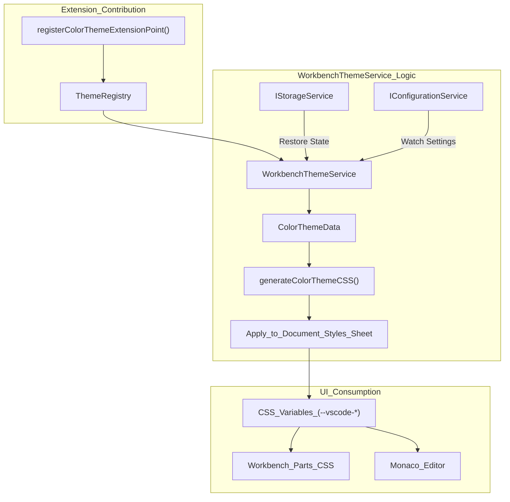
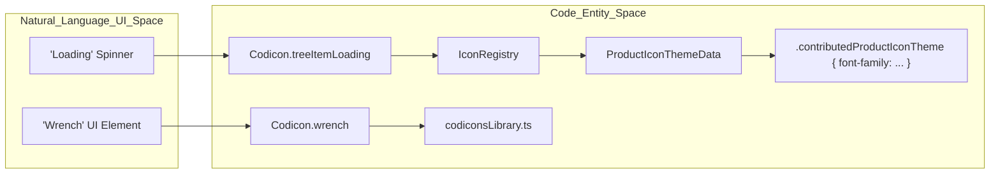
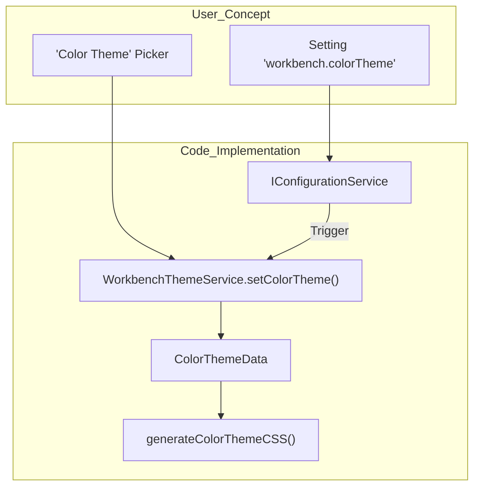

# Theming, Icons, and Styling

Relevant source files

The following files were used as context for generating this wiki page:

- [.npmrc](https://github.com/microsoft/vscode/blob/HEAD/.npmrc)
- [.nvmrc](https://github.com/microsoft/vscode/blob/HEAD/.nvmrc)
- [build/azure-pipelines/linux/setup-env.sh](https://github.com/microsoft/vscode/blob/HEAD/build/azure-pipelines/linux/setup-env.sh)
- [build/checksums/electron.txt](https://github.com/microsoft/vscode/blob/HEAD/build/checksums/electron.txt)
- [build/checksums/nodejs.txt](https://github.com/microsoft/vscode/blob/HEAD/build/checksums/nodejs.txt)
- [build/lib/stylelint/vscode-known-variables.json](https://github.com/microsoft/vscode/blob/HEAD/build/lib/stylelint/vscode-known-variables.json)
- [build/linux/debian/calculate-deps.ts](https://github.com/microsoft/vscode/blob/HEAD/build/linux/debian/calculate-deps.ts)
- [build/linux/debian/dep-lists.ts](https://github.com/microsoft/vscode/blob/HEAD/build/linux/debian/dep-lists.ts)
- [build/linux/dependencies-generator.ts](https://github.com/microsoft/vscode/blob/HEAD/build/linux/dependencies-generator.ts)
- [build/linux/rpm/dep-lists.ts](https://github.com/microsoft/vscode/blob/HEAD/build/linux/rpm/dep-lists.ts)
- [cgmanifest.json](https://github.com/microsoft/vscode/blob/HEAD/cgmanifest.json)
- [extensions/copilot/chat-lib/package-lock.json](https://github.com/microsoft/vscode/blob/HEAD/extensions/copilot/chat-lib/package-lock.json)
- [extensions/copilot/chat-lib/package.json](https://github.com/microsoft/vscode/blob/HEAD/extensions/copilot/chat-lib/package.json)
- [extensions/copilot/package-lock.json](https://github.com/microsoft/vscode/blob/HEAD/extensions/copilot/package-lock.json)
- [extensions/javascript/package.json](https://github.com/microsoft/vscode/blob/HEAD/extensions/javascript/package.json)
- [extensions/theme-defaults/package.json](https://github.com/microsoft/vscode/blob/HEAD/extensions/theme-defaults/package.json)
- [extensions/theme-defaults/package.nls.json](https://github.com/microsoft/vscode/blob/HEAD/extensions/theme-defaults/package.nls.json)
- [extensions/theme-defaults/themes/2026-dark.json](https://github.com/microsoft/vscode/blob/HEAD/extensions/theme-defaults/themes/2026-dark.json)
- [extensions/theme-defaults/themes/2026-light.json](https://github.com/microsoft/vscode/blob/HEAD/extensions/theme-defaults/themes/2026-light.json)
- [extensions/typescript-basics/build/update-grammars.mjs](https://github.com/microsoft/vscode/blob/HEAD/extensions/typescript-basics/build/update-grammars.mjs)
- [extensions/typescript-basics/package.json](https://github.com/microsoft/vscode/blob/HEAD/extensions/typescript-basics/package.json)
- [extensions/typescript-basics/syntaxes/jsdoc.js.injection.tmLanguage.json](https://github.com/microsoft/vscode/blob/HEAD/extensions/typescript-basics/syntaxes/jsdoc.js.injection.tmLanguage.json)
- [extensions/typescript-basics/syntaxes/jsdoc.ts.injection.tmLanguage.json](https://github.com/microsoft/vscode/blob/HEAD/extensions/typescript-basics/syntaxes/jsdoc.ts.injection.tmLanguage.json)
- [package-lock.json](https://github.com/microsoft/vscode/blob/HEAD/package-lock.json)
- [package.json](https://github.com/microsoft/vscode/blob/HEAD/package.json)
- [remote/.npmrc](https://github.com/microsoft/vscode/blob/HEAD/remote/.npmrc)
- [remote/package-lock.json](https://github.com/microsoft/vscode/blob/HEAD/remote/package-lock.json)
- [remote/package.json](https://github.com/microsoft/vscode/blob/HEAD/remote/package.json)
- [remote/web/package-lock.json](https://github.com/microsoft/vscode/blob/HEAD/remote/web/package-lock.json)
- [remote/web/package.json](https://github.com/microsoft/vscode/blob/HEAD/remote/web/package.json)
- [src/vs/base/browser/ui/iconLabel/iconLabels.ts](https://github.com/microsoft/vscode/blob/HEAD/src/vs/base/browser/ui/iconLabel/iconLabels.ts)
- [src/vs/base/common/codicons.ts](https://github.com/microsoft/vscode/blob/HEAD/src/vs/base/common/codicons.ts)
- [src/vs/base/common/codiconsLibrary.ts](https://github.com/microsoft/vscode/blob/HEAD/src/vs/base/common/codiconsLibrary.ts)
- [src/vs/base/common/iconLabels.ts](https://github.com/microsoft/vscode/blob/HEAD/src/vs/base/common/iconLabels.ts)
- [src/vs/base/test/browser/iconLabels.test.ts](https://github.com/microsoft/vscode/blob/HEAD/src/vs/base/test/browser/iconLabels.test.ts)
- [src/vs/base/test/common/iconLabels.test.ts](https://github.com/microsoft/vscode/blob/HEAD/src/vs/base/test/common/iconLabels.test.ts)
- [src/vs/code/electron-browser/workbench/workbench.ts](https://github.com/microsoft/vscode/blob/HEAD/src/vs/code/electron-browser/workbench/workbench.ts)
- [src/vs/editor/contrib/codeAction/browser/codeAction.ts](https://github.com/microsoft/vscode/blob/HEAD/src/vs/editor/contrib/codeAction/browser/codeAction.ts)
- [src/vs/editor/contrib/codeAction/browser/codeActionCommands.ts](https://github.com/microsoft/vscode/blob/HEAD/src/vs/editor/contrib/codeAction/browser/codeActionCommands.ts)
- [src/vs/editor/contrib/codeAction/browser/codeActionContributions.ts](https://github.com/microsoft/vscode/blob/HEAD/src/vs/editor/contrib/codeAction/browser/codeActionContributions.ts)
- [src/vs/editor/contrib/codeAction/browser/codeActionController.ts](https://github.com/microsoft/vscode/blob/HEAD/src/vs/editor/contrib/codeAction/browser/codeActionController.ts)
- [src/vs/editor/contrib/codeAction/browser/codeActionKeybindingResolver.ts](https://github.com/microsoft/vscode/blob/HEAD/src/vs/editor/contrib/codeAction/browser/codeActionKeybindingResolver.ts)
- [src/vs/editor/contrib/codeAction/browser/codeActionMenu.ts](https://github.com/microsoft/vscode/blob/HEAD/src/vs/editor/contrib/codeAction/browser/codeActionMenu.ts)
- [src/vs/editor/contrib/codeAction/browser/codeActionModel.ts](https://github.com/microsoft/vscode/blob/HEAD/src/vs/editor/contrib/codeAction/browser/codeActionModel.ts)
- [src/vs/editor/contrib/codeAction/browser/lightBulbWidget.css](https://github.com/microsoft/vscode/blob/HEAD/src/vs/editor/contrib/codeAction/browser/lightBulbWidget.css)
- [src/vs/editor/contrib/codeAction/browser/lightBulbWidget.ts](https://github.com/microsoft/vscode/blob/HEAD/src/vs/editor/contrib/codeAction/browser/lightBulbWidget.ts)
- [src/vs/editor/contrib/codeAction/common/types.ts](https://github.com/microsoft/vscode/blob/HEAD/src/vs/editor/contrib/codeAction/common/types.ts)
- [src/vs/editor/contrib/codeAction/test/browser/codeAction.test.ts](https://github.com/microsoft/vscode/blob/HEAD/src/vs/editor/contrib/codeAction/test/browser/codeAction.test.ts)
- [src/vs/editor/contrib/format/browser/format.ts](https://github.com/microsoft/vscode/blob/HEAD/src/vs/editor/contrib/format/browser/format.ts)
- [src/vs/editor/contrib/format/browser/formatActions.ts](https://github.com/microsoft/vscode/blob/HEAD/src/vs/editor/contrib/format/browser/formatActions.ts)
- [src/vs/editor/standalone/browser/inspectTokens/inspectTokens.ts](https://github.com/microsoft/vscode/blob/HEAD/src/vs/editor/standalone/browser/inspectTokens/inspectTokens.ts)
- [src/vs/editor/standalone/browser/standaloneThemeService.ts](https://github.com/microsoft/vscode/blob/HEAD/src/vs/editor/standalone/browser/standaloneThemeService.ts)
- [src/vs/editor/standalone/browser/toggleHighContrast/toggleHighContrast.ts](https://github.com/microsoft/vscode/blob/HEAD/src/vs/editor/standalone/browser/toggleHighContrast/toggleHighContrast.ts)
- [src/vs/editor/standalone/test/browser/standaloneLanguages.test.ts](https://github.com/microsoft/vscode/blob/HEAD/src/vs/editor/standalone/test/browser/standaloneLanguages.test.ts)
- [src/vs/platform/actionWidget/common/actionWidget.ts](https://github.com/microsoft/vscode/blob/HEAD/src/vs/platform/actionWidget/common/actionWidget.ts)
- [src/vs/platform/theme/common/theme.ts](https://github.com/microsoft/vscode/blob/HEAD/src/vs/platform/theme/common/theme.ts)
- [src/vs/platform/theme/common/themeService.ts](https://github.com/microsoft/vscode/blob/HEAD/src/vs/platform/theme/common/themeService.ts)
- [src/vs/platform/theme/common/tokenClassificationRegistry.ts](https://github.com/microsoft/vscode/blob/HEAD/src/vs/platform/theme/common/tokenClassificationRegistry.ts)
- [src/vs/platform/theme/electron-main/themeMainService.ts](https://github.com/microsoft/vscode/blob/HEAD/src/vs/platform/theme/electron-main/themeMainService.ts)
- [src/vs/platform/theme/electron-main/themeMainServiceImpl.ts](https://github.com/microsoft/vscode/blob/HEAD/src/vs/platform/theme/electron-main/themeMainServiceImpl.ts)
- [src/vs/platform/theme/test/common/testThemeService.ts](https://github.com/microsoft/vscode/blob/HEAD/src/vs/platform/theme/test/common/testThemeService.ts)
- [src/vs/sessions/browser/media/sidebarActionButton.css](https://github.com/microsoft/vscode/blob/HEAD/src/vs/sessions/browser/media/sidebarActionButton.css)
- [src/vs/sessions/browser/media/style.css](https://github.com/microsoft/vscode/blob/HEAD/src/vs/sessions/browser/media/style.css)
- [src/vs/sessions/browser/parts/auxiliaryBarPart.ts](https://github.com/microsoft/vscode/blob/HEAD/src/vs/sessions/browser/parts/auxiliaryBarPart.ts)
- [src/vs/sessions/browser/parts/media/auxiliaryBarPart.css](https://github.com/microsoft/vscode/blob/HEAD/src/vs/sessions/browser/parts/media/auxiliaryBarPart.css)
- [src/vs/sessions/browser/parts/media/panelPart.css](https://github.com/microsoft/vscode/blob/HEAD/src/vs/sessions/browser/parts/media/panelPart.css)
- [src/vs/sessions/browser/parts/media/sidebarPart.css](https://github.com/microsoft/vscode/blob/HEAD/src/vs/sessions/browser/parts/media/sidebarPart.css)
- [src/vs/sessions/browser/parts/panelPart.ts](https://github.com/microsoft/vscode/blob/HEAD/src/vs/sessions/browser/parts/panelPart.ts)
- [src/vs/sessions/browser/parts/sidebarPart.ts](https://github.com/microsoft/vscode/blob/HEAD/src/vs/sessions/browser/parts/sidebarPart.ts)
- [src/vs/sessions/common/theme.ts](https://github.com/microsoft/vscode/blob/HEAD/src/vs/sessions/common/theme.ts)
- [src/vs/sessions/contrib/chat/browser/media/chatInput.css](https://github.com/microsoft/vscode/blob/HEAD/src/vs/sessions/contrib/chat/browser/media/chatInput.css)
- [src/vs/sessions/contrib/chat/browser/media/chatWidget.css](https://github.com/microsoft/vscode/blob/HEAD/src/vs/sessions/contrib/chat/browser/media/chatWidget.css)
- [src/vs/sessions/contrib/chat/browser/media/newChatInSession.css](https://github.com/microsoft/vscode/blob/HEAD/src/vs/sessions/contrib/chat/browser/media/newChatInSession.css)
- [src/vs/sessions/contrib/chat/browser/newChatContextAttachments.ts](https://github.com/microsoft/vscode/blob/HEAD/src/vs/sessions/contrib/chat/browser/newChatContextAttachments.ts)
- [src/vs/sessions/contrib/chat/browser/newChatInput.ts](https://github.com/microsoft/vscode/blob/HEAD/src/vs/sessions/contrib/chat/browser/newChatInput.ts)
- [src/vs/sessions/contrib/chat/browser/sessionReferenceCompletions.ts](https://github.com/microsoft/vscode/blob/HEAD/src/vs/sessions/contrib/chat/browser/sessionReferenceCompletions.ts)
- [src/vs/sessions/contrib/chat/browser/variableCompletions.ts](https://github.com/microsoft/vscode/blob/HEAD/src/vs/sessions/contrib/chat/browser/variableCompletions.ts)
- [src/vs/sessions/contrib/fileTreeView/browser/fileTreeView.contribution.ts](https://github.com/microsoft/vscode/blob/HEAD/src/vs/sessions/contrib/fileTreeView/browser/fileTreeView.contribution.ts)
- [src/vs/sessions/contrib/fileTreeView/browser/githubFileSystemProvider.ts](https://github.com/microsoft/vscode/blob/HEAD/src/vs/sessions/contrib/fileTreeView/browser/githubFileSystemProvider.ts)
- [src/vs/sessions/contrib/sessions/browser/aiCustomizationShortcutsWidget.ts](https://github.com/microsoft/vscode/blob/HEAD/src/vs/sessions/contrib/sessions/browser/aiCustomizationShortcutsWidget.ts)
- [src/vs/sessions/contrib/sessions/browser/customizationsToolbar.contribution.ts](https://github.com/microsoft/vscode/blob/HEAD/src/vs/sessions/contrib/sessions/browser/customizationsToolbar.contribution.ts)
- [src/vs/sessions/contrib/sessions/browser/media/customizationsToolbar.css](https://github.com/microsoft/vscode/blob/HEAD/src/vs/sessions/contrib/sessions/browser/media/customizationsToolbar.css)
- [src/vs/sessions/contrib/sessions/browser/media/sessionsViewPane.css](https://github.com/microsoft/vscode/blob/HEAD/src/vs/sessions/contrib/sessions/browser/media/sessionsViewPane.css)
- [src/vs/sessions/contrib/sessions/browser/views/sessionsView.ts](https://github.com/microsoft/vscode/blob/HEAD/src/vs/sessions/contrib/sessions/browser/views/sessionsView.ts)
- [src/vs/sessions/contrib/sessions/test/browser/aiCustomizationShortcutsWidget.fixture.ts](https://github.com/microsoft/vscode/blob/HEAD/src/vs/sessions/contrib/sessions/test/browser/aiCustomizationShortcutsWidget.fixture.ts)
- [src/vs/sessions/services/sessions/browser/sessionReference.ts](https://github.com/microsoft/vscode/blob/HEAD/src/vs/sessions/services/sessions/browser/sessionReference.ts)
- [src/vs/sessions/skills/troubleshoot/SKILL.md](https://github.com/microsoft/vscode/blob/HEAD/src/vs/sessions/skills/troubleshoot/SKILL.md)
- [src/vs/workbench/browser/parts/activitybar/media/activityaction.css](https://github.com/microsoft/vscode/blob/HEAD/src/vs/workbench/browser/parts/activitybar/media/activityaction.css)
- [src/vs/workbench/browser/parts/activitybar/media/activitybarpart.css](https://github.com/microsoft/vscode/blob/HEAD/src/vs/workbench/browser/parts/activitybar/media/activitybarpart.css)
- [src/vs/workbench/common/theme.ts](https://github.com/microsoft/vscode/blob/HEAD/src/vs/workbench/common/theme.ts)
- [src/vs/workbench/contrib/codeEditor/browser/inspectEditorTokens/inspectEditorTokens.ts](https://github.com/microsoft/vscode/blob/HEAD/src/vs/workbench/contrib/codeEditor/browser/inspectEditorTokens/inspectEditorTokens.ts)
- [src/vs/workbench/contrib/codeEditor/browser/saveParticipants.ts](https://github.com/microsoft/vscode/blob/HEAD/src/vs/workbench/contrib/codeEditor/browser/saveParticipants.ts)
- [src/vs/workbench/contrib/format/browser/formatActionsMultiple.ts](https://github.com/microsoft/vscode/blob/HEAD/src/vs/workbench/contrib/format/browser/formatActionsMultiple.ts)
- [src/vs/workbench/contrib/format/browser/formatModified.ts](https://github.com/microsoft/vscode/blob/HEAD/src/vs/workbench/contrib/format/browser/formatModified.ts)
- [src/vs/workbench/contrib/notebook/browser/contrib/format/formatting.ts](https://github.com/microsoft/vscode/blob/HEAD/src/vs/workbench/contrib/notebook/browser/contrib/format/formatting.ts)
- [src/vs/workbench/contrib/notebook/browser/contrib/saveParticipants/saveParticipants.ts](https://github.com/microsoft/vscode/blob/HEAD/src/vs/workbench/contrib/notebook/browser/contrib/saveParticipants/saveParticipants.ts)
- [src/vs/workbench/contrib/splash/browser/partsSplash.ts](https://github.com/microsoft/vscode/blob/HEAD/src/vs/workbench/contrib/splash/browser/partsSplash.ts)
- [src/vs/workbench/contrib/splash/browser/splash.contribution.ts](https://github.com/microsoft/vscode/blob/HEAD/src/vs/workbench/contrib/splash/browser/splash.contribution.ts)
- [src/vs/workbench/contrib/splash/browser/splash.ts](https://github.com/microsoft/vscode/blob/HEAD/src/vs/workbench/contrib/splash/browser/splash.ts)
- [src/vs/workbench/contrib/themes/browser/themes.contribution.ts](https://github.com/microsoft/vscode/blob/HEAD/src/vs/workbench/contrib/themes/browser/themes.contribution.ts)
- [src/vs/workbench/contrib/themes/browser/themes.test.contribution.ts](https://github.com/microsoft/vscode/blob/HEAD/src/vs/workbench/contrib/themes/browser/themes.test.contribution.ts)
- [src/vs/workbench/services/themes/browser/browserHostColorSchemeService.ts](https://github.com/microsoft/vscode/blob/HEAD/src/vs/workbench/services/themes/browser/browserHostColorSchemeService.ts)
- [src/vs/workbench/services/themes/browser/workbenchThemeService.ts](https://github.com/microsoft/vscode/blob/HEAD/src/vs/workbench/services/themes/browser/workbenchThemeService.ts)
- [src/vs/workbench/services/themes/common/colorThemeData.ts](https://github.com/microsoft/vscode/blob/HEAD/src/vs/workbench/services/themes/common/colorThemeData.ts)
- [src/vs/workbench/services/themes/common/colorThemeSchema.ts](https://github.com/microsoft/vscode/blob/HEAD/src/vs/workbench/services/themes/common/colorThemeSchema.ts)
- [src/vs/workbench/services/themes/common/themeConfiguration.ts](https://github.com/microsoft/vscode/blob/HEAD/src/vs/workbench/services/themes/common/themeConfiguration.ts)
- [src/vs/workbench/services/themes/common/themeExtensionPoints.ts](https://github.com/microsoft/vscode/blob/HEAD/src/vs/workbench/services/themes/common/themeExtensionPoints.ts)
- [src/vs/workbench/services/themes/common/tokenClassificationExtensionPoint.ts](https://github.com/microsoft/vscode/blob/HEAD/src/vs/workbench/services/themes/common/tokenClassificationExtensionPoint.ts)
- [src/vs/workbench/services/themes/common/workbenchThemeService.ts](https://github.com/microsoft/vscode/blob/HEAD/src/vs/workbench/services/themes/common/workbenchThemeService.ts)
- [src/vs/workbench/services/themes/test/common/workbenchThemeService.test.ts](https://github.com/microsoft/vscode/blob/HEAD/src/vs/workbench/services/themes/test/common/workbenchThemeService.test.ts)

The VS Code theming system provides a comprehensive framework for customizing the visual appearance of the workbench and editor. It manages color themes, file and product icons, and semantic token styling through a centralized service and a CSS variable-based distribution system.

## Workbench Theme Service

The `WorkbenchThemeService` is the central coordinator for all theming concerns in the workbench. It manages the lifecycle of color themes, file and product icons, and semantic token styling, ensuring that changes are propagated across the UI.

### Key Classes and Data Flow

*   **`WorkbenchThemeService`**: Implemented in [src/vs/workbench/services/themes/browser/workbenchThemeService.ts:78-103](https://github.com/microsoft/vscode/blob/HEAD/src/vs/workbench/services/themes/browser/workbenchThemeService.ts#L78-L103). It tracks the current active themes and handles the loading of theme data from extensions or storage. It manages registries for `ColorThemeData`, `FileIconThemeData`, and `ProductIconThemeData`.
*   **`ColorThemeData`**: Represents a loaded color theme. It stores information about the theme type (Light, Dark, High Contrast), its color map, and token rules. [src/vs/workbench/services/themes/common/colorThemeData.ts:54-91](https://github.com/microsoft/vscode/blob/HEAD/src/vs/workbench/services/themes/common/colorThemeData.ts#L54-L91).
*   **`ThemeRegistry`**: A generic registry used by the service to manage themes contributed via extension points like `registerColorThemeExtensionPoint`. [src/vs/workbench/services/themes/common/themeExtensionPoints.ts:31-31](https://github.com/microsoft/vscode/blob/HEAD/src/vs/workbench/services/themes/common/themeExtensionPoints.ts#L31).

### Theme Loading Flow

This diagram illustrates how the `WorkbenchThemeService` coordinates theme loading from extension contributions to CSS generation.

Title: Theme Loading and CSS Generation Flow

Sources: [src/vs/workbench/services/themes/browser/workbenchThemeService.ts:74-103](https://github.com/microsoft/vscode/blob/HEAD/src/vs/workbench/services/themes/browser/workbenchThemeService.ts#L74-L103), [src/vs/workbench/services/themes/browser/workbenchThemeService.ts:45-45](https://github.com/microsoft/vscode/blob/HEAD/src/vs/workbench/services/themes/browser/workbenchThemeService.ts#L45), [src/vs/workbench/services/themes/common/themeExtensionPoints.ts:31-31](https://github.com/microsoft/vscode/blob/HEAD/src/vs/workbench/services/themes/common/themeExtensionPoints.ts#L31)

## Color Registry and CSS Variables

The workbench uses a registry pattern to define themeable colors. These colors are then exposed as CSS variables to be used in `.css` files throughout the codebase.

### Color Registration
Colors are registered using `registerColor` in various `colorRegistry.ts` or theme-specific files. Each color has a unique ID and default values for different theme types (Light, Dark, HC).
*   **Base Registry**: Accessed via `getColorRegistry()` in [src/vs/workbench/services/themes/browser/workbenchThemeService.ts:42-42](https://github.com/microsoft/vscode/blob/HEAD/src/vs/workbench/services/themes/browser/workbenchThemeService.ts#L42).
*   **Color Exports**: The system aggregates colors from multiple domains (editor, list, menu, etc.) via [src/vs/platform/theme/common/colorRegistry.ts:8-19](https://github.com/microsoft/vscode/blob/HEAD/src/vs/platform/theme/common/colorRegistry.ts#L8-L19).
*   **Workbench Specifics**: Workbench-level colors like `TAB_ACTIVE_BACKGROUND` are defined and registered in [src/vs/workbench/common/theme.ts:32-32](https://github.com/microsoft/vscode/blob/HEAD/src/vs/workbench/common/theme.ts#L32).

### Variable Generation
The `generateColorThemeCSS` function converts the `ColorThemeData` into a block of CSS variables prefixed with `--vscode-`. For example, a registered color `editor.background` becomes `--vscode-editor-background`. [src/vs/workbench/services/themes/browser/workbenchThemeService.ts:45-45](https://github.com/microsoft/vscode/blob/HEAD/src/vs/workbench/services/themes/browser/workbenchThemeService.ts#L45). A comprehensive list of known variables used for build-time linting is maintained in [build/lib/stylelint/vscode-known-variables.json:1-300](https://github.com/microsoft/vscode/blob/HEAD/build/lib/stylelint/vscode-known-variables.json#L1-L300).

| Code Entity | Purpose |
| :--- | :--- |
| `IColorRegistry` | Registry for all color identifiers and their defaults. [src/vs/platform/theme/common/colorRegistry.ts:9-19](https://github.com/microsoft/vscode/blob/HEAD/src/vs/platform/theme/common/colorRegistry.ts#L9-L19) |
| `ColorThemeData` | Holds the actual color values for a specific theme. [src/vs/workbench/services/themes/common/colorThemeData.ts:54-54](https://github.com/microsoft/vscode/blob/HEAD/src/vs/workbench/services/themes/common/colorThemeData.ts#L54) |
| `generateColorThemeCSS` | Function that generates the CSS variable block for the document. [src/vs/workbench/services/themes/browser/workbenchThemeService.ts:45-45](https://github.com/microsoft/vscode/blob/HEAD/src/vs/workbench/services/themes/browser/workbenchThemeService.ts#L45) |

### UI Part Styling
Individual workbench parts consume these colors via CSS. Global styles for workbench components are defined in specialized CSS files. For example, the chat widget uses variables like `--vscode-chat-requestBackground` [build/lib/stylelint/vscode-known-variables.json:80-80](https://github.com/microsoft/vscode/blob/HEAD/build/lib/stylelint/vscode-known-variables.json#L80). The Agents Window uses specific variables like `--vscode-agentsPanel-background` to theme its unique parts [src/vs/sessions/browser/media/style.css:54-54](https://github.com/microsoft/vscode/blob/HEAD/src/vs/sessions/browser/media/style.css#L54).

Sources: [src/vs/platform/theme/common/colorRegistry.ts:8-19](https://github.com/microsoft/vscode/blob/HEAD/src/vs/platform/theme/common/colorRegistry.ts#L8-L19), [src/vs/workbench/services/themes/browser/workbenchThemeService.ts:45-45](https://github.com/microsoft/vscode/blob/HEAD/src/vs/workbench/services/themes/browser/workbenchThemeService.ts#L45), [build/lib/stylelint/vscode-known-variables.json:1-300](https://github.com/microsoft/vscode/blob/HEAD/build/lib/stylelint/vscode-known-variables.json#L1-L300), [src/vs/workbench/common/theme.ts:32-75](https://github.com/microsoft/vscode/blob/HEAD/src/vs/workbench/common/theme.ts#L32-L75), [src/vs/sessions/browser/media/style.css:53-95](https://github.com/microsoft/vscode/blob/HEAD/src/vs/sessions/browser/media/style.css#L53-L95)

## Icons: Codicons and Product Icons

VS Code distinguishes between **Codicons** (the built-in icon font) and **Product Icon Themes** (which allow extensions to replace the built-in icons).

### Codicons
Codicons are defined in `codiconsLibrary.ts` and registered in `codicons.ts`. They are used as default icons for UI components.
*   **Registration**: `register` defines a themeable icon identifier. [src/vs/base/common/codicons.ts:6-7](https://github.com/microsoft/vscode/blob/HEAD/src/vs/base/common/codicons.ts#L6-L7).
*   **Library**: The full list of base icons is in `codiconsLibrary.ts`, while derived icons (specific UI aliases) are in [src/vs/base/common/codicons.ts:21-53](https://github.com/microsoft/vscode/blob/HEAD/src/vs/base/common/codicons.ts#L21-L53).
*   **Usage**: UI components like the code action menu use `Codicon` for action categories. [src/vs/editor/contrib/codeAction/browser/codeActionMenu.ts:25-34](https://github.com/microsoft/vscode/blob/HEAD/src/vs/editor/contrib/codeAction/browser/codeActionMenu.ts#L25-L34). Tree widgets use `Codicon.treeItemLoading` to indicate slow-loading nodes [src/vs/base/common/codicons.ts:30-30](https://github.com/microsoft/vscode/blob/HEAD/src/vs/base/common/codicons.ts#L30).

### Product Icon Themes
Product Icon Themes allow changing the entire icon set of the workbench.
*   **`ProductIconThemeData`**: Handles loading the font and mapping identifiers to font glyphs. [src/vs/workbench/services/themes/browser/productIconThemeData.ts:33-33](https://github.com/microsoft/vscode/blob/HEAD/src/vs/workbench/services/themes/browser/productIconThemeData.ts#L33).
*   **Registry**: `registerProductIconThemeExtensionPoint` allows extensions to contribute new sets. [src/vs/workbench/services/themes/browser/workbenchThemeService.ts:76-76](https://github.com/microsoft/vscode/blob/HEAD/src/vs/workbench/services/themes/browser/workbenchThemeService.ts#L76).

### Icon System Mapping

This diagram shows the relationship between UI components, the Icon Registry, and the actual font assets.

Title: Icon System Entity Mapping

Sources: [src/vs/base/common/codicons.ts:62-66](https://github.com/microsoft/vscode/blob/HEAD/src/vs/base/common/codicons.ts#L62-L66), [src/vs/workbench/services/themes/browser/workbenchThemeService.ts:59-59](https://github.com/microsoft/vscode/blob/HEAD/src/vs/workbench/services/themes/browser/workbenchThemeService.ts#L59), [src/vs/editor/contrib/codeAction/browser/codeActionMenu.ts:27-30](https://github.com/microsoft/vscode/blob/HEAD/src/vs/editor/contrib/codeAction/browser/codeActionMenu.ts#L27-L30), [src/vs/base/common/codicons.ts:30-30](https://github.com/microsoft/vscode/blob/HEAD/src/vs/base/common/codicons.ts#L30)

## File Icon Themes

File icon themes (like the "Seti" theme) map file extensions, names, and folder names to specific icons.

*   **`FileIconThemeData`**: Stores the mapping of file patterns to icon definitions and manages the generated CSS for file icons. [src/vs/workbench/services/themes/browser/fileIconThemeData.ts:20-46](https://github.com/microsoft/vscode/blob/HEAD/src/vs/workbench/services/themes/browser/fileIconThemeData.ts#L20-L46).
*   **Workbench Integration**: The workbench applies the `file-icons-enabled` class to the container when a file icon theme is active. [src/vs/workbench/services/themes/browser/workbenchThemeService.ts:55-55](https://github.com/microsoft/vscode/blob/HEAD/src/vs/workbench/services/themes/browser/workbenchThemeService.ts#L55).
*   **Default Theme**: The default file icon theme is `vscode.vscode-theme-seti-vs-seti`. [src/vs/workbench/services/themes/browser/workbenchThemeService.ts:54-54](https://github.com/microsoft/vscode/blob/HEAD/src/vs/workbench/services/themes/browser/workbenchThemeService.ts#L54).

Sources: [src/vs/workbench/services/themes/browser/fileIconThemeData.ts:20-46](https://github.com/microsoft/vscode/blob/HEAD/src/vs/workbench/services/themes/browser/fileIconThemeData.ts#L20-L46), [src/vs/workbench/services/themes/browser/workbenchThemeService.ts:54-55](https://github.com/microsoft/vscode/blob/HEAD/src/vs/workbench/services/themes/browser/workbenchThemeService.ts#L54-L55)

## List and Tree Styling

The workbench list and tree components (based on `ListWidget` and `AbstractTree`) utilize the theme service to apply selection, focus, and hover styles.

*   **List Styles**: `getListStyles` provides a standard mapping of theme colors to list CSS variables like `--vscode-list-activeSelectionBackground`. [src/vs/platform/list/browser/listService.ts:31-31](https://github.com/microsoft/vscode/blob/HEAD/src/vs/platform/list/browser/listService.ts#L31).
*   **Tree Indent Guides**: The stroke color for tree guides is registered as `treeIndentGuidesStroke`. [src/vs/workbench/common/theme.ts:7-7](https://github.com/microsoft/vscode/blob/HEAD/src/vs/workbench/common/theme.ts#L7).
*   **Dynamic Theming**: The `TraitRenderer` in the list widget toggles CSS classes based on selection/focus state, which are then styled via the theme's generated CSS. [src/vs/base/browser/ui/list/listWidget.ts:158-160](https://github.com/microsoft/vscode/blob/HEAD/src/vs/base/browser/ui/list/listWidget.ts#L158-L160).

Sources: [src/vs/platform/list/browser/listService.ts:31-31](https://github.com/microsoft/vscode/blob/HEAD/src/vs/platform/list/browser/listService.ts#L31), [src/vs/workbench/common/theme.ts:7-7](https://github.com/microsoft/vscode/blob/HEAD/src/vs/workbench/common/theme.ts#L7), [src/vs/base/browser/ui/list/listWidget.ts:158-160](https://github.com/microsoft/vscode/blob/HEAD/src/vs/base/browser/ui/list/listWidget.ts#L158-L160)

## Theme Selection and Configuration

The integration of themes into the workbench UI allows users to discover and switch themes dynamically via the Command Palette or Settings.

*   **Extension Points**: Themes are contributed via `contributes.themes` in `package.json`, which are processed by `registerColorThemeExtensionPoint`. [src/vs/workbench/services/themes/browser/workbenchThemeService.ts:74-74](https://github.com/microsoft/vscode/blob/HEAD/src/vs/workbench/services/themes/browser/workbenchThemeService.ts#L74).
*   **Configuration**: Theme selection is persisted via settings like `workbench.colorTheme`. [src/vs/workbench/services/themes/common/themeConfiguration.ts:34-53](https://github.com/microsoft/vscode/blob/HEAD/src/vs/workbench/services/themes/common/themeConfiguration.ts#L34-L53).
*   **State Management**: `WorkbenchThemeService` uses `IStorageService` to persist the current theme across sessions. [src/vs/workbench/services/themes/browser/workbenchThemeService.ts:106-106](https://github.com/microsoft/vscode/blob/HEAD/src/vs/workbench/services/themes/browser/workbenchThemeService.ts#L106).

### Theme Selection Mapping

This diagram maps user-facing concepts to the specific code classes that implement them.

Title: Theme Selection and Management Mapping

Sources: [src/vs/workbench/services/themes/browser/workbenchThemeService.ts:78-86](https://github.com/microsoft/vscode/blob/HEAD/src/vs/workbench/services/themes/browser/workbenchThemeService.ts#L78-L86), [src/vs/workbench/services/themes/common/themeConfiguration.ts:34-53](https://github.com/microsoft/vscode/blob/HEAD/src/vs/workbench/services/themes/common/themeConfiguration.ts#L34-L53), [src/vs/workbench/services/themes/browser/workbenchThemeService.ts:45-45](https://github.com/microsoft/vscode/blob/HEAD/src/vs/workbench/services/themes/browser/workbenchThemeService.ts#L45)

## Build-time Linting

To ensure consistency and prevent the use of unregistered variables, VS Code uses a custom Stylelint rule. This rule checks CSS files against a known list of variables.
*   **Known Variables**: A JSON file containing all valid `--vscode-*` variables is used during the build process. [build/lib/stylelint/vscode-known-variables.json:1-300](https://github.com/microsoft/vscode/blob/HEAD/build/lib/stylelint/vscode-known-variables.json#L1-L300).
*   **Variable Scope**: Variables are categorized by their subsystem, such as `activityBar`, `button`, `chat`, and `editor`. [build/lib/stylelint/vscode-known-variables.json:4-172](https://github.com/microsoft/vscode/blob/HEAD/build/lib/stylelint/vscode-known-variables.json#L4-L172).
*   **Enforcement**: The `stylelint` script in [package.json:80-80](https://github.com/microsoft/vscode/blob/HEAD/package.json#L80) runs these checks during the CI pipeline.

Sources: [build/lib/stylelint/vscode-known-variables.json:1-300](https://github.com/microsoft/vscode/blob/HEAD/build/lib/stylelint/vscode-known-variables.json#L1-L300), [package.json:80-80](https://github.com/microsoft/vscode/blob/HEAD/package.json#L80)