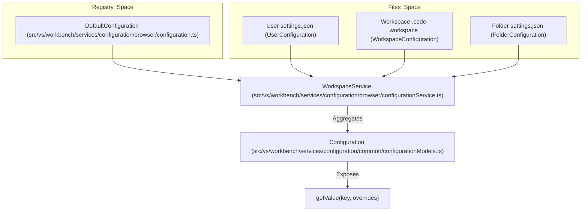
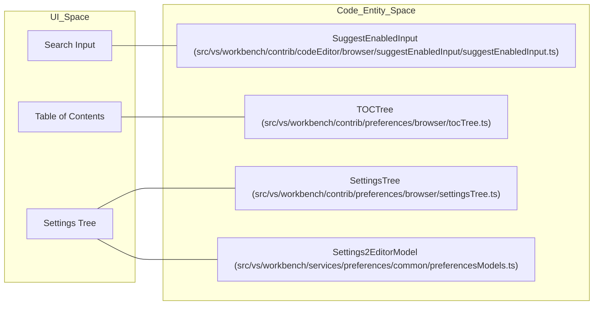
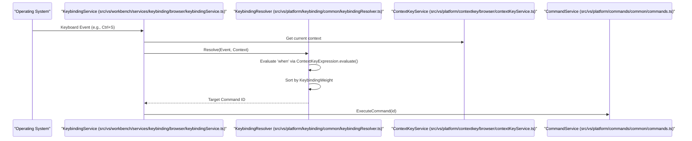

# Settings, Keybindings, and Configuration

Relevant source files

The following files were used as context for generating this wiki page:

- [extensions/vscode-api-tests/src/singlefolder-tests/window.test.ts](https://github.com/microsoft/vscode/blob/HEAD/extensions/vscode-api-tests/src/singlefolder-tests/window.test.ts)
- [src/vs/base/browser/keyboardEvent.ts](https://github.com/microsoft/vscode/blob/HEAD/src/vs/base/browser/keyboardEvent.ts)
- [src/vs/base/common/keyCodes.ts](https://github.com/microsoft/vscode/blob/HEAD/src/vs/base/common/keyCodes.ts)
- [src/vs/base/common/keybindingLabels.ts](https://github.com/microsoft/vscode/blob/HEAD/src/vs/base/common/keybindingLabels.ts)
- [src/vs/base/common/policy.ts](https://github.com/microsoft/vscode/blob/HEAD/src/vs/base/common/policy.ts)
- [src/vs/base/test/common/keyCodes.test.ts](https://github.com/microsoft/vscode/blob/HEAD/src/vs/base/test/common/keyCodes.test.ts)
- [src/vs/editor/browser/config/elementSizeObserver.ts](https://github.com/microsoft/vscode/blob/HEAD/src/vs/editor/browser/config/elementSizeObserver.ts)
- [src/vs/platform/configuration/common/configuration.ts](https://github.com/microsoft/vscode/blob/HEAD/src/vs/platform/configuration/common/configuration.ts)
- [src/vs/platform/configuration/common/configurationModels.ts](https://github.com/microsoft/vscode/blob/HEAD/src/vs/platform/configuration/common/configurationModels.ts)
- [src/vs/platform/configuration/common/configurationRegistry.ts](https://github.com/microsoft/vscode/blob/HEAD/src/vs/platform/configuration/common/configurationRegistry.ts)
- [src/vs/platform/configuration/common/configurationService.ts](https://github.com/microsoft/vscode/blob/HEAD/src/vs/platform/configuration/common/configurationService.ts)
- [src/vs/platform/configuration/common/configurations.ts](https://github.com/microsoft/vscode/blob/HEAD/src/vs/platform/configuration/common/configurations.ts)
- [src/vs/platform/configuration/test/common/configurationModels.test.ts](https://github.com/microsoft/vscode/blob/HEAD/src/vs/platform/configuration/test/common/configurationModels.test.ts)
- [src/vs/platform/configuration/test/common/configurationRegistry.test.ts](https://github.com/microsoft/vscode/blob/HEAD/src/vs/platform/configuration/test/common/configurationRegistry.test.ts)
- [src/vs/platform/configuration/test/common/configurationService.test.ts](https://github.com/microsoft/vscode/blob/HEAD/src/vs/platform/configuration/test/common/configurationService.test.ts)
- [src/vs/platform/configuration/test/common/configurations.test.ts](https://github.com/microsoft/vscode/blob/HEAD/src/vs/platform/configuration/test/common/configurations.test.ts)
- [src/vs/platform/configuration/test/common/policyConfiguration.test.ts](https://github.com/microsoft/vscode/blob/HEAD/src/vs/platform/configuration/test/common/policyConfiguration.test.ts)
- [src/vs/platform/contextkey/browser/contextKeyService.ts](https://github.com/microsoft/vscode/blob/HEAD/src/vs/platform/contextkey/browser/contextKeyService.ts)
- [src/vs/platform/contextkey/common/contextkey.ts](https://github.com/microsoft/vscode/blob/HEAD/src/vs/platform/contextkey/common/contextkey.ts)
- [src/vs/platform/contextkey/common/scanner.ts](https://github.com/microsoft/vscode/blob/HEAD/src/vs/platform/contextkey/common/scanner.ts)
- [src/vs/platform/contextkey/test/browser/contextkey.test.ts](https://github.com/microsoft/vscode/blob/HEAD/src/vs/platform/contextkey/test/browser/contextkey.test.ts)
- [src/vs/platform/contextkey/test/common/contextkey.test.ts](https://github.com/microsoft/vscode/blob/HEAD/src/vs/platform/contextkey/test/common/contextkey.test.ts)
- [src/vs/platform/contextkey/test/common/parser.test.ts](https://github.com/microsoft/vscode/blob/HEAD/src/vs/platform/contextkey/test/common/parser.test.ts)
- [src/vs/platform/contextkey/test/common/scanner.test.ts](https://github.com/microsoft/vscode/blob/HEAD/src/vs/platform/contextkey/test/common/scanner.test.ts)
- [src/vs/platform/keybinding/common/abstractKeybindingService.ts](https://github.com/microsoft/vscode/blob/HEAD/src/vs/platform/keybinding/common/abstractKeybindingService.ts)
- [src/vs/platform/keybinding/common/baseResolvedKeybinding.ts](https://github.com/microsoft/vscode/blob/HEAD/src/vs/platform/keybinding/common/baseResolvedKeybinding.ts)
- [src/vs/platform/keybinding/common/keybinding.ts](https://github.com/microsoft/vscode/blob/HEAD/src/vs/platform/keybinding/common/keybinding.ts)
- [src/vs/platform/keybinding/common/keybindingResolver.ts](https://github.com/microsoft/vscode/blob/HEAD/src/vs/platform/keybinding/common/keybindingResolver.ts)
- [src/vs/platform/keybinding/common/keybindingsRegistry.ts](https://github.com/microsoft/vscode/blob/HEAD/src/vs/platform/keybinding/common/keybindingsRegistry.ts)
- [src/vs/platform/keybinding/common/resolvedKeybindingItem.ts](https://github.com/microsoft/vscode/blob/HEAD/src/vs/platform/keybinding/common/resolvedKeybindingItem.ts)
- [src/vs/platform/keybinding/common/usLayoutResolvedKeybinding.ts](https://github.com/microsoft/vscode/blob/HEAD/src/vs/platform/keybinding/common/usLayoutResolvedKeybinding.ts)
- [src/vs/platform/keybinding/test/common/keybindingResolver.test.ts](https://github.com/microsoft/vscode/blob/HEAD/src/vs/platform/keybinding/test/common/keybindingResolver.test.ts)
- [src/vs/platform/keybinding/test/common/mockKeybindingService.ts](https://github.com/microsoft/vscode/blob/HEAD/src/vs/platform/keybinding/test/common/mockKeybindingService.ts)
- [src/vs/platform/policy/common/filePolicyService.ts](https://github.com/microsoft/vscode/blob/HEAD/src/vs/platform/policy/common/filePolicyService.ts)
- [src/vs/platform/policy/common/policy.ts](https://github.com/microsoft/vscode/blob/HEAD/src/vs/platform/policy/common/policy.ts)
- [src/vs/platform/policy/common/policyIpc.ts](https://github.com/microsoft/vscode/blob/HEAD/src/vs/platform/policy/common/policyIpc.ts)
- [src/vs/platform/policy/node/nativePolicyService.ts](https://github.com/microsoft/vscode/blob/HEAD/src/vs/platform/policy/node/nativePolicyService.ts)
- [src/vs/workbench/api/browser/mainThreadAiSettingsSearch.ts](https://github.com/microsoft/vscode/blob/HEAD/src/vs/workbench/api/browser/mainThreadAiSettingsSearch.ts)
- [src/vs/workbench/api/browser/mainThreadConfiguration.ts](https://github.com/microsoft/vscode/blob/HEAD/src/vs/workbench/api/browser/mainThreadConfiguration.ts)
- [src/vs/workbench/api/browser/mainThreadEditorTabs.ts](https://github.com/microsoft/vscode/blob/HEAD/src/vs/workbench/api/browser/mainThreadEditorTabs.ts)
- [src/vs/workbench/api/common/configurationExtensionPoint.ts](https://github.com/microsoft/vscode/blob/HEAD/src/vs/workbench/api/common/configurationExtensionPoint.ts)
- [src/vs/workbench/api/common/extHostAiSettingsSearch.ts](https://github.com/microsoft/vscode/blob/HEAD/src/vs/workbench/api/common/extHostAiSettingsSearch.ts)
- [src/vs/workbench/api/common/extHostConfiguration.ts](https://github.com/microsoft/vscode/blob/HEAD/src/vs/workbench/api/common/extHostConfiguration.ts)
- [src/vs/workbench/api/common/extHostDiagnostics.ts](https://github.com/microsoft/vscode/blob/HEAD/src/vs/workbench/api/common/extHostDiagnostics.ts)
- [src/vs/workbench/api/common/extHostEditorTabs.ts](https://github.com/microsoft/vscode/blob/HEAD/src/vs/workbench/api/common/extHostEditorTabs.ts)
- [src/vs/workbench/api/test/browser/extHostConfiguration.test.ts](https://github.com/microsoft/vscode/blob/HEAD/src/vs/workbench/api/test/browser/extHostConfiguration.test.ts)
- [src/vs/workbench/api/test/browser/extHostDiagnostics.test.ts](https://github.com/microsoft/vscode/blob/HEAD/src/vs/workbench/api/test/browser/extHostDiagnostics.test.ts)
- [src/vs/workbench/api/test/browser/extHostEditorTabs.test.ts](https://github.com/microsoft/vscode/blob/HEAD/src/vs/workbench/api/test/browser/extHostEditorTabs.test.ts)
- [src/vs/workbench/common/editor/binaryEditorModel.ts](https://github.com/microsoft/vscode/blob/HEAD/src/vs/workbench/common/editor/binaryEditorModel.ts)
- [src/vs/workbench/contrib/commands/common/commands.contribution.ts](https://github.com/microsoft/vscode/blob/HEAD/src/vs/workbench/contrib/commands/common/commands.contribution.ts)
- [src/vs/workbench/contrib/editTelemetry/browser/editTelemetry.contribution.ts](https://github.com/microsoft/vscode/blob/HEAD/src/vs/workbench/contrib/editTelemetry/browser/editTelemetry.contribution.ts)
- [src/vs/workbench/contrib/performance/electron-browser/performance.contribution.ts](https://github.com/microsoft/vscode/blob/HEAD/src/vs/workbench/contrib/performance/electron-browser/performance.contribution.ts)
- [src/vs/workbench/contrib/preferences/browser/keybindingsEditor.ts](https://github.com/microsoft/vscode/blob/HEAD/src/vs/workbench/contrib/preferences/browser/keybindingsEditor.ts)
- [src/vs/workbench/contrib/preferences/browser/media/keybindingsEditor.css](https://github.com/microsoft/vscode/blob/HEAD/src/vs/workbench/contrib/preferences/browser/media/keybindingsEditor.css)
- [src/vs/workbench/contrib/preferences/browser/media/settingsEditor2.css](https://github.com/microsoft/vscode/blob/HEAD/src/vs/workbench/contrib/preferences/browser/media/settingsEditor2.css)
- [src/vs/workbench/contrib/preferences/browser/media/settingsWidgets.css](https://github.com/microsoft/vscode/blob/HEAD/src/vs/workbench/contrib/preferences/browser/media/settingsWidgets.css)
- [src/vs/workbench/contrib/preferences/browser/preferences.contribution.ts](https://github.com/microsoft/vscode/blob/HEAD/src/vs/workbench/contrib/preferences/browser/preferences.contribution.ts)
- [src/vs/workbench/contrib/preferences/browser/preferencesEditor.ts](https://github.com/microsoft/vscode/blob/HEAD/src/vs/workbench/contrib/preferences/browser/preferencesEditor.ts)
- [src/vs/workbench/contrib/preferences/browser/preferencesRenderers.ts](https://github.com/microsoft/vscode/blob/HEAD/src/vs/workbench/contrib/preferences/browser/preferencesRenderers.ts)
- [src/vs/workbench/contrib/preferences/browser/preferencesSearch.ts](https://github.com/microsoft/vscode/blob/HEAD/src/vs/workbench/contrib/preferences/browser/preferencesSearch.ts)
- [src/vs/workbench/contrib/preferences/browser/preferencesWidgets.ts](https://github.com/microsoft/vscode/blob/HEAD/src/vs/workbench/contrib/preferences/browser/preferencesWidgets.ts)
- [src/vs/workbench/contrib/preferences/browser/settingsEditor2.ts](https://github.com/microsoft/vscode/blob/HEAD/src/vs/workbench/contrib/preferences/browser/settingsEditor2.ts)
- [src/vs/workbench/contrib/preferences/browser/settingsEditorSettingIndicators.ts](https://github.com/microsoft/vscode/blob/HEAD/src/vs/workbench/contrib/preferences/browser/settingsEditorSettingIndicators.ts)
- [src/vs/workbench/contrib/preferences/browser/settingsLayout.ts](https://github.com/microsoft/vscode/blob/HEAD/src/vs/workbench/contrib/preferences/browser/settingsLayout.ts)
- [src/vs/workbench/contrib/preferences/browser/settingsTree.ts](https://github.com/microsoft/vscode/blob/HEAD/src/vs/workbench/contrib/preferences/browser/settingsTree.ts)
- [src/vs/workbench/contrib/preferences/browser/settingsTreeModels.ts](https://github.com/microsoft/vscode/blob/HEAD/src/vs/workbench/contrib/preferences/browser/settingsTreeModels.ts)
- [src/vs/workbench/contrib/preferences/browser/settingsWidgets.ts](https://github.com/microsoft/vscode/blob/HEAD/src/vs/workbench/contrib/preferences/browser/settingsWidgets.ts)
- [src/vs/workbench/contrib/preferences/browser/tocTree.ts](https://github.com/microsoft/vscode/blob/HEAD/src/vs/workbench/contrib/preferences/browser/tocTree.ts)
- [src/vs/workbench/contrib/preferences/common/preferences.ts](https://github.com/microsoft/vscode/blob/HEAD/src/vs/workbench/contrib/preferences/common/preferences.ts)
- [src/vs/workbench/contrib/preferences/common/preferencesContribution.ts](https://github.com/microsoft/vscode/blob/HEAD/src/vs/workbench/contrib/preferences/common/preferencesContribution.ts)
- [src/vs/workbench/services/aiSettingsSearch/common/aiSettingsSearch.ts](https://github.com/microsoft/vscode/blob/HEAD/src/vs/workbench/services/aiSettingsSearch/common/aiSettingsSearch.ts)
- [src/vs/workbench/services/aiSettingsSearch/common/aiSettingsSearchService.ts](https://github.com/microsoft/vscode/blob/HEAD/src/vs/workbench/services/aiSettingsSearch/common/aiSettingsSearchService.ts)
- [src/vs/workbench/services/configuration/browser/configuration.ts](https://github.com/microsoft/vscode/blob/HEAD/src/vs/workbench/services/configuration/browser/configuration.ts)
- [src/vs/workbench/services/configuration/browser/configurationService.ts](https://github.com/microsoft/vscode/blob/HEAD/src/vs/workbench/services/configuration/browser/configurationService.ts)
- [src/vs/workbench/services/configuration/common/configuration.ts](https://github.com/microsoft/vscode/blob/HEAD/src/vs/workbench/services/configuration/common/configuration.ts)
- [src/vs/workbench/services/configuration/common/configurationEditing.ts](https://github.com/microsoft/vscode/blob/HEAD/src/vs/workbench/services/configuration/common/configurationEditing.ts)
- [src/vs/workbench/services/configuration/common/configurationModels.ts](https://github.com/microsoft/vscode/blob/HEAD/src/vs/workbench/services/configuration/common/configurationModels.ts)
- [src/vs/workbench/services/configuration/common/jsonEditing.ts](https://github.com/microsoft/vscode/blob/HEAD/src/vs/workbench/services/configuration/common/jsonEditing.ts)
- [src/vs/workbench/services/configuration/common/jsonEditingService.ts](https://github.com/microsoft/vscode/blob/HEAD/src/vs/workbench/services/configuration/common/jsonEditingService.ts)
- [src/vs/workbench/services/configuration/test/browser/configuration.test.ts](https://github.com/microsoft/vscode/blob/HEAD/src/vs/workbench/services/configuration/test/browser/configuration.test.ts)
- [src/vs/workbench/services/configuration/test/browser/configurationService.test.ts](https://github.com/microsoft/vscode/blob/HEAD/src/vs/workbench/services/configuration/test/browser/configurationService.test.ts)
- [src/vs/workbench/services/configuration/test/common/configurationModels.test.ts](https://github.com/microsoft/vscode/blob/HEAD/src/vs/workbench/services/configuration/test/common/configurationModels.test.ts)
- [src/vs/workbench/services/configuration/test/common/testServices.ts](https://github.com/microsoft/vscode/blob/HEAD/src/vs/workbench/services/configuration/test/common/testServices.ts)
- [src/vs/workbench/services/keybinding/browser/keybindingService.ts](https://github.com/microsoft/vscode/blob/HEAD/src/vs/workbench/services/keybinding/browser/keybindingService.ts)
- [src/vs/workbench/services/keybinding/common/keybindingEditing.ts](https://github.com/microsoft/vscode/blob/HEAD/src/vs/workbench/services/keybinding/common/keybindingEditing.ts)
- [src/vs/workbench/services/keybinding/common/keybindingIO.ts](https://github.com/microsoft/vscode/blob/HEAD/src/vs/workbench/services/keybinding/common/keybindingIO.ts)
- [src/vs/workbench/services/keybinding/common/macLinuxKeyboardMapper.ts](https://github.com/microsoft/vscode/blob/HEAD/src/vs/workbench/services/keybinding/common/macLinuxKeyboardMapper.ts)
- [src/vs/workbench/services/keybinding/common/windowsKeyboardMapper.ts](https://github.com/microsoft/vscode/blob/HEAD/src/vs/workbench/services/keybinding/common/windowsKeyboardMapper.ts)
- [src/vs/workbench/services/keybinding/test/browser/keybindingIO.test.ts](https://github.com/microsoft/vscode/blob/HEAD/src/vs/workbench/services/keybinding/test/browser/keybindingIO.test.ts)
- [src/vs/workbench/services/preferences/browser/keybindingsEditorModel.ts](https://github.com/microsoft/vscode/blob/HEAD/src/vs/workbench/services/preferences/browser/keybindingsEditorModel.ts)
- [src/vs/workbench/services/preferences/browser/preferencesService.ts](https://github.com/microsoft/vscode/blob/HEAD/src/vs/workbench/services/preferences/browser/preferencesService.ts)
- [src/vs/workbench/services/preferences/common/preferences.ts](https://github.com/microsoft/vscode/blob/HEAD/src/vs/workbench/services/preferences/common/preferences.ts)
- [src/vs/workbench/services/preferences/common/preferencesModels.ts](https://github.com/microsoft/vscode/blob/HEAD/src/vs/workbench/services/preferences/common/preferencesModels.ts)
- [src/vs/workbench/services/preferences/test/browser/keybindingsEditorModel.test.ts](https://github.com/microsoft/vscode/blob/HEAD/src/vs/workbench/services/preferences/test/browser/keybindingsEditorModel.test.ts)
- [src/vs/workbench/services/preferences/test/browser/preferencesService.test.ts](https://github.com/microsoft/vscode/blob/HEAD/src/vs/workbench/services/preferences/test/browser/preferencesService.test.ts)
- [src/vs/workbench/services/workingCopy/test/browser/workingCopyEditorService.test.ts](https://github.com/microsoft/vscode/blob/HEAD/src/vs/workbench/services/workingCopy/test/browser/workingCopyEditorService.test.ts)
- [src/vs/workbench/test/browser/codeeditor.test.ts](https://github.com/microsoft/vscode/blob/HEAD/src/vs/workbench/test/browser/codeeditor.test.ts)
- [src/vscode-dts/vscode.proposed.aiSettingsSearch.d.ts](https://github.com/microsoft/vscode/blob/HEAD/src/vscode-dts/vscode.proposed.aiSettingsSearch.d.ts)

This section details the architecture and implementation of the VS Code configuration system, the keybinding resolution engine, and the user interfaces for managing them.

## 1. Configuration Registry and Data Models

The configuration system is built on a global registry where extensions and core components declare settings using JSON schemas.

### Configuration Registry
The `IConfigurationRegistry` is the central point for registering settings. It manages `IConfigurationNode` objects which define properties, default values, and metadata like `ConfigurationScope` (Application, Machine, Window, Resource) [src/vs/platform/configuration/common/configurationRegistry.ts:34-127](https://github.com/microsoft/vscode/blob/HEAD/src/vs/platform/configuration/common/configurationRegistry.ts#L34-L127). Settings are categorized by scope to determine where they can be stored (e.g., `APPLICATION_SCOPES`, `LOCAL_MACHINE_SCOPES`, `WORKSPACE_SCOPES`) [src/vs/workbench/services/configuration/common/configuration.ts:14-19](https://github.com/microsoft/vscode/blob/HEAD/src/vs/workbench/services/configuration/common/configuration.ts#L14-L19).

### Configuration Models
Settings are processed and stored in a hierarchy of `ConfigurationModel` instances [src/vs/platform/configuration/common/configurationModels.ts:14-15](https://github.com/microsoft/vscode/blob/HEAD/src/vs/platform/configuration/common/configurationModels.ts#L14-L15):
*   **Default**: Aggregated from `IConfigurationRegistry`. Managed by `DefaultConfiguration`, which handles extension-contributed defaults and language-specific overrides [src/vs/workbench/services/configuration/browser/configuration.ts:32-60](https://github.com/microsoft/vscode/blob/HEAD/src/vs/workbench/services/configuration/browser/configuration.ts#L32-L60). It caches default overrides in `localStorage` to speed up startup [src/vs/workbench/services/configuration/browser/configuration.ts:78-83](https://github.com/microsoft/vscode/blob/HEAD/src/vs/workbench/services/configuration/browser/configuration.ts#L78-L83).
*   **Application**: Global settings that apply to all profiles, typically stored in `argv.json` [src/vs/workbench/services/configuration/browser/configuration.ts:129-132](https://github.com/microsoft/vscode/blob/HEAD/src/vs/workbench/services/configuration/browser/configuration.ts#L129-L132).
*   **User**: Profile-specific global settings, managed by `UserConfiguration` [src/vs/workbench/services/configuration/browser/configurationService.ts:79](https://github.com/microsoft/vscode/blob/HEAD/src/vs/workbench/services/configuration/browser/configurationService.ts#L79).
*   **Workspace**: Settings specific to the current `.code-workspace` file, managed by `WorkspaceConfiguration` [src/vs/workbench/services/configuration/browser/configurationService.ts:81](https://github.com/microsoft/vscode/blob/HEAD/src/vs/workbench/services/configuration/browser/configurationService.ts#L81).
*   **Folder**: Settings in `.vscode/settings.json` within a workspace folder, managed by `FolderConfiguration` [src/vs/workbench/services/configuration/browser/configurationService.ts:82](https://github.com/microsoft/vscode/blob/HEAD/src/vs/workbench/services/configuration/browser/configurationService.ts#L82).

### Data Flow: Configuration Merging
The `WorkspaceService` (implementing `IWorkbenchConfigurationService`) aggregates these models into a single `Configuration` object. It uses a `Barrier` to ensure remote user configurations are loaded before initialization completes [src/vs/workbench/services/configuration/browser/configurationService.ts:65-85](https://github.com/microsoft/vscode/blob/HEAD/src/vs/workbench/services/configuration/browser/configurationService.ts#L65-L85).

**Configuration Merging Pipeline**

Sources: [src/vs/platform/configuration/common/configurationRegistry.ts:34-127](https://github.com/microsoft/vscode/blob/HEAD/src/vs/platform/configuration/common/configurationRegistry.ts#L34-L127), [src/vs/workbench/services/configuration/browser/configurationService.ts:65-85](https://github.com/microsoft/vscode/blob/HEAD/src/vs/workbench/services/configuration/browser/configurationService.ts#L65-L85), [src/vs/workbench/services/configuration/browser/configuration.ts:32-60](https://github.com/microsoft/vscode/blob/HEAD/src/vs/workbench/services/configuration/browser/configuration.ts#L32-L60), [src/vs/platform/configuration/common/configurationModels.ts:14-15](https://github.com/microsoft/vscode/blob/HEAD/src/vs/platform/configuration/common/configurationModels.ts#L14-L15)

## 2. Settings Editor UI

The Settings Editor (`settingsEditor2`) is a complex UI component that renders settings as a searchable tree.

### Architecture
*   **SettingsEditor2**: The main editor pane. It coordinates search providers (e.g., `STRING_MATCH_SEARCH_PROVIDER_NAME`, `TF_IDF_SEARCH_PROVIDER_NAME`, `LLM_RANKED_SEARCH_PROVIDER_NAME`), handles the `SplitView` for the Table of Contents (ToC), and manages the lifecycle of the `Settings2EditorModel` [src/vs/workbench/contrib/preferences/browser/settingsEditor2.ts:52-74](https://github.com/microsoft/vscode/blob/HEAD/src/vs/workbench/contrib/preferences/browser/settingsEditor2.ts#L52-L74).
*   **SettingsTree**: A `WorkbenchObjectTree` that renders individual settings using specialized renderers [src/vs/workbench/contrib/preferences/browser/settingsTree.ts:49](https://github.com/microsoft/vscode/blob/HEAD/src/vs/workbench/contrib/preferences/browser/settingsTree.ts#L49). It uses a `CachedListVirtualDelegate` to calculate row heights for different setting types [src/vs/workbench/contrib/preferences/browser/settingsTree.ts:16](https://github.com/microsoft/vscode/blob/HEAD/src/vs/workbench/contrib/preferences/browser/settingsTree.ts#L16).
*   **SettingsTreeModels**: Classes like `SettingsTreeSettingElement` wrap raw `ISetting` data, providing logic for `isConfigured`, `isUntrusted`, and `isAgentsWindowReadOnly` [src/vs/workbench/contrib/preferences/browser/settingsTreeModels.ts:113-160](https://github.com/microsoft/vscode/blob/HEAD/src/vs/workbench/contrib/preferences/browser/settingsTreeModels.ts#L113-L160).

### Implementation Details
The UI uses `AbstractSettingRenderer` to handle different value types (boolean, string, enum, object) by instantiating widgets like `ListSettingWidget`, `ObjectSettingCheckboxWidget`, or `ExcludeSettingWidget` [src/vs/workbench/contrib/preferences/browser/settingsTree.ts:74](https://github.com/microsoft/vscode/blob/HEAD/src/vs/workbench/contrib/preferences/browser/settingsTree.ts#L74).

**Settings Editor Component Mapping**

Sources: [src/vs/workbench/contrib/preferences/browser/settingsEditor2.ts:74](https://github.com/microsoft/vscode/blob/HEAD/src/vs/workbench/contrib/preferences/browser/settingsEditor2.ts#L74), [src/vs/workbench/contrib/preferences/browser/settingsTree.ts:49-74](https://github.com/microsoft/vscode/blob/HEAD/src/vs/workbench/contrib/preferences/browser/settingsTree.ts#L49-L74), [src/vs/workbench/contrib/preferences/browser/settingsTreeModels.ts:113-160](https://github.com/microsoft/vscode/blob/HEAD/src/vs/workbench/contrib/preferences/browser/settingsTreeModels.ts#L113-L160), [src/vs/workbench/contrib/codeEditor/browser/suggestEnabledInput/suggestEnabledInput.ts:55](https://github.com/microsoft/vscode/blob/HEAD/src/vs/workbench/contrib/codeEditor/browser/suggestEnabledInput/suggestEnabledInput.ts#L55)

## 3. Keybindings and Context Keys

Keybindings are resolved dynamically based on the current state of the application, defined by "Context Keys".

### Context Key Service
The `IContextKeyService` maintains a key-value store of the editor's state. Expressions are parsed from "when" clauses using a `Scanner` and `Parser` [src/vs/platform/contextkey/common/contextkey.ts:173-185](https://github.com/microsoft/vscode/blob/HEAD/src/vs/platform/contextkey/common/contextkey.ts#L173-L185). The grammar supports operators like `==`, `!=`, `=~` (regex), `in`, and boolean logic (`&&`, `||`, `!`) [src/vs/platform/contextkey/common/contextkey.ts:98-126](https://github.com/microsoft/vscode/blob/HEAD/src/vs/platform/contextkey/common/contextkey.ts#L98-L126).

### Keybinding Resolver
The `KeybindingResolver` matches incoming keyboard events against `ResolvedKeybindingItem`s. It filters by `ContextKeyExpression` and selects the command with the highest `KeybindingWeight` [src/vs/platform/keybinding/common/keybindingResolver.ts:38-40](https://github.com/microsoft/vscode/blob/HEAD/src/vs/platform/keybinding/common/keybindingResolver.ts#L38-L40).

### Keybindings Editor
The `KeybindingsEditor` uses a `WorkbenchTable` to display command IDs, keybindings, and "when" clauses [src/vs/workbench/contrib/preferences/browser/keybindingsEditor.ts:37-74](https://github.com/microsoft/vscode/blob/HEAD/src/vs/workbench/contrib/preferences/browser/keybindingsEditor.ts#L37-L74). It allows users to define new bindings via the `DefineKeybindingWidget` [src/vs/workbench/contrib/preferences/browser/keybindingWidgets.ts:25](https://github.com/microsoft/vscode/blob/HEAD/src/vs/workbench/contrib/preferences/browser/keybindingWidgets.ts#L25).

**Keybinding Resolution Flow**

Sources: [src/vs/platform/keybinding/common/keybindingResolver.ts:38-40](https://github.com/microsoft/vscode/blob/HEAD/src/vs/platform/keybinding/common/keybindingResolver.ts#L38-L40), [src/vs/workbench/services/keybinding/browser/keybindingService.ts:36-40](https://github.com/microsoft/vscode/blob/HEAD/src/vs/workbench/services/keybinding/browser/keybindingService.ts#L36-L40), [src/vs/platform/contextkey/common/contextkey.ts:71-81](https://github.com/microsoft/vscode/blob/HEAD/src/vs/platform/contextkey/common/contextkey.ts#L71-L81), [src/vs/platform/contextkey/common/contextkey.ts:173-185](https://github.com/microsoft/vscode/blob/HEAD/src/vs/platform/contextkey/common/contextkey.ts#L173-L185)

## 4. Policy Enforcement and Restrictions

VS Code supports enterprise policies and workspace trust restrictions that can lock or disable certain settings.

*   **PolicyConfiguration**: A specialized configuration model that aggregates settings enforced by the OS (e.g., Windows Group Policy). It overrides all other configuration targets [src/vs/workbench/services/configuration/browser/configurationService.ts:76](https://github.com/microsoft/vscode/blob/HEAD/src/vs/workbench/services/configuration/browser/configurationService.ts#L76), [src/vs/platform/configuration/common/configurations.ts:16](https://github.com/microsoft/vscode/blob/HEAD/src/vs/platform/configuration/common/configurations.ts#L16).
*   **Restricted Settings**: Settings marked as `restricted: true` in the registry [src/vs/workbench/services/preferences/common/preferences.ts:89](https://github.com/microsoft/vscode/blob/HEAD/src/vs/workbench/services/preferences/common/preferences.ts#L89). If the workspace is untrusted (via `IWorkspaceTrustManagementService`), these settings are ignored at the workspace/folder level [src/vs/workbench/contrib/preferences/browser/settingsTreeModels.ts:178](https://github.com/microsoft/vscode/blob/HEAD/src/vs/workbench/contrib/preferences/browser/settingsTreeModels.ts#L178).
*   **Agents Window Constraints**: In the "Agents Window" (sessions layer), settings can be marked as read-only (via `isAgentsWindowReadOnly`) to ensure a consistent environment for AI agents [src/vs/workbench/contrib/preferences/browser/settingsTreeModels.ts:158-160](https://github.com/microsoft/vscode/blob/HEAD/src/vs/workbench/contrib/preferences/browser/settingsTreeModels.ts#L158-L160).

| Component | Implementation Class | Purpose |
| :--- | :--- | :--- |
| **Policy Service** | `IPolicyService` | Fetches values from the underlying OS policy store [src/vs/platform/policy/common/policy.ts:43](https://github.com/microsoft/vscode/blob/HEAD/src/vs/platform/policy/common/policy.ts#L43). |
| **Sync Enablement** | `IUserDataSyncEnablementService` | Controls which settings are allowed to sync across machines [src/vs/workbench/contrib/preferences/browser/settingsTree.ts:59](https://github.com/microsoft/vscode/blob/HEAD/src/vs/workbench/contrib/preferences/browser/settingsTree.ts#L59). |
| **Trust Management** | `IWorkspaceTrustManagementService` | Tracks if the current workspace is trusted by the user [src/vs/workbench/contrib/preferences/browser/settingsEditor2.ts:50](https://github.com/microsoft/vscode/blob/HEAD/src/vs/workbench/contrib/preferences/browser/settingsEditor2.ts#L50). |

Sources: [src/vs/platform/configuration/common/configurations.ts:16](https://github.com/microsoft/vscode/blob/HEAD/src/vs/platform/configuration/common/configurations.ts#L16), [src/vs/workbench/services/configuration/browser/configurationService.ts:76](https://github.com/microsoft/vscode/blob/HEAD/src/vs/workbench/services/configuration/browser/configurationService.ts#L76), [src/vs/workbench/contrib/preferences/browser/settingsTreeModels.ts:158-160](https://github.com/microsoft/vscode/blob/HEAD/src/vs/workbench/contrib/preferences/browser/settingsTreeModels.ts#L158-L160), [src/vs/workbench/services/preferences/common/preferences.ts:89](https://github.com/microsoft/vscode/blob/HEAD/src/vs/workbench/services/preferences/common/preferences.ts#L89)