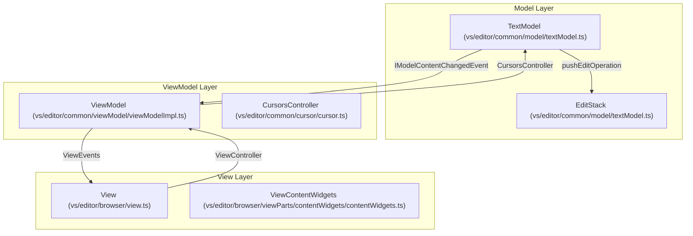
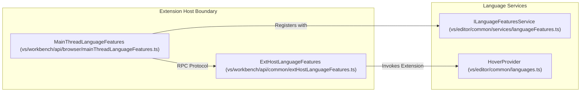

# Monaco Editor Core

Relevant source files

The following files were used as context for generating this wiki page:

- [extensions/css-language-features/server/test/linksTestFixtures/node_modules/foo/package.json](https://github.com/microsoft/vscode/blob/HEAD/extensions/css-language-features/server/test/linksTestFixtures/node_modules/foo/package.json)
- [extensions/ipynb/src/notebookImagePaste.ts](https://github.com/microsoft/vscode/blob/HEAD/extensions/ipynb/src/notebookImagePaste.ts)
- [extensions/vscode-api-tests/package.json](https://github.com/microsoft/vscode/blob/HEAD/extensions/vscode-api-tests/package.json)
- [extensions/vscode-api-tests/src/singlefolder-tests/chat.test.ts](https://github.com/microsoft/vscode/blob/HEAD/extensions/vscode-api-tests/src/singlefolder-tests/chat.test.ts)
- [extensions/vscode-colorize-tests/src/colorizer.test.ts](https://github.com/microsoft/vscode/blob/HEAD/extensions/vscode-colorize-tests/src/colorizer.test.ts)
- [src/vs/base/common/arrays.ts](https://github.com/microsoft/vscode/blob/HEAD/src/vs/base/common/arrays.ts)
- [src/vs/base/test/common/arrays.test.ts](https://github.com/microsoft/vscode/blob/HEAD/src/vs/base/test/common/arrays.test.ts)
- [src/vs/editor/browser/controller/editContext/clipboardUtils.ts](https://github.com/microsoft/vscode/blob/HEAD/src/vs/editor/browser/controller/editContext/clipboardUtils.ts)
- [src/vs/editor/browser/controller/editContext/editContext.ts](https://github.com/microsoft/vscode/blob/HEAD/src/vs/editor/browser/controller/editContext/editContext.ts)
- [src/vs/editor/browser/controller/editContext/native/debugEditContext.ts](https://github.com/microsoft/vscode/blob/HEAD/src/vs/editor/browser/controller/editContext/native/debugEditContext.ts)
- [src/vs/editor/browser/controller/editContext/native/editContextFactory.ts](https://github.com/microsoft/vscode/blob/HEAD/src/vs/editor/browser/controller/editContext/native/editContextFactory.ts)
- [src/vs/editor/browser/controller/editContext/native/nativeEditContext.css](https://github.com/microsoft/vscode/blob/HEAD/src/vs/editor/browser/controller/editContext/native/nativeEditContext.css)
- [src/vs/editor/browser/controller/editContext/native/nativeEditContext.ts](https://github.com/microsoft/vscode/blob/HEAD/src/vs/editor/browser/controller/editContext/native/nativeEditContext.ts)
- [src/vs/editor/browser/controller/editContext/native/nativeEditContextUtils.ts](https://github.com/microsoft/vscode/blob/HEAD/src/vs/editor/browser/controller/editContext/native/nativeEditContextUtils.ts)
- [src/vs/editor/browser/controller/editContext/native/screenReaderContentRich.ts](https://github.com/microsoft/vscode/blob/HEAD/src/vs/editor/browser/controller/editContext/native/screenReaderContentRich.ts)
- [src/vs/editor/browser/controller/editContext/native/screenReaderContentSimple.ts](https://github.com/microsoft/vscode/blob/HEAD/src/vs/editor/browser/controller/editContext/native/screenReaderContentSimple.ts)
- [src/vs/editor/browser/controller/editContext/native/screenReaderSupport.ts](https://github.com/microsoft/vscode/blob/HEAD/src/vs/editor/browser/controller/editContext/native/screenReaderSupport.ts)
- [src/vs/editor/browser/controller/editContext/native/screenReaderUtils.ts](https://github.com/microsoft/vscode/blob/HEAD/src/vs/editor/browser/controller/editContext/native/screenReaderUtils.ts)
- [src/vs/editor/browser/controller/editContext/screenReaderUtils.ts](https://github.com/microsoft/vscode/blob/HEAD/src/vs/editor/browser/controller/editContext/screenReaderUtils.ts)
- [src/vs/editor/browser/controller/editContext/textArea/textAreaEditContext.ts](https://github.com/microsoft/vscode/blob/HEAD/src/vs/editor/browser/controller/editContext/textArea/textAreaEditContext.ts)
- [src/vs/editor/browser/controller/editContext/textArea/textAreaEditContextInput.ts](https://github.com/microsoft/vscode/blob/HEAD/src/vs/editor/browser/controller/editContext/textArea/textAreaEditContextInput.ts)
- [src/vs/editor/browser/controller/editContext/textArea/textAreaEditContextState.ts](https://github.com/microsoft/vscode/blob/HEAD/src/vs/editor/browser/controller/editContext/textArea/textAreaEditContextState.ts)
- [src/vs/editor/browser/controller/mouseHandler.ts](https://github.com/microsoft/vscode/blob/HEAD/src/vs/editor/browser/controller/mouseHandler.ts)
- [src/vs/editor/browser/controller/mouseTarget.ts](https://github.com/microsoft/vscode/blob/HEAD/src/vs/editor/browser/controller/mouseTarget.ts)
- [src/vs/editor/browser/controller/pointerHandler.ts](https://github.com/microsoft/vscode/blob/HEAD/src/vs/editor/browser/controller/pointerHandler.ts)
- [src/vs/editor/browser/editorBrowser.ts](https://github.com/microsoft/vscode/blob/HEAD/src/vs/editor/browser/editorBrowser.ts)
- [src/vs/editor/browser/editorDom.ts](https://github.com/microsoft/vscode/blob/HEAD/src/vs/editor/browser/editorDom.ts)
- [src/vs/editor/browser/view.ts](https://github.com/microsoft/vscode/blob/HEAD/src/vs/editor/browser/view.ts)
- [src/vs/editor/browser/view/viewController.ts](https://github.com/microsoft/vscode/blob/HEAD/src/vs/editor/browser/view/viewController.ts)
- [src/vs/editor/browser/view/viewUserInputEvents.ts](https://github.com/microsoft/vscode/blob/HEAD/src/vs/editor/browser/view/viewUserInputEvents.ts)
- [src/vs/editor/browser/widget/codeEditor/codeEditorWidget.ts](https://github.com/microsoft/vscode/blob/HEAD/src/vs/editor/browser/widget/codeEditor/codeEditorWidget.ts)
- [src/vs/editor/common/config/editorConfigurationSchema.ts](https://github.com/microsoft/vscode/blob/HEAD/src/vs/editor/common/config/editorConfigurationSchema.ts)
- [src/vs/editor/common/config/editorOptions.ts](https://github.com/microsoft/vscode/blob/HEAD/src/vs/editor/common/config/editorOptions.ts)
- [src/vs/editor/common/editorCommon.ts](https://github.com/microsoft/vscode/blob/HEAD/src/vs/editor/common/editorCommon.ts)
- [src/vs/editor/common/languages.ts](https://github.com/microsoft/vscode/blob/HEAD/src/vs/editor/common/languages.ts)
- [src/vs/editor/common/model.ts](https://github.com/microsoft/vscode/blob/HEAD/src/vs/editor/common/model.ts)
- [src/vs/editor/common/model/textModel.ts](https://github.com/microsoft/vscode/blob/HEAD/src/vs/editor/common/model/textModel.ts)
- [src/vs/editor/common/standalone/standaloneEnums.ts](https://github.com/microsoft/vscode/blob/HEAD/src/vs/editor/common/standalone/standaloneEnums.ts)
- [src/vs/editor/common/viewModel/screenReaderSimpleModel.ts](https://github.com/microsoft/vscode/blob/HEAD/src/vs/editor/common/viewModel/screenReaderSimpleModel.ts)
- [src/vs/editor/common/viewModel/viewModelImpl.ts](https://github.com/microsoft/vscode/blob/HEAD/src/vs/editor/common/viewModel/viewModelImpl.ts)
- [src/vs/editor/contrib/clipboard/browser/clipboard.ts](https://github.com/microsoft/vscode/blob/HEAD/src/vs/editor/contrib/clipboard/browser/clipboard.ts)
- [src/vs/editor/contrib/dropOrPasteInto/browser/copyPasteContribution.ts](https://github.com/microsoft/vscode/blob/HEAD/src/vs/editor/contrib/dropOrPasteInto/browser/copyPasteContribution.ts)
- [src/vs/editor/contrib/dropOrPasteInto/browser/copyPasteController.ts](https://github.com/microsoft/vscode/blob/HEAD/src/vs/editor/contrib/dropOrPasteInto/browser/copyPasteController.ts)
- [src/vs/editor/contrib/dropOrPasteInto/browser/defaultProviders.ts](https://github.com/microsoft/vscode/blob/HEAD/src/vs/editor/contrib/dropOrPasteInto/browser/defaultProviders.ts)
- [src/vs/editor/contrib/dropOrPasteInto/browser/dropIntoEditorContribution.ts](https://github.com/microsoft/vscode/blob/HEAD/src/vs/editor/contrib/dropOrPasteInto/browser/dropIntoEditorContribution.ts)
- [src/vs/editor/contrib/dropOrPasteInto/browser/dropIntoEditorController.ts](https://github.com/microsoft/vscode/blob/HEAD/src/vs/editor/contrib/dropOrPasteInto/browser/dropIntoEditorController.ts)
- [src/vs/editor/contrib/dropOrPasteInto/browser/edit.ts](https://github.com/microsoft/vscode/blob/HEAD/src/vs/editor/contrib/dropOrPasteInto/browser/edit.ts)
- [src/vs/editor/contrib/dropOrPasteInto/browser/postEditWidget.css](https://github.com/microsoft/vscode/blob/HEAD/src/vs/editor/contrib/dropOrPasteInto/browser/postEditWidget.css)
- [src/vs/editor/contrib/dropOrPasteInto/browser/postEditWidget.ts](https://github.com/microsoft/vscode/blob/HEAD/src/vs/editor/contrib/dropOrPasteInto/browser/postEditWidget.ts)
- [src/vs/editor/contrib/dropOrPasteInto/test/browser/editSort.test.ts](https://github.com/microsoft/vscode/blob/HEAD/src/vs/editor/contrib/dropOrPasteInto/test/browser/editSort.test.ts)
- [src/vs/editor/contrib/inlayHints/browser/inlayHintsController.ts](https://github.com/microsoft/vscode/blob/HEAD/src/vs/editor/contrib/inlayHints/browser/inlayHintsController.ts)
- [src/vs/editor/contrib/inlineCompletions/browser/controller/commandIds.ts](https://github.com/microsoft/vscode/blob/HEAD/src/vs/editor/contrib/inlineCompletions/browser/controller/commandIds.ts)
- [src/vs/editor/contrib/inlineCompletions/browser/controller/commands.ts](https://github.com/microsoft/vscode/blob/HEAD/src/vs/editor/contrib/inlineCompletions/browser/controller/commands.ts)
- [src/vs/editor/contrib/inlineCompletions/browser/controller/inlineCompletionContextKeys.ts](https://github.com/microsoft/vscode/blob/HEAD/src/vs/editor/contrib/inlineCompletions/browser/controller/inlineCompletionContextKeys.ts)
- [src/vs/editor/contrib/inlineCompletions/browser/controller/inlineCompletionsController.ts](https://github.com/microsoft/vscode/blob/HEAD/src/vs/editor/contrib/inlineCompletions/browser/controller/inlineCompletionsController.ts)
- [src/vs/editor/contrib/inlineCompletions/browser/inlineCompletions.contribution.ts](https://github.com/microsoft/vscode/blob/HEAD/src/vs/editor/contrib/inlineCompletions/browser/inlineCompletions.contribution.ts)
- [src/vs/editor/contrib/inlineCompletions/browser/model/inlineCompletionsModel.ts](https://github.com/microsoft/vscode/blob/HEAD/src/vs/editor/contrib/inlineCompletions/browser/model/inlineCompletionsModel.ts)
- [src/vs/editor/contrib/inlineCompletions/browser/model/inlineCompletionsSource.ts](https://github.com/microsoft/vscode/blob/HEAD/src/vs/editor/contrib/inlineCompletions/browser/model/inlineCompletionsSource.ts)
- [src/vs/editor/contrib/inlineCompletions/browser/model/inlineSuggestionItem.ts](https://github.com/microsoft/vscode/blob/HEAD/src/vs/editor/contrib/inlineCompletions/browser/model/inlineSuggestionItem.ts)
- [src/vs/editor/contrib/inlineCompletions/browser/model/provideInlineCompletions.ts](https://github.com/microsoft/vscode/blob/HEAD/src/vs/editor/contrib/inlineCompletions/browser/model/provideInlineCompletions.ts)
- [src/vs/editor/contrib/inlineCompletions/browser/telemetry.ts](https://github.com/microsoft/vscode/blob/HEAD/src/vs/editor/contrib/inlineCompletions/browser/telemetry.ts)
- [src/vs/editor/contrib/inlineCompletions/browser/view/inlineEdits/inlineEditWithChanges.ts](https://github.com/microsoft/vscode/blob/HEAD/src/vs/editor/contrib/inlineCompletions/browser/view/inlineEdits/inlineEditWithChanges.ts)
- [src/vs/editor/contrib/inlineCompletions/browser/view/inlineEdits/inlineEditsModel.ts](https://github.com/microsoft/vscode/blob/HEAD/src/vs/editor/contrib/inlineCompletions/browser/view/inlineEdits/inlineEditsModel.ts)
- [src/vs/editor/contrib/inlineCompletions/browser/view/inlineEdits/inlineEditsView.ts](https://github.com/microsoft/vscode/blob/HEAD/src/vs/editor/contrib/inlineCompletions/browser/view/inlineEdits/inlineEditsView.ts)
- [src/vs/editor/contrib/inlineCompletions/browser/view/inlineEdits/inlineEditsViewInterface.ts](https://github.com/microsoft/vscode/blob/HEAD/src/vs/editor/contrib/inlineCompletions/browser/view/inlineEdits/inlineEditsViewInterface.ts)
- [src/vs/editor/contrib/inlineCompletions/browser/view/inlineEdits/inlineEditsViewProducer.ts](https://github.com/microsoft/vscode/blob/HEAD/src/vs/editor/contrib/inlineCompletions/browser/view/inlineEdits/inlineEditsViewProducer.ts)
- [src/vs/editor/test/browser/controller/imeRecordedTypes.ts](https://github.com/microsoft/vscode/blob/HEAD/src/vs/editor/test/browser/controller/imeRecordedTypes.ts)
- [src/vs/editor/test/browser/controller/nativeEditContextUtils.test.ts](https://github.com/microsoft/vscode/blob/HEAD/src/vs/editor/test/browser/controller/nativeEditContextUtils.test.ts)
- [src/vs/editor/test/browser/controller/textAreaInput.test.ts](https://github.com/microsoft/vscode/blob/HEAD/src/vs/editor/test/browser/controller/textAreaInput.test.ts)
- [src/vs/editor/test/browser/controller/textAreaState.test.ts](https://github.com/microsoft/vscode/blob/HEAD/src/vs/editor/test/browser/controller/textAreaState.test.ts)
- [src/vs/editor/test/browser/view/viewController.test.ts](https://github.com/microsoft/vscode/blob/HEAD/src/vs/editor/test/browser/view/viewController.test.ts)
- [src/vs/monaco.d.ts](https://github.com/microsoft/vscode/blob/HEAD/src/vs/monaco.d.ts)
- [src/vs/platform/extensions/common/extensionsApiProposals.ts](https://github.com/microsoft/vscode/blob/HEAD/src/vs/platform/extensions/common/extensionsApiProposals.ts)
- [src/vs/workbench/api/browser/mainThreadChatAgents2.ts](https://github.com/microsoft/vscode/blob/HEAD/src/vs/workbench/api/browser/mainThreadChatAgents2.ts)
- [src/vs/workbench/api/browser/mainThreadLanguageFeatures.ts](https://github.com/microsoft/vscode/blob/HEAD/src/vs/workbench/api/browser/mainThreadLanguageFeatures.ts)
- [src/vs/workbench/api/common/extHost.api.impl.ts](https://github.com/microsoft/vscode/blob/HEAD/src/vs/workbench/api/common/extHost.api.impl.ts)
- [src/vs/workbench/api/common/extHost.protocol.ts](https://github.com/microsoft/vscode/blob/HEAD/src/vs/workbench/api/common/extHost.protocol.ts)
- [src/vs/workbench/api/common/extHostChatAgents2.ts](https://github.com/microsoft/vscode/blob/HEAD/src/vs/workbench/api/common/extHostChatAgents2.ts)
- [src/vs/workbench/api/common/extHostLanguageFeatures.ts](https://github.com/microsoft/vscode/blob/HEAD/src/vs/workbench/api/common/extHostLanguageFeatures.ts)
- [src/vs/workbench/api/common/extHostTypeConverters.ts](https://github.com/microsoft/vscode/blob/HEAD/src/vs/workbench/api/common/extHostTypeConverters.ts)
- [src/vs/workbench/api/common/extHostTypes.ts](https://github.com/microsoft/vscode/blob/HEAD/src/vs/workbench/api/common/extHostTypes.ts)
- [src/vs/workbench/contrib/dropOrPasteInto/browser/commands.ts](https://github.com/microsoft/vscode/blob/HEAD/src/vs/workbench/contrib/dropOrPasteInto/browser/commands.ts)
- [src/vs/workbench/contrib/dropOrPasteInto/browser/dropOrPasteInto.contribution.ts](https://github.com/microsoft/vscode/blob/HEAD/src/vs/workbench/contrib/dropOrPasteInto/browser/dropOrPasteInto.contribution.ts)
- [src/vscode-dts/vscode.d.ts](https://github.com/microsoft/vscode/blob/HEAD/src/vscode-dts/vscode.d.ts)
- [src/vscode-dts/vscode.proposed.chatParticipantAdditions.d.ts](https://github.com/microsoft/vscode/blob/HEAD/src/vscode-dts/vscode.proposed.chatParticipantAdditions.d.ts)
- [src/vscode-dts/vscode.proposed.inlineCompletionsAdditions.d.ts](https://github.com/microsoft/vscode/blob/HEAD/src/vscode-dts/vscode.proposed.inlineCompletionsAdditions.d.ts)

The Monaco Editor is the core text editing component of VS Code. It is responsible for the efficient representation of text documents, the management of visual state (word wrap, folding, projections), and the orchestration of complex language features and user interface elements within the editor viewport.

The editor is built on a strict Model-View-ViewModel (MVVM) architecture to separate heavy-duty text manipulation from DOM-heavy rendering logic.

### Core Architecture Overview

The editor's lifecycle and data flow are managed through three primary layers:
1.  **TextModel**: The "Source of Truth." It handles raw text via a `PieceTreeTextBuffer`, manages edit operations, and the undo/redo stack [src/vs/editor/common/model/textModel.ts:46-56](https://github.com/microsoft/vscode/blob/HEAD/src/vs/editor/common/model/textModel.ts#L46-L56).
2.  **ViewModel**: The "Visual Logic." It translates the flat text model into a visual representation, handling line projections (like word wrap) and coordinating decorations [src/vs/editor/common/viewModel/viewModelImpl.ts:51-125](https://github.com/microsoft/vscode/blob/HEAD/src/vs/editor/common/viewModel/viewModelImpl.ts#L51-L125).
3.  **View**: The "Renderer." It interacts with the DOM to display lines, cursors, and widgets [src/vs/editor/browser/view.ts:32-60](https://github.com/microsoft/vscode/blob/HEAD/src/vs/editor/browser/view.ts#L32-L60).

The following diagram illustrates the relationship between these core entities:

#### Editor Data Flow

**Sources:** [src/vs/editor/common/model/textModel.ts:40-57](https://github.com/microsoft/vscode/blob/HEAD/src/vs/editor/common/model/textModel.ts#L40-L57), [src/vs/editor/common/viewModel/viewModelImpl.ts:86-125](https://github.com/microsoft/vscode/blob/HEAD/src/vs/editor/common/viewModel/viewModelImpl.ts#L86-L125), [src/vs/editor/common/model/textModel.ts:46-56](https://github.com/microsoft/vscode/blob/HEAD/src/vs/editor/common/model/textModel.ts#L46-L56)

---

## 4.1 Text Model and View Model
The `TextModel` manages the buffer of text and maintains document state, including decorations and tokenization state [src/vs/editor/common/model/textModel.ts:40-56](https://github.com/microsoft/vscode/blob/HEAD/src/vs/editor/common/model/textModel.ts#L40-L56). It provides the underlying data structure for all text-based operations using a `PieceTreeTextBuffer` for efficient large-file handling [src/vs/editor/common/model/textModel.ts:50-51](https://github.com/microsoft/vscode/blob/HEAD/src/vs/editor/common/model/textModel.ts#L50-L51). The `UndoRedoService` tracks changes across resources to provide robust undo/redo capabilities [src/vs/editor/common/model/textModel.ts:23-23](https://github.com/microsoft/vscode/blob/HEAD/src/vs/editor/common/model/textModel.ts#L23).

The `ViewModel` acts as a proxy between the model and the view. Its primary responsibility is "Line Projection"—calculating how a model line maps to a view line (e.g., visual lines created by word wrap) [src/vs/editor/common/viewModel/viewModelImpl.ts:98-120](https://github.com/microsoft/vscode/blob/HEAD/src/vs/editor/common/viewModel/viewModelImpl.ts#L98-L120). It also coordinates `ViewModelDecorations` which are visual-only markers filtered from the model [src/vs/editor/common/viewModel/viewModelImpl.ts:66-66](https://github.com/microsoft/vscode/blob/HEAD/src/vs/editor/common/viewModel/viewModelImpl.ts#L66).

For details, see [Text Model and View Model](#4.1).

**Sources:** [src/vs/editor/common/model/textModel.ts:111-121](https://github.com/microsoft/vscode/blob/HEAD/src/vs/editor/common/model/textModel.ts#L111-L121), [src/vs/editor/common/viewModel/viewModelImpl.ts:51-125](https://github.com/microsoft/vscode/blob/HEAD/src/vs/editor/common/viewModel/viewModelImpl.ts#L51-L125), [src/vs/editor/common/model/textModel.ts:46-56](https://github.com/microsoft/vscode/blob/HEAD/src/vs/editor/common/model/textModel.ts#L46-L56)

---

## 4.2 Editor Rendering and Input Handling
The rendering pipeline is highly optimized to minimize DOM churn, rendering only the visible lines in the viewport. Input is handled via a specialized `EditContext`. The editor supports various strategies for rendering, including experimental GPU acceleration and sophisticated whitespace rendering [src/vs/editor/common/config/editorOptions.ts:223-224](https://github.com/microsoft/vscode/blob/HEAD/src/vs/editor/common/config/editorOptions.ts#L223-L224).

Input handling is managed by specialized contexts such as `NativeEditContext` for modern browser APIs [src/vs/editor/browser/controller/editContext/native/nativeEditContext.ts:27-50](https://github.com/microsoft/vscode/blob/HEAD/src/vs/editor/browser/controller/editContext/native/nativeEditContext.ts#L27-L50) or `TextAreaEditContext` for legacy compatibility [src/vs/editor/browser/controller/editContext/textArea/textAreaEditContext.ts:24-40](https://github.com/microsoft/vscode/blob/HEAD/src/vs/editor/browser/controller/editContext/textArea/textAreaEditContext.ts#L24-L40). The editor also manages `ContentWidgetPositionPreference` for elements like the suggest widget that float over the text [src/vs/editor/common/standalone/standaloneEnums.ts:84-97](https://github.com/microsoft/vscode/blob/HEAD/src/vs/editor/common/standalone/standaloneEnums.ts#L84-L97).

For details, see [Editor Rendering and Input Handling](#4.2).

**Sources:** [src/vs/editor/common/config/editorOptions.ts:223-224](https://github.com/microsoft/vscode/blob/HEAD/src/vs/editor/common/config/editorOptions.ts#L223-L224), [src/vs/editor/common/standalone/standaloneEnums.ts:84-97](https://github.com/microsoft/vscode/blob/HEAD/src/vs/editor/common/standalone/standaloneEnums.ts#L84-L97), [src/vs/editor/browser/controller/editContext/native/nativeEditContext.ts:27-50](https://github.com/microsoft/vscode/blob/HEAD/src/vs/editor/browser/controller/editContext/native/nativeEditContext.ts#L27-L50)

---

## 4.3 Language Features and Editor Contributions
The Monaco Editor provides a rich set of language features through a provider-based architecture defined in `languages.ts` [src/vs/editor/common/languages.ts:1-223](https://github.com/microsoft/vscode/blob/HEAD/src/vs/editor/common/languages.ts#L1-L223). This includes IntelliSense (completions, hovers) and Navigation (definitions). Features are registered with the `ILanguageFeaturesService` [src/vs/workbench/api/browser/mainThreadLanguageFeatures.ts:55-55](https://github.com/microsoft/vscode/blob/HEAD/src/vs/workbench/api/browser/mainThreadLanguageFeatures.ts#L55).

These features are often implemented as editor contribution classes. For example, the `MainThreadLanguageFeatures` coordinates communication between the renderer and the extension host for features like diagnostics and word definitions [src/vs/workbench/api/browser/mainThreadLanguageFeatures.ts:65-90](https://github.com/microsoft/vscode/blob/HEAD/src/vs/workbench/api/browser/mainThreadLanguageFeatures.ts#L65-L90).

#### Language Feature and Contribution Architecture

**Sources:** [src/vs/workbench/api/browser/mainThreadLanguageFeatures.ts:46-98](https://github.com/microsoft/vscode/blob/HEAD/src/vs/workbench/api/browser/mainThreadLanguageFeatures.ts#L46-L98), [src/vs/workbench/api/common/extHostLanguageFeatures.ts:43-105](https://github.com/microsoft/vscode/blob/HEAD/src/vs/workbench/api/common/extHostLanguageFeatures.ts#L43-L105), [src/vs/editor/common/languages.ts:217-223](https://github.com/microsoft/vscode/blob/HEAD/src/vs/editor/common/languages.ts#L217-L223)

For details, see [Language Features and Editor Contributions](#4.3).

---

## 4.4 Inline Completions and Ghost Text
The `InlineCompletionsModel` manages the state for "Ghost Text" (unaccepted suggestions appearing inline) [src/vs/editor/contrib/inlineCompletions/browser/model/inlineCompletionsModel.ts:59-110](https://github.com/microsoft/vscode/blob/HEAD/src/vs/editor/contrib/inlineCompletions/browser/model/inlineCompletionsModel.ts#L59-L110). This system uses observables to track changes and update the visual state of completions [src/vs/editor/contrib/inlineCompletions/browser/model/inlineCompletionsModel.ts:11-13](https://github.com/microsoft/vscode/blob/HEAD/src/vs/editor/contrib/inlineCompletions/browser/model/inlineCompletionsModel.ts#L11-L13). 

It supports sophisticated "Inline Edits" rendered via `InlineEditsView`, which can show side-by-side diffs, insertions, or deletions directly within the editor flow [src/vs/editor/contrib/inlineCompletions/browser/view/inlineEdits/inlineEditsView.ts:86-125](https://github.com/microsoft/vscode/blob/HEAD/src/vs/editor/contrib/inlineCompletions/browser/view/inlineEdits/inlineEditsView.ts#L86-L125). Suggestions are fetched via the `InlineCompletionsSource` which interacts with registered `InlineCompletionsProvider` instances and manages the request lifecycle [src/vs/editor/contrib/inlineCompletions/browser/model/inlineCompletionsSource.ts:42-100](https://github.com/microsoft/vscode/blob/HEAD/src/vs/editor/contrib/inlineCompletions/browser/model/inlineCompletionsSource.ts#L42-L100).

For details, see [Inline Completions and Ghost Text](#4.4).

**Sources:** [src/vs/editor/contrib/inlineCompletions/browser/model/inlineCompletionsModel.ts:59-110](https://github.com/microsoft/vscode/blob/HEAD/src/vs/editor/contrib/inlineCompletions/browser/model/inlineCompletionsModel.ts#L59-L110), [src/vs/editor/contrib/inlineCompletions/browser/view/inlineEdits/inlineEditsView.ts:86-125](https://github.com/microsoft/vscode/blob/HEAD/src/vs/editor/contrib/inlineCompletions/browser/view/inlineEdits/inlineEditsView.ts#L86-L125), [src/vs/editor/contrib/inlineCompletions/browser/model/inlineCompletionsSource.ts:42-100](https://github.com/microsoft/vscode/blob/HEAD/src/vs/editor/contrib/inlineCompletions/browser/model/inlineCompletionsSource.ts#L42-L100)26