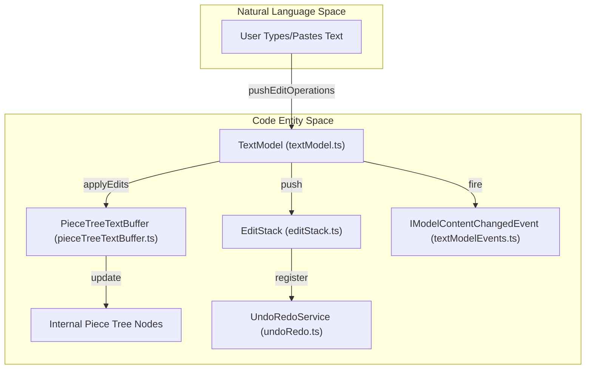
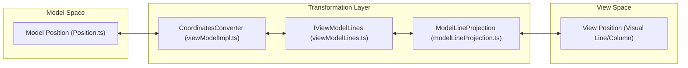

# Text Model and View Model

Relevant source files

The following files were used as context for generating this wiki page:

- [extensions/vscode-api-tests/package.json](extensions/vscode-api-tests/package.json)
- [extensions/vscode-api-tests/src/singlefolder-tests/chat.test.ts](extensions/vscode-api-tests/src/singlefolder-tests/chat.test.ts)
- [extensions/vscode-colorize-tests/src/colorizer.test.ts](extensions/vscode-colorize-tests/src/colorizer.test.ts)
- [src/vs/base/common/arrays.ts](src/vs/base/common/arrays.ts)
- [src/vs/base/test/common/arrays.test.ts](src/vs/base/test/common/arrays.test.ts)
- [src/vs/editor/common/config/editorConfigurationSchema.ts](src/vs/editor/common/config/editorConfigurationSchema.ts)
- [src/vs/editor/common/config/editorOptions.ts](src/vs/editor/common/config/editorOptions.ts)
- [src/vs/editor/common/languages.ts](src/vs/editor/common/languages.ts)
- [src/vs/editor/common/model.ts](src/vs/editor/common/model.ts)
- [src/vs/editor/common/model/textModel.ts](src/vs/editor/common/model/textModel.ts)
- [src/vs/editor/common/standalone/standaloneEnums.ts](src/vs/editor/common/standalone/standaloneEnums.ts)
- [src/vs/editor/common/viewModel/viewModelImpl.ts](src/vs/editor/common/viewModel/viewModelImpl.ts)
- [src/vs/editor/contrib/inlineCompletions/browser/controller/commandIds.ts](src/vs/editor/contrib/inlineCompletions/browser/controller/commandIds.ts)
- [src/vs/editor/contrib/inlineCompletions/browser/controller/commands.ts](src/vs/editor/contrib/inlineCompletions/browser/controller/commands.ts)
- [src/vs/editor/contrib/inlineCompletions/browser/controller/inlineCompletionContextKeys.ts](src/vs/editor/contrib/inlineCompletions/browser/controller/inlineCompletionContextKeys.ts)
- [src/vs/editor/contrib/inlineCompletions/browser/controller/inlineCompletionsController.ts](src/vs/editor/contrib/inlineCompletions/browser/controller/inlineCompletionsController.ts)
- [src/vs/editor/contrib/inlineCompletions/browser/inlineCompletions.contribution.ts](src/vs/editor/contrib/inlineCompletions/browser/inlineCompletions.contribution.ts)
- [src/vs/editor/contrib/inlineCompletions/browser/model/inlineCompletionsModel.ts](src/vs/editor/contrib/inlineCompletions/browser/model/inlineCompletionsModel.ts)
- [src/vs/editor/contrib/inlineCompletions/browser/model/inlineCompletionsSource.ts](src/vs/editor/contrib/inlineCompletions/browser/model/inlineCompletionsSource.ts)
- [src/vs/editor/contrib/inlineCompletions/browser/model/inlineSuggestionItem.ts](src/vs/editor/contrib/inlineCompletions/browser/model/inlineSuggestionItem.ts)
- [src/vs/editor/contrib/inlineCompletions/browser/model/provideInlineCompletions.ts](src/vs/editor/contrib/inlineCompletions/browser/model/provideInlineCompletions.ts)
- [src/vs/editor/contrib/inlineCompletions/browser/telemetry.ts](src/vs/editor/contrib/inlineCompletions/browser/telemetry.ts)
- [src/vs/editor/contrib/inlineCompletions/browser/view/inlineEdits/inlineEditWithChanges.ts](src/vs/editor/contrib/inlineCompletions/browser/view/inlineEdits/inlineEditWithChanges.ts)
- [src/vs/editor/contrib/inlineCompletions/browser/view/inlineEdits/inlineEditsModel.ts](src/vs/editor/contrib/inlineCompletions/browser/view/inlineEdits/inlineEditsModel.ts)
- [src/vs/editor/contrib/inlineCompletions/browser/view/inlineEdits/inlineEditsView.ts](src/vs/editor/contrib/inlineCompletions/browser/view/inlineEdits/inlineEditsView.ts)
- [src/vs/editor/contrib/inlineCompletions/browser/view/inlineEdits/inlineEditsViewInterface.ts](src/vs/editor/contrib/inlineCompletions/browser/view/inlineEdits/inlineEditsViewInterface.ts)
- [src/vs/editor/contrib/inlineCompletions/browser/view/inlineEdits/inlineEditsViewProducer.ts](src/vs/editor/contrib/inlineCompletions/browser/view/inlineEdits/inlineEditsViewProducer.ts)
- [src/vs/monaco.d.ts](src/vs/monaco.d.ts)
- [src/vs/platform/extensions/common/extensionsApiProposals.ts](src/vs/platform/extensions/common/extensionsApiProposals.ts)
- [src/vs/workbench/api/browser/mainThreadChatAgents2.ts](src/vs/workbench/api/browser/mainThreadChatAgents2.ts)
- [src/vs/workbench/api/browser/mainThreadLanguageFeatures.ts](src/vs/workbench/api/browser/mainThreadLanguageFeatures.ts)
- [src/vs/workbench/api/common/extHost.api.impl.ts](src/vs/workbench/api/common/extHost.api.impl.ts)
- [src/vs/workbench/api/common/extHost.protocol.ts](src/vs/workbench/api/common/extHost.protocol.ts)
- [src/vs/workbench/api/common/extHostChatAgents2.ts](src/vs/workbench/api/common/extHostChatAgents2.ts)
- [src/vs/workbench/api/common/extHostLanguageFeatures.ts](src/vs/workbench/api/common/extHostLanguageFeatures.ts)
- [src/vs/workbench/api/common/extHostTypeConverters.ts](src/vs/workbench/api/common/extHostTypeConverters.ts)
- [src/vs/workbench/api/common/extHostTypes.ts](src/vs/workbench/api/common/extHostTypes.ts)
- [src/vscode-dts/vscode.d.ts](src/vscode-dts/vscode.d.ts)
- [src/vscode-dts/vscode.proposed.chatParticipantAdditions.d.ts](src/vscode-dts/vscode.proposed.chatParticipantAdditions.d.ts)
- [src/vscode-dts/vscode.proposed.inlineCompletionsAdditions.d.ts](src/vscode-dts/vscode.proposed.inlineCompletionsAdditions.d.ts)

This page covers the core data structures and transformation layers of the Monaco Editor. The **Text Model** represents the document's logical state, while the **View Model** handles the visual projection of that state, including line wrapping, coordinate mapping, and visual-only decorations.

## Text Model

The `TextModel` (defined in `textModel.ts`) is the central representation of a document in the editor. It manages the raw text content, the edit history (undo/redo stack), and metadata like decorations and tokens.

### Data Representation
The underlying text storage is implemented using a **Piece Tree** (`PieceTreeTextBuffer`), which allows for efficient insertions and deletions even in very large files [src/vs/editor/common/model/textModel.ts:50-51](). This structure maintains a list of "pieces" that point to either the original file content or buffers containing new edits. The `PieceTreeTextBufferBuilder` is used to construct these buffers from strings, streams, or snapshots [src/vs/editor/common/model/textModel.ts:60-109]().

### Key Components
*   **TextBuffer**: Managed by `PieceTreeTextBuffer`, it handles the actual string data and provides line-based access [src/vs/editor/common/model/textModel.ts:50-50]().
*   **Edit Stack**: Managed via `EditStack`, it tracks changes for undo and redo operations within a specific model [src/vs/editor/common/model/textModel.ts:46-46]().
*   **Interval Tree**: Used to store and efficiently query `ModelDecorations` (e.g., breakpoints, highlights) via `IntervalTree` and `IntervalNode` [src/vs/editor/common/model/textModel.ts:49-49]().
*   **Tokenization Part**: The `TokenizationTextModelPart` handles syntax highlighting and language-specific metadata [src/vs/editor/common/model/textModel.ts:56-56](). It interacts with `TokenizerWithStateStoreAndTextModel` to manage token states and background tokenization [src/vs/editor/common/model/textModelTokens.ts:49-57]().
*   **Bracket Pairs**: Managed by `BracketPairsTextModelPart`, providing high-performance bracket matching and colorization [src/vs/editor/common/model/textModel.ts:44-45]().

### Edit Lifecycle and Data Flow
The following diagram illustrates how a text change flows from a raw edit into the model and triggers updates.

**Document Edit Data Flow**

Sources: [src/vs/editor/common/model/textModel.ts:40-56](), [src/vs/editor/common/textModelEvents.ts:1-40](), [src/vs/platform/undoRedo/common/undoRedo.ts:23-23]()

## View Model

The `ViewModel` (implemented in `ViewModelImpl`) is a visual projection of the `TextModel`. It translates "Model Coordinates" (logical lines and columns) into "View Coordinates" (visual lines and columns, accounting for word wrap, folded regions, and hidden areas).

### Line Projection and Wrapping
The `ViewModel` uses `IViewModelLines` to manage the mapping between the flat model and the potentially wrapped view [src/vs/editor/common/viewModel/viewModelImpl.ts:62-62]().
*   **Identity Projection**: Used when word wrap is disabled or the model is too large for tokenization; `ViewModelLinesFromModelAsIs` maps lines 1:1 [src/vs/editor/common/viewModel/viewModelImpl.ts:94-96]().
*   **Projected Model**: `ViewModelLinesFromProjectedModel` handles complex scenarios like word wrapping and "Injected Text" (e.g., ghost text, inlay hints) [src/vs/editor/common/viewModel/viewModelImpl.ts:107-120](). It maintains `IModelLineProjection` instances for each line [src/vs/editor/common/viewModel/viewModelLines.ts:76-81]().
*   **Line Breaks Computer**: `MonospaceLineBreaksComputerFactory` and `domLineBreaksComputer.ts` calculate where lines should break based on font info and wrapping strategy [src/vs/editor/common/viewModel/monospaceLineBreaksComputer.ts:15-15](), [src/vs/editor/browser/view/domLineBreaksComputer.ts:20-20]().

### Coordinate Mapping
The `ICoordinatesConverter` provides functions to convert between model and view positions [src/vs/editor/common/viewModel/viewModelImpl.ts:63-63]().

| Function | Purpose | Source |
| :--- | :--- | :--- |
| `convertModelPositionToViewPosition` | Maps a logical line/column to a visual line/column | [src/vs/editor/common/viewModel/viewModelImpl.ts:63-63]() |
| `convertViewPositionToModelPosition` | Maps a visual coordinate back to the document logic | [src/vs/editor/common/viewModel/viewModelImpl.ts:63-63]() |

**Coordinate Transformation Logic**

Sources: [src/vs/editor/common/viewModel/viewModelImpl.ts:51-63](), [src/vs/editor/common/viewModel/viewModelLines.ts:60-120](), [src/vs/editor/common/viewModel/modelLineProjection.ts:15-15]()

## Undo and Redo Service

The `UndoRedoService` provides a centralized mechanism for managing edit history across multiple resources, ensuring that global operations (like multi-file renames) can be undone atomically.

### Edit Stack Management
*   **EditStack**: Maintains the undo/redo history for a specific `TextModel`. It captures `TextChange` objects and manages snapshots [src/vs/editor/common/model/textModel.ts:46-46]().
*   **UndoRedoService**: A platform-level service (`IUndoRedoService`) that tracks `ResourceEditStackSnapshot` across the workbench [src/vs/editor/common/model/textModel.ts:23-23]().

Sources: [src/vs/editor/common/model/textModel.ts:23-46]()

## Implementation Details

### Decorations and Visual Parts
*   **ViewModelDecorations**: Filters and transforms model decorations into view-specific decorations, accounting for viewport visibility and visual-only styles [src/vs/editor/common/viewModel/viewModelImpl.ts:66-66]().
*   **Minimap**: `Minimap` rendering uses `MinimapTokensColorTracker` and `MinimapCharRenderer` to draw a condensed version of the `ViewModel` [src/vs/editor/browser/viewParts/minimap/minimap.ts:50-113](). It reacts to `ModelTokensChangedEvent` to refresh visual tokens [src/vs/editor/browser/viewParts/minimap/minimap.ts:24-31]().
*   **Content Widgets**: `ViewContentWidgets` renders UI elements (like suggest widgets) pinned to specific editor positions, using the `ViewModel` to resolve their visual coordinates [src/vs/editor/browser/viewParts/contentWidgets/contentWidgets.ts:25-47]().

### Inline Completions and Ghost Text
The `ViewModel` and `TextModel` are also heavily utilized by the `InlineCompletionsModel` [src/vs/editor/contrib/inlineCompletions/browser/model/inlineCompletionsModel.ts:59-110](). This model tracks the state of ghost text (visual-only text shown before acceptance) and uses `computeGhostText` to determine how to project these completions onto the current `TextModel` content [src/vs/editor/contrib/inlineCompletions/browser/model/inlineCompletionsModel.ts:39-40]().

### Configuration and Lifecycle
*   **IEditorConfiguration**: The `ViewModel` listens to configuration changes (e.g., toggling word wrap) and triggers a re-projection of lines via `_updateConfigurationViewLineCount` [src/vs/editor/common/viewModel/viewModelImpl.ts:88-89]().
*   **View Events**: Changes in the `ViewModel` (scrolling, line changes, decoration updates) are dispatched as `ViewModelEvent` to the view layer [src/vs/editor/common/viewModel/viewModelImpl.ts:40-40]().

Sources: [src/vs/editor/common/viewModel/viewModelImpl.ts:51-125](), [src/vs/editor/browser/viewParts/minimap/minimap.ts:1-113](), [src/vs/editor/browser/viewParts/contentWidgets/contentWidgets.ts:1-47](), [src/vs/editor/contrib/inlineCompletions/browser/model/inlineCompletionsModel.ts:59-112]()