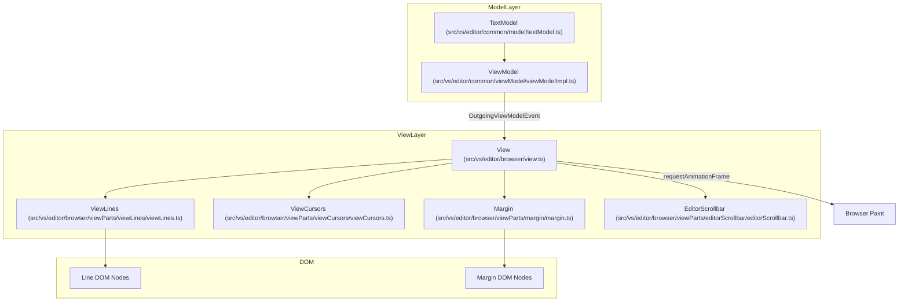
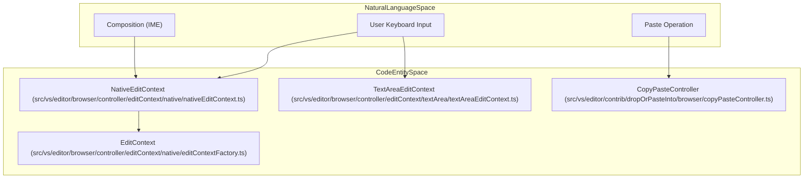

# Editor Rendering and Input Handling

Relevant source files

The following files were used as context for generating this wiki page:

- [extensions/css-language-features/server/test/linksTestFixtures/node_modules/foo/package.json](https://github.com/microsoft/vscode/blob/HEAD/extensions/css-language-features/server/test/linksTestFixtures/node_modules/foo/package.json)
- [extensions/ipynb/src/notebookImagePaste.ts](https://github.com/microsoft/vscode/blob/HEAD/extensions/ipynb/src/notebookImagePaste.ts)
- [src/typings/crypto.d.ts](https://github.com/microsoft/vscode/blob/HEAD/src/typings/crypto.d.ts)
- [src/vs/base/browser/browser.ts](https://github.com/microsoft/vscode/blob/HEAD/src/vs/base/browser/browser.ts)
- [src/vs/base/browser/canIUse.ts](https://github.com/microsoft/vscode/blob/HEAD/src/vs/base/browser/canIUse.ts)
- [src/vs/base/browser/dom.ts](https://github.com/microsoft/vscode/blob/HEAD/src/vs/base/browser/dom.ts)
- [src/vs/base/browser/formattedTextRenderer.ts](https://github.com/microsoft/vscode/blob/HEAD/src/vs/base/browser/formattedTextRenderer.ts)
- [src/vs/base/browser/markdownRenderer.ts](https://github.com/microsoft/vscode/blob/HEAD/src/vs/base/browser/markdownRenderer.ts)
- [src/vs/base/browser/touch.ts](https://github.com/microsoft/vscode/blob/HEAD/src/vs/base/browser/touch.ts)
- [src/vs/base/common/hash.ts](https://github.com/microsoft/vscode/blob/HEAD/src/vs/base/common/hash.ts)
- [src/vs/base/common/htmlContent.ts](https://github.com/microsoft/vscode/blob/HEAD/src/vs/base/common/htmlContent.ts)
- [src/vs/base/common/resources.ts](https://github.com/microsoft/vscode/blob/HEAD/src/vs/base/common/resources.ts)
- [src/vs/base/common/uri.ts](https://github.com/microsoft/vscode/blob/HEAD/src/vs/base/common/uri.ts)
- [src/vs/base/common/uriIpc.ts](https://github.com/microsoft/vscode/blob/HEAD/src/vs/base/common/uriIpc.ts)
- [src/vs/base/common/uuid.ts](https://github.com/microsoft/vscode/blob/HEAD/src/vs/base/common/uuid.ts)
- [src/vs/base/test/browser/dom.test.ts](https://github.com/microsoft/vscode/blob/HEAD/src/vs/base/test/browser/dom.test.ts)
- [src/vs/base/test/browser/formattedTextRenderer.test.ts](https://github.com/microsoft/vscode/blob/HEAD/src/vs/base/test/browser/formattedTextRenderer.test.ts)
- [src/vs/base/test/browser/hash.test.ts](https://github.com/microsoft/vscode/blob/HEAD/src/vs/base/test/browser/hash.test.ts)
- [src/vs/base/test/browser/markdownRenderer.test.ts](https://github.com/microsoft/vscode/blob/HEAD/src/vs/base/test/browser/markdownRenderer.test.ts)
- [src/vs/base/test/common/htmlContent.test.ts](https://github.com/microsoft/vscode/blob/HEAD/src/vs/base/test/common/htmlContent.test.ts)
- [src/vs/base/test/common/markdownString.test.ts](https://github.com/microsoft/vscode/blob/HEAD/src/vs/base/test/common/markdownString.test.ts)
- [src/vs/base/test/common/resources.test.ts](https://github.com/microsoft/vscode/blob/HEAD/src/vs/base/test/common/resources.test.ts)
- [src/vs/base/test/common/uri.test.ts](https://github.com/microsoft/vscode/blob/HEAD/src/vs/base/test/common/uri.test.ts)
- [src/vs/base/test/common/uuid.test.ts](https://github.com/microsoft/vscode/blob/HEAD/src/vs/base/test/common/uuid.test.ts)
- [src/vs/editor/browser/controller/editContext/clipboardUtils.ts](https://github.com/microsoft/vscode/blob/HEAD/src/vs/editor/browser/controller/editContext/clipboardUtils.ts)
- [src/vs/editor/browser/controller/editContext/editContext.ts](https://github.com/microsoft/vscode/blob/HEAD/src/vs/editor/browser/controller/editContext/editContext.ts)
- [src/vs/editor/browser/controller/editContext/native/debugEditContext.ts](https://github.com/microsoft/vscode/blob/HEAD/src/vs/editor/browser/controller/editContext/native/debugEditContext.ts)
- [src/vs/editor/browser/controller/editContext/native/editContextFactory.ts](https://github.com/microsoft/vscode/blob/HEAD/src/vs/editor/browser/controller/editContext/native/editContextFactory.ts)
- [src/vs/editor/browser/controller/editContext/native/nativeEditContext.css](https://github.com/microsoft/vscode/blob/HEAD/src/vs/editor/browser/controller/editContext/native/nativeEditContext.css)
- [src/vs/editor/browser/controller/editContext/native/nativeEditContext.ts](https://github.com/microsoft/vscode/blob/HEAD/src/vs/editor/browser/controller/editContext/native/nativeEditContext.ts)
- [src/vs/editor/browser/controller/editContext/native/nativeEditContextUtils.ts](https://github.com/microsoft/vscode/blob/HEAD/src/vs/editor/browser/controller/editContext/native/nativeEditContextUtils.ts)
- [src/vs/editor/browser/controller/editContext/native/screenReaderContentRich.ts](https://github.com/microsoft/vscode/blob/HEAD/src/vs/editor/browser/controller/editContext/native/screenReaderContentRich.ts)
- [src/vs/editor/browser/controller/editContext/native/screenReaderContentSimple.ts](https://github.com/microsoft/vscode/blob/HEAD/src/vs/editor/browser/controller/editContext/native/screenReaderContentSimple.ts)
- [src/vs/editor/browser/controller/editContext/native/screenReaderSupport.ts](https://github.com/microsoft/vscode/blob/HEAD/src/vs/editor/browser/controller/editContext/native/screenReaderSupport.ts)
- [src/vs/editor/browser/controller/editContext/native/screenReaderUtils.ts](https://github.com/microsoft/vscode/blob/HEAD/src/vs/editor/browser/controller/editContext/native/screenReaderUtils.ts)
- [src/vs/editor/browser/controller/editContext/screenReaderUtils.ts](https://github.com/microsoft/vscode/blob/HEAD/src/vs/editor/browser/controller/editContext/screenReaderUtils.ts)
- [src/vs/editor/browser/controller/editContext/textArea/textAreaEditContext.ts](https://github.com/microsoft/vscode/blob/HEAD/src/vs/editor/browser/controller/editContext/textArea/textAreaEditContext.ts)
- [src/vs/editor/browser/controller/editContext/textArea/textAreaEditContextInput.ts](https://github.com/microsoft/vscode/blob/HEAD/src/vs/editor/browser/controller/editContext/textArea/textAreaEditContextInput.ts)
- [src/vs/editor/browser/controller/editContext/textArea/textAreaEditContextState.ts](https://github.com/microsoft/vscode/blob/HEAD/src/vs/editor/browser/controller/editContext/textArea/textAreaEditContextState.ts)
- [src/vs/editor/browser/controller/mouseHandler.ts](https://github.com/microsoft/vscode/blob/HEAD/src/vs/editor/browser/controller/mouseHandler.ts)
- [src/vs/editor/browser/controller/mouseTarget.ts](https://github.com/microsoft/vscode/blob/HEAD/src/vs/editor/browser/controller/mouseTarget.ts)
- [src/vs/editor/browser/controller/pointerHandler.ts](https://github.com/microsoft/vscode/blob/HEAD/src/vs/editor/browser/controller/pointerHandler.ts)
- [src/vs/editor/browser/editorBrowser.ts](https://github.com/microsoft/vscode/blob/HEAD/src/vs/editor/browser/editorBrowser.ts)
- [src/vs/editor/browser/editorDom.ts](https://github.com/microsoft/vscode/blob/HEAD/src/vs/editor/browser/editorDom.ts)
- [src/vs/editor/browser/view.ts](https://github.com/microsoft/vscode/blob/HEAD/src/vs/editor/browser/view.ts)
- [src/vs/editor/browser/view/viewController.ts](https://github.com/microsoft/vscode/blob/HEAD/src/vs/editor/browser/view/viewController.ts)
- [src/vs/editor/browser/view/viewUserInputEvents.ts](https://github.com/microsoft/vscode/blob/HEAD/src/vs/editor/browser/view/viewUserInputEvents.ts)
- [src/vs/editor/browser/widget/codeEditor/codeEditorWidget.ts](https://github.com/microsoft/vscode/blob/HEAD/src/vs/editor/browser/widget/codeEditor/codeEditorWidget.ts)
- [src/vs/editor/common/editorCommon.ts](https://github.com/microsoft/vscode/blob/HEAD/src/vs/editor/common/editorCommon.ts)
- [src/vs/editor/common/viewModel/screenReaderSimpleModel.ts](https://github.com/microsoft/vscode/blob/HEAD/src/vs/editor/common/viewModel/screenReaderSimpleModel.ts)
- [src/vs/editor/contrib/clipboard/browser/clipboard.ts](https://github.com/microsoft/vscode/blob/HEAD/src/vs/editor/contrib/clipboard/browser/clipboard.ts)
- [src/vs/editor/contrib/dropOrPasteInto/browser/copyPasteContribution.ts](https://github.com/microsoft/vscode/blob/HEAD/src/vs/editor/contrib/dropOrPasteInto/browser/copyPasteContribution.ts)
- [src/vs/editor/contrib/dropOrPasteInto/browser/copyPasteController.ts](https://github.com/microsoft/vscode/blob/HEAD/src/vs/editor/contrib/dropOrPasteInto/browser/copyPasteController.ts)
- [src/vs/editor/contrib/dropOrPasteInto/browser/defaultProviders.ts](https://github.com/microsoft/vscode/blob/HEAD/src/vs/editor/contrib/dropOrPasteInto/browser/defaultProviders.ts)
- [src/vs/editor/contrib/dropOrPasteInto/browser/dropIntoEditorContribution.ts](https://github.com/microsoft/vscode/blob/HEAD/src/vs/editor/contrib/dropOrPasteInto/browser/dropIntoEditorContribution.ts)
- [src/vs/editor/contrib/dropOrPasteInto/browser/dropIntoEditorController.ts](https://github.com/microsoft/vscode/blob/HEAD/src/vs/editor/contrib/dropOrPasteInto/browser/dropIntoEditorController.ts)
- [src/vs/editor/contrib/dropOrPasteInto/browser/edit.ts](https://github.com/microsoft/vscode/blob/HEAD/src/vs/editor/contrib/dropOrPasteInto/browser/edit.ts)
- [src/vs/editor/contrib/dropOrPasteInto/browser/postEditWidget.css](https://github.com/microsoft/vscode/blob/HEAD/src/vs/editor/contrib/dropOrPasteInto/browser/postEditWidget.css)
- [src/vs/editor/contrib/dropOrPasteInto/browser/postEditWidget.ts](https://github.com/microsoft/vscode/blob/HEAD/src/vs/editor/contrib/dropOrPasteInto/browser/postEditWidget.ts)
- [src/vs/editor/contrib/dropOrPasteInto/test/browser/editSort.test.ts](https://github.com/microsoft/vscode/blob/HEAD/src/vs/editor/contrib/dropOrPasteInto/test/browser/editSort.test.ts)
- [src/vs/editor/contrib/inlayHints/browser/inlayHintsController.ts](https://github.com/microsoft/vscode/blob/HEAD/src/vs/editor/contrib/inlayHints/browser/inlayHintsController.ts)
- [src/vs/editor/test/browser/controller/imeRecordedTypes.ts](https://github.com/microsoft/vscode/blob/HEAD/src/vs/editor/test/browser/controller/imeRecordedTypes.ts)
- [src/vs/editor/test/browser/controller/nativeEditContextUtils.test.ts](https://github.com/microsoft/vscode/blob/HEAD/src/vs/editor/test/browser/controller/nativeEditContextUtils.test.ts)
- [src/vs/editor/test/browser/controller/textAreaInput.test.ts](https://github.com/microsoft/vscode/blob/HEAD/src/vs/editor/test/browser/controller/textAreaInput.test.ts)
- [src/vs/editor/test/browser/controller/textAreaState.test.ts](https://github.com/microsoft/vscode/blob/HEAD/src/vs/editor/test/browser/controller/textAreaState.test.ts)
- [src/vs/editor/test/browser/view/viewController.test.ts](https://github.com/microsoft/vscode/blob/HEAD/src/vs/editor/test/browser/view/viewController.test.ts)
- [src/vs/platform/extensionManagement/common/configRemotes.ts](https://github.com/microsoft/vscode/blob/HEAD/src/vs/platform/extensionManagement/common/configRemotes.ts)
- [src/vs/platform/extensionManagement/test/common/configRemotes.test.ts](https://github.com/microsoft/vscode/blob/HEAD/src/vs/platform/extensionManagement/test/common/configRemotes.test.ts)
- [src/vs/platform/extensionManagement/test/common/extensionManagement.test.ts](https://github.com/microsoft/vscode/blob/HEAD/src/vs/platform/extensionManagement/test/common/extensionManagement.test.ts)
- [src/vs/platform/markdown/browser/markdownRenderer.ts](https://github.com/microsoft/vscode/blob/HEAD/src/vs/platform/markdown/browser/markdownRenderer.ts)
- [src/vs/workbench/browser/window.ts](https://github.com/microsoft/vscode/blob/HEAD/src/vs/workbench/browser/window.ts)
- [src/vs/workbench/contrib/dropOrPasteInto/browser/commands.ts](https://github.com/microsoft/vscode/blob/HEAD/src/vs/workbench/contrib/dropOrPasteInto/browser/commands.ts)
- [src/vs/workbench/contrib/dropOrPasteInto/browser/dropOrPasteInto.contribution.ts](https://github.com/microsoft/vscode/blob/HEAD/src/vs/workbench/contrib/dropOrPasteInto/browser/dropOrPasteInto.contribution.ts)
- [src/vs/workbench/contrib/extensions/test/electron-browser/extension.test.ts](https://github.com/microsoft/vscode/blob/HEAD/src/vs/workbench/contrib/extensions/test/electron-browser/extension.test.ts)
- [src/vs/workbench/contrib/tags/common/javaWorkspaceTags.ts](https://github.com/microsoft/vscode/blob/HEAD/src/vs/workbench/contrib/tags/common/javaWorkspaceTags.ts)
- [src/vs/workbench/contrib/tags/electron-browser/workspaceTags.ts](https://github.com/microsoft/vscode/blob/HEAD/src/vs/workbench/contrib/tags/electron-browser/workspaceTags.ts)
- [src/vs/workbench/contrib/tags/electron-browser/workspaceTagsService.ts](https://github.com/microsoft/vscode/blob/HEAD/src/vs/workbench/contrib/tags/electron-browser/workspaceTagsService.ts)
- [src/vs/workbench/contrib/telemetry/browser/telemetry.contribution.ts](https://github.com/microsoft/vscode/blob/HEAD/src/vs/workbench/contrib/telemetry/browser/telemetry.contribution.ts)
- [src/vs/workbench/contrib/workspaces/browser/recentRemoteFolderPruner.ts](https://github.com/microsoft/vscode/blob/HEAD/src/vs/workbench/contrib/workspaces/browser/recentRemoteFolderPruner.ts)
- [src/vs/workbench/contrib/workspaces/browser/workspaces.contribution.ts](https://github.com/microsoft/vscode/blob/HEAD/src/vs/workbench/contrib/workspaces/browser/workspaces.contribution.ts)
- [src/vs/workbench/contrib/workspaces/test/browser/recentRemoteFolderPruner.test.ts](https://github.com/microsoft/vscode/blob/HEAD/src/vs/workbench/contrib/workspaces/test/browser/recentRemoteFolderPruner.test.ts)
- [src/vs/workbench/services/auxiliaryWindow/browser/auxiliaryWindowService.ts](https://github.com/microsoft/vscode/blob/HEAD/src/vs/workbench/services/auxiliaryWindow/browser/auxiliaryWindowService.ts)
- [src/vs/workbench/services/lifecycle/browser/lifecycleService.ts](https://github.com/microsoft/vscode/blob/HEAD/src/vs/workbench/services/lifecycle/browser/lifecycleService.ts)
- [src/vs/workbench/services/lifecycle/common/lifecycle.ts](https://github.com/microsoft/vscode/blob/HEAD/src/vs/workbench/services/lifecycle/common/lifecycle.ts)
- [src/vs/workbench/services/lifecycle/common/lifecycleService.ts](https://github.com/microsoft/vscode/blob/HEAD/src/vs/workbench/services/lifecycle/common/lifecycleService.ts)
- [src/vs/workbench/services/remote/browser/remoteAgentService.ts](https://github.com/microsoft/vscode/blob/HEAD/src/vs/workbench/services/remote/browser/remoteAgentService.ts)
- [src/vs/workbench/services/textfile/browser/browserTextFileService.ts](https://github.com/microsoft/vscode/blob/HEAD/src/vs/workbench/services/textfile/browser/browserTextFileService.ts)
- [src/vs/workbench/test/browser/window.test.ts](https://github.com/microsoft/vscode/blob/HEAD/src/vs/workbench/test/browser/window.test.ts)

The editor's rendering and input handling system is responsible for the visual representation of the code, the management of the DOM structure, and the orchestration of user input (keyboard, mouse, and clipboard). This system bridges the gap between the internal `TextModel` and the browser's DOM.

## Editor View and Rendering Pipeline

The `View` class is the central orchestrator for rendering the editor. It inherits from `ViewEventHandler` and manages a collection of `ViewPart` objects, each responsible for a specific aspect of the UI (e.g., lines, cursors, scrollbars) [src/vs/editor/browser/view.ts:86-105](https://github.com/microsoft/vscode/blob/HEAD/src/vs/editor/browser/view.ts#L86-L105).

### View Architecture
The view is composed of several layers:
1.  **Lines Content**: The actual text rendering area, managed by `ViewLines` [src/vs/editor/browser/view.ts:96-96](https://github.com/microsoft/vscode/blob/HEAD/src/vs/editor/browser/view.ts#L96). In experimental configurations, this can be handled by `ViewLinesGpu` for high-performance rendering [src/vs/editor/browser/view.ts:97-97](https://github.com/microsoft/vscode/blob/HEAD/src/vs/editor/browser/view.ts#L97).
2.  **Overlays**: Content rendered on top of the text, such as `SelectionsOverlay`, `DecorationsOverlay`, and `IndentGuidesOverlay` [src/vs/editor/browser/view.ts:19-43](https://github.com/microsoft/vscode/blob/HEAD/src/vs/editor/browser/view.ts#L19-L43).
3.  **Margin**: The area to the left of the text, containing line numbers (`LineNumbersOverlay`) and glyphs (`GlyphMarginWidgets`) [src/vs/editor/browser/view.ts:29-33](https://github.com/microsoft/vscode/blob/HEAD/src/vs/editor/browser/view.ts#L29-L33).
4.  **Widgets**: Floating elements like `ViewContentWidgets` (hovers, suggest widget) and `ViewOverlayWidgets` (find widget) [src/vs/editor/browser/view.ts:101-103](https://github.com/microsoft/vscode/blob/HEAD/src/vs/editor/browser/view.ts#L101-L103).

### Rendering Flow
The rendering process is reactive. When the `ViewModel` or `TextModel` changes, events are emitted that trigger the `View` to refresh. The view uses a `RestrictedRenderingContext` to provide parts with the necessary dimensions and scroll positions for drawing [src/vs/editor/browser/view/renderingContext.ts:17-17](https://github.com/microsoft/vscode/blob/HEAD/src/vs/editor/browser/view/renderingContext.ts#L17).

**Title: View Rendering Data Flow**

Sources: [src/vs/editor/browser/view.ts:86-125](https://github.com/microsoft/vscode/blob/HEAD/src/vs/editor/browser/view.ts#L86-L125), [src/vs/editor/browser/view/renderingContext.ts:17-18](https://github.com/microsoft/vscode/blob/HEAD/src/vs/editor/browser/view/renderingContext.ts#L17-L18), [src/vs/editor/browser/widget/codeEditor/codeEditorWidget.ts:50-53](https://github.com/microsoft/vscode/blob/HEAD/src/vs/editor/browser/widget/codeEditor/codeEditorWidget.ts#L50-L53), [src/vs/editor/common/viewModel/viewModelImpl.ts:51-66](https://github.com/microsoft/vscode/blob/HEAD/src/vs/editor/common/viewModel/viewModelImpl.ts#L51-L66)

## Input Handling and EditContext

VS Code supports two primary methods for handling text input: the traditional `TextAreaEditContext` and the modern `NativeEditContext` which leverages the browser's `EditContext` API.

### EditContext Integration
The `NativeEditContext` class implements the integration with the browser's `EditContext` API. This allows the editor to receive complex input (like IME) directly without relying on a hidden textarea.

*   **NativeEditContext**: Uses `EditContext.create(window)` to manage text and selection state [src/vs/editor/browser/controller/editContext/native/nativeEditContext.ts:113-113](https://github.com/microsoft/vscode/blob/HEAD/src/vs/editor/browser/controller/editContext/native/nativeEditContext.ts#L113). It handles composition events and maps DOM offsets to editor positions using `PositionOffsetTransformer` [src/vs/editor/browser/controller/editContext/native/nativeEditContext.ts:27-28](https://github.com/microsoft/vscode/blob/HEAD/src/vs/editor/browser/controller/editContext/native/nativeEditContext.ts#L27-L28).
*   **TextAreaEditContext**: A fallback that uses a hidden `<textarea>` to capture input events, particularly useful for browsers without `EditContext` support [src/vs/editor/browser/controller/editContext/textArea/textAreaEditContext.ts:62-63](https://github.com/microsoft/vscode/blob/HEAD/src/vs/editor/browser/controller/editContext/textArea/textAreaEditContext.ts#L62-L63).

### Clipboard Handling
Clipboard operations (Cut, Copy, Paste) are intercepted by the `EditContext` to ensure editor-specific metadata (like line-wise selection status) is preserved.

| Class/Function | Role |
| :--- | :--- |
| `createClipboardCopyEvent` | Packages editor selection data into the system clipboard [src/vs/editor/browser/controller/editContext/clipboardUtils.ts:19-19](https://github.com/microsoft/vscode/blob/HEAD/src/vs/editor/browser/controller/editContext/clipboardUtils.ts#L19). |
| `CopyPasteController` | Orchestrates complex paste operations, including `DocumentPasteEditProvider` integration [src/vs/editor/contrib/dropOrPasteInto/browser/copyPasteController.ts:79-85](https://github.com/microsoft/vscode/blob/HEAD/src/vs/editor/contrib/dropOrPasteInto/browser/copyPasteController.ts#L79-L85). |
| `NativeEditContext` | Listens for `copy`, `cut`, and `paste` DOM events on the editor node [src/vs/editor/browser/controller/editContext/native/nativeEditContext.ts:118-150](https://github.com/microsoft/vscode/blob/HEAD/src/vs/editor/browser/controller/editContext/native/nativeEditContext.ts#L118-L150). |
| `generateDataToCopyAndStoreInMemory` | Prepares metadata for clipboard events, ensuring formatting and metadata travel with the text [src/vs/editor/browser/controller/editContext/clipboardUtils.ts:17-17](https://github.com/microsoft/vscode/blob/HEAD/src/vs/editor/browser/controller/editContext/clipboardUtils.ts#L17). |

Sources: [src/vs/editor/browser/controller/editContext/native/nativeEditContext.ts:53-60](https://github.com/microsoft/vscode/blob/HEAD/src/vs/editor/browser/controller/editContext/native/nativeEditContext.ts#L53-L60), [src/vs/editor/browser/controller/editContext/clipboardUtils.ts:19-19](https://github.com/microsoft/vscode/blob/HEAD/src/vs/editor/browser/controller/editContext/clipboardUtils.ts#L19), [src/vs/editor/contrib/dropOrPasteInto/browser/copyPasteController.ts:79-139](https://github.com/microsoft/vscode/blob/HEAD/src/vs/editor/contrib/dropOrPasteInto/browser/copyPasteController.ts#L79-L139), [src/vs/editor/contrib/clipboard/browser/clipboard.ts:17-17](https://github.com/microsoft/vscode/blob/HEAD/src/vs/editor/contrib/clipboard/browser/clipboard.ts#L17)

## Widgets and Overlays

The editor supports several types of interactive elements that float over or are embedded within the text.

### Content and Overlay Widgets
*   **Content Widgets**: Positioned relative to a coordinate in the text (e.g., `SuggestWidget`). They follow the text as it scrolls and use `ContentWidgetPositionPreference` to determine placement (ABOVE, BELOW, EXACT) [src/vs/editor/browser/editorBrowser.ts:126-140](https://github.com/microsoft/vscode/blob/HEAD/src/vs/editor/browser/editorBrowser.ts#L126-L140).
*   **Overlay Widgets**: Positioned relative to the editor's container (e.g., `FindWidget`). They stay fixed while text scrolls and use `OverlayWidgetPositionPreference` [src/vs/editor/browser/editorBrowser.ts:182-195](https://github.com/microsoft/vscode/blob/HEAD/src/vs/editor/browser/editorBrowser.ts#L182-L195).
*   **View Zones**: Horizontal spacers that push lines apart to insert content like Peek Views. They are managed via `IViewZoneChangeAccessor` [src/vs/editor/browser/editorBrowser.ts:36-51](https://github.com/microsoft/vscode/blob/HEAD/src/vs/editor/browser/editorBrowser.ts#L36-L51), [src/vs/editor/browser/editorBrowser.ts:104-121](https://github.com/microsoft/vscode/blob/HEAD/src/vs/editor/browser/editorBrowser.ts#L104-L121).

### Language Feature Rendering
`InlayHintsController` manages the lifecycle of inlay hints, which are rendered as injected text within the line [src/vs/editor/contrib/inlayHints/browser/inlayHintsController.ts:129-141](https://github.com/microsoft/vscode/blob/HEAD/src/vs/editor/contrib/inlayHints/browser/inlayHintsController.ts#L129-L141). It uses `DynamicCssRules` to manage styles for rendered hints [src/vs/editor/contrib/inlayHints/browser/inlayHintsController.ts:159-159](https://github.com/microsoft/vscode/blob/HEAD/src/vs/editor/contrib/inlayHints/browser/inlayHintsController.ts#L159).

**Title: Input Handling Entity Mapping**

Sources: [src/vs/editor/browser/controller/editContext/native/nativeEditContext.ts:53-63](https://github.com/microsoft/vscode/blob/HEAD/src/vs/editor/browser/controller/editContext/native/nativeEditContext.ts#L53-L63), [src/vs/editor/contrib/dropOrPasteInto/browser/copyPasteController.ts:79-139](https://github.com/microsoft/vscode/blob/HEAD/src/vs/editor/contrib/dropOrPasteInto/browser/copyPasteController.ts#L79-L139), [src/vs/editor/contrib/inlayHints/browser/inlayHintsController.ts:129-160](https://github.com/microsoft/vscode/blob/HEAD/src/vs/editor/contrib/inlayHints/browser/inlayHintsController.ts#L129-L160)

## Drop and Paste Controllers

VS Code provides a mechanism for handling file drops and complex pastes through the `DropIntoEditorController` and `CopyPasteController`.

### Data Flow for Paste
When a paste occurs, the `CopyPasteController` queries registered `DocumentPasteEditProvider`s. This allows extensions to transform pasted data (e.g., turning a URL into a Markdown link).

1.  **Paste Event**: `NativeEditContext` catches the browser `paste` event [src/vs/editor/browser/controller/editContext/native/nativeEditContext.ts:146-150](https://github.com/microsoft/vscode/blob/HEAD/src/vs/editor/browser/controller/editContext/native/nativeEditContext.ts#L146-L150).
2.  **Controller Interception**: `CopyPasteController` handles the event via `handlePaste` [src/vs/editor/contrib/dropOrPasteInto/browser/copyPasteController.ts:131-131](https://github.com/microsoft/vscode/blob/HEAD/src/vs/editor/contrib/dropOrPasteInto/browser/copyPasteController.ts#L131).
3.  **Provider Execution**: The controller gathers edits from providers and sorts them by `yieldTo` preferences using `sortEditsByYieldTo` [src/vs/editor/contrib/dropOrPasteInto/browser/copyPasteController.ts:40-40](https://github.com/microsoft/vscode/blob/HEAD/src/vs/editor/contrib/dropOrPasteInto/browser/copyPasteController.ts#L40).
4.  **UI Feedback**: If multiple options exist, a `PostEditWidgetManager` is used to show a selector to the user [src/vs/editor/contrib/dropOrPasteInto/browser/copyPasteController.ts:135-138](https://github.com/microsoft/vscode/blob/HEAD/src/vs/editor/contrib/dropOrPasteInto/browser/copyPasteController.ts#L135-L138).

Sources: [src/vs/editor/contrib/dropOrPasteInto/browser/copyPasteController.ts:79-139](https://github.com/microsoft/vscode/blob/HEAD/src/vs/editor/contrib/dropOrPasteInto/browser/copyPasteController.ts#L79-L139), [src/vs/editor/browser/controller/editContext/native/nativeEditContext.ts:118-150](https://github.com/microsoft/vscode/blob/HEAD/src/vs/editor/browser/controller/editContext/native/nativeEditContext.ts#L118-L150)

## Accessibility and Screen Reader Support

Input handling is tightly coupled with accessibility. The `ScreenReaderSupport` class ensures that the state of the `EditContext` is synchronized with screen readers.

*   **Aria Options**: Managed via `IEditorAriaOptions` to control how the editor is described to assistive technology [src/vs/editor/browser/editorBrowser.ts:251-264](https://github.com/microsoft/vscode/blob/HEAD/src/vs/editor/browser/editorBrowser.ts#L251-L264).
*   **Focus Tracking**: The `FocusTracker` in `NativeEditContext` ensures the `ViewModel` is aware of focus changes to update cursor rendering and accessibility state [src/vs/editor/browser/controller/editContext/native/nativeEditContext.ts:106-110](https://github.com/microsoft/vscode/blob/HEAD/src/vs/editor/browser/controller/editContext/native/nativeEditContext.ts#L106-L110).
*   **Selection Synchronization**: When the selection changes in the editor, `NativeEditContext` updates the browser's `EditContext` selection, which in turn informs the screen reader of the current cursor position [src/vs/editor/browser/controller/editContext/native/nativeEditContext.ts:60-63](https://github.com/microsoft/vscode/blob/HEAD/src/vs/editor/browser/controller/editContext/native/nativeEditContext.ts#L60-L63).
*   **Content Generation**: `ScreenReaderSupport` uses either `RichScreenReaderContent` or `SimpleScreenReaderContent` to generate the text provided to screen readers based on user configuration [src/vs/editor/browser/controller/editContext/native/screenReaderSupport.ts:83-89](https://github.com/microsoft/vscode/blob/HEAD/src/vs/editor/browser/controller/editContext/native/screenReaderSupport.ts#L83-L89).

Sources: [src/vs/editor/browser/controller/editContext/native/nativeEditContext.ts:59-60](https://github.com/microsoft/vscode/blob/HEAD/src/vs/editor/browser/controller/editContext/native/nativeEditContext.ts#L59-L60), [src/vs/editor/browser/editorBrowser.ts:251-264](https://github.com/microsoft/vscode/blob/HEAD/src/vs/editor/browser/editorBrowser.ts#L251-L264), [src/vs/editor/browser/controller/editContext/native/screenReaderSupport.ts:25-51](https://github.com/microsoft/vscode/blob/HEAD/src/vs/editor/browser/controller/editContext/native/screenReaderSupport.ts#L25-L51)

## Mouse Interaction and Target Detection

The `PointerHandler` and `MouseTarget` classes manage how mouse events are mapped back to the document model.

| Entity | Role |
| :--- | :--- |
| `PointerHandler` | Main entry point for mouse/pointer events, coordinating between the view and the `ViewController` [src/vs/editor/browser/controller/pointerHandler.ts:24-24](https://github.com/microsoft/vscode/blob/HEAD/src/vs/editor/browser/controller/pointerHandler.ts#L24). |
| `MouseTarget` | A static utility that analyzes a DOM event to determine exactly what part of the editor was clicked (e.g., `CONTENT_TEXT`, `GUTTER_LINE_NUMBERS`, `SCROLLBAR`) [src/vs/editor/browser/controller/mouseTarget.ts:70-110](https://github.com/microsoft/vscode/blob/HEAD/src/vs/editor/browser/controller/mouseTarget.ts#L70-L110). |
| `HitTestContext` | Provides the necessary view state to convert DOM coordinates into editor `Position` and `Range` [src/vs/editor/browser/controller/mouseTarget.ts:54-60](https://github.com/microsoft/vscode/blob/HEAD/src/vs/editor/browser/controller/mouseTarget.ts#L54-L60). |

Sources: [src/vs/editor/browser/controller/pointerHandler.ts:24-24](https://github.com/microsoft/vscode/blob/HEAD/src/vs/editor/browser/controller/pointerHandler.ts#L24), [src/vs/editor/browser/controller/mouseTarget.ts:70-110](https://github.com/microsoft/vscode/blob/HEAD/src/vs/editor/browser/controller/mouseTarget.ts#L70-L110), [src/vs/editor/browser/view/viewController.ts:18-18](https://github.com/microsoft/vscode/blob/HEAD/src/vs/editor/browser/view/viewController.ts#L18)