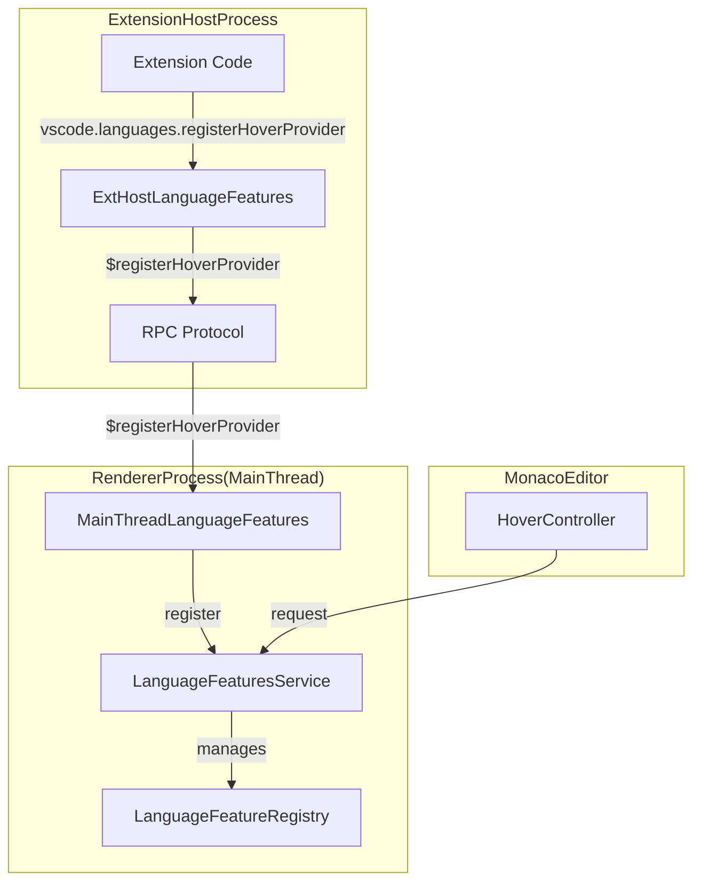
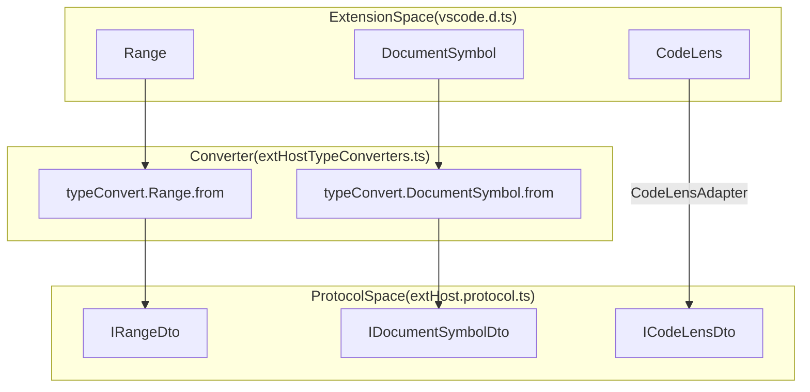

# Language Features and Editor Contributions

<details>
<summary>Relevant source files</summary>

The following files were used as context for generating this wiki page:

- [extensions/vscode-api-tests/package.json](https://github.com/microsoft/vscode/blob/HEAD/extensions/vscode-api-tests/package.json)
- [extensions/vscode-api-tests/src/singlefolder-tests/chat.test.ts](https://github.com/microsoft/vscode/blob/HEAD/extensions/vscode-api-tests/src/singlefolder-tests/chat.test.ts)
- [extensions/vscode-colorize-tests/src/colorizer.test.ts](https://github.com/microsoft/vscode/blob/HEAD/extensions/vscode-colorize-tests/src/colorizer.test.ts)
- [src/vs/base/browser/ui/iconLabel/iconLabels.ts](https://github.com/microsoft/vscode/blob/HEAD/src/vs/base/browser/ui/iconLabel/iconLabels.ts)
- [src/vs/base/common/arrays.ts](https://github.com/microsoft/vscode/blob/HEAD/src/vs/base/common/arrays.ts)
- [src/vs/base/common/codicons.ts](https://github.com/microsoft/vscode/blob/HEAD/src/vs/base/common/codicons.ts)
- [src/vs/base/common/iconLabels.ts](https://github.com/microsoft/vscode/blob/HEAD/src/vs/base/common/iconLabels.ts)
- [src/vs/base/test/browser/iconLabels.test.ts](https://github.com/microsoft/vscode/blob/HEAD/src/vs/base/test/browser/iconLabels.test.ts)
- [src/vs/base/test/browser/ui/menu/menubar.test.ts](https://github.com/microsoft/vscode/blob/HEAD/src/vs/base/test/browser/ui/menu/menubar.test.ts)
- [src/vs/base/test/common/arrays.test.ts](https://github.com/microsoft/vscode/blob/HEAD/src/vs/base/test/common/arrays.test.ts)
- [src/vs/base/test/common/iconLabels.test.ts](https://github.com/microsoft/vscode/blob/HEAD/src/vs/base/test/common/iconLabels.test.ts)
- [src/vs/editor/common/config/editorConfigurationSchema.ts](https://github.com/microsoft/vscode/blob/HEAD/src/vs/editor/common/config/editorConfigurationSchema.ts)
- [src/vs/editor/common/config/editorOptions.ts](https://github.com/microsoft/vscode/blob/HEAD/src/vs/editor/common/config/editorOptions.ts)
- [src/vs/editor/common/editorContextKeys.ts](https://github.com/microsoft/vscode/blob/HEAD/src/vs/editor/common/editorContextKeys.ts)
- [src/vs/editor/common/languages.ts](https://github.com/microsoft/vscode/blob/HEAD/src/vs/editor/common/languages.ts)
- [src/vs/editor/common/languages/modesRegistry.ts](https://github.com/microsoft/vscode/blob/HEAD/src/vs/editor/common/languages/modesRegistry.ts)
- [src/vs/editor/common/model.ts](https://github.com/microsoft/vscode/blob/HEAD/src/vs/editor/common/model.ts)
- [src/vs/editor/common/model/textModel.ts](https://github.com/microsoft/vscode/blob/HEAD/src/vs/editor/common/model/textModel.ts)
- [src/vs/editor/common/standalone/standaloneEnums.ts](https://github.com/microsoft/vscode/blob/HEAD/src/vs/editor/common/standalone/standaloneEnums.ts)
- [src/vs/editor/common/viewModel/viewModelImpl.ts](https://github.com/microsoft/vscode/blob/HEAD/src/vs/editor/common/viewModel/viewModelImpl.ts)
- [src/vs/editor/contrib/codeAction/browser/codeAction.ts](https://github.com/microsoft/vscode/blob/HEAD/src/vs/editor/contrib/codeAction/browser/codeAction.ts)
- [src/vs/editor/contrib/codeAction/browser/codeActionCommands.ts](https://github.com/microsoft/vscode/blob/HEAD/src/vs/editor/contrib/codeAction/browser/codeActionCommands.ts)
- [src/vs/editor/contrib/codeAction/browser/codeActionContributions.ts](https://github.com/microsoft/vscode/blob/HEAD/src/vs/editor/contrib/codeAction/browser/codeActionContributions.ts)
- [src/vs/editor/contrib/codeAction/browser/codeActionController.ts](https://github.com/microsoft/vscode/blob/HEAD/src/vs/editor/contrib/codeAction/browser/codeActionController.ts)
- [src/vs/editor/contrib/codeAction/browser/codeActionKeybindingResolver.ts](https://github.com/microsoft/vscode/blob/HEAD/src/vs/editor/contrib/codeAction/browser/codeActionKeybindingResolver.ts)
- [src/vs/editor/contrib/codeAction/browser/codeActionMenu.ts](https://github.com/microsoft/vscode/blob/HEAD/src/vs/editor/contrib/codeAction/browser/codeActionMenu.ts)
- [src/vs/editor/contrib/codeAction/browser/codeActionModel.ts](https://github.com/microsoft/vscode/blob/HEAD/src/vs/editor/contrib/codeAction/browser/codeActionModel.ts)
- [src/vs/editor/contrib/codeAction/browser/lightBulbWidget.css](https://github.com/microsoft/vscode/blob/HEAD/src/vs/editor/contrib/codeAction/browser/lightBulbWidget.css)
- [src/vs/editor/contrib/codeAction/browser/lightBulbWidget.ts](https://github.com/microsoft/vscode/blob/HEAD/src/vs/editor/contrib/codeAction/browser/lightBulbWidget.ts)
- [src/vs/editor/contrib/codeAction/common/types.ts](https://github.com/microsoft/vscode/blob/HEAD/src/vs/editor/contrib/codeAction/common/types.ts)
- [src/vs/editor/contrib/codeAction/test/browser/codeAction.test.ts](https://github.com/microsoft/vscode/blob/HEAD/src/vs/editor/contrib/codeAction/test/browser/codeAction.test.ts)
- [src/vs/editor/contrib/folding/browser/folding.css](https://github.com/microsoft/vscode/blob/HEAD/src/vs/editor/contrib/folding/browser/folding.css)
- [src/vs/editor/contrib/folding/browser/folding.ts](https://github.com/microsoft/vscode/blob/HEAD/src/vs/editor/contrib/folding/browser/folding.ts)
- [src/vs/editor/contrib/folding/browser/foldingDecorations.ts](https://github.com/microsoft/vscode/blob/HEAD/src/vs/editor/contrib/folding/browser/foldingDecorations.ts)
- [src/vs/editor/contrib/folding/browser/foldingModel.ts](https://github.com/microsoft/vscode/blob/HEAD/src/vs/editor/contrib/folding/browser/foldingModel.ts)
- [src/vs/editor/contrib/folding/browser/foldingRanges.ts](https://github.com/microsoft/vscode/blob/HEAD/src/vs/editor/contrib/folding/browser/foldingRanges.ts)
- [src/vs/editor/contrib/folding/browser/hiddenRangeModel.ts](https://github.com/microsoft/vscode/blob/HEAD/src/vs/editor/contrib/folding/browser/hiddenRangeModel.ts)
- [src/vs/editor/contrib/folding/browser/indentRangeProvider.ts](https://github.com/microsoft/vscode/blob/HEAD/src/vs/editor/contrib/folding/browser/indentRangeProvider.ts)
- [src/vs/editor/contrib/folding/browser/syntaxRangeProvider.ts](https://github.com/microsoft/vscode/blob/HEAD/src/vs/editor/contrib/folding/browser/syntaxRangeProvider.ts)
- [src/vs/editor/contrib/folding/test/browser/foldingModel.test.ts](https://github.com/microsoft/vscode/blob/HEAD/src/vs/editor/contrib/folding/test/browser/foldingModel.test.ts)
- [src/vs/editor/contrib/folding/test/browser/foldingRanges.test.ts](https://github.com/microsoft/vscode/blob/HEAD/src/vs/editor/contrib/folding/test/browser/foldingRanges.test.ts)
- [src/vs/editor/contrib/folding/test/browser/hiddenRangeModel.test.ts](https://github.com/microsoft/vscode/blob/HEAD/src/vs/editor/contrib/folding/test/browser/hiddenRangeModel.test.ts)
- [src/vs/editor/contrib/folding/test/browser/indentFold.test.ts](https://github.com/microsoft/vscode/blob/HEAD/src/vs/editor/contrib/folding/test/browser/indentFold.test.ts)
- [src/vs/editor/contrib/folding/test/browser/syntaxFold.test.ts](https://github.com/microsoft/vscode/blob/HEAD/src/vs/editor/contrib/folding/test/browser/syntaxFold.test.ts)
- [src/vs/editor/contrib/format/browser/format.ts](https://github.com/microsoft/vscode/blob/HEAD/src/vs/editor/contrib/format/browser/format.ts)
- [src/vs/editor/contrib/format/browser/formatActions.ts](https://github.com/microsoft/vscode/blob/HEAD/src/vs/editor/contrib/format/browser/formatActions.ts)
- [src/vs/editor/contrib/inlineCompletions/browser/controller/commandIds.ts](https://github.com/microsoft/vscode/blob/HEAD/src/vs/editor/contrib/inlineCompletions/browser/controller/commandIds.ts)
- [src/vs/editor/contrib/inlineCompletions/browser/controller/commands.ts](https://github.com/microsoft/vscode/blob/HEAD/src/vs/editor/contrib/inlineCompletions/browser/controller/commands.ts)
- [src/vs/editor/contrib/inlineCompletions/browser/controller/inlineCompletionContextKeys.ts](https://github.com/microsoft/vscode/blob/HEAD/src/vs/editor/contrib/inlineCompletions/browser/controller/inlineCompletionContextKeys.ts)
- [src/vs/editor/contrib/inlineCompletions/browser/controller/inlineCompletionsController.ts](https://github.com/microsoft/vscode/blob/HEAD/src/vs/editor/contrib/inlineCompletions/browser/controller/inlineCompletionsController.ts)
- [src/vs/editor/contrib/inlineCompletions/browser/inlineCompletions.contribution.ts](https://github.com/microsoft/vscode/blob/HEAD/src/vs/editor/contrib/inlineCompletions/browser/inlineCompletions.contribution.ts)
- [src/vs/editor/contrib/inlineCompletions/browser/model/inlineCompletionsModel.ts](https://github.com/microsoft/vscode/blob/HEAD/src/vs/editor/contrib/inlineCompletions/browser/model/inlineCompletionsModel.ts)
- [src/vs/editor/contrib/inlineCompletions/browser/model/inlineCompletionsSource.ts](https://github.com/microsoft/vscode/blob/HEAD/src/vs/editor/contrib/inlineCompletions/browser/model/inlineCompletionsSource.ts)
- [src/vs/editor/contrib/inlineCompletions/browser/model/inlineSuggestionItem.ts](https://github.com/microsoft/vscode/blob/HEAD/src/vs/editor/contrib/inlineCompletions/browser/model/inlineSuggestionItem.ts)
- [src/vs/editor/contrib/inlineCompletions/browser/model/provideInlineCompletions.ts](https://github.com/microsoft/vscode/blob/HEAD/src/vs/editor/contrib/inlineCompletions/browser/model/provideInlineCompletions.ts)
- [src/vs/editor/contrib/inlineCompletions/browser/telemetry.ts](https://github.com/microsoft/vscode/blob/HEAD/src/vs/editor/contrib/inlineCompletions/browser/telemetry.ts)
- [src/vs/editor/contrib/inlineCompletions/browser/view/inlineEdits/inlineEditWithChanges.ts](https://github.com/microsoft/vscode/blob/HEAD/src/vs/editor/contrib/inlineCompletions/browser/view/inlineEdits/inlineEditWithChanges.ts)
- [src/vs/editor/contrib/inlineCompletions/browser/view/inlineEdits/inlineEditsModel.ts](https://github.com/microsoft/vscode/blob/HEAD/src/vs/editor/contrib/inlineCompletions/browser/view/inlineEdits/inlineEditsModel.ts)
- [src/vs/editor/contrib/inlineCompletions/browser/view/inlineEdits/inlineEditsView.ts](https://github.com/microsoft/vscode/blob/HEAD/src/vs/editor/contrib/inlineCompletions/browser/view/inlineEdits/inlineEditsView.ts)
- [src/vs/editor/contrib/inlineCompletions/browser/view/inlineEdits/inlineEditsViewInterface.ts](https://github.com/microsoft/vscode/blob/HEAD/src/vs/editor/contrib/inlineCompletions/browser/view/inlineEdits/inlineEditsViewInterface.ts)
- [src/vs/editor/contrib/inlineCompletions/browser/view/inlineEdits/inlineEditsViewProducer.ts](https://github.com/microsoft/vscode/blob/HEAD/src/vs/editor/contrib/inlineCompletions/browser/view/inlineEdits/inlineEditsViewProducer.ts)
- [src/vs/editor/contrib/stickyScroll/browser/stickyScroll.css](https://github.com/microsoft/vscode/blob/HEAD/src/vs/editor/contrib/stickyScroll/browser/stickyScroll.css)
- [src/vs/editor/contrib/stickyScroll/browser/stickyScrollActions.ts](https://github.com/microsoft/vscode/blob/HEAD/src/vs/editor/contrib/stickyScroll/browser/stickyScrollActions.ts)
- [src/vs/editor/contrib/stickyScroll/browser/stickyScrollContribution.ts](https://github.com/microsoft/vscode/blob/HEAD/src/vs/editor/contrib/stickyScroll/browser/stickyScrollContribution.ts)
- [src/vs/editor/contrib/stickyScroll/browser/stickyScrollController.ts](https://github.com/microsoft/vscode/blob/HEAD/src/vs/editor/contrib/stickyScroll/browser/stickyScrollController.ts)
- [src/vs/editor/contrib/stickyScroll/browser/stickyScrollElement.ts](https://github.com/microsoft/vscode/blob/HEAD/src/vs/editor/contrib/stickyScroll/browser/stickyScrollElement.ts)
- [src/vs/editor/contrib/stickyScroll/browser/stickyScrollModelProvider.ts](https://github.com/microsoft/vscode/blob/HEAD/src/vs/editor/contrib/stickyScroll/browser/stickyScrollModelProvider.ts)
- [src/vs/editor/contrib/stickyScroll/browser/stickyScrollProvider.ts](https://github.com/microsoft/vscode/blob/HEAD/src/vs/editor/contrib/stickyScroll/browser/stickyScrollProvider.ts)
- [src/vs/editor/contrib/stickyScroll/browser/stickyScrollWidget.ts](https://github.com/microsoft/vscode/blob/HEAD/src/vs/editor/contrib/stickyScroll/browser/stickyScrollWidget.ts)
- [src/vs/monaco.d.ts](https://github.com/microsoft/vscode/blob/HEAD/src/vs/monaco.d.ts)
- [src/vs/platform/actionWidget/common/actionWidget.ts](https://github.com/microsoft/vscode/blob/HEAD/src/vs/platform/actionWidget/common/actionWidget.ts)
- [src/vs/platform/extensions/common/extensionsApiProposals.ts](https://github.com/microsoft/vscode/blob/HEAD/src/vs/platform/extensions/common/extensionsApiProposals.ts)
- [src/vs/platform/jsonschemas/common/jsonContributionRegistry.ts](https://github.com/microsoft/vscode/blob/HEAD/src/vs/platform/jsonschemas/common/jsonContributionRegistry.ts)
- [src/vs/platform/registry/common/platform.ts](https://github.com/microsoft/vscode/blob/HEAD/src/vs/platform/registry/common/platform.ts)
- [src/vs/workbench/api/browser/mainThreadChatAgents2.ts](https://github.com/microsoft/vscode/blob/HEAD/src/vs/workbench/api/browser/mainThreadChatAgents2.ts)
- [src/vs/workbench/api/browser/mainThreadLanguageFeatures.ts](https://github.com/microsoft/vscode/blob/HEAD/src/vs/workbench/api/browser/mainThreadLanguageFeatures.ts)
- [src/vs/workbench/api/common/extHost.api.impl.ts](https://github.com/microsoft/vscode/blob/HEAD/src/vs/workbench/api/common/extHost.api.impl.ts)
- [src/vs/workbench/api/common/extHost.protocol.ts](https://github.com/microsoft/vscode/blob/HEAD/src/vs/workbench/api/common/extHost.protocol.ts)
- [src/vs/workbench/api/common/extHostChatAgents2.ts](https://github.com/microsoft/vscode/blob/HEAD/src/vs/workbench/api/common/extHostChatAgents2.ts)
- [src/vs/workbench/api/common/extHostLanguageFeatures.ts](https://github.com/microsoft/vscode/blob/HEAD/src/vs/workbench/api/common/extHostLanguageFeatures.ts)
- [src/vs/workbench/api/common/extHostTypeConverters.ts](https://github.com/microsoft/vscode/blob/HEAD/src/vs/workbench/api/common/extHostTypeConverters.ts)
- [src/vs/workbench/api/common/extHostTypes.ts](https://github.com/microsoft/vscode/blob/HEAD/src/vs/workbench/api/common/extHostTypes.ts)
- [src/vs/workbench/contrib/codeEditor/browser/saveParticipants.ts](https://github.com/microsoft/vscode/blob/HEAD/src/vs/workbench/contrib/codeEditor/browser/saveParticipants.ts)
- [src/vs/workbench/contrib/folding/browser/folding.contribution.ts](https://github.com/microsoft/vscode/blob/HEAD/src/vs/workbench/contrib/folding/browser/folding.contribution.ts)
- [src/vs/workbench/contrib/format/browser/formatActionsMultiple.ts](https://github.com/microsoft/vscode/blob/HEAD/src/vs/workbench/contrib/format/browser/formatActionsMultiple.ts)
- [src/vs/workbench/contrib/format/browser/formatModified.ts](https://github.com/microsoft/vscode/blob/HEAD/src/vs/workbench/contrib/format/browser/formatModified.ts)
- [src/vs/workbench/contrib/notebook/browser/contrib/format/formatting.ts](https://github.com/microsoft/vscode/blob/HEAD/src/vs/workbench/contrib/notebook/browser/contrib/format/formatting.ts)
- [src/vs/workbench/contrib/notebook/browser/contrib/saveParticipants/saveParticipants.ts](https://github.com/microsoft/vscode/blob/HEAD/src/vs/workbench/contrib/notebook/browser/contrib/saveParticipants/saveParticipants.ts)
- [src/vs/workbench/contrib/preferences/common/settingsFilesystemProvider.ts](https://github.com/microsoft/vscode/blob/HEAD/src/vs/workbench/contrib/preferences/common/settingsFilesystemProvider.ts)
- [src/vs/workbench/services/extensions/common/extensionPoints.json](https://github.com/microsoft/vscode/blob/HEAD/src/vs/workbench/services/extensions/common/extensionPoints.json)
- [src/vscode-dts/vscode.d.ts](https://github.com/microsoft/vscode/blob/HEAD/src/vscode-dts/vscode.d.ts)
- [src/vscode-dts/vscode.proposed.chatParticipantAdditions.d.ts](https://github.com/microsoft/vscode/blob/HEAD/src/vscode-dts/vscode.proposed.chatParticipantAdditions.d.ts)
- [src/vscode-dts/vscode.proposed.inlineCompletionsAdditions.d.ts](https://github.com/microsoft/vscode/blob/HEAD/src/vscode-dts/vscode.proposed.inlineCompletionsAdditions.d.ts)

</details>


The Monaco Editor and VS Code Workbench provide a rich set of language-agnostic features (IntelliSense) powered by a provider-based architecture. These features are decoupled from specific language implementations, allowing extensions to contribute functionality like Hovers, Code Actions, and Inline Completions through standardized interfaces.

## Language Feature Providers

The core of language intelligence in VS Code is defined in `languages.ts`. This file specifies the interfaces that any language support (built-in or extension-based) must implement to participate in the editor's ecosystem.

### Key Provider Interfaces
| Feature | Provider Interface | Data Type Returned |
| :--- | :--- | :--- |
| **Hover** | `HoverProvider` [src/vs/editor/common/languages.ts:217-217](https://github.com/microsoft/vscode/blob/HEAD/src/vs/editor/common/languages.ts#L217) | `Hover` (Markdown contents + Range) |
| **Completions** | `CompletionItemProvider` [src/vs/editor/common/languages.ts:606-606](https://github.com/microsoft/vscode/blob/HEAD/src/vs/editor/common/languages.ts#L606) | `CompletionList` |
| **Code Actions** | `CodeActionProvider` [src/vs/editor/common/languages.ts:854-854](https://github.com/microsoft/vscode/blob/HEAD/src/vs/editor/common/languages.ts#L854) | `(Command | CodeAction)[]` |
| **Inlay Hints** | `InlayHintsProvider` [src/vs/editor/common/languages.ts:1679-1679](https://github.com/microsoft/vscode/blob/HEAD/src/vs/editor/common/languages.ts#L1679) | `InlayHint[]` |
| **Symbols** | `DocumentSymbolProvider` [src/vs/editor/common/languages.ts:1143-1143](https://github.com/microsoft/vscode/blob/HEAD/src/vs/editor/common/languages.ts#L1143) | `DocumentSymbol[]` |
| **Inline Completions** | `InlineCompletionsProvider` [src/vs/editor/common/languages.ts:696-696](https://github.com/microsoft/vscode/blob/HEAD/src/vs/editor/common/languages.ts#L696) | `InlineCompletions` |

### Data Flow: Extension to Editor
Language features typically follow a cross-process request-response cycle between the **Renderer Process** (Main Thread) and the **Extension Host**.

1.  **Trigger**: User interacts with the editor (e.g., hovers over text).
2.  **Request**: `MainThreadLanguageFeatures` receives the UI event and calls the corresponding proxy method on the Extension Host via the RPC protocol defined in `extHost.protocol.ts` [src/vs/workbench/api/common/extHost.protocol.ts:1-31](https://github.com/microsoft/vscode/blob/HEAD/src/vs/workbench/api/common/extHost.protocol.ts#L1-L31).
3.  **Execution**: `ExtHostLanguageFeatures` [src/vs/workbench/api/common/extHostLanguageFeatures.ts:73-73](https://github.com/microsoft/vscode/blob/HEAD/src/vs/workbench/api/common/extHostLanguageFeatures.ts#L73) locates the registered provider for that document's language.
4.  **Conversion**: Results from the extension (using `vscode.d.ts` types) are converted to internal editor types via `extHostTypeConverters.ts` [src/vs/workbench/api/common/extHostTypeConverters.ts:30-30](https://github.com/microsoft/vscode/blob/HEAD/src/vs/workbench/api/common/extHostTypeConverters.ts#L30).
5.  **Rendering**: The Main Thread receives the DTOs (Data Transfer Objects) and renders the UI.

**Diagram: Language Feature Registration Flow**

Sources: [src/vs/workbench/api/common/extHostLanguageFeatures.ts:1-40](https://github.com/microsoft/vscode/blob/HEAD/src/vs/workbench/api/common/extHostLanguageFeatures.ts#L1-L40), [src/vs/editor/common/languages.ts:217-230](https://github.com/microsoft/vscode/blob/HEAD/src/vs/editor/common/languages.ts#L217-L230), [src/vs/workbench/api/common/extHost.protocol.ts:1-100](https://github.com/microsoft/vscode/blob/HEAD/src/vs/workbench/api/common/extHost.protocol.ts#L1-L100)

---

## Editor Contributions

Editor Contributions are classes that extend the functionality of the core editor. They are instantiated per editor instance and manage the lifecycle of specific features.

### Code Actions and Lightbulbs
The Code Action system coordinates "Quick Fixes" and "Refactorings".
*   **Controller**: `CodeActionController` listens to cursor changes and manages the lifecycle of code action requests.
*   **Model**: `CodeActionModel` triggers the `CodeActionProvider` [src/vs/editor/common/languages.ts:854-854](https://github.com/microsoft/vscode/blob/HEAD/src/vs/editor/common/languages.ts#L854) and manages the state of available actions.
*   **UI**: `LightBulbWidget` renders the icon in the gutter, while `toMenuItems` in `codeActionMenu.ts` prepares the list of available fixes, grouping them by `CodeActionKind` [src/vs/workbench/api/common/extHostTypes.ts:22-22](https://github.com/microsoft/vscode/blob/HEAD/src/vs/workbench/api/common/extHostTypes.ts#L22).

### Sticky Scroll
Sticky Scroll keeps the relevant scopes (classes, methods, loops) visible at the top of the editor during scrolling.
*   **Provider**: `StickyLineCandidateProvider` uses `StickyModelProvider` to determine the scope hierarchy based on `DocumentSymbolProvider`.
*   **Widget**: `StickyScrollWidget` [src/vs/editor/contrib/stickyScroll/browser/stickyScrollWidget.ts:52-52](https://github.com/microsoft/vscode/blob/HEAD/src/vs/editor/contrib/stickyScroll/browser/stickyScrollWidget.ts#L52) handles the rendering of the "stuck" lines. It manages its own DOM nodes for line numbers (`_lineNumbersDomNode`) and line contents (`_linesDomNode`) [src/vs/editor/contrib/stickyScroll/browser/stickyScrollWidget.ts:55-58](https://github.com/microsoft/vscode/blob/HEAD/src/vs/editor/contrib/stickyScroll/browser/stickyScrollWidget.ts#L55-L58).
*   **State Management**: The widget's visual state is encapsulated in `StickyScrollWidgetState` [src/vs/editor/contrib/stickyScroll/browser/stickyScrollWidget.ts:25-44](https://github.com/microsoft/vscode/blob/HEAD/src/vs/editor/contrib/stickyScroll/browser/stickyScrollWidget.ts#L25-L44), which tracks start/end line numbers and relative positions.
*   **Controller**: `StickyScrollController` coordinates the widget and the provider, reacting to scroll and configuration changes [src/vs/editor/contrib/stickyScroll/browser/stickyScrollWidget.ts:99-108](https://github.com/microsoft/vscode/blob/HEAD/src/vs/editor/contrib/stickyScroll/browser/stickyScrollWidget.ts#L99-L108).

### Inline Completions and Inline Edits
Inline completions provide "gray text" suggestions directly in the editor buffer, while Inline Edits provide more complex diff-like views for AI-generated changes.
*   **Model**: `InlineCompletionsModel` [src/vs/editor/contrib/inlineCompletions/browser/model/inlineCompletionsModel.ts:59-59](https://github.com/microsoft/vscode/blob/HEAD/src/vs/editor/contrib/inlineCompletions/browser/model/inlineCompletionsModel.ts#L59) tracks the current suggestion state and ghost text. It manages a state machine for completions, handling acceptance and cancellation [src/vs/editor/contrib/inlineCompletions/browser/model/inlineCompletionsModel.ts:75-87](https://github.com/microsoft/vscode/blob/HEAD/src/vs/editor/contrib/inlineCompletions/browser/model/inlineCompletionsModel.ts#L75-L87).
*   **Source**: `InlineCompletionsSource` [src/vs/editor/contrib/inlineCompletions/browser/model/inlineCompletionsSource.ts:41-41](https://github.com/microsoft/vscode/blob/HEAD/src/vs/editor/contrib/inlineCompletions/browser/model/inlineCompletionsSource.ts#L41) manages the actual fetching of completions from providers.
*   **View**: `InlineEditsView` renders complex AI edits, supporting multiple rendering modes like `SideBySide`, `Deletion`, and `Insertion`.

**Diagram: Entity Mapping - Inline Completions and Sticky Scroll**
```mermaid
graph LR
    subgraph CodeEntitySpace ["CodeEntitySpace"]
        ICM["InlineCompletionsModel"]
        ICS["InlineCompletionsSource"]
        IEV["InlineEditsView"]
        SSW["StickyScrollWidget"]
        SSS["StickyScrollWidgetState"]
    end

    subgraph NaturalLanguageSpace ["NaturalLanguageSpace"]
        "AI Suggestion State" --> ICM
        "Provider Fetching" --> ICS
        "Multi-line Edit UI" --> IEV
        "Scope Header UI" --> SSW
        "Stuck Line Numbers" --> SSS
    end
```
Sources: [src/vs/editor/common/languages.ts:696-720](https://github.com/microsoft/vscode/blob/HEAD/src/vs/editor/common/languages.ts#L696-L720), [src/vs/editor/contrib/stickyScroll/browser/stickyScrollWidget.ts:25-60](https://github.com/microsoft/vscode/blob/HEAD/src/vs/editor/contrib/stickyScroll/browser/stickyScrollWidget.ts#L25-L60), [src/vs/editor/contrib/inlineCompletions/browser/model/inlineCompletionsModel.ts:59-110](https://github.com/microsoft/vscode/blob/HEAD/src/vs/editor/contrib/inlineCompletions/browser/model/inlineCompletionsModel.ts#L59-L110)

---

## Standalone Editor API (Monaco)

The standalone editor is a packaged version of the core editor that can run outside the VS Code workbench.

### Entry Point and Services
The `monaco.d.ts` file defines the public namespace for the standalone editor [src/vs/monaco.d.ts:9-9](https://github.com/microsoft/vscode/blob/HEAD/src/vs/monaco.d.ts#L9).
*   **`create()`**: Publicly exposed via the `monaco.editor` namespace to instantiate code editors.
*   **Standalone Enums**: Enums like `EditorOption` and `CompletionItemKind` are explicitly defined in `standaloneEnums.ts` [src/vs/editor/common/standalone/standaloneEnums.ts:36-176](https://github.com/microsoft/vscode/blob/HEAD/src/vs/editor/common/standalone/standaloneEnums.ts#L36-L176) to ensure a stable API for non-TypeScript consumers.
*   **Environment**: The `MonacoEnvironment` [src/vs/monaco.d.ts:13-13](https://github.com/microsoft/vscode/blob/HEAD/src/vs/monaco.d.ts#L13) allows configuring web worker factories (`getWorker`) and base URLs for loading editor resources.

### Configuration and Options
The editor's behavior is governed by `IEditorOptions` [src/vs/editor/common/config/editorOptions.ts:53-53](https://github.com/microsoft/vscode/blob/HEAD/src/vs/editor/common/config/editorOptions.ts#L53). This interface covers everything from basic rendering like `lineNumbers` [src/vs/editor/common/config/editorOptions.ts:116-116](https://github.com/microsoft/vscode/blob/HEAD/src/vs/editor/common/config/editorOptions.ts#L116) to advanced features like `stickyScroll` [src/vs/editor/common/config/editorOptions.ts:210-210](https://github.com/microsoft/vscode/blob/HEAD/src/vs/editor/common/config/editorOptions.ts#L210) and `inlineSuggest` [src/vs/editor/common/config/editorOptions.ts:248-248](https://github.com/microsoft/vscode/blob/HEAD/src/vs/editor/common/config/editorOptions.ts#L248).

---

## Data Transfer and Inter-Process Communication

When language features involve complex data, VS Code uses specialized converters to maintain performance and type safety across the RPC boundary.

### DTO Conversion
The `extHostTypeConverters.ts` file maps between extension-facing types and internal protocol objects.
*   **Range**: Converts `vscode.Range` to internal `IRange` via `typeConvert.Range.from` [src/vs/workbench/api/common/extHostLanguageFeatures.ts:144-144](https://github.com/microsoft/vscode/blob/HEAD/src/vs/workbench/api/common/extHostLanguageFeatures.ts#L144).
*   **Document Symbols**: `DocumentSymbolAdapter` [src/vs/workbench/api/common/extHostLanguageFeatures.ts:45-45](https://github.com/microsoft/vscode/blob/HEAD/src/vs/workbench/api/common/extHostLanguageFeatures.ts#L45) converts extension symbols to `languages.DocumentSymbol` tree by sorting and building a hierarchy based on range containment [src/vs/workbench/api/common/extHostLanguageFeatures.ts:67-103](https://github.com/microsoft/vscode/blob/HEAD/src/vs/workbench/api/common/extHostLanguageFeatures.ts#L67-L103).
*   **Code Lens**: `CodeLensAdapter` [src/vs/workbench/api/common/extHostLanguageFeatures.ts:107-107](https://github.com/microsoft/vscode/blob/HEAD/src/vs/workbench/api/common/extHostLanguageFeatures.ts#L107) manages caching of `vscode.CodeLens` objects and their resolution via `provideCodeLenses` [src/vs/workbench/api/common/extHostLanguageFeatures.ts:121-149](https://github.com/microsoft/vscode/blob/HEAD/src/vs/workbench/api/common/extHostLanguageFeatures.ts#L121-L149).

### Chat and AI Contributions
Modern language features include Chat Agents and Language Model tools.
*   **Chat Agents**: `ExtHostChatAgents2` [src/vs/workbench/api/common/extHostChatAgents2.ts:44-44](https://github.com/microsoft/vscode/blob/HEAD/src/vs/workbench/api/common/extHostChatAgents2.ts#L44) manages the lifecycle of chat participants. It uses `ChatAgentResponseStream` [src/vs/workbench/api/common/extHostChatAgents2.ts:44-60](https://github.com/microsoft/vscode/blob/HEAD/src/vs/workbench/api/common/extHostChatAgents2.ts#L44-L60) to stream progress updates (markdown, tools, vulnerabilities) back to the main thread.
*   **Response Handling**: Progress chunks are batched via `queueMicrotask` and sent to the main thread using `$handleProgressChunk` [src/vs/workbench/api/common/extHostChatAgents2.ts:102-109](https://github.com/microsoft/vscode/blob/HEAD/src/vs/workbench/api/common/extHostChatAgents2.ts#L102-L109).

**Diagram: Code Entity to DTO Mapping**

Sources: [src/vs/workbench/api/common/extHostLanguageFeatures.ts:45-150](https://github.com/microsoft/vscode/blob/HEAD/src/vs/workbench/api/common/extHostLanguageFeatures.ts#L45-L150), [src/vs/workbench/api/common/extHost.protocol.ts:1-100](https://github.com/microsoft/vscode/blob/HEAD/src/vs/workbench/api/common/extHost.protocol.ts#L1-L100), [src/vs/workbench/api/common/extHostChatAgents2.ts:44-115](https://github.com/microsoft/vscode/blob/HEAD/src/vs/workbench/api/common/extHostChatAgents2.ts#L44-L115)