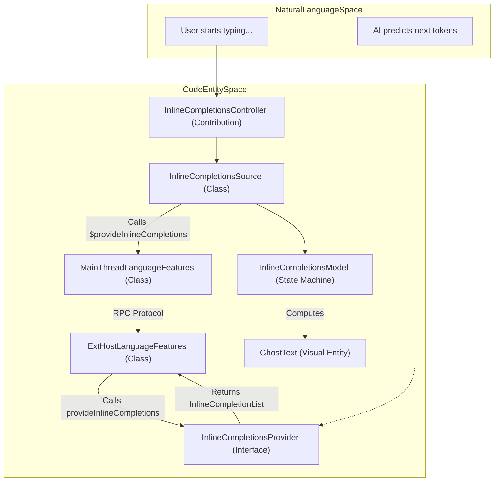
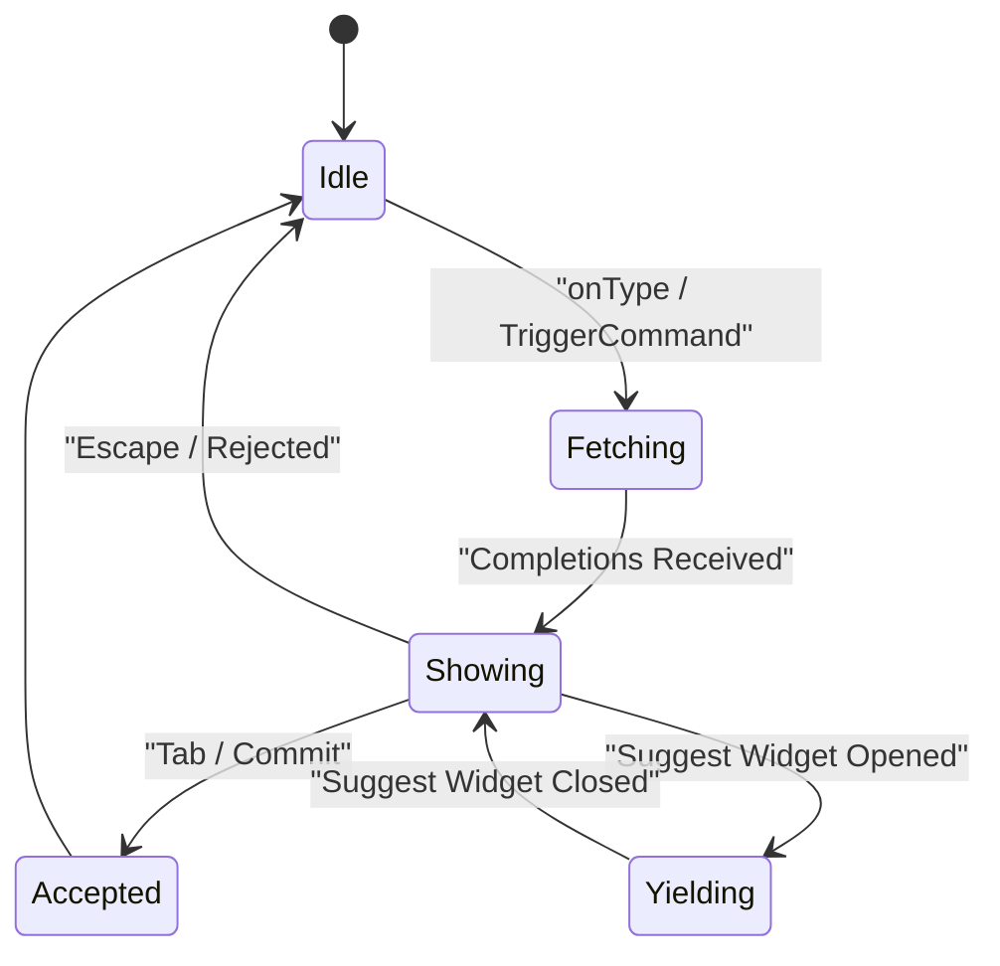
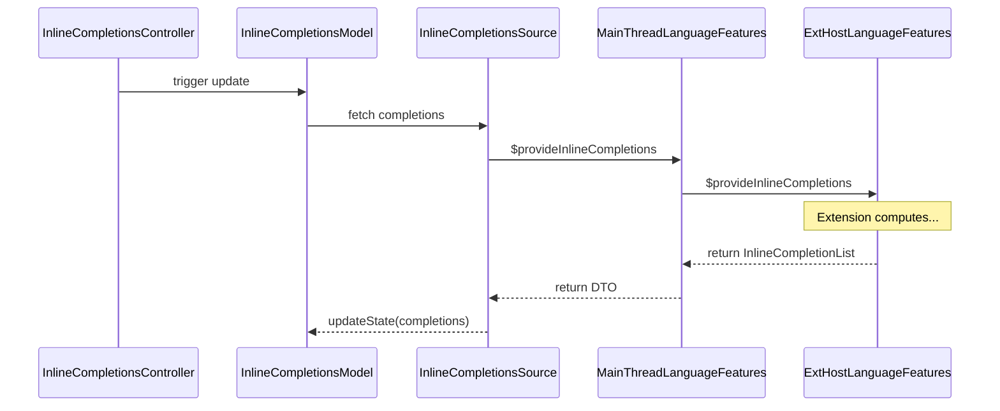

# Inline Completions and Ghost Text

Relevant source files

The following files were used as context for generating this wiki page:

- [extensions/vscode-api-tests/package.json](https://github.com/microsoft/vscode/blob/HEAD/extensions/vscode-api-tests/package.json)
- [extensions/vscode-api-tests/src/singlefolder-tests/chat.test.ts](https://github.com/microsoft/vscode/blob/HEAD/extensions/vscode-api-tests/src/singlefolder-tests/chat.test.ts)
- [extensions/vscode-colorize-tests/src/colorizer.test.ts](https://github.com/microsoft/vscode/blob/HEAD/extensions/vscode-colorize-tests/src/colorizer.test.ts)
- [src/vs/base/common/arrays.ts](https://github.com/microsoft/vscode/blob/HEAD/src/vs/base/common/arrays.ts)
- [src/vs/base/test/common/arrays.test.ts](https://github.com/microsoft/vscode/blob/HEAD/src/vs/base/test/common/arrays.test.ts)
- [src/vs/editor/common/config/editorConfigurationSchema.ts](https://github.com/microsoft/vscode/blob/HEAD/src/vs/editor/common/config/editorConfigurationSchema.ts)
- [src/vs/editor/common/config/editorOptions.ts](https://github.com/microsoft/vscode/blob/HEAD/src/vs/editor/common/config/editorOptions.ts)
- [src/vs/editor/common/languages.ts](https://github.com/microsoft/vscode/blob/HEAD/src/vs/editor/common/languages.ts)
- [src/vs/editor/common/model.ts](https://github.com/microsoft/vscode/blob/HEAD/src/vs/editor/common/model.ts)
- [src/vs/editor/common/model/textModel.ts](https://github.com/microsoft/vscode/blob/HEAD/src/vs/editor/common/model/textModel.ts)
- [src/vs/editor/common/standalone/standaloneEnums.ts](https://github.com/microsoft/vscode/blob/HEAD/src/vs/editor/common/standalone/standaloneEnums.ts)
- [src/vs/editor/common/viewModel/viewModelImpl.ts](https://github.com/microsoft/vscode/blob/HEAD/src/vs/editor/common/viewModel/viewModelImpl.ts)
- [src/vs/editor/contrib/inlineCompletions/browser/controller/commandIds.ts](https://github.com/microsoft/vscode/blob/HEAD/src/vs/editor/contrib/inlineCompletions/browser/controller/commandIds.ts)
- [src/vs/editor/contrib/inlineCompletions/browser/controller/commands.ts](https://github.com/microsoft/vscode/blob/HEAD/src/vs/editor/contrib/inlineCompletions/browser/controller/commands.ts)
- [src/vs/editor/contrib/inlineCompletions/browser/controller/inlineCompletionContextKeys.ts](https://github.com/microsoft/vscode/blob/HEAD/src/vs/editor/contrib/inlineCompletions/browser/controller/inlineCompletionContextKeys.ts)
- [src/vs/editor/contrib/inlineCompletions/browser/controller/inlineCompletionsController.ts](https://github.com/microsoft/vscode/blob/HEAD/src/vs/editor/contrib/inlineCompletions/browser/controller/inlineCompletionsController.ts)
- [src/vs/editor/contrib/inlineCompletions/browser/inlineCompletions.contribution.ts](https://github.com/microsoft/vscode/blob/HEAD/src/vs/editor/contrib/inlineCompletions/browser/inlineCompletions.contribution.ts)
- [src/vs/editor/contrib/inlineCompletions/browser/model/inlineCompletionsModel.ts](https://github.com/microsoft/vscode/blob/HEAD/src/vs/editor/contrib/inlineCompletions/browser/model/inlineCompletionsModel.ts)
- [src/vs/editor/contrib/inlineCompletions/browser/model/inlineCompletionsSource.ts](https://github.com/microsoft/vscode/blob/HEAD/src/vs/editor/contrib/inlineCompletions/browser/model/inlineCompletionsSource.ts)
- [src/vs/editor/contrib/inlineCompletions/browser/model/inlineSuggestionItem.ts](https://github.com/microsoft/vscode/blob/HEAD/src/vs/editor/contrib/inlineCompletions/browser/model/inlineSuggestionItem.ts)
- [src/vs/editor/contrib/inlineCompletions/browser/model/provideInlineCompletions.ts](https://github.com/microsoft/vscode/blob/HEAD/src/vs/editor/contrib/inlineCompletions/browser/model/provideInlineCompletions.ts)
- [src/vs/editor/contrib/inlineCompletions/browser/telemetry.ts](https://github.com/microsoft/vscode/blob/HEAD/src/vs/editor/contrib/inlineCompletions/browser/telemetry.ts)
- [src/vs/editor/contrib/inlineCompletions/browser/view/inlineEdits/inlineEditWithChanges.ts](https://github.com/microsoft/vscode/blob/HEAD/src/vs/editor/contrib/inlineCompletions/browser/view/inlineEdits/inlineEditWithChanges.ts)
- [src/vs/editor/contrib/inlineCompletions/browser/view/inlineEdits/inlineEditsModel.ts](https://github.com/microsoft/vscode/blob/HEAD/src/vs/editor/contrib/inlineCompletions/browser/view/inlineEdits/inlineEditsModel.ts)
- [src/vs/editor/contrib/inlineCompletions/browser/view/inlineEdits/inlineEditsView.ts](https://github.com/microsoft/vscode/blob/HEAD/src/vs/editor/contrib/inlineCompletions/browser/view/inlineEdits/inlineEditsView.ts)
- [src/vs/editor/contrib/inlineCompletions/browser/view/inlineEdits/inlineEditsViewInterface.ts](https://github.com/microsoft/vscode/blob/HEAD/src/vs/editor/contrib/inlineCompletions/browser/view/inlineEdits/inlineEditsViewInterface.ts)
- [src/vs/editor/contrib/inlineCompletions/browser/view/inlineEdits/inlineEditsViewProducer.ts](https://github.com/microsoft/vscode/blob/HEAD/src/vs/editor/contrib/inlineCompletions/browser/view/inlineEdits/inlineEditsViewProducer.ts)
- [src/vs/monaco.d.ts](https://github.com/microsoft/vscode/blob/HEAD/src/vs/monaco.d.ts)
- [src/vs/platform/extensions/common/extensionsApiProposals.ts](https://github.com/microsoft/vscode/blob/HEAD/src/vs/platform/extensions/common/extensionsApiProposals.ts)
- [src/vs/workbench/api/browser/mainThreadChatAgents2.ts](https://github.com/microsoft/vscode/blob/HEAD/src/vs/workbench/api/browser/mainThreadChatAgents2.ts)
- [src/vs/workbench/api/browser/mainThreadLanguageFeatures.ts](https://github.com/microsoft/vscode/blob/HEAD/src/vs/workbench/api/browser/mainThreadLanguageFeatures.ts)
- [src/vs/workbench/api/common/extHost.api.impl.ts](https://github.com/microsoft/vscode/blob/HEAD/src/vs/workbench/api/common/extHost.api.impl.ts)
- [src/vs/workbench/api/common/extHost.protocol.ts](https://github.com/microsoft/vscode/blob/HEAD/src/vs/workbench/api/common/extHost.protocol.ts)
- [src/vs/workbench/api/common/extHostChatAgents2.ts](https://github.com/microsoft/vscode/blob/HEAD/src/vs/workbench/api/common/extHostChatAgents2.ts)
- [src/vs/workbench/api/common/extHostLanguageFeatures.ts](https://github.com/microsoft/vscode/blob/HEAD/src/vs/workbench/api/common/extHostLanguageFeatures.ts)
- [src/vs/workbench/api/common/extHostTypeConverters.ts](https://github.com/microsoft/vscode/blob/HEAD/src/vs/workbench/api/common/extHostTypeConverters.ts)
- [src/vs/workbench/api/common/extHostTypes.ts](https://github.com/microsoft/vscode/blob/HEAD/src/vs/workbench/api/common/extHostTypes.ts)
- [src/vscode-dts/vscode.d.ts](https://github.com/microsoft/vscode/blob/HEAD/src/vscode-dts/vscode.d.ts)
- [src/vscode-dts/vscode.proposed.chatParticipantAdditions.d.ts](https://github.com/microsoft/vscode/blob/HEAD/src/vscode-dts/vscode.proposed.chatParticipantAdditions.d.ts)
- [src/vscode-dts/vscode.proposed.inlineCompletionsAdditions.d.ts](https://github.com/microsoft/vscode/blob/HEAD/src/vscode-dts/vscode.proposed.inlineCompletionsAdditions.d.ts)

The Inline Completions system provides a mechanism for displaying non-intrusive, "ghost text" suggestions directly within the editor viewport. Unlike the standard suggest widget, inline completions are rendered as part of the text flow and can be accepted via the `Tab` key. This system also supports complex "Inline Edits" which can visualize deletions and side-by-side changes, often used in AI-assisted coding scenarios like GitHub Copilot.

## Architecture Overview

The inline completions architecture is built on a reactive model-view-controller pattern using the `vs/base/common/observable.js` framework. It bridges the gap between the Extension Host (where providers like Copilot live) and the Monaco Editor's rendering engine.

### Key Components

*   **`InlineCompletionsController`**: The entry point for the editor contribution. It manages the lifecycle of the model, handles commands (like `editor.action.inlineSuggest.trigger`), and coordinates between user input and the suggestion state [src/vs/editor/contrib/inlineCompletions/browser/controller/inlineCompletionsController.ts:50-100](https://github.com/microsoft/vscode/blob/HEAD/src/vs/editor/contrib/inlineCompletions/browser/controller/inlineCompletionsController.ts#L50-L100).
*   **`InlineCompletionsModel`**: A state machine that tracks the current active inline completion, the cursor position, and the suggest widget's state to determine what ghost text should be rendered [src/vs/editor/contrib/inlineCompletions/browser/model/inlineCompletionsModel.ts:59-114](https://github.com/microsoft/vscode/blob/HEAD/src/vs/editor/contrib/inlineCompletions/browser/model/inlineCompletionsModel.ts#L59-L114).
*   **`InlineCompletionsSource`**: Responsible for fetching completions from registered `InlineCompletionsProvider` instances and managing their lifecycle/disposal via a `CancellationTokenSource` [src/vs/editor/contrib/inlineCompletions/browser/model/inlineCompletionsSource.ts:42-79](https://github.com/microsoft/vscode/blob/HEAD/src/vs/editor/contrib/inlineCompletions/browser/model/inlineCompletionsSource.ts#L42-L79).
*   **`InlineEditsView`**: Handles the actual rendering of complex inline edits in the editor using decorations and content widgets, specifically for multi-line or destructive changes [src/vs/editor/contrib/inlineCompletions/browser/view/inlineEdits/inlineEditsView.ts:49-125](https://github.com/microsoft/vscode/blob/HEAD/src/vs/editor/contrib/inlineCompletions/browser/view/inlineEdits/inlineEditsView.ts#L49-L125).
*   **`IInlineCompletionsUnificationState`**: An interface used to manage the unification of inline completions across different providers, ensuring that multiple AI sources can coexist without visual conflict [src/vs/workbench/api/common/extHostLanguageFeatures.ts:41-41](https://github.com/microsoft/vscode/blob/HEAD/src/vs/workbench/api/common/extHostLanguageFeatures.ts#L41).

### Data Flow: Natural Language to Code Entities

The following diagram maps the logical concepts of "AI suggestions" to the specific classes and interfaces in the VS Code codebase.

**Suggestion Flow Mapping**

Sources: [src/vs/editor/contrib/inlineCompletions/browser/model/inlineCompletionsModel.ts:59-130](https://github.com/microsoft/vscode/blob/HEAD/src/vs/editor/contrib/inlineCompletions/browser/model/inlineCompletionsModel.ts#L59-L130), [src/vs/editor/common/languages.ts:183-217](https://github.com/microsoft/vscode/blob/HEAD/src/vs/editor/common/languages.ts#L183-L217), [src/vs/workbench/api/common/extHostLanguageFeatures.ts:39-42](https://github.com/microsoft/vscode/blob/HEAD/src/vs/workbench/api/common/extHostLanguageFeatures.ts#L39-L42)

## InlineCompletionsModel State Machine

The `InlineCompletionsModel` is the core logic hub. It uses observables to react to:
1.  **Text Model Changes**: Updates in the underlying document via `ITextModel.onDidChangeContent` tracked through the `_versionId` observable [src/vs/editor/contrib/inlineCompletions/browser/model/inlineCompletionsSource.ts:90-90](https://github.com/microsoft/vscode/blob/HEAD/src/vs/editor/contrib/inlineCompletions/browser/model/inlineCompletionsSource.ts#L90).
2.  **Cursor Position**: Where the ghost text should be anchored, exposed via `primaryPosition` [src/vs/editor/contrib/inlineCompletions/browser/model/inlineCompletionsModel.ts:70-70](https://github.com/microsoft/vscode/blob/HEAD/src/vs/editor/contrib/inlineCompletions/browser/model/inlineCompletionsModel.ts#L70).
3.  **Suggest Widget**: Whether a standard completion list is visible, which might "yield" or "augment" the inline completion, monitored via `_selectedSuggestItem` [src/vs/editor/contrib/inlineCompletions/browser/model/inlineCompletionsModel.ts:111-111](https://github.com/microsoft/vscode/blob/HEAD/src/vs/editor/contrib/inlineCompletions/browser/model/inlineCompletionsModel.ts#L111).

### The Yield-To Mechanism
When both the Suggest Widget and Inline Completions are active, the system must decide which to show. The `InlineCompletionsModel` can "yield" to the suggest widget or show a preview of the selected suggest item as ghost text. This is influenced by `InlineCompletionTriggerKind`, which differentiates between automatic (on-type) and explicit (manual) triggers [src/vs/editor/common/languages.ts:26-29](https://github.com/microsoft/vscode/blob/HEAD/src/vs/editor/common/languages.ts#L26-L29).

**State Transition Logic**

Sources: [src/vs/editor/contrib/inlineCompletions/browser/model/inlineCompletionsModel.ts:59-130](https://github.com/microsoft/vscode/blob/HEAD/src/vs/editor/contrib/inlineCompletions/browser/model/inlineCompletionsModel.ts#L59-L130)

## Ghost Text and Inline Edits

The system supports different visual representations depending on the complexity of the suggestion.

### Ghost Text Rendering
Simple completions that append text to the current line or add new lines are rendered as `GhostText`. This is implemented via view decorations that inject "virtual" text into the editor's layout without modifying the underlying `TextModel` until accepted. The logic for computing these decorations is found in the ghost text utilities [src/vs/editor/contrib/inlineCompletions/browser/model/ghostText.ts:38-40](https://github.com/microsoft/vscode/blob/HEAD/src/vs/editor/contrib/inlineCompletions/browser/model/ghostText.ts#L38-L40).

### Inline Edits (Side-by-Side and Deletions)
For complex AI-driven refactorings that involve deleting code or changing multiple lines, the system uses `InlineEditsView`.

*   **Deletion View**: Visualizes removed text using specialized decorations [src/vs/editor/contrib/inlineCompletions/browser/view/inlineEdits/inlineEditsView.ts:96-105](https://github.com/microsoft/vscode/blob/HEAD/src/vs/editor/contrib/inlineCompletions/browser/view/inlineEdits/inlineEditsView.ts#L96-L105).
*   **Side-by-Side View**: Shows the original code and the suggested replacement in a side-by-side diff-like view within the editor [src/vs/editor/contrib/inlineCompletions/browser/view/inlineEdits/inlineEditsView.ts:86-95](https://github.com/microsoft/vscode/blob/HEAD/src/vs/editor/contrib/inlineCompletions/browser/view/inlineEdits/inlineEditsView.ts#L86-L95).
*   **Insertion View**: Handles multi-line insertions [src/vs/editor/contrib/inlineCompletions/browser/view/inlineEdits/inlineEditsView.ts:106-115](https://github.com/microsoft/vscode/blob/HEAD/src/vs/editor/contrib/inlineCompletions/browser/view/inlineEdits/inlineEditsView.ts#L106-L115).

| Feature | Class / Interface | Purpose |
| :--- | :--- | :--- |
| **Ghost Text** | `GhostText` | Renders greyed-out text for simple additions [src/vs/editor/contrib/inlineCompletions/browser/model/ghostText.ts:39-40](https://github.com/microsoft/vscode/blob/HEAD/src/vs/editor/contrib/inlineCompletions/browser/model/ghostText.ts#L39-L40). |
| **Inline Edit** | `InlineEditItem` | Represents a complex edit suggestion [src/vs/editor/contrib/inlineCompletions/browser/model/inlineSuggestionItem.ts:42](https://github.com/microsoft/vscode/blob/HEAD/src/vs/editor/contrib/inlineCompletions/browser/model/inlineSuggestionItem.ts#L42). |
| **Acceptance** | `InlineCompletionsModel.onDidAccept` | Commits the edit to the document model [src/vs/editor/contrib/inlineCompletions/browser/model/inlineCompletionsModel.ts:86-87](https://github.com/microsoft/vscode/blob/HEAD/src/vs/editor/contrib/inlineCompletions/browser/model/inlineCompletionsModel.ts#L86-L87). |
| **Partial Accept** | `PartialAcceptTriggerKind` | Triggers for accepting next word or next line [src/vs/editor/common/languages.ts:29-29](https://github.com/microsoft/vscode/blob/HEAD/src/vs/editor/common/languages.ts#L29). |

Sources: [src/vs/editor/contrib/inlineCompletions/browser/view/inlineEdits/inlineEditsView.ts:49-125](https://github.com/microsoft/vscode/blob/HEAD/src/vs/editor/contrib/inlineCompletions/browser/view/inlineEdits/inlineEditsView.ts#L49-L125), [src/vs/editor/contrib/inlineCompletions/browser/model/inlineSuggestionItem.ts:41-43](https://github.com/microsoft/vscode/blob/HEAD/src/vs/editor/contrib/inlineCompletions/browser/model/inlineSuggestionItem.ts#L41-L43)

## Acceptance Modes

The `InlineCompletionsModel` handles various ways a user can interact with the suggestion:

1.  **Full Acceptance**: Usually bound to `Tab`. Calls the acceptance logic which applies the full edit to the document via `TextModelEditSource` [src/vs/editor/contrib/inlineCompletions/browser/model/inlineCompletionsModel.ts:110-114](https://github.com/microsoft/vscode/blob/HEAD/src/vs/editor/contrib/inlineCompletions/browser/model/inlineCompletionsModel.ts#L110-L114).
2.  **Next Word**: Partially accepts the suggestion up to the next word boundary. The model tracks this state via `_isAcceptingPartially` [src/vs/editor/contrib/inlineCompletions/browser/model/inlineCompletionsModel.ts:75-84](https://github.com/microsoft/vscode/blob/HEAD/src/vs/editor/contrib/inlineCompletions/browser/model/inlineCompletionsModel.ts#L75-L84).
3.  **Next Line**: Partially accepts the suggestion up to the next newline character.

These modes are coordinated by the `PartialAcceptTriggerKind` enum [src/vs/editor/common/languages.ts:29-29](https://github.com/microsoft/vscode/blob/HEAD/src/vs/editor/common/languages.ts#L29).

## Implementation Details: Extension API

Extensions provide these suggestions by registering an `InlineCompletionsProvider`. The communication between the Extension Host and the Main Thread is handled via the RPC protocol.

*   **ExtHost**: `ExtHostLanguageFeatures` registers the provider and handles the `provideInlineCompletions` request, converting types between the VS Code API and the internal protocol [src/vs/workbench/api/common/extHostLanguageFeatures.ts:39-42](https://github.com/microsoft/vscode/blob/HEAD/src/vs/workbench/api/common/extHostLanguageFeatures.ts#L39-L42).
*   **Protocol**: Data is serialized using `IInlineCompletionsUnificationState` and other DTOs like `IdentifiableInlineCompletions` to cross the process boundary [src/vs/workbench/api/common/extHost.protocol.ts:36-37](https://github.com/microsoft/vscode/blob/HEAD/src/vs/workbench/api/common/extHost.protocol.ts#L36-L37).

**Sequence: Fetching Completions**

Sources: [src/vs/workbench/api/common/extHostLanguageFeatures.ts:39-42](https://github.com/microsoft/vscode/blob/HEAD/src/vs/workbench/api/common/extHostLanguageFeatures.ts#L39-L42), [src/vs/editor/contrib/inlineCompletions/browser/model/inlineCompletionsSource.ts:42-79](https://github.com/microsoft/vscode/blob/HEAD/src/vs/editor/contrib/inlineCompletions/browser/model/inlineCompletionsSource.ts#L42-L79), [src/vs/editor/contrib/inlineCompletions/browser/model/inlineCompletionsModel.ts:59-130](https://github.com/microsoft/vscode/blob/HEAD/src/vs/editor/contrib/inlineCompletions/browser/model/inlineCompletionsModel.ts#L59-L130)