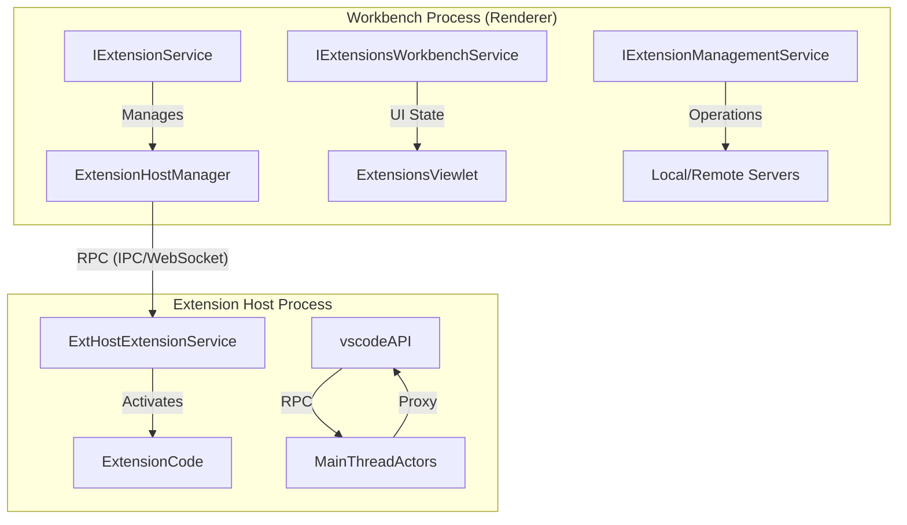
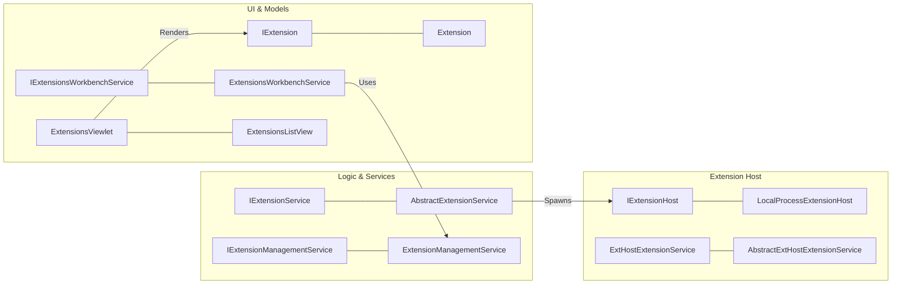
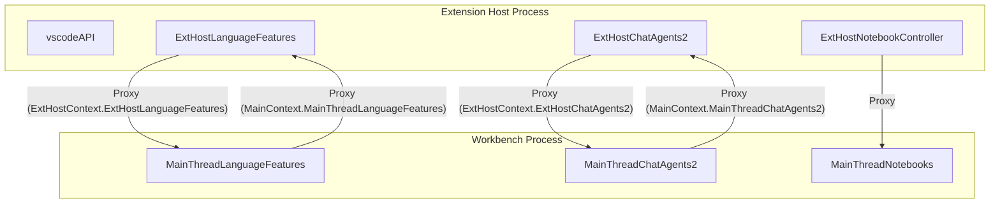

# Extension System

Relevant source files

The following files were used as context for generating this wiki page:

- [extensions/vscode-api-tests/package.json](https://github.com/microsoft/vscode/blob/HEAD/extensions/vscode-api-tests/package.json)
- [extensions/vscode-api-tests/src/singlefolder-tests/chat.test.ts](https://github.com/microsoft/vscode/blob/HEAD/extensions/vscode-api-tests/src/singlefolder-tests/chat.test.ts)
- [extensions/vscode-colorize-tests/src/colorizer.test.ts](https://github.com/microsoft/vscode/blob/HEAD/extensions/vscode-colorize-tests/src/colorizer.test.ts)
- [src/vs/base/common/arrays.ts](https://github.com/microsoft/vscode/blob/HEAD/src/vs/base/common/arrays.ts)
- [src/vs/base/test/common/arrays.test.ts](https://github.com/microsoft/vscode/blob/HEAD/src/vs/base/test/common/arrays.test.ts)
- [src/vs/editor/common/config/editorConfigurationSchema.ts](https://github.com/microsoft/vscode/blob/HEAD/src/vs/editor/common/config/editorConfigurationSchema.ts)
- [src/vs/editor/common/config/editorOptions.ts](https://github.com/microsoft/vscode/blob/HEAD/src/vs/editor/common/config/editorOptions.ts)
- [src/vs/editor/common/languages.ts](https://github.com/microsoft/vscode/blob/HEAD/src/vs/editor/common/languages.ts)
- [src/vs/editor/common/model.ts](https://github.com/microsoft/vscode/blob/HEAD/src/vs/editor/common/model.ts)
- [src/vs/editor/common/model/textModel.ts](https://github.com/microsoft/vscode/blob/HEAD/src/vs/editor/common/model/textModel.ts)
- [src/vs/editor/common/standalone/standaloneEnums.ts](https://github.com/microsoft/vscode/blob/HEAD/src/vs/editor/common/standalone/standaloneEnums.ts)
- [src/vs/editor/common/viewModel/viewModelImpl.ts](https://github.com/microsoft/vscode/blob/HEAD/src/vs/editor/common/viewModel/viewModelImpl.ts)
- [src/vs/editor/contrib/inlineCompletions/browser/controller/commandIds.ts](https://github.com/microsoft/vscode/blob/HEAD/src/vs/editor/contrib/inlineCompletions/browser/controller/commandIds.ts)
- [src/vs/editor/contrib/inlineCompletions/browser/controller/commands.ts](https://github.com/microsoft/vscode/blob/HEAD/src/vs/editor/contrib/inlineCompletions/browser/controller/commands.ts)
- [src/vs/editor/contrib/inlineCompletions/browser/controller/inlineCompletionContextKeys.ts](https://github.com/microsoft/vscode/blob/HEAD/src/vs/editor/contrib/inlineCompletions/browser/controller/inlineCompletionContextKeys.ts)
- [src/vs/editor/contrib/inlineCompletions/browser/controller/inlineCompletionsController.ts](https://github.com/microsoft/vscode/blob/HEAD/src/vs/editor/contrib/inlineCompletions/browser/controller/inlineCompletionsController.ts)
- [src/vs/editor/contrib/inlineCompletions/browser/inlineCompletions.contribution.ts](https://github.com/microsoft/vscode/blob/HEAD/src/vs/editor/contrib/inlineCompletions/browser/inlineCompletions.contribution.ts)
- [src/vs/editor/contrib/inlineCompletions/browser/model/inlineCompletionsModel.ts](https://github.com/microsoft/vscode/blob/HEAD/src/vs/editor/contrib/inlineCompletions/browser/model/inlineCompletionsModel.ts)
- [src/vs/editor/contrib/inlineCompletions/browser/model/inlineCompletionsSource.ts](https://github.com/microsoft/vscode/blob/HEAD/src/vs/editor/contrib/inlineCompletions/browser/model/inlineCompletionsSource.ts)
- [src/vs/editor/contrib/inlineCompletions/browser/model/inlineSuggestionItem.ts](https://github.com/microsoft/vscode/blob/HEAD/src/vs/editor/contrib/inlineCompletions/browser/model/inlineSuggestionItem.ts)
- [src/vs/editor/contrib/inlineCompletions/browser/model/provideInlineCompletions.ts](https://github.com/microsoft/vscode/blob/HEAD/src/vs/editor/contrib/inlineCompletions/browser/model/provideInlineCompletions.ts)
- [src/vs/editor/contrib/inlineCompletions/browser/telemetry.ts](https://github.com/microsoft/vscode/blob/HEAD/src/vs/editor/contrib/inlineCompletions/browser/telemetry.ts)
- [src/vs/editor/contrib/inlineCompletions/browser/view/inlineEdits/inlineEditWithChanges.ts](https://github.com/microsoft/vscode/blob/HEAD/src/vs/editor/contrib/inlineCompletions/browser/view/inlineEdits/inlineEditWithChanges.ts)
- [src/vs/editor/contrib/inlineCompletions/browser/view/inlineEdits/inlineEditsModel.ts](https://github.com/microsoft/vscode/blob/HEAD/src/vs/editor/contrib/inlineCompletions/browser/view/inlineEdits/inlineEditsModel.ts)
- [src/vs/editor/contrib/inlineCompletions/browser/view/inlineEdits/inlineEditsView.ts](https://github.com/microsoft/vscode/blob/HEAD/src/vs/editor/contrib/inlineCompletions/browser/view/inlineEdits/inlineEditsView.ts)
- [src/vs/editor/contrib/inlineCompletions/browser/view/inlineEdits/inlineEditsViewInterface.ts](https://github.com/microsoft/vscode/blob/HEAD/src/vs/editor/contrib/inlineCompletions/browser/view/inlineEdits/inlineEditsViewInterface.ts)
- [src/vs/editor/contrib/inlineCompletions/browser/view/inlineEdits/inlineEditsViewProducer.ts](https://github.com/microsoft/vscode/blob/HEAD/src/vs/editor/contrib/inlineCompletions/browser/view/inlineEdits/inlineEditsViewProducer.ts)
- [src/vs/monaco.d.ts](https://github.com/microsoft/vscode/blob/HEAD/src/vs/monaco.d.ts)
- [src/vs/platform/extensionManagement/common/abstractExtensionManagementService.ts](https://github.com/microsoft/vscode/blob/HEAD/src/vs/platform/extensionManagement/common/abstractExtensionManagementService.ts)
- [src/vs/platform/extensionManagement/common/extensionGalleryService.ts](https://github.com/microsoft/vscode/blob/HEAD/src/vs/platform/extensionManagement/common/extensionGalleryService.ts)
- [src/vs/platform/extensionManagement/common/extensionManagement.ts](https://github.com/microsoft/vscode/blob/HEAD/src/vs/platform/extensionManagement/common/extensionManagement.ts)
- [src/vs/platform/extensionManagement/common/extensionManagementIpc.ts](https://github.com/microsoft/vscode/blob/HEAD/src/vs/platform/extensionManagement/common/extensionManagementIpc.ts)
- [src/vs/platform/extensionManagement/common/extensionsProfileScannerService.ts](https://github.com/microsoft/vscode/blob/HEAD/src/vs/platform/extensionManagement/common/extensionsProfileScannerService.ts)
- [src/vs/platform/extensionManagement/common/extensionsScannerService.ts](https://github.com/microsoft/vscode/blob/HEAD/src/vs/platform/extensionManagement/common/extensionsScannerService.ts)
- [src/vs/platform/extensionManagement/node/extensionManagementService.ts](https://github.com/microsoft/vscode/blob/HEAD/src/vs/platform/extensionManagement/node/extensionManagementService.ts)
- [src/vs/platform/extensionManagement/node/extensionsScannerService.ts](https://github.com/microsoft/vscode/blob/HEAD/src/vs/platform/extensionManagement/node/extensionsScannerService.ts)
- [src/vs/platform/extensionManagement/test/common/extensionGalleryService.test.ts](https://github.com/microsoft/vscode/blob/HEAD/src/vs/platform/extensionManagement/test/common/extensionGalleryService.test.ts)
- [src/vs/platform/extensionManagement/test/common/extensionsProfileScannerService.test.ts](https://github.com/microsoft/vscode/blob/HEAD/src/vs/platform/extensionManagement/test/common/extensionsProfileScannerService.test.ts)
- [src/vs/platform/extensionManagement/test/node/extensionsScannerService.test.ts](https://github.com/microsoft/vscode/blob/HEAD/src/vs/platform/extensionManagement/test/node/extensionsScannerService.test.ts)
- [src/vs/platform/extensions/common/extensions.ts](https://github.com/microsoft/vscode/blob/HEAD/src/vs/platform/extensions/common/extensions.ts)
- [src/vs/platform/extensions/common/extensionsApiProposals.ts](https://github.com/microsoft/vscode/blob/HEAD/src/vs/platform/extensions/common/extensionsApiProposals.ts)
- [src/vs/platform/externalServices/common/marketplace.ts](https://github.com/microsoft/vscode/blob/HEAD/src/vs/platform/externalServices/common/marketplace.ts)
- [src/vs/platform/externalServices/common/serviceMachineId.ts](https://github.com/microsoft/vscode/blob/HEAD/src/vs/platform/externalServices/common/serviceMachineId.ts)
- [src/vs/platform/workspace/common/workspaceTrust.ts](https://github.com/microsoft/vscode/blob/HEAD/src/vs/platform/workspace/common/workspaceTrust.ts)
- [src/vs/server/node/extensionsScannerService.ts](https://github.com/microsoft/vscode/blob/HEAD/src/vs/server/node/extensionsScannerService.ts)
- [src/vs/workbench/api/browser/mainThreadChatAgents2.ts](https://github.com/microsoft/vscode/blob/HEAD/src/vs/workbench/api/browser/mainThreadChatAgents2.ts)
- [src/vs/workbench/api/browser/mainThreadExtensionService.ts](https://github.com/microsoft/vscode/blob/HEAD/src/vs/workbench/api/browser/mainThreadExtensionService.ts)
- [src/vs/workbench/api/browser/mainThreadLanguageFeatures.ts](https://github.com/microsoft/vscode/blob/HEAD/src/vs/workbench/api/browser/mainThreadLanguageFeatures.ts)
- [src/vs/workbench/api/browser/mainThreadWorkspace.ts](https://github.com/microsoft/vscode/blob/HEAD/src/vs/workbench/api/browser/mainThreadWorkspace.ts)
- [src/vs/workbench/api/common/extHost.api.impl.ts](https://github.com/microsoft/vscode/blob/HEAD/src/vs/workbench/api/common/extHost.api.impl.ts)
- [src/vs/workbench/api/common/extHost.protocol.ts](https://github.com/microsoft/vscode/blob/HEAD/src/vs/workbench/api/common/extHost.protocol.ts)
- [src/vs/workbench/api/common/extHostChatAgents2.ts](https://github.com/microsoft/vscode/blob/HEAD/src/vs/workbench/api/common/extHostChatAgents2.ts)
- [src/vs/workbench/api/common/extHostExtensionService.ts](https://github.com/microsoft/vscode/blob/HEAD/src/vs/workbench/api/common/extHostExtensionService.ts)
- [src/vs/workbench/api/common/extHostLanguageFeatures.ts](https://github.com/microsoft/vscode/blob/HEAD/src/vs/workbench/api/common/extHostLanguageFeatures.ts)
- [src/vs/workbench/api/common/extHostTypeConverters.ts](https://github.com/microsoft/vscode/blob/HEAD/src/vs/workbench/api/common/extHostTypeConverters.ts)
- [src/vs/workbench/api/common/extHostTypes.ts](https://github.com/microsoft/vscode/blob/HEAD/src/vs/workbench/api/common/extHostTypes.ts)
- [src/vs/workbench/api/common/extHostWorkspace.ts](https://github.com/microsoft/vscode/blob/HEAD/src/vs/workbench/api/common/extHostWorkspace.ts)
- [src/vs/workbench/api/test/browser/extHostWorkspace.test.ts](https://github.com/microsoft/vscode/blob/HEAD/src/vs/workbench/api/test/browser/extHostWorkspace.test.ts)
- [src/vs/workbench/api/test/browser/mainThreadWorkspace.test.ts](https://github.com/microsoft/vscode/blob/HEAD/src/vs/workbench/api/test/browser/mainThreadWorkspace.test.ts)
- [src/vs/workbench/contrib/extensions/browser/extensionEditor.ts](https://github.com/microsoft/vscode/blob/HEAD/src/vs/workbench/contrib/extensions/browser/extensionEditor.ts)
- [src/vs/workbench/contrib/extensions/browser/extensions.contribution.ts](https://github.com/microsoft/vscode/blob/HEAD/src/vs/workbench/contrib/extensions/browser/extensions.contribution.ts)
- [src/vs/workbench/contrib/extensions/browser/extensionsActions.ts](https://github.com/microsoft/vscode/blob/HEAD/src/vs/workbench/contrib/extensions/browser/extensionsActions.ts)
- [src/vs/workbench/contrib/extensions/browser/extensionsIcons.ts](https://github.com/microsoft/vscode/blob/HEAD/src/vs/workbench/contrib/extensions/browser/extensionsIcons.ts)
- [src/vs/workbench/contrib/extensions/browser/extensionsList.ts](https://github.com/microsoft/vscode/blob/HEAD/src/vs/workbench/contrib/extensions/browser/extensionsList.ts)
- [src/vs/workbench/contrib/extensions/browser/extensionsViewer.ts](https://github.com/microsoft/vscode/blob/HEAD/src/vs/workbench/contrib/extensions/browser/extensionsViewer.ts)
- [src/vs/workbench/contrib/extensions/browser/extensionsViewlet.ts](https://github.com/microsoft/vscode/blob/HEAD/src/vs/workbench/contrib/extensions/browser/extensionsViewlet.ts)
- [src/vs/workbench/contrib/extensions/browser/extensionsViews.ts](https://github.com/microsoft/vscode/blob/HEAD/src/vs/workbench/contrib/extensions/browser/extensionsViews.ts)
- [src/vs/workbench/contrib/extensions/browser/extensionsWidgets.ts](https://github.com/microsoft/vscode/blob/HEAD/src/vs/workbench/contrib/extensions/browser/extensionsWidgets.ts)
- [src/vs/workbench/contrib/extensions/browser/extensionsWorkbenchService.ts](https://github.com/microsoft/vscode/blob/HEAD/src/vs/workbench/contrib/extensions/browser/extensionsWorkbenchService.ts)
- [src/vs/workbench/contrib/extensions/browser/media/extension.css](https://github.com/microsoft/vscode/blob/HEAD/src/vs/workbench/contrib/extensions/browser/media/extension.css)
- [src/vs/workbench/contrib/extensions/browser/media/extensionActions.css](https://github.com/microsoft/vscode/blob/HEAD/src/vs/workbench/contrib/extensions/browser/media/extensionActions.css)
- [src/vs/workbench/contrib/extensions/browser/media/extensionEditor.css](https://github.com/microsoft/vscode/blob/HEAD/src/vs/workbench/contrib/extensions/browser/media/extensionEditor.css)
- [src/vs/workbench/contrib/extensions/browser/media/extensionsViewlet.css](https://github.com/microsoft/vscode/blob/HEAD/src/vs/workbench/contrib/extensions/browser/media/extensionsViewlet.css)
- [src/vs/workbench/contrib/extensions/browser/media/extensionsWidgets.css](https://github.com/microsoft/vscode/blob/HEAD/src/vs/workbench/contrib/extensions/browser/media/extensionsWidgets.css)
- [src/vs/workbench/contrib/extensions/common/extensionQuery.ts](https://github.com/microsoft/vscode/blob/HEAD/src/vs/workbench/contrib/extensions/common/extensionQuery.ts)
- [src/vs/workbench/contrib/extensions/common/extensions.ts](https://github.com/microsoft/vscode/blob/HEAD/src/vs/workbench/contrib/extensions/common/extensions.ts)
- [src/vs/workbench/contrib/workspace/browser/workspace.contribution.ts](https://github.com/microsoft/vscode/blob/HEAD/src/vs/workbench/contrib/workspace/browser/workspace.contribution.ts)
- [src/vs/workbench/contrib/workspace/browser/workspaceTrustEditor.ts](https://github.com/microsoft/vscode/blob/HEAD/src/vs/workbench/contrib/workspace/browser/workspaceTrustEditor.ts)
- [src/vs/workbench/services/extensionManagement/browser/builtinExtensionsScannerService.ts](https://github.com/microsoft/vscode/blob/HEAD/src/vs/workbench/services/extensionManagement/browser/builtinExtensionsScannerService.ts)
- [src/vs/workbench/services/extensionManagement/browser/extensionEnablementService.ts](https://github.com/microsoft/vscode/blob/HEAD/src/vs/workbench/services/extensionManagement/browser/extensionEnablementService.ts)
- [src/vs/workbench/services/extensionManagement/browser/webExtensionsScannerService.ts](https://github.com/microsoft/vscode/blob/HEAD/src/vs/workbench/services/extensionManagement/browser/webExtensionsScannerService.ts)
- [src/vs/workbench/services/extensionManagement/common/extensionManagement.ts](https://github.com/microsoft/vscode/blob/HEAD/src/vs/workbench/services/extensionManagement/common/extensionManagement.ts)
- [src/vs/workbench/services/extensionManagement/common/extensionManagementChannelClient.ts](https://github.com/microsoft/vscode/blob/HEAD/src/vs/workbench/services/extensionManagement/common/extensionManagementChannelClient.ts)
- [src/vs/workbench/services/extensionManagement/common/extensionManagementService.ts](https://github.com/microsoft/vscode/blob/HEAD/src/vs/workbench/services/extensionManagement/common/extensionManagementService.ts)
- [src/vs/workbench/services/extensionManagement/common/webExtensionManagementService.ts](https://github.com/microsoft/vscode/blob/HEAD/src/vs/workbench/services/extensionManagement/common/webExtensionManagementService.ts)
- [src/vs/workbench/services/extensionManagement/test/browser/extensionEnablementService.test.ts](https://github.com/microsoft/vscode/blob/HEAD/src/vs/workbench/services/extensionManagement/test/browser/extensionEnablementService.test.ts)
- [src/vs/workbench/services/extensions/browser/extensionService.ts](https://github.com/microsoft/vscode/blob/HEAD/src/vs/workbench/services/extensions/browser/extensionService.ts)
- [src/vs/workbench/services/extensions/browser/webWorkerExtensionHost.ts](https://github.com/microsoft/vscode/blob/HEAD/src/vs/workbench/services/extensions/browser/webWorkerExtensionHost.ts)
- [src/vs/workbench/services/extensions/common/abstractExtensionService.ts](https://github.com/microsoft/vscode/blob/HEAD/src/vs/workbench/services/extensions/common/abstractExtensionService.ts)
- [src/vs/workbench/services/extensions/common/extHostCustomers.ts](https://github.com/microsoft/vscode/blob/HEAD/src/vs/workbench/services/extensions/common/extHostCustomers.ts)
- [src/vs/workbench/services/extensions/common/extensionHostManager.ts](https://github.com/microsoft/vscode/blob/HEAD/src/vs/workbench/services/extensions/common/extensionHostManager.ts)
- [src/vs/workbench/services/extensions/common/extensionHostManagers.ts](https://github.com/microsoft/vscode/blob/HEAD/src/vs/workbench/services/extensions/common/extensionHostManagers.ts)
- [src/vs/workbench/services/extensions/common/extensionHostProtocol.ts](https://github.com/microsoft/vscode/blob/HEAD/src/vs/workbench/services/extensions/common/extensionHostProtocol.ts)
- [src/vs/workbench/services/extensions/common/extensionHostProxy.ts](https://github.com/microsoft/vscode/blob/HEAD/src/vs/workbench/services/extensions/common/extensionHostProxy.ts)
- [src/vs/workbench/services/extensions/common/extensionManifestPropertiesService.ts](https://github.com/microsoft/vscode/blob/HEAD/src/vs/workbench/services/extensions/common/extensionManifestPropertiesService.ts)
- [src/vs/workbench/services/extensions/common/extensions.ts](https://github.com/microsoft/vscode/blob/HEAD/src/vs/workbench/services/extensions/common/extensions.ts)
- [src/vs/workbench/services/extensions/common/lazyCreateExtensionHostManager.ts](https://github.com/microsoft/vscode/blob/HEAD/src/vs/workbench/services/extensions/common/lazyCreateExtensionHostManager.ts)
- [src/vs/workbench/services/extensions/common/remoteExtensionHost.ts](https://github.com/microsoft/vscode/blob/HEAD/src/vs/workbench/services/extensions/common/remoteExtensionHost.ts)
- [src/vs/workbench/services/extensions/electron-browser/localProcessExtensionHost.ts](https://github.com/microsoft/vscode/blob/HEAD/src/vs/workbench/services/extensions/electron-browser/localProcessExtensionHost.ts)
- [src/vs/workbench/services/extensions/test/browser/extensionService.test.ts](https://github.com/microsoft/vscode/blob/HEAD/src/vs/workbench/services/extensions/test/browser/extensionService.test.ts)
- [src/vs/workbench/services/extensions/test/common/extensionManifestPropertiesService.test.ts](https://github.com/microsoft/vscode/blob/HEAD/src/vs/workbench/services/extensions/test/common/extensionManifestPropertiesService.test.ts)
- [src/vs/workbench/services/workspaces/common/workspaceTrust.ts](https://github.com/microsoft/vscode/blob/HEAD/src/vs/workbench/services/workspaces/common/workspaceTrust.ts)
- [src/vs/workbench/services/workspaces/test/common/workspaceTrust.test.ts](https://github.com/microsoft/vscode/blob/HEAD/src/vs/workbench/services/workspaces/test/common/workspaceTrust.test.ts)
- [src/vscode-dts/vscode.d.ts](https://github.com/microsoft/vscode/blob/HEAD/src/vscode-dts/vscode.d.ts)
- [src/vscode-dts/vscode.proposed.chatParticipantAdditions.d.ts](https://github.com/microsoft/vscode/blob/HEAD/src/vscode-dts/vscode.proposed.chatParticipantAdditions.d.ts)
- [src/vscode-dts/vscode.proposed.fileSearchProvider2.d.ts](https://github.com/microsoft/vscode/blob/HEAD/src/vscode-dts/vscode.proposed.fileSearchProvider2.d.ts)
- [src/vscode-dts/vscode.proposed.findFiles2.d.ts](https://github.com/microsoft/vscode/blob/HEAD/src/vscode-dts/vscode.proposed.findFiles2.d.ts)
- [src/vscode-dts/vscode.proposed.findTextInFiles2.d.ts](https://github.com/microsoft/vscode/blob/HEAD/src/vscode-dts/vscode.proposed.findTextInFiles2.d.ts)
- [src/vscode-dts/vscode.proposed.inlineCompletionsAdditions.d.ts](https://github.com/microsoft/vscode/blob/HEAD/src/vscode-dts/vscode.proposed.inlineCompletionsAdditions.d.ts)
- [src/vscode-dts/vscode.proposed.textSearchProvider2.d.ts](https://github.com/microsoft/vscode/blob/HEAD/src/vscode-dts/vscode.proposed.textSearchProvider2.d.ts)

The VS Code Extension System is the foundation for the editor's extensibility, allowing third-party developers to add features ranging from language support and debugging to UI enhancements and AI capabilities. It is designed to be robust and secure by running extensions in a dedicated process, the **Extension Host**, ensuring that extension code cannot block the main UI thread or crash the workbench.

## Architectural Overview

The extension system follows a multi-process architecture where the **Workbench** (Renderer Process) communicates with one or more **Extension Hosts** via an asynchronous RPC protocol defined in `extHost.protocol.ts` [src/vs/workbench/api/common/extHost.protocol.ts:1-50](https://github.com/microsoft/vscode/blob/HEAD/src/vs/workbench/api/common/extHost.protocol.ts#L1-L50).

### High-Level Interaction

The workbench manages the lifecycle of extensions through the `IExtensionService` [src/vs/workbench/services/extensions/common/extensions.ts:57](https://github.com/microsoft/vscode/blob/HEAD/src/vs/workbench/services/extensions/common/extensions.ts#L57) and handles user-facing operations (installing, updating, searching) via the `IExtensionManagementService` [src/vs/platform/extensionManagement/common/extensionManagement.ts:28](https://github.com/microsoft/vscode/blob/HEAD/src/vs/platform/extensionManagement/common/extensionManagement.ts#L28).

Title: Extension System Component Interaction

Sources: [src/vs/workbench/services/extensions/common/abstractExtensionService.ts:60-88](https://github.com/microsoft/vscode/blob/HEAD/src/vs/workbench/services/extensions/common/abstractExtensionService.ts#L60-L88), [src/vs/workbench/api/common/extHostExtensionService.ts:65-100](https://github.com/microsoft/vscode/blob/HEAD/src/vs/workbench/api/common/extHostExtensionService.ts#L65-L100), [src/vs/workbench/api/common/extHost.protocol.ts:1-100](https://github.com/microsoft/vscode/blob/HEAD/src/vs/workbench/api/common/extHost.protocol.ts#L1-L100)

---

## Core Subsystems

### 1. Extension Host Architecture
The **Extension Host** is the isolated environment where extension code executes. VS Code supports several types of extension hosts:
*   **Local Process**: A Node.js process for desktop extensions [src/vs/workbench/services/extensions/electron-browser/localProcessExtensionHost.ts:1-50](https://github.com/microsoft/vscode/blob/HEAD/src/vs/workbench/services/extensions/electron-browser/localProcessExtensionHost.ts#L1-L50).
*   **Web Worker**: A browser-based worker for web-compatible extensions [src/vs/workbench/services/extensions/browser/webWorkerExtensionHost.ts:1-50](https://github.com/microsoft/vscode/blob/HEAD/src/vs/workbench/services/extensions/browser/webWorkerExtensionHost.ts#L1-L50).
*   **Remote**: A process running on a remote machine (via SSH, Containers, or WSL).

The `AbstractExtensionService` coordinates these hosts [src/vs/workbench/services/extensions/common/abstractExtensionService.ts:60](https://github.com/microsoft/vscode/blob/HEAD/src/vs/workbench/services/extensions/common/abstractExtensionService.ts#L60), while the host-side logic is driven by `ExtHostExtensionService` [src/vs/workbench/api/common/extHostExtensionService.ts:65](https://github.com/microsoft/vscode/blob/HEAD/src/vs/workbench/api/common/extHostExtensionService.ts#L65).

For details, see [Extension Host Architecture](#5.1).

### 2. VS Code Extension API
Extensions interact with the workbench through the `vscode` namespace [src/vscode-dts/vscode.d.ts:6](https://github.com/microsoft/vscode/blob/HEAD/src/vscode-dts/vscode.d.ts#L6). This API is a proxy layer. When an extension calls an API like `vscode.languages.registerCompletionItemProvider`, it communicates with a `MainThreadLanguageFeatures` actor in the workbench process [src/vs/workbench/api/browser/mainThreadLanguageFeatures.ts:1-50](https://github.com/microsoft/vscode/blob/HEAD/src/vs/workbench/api/browser/mainThreadLanguageFeatures.ts#L1-L50).

The mapping between the Extension Host and the Main Thread is defined by `ProxyIdentifier`s [src/vs/workbench/services/extensions/common/proxyIdentifier.ts:31](https://github.com/microsoft/vscode/blob/HEAD/src/vs/workbench/services/extensions/common/proxyIdentifier.ts#L31) and managed by the `RPCProtocol`. Conversion between API types and internal DTOs is handled by `extHostTypeConverters.ts` [src/vs/workbench/api/common/extHostTypeConverters.ts:1-83](https://github.com/microsoft/vscode/blob/HEAD/src/vs/workbench/api/common/extHostTypeConverters.ts#L1-L83).

For details, see [VS Code Extension API](#5.2).

### 3. Extension Marketplace and Management
Extension discovery and installation are handled by specialized management services.
*   `IExtensionGalleryService`: Communicates with the Visual Studio Marketplace to query extensions and download VSIX packages [src/vs/platform/extensionManagement/common/extensionGalleryService.ts:19](https://github.com/microsoft/vscode/blob/HEAD/src/vs/platform/extensionManagement/common/extensionGalleryService.ts#L19).
*   `IExtensionManagementService`: Handles physical installation and scanning [src/vs/platform/extensionManagement/node/extensionManagementService.ts:1-50](https://github.com/microsoft/vscode/blob/HEAD/src/vs/platform/extensionManagement/node/extensionManagementService.ts#L1-L50).
*   `IExtensionsWorkbenchService`: A high-level service that provides the data models (e.g., `IExtension`) used by the **Extensions View** [src/vs/workbench/contrib/extensions/browser/extensionsWorkbenchService.ts:37](https://github.com/microsoft/vscode/blob/HEAD/src/vs/workbench/contrib/extensions/browser/extensionsWorkbenchService.ts#L37).

For details, see [Extension Marketplace and Management](#5.3).

### 4. Webview and Custom Editors
UI-heavy features like Webviews require rendering in the Workbench renderer. These components use an `iframe`-based sandbox to display HTML content while maintaining a secure messaging bridge back to the Extension Host. Custom editors allow extensions to replace the standard text editor with specialized UIs [src/vs/workbench/api/common/extHostCustomEditors.ts:52](https://github.com/microsoft/vscode/blob/HEAD/src/vs/workbench/api/common/extHostCustomEditors.ts#L52).

For details, see [Webview and Custom Editors](#5.4).

---

## Key Code Entities

The following diagrams map natural language concepts to the specific classes and interfaces used in the codebase.

Title: Extension System Entity Mapping

Sources: [src/vs/workbench/services/extensions/common/abstractExtensionService.ts:60-65](https://github.com/microsoft/vscode/blob/HEAD/src/vs/workbench/services/extensions/common/abstractExtensionService.ts#L60-L65), [src/vs/workbench/api/common/extHostExtensionService.ts:65-100](https://github.com/microsoft/vscode/blob/HEAD/src/vs/workbench/api/common/extHostExtensionService.ts#L65-L100), [src/vs/workbench/api/common/extHost.api.impl.ts:65](https://github.com/microsoft/vscode/blob/HEAD/src/vs/workbench/api/common/extHost.api.impl.ts#L65)

Title: Extension API Proxy Mapping

Sources: [src/vs/workbench/api/common/extHost.protocol.ts:33-36](https://github.com/microsoft/vscode/blob/HEAD/src/vs/workbench/api/common/extHost.protocol.ts#L33-L36), [src/vs/workbench/api/common/extHost.api.impl.ts:40-82](https://github.com/microsoft/vscode/blob/HEAD/src/vs/workbench/api/common/extHost.api.impl.ts#L40-L82), [src/vs/workbench/api/common/extHostNotebook.ts:1-50](https://github.com/microsoft/vscode/blob/HEAD/src/vs/workbench/api/common/extHostNotebook.ts#L1-L50)

### Important Interfaces

| Interface | Purpose | Location |
| :--- | :--- | :--- |
| `IExtensionDescription` | The manifest data (`package.json`) of an extension. | [src/vs/platform/extensions/common/extensions.ts:39](https://github.com/microsoft/vscode/blob/HEAD/src/vs/platform/extensions/common/extensions.ts#L39) |
| `IMainContext` | Defines the RPC shape for calls from Ext Host to Main Thread. | [src/vs/workbench/api/common/extHost.protocol.ts:33](https://github.com/microsoft/vscode/blob/HEAD/src/vs/workbench/api/common/extHost.protocol.ts#L33) |
| `IExtHostContext` | Defines the RPC shape for calls from Main Thread to Ext Host. | [src/vs/workbench/api/common/extHost.protocol.ts:33](https://github.com/microsoft/vscode/blob/HEAD/src/vs/workbench/api/common/extHost.protocol.ts#L33) |
| `ProxyIdentifier` | Unique ID for mapping a service across the RPC bridge. | [src/vs/workbench/services/extensions/common/proxyIdentifier.ts:31](https://github.com/microsoft/vscode/blob/HEAD/src/vs/workbench/services/extensions/common/proxyIdentifier.ts#L31) |

---

## Extension Lifecycle

1.  **Discovery**: Scanners find extensions on disk or in the marketplace [src/vs/platform/extensionManagement/node/extensionManagementService.ts:1-50](https://github.com/microsoft/vscode/blob/HEAD/src/vs/platform/extensionManagement/node/extensionManagementService.ts#L1-L50).
2.  **Registration**: `AbstractExtensionService` reads manifests and populates the `ExtensionDescriptionRegistry` [src/vs/workbench/api/common/extHost.api.impl.ts:28](https://github.com/microsoft/vscode/blob/HEAD/src/vs/workbench/api/common/extHost.api.impl.ts#L28).
3.  **Activation**: Extensions are activated lazily based on `activationEvents`. This is managed by `ExtHostExtensionService` [src/vs/workbench/api/common/extHostExtensionService.ts:65](https://github.com/microsoft/vscode/blob/HEAD/src/vs/workbench/api/common/extHostExtensionService.ts#L65).
4.  **Execution**: Extension code runs in the host, making RPC calls to the workbench via `RPCProtocol` proxies [src/vs/workbench/api/common/extHost.protocol.ts:33](https://github.com/microsoft/vscode/blob/HEAD/src/vs/workbench/api/common/extHost.protocol.ts#L33).
5.  **Termination**: When the workbench shuts down, extension host processes are signaled to cleanup [src/vs/workbench/services/extensions/common/abstractExtensionService.ts:82-83](https://github.com/microsoft/vscode/blob/HEAD/src/vs/workbench/services/extensions/common/abstractExtensionService.ts#L82-L83).

Sources: [src/vs/workbench/services/extensions/common/abstractExtensionService.ts](https://github.com/microsoft/vscode/blob/HEAD/src/vs/workbench/services/extensions/common/abstractExtensionService.ts), [src/vs/workbench/api/common/extHostExtensionService.ts](https://github.com/microsoft/vscode/blob/HEAD/src/vs/workbench/api/common/extHostExtensionService.ts), [src/vs/workbench/api/common/extHost.api.impl.ts](https://github.com/microsoft/vscode/blob/HEAD/src/vs/workbench/api/common/extHost.api.impl.ts).