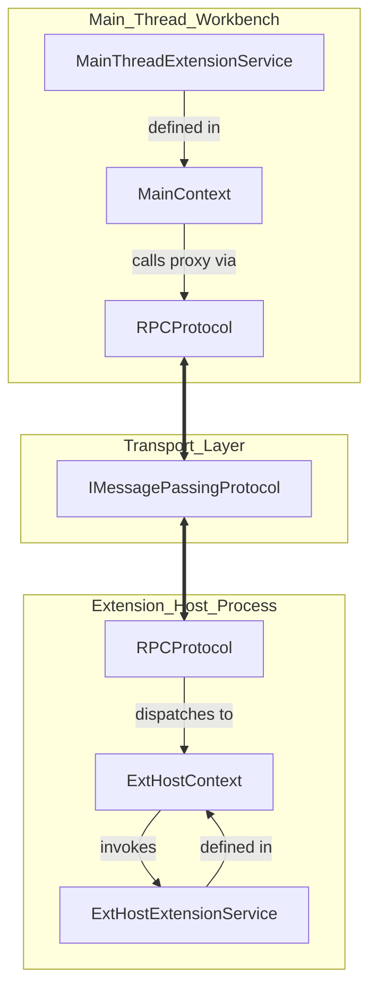
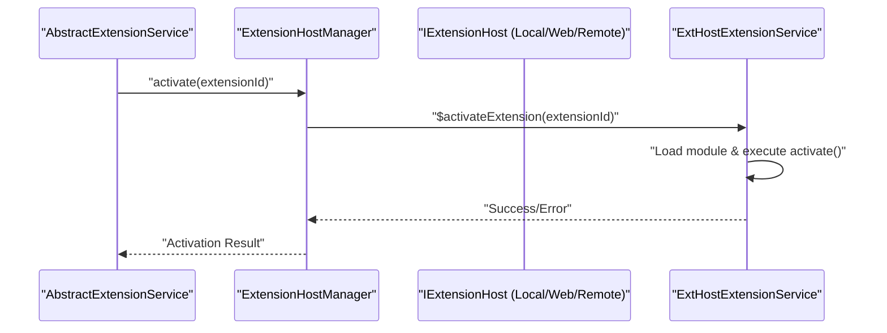
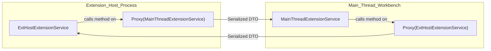

# Extension Host Architecture

Relevant source files

The following files were used as context for generating this wiki page:

- [extensions/vscode-api-tests/package.json](extensions/vscode-api-tests/package.json)
- [extensions/vscode-api-tests/src/singlefolder-tests/chat.test.ts](extensions/vscode-api-tests/src/singlefolder-tests/chat.test.ts)
- [extensions/vscode-colorize-tests/src/colorizer.test.ts](extensions/vscode-colorize-tests/src/colorizer.test.ts)
- [src/vs/base/common/arrays.ts](src/vs/base/common/arrays.ts)
- [src/vs/base/test/common/arrays.test.ts](src/vs/base/test/common/arrays.test.ts)
- [src/vs/editor/common/config/editorConfigurationSchema.ts](src/vs/editor/common/config/editorConfigurationSchema.ts)
- [src/vs/editor/common/config/editorOptions.ts](src/vs/editor/common/config/editorOptions.ts)
- [src/vs/editor/common/languages.ts](src/vs/editor/common/languages.ts)
- [src/vs/editor/common/model.ts](src/vs/editor/common/model.ts)
- [src/vs/editor/common/model/textModel.ts](src/vs/editor/common/model/textModel.ts)
- [src/vs/editor/common/standalone/standaloneEnums.ts](src/vs/editor/common/standalone/standaloneEnums.ts)
- [src/vs/editor/common/viewModel/viewModelImpl.ts](src/vs/editor/common/viewModel/viewModelImpl.ts)
- [src/vs/editor/contrib/inlineCompletions/browser/controller/commandIds.ts](src/vs/editor/contrib/inlineCompletions/browser/controller/commandIds.ts)
- [src/vs/editor/contrib/inlineCompletions/browser/controller/commands.ts](src/vs/editor/contrib/inlineCompletions/browser/controller/commands.ts)
- [src/vs/editor/contrib/inlineCompletions/browser/controller/inlineCompletionContextKeys.ts](src/vs/editor/contrib/inlineCompletions/browser/controller/inlineCompletionContextKeys.ts)
- [src/vs/editor/contrib/inlineCompletions/browser/controller/inlineCompletionsController.ts](src/vs/editor/contrib/inlineCompletions/browser/controller/inlineCompletionsController.ts)
- [src/vs/editor/contrib/inlineCompletions/browser/inlineCompletions.contribution.ts](src/vs/editor/contrib/inlineCompletions/browser/inlineCompletions.contribution.ts)
- [src/vs/editor/contrib/inlineCompletions/browser/model/inlineCompletionsModel.ts](src/vs/editor/contrib/inlineCompletions/browser/model/inlineCompletionsModel.ts)
- [src/vs/editor/contrib/inlineCompletions/browser/model/inlineCompletionsSource.ts](src/vs/editor/contrib/inlineCompletions/browser/model/inlineCompletionsSource.ts)
- [src/vs/editor/contrib/inlineCompletions/browser/model/inlineSuggestionItem.ts](src/vs/editor/contrib/inlineCompletions/browser/model/inlineSuggestionItem.ts)
- [src/vs/editor/contrib/inlineCompletions/browser/model/provideInlineCompletions.ts](src/vs/editor/contrib/inlineCompletions/browser/model/provideInlineCompletions.ts)
- [src/vs/editor/contrib/inlineCompletions/browser/telemetry.ts](src/vs/editor/contrib/inlineCompletions/browser/telemetry.ts)
- [src/vs/editor/contrib/inlineCompletions/browser/view/inlineEdits/inlineEditWithChanges.ts](src/vs/editor/contrib/inlineCompletions/browser/view/inlineEdits/inlineEditWithChanges.ts)
- [src/vs/editor/contrib/inlineCompletions/browser/view/inlineEdits/inlineEditsModel.ts](src/vs/editor/contrib/inlineCompletions/browser/view/inlineEdits/inlineEditsModel.ts)
- [src/vs/editor/contrib/inlineCompletions/browser/view/inlineEdits/inlineEditsView.ts](src/vs/editor/contrib/inlineCompletions/browser/view/inlineEdits/inlineEditsView.ts)
- [src/vs/editor/contrib/inlineCompletions/browser/view/inlineEdits/inlineEditsViewInterface.ts](src/vs/editor/contrib/inlineCompletions/browser/view/inlineEdits/inlineEditsViewInterface.ts)
- [src/vs/editor/contrib/inlineCompletions/browser/view/inlineEdits/inlineEditsViewProducer.ts](src/vs/editor/contrib/inlineCompletions/browser/view/inlineEdits/inlineEditsViewProducer.ts)
- [src/vs/monaco.d.ts](src/vs/monaco.d.ts)
- [src/vs/platform/extensions/common/extensions.ts](src/vs/platform/extensions/common/extensions.ts)
- [src/vs/platform/extensions/common/extensionsApiProposals.ts](src/vs/platform/extensions/common/extensionsApiProposals.ts)
- [src/vs/platform/workspace/common/workspaceTrust.ts](src/vs/platform/workspace/common/workspaceTrust.ts)
- [src/vs/workbench/api/browser/mainThreadChatAgents2.ts](src/vs/workbench/api/browser/mainThreadChatAgents2.ts)
- [src/vs/workbench/api/browser/mainThreadExtensionService.ts](src/vs/workbench/api/browser/mainThreadExtensionService.ts)
- [src/vs/workbench/api/browser/mainThreadLanguageFeatures.ts](src/vs/workbench/api/browser/mainThreadLanguageFeatures.ts)
- [src/vs/workbench/api/browser/mainThreadWorkspace.ts](src/vs/workbench/api/browser/mainThreadWorkspace.ts)
- [src/vs/workbench/api/common/extHost.api.impl.ts](src/vs/workbench/api/common/extHost.api.impl.ts)
- [src/vs/workbench/api/common/extHost.protocol.ts](src/vs/workbench/api/common/extHost.protocol.ts)
- [src/vs/workbench/api/common/extHostChatAgents2.ts](src/vs/workbench/api/common/extHostChatAgents2.ts)
- [src/vs/workbench/api/common/extHostExtensionService.ts](src/vs/workbench/api/common/extHostExtensionService.ts)
- [src/vs/workbench/api/common/extHostLanguageFeatures.ts](src/vs/workbench/api/common/extHostLanguageFeatures.ts)
- [src/vs/workbench/api/common/extHostTypeConverters.ts](src/vs/workbench/api/common/extHostTypeConverters.ts)
- [src/vs/workbench/api/common/extHostTypes.ts](src/vs/workbench/api/common/extHostTypes.ts)
- [src/vs/workbench/api/common/extHostWorkspace.ts](src/vs/workbench/api/common/extHostWorkspace.ts)
- [src/vs/workbench/api/test/browser/extHostWorkspace.test.ts](src/vs/workbench/api/test/browser/extHostWorkspace.test.ts)
- [src/vs/workbench/api/test/browser/mainThreadWorkspace.test.ts](src/vs/workbench/api/test/browser/mainThreadWorkspace.test.ts)
- [src/vs/workbench/contrib/workspace/browser/workspace.contribution.ts](src/vs/workbench/contrib/workspace/browser/workspace.contribution.ts)
- [src/vs/workbench/contrib/workspace/browser/workspaceTrustEditor.ts](src/vs/workbench/contrib/workspace/browser/workspaceTrustEditor.ts)
- [src/vs/workbench/services/extensionManagement/browser/extensionEnablementService.ts](src/vs/workbench/services/extensionManagement/browser/extensionEnablementService.ts)
- [src/vs/workbench/services/extensionManagement/test/browser/extensionEnablementService.test.ts](src/vs/workbench/services/extensionManagement/test/browser/extensionEnablementService.test.ts)
- [src/vs/workbench/services/extensions/browser/extensionService.ts](src/vs/workbench/services/extensions/browser/extensionService.ts)
- [src/vs/workbench/services/extensions/browser/webWorkerExtensionHost.ts](src/vs/workbench/services/extensions/browser/webWorkerExtensionHost.ts)
- [src/vs/workbench/services/extensions/common/abstractExtensionService.ts](src/vs/workbench/services/extensions/common/abstractExtensionService.ts)
- [src/vs/workbench/services/extensions/common/extHostCustomers.ts](src/vs/workbench/services/extensions/common/extHostCustomers.ts)
- [src/vs/workbench/services/extensions/common/extensionHostManager.ts](src/vs/workbench/services/extensions/common/extensionHostManager.ts)
- [src/vs/workbench/services/extensions/common/extensionHostManagers.ts](src/vs/workbench/services/extensions/common/extensionHostManagers.ts)
- [src/vs/workbench/services/extensions/common/extensionHostProtocol.ts](src/vs/workbench/services/extensions/common/extensionHostProtocol.ts)
- [src/vs/workbench/services/extensions/common/extensionHostProxy.ts](src/vs/workbench/services/extensions/common/extensionHostProxy.ts)
- [src/vs/workbench/services/extensions/common/extensionManifestPropertiesService.ts](src/vs/workbench/services/extensions/common/extensionManifestPropertiesService.ts)
- [src/vs/workbench/services/extensions/common/extensions.ts](src/vs/workbench/services/extensions/common/extensions.ts)
- [src/vs/workbench/services/extensions/common/lazyCreateExtensionHostManager.ts](src/vs/workbench/services/extensions/common/lazyCreateExtensionHostManager.ts)
- [src/vs/workbench/services/extensions/common/remoteExtensionHost.ts](src/vs/workbench/services/extensions/common/remoteExtensionHost.ts)
- [src/vs/workbench/services/extensions/electron-browser/localProcessExtensionHost.ts](src/vs/workbench/services/extensions/electron-browser/localProcessExtensionHost.ts)
- [src/vs/workbench/services/extensions/test/browser/extensionService.test.ts](src/vs/workbench/services/extensions/test/browser/extensionService.test.ts)
- [src/vs/workbench/services/extensions/test/common/extensionManifestPropertiesService.test.ts](src/vs/workbench/services/extensions/test/common/extensionManifestPropertiesService.test.ts)
- [src/vs/workbench/services/workspaces/common/workspaceTrust.ts](src/vs/workbench/services/workspaces/common/workspaceTrust.ts)
- [src/vs/workbench/services/workspaces/test/common/workspaceTrust.test.ts](src/vs/workbench/services/workspaces/test/common/workspaceTrust.test.ts)
- [src/vscode-dts/vscode.d.ts](src/vscode-dts/vscode.d.ts)
- [src/vscode-dts/vscode.proposed.chatParticipantAdditions.d.ts](src/vscode-dts/vscode.proposed.chatParticipantAdditions.d.ts)
- [src/vscode-dts/vscode.proposed.fileSearchProvider2.d.ts](src/vscode-dts/vscode.proposed.fileSearchProvider2.d.ts)
- [src/vscode-dts/vscode.proposed.findFiles2.d.ts](src/vscode-dts/vscode.proposed.findFiles2.d.ts)
- [src/vscode-dts/vscode.proposed.findTextInFiles2.d.ts](src/vscode-dts/vscode.proposed.findTextInFiles2.d.ts)
- [src/vscode-dts/vscode.proposed.inlineCompletionsAdditions.d.ts](src/vscode-dts/vscode.proposed.inlineCompletionsAdditions.d.ts)
- [src/vscode-dts/vscode.proposed.textSearchProvider2.d.ts](src/vscode-dts/vscode.proposed.textSearchProvider2.d.ts)

The Extension Host is a dedicated execution environment designed to run VS Code extensions in isolation from the main workbench UI. This multi-process architecture ensures that computationally expensive extension operations (like heavy language analysis or file system indexing) do not block the UI thread, maintaining a responsive editor experience.

## AbstractExtensionService and Lifecycle

The `AbstractExtensionService` in [src/vs/workbench/services/extensions/common/abstractExtensionService.ts:60-60]() is the core orchestrator for managing extension lifecycles. It coordinates scanning, activation, and communication with various extension host types.

### Extension Host Types
VS Code supports three primary extension host environments, determined by the `ExtensionHostKind` [src/vs/workbench/services/extensions/common/extensionHostKind.ts:10-14]():

| Type | Class | Implementation Detail |
| :--- | :--- | :--- |
| **Local Process** | `NativeLocalProcessExtensionHost` | A separate Node.js process spawned via Electron's utility process. [src/vs/workbench/services/extensions/electron-browser/localProcessExtensionHost.ts:96-96]() |
| **Web Worker** | `WebWorkerExtensionHost` | Runs in a browser Web Worker inside a sandboxed `iframe`. [src/vs/workbench/services/extensions/browser/webWorkerExtensionHost.ts:47-47]() |
| **Remote** | `RemoteExtensionHost` | Runs on a remote machine via the Remote Extension Host (REH) agent. [src/vs/workbench/services/extensions/common/remoteExtensionHost.ts:48-48]() |

### Activation and Scanning
The service uses a `LockableExtensionDescriptionRegistry` [src/vs/workbench/services/extensions/common/abstractExtensionService.ts:86-86]() to manage the set of known extensions. Activation is triggered by events (e.g., `onLanguage:python`, `onCommand:abc`) which are tracked by the `_allRequestedActivateEvents` set [src/vs/workbench/services/extensions/common/abstractExtensionService.ts:89-89]().

Scanning is handled by platform-specific implementations. For instance, `ExtensionService` in the browser calls `_scanWebExtensions` [src/vs/workbench/services/extensions/browser/extensionService.ts:75-75]() via the `IWebExtensionsScannerService` [src/vs/workbench/services/extensions/browser/extensionService.ts:60-60]().

Sources: [src/vs/workbench/services/extensions/common/abstractExtensionService.ts:60-105](), [src/vs/workbench/services/extensions/electron-browser/localProcessExtensionHost.ts:96-103](), [src/vs/workbench/services/extensions/browser/webWorkerExtensionHost.ts:47-54](), [src/vs/workbench/services/extensions/common/extensionHostKind.ts:10-14](), [src/vs/workbench/services/extensions/browser/extensionService.ts:46-105]()

## RPC Protocol and Communication

Communication between the **Main Thread** (Workbench) and the **Extension Host** occurs over an asynchronous RPC protocol managed by the `RPCProtocol` class.

### Proxy Identifiers and Actors
The boundary is crossed using `ProxyIdentifier` [src/vs/workbench/services/extensions/common/proxyIdentifier.ts:31-31](). These identifiers map a service interface to a concrete implementation on the opposite side of the process boundary.

*   **MainContext**: Identifiers for services living in the Main Thread (e.g., `MainThreadLanguageFeatures`). [src/vs/workbench/api/common/extHost.protocol.ts:577-577]()
*   **ExtHostContext**: Identifiers for services living in the Extension Host (e.g., `ExtHostExtensionService`). [src/vs/workbench/api/common/extHost.protocol.ts:517-517]()

### RPC Architecture Diagram

Sources: [src/vs/workbench/api/common/extHost.protocol.ts:517-600](), [src/vs/workbench/services/extensions/common/proxyIdentifier.ts:31-40](), [src/vs/workbench/api/browser/mainThreadExtensionService.ts:34-59]()

## ExtHostExtensionService

`AbstractExtHostExtensionService` [src/vs/workbench/api/common/extHostExtensionService.ts:81-81]() is the entry point within the Extension Host. It initializes the environment for extensions and manages their execution.

### Initialization Sequence
1.  **Environment Setup**: Receives `IExtensionHostInitData` [src/vs/workbench/api/common/extHost.protocol.ts:71-71]() containing workspace info, configuration, and logs.
2.  **API Injection**: The service provides access to core services like `IExtHostRpcService` [src/vs/workbench/api/common/extHostExtensionService.ts:92-92]() and `IExtHostWorkspace` [src/vs/workbench/api/common/extHostExtensionService.ts:94-94]().
3.  **Extension Loading**: The service manages the actual loading and activation of extension modules, handling `ActivatedExtension` objects and tracking activation times.

Sources: [src/vs/workbench/api/common/extHostExtensionService.ts:81-150](), [src/vs/workbench/api/common/extHost.protocol.ts:71-100](), [src/vs/workbench/api/common/extHost.api.impl.ts:65-105]()

## Extension Host Manager

The `ExtensionHostManager` [src/vs/workbench/services/extensions/common/extensionHostManager.ts:58-58]() acts as a supervisor on the workbench side. It handles the low-level details of process spawning and connection establishment.

### Process Management
The manager wraps an `IExtensionHost` instance [src/vs/workbench/services/extensions/common/extensionHostManager.ts:72-72](). It initiates the connection by calling `_extensionHost.start()` [src/vs/workbench/services/extensions/common/extensionHostManager.ts:117-117](), which returns an `IMessagePassingProtocol`.

### Data Flow: Extension Activation

Sources: [src/vs/workbench/services/extensions/common/extensionHostManager.ts:58-130](), [src/vs/workbench/api/common/extHostExtensionService.ts:81-150](), [src/vs/workbench/services/extensions/common/extensions.ts:125-143]()

## Data Transformation (DTOs)

Because the RPC boundary only supports JSON-serializable data, VS Code uses a strict Data Transfer Object (DTO) pattern.

*   **UriDto<T>**: A utility type [src/vs/base/common/uri.ts:18-18]() that ensures URIs within a type are converted to their component form (`UriComponents`).
*   **Dto<T>**: A utility type used to ensure that only serializable versions of types are passed through the RPC proxies [src/vs/workbench/services/extensions/common/proxyIdentifier.ts:69-69]().
*   **revive()**: A utility used extensively in the extension host to convert `UriComponents` back into `URI` instances after crossing the RPC boundary [src/vs/workbench/api/common/extHostChatAgents2.ts:14-14]().

### Proxy Data Flow

Sources: [src/vs/workbench/api/common/extHostExtensionService.ts:101-103](), [src/vs/workbench/api/browser/mainThreadExtensionService.ts:34-60](), [src/vs/workbench/services/extensions/common/proxyIdentifier.ts:69-69](), [src/vs/workbench/api/common/extHostTypeConverters.ts:70-75]()

## Workspace Trust and Security

The extension host architecture integrates with VS Code's workspace trust model to restrict extension capabilities in untrusted environments.

*   **WorkspaceTrustEnablementService**: Determines if trust checks are enabled based on configuration `security.workspace.trust.enabled` [src/vs/workbench/services/workspaces/common/workspaceTrust.ts:86-86]().
*   **ExtensionEnablementService**: Evaluates whether an extension should be enabled based on the current trust state [src/vs/workbench/services/extensionManagement/browser/extensionEnablementService.ts:85-88]().
*   **WorkspaceTrustContextKeys**: Binds the trust state to context keys like `WorkspaceTrustContext.IsTrusted` for use in UI contributions [src/vs/workbench/contrib/workspace/browser/workspace.contribution.ts:87-88]().

Sources: [src/vs/workbench/services/workspaces/common/workspaceTrust.ts:70-88](), [src/vs/workbench/services/extensionManagement/browser/extensionEnablementService.ts:47-92](), [src/vs/workbench/contrib/workspace/browser/workspace.contribution.ts:72-92]()

Sources:
- [src/vs/workbench/services/extensions/common/abstractExtensionService.ts:60-100]()
- [src/vs/workbench/api/common/extHostExtensionService.ts:81-120]()
- [src/vs/workbench/services/extensions/common/extensionHostManager.ts:58-100]()
- [src/vs/workbench/api/common/extHost.protocol.ts:517-577]()
- [src/vs/workbench/services/extensions/common/proxyIdentifier.ts:31-69]()
- [src/vs/workbench/services/extensions/common/extensionHostKind.ts:10-14]()
- [src/vs/workbench/services/workspaces/common/workspaceTrust.ts:30-88]()
- [src/vs/workbench/services/extensionManagement/browser/extensionEnablementService.ts:47-96]()
- [src/vs/workbench/contrib/workspace/browser/workspace.contribution.ts:72-92]()