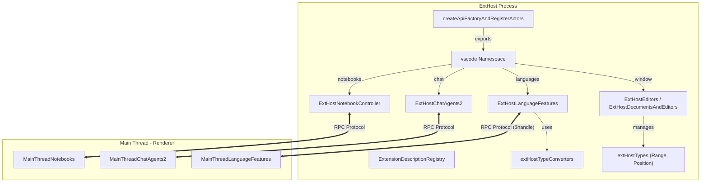
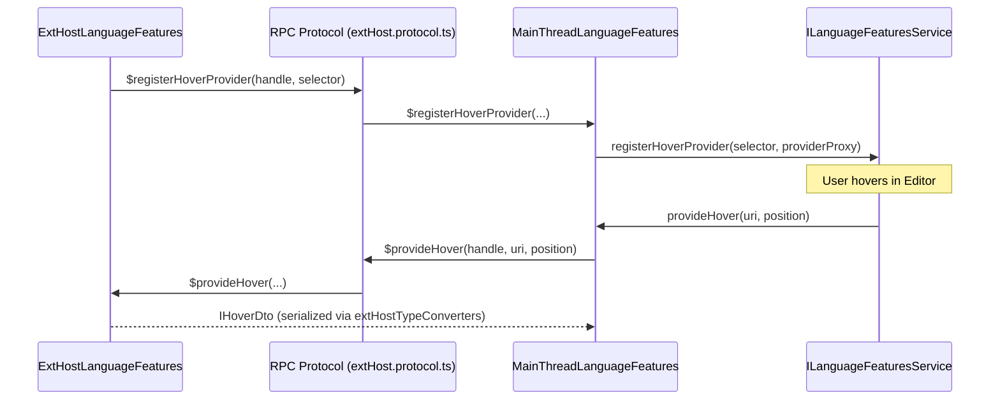
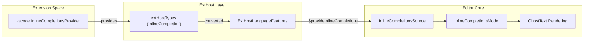

# VS Code Extension API

Relevant source files

The following files were used as context for generating this wiki page:

- [extensions/vscode-api-tests/package.json](extensions/vscode-api-tests/package.json)
- [extensions/vscode-api-tests/src/singlefolder-tests/chat.test.ts](extensions/vscode-api-tests/src/singlefolder-tests/chat.test.ts)
- [extensions/vscode-colorize-tests/src/colorizer.test.ts](extensions/vscode-colorize-tests/src/colorizer.test.ts)
- [src/vs/base/common/arrays.ts](src/vs/base/common/arrays.ts)
- [src/vs/base/test/common/arrays.test.ts](src/vs/base/test/common/arrays.test.ts)
- [src/vs/editor/common/config/editorConfigurationSchema.ts](src/vs/editor/common/config/editorConfigurationSchema.ts)
- [src/vs/editor/common/config/editorOptions.ts](src/vs/editor/common/config/editorOptions.ts)
- [src/vs/editor/common/languages.ts](src/vs/editor/common/languages.ts)
- [src/vs/editor/common/model.ts](src/vs/editor/common/model.ts)
- [src/vs/editor/common/model/textModel.ts](src/vs/editor/common/model/textModel.ts)
- [src/vs/editor/common/standalone/standaloneEnums.ts](src/vs/editor/common/standalone/standaloneEnums.ts)
- [src/vs/editor/common/viewModel/viewModelImpl.ts](src/vs/editor/common/viewModel/viewModelImpl.ts)
- [src/vs/editor/contrib/inlineCompletions/browser/controller/commandIds.ts](src/vs/editor/contrib/inlineCompletions/browser/controller/commandIds.ts)
- [src/vs/editor/contrib/inlineCompletions/browser/controller/commands.ts](src/vs/editor/contrib/inlineCompletions/browser/controller/commands.ts)
- [src/vs/editor/contrib/inlineCompletions/browser/controller/inlineCompletionContextKeys.ts](src/vs/editor/contrib/inlineCompletions/browser/controller/inlineCompletionContextKeys.ts)
- [src/vs/editor/contrib/inlineCompletions/browser/controller/inlineCompletionsController.ts](src/vs/editor/contrib/inlineCompletions/browser/controller/inlineCompletionsController.ts)
- [src/vs/editor/contrib/inlineCompletions/browser/inlineCompletions.contribution.ts](src/vs/editor/contrib/inlineCompletions/browser/inlineCompletions.contribution.ts)
- [src/vs/editor/contrib/inlineCompletions/browser/model/inlineCompletionsModel.ts](src/vs/editor/contrib/inlineCompletions/browser/model/inlineCompletionsModel.ts)
- [src/vs/editor/contrib/inlineCompletions/browser/model/inlineCompletionsSource.ts](src/vs/editor/contrib/inlineCompletions/browser/model/inlineCompletionsSource.ts)
- [src/vs/editor/contrib/inlineCompletions/browser/model/inlineSuggestionItem.ts](src/vs/editor/contrib/inlineCompletions/browser/model/inlineSuggestionItem.ts)
- [src/vs/editor/contrib/inlineCompletions/browser/model/provideInlineCompletions.ts](src/vs/editor/contrib/inlineCompletions/browser/model/provideInlineCompletions.ts)
- [src/vs/editor/contrib/inlineCompletions/browser/telemetry.ts](src/vs/editor/contrib/inlineCompletions/browser/telemetry.ts)
- [src/vs/editor/contrib/inlineCompletions/browser/view/inlineEdits/inlineEditWithChanges.ts](src/vs/editor/contrib/inlineCompletions/browser/view/inlineEdits/inlineEditWithChanges.ts)
- [src/vs/editor/contrib/inlineCompletions/browser/view/inlineEdits/inlineEditsModel.ts](src/vs/editor/contrib/inlineCompletions/browser/view/inlineEdits/inlineEditsModel.ts)
- [src/vs/editor/contrib/inlineCompletions/browser/view/inlineEdits/inlineEditsView.ts](src/vs/editor/contrib/inlineCompletions/browser/view/inlineEdits/inlineEditsView.ts)
- [src/vs/editor/contrib/inlineCompletions/browser/view/inlineEdits/inlineEditsViewInterface.ts](src/vs/editor/contrib/inlineCompletions/browser/view/inlineEdits/inlineEditsViewInterface.ts)
- [src/vs/editor/contrib/inlineCompletions/browser/view/inlineEdits/inlineEditsViewProducer.ts](src/vs/editor/contrib/inlineCompletions/browser/view/inlineEdits/inlineEditsViewProducer.ts)
- [src/vs/monaco.d.ts](src/vs/monaco.d.ts)
- [src/vs/platform/extensions/common/extensionsApiProposals.ts](src/vs/platform/extensions/common/extensionsApiProposals.ts)
- [src/vs/workbench/api/browser/mainThreadChatAgents2.ts](src/vs/workbench/api/browser/mainThreadChatAgents2.ts)
- [src/vs/workbench/api/browser/mainThreadLanguageFeatures.ts](src/vs/workbench/api/browser/mainThreadLanguageFeatures.ts)
- [src/vs/workbench/api/common/extHost.api.impl.ts](src/vs/workbench/api/common/extHost.api.impl.ts)
- [src/vs/workbench/api/common/extHost.protocol.ts](src/vs/workbench/api/common/extHost.protocol.ts)
- [src/vs/workbench/api/common/extHostChatAgents2.ts](src/vs/workbench/api/common/extHostChatAgents2.ts)
- [src/vs/workbench/api/common/extHostLanguageFeatures.ts](src/vs/workbench/api/common/extHostLanguageFeatures.ts)
- [src/vs/workbench/api/common/extHostTypeConverters.ts](src/vs/workbench/api/common/extHostTypeConverters.ts)
- [src/vs/workbench/api/common/extHostTypes.ts](src/vs/workbench/api/common/extHostTypes.ts)
- [src/vscode-dts/vscode.d.ts](src/vscode-dts/vscode.d.ts)
- [src/vscode-dts/vscode.proposed.chatParticipantAdditions.d.ts](src/vscode-dts/vscode.proposed.chatParticipantAdditions.d.ts)
- [src/vscode-dts/vscode.proposed.inlineCompletionsAdditions.d.ts](src/vscode-dts/vscode.proposed.inlineCompletionsAdditions.d.ts)

The VS Code Extension API is the primary interface through which extensions interact with the workbench. It is implemented as a decoupled system where the extension code runs in a dedicated **Extension Host** process, while the editor UI and core logic reside in the **Main Thread** (Renderer process). Communication between these two occurs over an RPC protocol using Data Transfer Objects (DTOs).

## API Factory and Initialization

The `vscode` API object available to extensions is not a simple static object but is dynamically constructed by the API factory. This factory pattern ensures that each extension host (whether local, remote, or web-worker) receives an implementation tailored to its environment while maintaining a consistent surface area defined in `vscode.d.ts` [[src/vscode-dts/vscode.d.ts:1-11]]().

### Key Initialization Steps
1.  **Actor Registration**: The factory registers "actors" or "proxies" for various subsystems (e.g., `ExtHostDocuments`, `ExtHostLanguageFeatures`, `ExtHostChatAgents2`, `ExtHostNotebookController`). [[src/vs/workbench/api/common/extHost.api.impl.ts:34-102]]()
2.  **Service Injection**: It utilizes the `IExtHostRpcService` to establish the connection back to the Main Thread via `MainContext` and `ExtHostContext` identifiers. [[src/vs/workbench/api/common/extHost.api.impl.ts:33-33]]() [[src/vs/workbench/api/common/extHost.api.impl.ts:94-94]]()
3.  **Namespace Construction**: It builds the `vscode` namespace by aggregating services into categories like `workspace`, `window`, `languages`, `chat`, and `notebooks`. [[src/vs/workbench/api/common/extHost.api.impl.ts:1030-1050]]()

### API Construction Flow
The following diagram illustrates how the `vscode` object is instantiated and how it maps internal implementation classes to the public API.

**Sources:** [[src/vs/workbench/api/common/extHost.api.impl.ts:33-105]](), [[src/vs/workbench/api/common/extHost.protocol.ts:33-33]]()

## Data Transfer Objects (DTOs) and Serialization

Because the Extension Host and the Main Thread are in separate processes, they cannot share live objects. Every piece of data sent across the boundary must be serialized into a **DTO**.

### The DTO Pattern
*   **extHostTypes**: These are the classes extensions use directly (e.g., `vscode.Range`, `vscode.Position`, `vscode.Diagnostic`). They often contain helper methods like `contains()`. [[src/vs/workbench/api/common/extHostTypes.ts:22-50]]()
*   **extHostTypeConverters**: These utility functions transform `extHostTypes` into plain JSON-compatible objects (DTOs). For example, `typeConvert.Range.from` converts a `vscode.Range` to an `extHostProtocol.IRange`. [[src/vs/workbench/api/common/extHostTypeConverters.ts:30-30]]()
*   **UriDto**: A specialized DTO for URIs, ensuring that `vscode.Uri` objects are correctly revived as `URI` instances on the other side. [[src/vs/workbench/api/common/extHost.protocol.ts:18-18]]()

### Serialization Example: Notebooks
When a notebook kernel provides output, the flow is:
1.  **Extension**: Returns a `vscode.NotebookCellOutput` (from `extHostTypes`). [[src/vs/workbench/api/common/extHostTypes.ts:42-42]]()
2.  **ExtHost**: `typeConvert.NotebookCellOutput.from` converts it to an `extHostProtocol.INotebookOutputDto`. [[src/vs/workbench/api/common/extHostTypeConverters.ts:59-60]]()
3.  **RPC**: The DTO is sent to the Main Thread via `MainThreadNotebooks`.
4.  **Main Thread**: `MainThreadNotebooks` receives the DTO and passes it to the `NotebookTextModel` in the renderer.

**Sources:** [[src/vs/workbench/api/common/extHost.protocol.ts:1-75]](), [[src/vs/workbench/api/common/extHostTypeConverters.ts:1-76]](), [[src/vs/workbench/api/common/extHostTypes.ts:1-50]]()

## Main Thread Actors

Main Thread actors (prefixed with `MainThread`) are the "customers" of the Extension Host. They reside in the workbench and implement the `Shape` interfaces defined in the RPC protocol [[src/vs/workbench/api/common/extHost.protocol.ts:33-36]]().

### Key Actors and Responsibilities

| Main Thread Class | Responsibility | ExtHost Peer |
| :--- | :--- | :--- |
| `MainThreadLanguageFeatures` | Registers providers in `ILanguageFeaturesService` [[src/vs/workbench/api/browser/mainThreadLanguageFeatures.ts:46-62]]() | `ExtHostLanguageFeatures` |
| `MainThreadDocuments` | Syncs text model changes to the ext host | `ExtHostDocuments` |
| `MainThreadChatAgents2` | Manages chat participants and progress streams | `ExtHostChatAgents2` |
| `MainThreadNotebooks` | Orchestrates notebook model and kernel communication | `ExtHostNotebookController` |

### Interaction Sequence: Language Features

**Sources:** [[src/vs/workbench/api/browser/mainThreadLanguageFeatures.ts:46-62]](), [[src/vs/workbench/api/common/extHostLanguageFeatures.ts:73-105]](), [[src/vs/workbench/api/common/extHost.protocol.ts:33-36]]()

## Chat Agent Streams

Chat Agents use a streaming pattern to provide real-time feedback. `ExtHostChatAgents2` manages the response stream via `ChatAgentResponseStream`, pushing progress chunks to the main thread. [[src/vs/workbench/api/common/extHostChatAgents2.ts:44-60]]()

### Progress Handling
The `ChatAgentResponseStream` batches progress updates before sending them via `$handleProgressChunk`. [[src/vs/workbench/api/common/extHostChatAgents2.ts:95-115]]()
*   **DTO Conversion**: Parts like warnings, references, or file edits are converted using `typeConvert.ChatProgress.from`. [[src/vs/workbench/api/common/extHostTypeConverters.ts:46-46]]() [[src/vs/workbench/api/common/extHostChatAgents2.ts:130-135]]()

**Sources:** [[src/vs/workbench/api/common/extHostChatAgents2.ts:44-150]](), [[src/vs/workbench/api/common/extHostTypeConverters.ts:44-56]]()

## Inline Completions and Ghost Text

The Extension API provides access to the inline completion system via `InlineCompletionsProvider`. The data flow bridges the `ExtHostLanguageFeatures` to the `InlineCompletionsModel` in the editor core.

### Architecture Mapping

**Sources:** [[src/vs/editor/contrib/inlineCompletions/browser/model/inlineCompletionsModel.ts:59-70]](), [[src/vs/editor/contrib/inlineCompletions/browser/model/inlineCompletionsSource.ts:41-50]](), [[src/vs/workbench/api/common/extHostLanguageFeatures.ts:39-41]]()

### DTO Mapping Table

| Extension API Type (`vscode.d.ts`) | DTO Interface (`extHost.protocol.ts`) | Internal Editor/Workbench Type |
| :--- | :--- | :--- |
| `Position` | `IPosition` [[src/vs/workbench/api/common/extHost.protocol.ts:21-21]]() | `IPosition` (editor core) [[src/vs/editor/common/core/position.ts:18-20]]() |
| `ChatResponsePart` | `IChatProgressDto` [[src/vs/workbench/api/common/extHost.protocol.ts:63-63]]() | `IChatResponsePart` [[src/vs/editor/common/languages.ts:67-67]]() |
| `CompletionItem` | `ISuggestDataDto` [[src/vs/workbench/api/common/extHost.protocol.ts:36-36]]() | `CompletionItem` [[src/vs/editor/common/languages.ts:28-28]]() |
| `Location` | `ILocationDto` [[src/vs/workbench/api/common/extHost.protocol.ts:36-36]]() | `Location` [[src/vs/workbench/api/common/extHostTypes.ts:25-25]]() |
| `InlineCompletion` | `IInlineCompletionDto` [[src/vs/workbench/api/common/extHost.protocol.ts:36-36]]() | `InlineCompletion` [[src/vs/editor/common/languages.ts:29-29]]() |

**Sources:** [[src/vs/workbench/api/common/extHostTypes.ts:22-50]](), [[src/vs/workbench/api/common/extHost.protocol.ts:18-36]](), [[src/vs/editor/common/languages.ts:18-70]]()