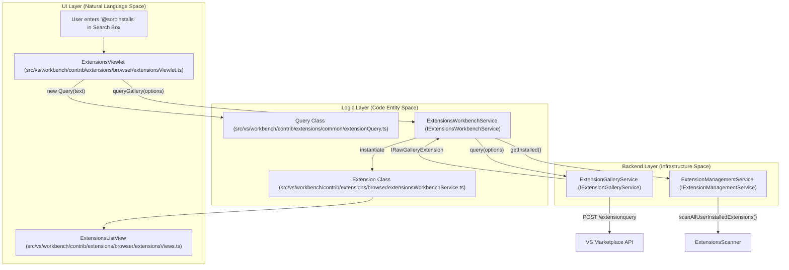
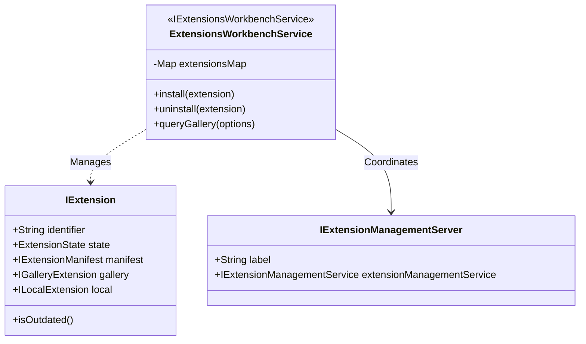

# Extension Marketplace and Management

Relevant source files

The following files were used as context for generating this wiki page:

- [src/vs/code/electron-utility/sharedProcess/contrib/extensions.ts](src/vs/code/electron-utility/sharedProcess/contrib/extensions.ts)
- [src/vs/platform/extensionManagement/common/abstractExtensionManagementService.ts](src/vs/platform/extensionManagement/common/abstractExtensionManagementService.ts)
- [src/vs/platform/extensionManagement/common/extensionGalleryService.ts](src/vs/platform/extensionManagement/common/extensionGalleryService.ts)
- [src/vs/platform/extensionManagement/common/extensionManagement.ts](src/vs/platform/extensionManagement/common/extensionManagement.ts)
- [src/vs/platform/extensionManagement/common/extensionManagementIpc.ts](src/vs/platform/extensionManagement/common/extensionManagementIpc.ts)
- [src/vs/platform/extensionManagement/common/extensionsProfileScannerService.ts](src/vs/platform/extensionManagement/common/extensionsProfileScannerService.ts)
- [src/vs/platform/extensionManagement/common/extensionsScannerService.ts](src/vs/platform/extensionManagement/common/extensionsScannerService.ts)
- [src/vs/platform/extensionManagement/common/unsupportedExtensionsMigration.ts](src/vs/platform/extensionManagement/common/unsupportedExtensionsMigration.ts)
- [src/vs/platform/extensionManagement/node/extensionManagementService.ts](src/vs/platform/extensionManagement/node/extensionManagementService.ts)
- [src/vs/platform/extensionManagement/node/extensionsScannerService.ts](src/vs/platform/extensionManagement/node/extensionsScannerService.ts)
- [src/vs/platform/extensionManagement/test/common/extensionGalleryService.test.ts](src/vs/platform/extensionManagement/test/common/extensionGalleryService.test.ts)
- [src/vs/platform/extensionManagement/test/common/extensionsProfileScannerService.test.ts](src/vs/platform/extensionManagement/test/common/extensionsProfileScannerService.test.ts)
- [src/vs/platform/extensionManagement/test/node/extensionsScannerService.test.ts](src/vs/platform/extensionManagement/test/node/extensionsScannerService.test.ts)
- [src/vs/platform/externalServices/common/marketplace.ts](src/vs/platform/externalServices/common/marketplace.ts)
- [src/vs/platform/externalServices/common/serviceMachineId.ts](src/vs/platform/externalServices/common/serviceMachineId.ts)
- [src/vs/platform/state/node/state.ts](src/vs/platform/state/node/state.ts)
- [src/vs/platform/state/node/stateService.ts](src/vs/platform/state/node/stateService.ts)
- [src/vs/platform/userDataProfile/common/userDataProfile.ts](src/vs/platform/userDataProfile/common/userDataProfile.ts)
- [src/vs/platform/userDataProfile/common/userDataProfileIpc.ts](src/vs/platform/userDataProfile/common/userDataProfileIpc.ts)
- [src/vs/platform/userDataProfile/electron-main/userDataProfile.ts](src/vs/platform/userDataProfile/electron-main/userDataProfile.ts)
- [src/vs/platform/userDataProfile/node/userDataProfile.ts](src/vs/platform/userDataProfile/node/userDataProfile.ts)
- [src/vs/platform/userDataProfile/test/common/userDataProfileService.test.ts](src/vs/platform/userDataProfile/test/common/userDataProfileService.test.ts)
- [src/vs/platform/userDataProfile/test/electron-main/userDataProfileMainService.test.ts](src/vs/platform/userDataProfile/test/electron-main/userDataProfileMainService.test.ts)
- [src/vs/server/node/extensionsScannerService.ts](src/vs/server/node/extensionsScannerService.ts)
- [src/vs/workbench/contrib/extensions/browser/extensionEditor.ts](src/vs/workbench/contrib/extensions/browser/extensionEditor.ts)
- [src/vs/workbench/contrib/extensions/browser/extensions.contribution.ts](src/vs/workbench/contrib/extensions/browser/extensions.contribution.ts)
- [src/vs/workbench/contrib/extensions/browser/extensionsActions.ts](src/vs/workbench/contrib/extensions/browser/extensionsActions.ts)
- [src/vs/workbench/contrib/extensions/browser/extensionsIcons.ts](src/vs/workbench/contrib/extensions/browser/extensionsIcons.ts)
- [src/vs/workbench/contrib/extensions/browser/extensionsList.ts](src/vs/workbench/contrib/extensions/browser/extensionsList.ts)
- [src/vs/workbench/contrib/extensions/browser/extensionsViewer.ts](src/vs/workbench/contrib/extensions/browser/extensionsViewer.ts)
- [src/vs/workbench/contrib/extensions/browser/extensionsViewlet.ts](src/vs/workbench/contrib/extensions/browser/extensionsViewlet.ts)
- [src/vs/workbench/contrib/extensions/browser/extensionsViews.ts](src/vs/workbench/contrib/extensions/browser/extensionsViews.ts)
- [src/vs/workbench/contrib/extensions/browser/extensionsWidgets.ts](src/vs/workbench/contrib/extensions/browser/extensionsWidgets.ts)
- [src/vs/workbench/contrib/extensions/browser/extensionsWorkbenchService.ts](src/vs/workbench/contrib/extensions/browser/extensionsWorkbenchService.ts)
- [src/vs/workbench/contrib/extensions/browser/media/extension.css](src/vs/workbench/contrib/extensions/browser/media/extension.css)
- [src/vs/workbench/contrib/extensions/browser/media/extensionActions.css](src/vs/workbench/contrib/extensions/browser/media/extensionActions.css)
- [src/vs/workbench/contrib/extensions/browser/media/extensionEditor.css](src/vs/workbench/contrib/extensions/browser/media/extensionEditor.css)
- [src/vs/workbench/contrib/extensions/browser/media/extensionsViewlet.css](src/vs/workbench/contrib/extensions/browser/media/extensionsViewlet.css)
- [src/vs/workbench/contrib/extensions/browser/media/extensionsWidgets.css](src/vs/workbench/contrib/extensions/browser/media/extensionsWidgets.css)
- [src/vs/workbench/contrib/extensions/browser/unsupportedExtensionsMigrationContribution.ts](src/vs/workbench/contrib/extensions/browser/unsupportedExtensionsMigrationContribution.ts)
- [src/vs/workbench/contrib/extensions/common/extensionQuery.ts](src/vs/workbench/contrib/extensions/common/extensionQuery.ts)
- [src/vs/workbench/contrib/extensions/common/extensions.ts](src/vs/workbench/contrib/extensions/common/extensions.ts)
- [src/vs/workbench/contrib/userDataProfile/browser/media/userDataProfilesEditor.css](src/vs/workbench/contrib/userDataProfile/browser/media/userDataProfilesEditor.css)
- [src/vs/workbench/contrib/userDataProfile/browser/userDataProfile.contribution.ts](src/vs/workbench/contrib/userDataProfile/browser/userDataProfile.contribution.ts)
- [src/vs/workbench/contrib/userDataProfile/browser/userDataProfile.ts](src/vs/workbench/contrib/userDataProfile/browser/userDataProfile.ts)
- [src/vs/workbench/contrib/userDataProfile/browser/userDataProfileActions.ts](src/vs/workbench/contrib/userDataProfile/browser/userDataProfileActions.ts)
- [src/vs/workbench/contrib/userDataProfile/browser/userDataProfilesEditor.ts](src/vs/workbench/contrib/userDataProfile/browser/userDataProfilesEditor.ts)
- [src/vs/workbench/contrib/userDataProfile/browser/userDataProfilesEditorModel.ts](src/vs/workbench/contrib/userDataProfile/browser/userDataProfilesEditorModel.ts)
- [src/vs/workbench/contrib/userDataProfile/common/userDataProfile.ts](src/vs/workbench/contrib/userDataProfile/common/userDataProfile.ts)
- [src/vs/workbench/contrib/userDataSync/browser/userDataSyncConflictsView.ts](src/vs/workbench/contrib/userDataSync/browser/userDataSyncConflictsView.ts)
- [src/vs/workbench/services/extensionManagement/browser/builtinExtensionsScannerService.ts](src/vs/workbench/services/extensionManagement/browser/builtinExtensionsScannerService.ts)
- [src/vs/workbench/services/extensionManagement/browser/webExtensionsScannerService.ts](src/vs/workbench/services/extensionManagement/browser/webExtensionsScannerService.ts)
- [src/vs/workbench/services/extensionManagement/common/extensionManagement.ts](src/vs/workbench/services/extensionManagement/common/extensionManagement.ts)
- [src/vs/workbench/services/extensionManagement/common/extensionManagementChannelClient.ts](src/vs/workbench/services/extensionManagement/common/extensionManagementChannelClient.ts)
- [src/vs/workbench/services/extensionManagement/common/extensionManagementService.ts](src/vs/workbench/services/extensionManagement/common/extensionManagementService.ts)
- [src/vs/workbench/services/extensionManagement/common/webExtensionManagementService.ts](src/vs/workbench/services/extensionManagement/common/webExtensionManagementService.ts)
- [src/vs/workbench/services/userDataProfile/browser/extensionsResource.ts](src/vs/workbench/services/userDataProfile/browser/extensionsResource.ts)
- [src/vs/workbench/services/userDataProfile/browser/globalStateResource.ts](src/vs/workbench/services/userDataProfile/browser/globalStateResource.ts)
- [src/vs/workbench/services/userDataProfile/browser/keybindingsResource.ts](src/vs/workbench/services/userDataProfile/browser/keybindingsResource.ts)
- [src/vs/workbench/services/userDataProfile/browser/media/userDataProfileView.css](src/vs/workbench/services/userDataProfile/browser/media/userDataProfileView.css)
- [src/vs/workbench/services/userDataProfile/browser/settingsResource.ts](src/vs/workbench/services/userDataProfile/browser/settingsResource.ts)
- [src/vs/workbench/services/userDataProfile/browser/snippetsResource.ts](src/vs/workbench/services/userDataProfile/browser/snippetsResource.ts)
- [src/vs/workbench/services/userDataProfile/browser/tasksResource.ts](src/vs/workbench/services/userDataProfile/browser/tasksResource.ts)
- [src/vs/workbench/services/userDataProfile/browser/userDataProfileImportExportService.ts](src/vs/workbench/services/userDataProfile/browser/userDataProfileImportExportService.ts)
- [src/vs/workbench/services/userDataProfile/browser/userDataProfileInit.ts](src/vs/workbench/services/userDataProfile/browser/userDataProfileInit.ts)
- [src/vs/workbench/services/userDataProfile/browser/userDataProfileManagement.ts](src/vs/workbench/services/userDataProfile/browser/userDataProfileManagement.ts)
- [src/vs/workbench/services/userDataProfile/common/remoteUserDataProfiles.ts](src/vs/workbench/services/userDataProfile/common/remoteUserDataProfiles.ts)
- [src/vs/workbench/services/userDataProfile/common/userDataProfile.ts](src/vs/workbench/services/userDataProfile/common/userDataProfile.ts)
- [src/vs/workbench/services/userDataProfile/common/userDataProfileService.ts](src/vs/workbench/services/userDataProfile/common/userDataProfileService.ts)
- [src/vs/workbench/services/userDataSync/browser/userDataSyncInit.ts](src/vs/workbench/services/userDataSync/browser/userDataSyncInit.ts)

The Extension Marketplace and Management subsystem handles the end-to-end lifecycle of VS Code extensions, from discovering them in the Visual Studio Marketplace to installing, updating, and managing their runtime state across different environments (local, remote, and web).

## Architecture Overview

The system is built on a layered service architecture that abstracts the differences between platform-specific implementations (Node.js vs. Web) and provides a unified model for the UI.

### Key Service Hierarchy

1.  **`IExtensionGalleryService`**: The low-level interface for communicating with the VS Marketplace. It handles REST queries, asset downloads, and version resolution [src/vs/platform/extensionManagement/common/extensionGalleryService.ts:19-20]().
2.  **`IExtensionManagementService`**: The primary service for installing, uninstalling, and scanning extensions. It provides the base implementation for platform-specific logic in `AbstractExtensionManagementService` [src/vs/platform/extensionManagement/common/abstractExtensionManagementService.ts:60-61]().
3.  **`IWorkbenchExtensionManagementService`**: A workbench-layer wrapper that adds profile awareness, multi-server coordination (e.g., local vs. remote), and workspace-specific extension management [src/vs/workbench/services/extensionManagement/common/extensionManagementService.ts:59-61]().
4.  **`IExtensionsWorkbenchService`**: The high-level service used by the UI. It wraps raw extension data into a rich `IExtension` model that tracks state (installing, installed, outdated) and coordinates actions [src/vs/workbench/contrib/extensions/browser/extensionsWorkbenchService.ts:137-140]().

### Data Flow: Marketplace Query to UI
The following diagram illustrates how a user search in the Extensions Viewlet flows through the system, mapping Natural Language search intent to Code Entities.

**Sources:** [src/vs/workbench/contrib/extensions/browser/extensionsViewlet.ts:19-24](), [src/vs/workbench/contrib/extensions/browser/extensionsWorkbenchService.ts:37-43](), [src/vs/platform/extensionManagement/common/extensionGalleryService.ts:155-160](), [src/vs/workbench/contrib/extensions/common/extensionQuery.ts:69]()

---

## Extension Gallery Service

The `ExtensionGalleryService` implements the `IExtensionGalleryService` interface. It is responsible for crafting requests to the Marketplace and parsing the results.

### Marketplace Queries
Queries are executed using `query(options: IQueryOptions, token: CancellationToken)`. The service converts internal `IQueryOptions` into a JSON body for the Marketplace's `/extensionquery` endpoint [src/vs/platform/extensionManagement/common/extensionGalleryService.ts:684-700]().

*   **Asset Handling**: Extensions provide various assets (icons, manifests, VSIXs). The service resolves these via `getAsset(extension: IGalleryExtension, assetType: string)` [src/vs/platform/extensionManagement/common/extensionGalleryService.ts:463-470](). Common asset types include `Icon`, `Manifest`, and `VSIX` [src/vs/platform/extensionManagement/common/extensionGalleryService.ts:112-121]().
*   **Target Platform**: VS Code filters extensions based on the `TargetPlatform` (e.g., `win32-x64`, `linux-arm64`, `web`). The service ensures only compatible versions are requested based on the current environment [src/vs/platform/extensionManagement/common/extensionGalleryService.ts:35-40]().

**Sources:** [src/vs/platform/extensionManagement/common/extensionGalleryService.ts:19-35](), [src/vs/platform/extensionManagement/common/extensionGalleryService.ts:112-135]()

---

## Extension Management Services

There are two primary implementations of `IExtensionManagementService`: one for Node.js (Desktop/Remote) and one for the Web.

### Node.js Implementation (`ExtensionManagementService`)
Located in `src/vs/platform/extensionManagement/node/extensionManagementService.ts`, it handles physical file operations.

*   **VSIX Installation**: Downloads the VSIX to a temporary location using `ExtensionsDownloader`, extracts it using `zip.extract`, and moves it to the extensions folder [src/vs/platform/extensionManagement/node/extensionManagementService.ts:101-104]().
*   **Scanning**: Uses `IExtensionsScannerService` to find extensions on disk and `IExtensionsProfileScannerService` to determine which extensions are active for the current user profile [src/vs/platform/extensionManagement/node/extensionManagementService.ts:85-86]().
*   **Signature Verification**: Integrates with a verification module to ensure the authenticity of downloaded VSIXs before extraction, controlled by the `VerifyExtensionSignature` configuration [src/vs/platform/extensionManagement/node/extensionManagementService.ts:34-39]().

### Web Implementation (`WebExtensionManagementService`)
Handles extensions in the browser, typically by fetching and caching them in IndexedDB via a specialized scanner [src/vs/workbench/services/extensionManagement/common/webExtensionManagementService.ts:25-30]().

**Sources:** [src/vs/platform/extensionManagement/node/extensionManagementService.ts:72-104](), [src/vs/platform/extensionManagement/common/abstractExtensionManagementService.ts:61-100]()

---

## Extensions Workbench Service

The `ExtensionsWorkbenchService` provides the UI with a unified `IExtension` model. This model wraps either a `ILocalExtension` (installed), an `IGalleryExtension` (available in marketplace), or both.

### The Extension Model
The `Extension` class [src/vs/workbench/contrib/extensions/browser/extensionsWorkbenchService.ts:211]() tracks:
*   **`state`**: `Installing`, `Installed`, or `Uninstalled` [src/vs/workbench/contrib/extensions/common/extensions.ts:135-139]().
*   **`runtimeState`**: Whether the extension is currently running, requires a reload, or is disabled [src/vs/workbench/contrib/extensions/common/extensions.ts:175-180]().
*   **`outdated`**: A boolean indicating if a newer version exists in the marketplace by comparing semver versions [src/vs/workbench/contrib/extensions/browser/extensionsWorkbenchService.ts:7-10]().

### Multi-Server Coordination
The `ExtensionManagementServerService` manages multiple `IExtensionManagementServer` instances (Local, Remote, and Web). This allows the workbench to show a unified view of extensions regardless of where they are physically installed [src/vs/workbench/services/extensionManagement/common/extensionManagement.ts:40-45]().

**Sources:** [src/vs/workbench/contrib/extensions/browser/extensionsWorkbenchService.ts:37-81](), [src/vs/workbench/services/extensionManagement/common/extensionManagement.ts:16-18]()

---

## Extensions UI (Viewlet and Views)

The Extensions Viewlet is the primary container for extension management.

### `ExtensionsViewlet`
The main container `ExtensionsViewPaneContainer` [src/vs/workbench/contrib/extensions/browser/extensionsViewlet.ts:77]() manages the search input and various sub-views. It coordinates with `Query` to parse search terms (e.g., `@installed`, `@category:themes`) and manages the visibility of views like `EnabledExtensionsView` and `RecommendedExtensionsView` [src/vs/workbench/contrib/extensions/browser/extensionsViewlet.ts:24]().

### `ExtensionsListView`
A generic view pane that renders lists of extensions. It uses a `PagedModel` to handle large results from the Marketplace efficiently, allowing for virtualized scrolling and on-demand fetching [src/vs/workbench/contrib/extensions/browser/extensionsViews.ts:116-125]().

### `ExtensionEditor`
The rich detail page for an extension [src/vs/workbench/contrib/extensions/browser/extensionEditor.ts:45]().
*   **Readme/Changelog**: Fetched as Markdown and rendered via a webview [src/vs/workbench/contrib/extensions/browser/extensionEditor.ts:78-79]().
*   **Action Bar**: Buttons for Install, Uninstall, Enable/Disable, and Version selection [src/vs/workbench/contrib/extensions/browser/extensionsActions.ts:15]().
*   **Widgets**: Small UI components like `RatingsWidget`, `InstallCountWidget`, and `RemoteBadgeWidget` provide metadata visualization [src/vs/workbench/contrib/extensions/browser/extensionsWidgets.ts:75]().

**Sources:** [src/vs/workbench/contrib/extensions/browser/extensionsViewlet.ts:19-24](), [src/vs/workbench/contrib/extensions/browser/extensionEditor.ts:45-75](), [src/vs/workbench/contrib/extensions/browser/extensionsViews.ts:112-125]()

---

## Profile-Aware Management

With the introduction of User Data Profiles, extension management became "profile-aware".

*   **`IExtensionsProfileScannerService`**: Maintains the mapping of which extensions are installed in which profile by scanning the profile-specific extension metadata [src/vs/platform/extensionManagement/common/extensionsProfileScannerService.ts:21]().
*   **Installation Scope**: Extensions can be "Application Scoped" (available to all profiles) or profile-specific. The `ExtensionManagementService` handles moving extensions between these scopes via `toggleApplicationScope()` [src/vs/platform/extensionManagement/common/abstractExtensionManagementService.ts:103]().
*   **Syncing**: `IUserDataSyncEnablementService` tracks if extensions should be synchronized across devices, which is integrated into the management flow [src/vs/workbench/services/extensionManagement/common/extensionManagementService.ts:103]().

**Sources:** [src/vs/platform/extensionManagement/node/extensionManagementService.ts:86-103](), [src/vs/platform/extensionManagement/common/abstractExtensionManagementService.ts:103-115](), [src/vs/workbench/services/extensionManagement/common/extensionManagementService.ts:98-103]()