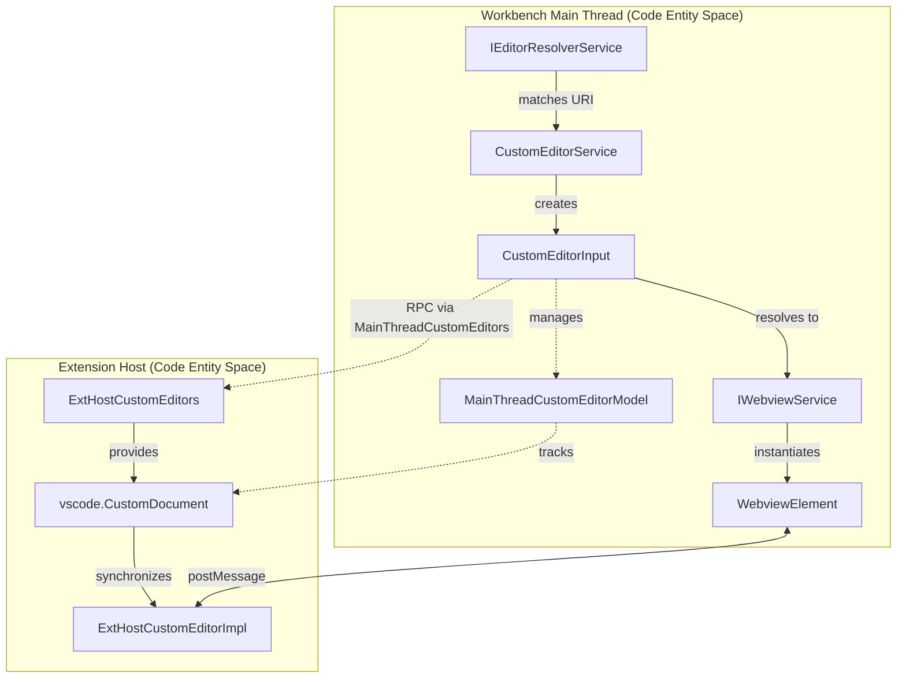
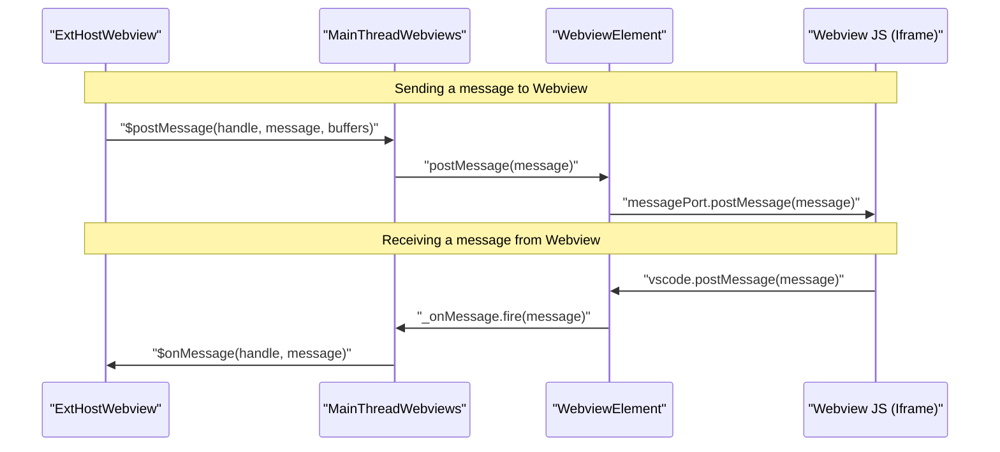

# Webview and Custom Editors

Relevant source files

The following files were used as context for generating this wiki page:

- [src/tsconfig.json](https://github.com/microsoft/vscode/blob/HEAD/src/tsconfig.json)
- [src/vs/base/browser/overlayLayoutElement.ts](https://github.com/microsoft/vscode/blob/HEAD/src/vs/base/browser/overlayLayoutElement.ts)
- [src/vs/platform/webview/common/webviewManagerService.ts](https://github.com/microsoft/vscode/blob/HEAD/src/vs/platform/webview/common/webviewManagerService.ts)
- [src/vs/platform/webview/electron-main/webviewMainService.ts](https://github.com/microsoft/vscode/blob/HEAD/src/vs/platform/webview/electron-main/webviewMainService.ts)
- [src/vs/platform/webview/electron-main/webviewProtocolProvider.ts](https://github.com/microsoft/vscode/blob/HEAD/src/vs/platform/webview/electron-main/webviewProtocolProvider.ts)
- [src/vs/workbench/api/browser/mainThreadCustomEditors.ts](https://github.com/microsoft/vscode/blob/HEAD/src/vs/workbench/api/browser/mainThreadCustomEditors.ts)
- [src/vs/workbench/api/browser/mainThreadWebviewPanels.ts](https://github.com/microsoft/vscode/blob/HEAD/src/vs/workbench/api/browser/mainThreadWebviewPanels.ts)
- [src/vs/workbench/api/browser/mainThreadWebviewViews.ts](https://github.com/microsoft/vscode/blob/HEAD/src/vs/workbench/api/browser/mainThreadWebviewViews.ts)
- [src/vs/workbench/api/browser/mainThreadWebviews.ts](https://github.com/microsoft/vscode/blob/HEAD/src/vs/workbench/api/browser/mainThreadWebviews.ts)
- [src/vs/workbench/api/common/extHostCodeInsets.ts](https://github.com/microsoft/vscode/blob/HEAD/src/vs/workbench/api/common/extHostCodeInsets.ts)
- [src/vs/workbench/api/common/extHostCustomEditors.ts](https://github.com/microsoft/vscode/blob/HEAD/src/vs/workbench/api/common/extHostCustomEditors.ts)
- [src/vs/workbench/api/common/extHostWebview.ts](https://github.com/microsoft/vscode/blob/HEAD/src/vs/workbench/api/common/extHostWebview.ts)
- [src/vs/workbench/api/common/extHostWebviewPanels.ts](https://github.com/microsoft/vscode/blob/HEAD/src/vs/workbench/api/common/extHostWebviewPanels.ts)
- [src/vs/workbench/api/common/extHostWebviewView.ts](https://github.com/microsoft/vscode/blob/HEAD/src/vs/workbench/api/common/extHostWebviewView.ts)
- [src/vs/workbench/api/test/browser/extHostWebview.test.ts](https://github.com/microsoft/vscode/blob/HEAD/src/vs/workbench/api/test/browser/extHostWebview.test.ts)
- [src/vs/workbench/browser/parts/editor/editorConfiguration.ts](https://github.com/microsoft/vscode/blob/HEAD/src/vs/workbench/browser/parts/editor/editorConfiguration.ts)
- [src/vs/workbench/browser/parts/editor/editorTypePicker.ts](https://github.com/microsoft/vscode/blob/HEAD/src/vs/workbench/browser/parts/editor/editorTypePicker.ts)
- [src/vs/workbench/contrib/customEditor/browser/customEditor.contribution.ts](https://github.com/microsoft/vscode/blob/HEAD/src/vs/workbench/contrib/customEditor/browser/customEditor.contribution.ts)
- [src/vs/workbench/contrib/customEditor/browser/customEditorInput.ts](https://github.com/microsoft/vscode/blob/HEAD/src/vs/workbench/contrib/customEditor/browser/customEditorInput.ts)
- [src/vs/workbench/contrib/customEditor/browser/customEditorInputFactory.ts](https://github.com/microsoft/vscode/blob/HEAD/src/vs/workbench/contrib/customEditor/browser/customEditorInputFactory.ts)
- [src/vs/workbench/contrib/customEditor/browser/customEditors.ts](https://github.com/microsoft/vscode/blob/HEAD/src/vs/workbench/contrib/customEditor/browser/customEditors.ts)
- [src/vs/workbench/contrib/customEditor/common/contributedCustomEditors.ts](https://github.com/microsoft/vscode/blob/HEAD/src/vs/workbench/contrib/customEditor/common/contributedCustomEditors.ts)
- [src/vs/workbench/contrib/customEditor/common/customEditor.ts](https://github.com/microsoft/vscode/blob/HEAD/src/vs/workbench/contrib/customEditor/common/customEditor.ts)
- [src/vs/workbench/contrib/customEditor/common/customTextEditorModel.ts](https://github.com/microsoft/vscode/blob/HEAD/src/vs/workbench/contrib/customEditor/common/customTextEditorModel.ts)
- [src/vs/workbench/contrib/customEditor/common/extensionPoint.ts](https://github.com/microsoft/vscode/blob/HEAD/src/vs/workbench/contrib/customEditor/common/extensionPoint.ts)
- [src/vs/workbench/contrib/webview/browser/overlayWebview.ts](https://github.com/microsoft/vscode/blob/HEAD/src/vs/workbench/contrib/webview/browser/overlayWebview.ts)
- [src/vs/workbench/contrib/webview/browser/pre/index.html](https://github.com/microsoft/vscode/blob/HEAD/src/vs/workbench/contrib/webview/browser/pre/index.html)
- [src/vs/workbench/contrib/webview/browser/pre/service-worker.js](https://github.com/microsoft/vscode/blob/HEAD/src/vs/workbench/contrib/webview/browser/pre/service-worker.js)
- [src/vs/workbench/contrib/webview/browser/resourceLoading.ts](https://github.com/microsoft/vscode/blob/HEAD/src/vs/workbench/contrib/webview/browser/resourceLoading.ts)
- [src/vs/workbench/contrib/webview/browser/themeing.ts](https://github.com/microsoft/vscode/blob/HEAD/src/vs/workbench/contrib/webview/browser/themeing.ts)
- [src/vs/workbench/contrib/webview/browser/webview.ts](https://github.com/microsoft/vscode/blob/HEAD/src/vs/workbench/contrib/webview/browser/webview.ts)
- [src/vs/workbench/contrib/webview/browser/webviewElement.ts](https://github.com/microsoft/vscode/blob/HEAD/src/vs/workbench/contrib/webview/browser/webviewElement.ts)
- [src/vs/workbench/contrib/webview/browser/webviewMessages.d.ts](https://github.com/microsoft/vscode/blob/HEAD/src/vs/workbench/contrib/webview/browser/webviewMessages.d.ts)
- [src/vs/workbench/contrib/webview/browser/webviewWindowDragMonitor.ts](https://github.com/microsoft/vscode/blob/HEAD/src/vs/workbench/contrib/webview/browser/webviewWindowDragMonitor.ts)
- [src/vs/workbench/contrib/webview/electron-browser/webviewElement.ts](https://github.com/microsoft/vscode/blob/HEAD/src/vs/workbench/contrib/webview/electron-browser/webviewElement.ts)
- [src/vs/workbench/contrib/webviewPanel/browser/webviewEditor.ts](https://github.com/microsoft/vscode/blob/HEAD/src/vs/workbench/contrib/webviewPanel/browser/webviewEditor.ts)
- [src/vs/workbench/contrib/webviewPanel/browser/webviewEditorInput.ts](https://github.com/microsoft/vscode/blob/HEAD/src/vs/workbench/contrib/webviewPanel/browser/webviewEditorInput.ts)
- [src/vs/workbench/contrib/webviewPanel/browser/webviewEditorInputSerializer.ts](https://github.com/microsoft/vscode/blob/HEAD/src/vs/workbench/contrib/webviewPanel/browser/webviewEditorInputSerializer.ts)
- [src/vs/workbench/contrib/webviewPanel/browser/webviewPanel.contribution.ts](https://github.com/microsoft/vscode/blob/HEAD/src/vs/workbench/contrib/webviewPanel/browser/webviewPanel.contribution.ts)
- [src/vs/workbench/contrib/webviewPanel/browser/webviewWorkbenchService.ts](https://github.com/microsoft/vscode/blob/HEAD/src/vs/workbench/contrib/webviewPanel/browser/webviewWorkbenchService.ts)
- [src/vs/workbench/contrib/webviewView/browser/webviewViewPane.ts](https://github.com/microsoft/vscode/blob/HEAD/src/vs/workbench/contrib/webviewView/browser/webviewViewPane.ts)
- [src/vs/workbench/contrib/webviewView/browser/webviewViewService.ts](https://github.com/microsoft/vscode/blob/HEAD/src/vs/workbench/contrib/webviewView/browser/webviewViewService.ts)
- [src/vs/workbench/services/editor/browser/editorResolverService.ts](https://github.com/microsoft/vscode/blob/HEAD/src/vs/workbench/services/editor/browser/editorResolverService.ts)
- [src/vs/workbench/services/editor/common/editorResolverService.ts](https://github.com/microsoft/vscode/blob/HEAD/src/vs/workbench/services/editor/common/editorResolverService.ts)
- [src/vs/workbench/services/editor/test/browser/editorResolverService.test.ts](https://github.com/microsoft/vscode/blob/HEAD/src/vs/workbench/services/editor/test/browser/editorResolverService.test.ts)
- [src/vs/workbench/test/browser/parts/editor/editorTypePicker.test.ts](https://github.com/microsoft/vscode/blob/HEAD/src/vs/workbench/test/browser/parts/editor/editorTypePicker.test.ts)

The Webview subsystem provides the infrastructure for rendering arbitrary HTML/JS/CSS content within VS Code. This is used for complex UI features such as Custom Editors, Webview Views, Notebook outputs, and extension-contributed dashboards.

## Webview Infrastructure

Webviews are implemented as isolated environments that communicate with the workbench via an asynchronous messaging bridge. To ensure security and performance, webviews are hosted in `<iframe>` elements (even in Electron) and utilize Service Workers for local resource loading.

### Webview Element Implementations

There are two primary implementations of the webview element depending on the environment:

1.  **Browser Implementation (`WebviewElement`)**: Used in VS Code for the Web and as the base for the desktop. It uses a standard `<iframe>` and relies on a Service Worker to intercept requests for local resources [src/vs/workbench/contrib/webview/browser/webviewElement.ts:112-115](https://github.com/microsoft/vscode/blob/HEAD/src/vs/workbench/contrib/webview/browser/webviewElement.ts#L112-L115). It manages the `MessagePort` and message handlers used for communication [src/vs/workbench/contrib/webview/browser/webviewElement.ts:153-154](https://github.com/microsoft/vscode/blob/HEAD/src/vs/workbench/contrib/webview/browser/webviewElement.ts#L153-L154).
2.  **Electron Implementation (`ElectronWebviewElement`)**: Extends the browser implementation but integrates with Electron's native features. It handles native "Find in Page" via `IWebviewManagerService` and keyboard shortcut interception via `WindowIgnoreMenuShortcutsManager` [src/vs/workbench/contrib/webview/electron-browser/webviewElement.ts:29-36](https://github.com/microsoft/vscode/blob/HEAD/src/vs/workbench/contrib/webview/electron-browser/webviewElement.ts#L29-L36). It uses `ProxyChannel` to communicate with the `webview` channel in the Electron main process [src/vs/workbench/contrib/webview/electron-browser/webviewElement.ts:62-63](https://github.com/microsoft/vscode/blob/HEAD/src/vs/workbench/contrib/webview/electron-browser/webviewElement.ts#L62-L63).

### Data Flow: Resource Loading

Webviews cannot access the local file system directly. Instead, they use the `vscode-resource` (or the newer `vscode-webview`) protocol.

*   **Service Worker**: In the browser, `service-worker.js` (version 6) intercepts `fetch` requests. It communicates back to the main thread via `postMessage` to request the file content and supports streaming responses [src/vs/workbench/contrib/webview/browser/pre/service-worker.js:11-12](https://github.com/microsoft/vscode/blob/HEAD/src/vs/workbench/contrib/webview/browser/pre/service-worker.js#L11-L12), [src/vs/workbench/contrib/webview/browser/pre/service-worker.js:253-270](https://github.com/microsoft/vscode/blob/HEAD/src/vs/workbench/contrib/webview/browser/pre/service-worker.js#L253-L270). It includes a fallback for Safari using chunk-based streaming [src/vs/workbench/contrib/webview/browser/pre/service-worker.js:271-278](https://github.com/microsoft/vscode/blob/HEAD/src/vs/workbench/contrib/webview/browser/pre/service-worker.js#L271-L278).
*   **Protocol Provider**: In Electron, `WebviewProtocolProvider` registers the `vscode-webview` scheme in the main process to serve the initial webview HTML and scripts (like `index.html` and `service-worker.js`) from the application bundle [src/vs/platform/webview/electron-main/webviewProtocolProvider.ts:13-27](https://github.com/microsoft/vscode/blob/HEAD/src/vs/platform/webview/electron-main/webviewProtocolProvider.ts#L13-L27).

### Messaging Bridge

The communication between the Extension Host (Extension Space) and the Webview (Webview Space) passes through the Workbench (Main Thread).

| Layer | Entity | Role |
| :--- | :--- | :--- |
| **Extension Host** | `ExtHostWebview` | Provides the `postMessage` and `onDidReceiveMessage` API to extensions. |
| **Workbench** | `MainThreadWebviews` | Acts as the RPC proxy between the Extension Host and the actual DOM element [src/vs/workbench/api/browser/mainThreadWebviews.ts:26-26](https://github.com/microsoft/vscode/blob/HEAD/src/vs/workbench/api/browser/mainThreadWebviews.ts#L26). |
| **Webview Element** | `WebviewElement` | Manages the `MessagePort` and dispatches events to the `<iframe>` [src/vs/workbench/contrib/webview/browser/webviewElement.ts:153-154](https://github.com/microsoft/vscode/blob/HEAD/src/vs/workbench/contrib/webview/browser/webviewElement.ts#L153-L154). |
| **Webview Content** | `index.html` | The bootstrapper inside the iframe that provides `acquireVsCodeApi()` [src/vs/workbench/contrib/webview/browser/pre/index.html:206-209](https://github.com/microsoft/vscode/blob/HEAD/src/vs/workbench/contrib/webview/browser/pre/index.html#L206-L209). |

**Sources:** [src/vs/workbench/contrib/webview/browser/webviewElement.ts:112-154](https://github.com/microsoft/vscode/blob/HEAD/src/vs/workbench/contrib/webview/browser/webviewElement.ts#L112-L154), [src/vs/workbench/contrib/webview/electron-browser/webviewElement.ts:29-63](https://github.com/microsoft/vscode/blob/HEAD/src/vs/workbench/contrib/webview/electron-browser/webviewElement.ts#L29-L63), [src/vs/workbench/contrib/webview/browser/pre/service-worker.js:253-278](https://github.com/microsoft/vscode/blob/HEAD/src/vs/workbench/contrib/webview/browser/pre/service-worker.js#L253-L278), [src/vs/platform/webview/electron-main/webviewProtocolProvider.ts:13-27](https://github.com/microsoft/vscode/blob/HEAD/src/vs/platform/webview/electron-main/webviewProtocolProvider.ts#L13-L27), [src/vs/workbench/api/browser/mainThreadWebviews.ts:26-26](https://github.com/microsoft/vscode/blob/HEAD/src/vs/workbench/api/browser/mainThreadWebviews.ts#L26).

## Custom Editors

Custom Editors allow extensions to replace the standard text editor with a specialized webview-based UI for specific file types.

### Custom Editor Architecture

Custom editors are built on top of the `EditorInput` system but resolve to a webview.

*   **`CustomEditorService`**: The central coordinator that manages contributed custom editor types and their capabilities [src/vs/workbench/contrib/customEditor/browser/customEditors.ts:46-52](https://github.com/microsoft/vscode/blob/HEAD/src/vs/workbench/contrib/customEditor/browser/customEditors.ts#L46-L52). It handles the registration of context keys like `CONTEXT_ACTIVE_CUSTOM_EDITOR_ID` [src/vs/workbench/contrib/customEditor/browser/customEditors.ts:88-91](https://github.com/microsoft/vscode/blob/HEAD/src/vs/workbench/contrib/customEditor/browser/customEditors.ts#L88-L91).
*   **`CustomEditorInput`**: A specialized `EditorInput` that wraps a webview. It is "lazily resolved," meaning the webview content is only created when the editor becomes active [src/vs/workbench/contrib/customEditor/browser/customEditorInput.ts:46-46](https://github.com/microsoft/vscode/blob/HEAD/src/vs/workbench/contrib/customEditor/browser/customEditorInput.ts#L46). It inherits from `LazilyResolvedWebviewEditorInput` [src/vs/workbench/contrib/webviewPanel/browser/webviewWorkbenchService.ts:109-109](https://github.com/microsoft/vscode/blob/HEAD/src/vs/workbench/contrib/webviewPanel/browser/webviewWorkbenchService.ts#L109).
*   **`CustomEditorModel`**: Manages the underlying data for the custom editor. For text-based custom editors, `CustomTextEditorModel` wraps a standard `TextModel` [src/vs/workbench/contrib/customEditor/common/customTextEditorModel.ts:33-33](https://github.com/microsoft/vscode/blob/HEAD/src/vs/workbench/contrib/customEditor/common/customTextEditorModel.ts#L33).

### Entity Association: Custom Editor Resolution

This diagram shows how a file URI is resolved into a Custom Editor UI and how the Main Thread components associate with Extension Host entities.

Title: Custom Editor Resolution and Association

**Sources:** [src/vs/workbench/contrib/customEditor/browser/customEditors.ts:46-116](https://github.com/microsoft/vscode/blob/HEAD/src/vs/workbench/contrib/customEditor/browser/customEditors.ts#L46-L116), [src/vs/workbench/contrib/customEditor/browser/customEditorInput.ts:46-109](https://github.com/microsoft/vscode/blob/HEAD/src/vs/workbench/contrib/customEditor/browser/customEditorInput.ts#L46-L109), [src/vs/workbench/api/browser/mainThreadCustomEditors.ts:79-121](https://github.com/microsoft/vscode/blob/HEAD/src/vs/workbench/api/browser/mainThreadCustomEditors.ts#L79-L121), [src/vs/workbench/services/editor/browser/editorResolverService.ts:115-125](https://github.com/microsoft/vscode/blob/HEAD/src/vs/workbench/services/editor/browser/editorResolverService.ts#L115-L125).

## Webview Views

Webview Views allow extensions to contribute webview content into the Sidebar or Panel.

*   **`WebviewViewPane`**: A specialized `ViewPane` that hosts an `IOverlayWebview`. It manages the lifecycle of the webview relative to the visibility of the view container [src/vs/workbench/contrib/webviewView/browser/webviewViewPane.ts:41-50](https://github.com/microsoft/vscode/blob/HEAD/src/vs/workbench/contrib/webviewView/browser/webviewViewPane.ts#L41-L50).
*   **`WebviewViewService`**: Handles the registration of "resolvers" that fill the view with content when it is first expanded [src/vs/workbench/contrib/webviewView/browser/webviewViewPane.ts:95-100](https://github.com/microsoft/vscode/blob/HEAD/src/vs/workbench/contrib/webviewView/browser/webviewViewPane.ts#L95-L100).

**Sources:** [src/vs/workbench/contrib/webviewView/browser/webviewViewPane.ts:41-103](https://github.com/microsoft/vscode/blob/HEAD/src/vs/workbench/contrib/webviewView/browser/webviewViewPane.ts#L41-L103).

## Implementation Detail: The Overlay Webview

To prevent webview contents from being destroyed when an editor is dragged or the layout changes, VS Code uses an "Overlay" pattern.

*   **`IOverlayWebview`**: Instead of being a direct child of the editor DOM, the webview is positioned absolutely over the workbench in a separate container [src/vs/workbench/contrib/webview/browser/webview.ts:68-68](https://github.com/microsoft/vscode/blob/HEAD/src/vs/workbench/contrib/webview/browser/webview.ts#L68).
*   **`claim()` and `release()`**: When a `CustomEditorInput` or `WebviewViewPane` becomes visible, it "claims" the webview element and provides a target DOM node for the webview to align its position with [src/vs/workbench/contrib/webviewView/browser/webviewViewPane.ts:153-155](https://github.com/microsoft/vscode/blob/HEAD/src/vs/workbench/contrib/webviewView/browser/webviewViewPane.ts#L153-L155).

**Sources:** [src/vs/workbench/contrib/webviewView/browser/webviewViewPane.ts:153-155](https://github.com/microsoft/vscode/blob/HEAD/src/vs/workbench/contrib/webviewView/browser/webviewViewPane.ts#L153-L155), [src/vs/workbench/contrib/webview/browser/webview.ts:68-68](https://github.com/microsoft/vscode/blob/HEAD/src/vs/workbench/contrib/webview/browser/webview.ts#L68).

## Messaging Data Flow

This diagram illustrates the bridge between an Extension and its Webview UI, highlighting the serialization process.

Title: Messaging Bridge and Data Flow

**Sources:** [src/vs/workbench/contrib/webview/browser/webviewElement.ts:153-154](https://github.com/microsoft/vscode/blob/HEAD/src/vs/workbench/contrib/webview/browser/webviewElement.ts#L153-L154), [src/vs/workbench/contrib/webview/browser/pre/index.html:225-227](https://github.com/microsoft/vscode/blob/HEAD/src/vs/workbench/contrib/webview/browser/pre/index.html#L225-L227).

## Custom Editor Capabilities

Custom editors can signal specific capabilities to the workbench via `CustomEditorCapabilities`:

*   **`supportsBackup`**: Indicates the editor can participate in hot exit and backup/restore [src/vs/workbench/contrib/customEditor/common/customEditor.ts:27-27](https://github.com/microsoft/vscode/blob/HEAD/src/vs/workbench/contrib/customEditor/common/customEditor.ts#L27).
*   **`editable`**: Enables Undo/Redo integration with the workbench's global undo stack. The `MainThreadCustomEditors` manages `MainThreadCustomEditorModel` which implements `IWorkingCopy` to integrate with the saving and backup system [src/vs/workbench/api/browser/mainThreadCustomEditors.ts:112-121](https://github.com/microsoft/vscode/blob/HEAD/src/vs/workbench/api/browser/mainThreadCustomEditors.ts#L112-L121).

**Sources:** [src/vs/workbench/contrib/customEditor/common/customEditor.ts:27-27](https://github.com/microsoft/vscode/blob/HEAD/src/vs/workbench/contrib/customEditor/common/customEditor.ts#L27), [src/vs/workbench/api/browser/mainThreadCustomEditors.ts:112-121](https://github.com/microsoft/vscode/blob/HEAD/src/vs/workbench/api/browser/mainThreadCustomEditors.ts#L112-L121).