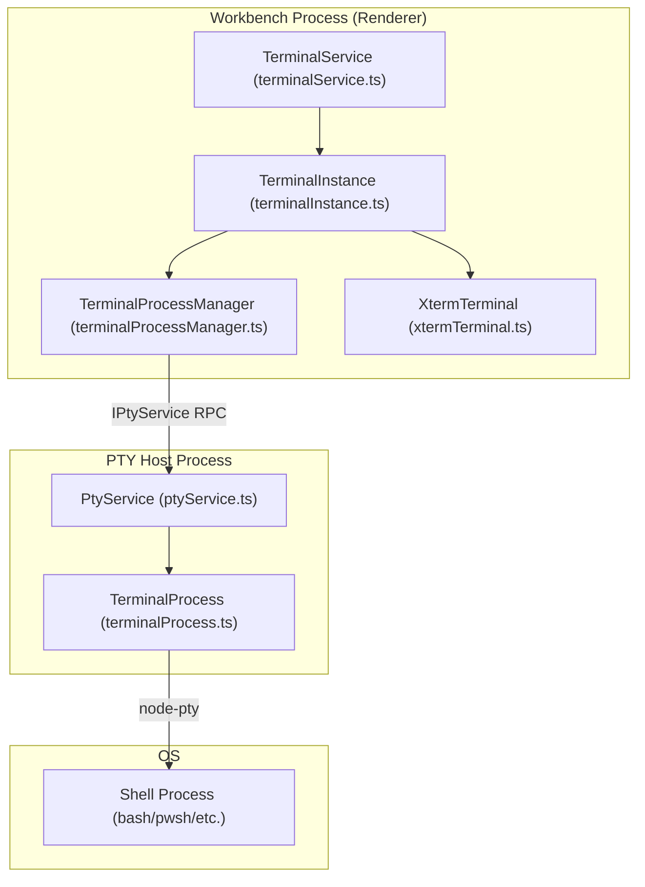
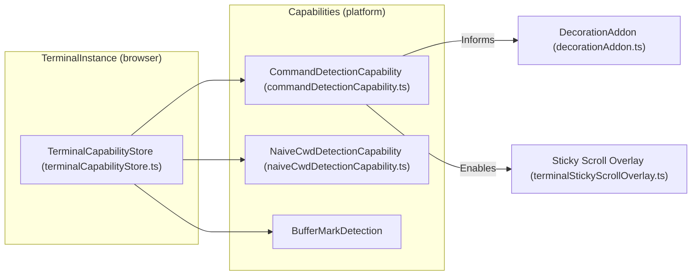

# Terminal

Relevant source files

The following files were used as context for generating this wiki page:

- [src/vs/platform/terminal/common/capabilities/capabilities.ts](src/vs/platform/terminal/common/capabilities/capabilities.ts)
- [src/vs/platform/terminal/common/capabilities/commandDetection/terminalCommand.ts](src/vs/platform/terminal/common/capabilities/commandDetection/terminalCommand.ts)
- [src/vs/platform/terminal/common/capabilities/commandDetectionCapability.ts](src/vs/platform/terminal/common/capabilities/commandDetectionCapability.ts)
- [src/vs/platform/terminal/common/capabilities/cwdDetectionCapability.ts](src/vs/platform/terminal/common/capabilities/cwdDetectionCapability.ts)
- [src/vs/platform/terminal/common/capabilities/terminalCapabilityStore.ts](src/vs/platform/terminal/common/capabilities/terminalCapabilityStore.ts)
- [src/vs/platform/terminal/common/terminal.ts](src/vs/platform/terminal/common/terminal.ts)
- [src/vs/platform/terminal/common/xterm/shellIntegrationAddon.ts](src/vs/platform/terminal/common/xterm/shellIntegrationAddon.ts)
- [src/vs/platform/terminal/node/ptyHostService.ts](src/vs/platform/terminal/node/ptyHostService.ts)
- [src/vs/platform/terminal/node/ptyService.ts](src/vs/platform/terminal/node/ptyService.ts)
- [src/vs/platform/terminal/node/terminalProcess.ts](src/vs/platform/terminal/node/terminalProcess.ts)
- [src/vs/workbench/api/browser/mainThreadTerminalService.ts](src/vs/workbench/api/browser/mainThreadTerminalService.ts)
- [src/vs/workbench/api/common/extHostTerminalService.ts](src/vs/workbench/api/common/extHostTerminalService.ts)
- [src/vs/workbench/contrib/terminal/browser/media/terminal.css](src/vs/workbench/contrib/terminal/browser/media/terminal.css)
- [src/vs/workbench/contrib/terminal/browser/media/xterm.css](src/vs/workbench/contrib/terminal/browser/media/xterm.css)
- [src/vs/workbench/contrib/terminal/browser/remotePty.ts](src/vs/workbench/contrib/terminal/browser/remotePty.ts)
- [src/vs/workbench/contrib/terminal/browser/terminal.contribution.ts](src/vs/workbench/contrib/terminal/browser/terminal.contribution.ts)
- [src/vs/workbench/contrib/terminal/browser/terminal.ts](src/vs/workbench/contrib/terminal/browser/terminal.ts)
- [src/vs/workbench/contrib/terminal/browser/terminalActions.ts](src/vs/workbench/contrib/terminal/browser/terminalActions.ts)
- [src/vs/workbench/contrib/terminal/browser/terminalEditor.ts](src/vs/workbench/contrib/terminal/browser/terminalEditor.ts)
- [src/vs/workbench/contrib/terminal/browser/terminalEditorInput.ts](src/vs/workbench/contrib/terminal/browser/terminalEditorInput.ts)
- [src/vs/workbench/contrib/terminal/browser/terminalEditorService.ts](src/vs/workbench/contrib/terminal/browser/terminalEditorService.ts)
- [src/vs/workbench/contrib/terminal/browser/terminalEvents.ts](src/vs/workbench/contrib/terminal/browser/terminalEvents.ts)
- [src/vs/workbench/contrib/terminal/browser/terminalGroup.ts](src/vs/workbench/contrib/terminal/browser/terminalGroup.ts)
- [src/vs/workbench/contrib/terminal/browser/terminalGroupService.ts](src/vs/workbench/contrib/terminal/browser/terminalGroupService.ts)
- [src/vs/workbench/contrib/terminal/browser/terminalInstance.ts](src/vs/workbench/contrib/terminal/browser/terminalInstance.ts)
- [src/vs/workbench/contrib/terminal/browser/terminalMenus.ts](src/vs/workbench/contrib/terminal/browser/terminalMenus.ts)
- [src/vs/workbench/contrib/terminal/browser/terminalProcessExtHostProxy.ts](src/vs/workbench/contrib/terminal/browser/terminalProcessExtHostProxy.ts)
- [src/vs/workbench/contrib/terminal/browser/terminalProcessManager.ts](src/vs/workbench/contrib/terminal/browser/terminalProcessManager.ts)
- [src/vs/workbench/contrib/terminal/browser/terminalService.ts](src/vs/workbench/contrib/terminal/browser/terminalService.ts)
- [src/vs/workbench/contrib/terminal/browser/terminalTabbedView.ts](src/vs/workbench/contrib/terminal/browser/terminalTabbedView.ts)
- [src/vs/workbench/contrib/terminal/browser/terminalTabsList.ts](src/vs/workbench/contrib/terminal/browser/terminalTabsList.ts)
- [src/vs/workbench/contrib/terminal/browser/terminalView.ts](src/vs/workbench/contrib/terminal/browser/terminalView.ts)
- [src/vs/workbench/contrib/terminal/browser/xterm-private.d.ts](src/vs/workbench/contrib/terminal/browser/xterm-private.d.ts)
- [src/vs/workbench/contrib/terminal/browser/xterm/decorationAddon.ts](src/vs/workbench/contrib/terminal/browser/xterm/decorationAddon.ts)
- [src/vs/workbench/contrib/terminal/browser/xterm/markNavigationAddon.ts](src/vs/workbench/contrib/terminal/browser/xterm/markNavigationAddon.ts)
- [src/vs/workbench/contrib/terminal/browser/xterm/xtermTerminal.ts](src/vs/workbench/contrib/terminal/browser/xterm/xtermTerminal.ts)
- [src/vs/workbench/contrib/terminal/common/terminal.ts](src/vs/workbench/contrib/terminal/common/terminal.ts)
- [src/vs/workbench/contrib/terminal/common/terminalColorRegistry.ts](src/vs/workbench/contrib/terminal/common/terminalColorRegistry.ts)
- [src/vs/workbench/contrib/terminal/common/terminalConfiguration.ts](src/vs/workbench/contrib/terminal/common/terminalConfiguration.ts)
- [src/vs/workbench/contrib/terminal/common/terminalExtensionPoints.ts](src/vs/workbench/contrib/terminal/common/terminalExtensionPoints.ts)
- [src/vs/workbench/contrib/terminal/common/terminalStrings.ts](src/vs/workbench/contrib/terminal/common/terminalStrings.ts)
- [src/vs/workbench/contrib/terminal/test/browser/capabilities/commandDetectionCapability.test.ts](src/vs/workbench/contrib/terminal/test/browser/capabilities/commandDetectionCapability.test.ts)
- [src/vs/workbench/contrib/terminal/test/browser/capabilities/partialCommandDetectionCapability.test.ts](src/vs/workbench/contrib/terminal/test/browser/capabilities/partialCommandDetectionCapability.test.ts)
- [src/vs/workbench/contrib/terminal/test/browser/capabilities/terminalCapabilityStore.test.ts](src/vs/workbench/contrib/terminal/test/browser/capabilities/terminalCapabilityStore.test.ts)
- [src/vs/workbench/contrib/terminal/test/browser/terminalEvents.test.ts](src/vs/workbench/contrib/terminal/test/browser/terminalEvents.test.ts)
- [src/vs/workbench/contrib/terminal/test/browser/terminalInstance.test.ts](src/vs/workbench/contrib/terminal/test/browser/terminalInstance.test.ts)
- [src/vs/workbench/contrib/terminal/test/browser/terminalProfileService.integrationTest.ts](src/vs/workbench/contrib/terminal/test/browser/terminalProfileService.integrationTest.ts)
- [src/vs/workbench/contrib/terminal/test/browser/terminalService.test.ts](src/vs/workbench/contrib/terminal/test/browser/terminalService.test.ts)
- [src/vs/workbench/contrib/terminal/test/browser/xterm/decorationAddon.test.ts](src/vs/workbench/contrib/terminal/test/browser/xterm/decorationAddon.test.ts)
- [src/vs/workbench/contrib/terminal/test/browser/xterm/lineDataEventAddon.test.ts](src/vs/workbench/contrib/terminal/test/browser/xterm/lineDataEventAddon.test.ts)
- [src/vs/workbench/contrib/terminal/test/browser/xterm/shellIntegrationAddon.test.ts](src/vs/workbench/contrib/terminal/test/browser/xterm/shellIntegrationAddon.test.ts)
- [src/vs/workbench/contrib/terminal/test/browser/xterm/xtermTerminal.test.ts](src/vs/workbench/contrib/terminal/test/browser/xterm/xtermTerminal.test.ts)
- [src/vs/workbench/contrib/terminalContrib/accessibility/browser/bufferContentTracker.ts](src/vs/workbench/contrib/terminalContrib/accessibility/browser/bufferContentTracker.ts)
- [src/vs/workbench/contrib/terminalContrib/accessibility/test/browser/bufferContentTracker.test.ts](src/vs/workbench/contrib/terminalContrib/accessibility/test/browser/bufferContentTracker.test.ts)
- [src/vs/workbench/contrib/terminalContrib/links/test/browser/terminalLinkOpeners.test.ts](src/vs/workbench/contrib/terminalContrib/links/test/browser/terminalLinkOpeners.test.ts)
- [src/vs/workbench/contrib/terminalContrib/quickFix/browser/quickFix.ts](src/vs/workbench/contrib/terminalContrib/quickFix/browser/quickFix.ts)
- [src/vs/workbench/contrib/terminalContrib/quickFix/browser/quickFixAddon.ts](src/vs/workbench/contrib/terminalContrib/quickFix/browser/quickFixAddon.ts)
- [src/vs/workbench/contrib/terminalContrib/quickFix/browser/terminal.quickFix.contribution.ts](src/vs/workbench/contrib/terminalContrib/quickFix/browser/terminal.quickFix.contribution.ts)
- [src/vs/workbench/contrib/terminalContrib/quickFix/browser/terminalQuickFixBuiltinActions.ts](src/vs/workbench/contrib/terminalContrib/quickFix/browser/terminalQuickFixBuiltinActions.ts)
- [src/vs/workbench/contrib/terminalContrib/quickFix/browser/terminalQuickFixService.ts](src/vs/workbench/contrib/terminalContrib/quickFix/browser/terminalQuickFixService.ts)
- [src/vs/workbench/contrib/terminalContrib/quickFix/test/browser/quickFixAddon.test.ts](src/vs/workbench/contrib/terminalContrib/quickFix/test/browser/quickFixAddon.test.ts)
- [src/vs/workbench/contrib/terminalContrib/stickyScroll/browser/media/stickyScroll.css](src/vs/workbench/contrib/terminalContrib/stickyScroll/browser/media/stickyScroll.css)
- [src/vs/workbench/contrib/terminalContrib/stickyScroll/browser/terminal.stickyScroll.contribution.ts](src/vs/workbench/contrib/terminalContrib/stickyScroll/browser/terminal.stickyScroll.contribution.ts)
- [src/vs/workbench/contrib/terminalContrib/stickyScroll/browser/terminalStickyScrollColorRegistry.ts](src/vs/workbench/contrib/terminalContrib/stickyScroll/browser/terminalStickyScrollColorRegistry.ts)
- [src/vs/workbench/contrib/terminalContrib/stickyScroll/browser/terminalStickyScrollContribution.ts](src/vs/workbench/contrib/terminalContrib/stickyScroll/browser/terminalStickyScrollContribution.ts)
- [src/vs/workbench/contrib/terminalContrib/stickyScroll/browser/terminalStickyScrollOverlay.ts](src/vs/workbench/contrib/terminalContrib/stickyScroll/browser/terminalStickyScrollOverlay.ts)

The Integrated Terminal system in VS Code provides a robust, high-performance terminal emulator within the workbench. It is built upon a multi-process architecture that separates the UI rendering from the underlying process management, ensuring that heavy terminal output does not freeze the editor interface.

## Multi-Process Architecture

The terminal system operates across several processes to ensure stability and performance. The frontend (Workbench) communicates with a dedicated **PTY Host** process, which in turn manages the lifecycle of the actual shell processes (e.g., `bash`, `zsh`, `pwsh`).

### Core Components

*   **TerminalInstance**: The primary workbench-side representation of a terminal. It manages the integration between the UI, the process manager, and the xterm.js renderer [src/vs/workbench/contrib/terminal/browser/terminalInstance.ts:108-116]().
*   **TerminalProcessManager**: Holds all state related to the creation and management of terminal processes, including flow control and capability management [src/vs/workbench/contrib/terminal/browser/terminalProcessManager.ts:74-114]().
*   **PtyService**: Running in the PTY Host, this service manages the actual `node-pty` instances and persistent terminal sessions [src/vs/platform/terminal/node/ptyService.ts:97-134]().
*   **XtermTerminal**: A wrapper around the `xterm.js` library, handling themes, accessibility, and terminal-specific rendering logic [src/vs/workbench/contrib/terminal/browser/xterm/xtermTerminal.ts:116-118]().

### Process Relationship Diagram

The following diagram illustrates the communication flow between the different layers of the terminal system, bridging natural language concepts to code entities.

Terminal Process Communication Flow

Sources: [src/vs/workbench/contrib/terminal/browser/terminalInstance.ts:108-116](), [src/vs/workbench/contrib/terminal/browser/terminalProcessManager.ts:74-114](), [src/vs/platform/terminal/node/ptyService.ts:97-134](), [src/vs/platform/terminal/node/terminalProcess.ts:22-22]()

For details on the triad of management classes and the flow control mechanism, see **[Terminal Architecture and Process Management](#6.1)**.

## Key Services and Entities

The terminal subsystem is orchestrated by several internal services registered via Dependency Injection.

| Service | Interface | Responsibility |
| :--- | :--- | :--- |
| **Terminal Service** | `ITerminalService` | The entry point for creating and managing terminal instances across the workbench [src/vs/workbench/contrib/terminal/browser/terminalService.ts:66-100](). |
| **Terminal Group Service** | `ITerminalGroupService` | Manages terminal tabs, splitting terminals into groups, and the terminal panel layout [src/vs/workbench/contrib/terminal/browser/terminal.ts:44-44](). |
| **Terminal Editor Service** | `ITerminalEditorService` | Handles terminals when they are opened as editors instead of in the bottom panel [src/vs/workbench/contrib/terminal/browser/terminal.ts:42-42](). |
| **Terminal Profile Service** | `ITerminalProfileService` | Detects available shells on the system and manages user-defined terminal profiles [src/vs/workbench/contrib/terminal/common/terminal.ts:68-90](). |

Sources: [src/vs/workbench/contrib/terminal/browser/terminal.ts:40-46](), [src/vs/workbench/contrib/terminal/browser/terminalService.ts:66-100](), [src/vs/workbench/contrib/terminal/common/terminal.ts:67-90]()

## Shell Integration and Contributions

VS Code enhances the raw terminal experience through **Shell Integration**. By injecting scripts into the shell startup (Bash, Zsh, Fish, and PowerShell), the terminal gains "capabilities" such as knowing exactly where a command starts and ends.

*   **Terminal Capabilities**: Objects that describe what a terminal can do (e.g., `CommandDetection`, `CwdDetection`). These are stored in a `TerminalCapabilityStore` [src/vs/platform/terminal/common/capabilities/terminalCapabilityStore.ts:20-20]().
*   **Terminal Contributions**: Modular features that hook into the terminal lifecycle via the `ITerminalContribution` interface [src/vs/workbench/contrib/terminal/browser/terminal.ts:53-59]().

### Capability Mapping
This diagram maps terminal capabilities to the features they enable in the UI.

Capability to Feature Mapping

Sources: [src/vs/platform/terminal/common/capabilities/capabilities.ts:15-17](), [src/vs/workbench/contrib/terminal/browser/terminalInstance.ts:45-46](), [src/vs/workbench/contrib/terminal/browser/xterm/decorationAddon.ts:31-31](), [src/vs/workbench/contrib/terminal/browser/terminalProcessManager.ts:18-20]()

For details on how shell integration scripts work and how terminal decorations are rendered, see **[Shell Integration and Terminal Contributions](#6.2)**.

## Terminal Chat and AI Tools

The terminal is integrated with the VS Code Copilot and Chat systems. This allows AI agents to run commands, explain terminal output, and suggest fixes for failed commands.

*   **Terminal Chat**: A widget within the terminal for natural language interaction, managed via `ITerminalChatService` [src/vs/workbench/contrib/terminal/browser/terminal.ts:46-46]().
*   **Execution Tools**: AI agents use specialized tools like `runInTerminalTool` and `runTaskTool` to interact with the terminal safely.
*   **Output Monitoring**: The `OutputMonitor` captures terminal output to provide context to AI models.
*   **Safety**: The `CommandLineAutoApprover` and `TerminalSandboxService` ensure that AI-generated commands are handled securely.
*   **AHP Protocol**: For terminals connected via the Agent Host Protocol, a lightweight `IAhpTerminalCommandSource` provides command detection based on protocol actions [src/vs/workbench/contrib/terminal/browser/terminal.ts:111-117]().

For details on the sandbox environment and how output is monitored for AI agents, see **[Terminal Chat Agent Tools](#6.3)**.

## Configuration and Theming

The terminal is highly configurable, with settings managed via `ITerminalConfigurationService` [src/vs/workbench/contrib/terminal/browser/terminal.ts:41-41](). Key configuration areas include:

*   **Font and Rendering**: Controls for `fontFamily`, `fontSize`, and `gpuAcceleration` [src/vs/workbench/contrib/terminal/common/terminalConfiguration.ts:46-100]().
*   **Profiles**: Platform-specific shell configurations (Windows, macOS, Linux) defined in `ITerminalProfiles` [src/vs/workbench/contrib/terminal/common/terminal.ts:105-109]().
*   **Colors**: Integrated with the workbench theme system using specific terminal color tokens like `TERMINAL_FOREGROUND_COLOR` and `TERMINAL_BACKGROUND_COLOR` [src/vs/workbench/contrib/terminal/common/terminalColorRegistry.ts:28-28]().

Sources: [src/vs/workbench/contrib/terminal/common/terminalConfiguration.ts:46-100](), [src/vs/platform/terminal/common/terminal.ts:28-119](), [src/vs/workbench/contrib/terminal/common/terminalColorRegistry.ts:28-28]()