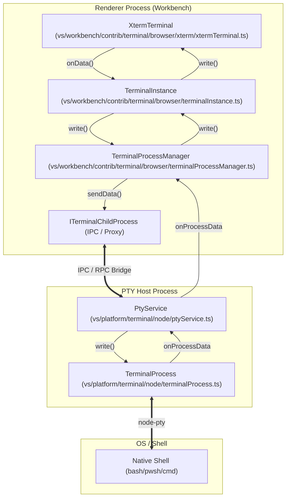
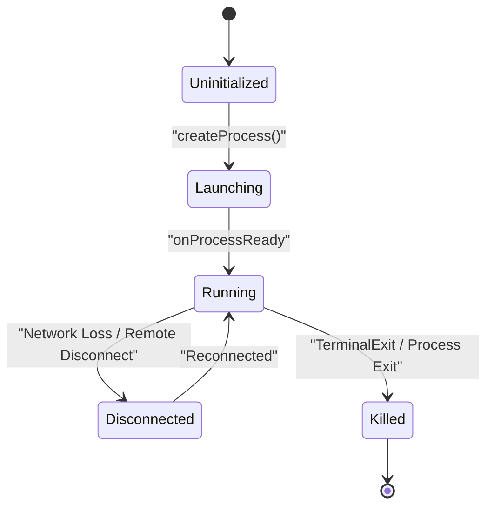

# Terminal Architecture and Process Management

Relevant source files

The following files were used as context for generating this wiki page:

- [src/vs/platform/terminal/common/terminal.ts](src/vs/platform/terminal/common/terminal.ts)
- [src/vs/platform/terminal/node/ptyHostService.ts](src/vs/platform/terminal/node/ptyHostService.ts)
- [src/vs/platform/terminal/node/ptyService.ts](src/vs/platform/terminal/node/ptyService.ts)
- [src/vs/platform/terminal/node/terminalProcess.ts](src/vs/platform/terminal/node/terminalProcess.ts)
- [src/vs/workbench/api/browser/mainThreadTerminalService.ts](src/vs/workbench/api/browser/mainThreadTerminalService.ts)
- [src/vs/workbench/api/common/extHostTerminalService.ts](src/vs/workbench/api/common/extHostTerminalService.ts)
- [src/vs/workbench/contrib/terminal/browser/media/terminal.css](src/vs/workbench/contrib/terminal/browser/media/terminal.css)
- [src/vs/workbench/contrib/terminal/browser/media/xterm.css](src/vs/workbench/contrib/terminal/browser/media/xterm.css)
- [src/vs/workbench/contrib/terminal/browser/remotePty.ts](src/vs/workbench/contrib/terminal/browser/remotePty.ts)
- [src/vs/workbench/contrib/terminal/browser/terminal.contribution.ts](src/vs/workbench/contrib/terminal/browser/terminal.contribution.ts)
- [src/vs/workbench/contrib/terminal/browser/terminal.ts](src/vs/workbench/contrib/terminal/browser/terminal.ts)
- [src/vs/workbench/contrib/terminal/browser/terminalActions.ts](src/vs/workbench/contrib/terminal/browser/terminalActions.ts)
- [src/vs/workbench/contrib/terminal/browser/terminalEditor.ts](src/vs/workbench/contrib/terminal/browser/terminalEditor.ts)
- [src/vs/workbench/contrib/terminal/browser/terminalEditorInput.ts](src/vs/workbench/contrib/terminal/browser/terminalEditorInput.ts)
- [src/vs/workbench/contrib/terminal/browser/terminalEditorService.ts](src/vs/workbench/contrib/terminal/browser/terminalEditorService.ts)
- [src/vs/workbench/contrib/terminal/browser/terminalGroup.ts](src/vs/workbench/contrib/terminal/browser/terminalGroup.ts)
- [src/vs/workbench/contrib/terminal/browser/terminalGroupService.ts](src/vs/workbench/contrib/terminal/browser/terminalGroupService.ts)
- [src/vs/workbench/contrib/terminal/browser/terminalInstance.ts](src/vs/workbench/contrib/terminal/browser/terminalInstance.ts)
- [src/vs/workbench/contrib/terminal/browser/terminalMenus.ts](src/vs/workbench/contrib/terminal/browser/terminalMenus.ts)
- [src/vs/workbench/contrib/terminal/browser/terminalProcessExtHostProxy.ts](src/vs/workbench/contrib/terminal/browser/terminalProcessExtHostProxy.ts)
- [src/vs/workbench/contrib/terminal/browser/terminalProcessManager.ts](src/vs/workbench/contrib/terminal/browser/terminalProcessManager.ts)
- [src/vs/workbench/contrib/terminal/browser/terminalService.ts](src/vs/workbench/contrib/terminal/browser/terminalService.ts)
- [src/vs/workbench/contrib/terminal/browser/terminalTabbedView.ts](src/vs/workbench/contrib/terminal/browser/terminalTabbedView.ts)
- [src/vs/workbench/contrib/terminal/browser/terminalTabsList.ts](src/vs/workbench/contrib/terminal/browser/terminalTabsList.ts)
- [src/vs/workbench/contrib/terminal/browser/terminalView.ts](src/vs/workbench/contrib/terminal/browser/terminalView.ts)
- [src/vs/workbench/contrib/terminal/browser/xterm/decorationAddon.ts](src/vs/workbench/contrib/terminal/browser/xterm/decorationAddon.ts)
- [src/vs/workbench/contrib/terminal/browser/xterm/xtermTerminal.ts](src/vs/workbench/contrib/terminal/browser/xterm/xtermTerminal.ts)
- [src/vs/workbench/contrib/terminal/common/terminal.ts](src/vs/workbench/contrib/terminal/common/terminal.ts)
- [src/vs/workbench/contrib/terminal/common/terminalColorRegistry.ts](src/vs/workbench/contrib/terminal/common/terminalColorRegistry.ts)
- [src/vs/workbench/contrib/terminal/common/terminalConfiguration.ts](src/vs/workbench/contrib/terminal/common/terminalConfiguration.ts)
- [src/vs/workbench/contrib/terminal/common/terminalStrings.ts](src/vs/workbench/contrib/terminal/common/terminalStrings.ts)
- [src/vs/workbench/contrib/terminal/test/browser/terminalInstance.test.ts](src/vs/workbench/contrib/terminal/test/browser/terminalInstance.test.ts)

The VS Code terminal system follows a multi-process architecture designed to isolate the UI from the underlying shell processes. This architecture ensures that a hanging shell or a heavy I/O operation in the terminal does not freeze the workbench UI. The system is built around a triad of management classes in the renderer process, a dedicated PTY host process for process lifecycle management, and the `node-pty` library for native pseudoterminal integration.

## Core Architecture Triad

The terminal's lifecycle and interaction are managed by three primary classes within the renderer:

1.  **`TerminalInstance`**: Represents a single terminal UI element. It manages the `XtermTerminal` wrapper, handles UI-specific logic like context menus and tooltips, and coordinates with the process manager [src/vs/workbench/contrib/terminal/browser/terminalInstance.ts:481-483]().
2.  **`TerminalService`**: The central orchestrator that manages the collection of all terminal instances across the workbench, including those in the panel and editor areas [src/vs/workbench/contrib/terminal/browser/terminalService.ts:66-70](). It handles global state like connection state and group restoration [src/vs/workbench/contrib/terminal/browser/terminalService.ts:88-95]().
3.  **`TerminalProcessManager`**: Holds all state related to the creation and management of terminal processes. It acts as the communication bridge between a `TerminalInstance` and the backend [src/vs/workbench/contrib/terminal/browser/terminalProcessManager.ts:74-85]().

### Data Flow: Input and Output

The following diagram illustrates the path data takes from the user's keyboard to the shell and back to the screen, mapping system concepts to specific code entities.

**Terminal Data Flow and Entity Mapping**

Sources: [src/vs/workbench/contrib/terminal/browser/terminalInstance.ts:481-483](), [src/vs/workbench/contrib/terminal/browser/terminalProcessManager.ts:74-85](), [src/vs/platform/terminal/node/ptyService.ts:97-103](), [src/vs/platform/terminal/node/terminalProcess.ts:22-25]()

## Process Management and the PTY Host

To maintain stability, terminal processes are not spawned directly by the renderer. Instead, they are managed by a **PTY Host** (local or remote).

### PtyHostService and TerminalProcess
The `PtyService` (running in the PTY Host) acts as a server for terminal operations. It utilizes `TerminalProcess` which wraps `node-pty` to spawn and manage the lifecycle of the shell.

*   **Process Creation**: When `TerminalProcessManager` requests a new process via `createProcess`, the `PtyService` assigns a unique ID and spawns the shell [src/vs/platform/terminal/node/ptyService.ts:121-135]().
*   **Persistence**: The PTY Host allows terminals to persist across window reloads. When the workbench reloads, it can "re-attach" to existing processes in the PTY Host by their ID [src/vs/platform/terminal/node/ptyService.ts:100-104]().
*   **Replay**: For persistent sessions, the PTY host can replay recent data to the renderer using `IPtyHostProcessReplayEvent` to restore the terminal's visual state [src/vs/platform/terminal/node/ptyService.ts:128-129]().

### Flow Control and Acknowledgment
To prevent the PTY Host from overwhelming the Renderer with data (which could lead to high memory usage and UI lag), VS Code implements a flow control mechanism.

*   **Acknowledgment**: The Renderer sends an "ack" signal back to the PTY Host after it has processed a certain amount of data. This is handled by the `AckDataBufferer` in the process manager [src/vs/workbench/contrib/terminal/browser/terminalProcessManager.ts:94-95]().
*   **Constants**: Flow control thresholds are defined by `FlowControlConstants`, ensuring that the PTY host pauses if the unacknowledged data exceeds a specific limit [src/vs/platform/terminal/common/terminal.ts:21-21]().

Sources: [src/vs/platform/terminal/node/ptyService.ts:97-103](), [src/vs/workbench/contrib/terminal/browser/terminalProcessManager.ts:93-95](), [src/vs/platform/terminal/common/terminal.ts:21-21]()

## Terminal Groups and Layouts

Terminals are organized into **Groups**, which allow for splitting the terminal view into multiple panes.

### TerminalGroup and Splitting
A `TerminalGroup` contains one or more `TerminalInstance` objects. When a user "splits" a terminal, a new instance is created and added to the existing group.

*   **`ITerminalGroupService`**: Manages the lifecycle of groups in the terminal panel [src/vs/workbench/contrib/terminal/browser/terminal.ts:44-44]().
*   **Split CWD**: When splitting, the system can attempt to detect the current working directory of the active terminal via `getCwdForSplit` to launch the new split in the same location [src/vs/workbench/contrib/terminal/browser/terminalActions.ts:92-105]().

### TerminalEditor vs. Panel Mode
Terminals can reside in two primary locations:
1.  **Panel**: The traditional bottom area managed by `TerminalGroupService` and rendered in the `TerminalViewPane` [src/vs/workbench/contrib/terminal/browser/terminalView.ts:57-60]().
2.  **Editor Area**: Managed by `ITerminalEditorService`. These terminals behave like standard text editors, supporting tabs and editor groups [src/vs/workbench/contrib/terminal/browser/terminal.ts:42-42]().

The `TerminalEditorInput` is used to represent a terminal within the workbench editor machinery, allowing terminals to be dragged between editor groups [src/vs/workbench/contrib/terminal/browser/terminalEditorInput.ts:34-40]().

Sources: [src/vs/workbench/contrib/terminal/browser/terminal.ts:41-45](), [src/vs/workbench/contrib/terminal/browser/terminalService.ts:97-100](), [src/vs/workbench/contrib/terminal/browser/terminalEditorInput.ts:34-40](), [src/vs/workbench/contrib/terminal/browser/terminalView.ts:57-60]()

## Key Classes and Responsibilities

| Class | Responsibility |
| :--- | :--- |
| `TerminalInstance` | UI state, xterm.js integration, context menu, and accessibility support [src/vs/workbench/contrib/terminal/browser/terminalInstance.ts:481](). |
| `TerminalService` | High-level API for creating/finding terminals and managing active state [src/vs/workbench/contrib/terminal/browser/terminalService.ts:66](). |
| `TerminalProcessManager` | Orchestrates the process lifecycle and data flow to the backend [src/vs/workbench/contrib/terminal/browser/terminalProcessManager.ts:74](). |
| `PtyService` | Server-side logic for managing native PTYs and process persistence [src/vs/platform/terminal/node/ptyService.ts:97](). |
| `XtermTerminal` | Wrapper around `xterm.js` to integrate with VS Code themes and configuration [src/vs/workbench/contrib/terminal/browser/xterm/xtermTerminal.ts:116](). |

**Process Lifecycle State Machine**

Sources: [src/vs/workbench/contrib/terminal/browser/terminalProcessManager.ts:74-80](), [src/vs/workbench/contrib/terminal/common/terminal.ts:29-30]()

## Integration with Extension Host

Extensions can interact with terminals via the `vscode.window.createTerminal` API. This triggers a flow through the `ExtHostTerminalService`.

1.  **Request**: `ExtHostTerminalService` calls the `MainThreadTerminalService` via RPC to create a terminal [src/vs/workbench/api/common/extHostTerminalService.ts:105-110]().
2.  **Pseudoterminals**: Extensions can provide their own terminal logic using the `Pseudoterminal` interface. In this case, `TerminalProcessExtHostProxy` is used to route data between the renderer and the extension host instead of a PTY process [src/vs/workbench/contrib/terminal/browser/terminalProcessExtHostProxy.ts:20-25]().
3.  **Environment Variables**: Extensions can contribute environment variables via `getEnvironmentVariableCollection`, which are then merged and sent to the PTY host during process creation [src/vs/workbench/api/common/extHostTerminalService.ts:60-60]().

Sources: [src/vs/workbench/api/common/extHostTerminalService.ts:35-64](), [src/vs/workbench/contrib/terminal/browser/terminalProcessExtHostProxy.ts:20-25]()