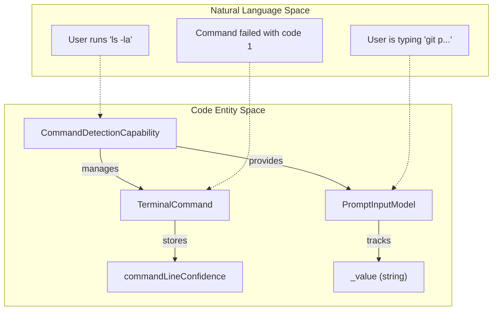
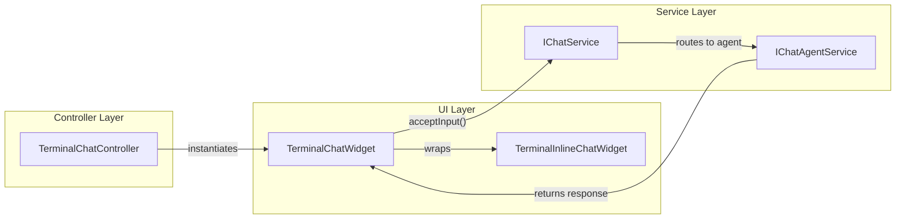

# Shell Integration and Terminal Contributions

Relevant source files

The following files were used as context for generating this wiki page:

- [extensions/terminal-suggest/src/completions/code-tunnel-insiders.ts](https://github.com/microsoft/vscode/blob/HEAD/extensions/terminal-suggest/src/completions/code-tunnel-insiders.ts)
- [extensions/terminal-suggest/src/completions/code-tunnel.ts](https://github.com/microsoft/vscode/blob/HEAD/extensions/terminal-suggest/src/completions/code-tunnel.ts)
- [extensions/terminal-suggest/src/completions/code.ts](https://github.com/microsoft/vscode/blob/HEAD/extensions/terminal-suggest/src/completions/code.ts)
- [extensions/terminal-suggest/src/fig/figInterface.ts](https://github.com/microsoft/vscode/blob/HEAD/extensions/terminal-suggest/src/fig/figInterface.ts)
- [extensions/terminal-suggest/src/helpers/completionItem.ts](https://github.com/microsoft/vscode/blob/HEAD/extensions/terminal-suggest/src/helpers/completionItem.ts)
- [extensions/terminal-suggest/src/terminalSuggestMain.ts](https://github.com/microsoft/vscode/blob/HEAD/extensions/terminal-suggest/src/terminalSuggestMain.ts)
- [extensions/terminal-suggest/src/test/completions/cd.test.ts](https://github.com/microsoft/vscode/blob/HEAD/extensions/terminal-suggest/src/test/completions/cd.test.ts)
- [extensions/terminal-suggest/src/test/completions/code-insiders.test.ts](https://github.com/microsoft/vscode/blob/HEAD/extensions/terminal-suggest/src/test/completions/code-insiders.test.ts)
- [extensions/terminal-suggest/src/test/completions/code.test.ts](https://github.com/microsoft/vscode/blob/HEAD/extensions/terminal-suggest/src/test/completions/code.test.ts)
- [extensions/terminal-suggest/src/test/completions/upstream/echo.test.ts](https://github.com/microsoft/vscode/blob/HEAD/extensions/terminal-suggest/src/test/completions/upstream/echo.test.ts)
- [extensions/terminal-suggest/src/test/completions/upstream/git.test.ts](https://github.com/microsoft/vscode/blob/HEAD/extensions/terminal-suggest/src/test/completions/upstream/git.test.ts)
- [extensions/terminal-suggest/src/test/completions/upstream/ls.test.ts](https://github.com/microsoft/vscode/blob/HEAD/extensions/terminal-suggest/src/test/completions/upstream/ls.test.ts)
- [extensions/terminal-suggest/src/test/completions/upstream/mkdir.test.ts](https://github.com/microsoft/vscode/blob/HEAD/extensions/terminal-suggest/src/test/completions/upstream/mkdir.test.ts)
- [extensions/terminal-suggest/src/test/completions/upstream/rm.test.ts](https://github.com/microsoft/vscode/blob/HEAD/extensions/terminal-suggest/src/test/completions/upstream/rm.test.ts)
- [extensions/terminal-suggest/src/test/completions/upstream/rmdir.test.ts](https://github.com/microsoft/vscode/blob/HEAD/extensions/terminal-suggest/src/test/completions/upstream/rmdir.test.ts)
- [extensions/terminal-suggest/src/test/completions/upstream/touch.test.ts](https://github.com/microsoft/vscode/blob/HEAD/extensions/terminal-suggest/src/test/completions/upstream/touch.test.ts)
- [extensions/terminal-suggest/src/test/fig.test.ts](https://github.com/microsoft/vscode/blob/HEAD/extensions/terminal-suggest/src/test/fig.test.ts)
- [extensions/terminal-suggest/src/test/helpers.ts](https://github.com/microsoft/vscode/blob/HEAD/extensions/terminal-suggest/src/test/helpers.ts)
- [extensions/terminal-suggest/src/test/terminalSuggestMain.test.ts](https://github.com/microsoft/vscode/blob/HEAD/extensions/terminal-suggest/src/test/terminalSuggestMain.test.ts)
- [extensions/vscode-api-tests/src/singlefolder-tests/terminal.shellIntegration.test.ts](https://github.com/microsoft/vscode/blob/HEAD/extensions/vscode-api-tests/src/singlefolder-tests/terminal.shellIntegration.test.ts)
- [src/vs/editor/contrib/suggest/browser/suggestWidgetStatus.ts](https://github.com/microsoft/vscode/blob/HEAD/src/vs/editor/contrib/suggest/browser/suggestWidgetStatus.ts)
- [src/vs/platform/agentHost/node/commandAutoApprover.ts](https://github.com/microsoft/vscode/blob/HEAD/src/vs/platform/agentHost/node/commandAutoApprover.ts)
- [src/vs/platform/agentHost/node/sessionPermissions.ts](https://github.com/microsoft/vscode/blob/HEAD/src/vs/platform/agentHost/node/sessionPermissions.ts)
- [src/vs/platform/agentHost/test/node/commandAutoApprover.test.ts](https://github.com/microsoft/vscode/blob/HEAD/src/vs/platform/agentHost/test/node/commandAutoApprover.test.ts)
- [src/vs/platform/agentHost/test/node/sessionPermissions.test.ts](https://github.com/microsoft/vscode/blob/HEAD/src/vs/platform/agentHost/test/node/sessionPermissions.test.ts)
- [src/vs/platform/chat/common/chatSettings.ts](https://github.com/microsoft/vscode/blob/HEAD/src/vs/platform/chat/common/chatSettings.ts)
- [src/vs/platform/terminal/common/autoApprove/cmdDelayedExpansion.ts](https://github.com/microsoft/vscode/blob/HEAD/src/vs/platform/terminal/common/autoApprove/cmdDelayedExpansion.ts)
- [src/vs/platform/terminal/common/autoApprove/sortAutoApproveRules.ts](https://github.com/microsoft/vscode/blob/HEAD/src/vs/platform/terminal/common/autoApprove/sortAutoApproveRules.ts)
- [src/vs/platform/terminal/common/capabilities/capabilities.ts](https://github.com/microsoft/vscode/blob/HEAD/src/vs/platform/terminal/common/capabilities/capabilities.ts)
- [src/vs/platform/terminal/common/capabilities/commandDetection/terminalCommand.ts](https://github.com/microsoft/vscode/blob/HEAD/src/vs/platform/terminal/common/capabilities/commandDetection/terminalCommand.ts)
- [src/vs/platform/terminal/common/capabilities/commandDetectionCapability.ts](https://github.com/microsoft/vscode/blob/HEAD/src/vs/platform/terminal/common/capabilities/commandDetectionCapability.ts)
- [src/vs/platform/terminal/common/capabilities/cwdDetectionCapability.ts](https://github.com/microsoft/vscode/blob/HEAD/src/vs/platform/terminal/common/capabilities/cwdDetectionCapability.ts)
- [src/vs/platform/terminal/common/capabilities/shellEnvDetectionCapability.ts](https://github.com/microsoft/vscode/blob/HEAD/src/vs/platform/terminal/common/capabilities/shellEnvDetectionCapability.ts)
- [src/vs/platform/terminal/common/capabilities/terminalCapabilityStore.ts](https://github.com/microsoft/vscode/blob/HEAD/src/vs/platform/terminal/common/capabilities/terminalCapabilityStore.ts)
- [src/vs/platform/terminal/common/xterm/shellIntegrationAddon.ts](https://github.com/microsoft/vscode/blob/HEAD/src/vs/platform/terminal/common/xterm/shellIntegrationAddon.ts)
- [src/vs/platform/terminal/node/terminalEnvironment.ts](https://github.com/microsoft/vscode/blob/HEAD/src/vs/platform/terminal/node/terminalEnvironment.ts)
- [src/vs/platform/terminal/test/common/autoApprove/cmdDelayedExpansion.test.ts](https://github.com/microsoft/vscode/blob/HEAD/src/vs/platform/terminal/test/common/autoApprove/cmdDelayedExpansion.test.ts)
- [src/vs/platform/terminal/test/node/terminalEnvironment.test.ts](https://github.com/microsoft/vscode/blob/HEAD/src/vs/platform/terminal/test/node/terminalEnvironment.test.ts)
- [src/vs/sessions/browser/parts/editorParts.ts](https://github.com/microsoft/vscode/blob/HEAD/src/vs/sessions/browser/parts/editorParts.ts)
- [src/vs/workbench/api/browser/mainThreadTerminalShellIntegration.ts](https://github.com/microsoft/vscode/blob/HEAD/src/vs/workbench/api/browser/mainThreadTerminalShellIntegration.ts)
- [src/vs/workbench/api/common/extHostTerminalShellIntegration.ts](https://github.com/microsoft/vscode/blob/HEAD/src/vs/workbench/api/common/extHostTerminalShellIntegration.ts)
- [src/vs/workbench/api/test/common/extHostTerminalShellIntegration.test.ts](https://github.com/microsoft/vscode/blob/HEAD/src/vs/workbench/api/test/common/extHostTerminalShellIntegration.test.ts)
- [src/vs/workbench/contrib/terminal/browser/terminalEvents.ts](https://github.com/microsoft/vscode/blob/HEAD/src/vs/workbench/contrib/terminal/browser/terminalEvents.ts)
- [src/vs/workbench/contrib/terminal/browser/terminalTabsChatEntry.ts](https://github.com/microsoft/vscode/blob/HEAD/src/vs/workbench/contrib/terminal/browser/terminalTabsChatEntry.ts)
- [src/vs/workbench/contrib/terminal/browser/xterm-private.d.ts](https://github.com/microsoft/vscode/blob/HEAD/src/vs/workbench/contrib/terminal/browser/xterm-private.d.ts)
- [src/vs/workbench/contrib/terminal/browser/xterm/markNavigationAddon.ts](https://github.com/microsoft/vscode/blob/HEAD/src/vs/workbench/contrib/terminal/browser/xterm/markNavigationAddon.ts)
- [src/vs/workbench/contrib/terminal/common/scripts/shellIntegration-bash.sh](https://github.com/microsoft/vscode/blob/HEAD/src/vs/workbench/contrib/terminal/common/scripts/shellIntegration-bash.sh)
- [src/vs/workbench/contrib/terminal/common/scripts/shellIntegration-rc.zsh](https://github.com/microsoft/vscode/blob/HEAD/src/vs/workbench/contrib/terminal/common/scripts/shellIntegration-rc.zsh)
- [src/vs/workbench/contrib/terminal/common/scripts/shellIntegration.fish](https://github.com/microsoft/vscode/blob/HEAD/src/vs/workbench/contrib/terminal/common/scripts/shellIntegration.fish)
- [src/vs/workbench/contrib/terminal/common/scripts/shellIntegration.ps1](https://github.com/microsoft/vscode/blob/HEAD/src/vs/workbench/contrib/terminal/common/scripts/shellIntegration.ps1)
- [src/vs/workbench/contrib/terminal/common/terminalContextKey.ts](https://github.com/microsoft/vscode/blob/HEAD/src/vs/workbench/contrib/terminal/common/terminalContextKey.ts)
- [src/vs/workbench/contrib/terminal/common/terminalExtensionPoints.ts](https://github.com/microsoft/vscode/blob/HEAD/src/vs/workbench/contrib/terminal/common/terminalExtensionPoints.ts)
- [src/vs/workbench/contrib/terminal/test/browser/capabilities/commandDetectionCapability.test.ts](https://github.com/microsoft/vscode/blob/HEAD/src/vs/workbench/contrib/terminal/test/browser/capabilities/commandDetectionCapability.test.ts)
- [src/vs/workbench/contrib/terminal/test/browser/capabilities/partialCommandDetectionCapability.test.ts](https://github.com/microsoft/vscode/blob/HEAD/src/vs/workbench/contrib/terminal/test/browser/capabilities/partialCommandDetectionCapability.test.ts)
- [src/vs/workbench/contrib/terminal/test/browser/capabilities/terminalCapabilityStore.test.ts](https://github.com/microsoft/vscode/blob/HEAD/src/vs/workbench/contrib/terminal/test/browser/capabilities/terminalCapabilityStore.test.ts)
- [src/vs/workbench/contrib/terminal/test/browser/terminalEvents.test.ts](https://github.com/microsoft/vscode/blob/HEAD/src/vs/workbench/contrib/terminal/test/browser/terminalEvents.test.ts)
- [src/vs/workbench/contrib/terminal/test/browser/terminalProfileService.integrationTest.ts](https://github.com/microsoft/vscode/blob/HEAD/src/vs/workbench/contrib/terminal/test/browser/terminalProfileService.integrationTest.ts)
- [src/vs/workbench/contrib/terminal/test/browser/terminalService.test.ts](https://github.com/microsoft/vscode/blob/HEAD/src/vs/workbench/contrib/terminal/test/browser/terminalService.test.ts)
- [src/vs/workbench/contrib/terminal/test/browser/xterm/decorationAddon.test.ts](https://github.com/microsoft/vscode/blob/HEAD/src/vs/workbench/contrib/terminal/test/browser/xterm/decorationAddon.test.ts)
- [src/vs/workbench/contrib/terminal/test/browser/xterm/lineDataEventAddon.test.ts](https://github.com/microsoft/vscode/blob/HEAD/src/vs/workbench/contrib/terminal/test/browser/xterm/lineDataEventAddon.test.ts)
- [src/vs/workbench/contrib/terminal/test/browser/xterm/shellIntegrationAddon.test.ts](https://github.com/microsoft/vscode/blob/HEAD/src/vs/workbench/contrib/terminal/test/browser/xterm/shellIntegrationAddon.test.ts)
- [src/vs/workbench/contrib/terminal/test/browser/xterm/xtermTerminal.test.ts](https://github.com/microsoft/vscode/blob/HEAD/src/vs/workbench/contrib/terminal/test/browser/xterm/xtermTerminal.test.ts)
- [src/vs/workbench/contrib/terminalContrib/accessibility/browser/bufferContentTracker.ts](https://github.com/microsoft/vscode/blob/HEAD/src/vs/workbench/contrib/terminalContrib/accessibility/browser/bufferContentTracker.ts)
- [src/vs/workbench/contrib/terminalContrib/accessibility/test/browser/bufferContentTracker.test.ts](https://github.com/microsoft/vscode/blob/HEAD/src/vs/workbench/contrib/terminalContrib/accessibility/test/browser/bufferContentTracker.test.ts)
- [src/vs/workbench/contrib/terminalContrib/chat/browser/media/terminalChatWidget.css](https://github.com/microsoft/vscode/blob/HEAD/src/vs/workbench/contrib/terminalContrib/chat/browser/media/terminalChatWidget.css)
- [src/vs/workbench/contrib/terminalContrib/chat/browser/terminal.chat.contribution.ts](https://github.com/microsoft/vscode/blob/HEAD/src/vs/workbench/contrib/terminalContrib/chat/browser/terminal.chat.contribution.ts)
- [src/vs/workbench/contrib/terminalContrib/chat/browser/terminalChat.ts](https://github.com/microsoft/vscode/blob/HEAD/src/vs/workbench/contrib/terminalContrib/chat/browser/terminalChat.ts)
- [src/vs/workbench/contrib/terminalContrib/chat/browser/terminalChatAccessibilityHelp.ts](https://github.com/microsoft/vscode/blob/HEAD/src/vs/workbench/contrib/terminalContrib/chat/browser/terminalChatAccessibilityHelp.ts)
- [src/vs/workbench/contrib/terminalContrib/chat/browser/terminalChatAccessibleView.ts](https://github.com/microsoft/vscode/blob/HEAD/src/vs/workbench/contrib/terminalContrib/chat/browser/terminalChatAccessibleView.ts)
- [src/vs/workbench/contrib/terminalContrib/chat/browser/terminalChatActions.ts](https://github.com/microsoft/vscode/blob/HEAD/src/vs/workbench/contrib/terminalContrib/chat/browser/terminalChatActions.ts)
- [src/vs/workbench/contrib/terminalContrib/chat/browser/terminalChatController.ts](https://github.com/microsoft/vscode/blob/HEAD/src/vs/workbench/contrib/terminalContrib/chat/browser/terminalChatController.ts)
- [src/vs/workbench/contrib/terminalContrib/chat/browser/terminalChatService.ts](https://github.com/microsoft/vscode/blob/HEAD/src/vs/workbench/contrib/terminalContrib/chat/browser/terminalChatService.ts)
- [src/vs/workbench/contrib/terminalContrib/chat/browser/terminalChatWidget.ts](https://github.com/microsoft/vscode/blob/HEAD/src/vs/workbench/contrib/terminalContrib/chat/browser/terminalChatWidget.ts)
- [src/vs/workbench/contrib/terminalContrib/chatAgentTools/browser/largeOutputFileWriter.ts](https://github.com/microsoft/vscode/blob/HEAD/src/vs/workbench/contrib/terminalContrib/chatAgentTools/browser/largeOutputFileWriter.ts)
- [src/vs/workbench/contrib/terminalContrib/chatAgentTools/browser/outputHelpers.ts](https://github.com/microsoft/vscode/blob/HEAD/src/vs/workbench/contrib/terminalContrib/chatAgentTools/browser/outputHelpers.ts)
- [src/vs/workbench/contrib/terminalContrib/chatAgentTools/browser/runInTerminalHelpers.ts](https://github.com/microsoft/vscode/blob/HEAD/src/vs/workbench/contrib/terminalContrib/chatAgentTools/browser/runInTerminalHelpers.ts)
- [src/vs/workbench/contrib/terminalContrib/chatAgentTools/browser/tools/commandLineAnalyzer/autoApprove/commandLineAutoApprover.ts](https://github.com/microsoft/vscode/blob/HEAD/src/vs/workbench/contrib/terminalContrib/chatAgentTools/browser/tools/commandLineAnalyzer/autoApprove/commandLineAutoApprover.ts)
- [src/vs/workbench/contrib/terminalContrib/chatAgentTools/browser/tools/commandLineAnalyzer/autoApprove/npmScriptAutoApprover.ts](https://github.com/microsoft/vscode/blob/HEAD/src/vs/workbench/contrib/terminalContrib/chatAgentTools/browser/tools/commandLineAnalyzer/autoApprove/npmScriptAutoApprover.ts)
- [src/vs/workbench/contrib/terminalContrib/chatAgentTools/browser/tools/commandLineAnalyzer/commandLineAnalyzer.ts](https://github.com/microsoft/vscode/blob/HEAD/src/vs/workbench/contrib/terminalContrib/chatAgentTools/browser/tools/commandLineAnalyzer/commandLineAnalyzer.ts)
- [src/vs/workbench/contrib/terminalContrib/chatAgentTools/browser/tools/commandLineAnalyzer/commandLineAutoApproveAnalyzer.ts](https://github.com/microsoft/vscode/blob/HEAD/src/vs/workbench/contrib/terminalContrib/chatAgentTools/browser/tools/commandLineAnalyzer/commandLineAutoApproveAnalyzer.ts)
- [src/vs/workbench/contrib/terminalContrib/chatAgentTools/browser/tools/commandLineAnalyzer/commandLineFileWriteAnalyzer.ts](https://github.com/microsoft/vscode/blob/HEAD/src/vs/workbench/contrib/terminalContrib/chatAgentTools/browser/tools/commandLineAnalyzer/commandLineFileWriteAnalyzer.ts)
- [src/vs/workbench/contrib/terminalContrib/chatAgentTools/browser/tools/commandLineRewriter/commandLineCdPrefixRewriter.ts](https://github.com/microsoft/vscode/blob/HEAD/src/vs/workbench/contrib/terminalContrib/chatAgentTools/browser/tools/commandLineRewriter/commandLineCdPrefixRewriter.ts)
- [src/vs/workbench/contrib/terminalContrib/chatAgentTools/browser/tools/commandLineRewriter/commandLinePwshChainOperatorRewriter.ts](https://github.com/microsoft/vscode/blob/HEAD/src/vs/workbench/contrib/terminalContrib/chatAgentTools/browser/tools/commandLineRewriter/commandLinePwshChainOperatorRewriter.ts)
- [src/vs/workbench/contrib/terminalContrib/chatAgentTools/browser/tools/getTerminalOutputTool.ts](https://github.com/microsoft/vscode/blob/HEAD/src/vs/workbench/contrib/terminalContrib/chatAgentTools/browser/tools/getTerminalOutputTool.ts)
- [src/vs/workbench/contrib/terminalContrib/chatAgentTools/browser/tools/killTerminalTool.ts](https://github.com/microsoft/vscode/blob/HEAD/src/vs/workbench/contrib/terminalContrib/chatAgentTools/browser/tools/killTerminalTool.ts)
- [src/vs/workbench/contrib/terminalContrib/chatAgentTools/browser/tools/runInTerminalConfirmationTool.ts](https://github.com/microsoft/vscode/blob/HEAD/src/vs/workbench/contrib/terminalContrib/chatAgentTools/browser/tools/runInTerminalConfirmationTool.ts)
- [src/vs/workbench/contrib/terminalContrib/chatAgentTools/browser/tools/sendToTerminalTool.ts](https://github.com/microsoft/vscode/blob/HEAD/src/vs/workbench/contrib/terminalContrib/chatAgentTools/browser/tools/sendToTerminalTool.ts)
- [src/vs/workbench/contrib/terminalContrib/chatAgentTools/browser/tools/toolIds.ts](https://github.com/microsoft/vscode/blob/HEAD/src/vs/workbench/contrib/terminalContrib/chatAgentTools/browser/tools/toolIds.ts)
- [src/vs/workbench/contrib/terminalContrib/chatAgentTools/browser/treeSitterCommandParser.ts](https://github.com/microsoft/vscode/blob/HEAD/src/vs/workbench/contrib/terminalContrib/chatAgentTools/browser/treeSitterCommandParser.ts)
- [src/vs/workbench/contrib/terminalContrib/chatAgentTools/test/browser/commandLineAutoApprover.test.ts](https://github.com/microsoft/vscode/blob/HEAD/src/vs/workbench/contrib/terminalContrib/chatAgentTools/test/browser/commandLineAutoApprover.test.ts)
- [src/vs/workbench/contrib/terminalContrib/chatAgentTools/test/browser/getTerminalOutputTool.test.ts](https://github.com/microsoft/vscode/blob/HEAD/src/vs/workbench/contrib/terminalContrib/chatAgentTools/test/browser/getTerminalOutputTool.test.ts)
- [src/vs/workbench/contrib/terminalContrib/chatAgentTools/test/browser/outputHelpers.test.ts](https://github.com/microsoft/vscode/blob/HEAD/src/vs/workbench/contrib/terminalContrib/chatAgentTools/test/browser/outputHelpers.test.ts)
- [src/vs/workbench/contrib/terminalContrib/chatAgentTools/test/browser/runInTerminalHelpers.test.ts](https://github.com/microsoft/vscode/blob/HEAD/src/vs/workbench/contrib/terminalContrib/chatAgentTools/test/browser/runInTerminalHelpers.test.ts)
- [src/vs/workbench/contrib/terminalContrib/chatAgentTools/test/browser/sendToTerminalTool.test.ts](https://github.com/microsoft/vscode/blob/HEAD/src/vs/workbench/contrib/terminalContrib/chatAgentTools/test/browser/sendToTerminalTool.test.ts)
- [src/vs/workbench/contrib/terminalContrib/chatAgentTools/test/electron-browser/commandLineAnalyzer/commandLineFileWriteAnalyzer.test.ts](https://github.com/microsoft/vscode/blob/HEAD/src/vs/workbench/contrib/terminalContrib/chatAgentTools/test/electron-browser/commandLineAnalyzer/commandLineFileWriteAnalyzer.test.ts)
- [src/vs/workbench/contrib/terminalContrib/chatAgentTools/test/electron-browser/commandLineAnalyzer/npmScriptAutoApprover.test.ts](https://github.com/microsoft/vscode/blob/HEAD/src/vs/workbench/contrib/terminalContrib/chatAgentTools/test/electron-browser/commandLineAnalyzer/npmScriptAutoApprover.test.ts)
- [src/vs/workbench/contrib/terminalContrib/chatAgentTools/test/electron-browser/commandLineCdPrefixRewriter.test.ts](https://github.com/microsoft/vscode/blob/HEAD/src/vs/workbench/contrib/terminalContrib/chatAgentTools/test/electron-browser/commandLineCdPrefixRewriter.test.ts)
- [src/vs/workbench/contrib/terminalContrib/chatAgentTools/test/electron-browser/commandLinePwshChainOperatorRewriter.test.ts](https://github.com/microsoft/vscode/blob/HEAD/src/vs/workbench/contrib/terminalContrib/chatAgentTools/test/electron-browser/commandLinePwshChainOperatorRewriter.test.ts)
- [src/vs/workbench/contrib/terminalContrib/chatAgentTools/test/electron-browser/treeSitterCommandParser.test.ts](https://github.com/microsoft/vscode/blob/HEAD/src/vs/workbench/contrib/terminalContrib/chatAgentTools/test/electron-browser/treeSitterCommandParser.test.ts)
- [src/vs/workbench/contrib/terminalContrib/links/test/browser/terminalLinkOpeners.test.ts](https://github.com/microsoft/vscode/blob/HEAD/src/vs/workbench/contrib/terminalContrib/links/test/browser/terminalLinkOpeners.test.ts)
- [src/vs/workbench/contrib/terminalContrib/quickFix/browser/quickFix.ts](https://github.com/microsoft/vscode/blob/HEAD/src/vs/workbench/contrib/terminalContrib/quickFix/browser/quickFix.ts)
- [src/vs/workbench/contrib/terminalContrib/quickFix/browser/quickFixAddon.ts](https://github.com/microsoft/vscode/blob/HEAD/src/vs/workbench/contrib/terminalContrib/quickFix/browser/quickFixAddon.ts)
- [src/vs/workbench/contrib/terminalContrib/quickFix/browser/terminal.quickFix.contribution.ts](https://github.com/microsoft/vscode/blob/HEAD/src/vs/workbench/contrib/terminalContrib/quickFix/browser/terminal.quickFix.contribution.ts)
- [src/vs/workbench/contrib/terminalContrib/quickFix/browser/terminalQuickFixBuiltinActions.ts](https://github.com/microsoft/vscode/blob/HEAD/src/vs/workbench/contrib/terminalContrib/quickFix/browser/terminalQuickFixBuiltinActions.ts)
- [src/vs/workbench/contrib/terminalContrib/quickFix/browser/terminalQuickFixService.ts](https://github.com/microsoft/vscode/blob/HEAD/src/vs/workbench/contrib/terminalContrib/quickFix/browser/terminalQuickFixService.ts)
- [src/vs/workbench/contrib/terminalContrib/quickFix/test/browser/quickFixAddon.test.ts](https://github.com/microsoft/vscode/blob/HEAD/src/vs/workbench/contrib/terminalContrib/quickFix/test/browser/quickFixAddon.test.ts)
- [src/vs/workbench/contrib/terminalContrib/sendSequence/browser/terminal.sendSequence.contribution.ts](https://github.com/microsoft/vscode/blob/HEAD/src/vs/workbench/contrib/terminalContrib/sendSequence/browser/terminal.sendSequence.contribution.ts)
- [src/vs/workbench/contrib/terminalContrib/sendSignal/browser/terminal.sendSignal.contribution.ts](https://github.com/microsoft/vscode/blob/HEAD/src/vs/workbench/contrib/terminalContrib/sendSignal/browser/terminal.sendSignal.contribution.ts)
- [src/vs/workbench/contrib/terminalContrib/stickyScroll/browser/media/stickyScroll.css](https://github.com/microsoft/vscode/blob/HEAD/src/vs/workbench/contrib/terminalContrib/stickyScroll/browser/media/stickyScroll.css)
- [src/vs/workbench/contrib/terminalContrib/stickyScroll/browser/terminal.stickyScroll.contribution.ts](https://github.com/microsoft/vscode/blob/HEAD/src/vs/workbench/contrib/terminalContrib/stickyScroll/browser/terminal.stickyScroll.contribution.ts)
- [src/vs/workbench/contrib/terminalContrib/stickyScroll/browser/terminalStickyScrollColorRegistry.ts](https://github.com/microsoft/vscode/blob/HEAD/src/vs/workbench/contrib/terminalContrib/stickyScroll/browser/terminalStickyScrollColorRegistry.ts)
- [src/vs/workbench/contrib/terminalContrib/stickyScroll/browser/terminalStickyScrollContribution.ts](https://github.com/microsoft/vscode/blob/HEAD/src/vs/workbench/contrib/terminalContrib/stickyScroll/browser/terminalStickyScrollContribution.ts)
- [src/vs/workbench/contrib/terminalContrib/stickyScroll/browser/terminalStickyScrollOverlay.ts](https://github.com/microsoft/vscode/blob/HEAD/src/vs/workbench/contrib/terminalContrib/stickyScroll/browser/terminalStickyScrollOverlay.ts)
- [src/vs/workbench/contrib/terminalContrib/suggest/browser/lspCompletionProviderAddon.ts](https://github.com/microsoft/vscode/blob/HEAD/src/vs/workbench/contrib/terminalContrib/suggest/browser/lspCompletionProviderAddon.ts)
- [src/vs/workbench/contrib/terminalContrib/suggest/browser/lspTerminalModelContentProvider.ts](https://github.com/microsoft/vscode/blob/HEAD/src/vs/workbench/contrib/terminalContrib/suggest/browser/lspTerminalModelContentProvider.ts)
- [src/vs/workbench/contrib/terminalContrib/suggest/browser/lspTerminalUtil.ts](https://github.com/microsoft/vscode/blob/HEAD/src/vs/workbench/contrib/terminalContrib/suggest/browser/lspTerminalUtil.ts)
- [src/vs/workbench/contrib/terminalContrib/suggest/browser/media/terminalSymbolIcons.css](https://github.com/microsoft/vscode/blob/HEAD/src/vs/workbench/contrib/terminalContrib/suggest/browser/media/terminalSymbolIcons.css)
- [src/vs/workbench/contrib/terminalContrib/suggest/browser/terminal.suggest.contribution.ts](https://github.com/microsoft/vscode/blob/HEAD/src/vs/workbench/contrib/terminalContrib/suggest/browser/terminal.suggest.contribution.ts)
- [src/vs/workbench/contrib/terminalContrib/suggest/browser/terminalCompletionItem.ts](https://github.com/microsoft/vscode/blob/HEAD/src/vs/workbench/contrib/terminalContrib/suggest/browser/terminalCompletionItem.ts)
- [src/vs/workbench/contrib/terminalContrib/suggest/browser/terminalCompletionModel.ts](https://github.com/microsoft/vscode/blob/HEAD/src/vs/workbench/contrib/terminalContrib/suggest/browser/terminalCompletionModel.ts)
- [src/vs/workbench/contrib/terminalContrib/suggest/browser/terminalCompletionService.ts](https://github.com/microsoft/vscode/blob/HEAD/src/vs/workbench/contrib/terminalContrib/suggest/browser/terminalCompletionService.ts)
- [src/vs/workbench/contrib/terminalContrib/suggest/browser/terminalSuggestAddon.ts](https://github.com/microsoft/vscode/blob/HEAD/src/vs/workbench/contrib/terminalContrib/suggest/browser/terminalSuggestAddon.ts)
- [src/vs/workbench/contrib/terminalContrib/suggest/browser/terminalSuggestShownTracker.ts](https://github.com/microsoft/vscode/blob/HEAD/src/vs/workbench/contrib/terminalContrib/suggest/browser/terminalSuggestShownTracker.ts)
- [src/vs/workbench/contrib/terminalContrib/suggest/browser/terminalSymbolIcons.ts](https://github.com/microsoft/vscode/blob/HEAD/src/vs/workbench/contrib/terminalContrib/suggest/browser/terminalSymbolIcons.ts)
- [src/vs/workbench/contrib/terminalContrib/suggest/common/terminal.suggest.ts](https://github.com/microsoft/vscode/blob/HEAD/src/vs/workbench/contrib/terminalContrib/suggest/common/terminal.suggest.ts)
- [src/vs/workbench/contrib/terminalContrib/suggest/common/terminalSuggestConfiguration.ts](https://github.com/microsoft/vscode/blob/HEAD/src/vs/workbench/contrib/terminalContrib/suggest/common/terminalSuggestConfiguration.ts)
- [src/vs/workbench/contrib/terminalContrib/suggest/test/browser/lspTerminalModelContentProvider.test.ts](https://github.com/microsoft/vscode/blob/HEAD/src/vs/workbench/contrib/terminalContrib/suggest/test/browser/lspTerminalModelContentProvider.test.ts)
- [src/vs/workbench/contrib/terminalContrib/suggest/test/browser/terminalCompletionModel.test.ts](https://github.com/microsoft/vscode/blob/HEAD/src/vs/workbench/contrib/terminalContrib/suggest/test/browser/terminalCompletionModel.test.ts)
- [src/vs/workbench/contrib/terminalContrib/suggest/test/browser/terminalCompletionService.test.ts](https://github.com/microsoft/vscode/blob/HEAD/src/vs/workbench/contrib/terminalContrib/suggest/test/browser/terminalCompletionService.test.ts)
- [src/vs/workbench/contrib/terminalContrib/suggest/test/browser/terminalSuggestConfiguration.test.ts](https://github.com/microsoft/vscode/blob/HEAD/src/vs/workbench/contrib/terminalContrib/suggest/test/browser/terminalSuggestConfiguration.test.ts)
- [src/vs/workbench/services/suggest/browser/media/suggest.css](https://github.com/microsoft/vscode/blob/HEAD/src/vs/workbench/services/suggest/browser/media/suggest.css)
- [src/vs/workbench/services/suggest/browser/simpleCompletionItem.ts](https://github.com/microsoft/vscode/blob/HEAD/src/vs/workbench/services/suggest/browser/simpleCompletionItem.ts)
- [src/vs/workbench/services/suggest/browser/simpleCompletionModel.ts](https://github.com/microsoft/vscode/blob/HEAD/src/vs/workbench/services/suggest/browser/simpleCompletionModel.ts)
- [src/vs/workbench/services/suggest/browser/simpleSuggestWidget.ts](https://github.com/microsoft/vscode/blob/HEAD/src/vs/workbench/services/suggest/browser/simpleSuggestWidget.ts)
- [src/vs/workbench/services/suggest/browser/simpleSuggestWidgetDetails.ts](https://github.com/microsoft/vscode/blob/HEAD/src/vs/workbench/services/suggest/browser/simpleSuggestWidgetDetails.ts)
- [src/vs/workbench/services/suggest/browser/simpleSuggestWidgetRenderer.ts](https://github.com/microsoft/vscode/blob/HEAD/src/vs/workbench/services/suggest/browser/simpleSuggestWidgetRenderer.ts)
- [src/vscode-dts/vscode.proposed.terminalCompletionProvider.d.ts](https://github.com/microsoft/vscode/blob/HEAD/src/vscode-dts/vscode.proposed.terminalCompletionProvider.d.ts)
- [src/vscode-dts/vscode.proposed.terminalShellEnv.d.ts](https://github.com/microsoft/vscode/blob/HEAD/src/vscode-dts/vscode.proposed.terminalShellEnv.d.ts)

Shell integration is a core feature of the VS Code terminal that enables the editor to understand the state of the shell (current working directory, command execution status, and prompt boundaries). This understanding is facilitated by injecting special escape sequences into the shell's prompt and output, which are then parsed by the `ShellIntegrationAddon`. These capabilities power advanced features like command navigation, sticky scroll, terminal suggestions, and AI-driven terminal chat.

## Shell Integration Architecture

Shell integration operates by injecting scripts into the shell startup process. These scripts wrap the shell's prompt logic to emit Operating System Command (OSC) sequences.

### Injection Mechanism
The `getShellIntegrationInjection` function in `src/vs/platform/terminal/node/terminalEnvironment.ts` determines how to inject these scripts based on the shell type and platform. It returns a set of arguments and environment variables (e.g., `VSCODE_INJECTION`, `VSCODE_NONCE`) to be used during process creation [src/vs/platform/terminal/node/terminalEnvironment.ts:53-60](https://github.com/microsoft/vscode/blob/HEAD/src/vs/platform/terminal/node/terminalEnvironment.ts#L53-L60).

| Shell | Script Path | Mechanism |
| :--- | :--- | :--- |
| **Bash** | `vs/workbench/contrib/terminal/common/scripts/shellIntegration-bash.sh` | `--init-file` or `PROMPT_COMMAND` [src/vs/platform/terminal/node/terminalEnvironment.ts:147-152](https://github.com/microsoft/vscode/blob/HEAD/src/vs/platform/terminal/node/terminalEnvironment.ts#L147-L152) |
| **Zsh** | `vs/workbench/contrib/terminal/common/scripts/shellIntegration-rc.zsh` | `ZDOTDIR` redirection [src/vs/platform/terminal/node/terminalEnvironment.ts:170-176](https://github.com/microsoft/vscode/blob/HEAD/src/vs/platform/terminal/node/terminalEnvironment.ts#L170-L176) |
| **PowerShell** | `vs/workbench/contrib/terminal/common/scripts/shellIntegration.ps1` | Profile injection or `-CustomPipeName` [src/vs/platform/terminal/node/terminalEnvironment.ts:110-124](https://github.com/microsoft/vscode/blob/HEAD/src/vs/platform/terminal/node/terminalEnvironment.ts#L110-L124) |
| **Fish** | `vs/workbench/contrib/terminal/common/scripts/shellIntegration.fish` | Handled via `conf.d` scripts [src/vs/platform/terminal/node/terminalEnvironment.ts:200-205](https://github.com/microsoft/vscode/blob/HEAD/src/vs/platform/terminal/node/terminalEnvironment.ts#L200-L205) |

Sources: [src/vs/platform/terminal/node/terminalEnvironment.ts:53-205](https://github.com/microsoft/vscode/blob/HEAD/src/vs/platform/terminal/node/terminalEnvironment.ts#L53-L205), [src/vs/workbench/contrib/terminal/common/scripts/shellIntegration-bash.sh:1-10](https://github.com/microsoft/vscode/blob/HEAD/src/vs/workbench/contrib/terminal/common/scripts/shellIntegration-bash.sh#L1-L10), [src/vs/workbench/contrib/terminal/common/scripts/shellIntegration-rc.zsh:1-10](https://github.com/microsoft/vscode/blob/HEAD/src/vs/workbench/contrib/terminal/common/scripts/shellIntegration-rc.zsh#L1-L10)

### Escape Sequences
VS Code uses the `OSC 633` sequence prefix for its custom integration, though it also supports legacy `OSC 133` (FinalTerm) and `OSC 7` (CWD) sequences [src/vs/platform/terminal/common/xterm/shellIntegrationAddon.ts:39-55](https://github.com/microsoft/vscode/blob/HEAD/src/vs/platform/terminal/common/xterm/shellIntegrationAddon.ts#L39-L55).
*   `OSC 633 ; A ST`: **Prompt Start** - Start of the prompt [src/vs/platform/terminal/common/xterm/shellIntegrationAddon.ts:111-111](https://github.com/microsoft/vscode/blob/HEAD/src/vs/platform/terminal/common/xterm/shellIntegrationAddon.ts#L111).
*   `OSC 633 ; B ST`: **Command Start** - End of prompt, where the user starts typing [src/vs/platform/terminal/common/xterm/shellIntegrationAddon.ts:120-120](https://github.com/microsoft/vscode/blob/HEAD/src/vs/platform/terminal/common/xterm/shellIntegrationAddon.ts#L120).
*   `OSC 633 ; C ST`: **Command Executed** - User pressed enter, output starts [src/vs/platform/terminal/common/xterm/shellIntegrationAddon.ts:129-129](https://github.com/microsoft/vscode/blob/HEAD/src/vs/platform/terminal/common/xterm/shellIntegrationAddon.ts#L129).
*   `OSC 633 ; D [; <ExitCode>] ST`: **Command Finished** - Command completed with an optional exit code [src/vs/platform/terminal/common/xterm/shellIntegrationAddon.ts:137-141](https://github.com/microsoft/vscode/blob/HEAD/src/vs/platform/terminal/common/xterm/shellIntegrationAddon.ts#L137-L141).
*   `OSC 633 ; E ; <CommandLine> [; <Nonce>] ST`: **Command Line** - Explicitly sets the command line string to bypass conpty/buffer parsing issues [src/vs/platform/terminal/common/xterm/shellIntegrationAddon.ts:167-169](https://github.com/microsoft/vscode/blob/HEAD/src/vs/platform/terminal/common/xterm/shellIntegrationAddon.ts#L167-L169).

Sources: [src/vs/platform/terminal/common/xterm/shellIntegrationAddon.ts:39-169](https://github.com/microsoft/vscode/blob/HEAD/src/vs/platform/terminal/common/xterm/shellIntegrationAddon.ts#L39-L169)

## Terminal Capabilities

The terminal uses a "Capability" pattern to manage features that depend on shell integration. These are stored in an `ITerminalCapabilityStore` [src/vs/platform/terminal/common/capabilities/capabilities.ts:60-64](https://github.com/microsoft/vscode/blob/HEAD/src/vs/platform/terminal/common/capabilities/capabilities.ts#L60-L64).

### Command Detection
The `CommandDetectionCapability` tracks the lifecycle of commands within the terminal buffer [src/vs/platform/terminal/common/capabilities/commandDetectionCapability.ts:23-24](https://github.com/microsoft/vscode/blob/HEAD/src/vs/platform/terminal/common/capabilities/commandDetectionCapability.ts#L23-L24). It identifies the exact lines where a command starts and ends, as well as the exit code. It also maintains a `PromptInputModel` which tracks what the user is currently typing in real-time [src/vs/platform/terminal/common/capabilities/commandDetectionCapability.ts:87-88](https://github.com/microsoft/vscode/blob/HEAD/src/vs/platform/terminal/common/capabilities/commandDetectionCapability.ts#L87-L88).

**Key Entity Association:**

Sources: [src/vs/platform/terminal/common/capabilities/commandDetectionCapability.ts:23-88](https://github.com/microsoft/vscode/blob/HEAD/src/vs/platform/terminal/common/capabilities/commandDetectionCapability.ts#L23-L88), [src/vs/platform/terminal/common/capabilities/capabilities.ts:17-54](https://github.com/microsoft/vscode/blob/HEAD/src/vs/platform/terminal/common/capabilities/capabilities.ts#L17-L54), [src/vs/platform/terminal/common/capabilities/commandDetection/promptInputModel.ts:1-20](https://github.com/microsoft/vscode/blob/HEAD/src/vs/platform/terminal/common/capabilities/commandDetection/promptInputModel.ts#L1-L20)

### Cwd Detection
The `CwdDetectionCapability` maintains the current working directory of the shell process. This is used to resolve relative paths for terminal links and to ensure the terminal opens in the correct directory when split [src/vs/platform/terminal/common/capabilities/capabilities.ts:138-150](https://github.com/microsoft/vscode/blob/HEAD/src/vs/platform/terminal/common/capabilities/capabilities.ts#L138-L150).

## Terminal Contributions

Terminal contributions are modular extensions to the terminal instance, often leveraging the capabilities described above.

### Suggest (IntelliSense)
The terminal suggest feature provides IntelliSense-like completions within the terminal prompt.

*   **SuggestAddon**: An xterm.js addon that manages the UI of the suggest widget (`SimpleSuggestWidget`) and coordinates completion requests [src/vs/workbench/contrib/terminalContrib/suggest/browser/terminalSuggestAddon.ts:61-73](https://github.com/microsoft/vscode/blob/HEAD/src/vs/workbench/contrib/terminalContrib/suggest/browser/terminalSuggestAddon.ts#L61-L73). It listens to the `PromptInputModel` for changes in the command line [src/vs/workbench/contrib/terminalContrib/suggest/browser/terminalSuggestAddon.ts:64-65](https://github.com/microsoft/vscode/blob/HEAD/src/vs/workbench/contrib/terminalContrib/suggest/browser/terminalSuggestAddon.ts#L64-L65).
*   **TerminalCompletionService**: A singleton service where different providers register to provide completion items. It aggregates results from built-in logic, extensions, and LSP providers [src/vs/workbench/contrib/terminalContrib/suggest/browser/terminalCompletionService.ts:82-85](https://github.com/microsoft/vscode/blob/HEAD/src/vs/workbench/contrib/terminalContrib/suggest/browser/terminalCompletionService.ts#L82-L85).
*   **LspCompletionProviderAddon**: Connects the terminal to Language Server Protocol (LSP) backends via a virtual document model created by `LspTerminalModelContentProvider` [src/vs/workbench/contrib/terminalContrib/suggest/browser/terminal.suggest.contribution.ts:56-57](https://github.com/microsoft/vscode/blob/HEAD/src/vs/workbench/contrib/terminalContrib/suggest/browser/terminal.suggest.contribution.ts#L56-L57).

The `terminal-suggest` extension provides completion specs for various CLIs (e.g., `git`, `npm`, `code`) and fetches shell globals [extensions/terminal-suggest/src/terminalSuggestMain.ts:58-84](https://github.com/microsoft/vscode/blob/HEAD/extensions/terminal-suggest/src/terminalSuggestMain.ts#L58-L84).

Sources: [src/vs/workbench/contrib/terminalContrib/suggest/browser/terminalSuggestAddon.ts:61-110](https://github.com/microsoft/vscode/blob/HEAD/src/vs/workbench/contrib/terminalContrib/suggest/browser/terminalSuggestAddon.ts#L61-L110), [src/vs/workbench/contrib/terminalContrib/suggest/browser/terminalCompletionService.ts:82-135](https://github.com/microsoft/vscode/blob/HEAD/src/vs/workbench/contrib/terminalContrib/suggest/browser/terminalCompletionService.ts#L82-L135), [src/vs/workbench/contrib/terminalContrib/suggest/browser/terminal.suggest.contribution.ts:48-109](https://github.com/microsoft/vscode/blob/HEAD/src/vs/workbench/contrib/terminalContrib/suggest/browser/terminal.suggest.contribution.ts#L48-L109), [extensions/terminal-suggest/src/terminalSuggestMain.ts:58-126](https://github.com/microsoft/vscode/blob/HEAD/extensions/terminal-suggest/src/terminalSuggestMain.ts#L58-L126)

### Sticky Scroll
The `TerminalStickyScrollOverlay` keeps the currently executing command (or the prompt of the last command) visible at the top of the terminal viewport as the user scrolls down through long output.

*   It creates a separate, single-row `RawXtermTerminal` instance to serve as the overlay [src/vs/workbench/contrib/terminalContrib/stickyScroll/browser/terminalStickyScrollOverlay.ts:111-116](https://github.com/microsoft/vscode/blob/HEAD/src/vs/workbench/contrib/terminalContrib/stickyScroll/browser/terminalStickyScrollOverlay.ts#L111-L116).
*   It uses the `SerializeAddon` to capture the content from the main terminal buffer and render it in the overlay [src/vs/workbench/contrib/terminalContrib/stickyScroll/browser/terminalStickyScrollOverlay.ts:137-142](https://github.com/microsoft/vscode/blob/HEAD/src/vs/workbench/contrib/terminalContrib/stickyScroll/browser/terminalStickyScrollOverlay.ts#L137-L142).

Sources: [src/vs/workbench/contrib/terminalContrib/stickyScroll/browser/terminalStickyScrollOverlay.ts:48-147](https://github.com/microsoft/vscode/blob/HEAD/src/vs/workbench/contrib/terminalContrib/stickyScroll/browser/terminalStickyScrollOverlay.ts#L48-L147)

### Terminal Chat
Terminal Chat integrates AI capabilities directly into the terminal via an inline widget, allowing users to generate commands or ask questions about terminal output.

**Terminal Chat Flow:**

Sources: [src/vs/workbench/contrib/terminalContrib/chat/browser/terminalChatController.ts:19-59](https://github.com/microsoft/vscode/blob/HEAD/src/vs/workbench/contrib/terminalContrib/chat/browser/terminalChatController.ts#L19-L59), [src/vs/workbench/contrib/terminalContrib/chat/browser/terminalChatWidget.ts:67-126](https://github.com/microsoft/vscode/blob/HEAD/src/vs/workbench/contrib/terminalContrib/chat/browser/terminalChatWidget.ts#L67-L126), [src/vs/workbench/contrib/terminalContrib/chat/browser/terminalChatActions.ts:37-85](https://github.com/microsoft/vscode/blob/HEAD/src/vs/workbench/contrib/terminalContrib/chat/browser/terminalChatActions.ts#L37-L85)

## Implementation Details

### Data Flow: Shell to UI
1.  **Shell**: The shell integration script (e.g., `shellIntegration-bash.sh`) detects a command execution and emits `OSC 633 ; C`.
2.  **Xterm.js**: The terminal emulator receives the raw byte stream.
3.  **ShellIntegrationAddon**: The addon's handlers parse the sequence [src/vs/platform/terminal/common/xterm/shellIntegrationAddon.ts:39-55](https://github.com/microsoft/vscode/blob/HEAD/src/vs/platform/terminal/common/xterm/shellIntegrationAddon.ts#L39-L55).
4.  **CommandDetectionCapability**: The addon updates the capability state, firing `onCommandExecuted` [src/vs/platform/terminal/common/capabilities/commandDetectionCapability.ts:73-74](https://github.com/microsoft/vscode/blob/HEAD/src/vs/platform/terminal/common/capabilities/commandDetectionCapability.ts#L73-L74).
5.  **TerminalInstance**: Listens to these events to update the UI, such as adding a gutter decoration or updating the sticky scroll state.

### Terminal Suggest Providers
The `terminal-suggest` extension provides complex completions by executing shell-specific logic (e.g., `getBashGlobals`, `getPwshGlobals`) or using `Fig` completion specs [extensions/terminal-suggest/src/terminalSuggestMain.ts:58-84](https://github.com/microsoft/vscode/blob/HEAD/extensions/terminal-suggest/src/terminalSuggestMain.ts#L58-L84). These are then fed into the `TerminalCompletionService` used by the workbench [src/vs/workbench/contrib/terminalContrib/suggest/browser/terminalCompletionService.ts:114-133](https://github.com/microsoft/vscode/blob/HEAD/src/vs/workbench/contrib/terminalContrib/suggest/browser/terminalCompletionService.ts#L114-L133).

Sources: [src/vs/workbench/contrib/terminalContrib/suggest/browser/terminalCompletionService.ts:114-133](https://github.com/microsoft/vscode/blob/HEAD/src/vs/workbench/contrib/terminalContrib/suggest/browser/terminalCompletionService.ts#L114-L133), [extensions/terminal-suggest/src/terminalSuggestMain.ts:86-126](https://github.com/microsoft/vscode/blob/HEAD/extensions/terminal-suggest/src/terminalSuggestMain.ts#L86-L126)