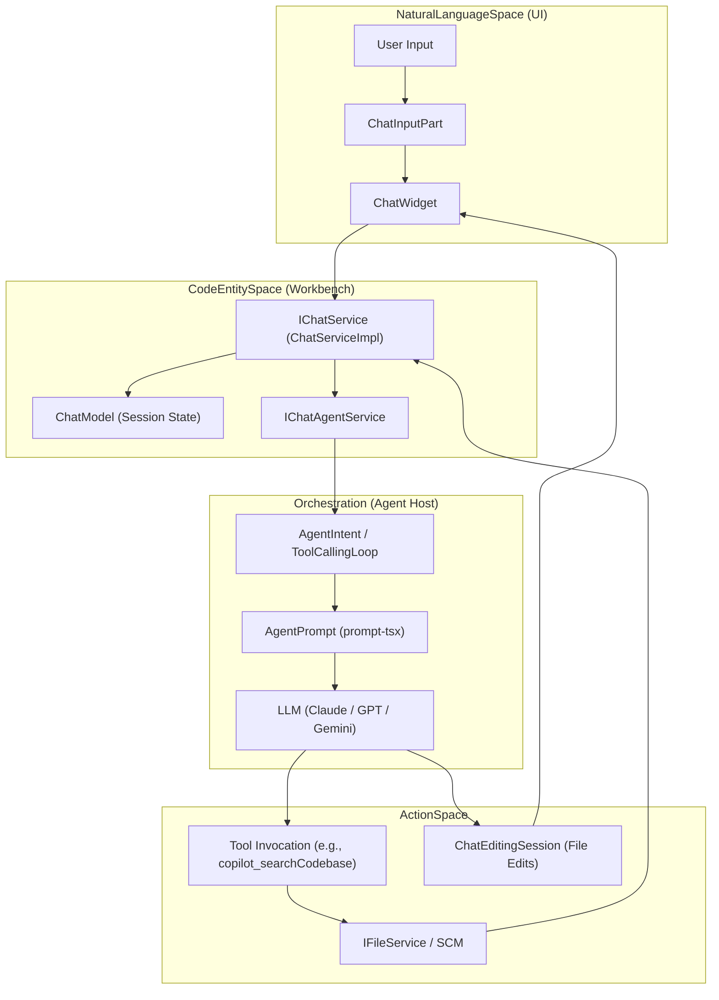

# AI and Copilot Features

<details>
<summary>Relevant source files</summary>

The following files were used as context for generating this wiki page:

- [extensions/copilot/package.json](https://github.com/microsoft/vscode/blob/HEAD/extensions/copilot/package.json)
- [extensions/copilot/package.nls.json](https://github.com/microsoft/vscode/blob/HEAD/extensions/copilot/package.nls.json)
- [extensions/copilot/src/extension/chatSessions/common/chatSessionMetadataStore.ts](https://github.com/microsoft/vscode/blob/HEAD/extensions/copilot/src/extension/chatSessions/common/chatSessionMetadataStore.ts)
- [extensions/copilot/src/extension/chatSessions/common/chatSessionWorkspaceFolderService.ts](https://github.com/microsoft/vscode/blob/HEAD/extensions/copilot/src/extension/chatSessions/common/chatSessionWorkspaceFolderService.ts)
- [extensions/copilot/src/extension/chatSessions/common/chatSessionWorktreeCheckpointService.ts](https://github.com/microsoft/vscode/blob/HEAD/extensions/copilot/src/extension/chatSessions/common/chatSessionWorktreeCheckpointService.ts)
- [extensions/copilot/src/extension/chatSessions/common/chatSessionWorktreeService.ts](https://github.com/microsoft/vscode/blob/HEAD/extensions/copilot/src/extension/chatSessions/common/chatSessionWorktreeService.ts)
- [extensions/copilot/src/extension/chatSessions/common/folderRepositoryManager.ts](https://github.com/microsoft/vscode/blob/HEAD/extensions/copilot/src/extension/chatSessions/common/folderRepositoryManager.ts)
- [extensions/copilot/src/extension/chatSessions/common/test/mockChatSessionMetadataStore.ts](https://github.com/microsoft/vscode/blob/HEAD/extensions/copilot/src/extension/chatSessions/common/test/mockChatSessionMetadataStore.ts)
- [extensions/copilot/src/extension/chatSessions/copilotcli/common/copilotCLITools.ts](https://github.com/microsoft/vscode/blob/HEAD/extensions/copilot/src/extension/chatSessions/copilotcli/common/copilotCLITools.ts)
- [extensions/copilot/src/extension/chatSessions/copilotcli/common/test/copilotCLITools.spec.ts](https://github.com/microsoft/vscode/blob/HEAD/extensions/copilot/src/extension/chatSessions/copilotcli/common/test/copilotCLITools.spec.ts)
- [extensions/copilot/src/extension/chatSessions/copilotcli/node/copilotCli.ts](https://github.com/microsoft/vscode/blob/HEAD/extensions/copilot/src/extension/chatSessions/copilotcli/node/copilotCli.ts)
- [extensions/copilot/src/extension/chatSessions/copilotcli/node/copilotcliSession.ts](https://github.com/microsoft/vscode/blob/HEAD/extensions/copilot/src/extension/chatSessions/copilotcli/node/copilotcliSession.ts)
- [extensions/copilot/src/extension/chatSessions/copilotcli/node/copilotcliSessionService.ts](https://github.com/microsoft/vscode/blob/HEAD/extensions/copilot/src/extension/chatSessions/copilotcli/node/copilotcliSessionService.ts)
- [extensions/copilot/src/extension/chatSessions/copilotcli/node/permissionHelpers.ts](https://github.com/microsoft/vscode/blob/HEAD/extensions/copilot/src/extension/chatSessions/copilotcli/node/permissionHelpers.ts)
- [extensions/copilot/src/extension/chatSessions/copilotcli/node/test/copilotCliModels.spec.ts](https://github.com/microsoft/vscode/blob/HEAD/extensions/copilot/src/extension/chatSessions/copilotcli/node/test/copilotCliModels.spec.ts)
- [extensions/copilot/src/extension/chatSessions/copilotcli/node/test/copilotCliSessionService.spec.ts](https://github.com/microsoft/vscode/blob/HEAD/extensions/copilot/src/extension/chatSessions/copilotcli/node/test/copilotCliSessionService.spec.ts)
- [extensions/copilot/src/extension/chatSessions/copilotcli/node/test/copilotcliSession.spec.ts](https://github.com/microsoft/vscode/blob/HEAD/extensions/copilot/src/extension/chatSessions/copilotcli/node/test/copilotcliSession.spec.ts)
- [extensions/copilot/src/extension/chatSessions/copilotcli/node/test/permissionHelpers.spec.ts](https://github.com/microsoft/vscode/blob/HEAD/extensions/copilot/src/extension/chatSessions/copilotcli/node/test/permissionHelpers.spec.ts)
- [extensions/copilot/src/extension/chatSessions/copilotcli/node/test/testHelpers.ts](https://github.com/microsoft/vscode/blob/HEAD/extensions/copilot/src/extension/chatSessions/copilotcli/node/test/testHelpers.ts)
- [extensions/copilot/src/extension/chatSessions/vscode-node/chatSessionWorkspaceFolderServiceImpl.ts](https://github.com/microsoft/vscode/blob/HEAD/extensions/copilot/src/extension/chatSessions/vscode-node/chatSessionWorkspaceFolderServiceImpl.ts)
- [extensions/copilot/src/extension/chatSessions/vscode-node/chatSessionWorktreeCheckpointServiceImpl.ts](https://github.com/microsoft/vscode/blob/HEAD/extensions/copilot/src/extension/chatSessions/vscode-node/chatSessionWorktreeCheckpointServiceImpl.ts)
- [extensions/copilot/src/extension/chatSessions/vscode-node/chatSessionWorktreeServiceImpl.ts](https://github.com/microsoft/vscode/blob/HEAD/extensions/copilot/src/extension/chatSessions/vscode-node/chatSessionWorktreeServiceImpl.ts)
- [extensions/copilot/src/extension/chatSessions/vscode-node/chatSessions.ts](https://github.com/microsoft/vscode/blob/HEAD/extensions/copilot/src/extension/chatSessions/vscode-node/chatSessions.ts)
- [extensions/copilot/src/extension/chatSessions/vscode-node/copilotCLIChatSessions.ts](https://github.com/microsoft/vscode/blob/HEAD/extensions/copilot/src/extension/chatSessions/vscode-node/copilotCLIChatSessions.ts)
- [extensions/copilot/src/extension/chatSessions/vscode-node/copilotCLIChatSessionsContribution.ts](https://github.com/microsoft/vscode/blob/HEAD/extensions/copilot/src/extension/chatSessions/vscode-node/copilotCLIChatSessionsContribution.ts)
- [extensions/copilot/src/extension/chatSessions/vscode-node/copilotCLIModelDetails.ts](https://github.com/microsoft/vscode/blob/HEAD/extensions/copilot/src/extension/chatSessions/vscode-node/copilotCLIModelDetails.ts)
- [extensions/copilot/src/extension/chatSessions/vscode-node/folderRepositoryManagerImpl.ts](https://github.com/microsoft/vscode/blob/HEAD/extensions/copilot/src/extension/chatSessions/vscode-node/folderRepositoryManagerImpl.ts)
- [extensions/copilot/src/extension/chatSessions/vscode-node/sessionOptionGroupBuilder.ts](https://github.com/microsoft/vscode/blob/HEAD/extensions/copilot/src/extension/chatSessions/vscode-node/sessionOptionGroupBuilder.ts)
- [extensions/copilot/src/extension/chatSessions/vscode-node/test/chatSessionWorkspaceFolderService.spec.ts](https://github.com/microsoft/vscode/blob/HEAD/extensions/copilot/src/extension/chatSessions/vscode-node/test/chatSessionWorkspaceFolderService.spec.ts)
- [extensions/copilot/src/extension/chatSessions/vscode-node/test/copilotCLIChatSessionParticipant.spec.ts](https://github.com/microsoft/vscode/blob/HEAD/extensions/copilot/src/extension/chatSessions/vscode-node/test/copilotCLIChatSessionParticipant.spec.ts)
- [extensions/copilot/src/extension/chatSessions/vscode-node/test/copilotCLIChatSessions.spec.ts](https://github.com/microsoft/vscode/blob/HEAD/extensions/copilot/src/extension/chatSessions/vscode-node/test/copilotCLIChatSessions.spec.ts)
- [extensions/copilot/src/extension/chatSessions/vscode-node/test/copilotCLIModelDetails.spec.ts](https://github.com/microsoft/vscode/blob/HEAD/extensions/copilot/src/extension/chatSessions/vscode-node/test/copilotCLIModelDetails.spec.ts)
- [extensions/copilot/src/extension/chatSessions/vscode-node/test/folderRepositoryManager.spec.ts](https://github.com/microsoft/vscode/blob/HEAD/extensions/copilot/src/extension/chatSessions/vscode-node/test/folderRepositoryManager.spec.ts)
- [extensions/copilot/src/extension/chatSessions/vscode-node/test/sessionOptionGroupBuilder.spec.ts](https://github.com/microsoft/vscode/blob/HEAD/extensions/copilot/src/extension/chatSessions/vscode-node/test/sessionOptionGroupBuilder.spec.ts)
- [extensions/copilot/src/platform/configuration/common/configurationService.ts](https://github.com/microsoft/vscode/blob/HEAD/extensions/copilot/src/platform/configuration/common/configurationService.ts)
- [extensions/copilot/src/platform/git/vscode-node/utils.ts](https://github.com/microsoft/vscode/blob/HEAD/extensions/copilot/src/platform/git/vscode-node/utils.ts)
- [extensions/copilot/test/e2e/cli.stest.ts](https://github.com/microsoft/vscode/blob/HEAD/extensions/copilot/test/e2e/cli.stest.ts)
- [src/vs/platform/agentHost/common/agentModelPricing.ts](https://github.com/microsoft/vscode/blob/HEAD/src/vs/platform/agentHost/common/agentModelPricing.ts)
- [src/vs/platform/agentHost/common/agentModelSource.ts](https://github.com/microsoft/vscode/blob/HEAD/src/vs/platform/agentHost/common/agentModelSource.ts)
- [src/vs/platform/agentHost/common/agentService.ts](https://github.com/microsoft/vscode/blob/HEAD/src/vs/platform/agentHost/common/agentService.ts)
- [src/vs/platform/agentHost/common/claudeProviders.ts](https://github.com/microsoft/vscode/blob/HEAD/src/vs/platform/agentHost/common/claudeProviders.ts)
- [src/vs/platform/agentHost/common/state/sessionState.ts](https://github.com/microsoft/vscode/blob/HEAD/src/vs/platform/agentHost/common/state/sessionState.ts)
- [src/vs/platform/agentHost/node/agentHostStateManager.ts](https://github.com/microsoft/vscode/blob/HEAD/src/vs/platform/agentHost/node/agentHostStateManager.ts)
- [src/vs/platform/agentHost/node/agentService.ts](https://github.com/microsoft/vscode/blob/HEAD/src/vs/platform/agentHost/node/agentService.ts)
- [src/vs/platform/agentHost/node/agentSideEffects.ts](https://github.com/microsoft/vscode/blob/HEAD/src/vs/platform/agentHost/node/agentSideEffects.ts)
- [src/vs/platform/agentHost/node/copilot/copilotAgent.ts](https://github.com/microsoft/vscode/blob/HEAD/src/vs/platform/agentHost/node/copilot/copilotAgent.ts)
- [src/vs/platform/agentHost/node/copilot/copilotAgentSession.ts](https://github.com/microsoft/vscode/blob/HEAD/src/vs/platform/agentHost/node/copilot/copilotAgentSession.ts)
- [src/vs/platform/agentHost/test/node/agentHostStateManager.test.ts](https://github.com/microsoft/vscode/blob/HEAD/src/vs/platform/agentHost/test/node/agentHostStateManager.test.ts)
- [src/vs/platform/agentHost/test/node/agentService.test.ts](https://github.com/microsoft/vscode/blob/HEAD/src/vs/platform/agentHost/test/node/agentService.test.ts)
- [src/vs/platform/agentHost/test/node/agentSideEffects.test.ts](https://github.com/microsoft/vscode/blob/HEAD/src/vs/platform/agentHost/test/node/agentSideEffects.test.ts)
- [src/vs/platform/agentHost/test/node/claudeModelSelection.test.ts](https://github.com/microsoft/vscode/blob/HEAD/src/vs/platform/agentHost/test/node/claudeModelSelection.test.ts)
- [src/vs/platform/agentHost/test/node/copilotAgent.test.ts](https://github.com/microsoft/vscode/blob/HEAD/src/vs/platform/agentHost/test/node/copilotAgent.test.ts)
- [src/vs/platform/agentHost/test/node/copilotAgentSession.test.ts](https://github.com/microsoft/vscode/blob/HEAD/src/vs/platform/agentHost/test/node/copilotAgentSession.test.ts)
- [src/vs/platform/agentHost/test/node/mockAgent.ts](https://github.com/microsoft/vscode/blob/HEAD/src/vs/platform/agentHost/test/node/mockAgent.ts)
- [src/vs/sessions/contrib/providers/agentHost/browser/openSubagentChat.ts](https://github.com/microsoft/vscode/blob/HEAD/src/vs/sessions/contrib/providers/agentHost/browser/openSubagentChat.ts)
- [src/vs/sessions/contrib/providers/agentHost/test/browser/openSubagentChat.test.ts](https://github.com/microsoft/vscode/blob/HEAD/src/vs/sessions/contrib/providers/agentHost/test/browser/openSubagentChat.test.ts)
- [src/vs/workbench/contrib/chat/browser/actions/chatActions.ts](https://github.com/microsoft/vscode/blob/HEAD/src/vs/workbench/contrib/chat/browser/actions/chatActions.ts)
- [src/vs/workbench/contrib/chat/browser/actions/chatExecuteActions.ts](https://github.com/microsoft/vscode/blob/HEAD/src/vs/workbench/contrib/chat/browser/actions/chatExecuteActions.ts)
- [src/vs/workbench/contrib/chat/browser/agentSessions/agentHost/agentHostChatContribution.ts](https://github.com/microsoft/vscode/blob/HEAD/src/vs/workbench/contrib/chat/browser/agentSessions/agentHost/agentHostChatContribution.ts)
- [src/vs/workbench/contrib/chat/browser/agentSessions/agentHost/agentHostLanguageModelProvider.ts](https://github.com/microsoft/vscode/blob/HEAD/src/vs/workbench/contrib/chat/browser/agentSessions/agentHost/agentHostLanguageModelProvider.ts)
- [src/vs/workbench/contrib/chat/browser/agentSessions/agentHost/agentHostSessionHandler.ts](https://github.com/microsoft/vscode/blob/HEAD/src/vs/workbench/contrib/chat/browser/agentSessions/agentHost/agentHostSessionHandler.ts)
- [src/vs/workbench/contrib/chat/browser/agentSessions/agentHost/agentHostSessionListController.ts](https://github.com/microsoft/vscode/blob/HEAD/src/vs/workbench/contrib/chat/browser/agentSessions/agentHost/agentHostSessionListController.ts)
- [src/vs/workbench/contrib/chat/browser/agentSessions/agentHost/stateToProgressAdapter.ts](https://github.com/microsoft/vscode/blob/HEAD/src/vs/workbench/contrib/chat/browser/agentSessions/agentHost/stateToProgressAdapter.ts)
- [src/vs/workbench/contrib/chat/browser/agentSessions/localAgentSessionsController.ts](https://github.com/microsoft/vscode/blob/HEAD/src/vs/workbench/contrib/chat/browser/agentSessions/localAgentSessionsController.ts)
- [src/vs/workbench/contrib/chat/browser/chat.contribution.ts](https://github.com/microsoft/vscode/blob/HEAD/src/vs/workbench/contrib/chat/browser/chat.contribution.ts)
- [src/vs/workbench/contrib/chat/browser/chat.ts](https://github.com/microsoft/vscode/blob/HEAD/src/vs/workbench/contrib/chat/browser/chat.ts)
- [src/vs/workbench/contrib/chat/browser/widget/chatContentParts/chatDisabledClaudeHooksContentPart.ts](https://github.com/microsoft/vscode/blob/HEAD/src/vs/workbench/contrib/chat/browser/widget/chatContentParts/chatDisabledClaudeHooksContentPart.ts)
- [src/vs/workbench/contrib/chat/browser/widget/chatContentParts/chatHookContentPart.ts](https://github.com/microsoft/vscode/blob/HEAD/src/vs/workbench/contrib/chat/browser/widget/chatContentParts/chatHookContentPart.ts)
- [src/vs/workbench/contrib/chat/browser/widget/chatContentParts/chatMcpServersInteractionContentPart.ts](https://github.com/microsoft/vscode/blob/HEAD/src/vs/workbench/contrib/chat/browser/widget/chatContentParts/chatMcpServersInteractionContentPart.ts)
- [src/vs/workbench/contrib/chat/browser/widget/chatContentParts/chatProgressContentPart.ts](https://github.com/microsoft/vscode/blob/HEAD/src/vs/workbench/contrib/chat/browser/widget/chatContentParts/chatProgressContentPart.ts)
- [src/vs/workbench/contrib/chat/browser/widget/chatContentParts/chatSubagentContentPart.ts](https://github.com/microsoft/vscode/blob/HEAD/src/vs/workbench/contrib/chat/browser/widget/chatContentParts/chatSubagentContentPart.ts)
- [src/vs/workbench/contrib/chat/browser/widget/chatContentParts/chatTaskContentPart.ts](https://github.com/microsoft/vscode/blob/HEAD/src/vs/workbench/contrib/chat/browser/widget/chatContentParts/chatTaskContentPart.ts)
- [src/vs/workbench/contrib/chat/browser/widget/chatContentParts/chatThinkingContentPart.ts](https://github.com/microsoft/vscode/blob/HEAD/src/vs/workbench/contrib/chat/browser/widget/chatContentParts/chatThinkingContentPart.ts)
- [src/vs/workbench/contrib/chat/browser/widget/chatContentParts/media/chatCodeBlockPill.css](https://github.com/microsoft/vscode/blob/HEAD/src/vs/workbench/contrib/chat/browser/widget/chatContentParts/media/chatCodeBlockPill.css)
- [src/vs/workbench/contrib/chat/browser/widget/chatContentParts/media/chatDisabledClaudeHooksContent.css](https://github.com/microsoft/vscode/blob/HEAD/src/vs/workbench/contrib/chat/browser/widget/chatContentParts/media/chatDisabledClaudeHooksContent.css)
- [src/vs/workbench/contrib/chat/browser/widget/chatContentParts/media/chatHookContentPart.css](https://github.com/microsoft/vscode/blob/HEAD/src/vs/workbench/contrib/chat/browser/widget/chatContentParts/media/chatHookContentPart.css)
- [src/vs/workbench/contrib/chat/browser/widget/chatContentParts/media/chatSubagentContent.css](https://github.com/microsoft/vscode/blob/HEAD/src/vs/workbench/contrib/chat/browser/widget/chatContentParts/media/chatSubagentContent.css)
- [src/vs/workbench/contrib/chat/browser/widget/chatContentParts/media/chatThinkingContent.css](https://github.com/microsoft/vscode/blob/HEAD/src/vs/workbench/contrib/chat/browser/widget/chatContentParts/media/chatThinkingContent.css)
- [src/vs/workbench/contrib/chat/browser/widget/chatContentParts/toolInvocationParts/chatResultListSubPart.ts](https://github.com/microsoft/vscode/blob/HEAD/src/vs/workbench/contrib/chat/browser/widget/chatContentParts/toolInvocationParts/chatResultListSubPart.ts)
- [src/vs/workbench/contrib/chat/browser/widget/chatContentParts/toolInvocationParts/chatToolInvocationSubPart.ts](https://github.com/microsoft/vscode/blob/HEAD/src/vs/workbench/contrib/chat/browser/widget/chatContentParts/toolInvocationParts/chatToolInvocationSubPart.ts)
- [src/vs/workbench/contrib/chat/browser/widget/chatContentParts/toolInvocationParts/chatToolProgressPart.ts](https://github.com/microsoft/vscode/blob/HEAD/src/vs/workbench/contrib/chat/browser/widget/chatContentParts/toolInvocationParts/chatToolProgressPart.ts)
- [src/vs/workbench/contrib/chat/browser/widget/chatContentParts/toolInvocationParts/chatToolStreamingSubPart.ts](https://github.com/microsoft/vscode/blob/HEAD/src/vs/workbench/contrib/chat/browser/widget/chatContentParts/toolInvocationParts/chatToolStreamingSubPart.ts)
- [src/vs/workbench/contrib/chat/browser/widget/chatListRenderer.ts](https://github.com/microsoft/vscode/blob/HEAD/src/vs/workbench/contrib/chat/browser/widget/chatListRenderer.ts)
- [src/vs/workbench/contrib/chat/browser/widget/chatWidget.ts](https://github.com/microsoft/vscode/blob/HEAD/src/vs/workbench/contrib/chat/browser/widget/chatWidget.ts)
- [src/vs/workbench/contrib/chat/browser/widget/input/chatInputPart.ts](https://github.com/microsoft/vscode/blob/HEAD/src/vs/workbench/contrib/chat/browser/widget/input/chatInputPart.ts)
- [src/vs/workbench/contrib/chat/browser/widget/media/chat.css](https://github.com/microsoft/vscode/blob/HEAD/src/vs/workbench/contrib/chat/browser/widget/media/chat.css)
- [src/vs/workbench/contrib/chat/common/actions/chatContextKeys.ts](https://github.com/microsoft/vscode/blob/HEAD/src/vs/workbench/contrib/chat/common/actions/chatContextKeys.ts)
- [src/vs/workbench/contrib/chat/common/chatService/chatService.ts](https://github.com/microsoft/vscode/blob/HEAD/src/vs/workbench/contrib/chat/common/chatService/chatService.ts)
- [src/vs/workbench/contrib/chat/common/chatService/chatServiceImpl.ts](https://github.com/microsoft/vscode/blob/HEAD/src/vs/workbench/contrib/chat/common/chatService/chatServiceImpl.ts)
- [src/vs/workbench/contrib/chat/common/constants.ts](https://github.com/microsoft/vscode/blob/HEAD/src/vs/workbench/contrib/chat/common/constants.ts)
- [src/vs/workbench/contrib/chat/common/model/chatModel.ts](https://github.com/microsoft/vscode/blob/HEAD/src/vs/workbench/contrib/chat/common/model/chatModel.ts)
- [src/vs/workbench/contrib/chat/common/model/chatSessionOperationLog.ts](https://github.com/microsoft/vscode/blob/HEAD/src/vs/workbench/contrib/chat/common/model/chatSessionOperationLog.ts)
- [src/vs/workbench/contrib/chat/common/model/chatViewModel.ts](https://github.com/microsoft/vscode/blob/HEAD/src/vs/workbench/contrib/chat/common/model/chatViewModel.ts)
- [src/vs/workbench/contrib/chat/common/widget/annotations.ts](https://github.com/microsoft/vscode/blob/HEAD/src/vs/workbench/contrib/chat/common/widget/annotations.ts)
- [src/vs/workbench/contrib/chat/test/browser/agentSessions/agentHostChatContribution.test.ts](https://github.com/microsoft/vscode/blob/HEAD/src/vs/workbench/contrib/chat/test/browser/agentSessions/agentHostChatContribution.test.ts)
- [src/vs/workbench/contrib/chat/test/browser/agentSessions/agentHostClientTools.test.ts](https://github.com/microsoft/vscode/blob/HEAD/src/vs/workbench/contrib/chat/test/browser/agentSessions/agentHostClientTools.test.ts)
- [src/vs/workbench/contrib/chat/test/browser/agentSessions/agentHostLanguageModelProvider.test.ts](https://github.com/microsoft/vscode/blob/HEAD/src/vs/workbench/contrib/chat/test/browser/agentSessions/agentHostLanguageModelProvider.test.ts)
- [src/vs/workbench/contrib/chat/test/browser/agentSessions/localAgentSessionsController.test.ts](https://github.com/microsoft/vscode/blob/HEAD/src/vs/workbench/contrib/chat/test/browser/agentSessions/localAgentSessionsController.test.ts)
- [src/vs/workbench/contrib/chat/test/browser/agentSessions/stateToProgressAdapter.test.ts](https://github.com/microsoft/vscode/blob/HEAD/src/vs/workbench/contrib/chat/test/browser/agentSessions/stateToProgressAdapter.test.ts)
- [src/vs/workbench/contrib/chat/test/browser/widget/chatContentParts/chatSubagentContentPart.test.ts](https://github.com/microsoft/vscode/blob/HEAD/src/vs/workbench/contrib/chat/test/browser/widget/chatContentParts/chatSubagentContentPart.test.ts)
- [src/vs/workbench/contrib/chat/test/browser/widget/chatContentParts/chatThinkingContentPart.test.ts](https://github.com/microsoft/vscode/blob/HEAD/src/vs/workbench/contrib/chat/test/browser/widget/chatContentParts/chatThinkingContentPart.test.ts)
- [src/vs/workbench/contrib/chat/test/browser/widget/chatListRenderer.test.ts](https://github.com/microsoft/vscode/blob/HEAD/src/vs/workbench/contrib/chat/test/browser/widget/chatListRenderer.test.ts)
- [src/vs/workbench/contrib/chat/test/common/chatService/__snapshots__/ChatService_can_deserialize.0.snap](https://github.com/microsoft/vscode/blob/HEAD/src/vs/workbench/contrib/chat/test/common/chatService/__snapshots__/ChatService_can_deserialize.0.snap)
- [src/vs/workbench/contrib/chat/test/common/chatService/__snapshots__/ChatService_can_deserialize_with_response.0.snap](https://github.com/microsoft/vscode/blob/HEAD/src/vs/workbench/contrib/chat/test/common/chatService/__snapshots__/ChatService_can_deserialize_with_response.0.snap)
- [src/vs/workbench/contrib/chat/test/common/chatService/__snapshots__/ChatService_can_serialize.1.snap](https://github.com/microsoft/vscode/blob/HEAD/src/vs/workbench/contrib/chat/test/common/chatService/__snapshots__/ChatService_can_serialize.1.snap)
- [src/vs/workbench/contrib/chat/test/common/chatService/__snapshots__/ChatService_sendRequest_fails.0.snap](https://github.com/microsoft/vscode/blob/HEAD/src/vs/workbench/contrib/chat/test/common/chatService/__snapshots__/ChatService_sendRequest_fails.0.snap)
- [src/vs/workbench/contrib/chat/test/common/chatService/chatService.test.ts](https://github.com/microsoft/vscode/blob/HEAD/src/vs/workbench/contrib/chat/test/common/chatService/chatService.test.ts)
- [src/vs/workbench/contrib/chat/test/common/chatService/mockChatService.ts](https://github.com/microsoft/vscode/blob/HEAD/src/vs/workbench/contrib/chat/test/common/chatService/mockChatService.ts)
- [src/vs/workbench/contrib/chat/test/common/model/chatModel.test.ts](https://github.com/microsoft/vscode/blob/HEAD/src/vs/workbench/contrib/chat/test/common/model/chatModel.test.ts)
- [src/vs/workbench/contrib/chat/test/common/widget/annotations.test.ts](https://github.com/microsoft/vscode/blob/HEAD/src/vs/workbench/contrib/chat/test/common/widget/annotations.test.ts)

</details>


The AI and Copilot subsystem in VS Code provides a comprehensive framework for integrating Large Language Models (LLMs) into the development workflow. This includes the primary Chat UI, inline code completions, agent-based orchestration, and deep integration with the GitHub Copilot extension. The architecture is designed to be provider-agnostic, supporting multiple models and interaction modes while maintaining a consistent user experience across the workbench and external interfaces.

### Core Architecture Overview

The AI features are built on a multi-layered service architecture that separates UI components from the underlying model logic, agent execution, and session management.

1.  **UI Layer**: Centered around the `ChatWidget` and `InlineChatWidget`, providing the visual interface for user interaction [src/vs/workbench/contrib/chat/browser/chat.ts:69-75](https://github.com/microsoft/vscode/blob/HEAD/src/vs/workbench/contrib/chat/browser/chat.ts#L69-L75).
2.  **Service Layer**: Managed by `IChatService`, which handles session lifecycles, request queuing, and streaming responses [src/vs/workbench/contrib/chat/common/chatService/chatService.ts:58-59](https://github.com/microsoft/vscode/blob/HEAD/src/vs/workbench/contrib/chat/common/chatService/chatService.ts#L58-L59).
3.  **Model Layer**: Implemented via `ChatModel` and `ChatViewModel`, which maintain the state of conversations and their visual representation [src/vs/workbench/contrib/chat/common/model/chatModel.ts:56-57](https://github.com/microsoft/vscode/blob/HEAD/src/vs/workbench/contrib/chat/common/model/chatModel.ts#L56-L57) [src/vs/workbench/contrib/chat/common/model/chatViewModel.ts:61-62](https://github.com/microsoft/vscode/blob/HEAD/src/vs/workbench/contrib/chat/common/model/chatViewModel.ts#L61-L62).
4.  **Extension Layer**: The GitHub Copilot extension (`copilot-chat`) contributes specific agents, tools (like `copilot_searchCodebase`), and orchestration logic [extensions/copilot/package.json:1-180](https://github.com/microsoft/vscode/blob/HEAD/extensions/copilot/package.json#L1-L180).
5.  **Agent Host Platform**: A dedicated execution environment for agents (`CopilotAgent`) that allows for complex reasoning and tool use outside the main extension host [src/vs/platform/agentHost/node/copilot/copilotAgent.ts:45-45](https://github.com/microsoft/vscode/blob/HEAD/src/vs/platform/agentHost/node/copilot/copilotAgent.ts#L45).

### Feature Areas

#### Chat Service and Widget
The primary interface for AI interaction. It supports various `ChatModeKind` values such as `Ask`, `Edit`, and `Agent` [src/vs/workbench/contrib/chat/common/constants.ts:63-63](https://github.com/microsoft/vscode/blob/HEAD/src/vs/workbench/contrib/chat/common/constants.ts#L63). The `ChatWidget` manages complex rendering of response parts via the `ChatInputPart` [src/vs/workbench/contrib/chat/browser/widget/input/chatInputPart.ts:83-83](https://github.com/microsoft/vscode/blob/HEAD/src/vs/workbench/contrib/chat/browser/widget/input/chatInputPart.ts#L83) and `ChatListRenderer`. Response content can include specialized parts like `chatThinkingContentPart` for model reasoning [src/vs/workbench/contrib/chat/browser/widget/chatContentParts/chatThinkingContentPart.ts:1-10](https://github.com/microsoft/vscode/blob/HEAD/src/vs/workbench/contrib/chat/browser/widget/chatContentParts/chatThinkingContentPart.ts#L1-L10) and `IChatToolInvocation` for tool progress [src/vs/workbench/contrib/chat/common/chatService/chatService.ts:59-59](https://github.com/microsoft/vscode/blob/HEAD/src/vs/workbench/contrib/chat/common/chatService/chatService.ts#L59).
For details, see [Chat Service and Widget](#7.1).

#### Chat Editing and Agent Sessions
Enables the AI to perform multi-file edits through `ChatEditingSession`. It includes logic for managing undo/redo of AI-generated changes, prompting the user via `IDialogService` if edits are about to be removed during a session rollback [src/vs/workbench/contrib/chat/browser/actions/chatExecuteActions.ts:90-117](https://github.com/microsoft/vscode/blob/HEAD/src/vs/workbench/contrib/chat/browser/actions/chatExecuteActions.ts#L90-L117). It also supports `AgentSessionProviders` to target specific execution environments like local or remote hosts [src/vs/workbench/contrib/chat/browser/actions/chatExecuteActions.ts:37-37](https://github.com/microsoft/vscode/blob/HEAD/src/vs/workbench/contrib/chat/browser/actions/chatExecuteActions.ts#L37).
For details, see [Chat Editing and Agent Sessions](#7.2).

#### Inline Chat
Provides an "in-situ" chat experience directly within the editor. It manages interactive sessions tied to specific code ranges and is integrated via the `InlineChatController`. It allows for ghost text and inline completions to be proposed by AI [extensions/copilot/package.json:132-132](https://github.com/microsoft/vscode/blob/HEAD/extensions/copilot/package.json#L132).
For details, see [Inline Chat](#7.3).

#### Copilot Extension: Agent Orchestration
The GitHub Copilot extension orchestrates complex tasks using the `AgentIntent` and `ToolCallingLoop`. It uses `AgentPrompt` (based on `prompt-tsx`) to construct context-rich prompts and manages conversation history compaction via `SummarizedConversationHistory`. It routes requests to various models including Claude, GPT, and Gemini based on capability requirements.
For details, see [Copilot Extension: Agent Orchestration](#7.4).

#### Copilot CLI and Cloud Sessions
Handles AI sessions outside the primary workbench, including CLI interactions via `CopilotCLIChatSessionsContribution` [extensions/copilot/src/extension/chatSessions/vscode-node/copilotCLIChatSessionsContribution.ts:1-52](https://github.com/microsoft/vscode/blob/HEAD/extensions/copilot/src/extension/chatSessions/vscode-node/copilotCLIChatSessionsContribution.ts#L1-L52) and synchronization with GitHub cloud-based chat history via the `CopilotCloudSessionsProvider` [extensions/copilot/src/extension/chatSessions/vscode-node/copilotCloudSessionsProvider.ts:1-59](https://github.com/microsoft/vscode/blob/HEAD/extensions/copilot/src/extension/chatSessions/vscode-node/copilotCloudSessionsProvider.ts#L1-L59).
For details, see [Copilot CLI and Cloud Sessions](#7.5).

#### Prompt Syntax and Custom Instructions
Manages how prompts are constructed and discovered. This includes support for prompt files (`.prompt`) [extensions/copilot/package.json:145-145](https://github.com/microsoft/vscode/blob/HEAD/extensions/copilot/package.json#L145) and automatic instruction computation based on workspace context via `IPromptsService` [extensions/copilot/src/extension/chatSessions/vscode-node/copilotCLIChatSessionsContribution.ts:23-23](https://github.com/microsoft/vscode/blob/HEAD/extensions/copilot/src/extension/chatSessions/vscode-node/copilotCLIChatSessionsContribution.ts#L23).
For details, see [Prompt Syntax and Custom Instructions](#7.6).

#### MCP (Model Context Protocol) Integration
Integrates the Model Context Protocol to allow VS Code to connect to external tool servers. This is managed via `mcpServerDefinitions` [extensions/copilot/package.json:146-146](https://github.com/microsoft/vscode/blob/HEAD/extensions/copilot/package.json#L146) and allows agents to discover and invoke tools defined in external MCP servers using `MCPService`.
For details, see [MCP (Model Context Protocol) Integration](#7.7).

#### Agent Host Platform
The low-level platform infrastructure that hosts agents. It manages the connection and state synchronization via `CopilotAgent` [src/vs/platform/agentHost/node/copilot/copilotAgent.ts:6-45](https://github.com/microsoft/vscode/blob/HEAD/src/vs/platform/agentHost/node/copilot/copilotAgent.ts#L6-L45). It handles the communication protocol and execution environment for subagents like the `execution_subagent` [extensions/copilot/package.json:182-187](https://github.com/microsoft/vscode/blob/HEAD/extensions/copilot/package.json#L182-L187).
For details, see [Agent Host Platform](#7.8).

### AI Data Flow and Orchestration

The following diagram illustrates how a user request flows from the UI through the orchestration layer to the LLM and back as structured tools and edits.

**Chat Request and Tool Execution Flow**

**Sources:** [src/vs/workbench/contrib/chat/common/chatService/chatService.ts:58-66](https://github.com/microsoft/vscode/blob/HEAD/src/vs/workbench/contrib/chat/common/chatService/chatService.ts#L58-L66), [src/vs/workbench/contrib/chat/browser/widget/input/chatInputPart.ts:83-100](https://github.com/microsoft/vscode/blob/HEAD/src/vs/workbench/contrib/chat/browser/widget/input/chatInputPart.ts#L83-L100), [extensions/copilot/package.json:155-187](https://github.com/microsoft/vscode/blob/HEAD/extensions/copilot/package.json#L155-L187)

### Component Relationship Matrix

| Component | Role | Primary Code Entry Point |
| :--- | :--- | :--- |
| **Chat Widget** | Main UI Container | `ChatWidget` [src/vs/workbench/contrib/chat/browser/chat.ts:69-69](https://github.com/microsoft/vscode/blob/HEAD/src/vs/workbench/contrib/chat/browser/chat.ts#L69) |
| **Chat Service** | Lifecycle & Streaming | `IChatService` [src/vs/workbench/contrib/chat/common/chatService/chatService.ts:59-59](https://github.com/microsoft/vscode/blob/HEAD/src/vs/workbench/contrib/chat/common/chatService/chatService.ts#L59) |
| **Chat Model** | State Management | `ChatModel` [src/vs/workbench/contrib/chat/common/model/chatModel.ts:57-57](https://github.com/microsoft/vscode/blob/HEAD/src/vs/workbench/contrib/chat/common/model/chatModel.ts#L57) |
| **Agent Service** | Agent Registry | `IChatAgentService` [src/vs/workbench/contrib/chat/common/participants/chatAgents.ts:53-53](https://github.com/microsoft/vscode/blob/HEAD/src/vs/workbench/contrib/chat/common/participants/chatAgents.ts#L53) |
| **Session Service** | Provider Registry | `IChatSessionsService` [src/vs/workbench/contrib/chat/common/chatSessionsService.ts:74-74](https://github.com/microsoft/vscode/blob/HEAD/src/vs/workbench/contrib/chat/common/chatSessionsService.ts#L74) |
| **Chat Renderer** | UI Element Rendering | `ChatListRenderer` [src/vs/workbench/contrib/chat/browser/widget/chatListRenderer.ts:13-14](https://github.com/microsoft/vscode/blob/HEAD/src/vs/workbench/contrib/chat/browser/widget/chatListRenderer.ts#L13-L14) |

### Session Management
AI interactions are grouped into sessions. The `IChatSessionsService` tracks available session providers and their capabilities [src/vs/workbench/contrib/chat/common/chatSessionsService.ts:74-74](https://github.com/microsoft/vscode/blob/HEAD/src/vs/workbench/contrib/chat/common/chatSessionsService.ts#L74). Providers can be local or remote, such as the `AgentSessionProviders.Local` [src/vs/workbench/contrib/chat/browser/agentSessions/agentSessions.ts:37-37](https://github.com/microsoft/vscode/blob/HEAD/src/vs/workbench/contrib/chat/browser/agentSessions/agentSessions.ts#L37).

**Session and Provider Registry**
```mermaid
classDiagram
    class IChatWidgetService {
        +lastFocusedWidget: IChatWidget
    }
    class IChatService {
        +getSession(uri): IChatModel
    }
    class IChatSessionsService {
        +getSessions(type): IChatSessionItem[]
    }
    class ChatModel {
        +sessionId: string
        +editingSession: IChatEditingSession
    }
    class IChatAgentService {
        +getAgent(id): IChatAgentData
    }

    ["IChatWidgetService"] --> ["IChatService"] : queries
    ["IChatService"] --> ["ChatModel"] : manages
    ["IChatSessionsService"] --> ["IChatService"] : interacts
    ["ChatModel"] --> ["IChatAgentService"] : invokes
```
**Sources:** [src/vs/workbench/contrib/chat/common/chatSessionsService.ts:74-74](https://github.com/microsoft/vscode/blob/HEAD/src/vs/workbench/contrib/chat/common/chatSessionsService.ts#L74), [src/vs/workbench/contrib/chat/common/chatService/chatService.ts:58-59](https://github.com/microsoft/vscode/blob/HEAD/src/vs/workbench/contrib/chat/common/chatService/chatService.ts#L58-L59), [src/vs/workbench/contrib/chat/browser/actions/chatExecuteActions.ts:35-37](https://github.com/microsoft/vscode/blob/HEAD/src/vs/workbench/contrib/chat/browser/actions/chatExecuteActions.ts#L35-L37)

### Configuration
Copilot and AI features are governed by settings prefixed with `github.copilot` and `chat.` [extensions/copilot/src/platform/configuration/common/configurationService.ts:28-28](https://github.com/microsoft/vscode/blob/HEAD/extensions/copilot/src/platform/configuration/common/configurationService.ts#L28). Key settings include:
*   `github.copilot.chat.executionSubagent.enabled`: Toggles subagent participation [extensions/copilot/package.json:188-188](https://github.com/microsoft/vscode/blob/HEAD/extensions/copilot/package.json#L188).
*   `chat.editing.confirmEditRequestRemoval`: Controls safety prompts during undo [src/vs/workbench/contrib/chat/browser/actions/chatExecuteActions.ts:91-91](https://github.com/microsoft/vscode/blob/HEAD/src/vs/workbench/contrib/chat/browser/actions/chatExecuteActions.ts#L91).
*   `github.copilot.chat.semanticSearchTool.mode`: Determines how codebase search is used [extensions/copilot/package.json:163-163](https://github.com/microsoft/vscode/blob/HEAD/extensions/copilot/package.json#L163).

**Sources:** [extensions/copilot/src/platform/configuration/common/configurationService.ts:28-30](https://github.com/microsoft/vscode/blob/HEAD/extensions/copilot/src/platform/configuration/common/configurationService.ts#L28-L30), [src/vs/workbench/contrib/chat/browser/actions/chatExecuteActions.ts:90-117](https://github.com/microsoft/vscode/blob/HEAD/src/vs/workbench/contrib/chat/browser/actions/chatExecuteActions.ts#L90-L117), [extensions/copilot/package.json:163-188](https://github.com/microsoft/vscode/blob/HEAD/extensions/copilot/package.json#L163-L188)