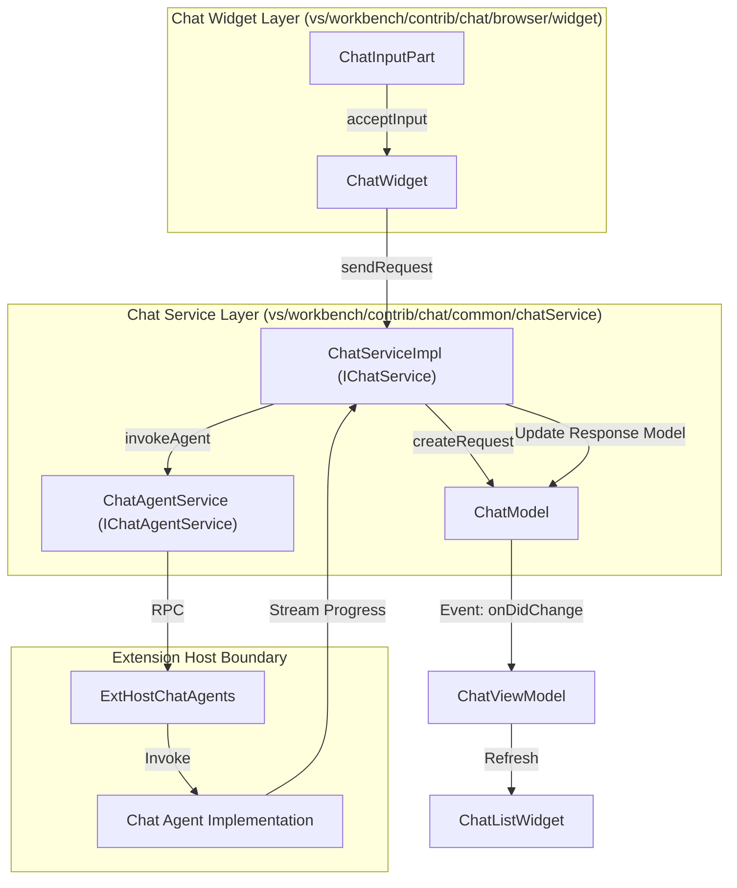
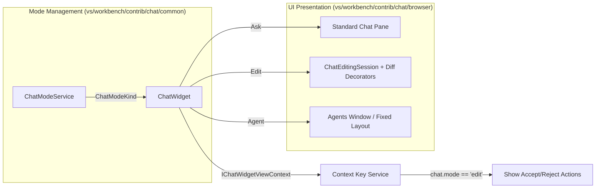
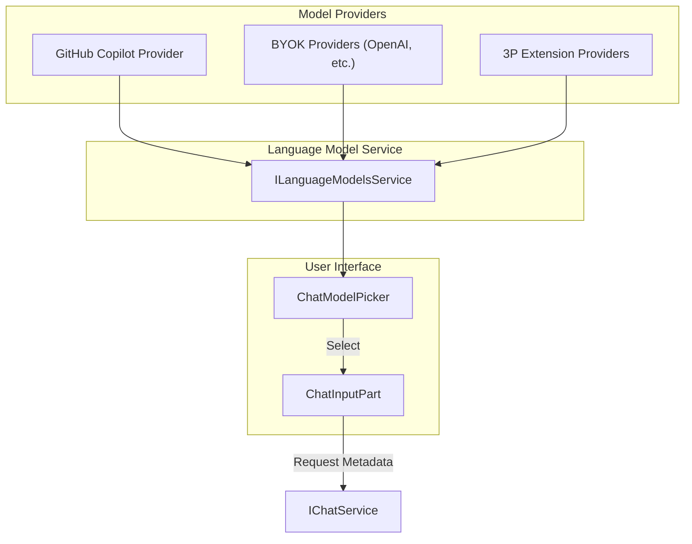

# Chat Service and Widget

Relevant source files

The following files were used as context for generating this wiki page:

- [extensions/vscode-api-tests/src/singlefolder-tests/lm.test.ts](https://github.com/microsoft/vscode/blob/HEAD/extensions/vscode-api-tests/src/singlefolder-tests/lm.test.ts)
- [src/vs/base/common/collections.ts](https://github.com/microsoft/vscode/blob/HEAD/src/vs/base/common/collections.ts)
- [src/vs/base/common/defaultAccount.ts](https://github.com/microsoft/vscode/blob/HEAD/src/vs/base/common/defaultAccount.ts)
- [src/vs/base/test/common/collections.test.ts](https://github.com/microsoft/vscode/blob/HEAD/src/vs/base/test/common/collections.test.ts)
- [src/vs/editor/contrib/inlineCompletions/browser/model/graph.ts](https://github.com/microsoft/vscode/blob/HEAD/src/vs/editor/contrib/inlineCompletions/browser/model/graph.ts)
- [src/vs/editor/contrib/inlineCompletions/test/browser/graph.test.ts](https://github.com/microsoft/vscode/blob/HEAD/src/vs/editor/contrib/inlineCompletions/test/browser/graph.test.ts)
- [src/vs/platform/actionWidget/browser/actionList.ts](https://github.com/microsoft/vscode/blob/HEAD/src/vs/platform/actionWidget/browser/actionList.ts)
- [src/vs/platform/actionWidget/browser/actionWidget.css](https://github.com/microsoft/vscode/blob/HEAD/src/vs/platform/actionWidget/browser/actionWidget.css)
- [src/vs/platform/actionWidget/browser/actionWidget.ts](https://github.com/microsoft/vscode/blob/HEAD/src/vs/platform/actionWidget/browser/actionWidget.ts)
- [src/vs/platform/actionWidget/browser/actionWidgetDropdown.ts](https://github.com/microsoft/vscode/blob/HEAD/src/vs/platform/actionWidget/browser/actionWidgetDropdown.ts)
- [src/vs/platform/actionWidget/test/browser/actionList.test.ts](https://github.com/microsoft/vscode/blob/HEAD/src/vs/platform/actionWidget/test/browser/actionList.test.ts)
- [src/vs/platform/actionWidget/test/browser/actionWidgetDropdown.test.ts](https://github.com/microsoft/vscode/blob/HEAD/src/vs/platform/actionWidget/test/browser/actionWidgetDropdown.test.ts)
- [src/vs/platform/agentHost/common/agentHostCustomizationConfig.ts](https://github.com/microsoft/vscode/blob/HEAD/src/vs/platform/agentHost/common/agentHostCustomizationConfig.ts)
- [src/vs/platform/localTranscription/common/localTranscription.ts](https://github.com/microsoft/vscode/blob/HEAD/src/vs/platform/localTranscription/common/localTranscription.ts)
- [src/vs/platform/localTranscription/node/localTranscriptionService.ts](https://github.com/microsoft/vscode/blob/HEAD/src/vs/platform/localTranscription/node/localTranscriptionService.ts)
- [src/vs/sessions/browser/accountTitleBarState.ts](https://github.com/microsoft/vscode/blob/HEAD/src/vs/sessions/browser/accountTitleBarState.ts)
- [src/vs/sessions/browser/chatDashboardService.ts](https://github.com/microsoft/vscode/blob/HEAD/src/vs/sessions/browser/chatDashboardService.ts)
- [src/vs/sessions/browser/parts/mobile/mobileTitlebarPart.ts](https://github.com/microsoft/vscode/blob/HEAD/src/vs/sessions/browser/parts/mobile/mobileTitlebarPart.ts)
- [src/vs/sessions/browser/parts/sessionConversationsActionViewItem.ts](https://github.com/microsoft/vscode/blob/HEAD/src/vs/sessions/browser/parts/sessionConversationsActionViewItem.ts)
- [src/vs/sessions/browser/sessionConversationGroups.ts](https://github.com/microsoft/vscode/blob/HEAD/src/vs/sessions/browser/sessionConversationGroups.ts)
- [src/vs/sessions/browser/sessionsAuthGate.ts](https://github.com/microsoft/vscode/blob/HEAD/src/vs/sessions/browser/sessionsAuthGate.ts)
- [src/vs/sessions/browser/sessionsSetUpService.ts](https://github.com/microsoft/vscode/blob/HEAD/src/vs/sessions/browser/sessionsSetUpService.ts)
- [src/vs/sessions/contrib/accountMenu/browser/account.contribution.ts](https://github.com/microsoft/vscode/blob/HEAD/src/vs/sessions/contrib/accountMenu/browser/account.contribution.ts)
- [src/vs/sessions/contrib/accountMenu/browser/media/accountTitleBarWidget.css](https://github.com/microsoft/vscode/blob/HEAD/src/vs/sessions/contrib/accountMenu/browser/media/accountTitleBarWidget.css)
- [src/vs/sessions/contrib/accountMenu/browser/media/accountWidget.css](https://github.com/microsoft/vscode/blob/HEAD/src/vs/sessions/contrib/accountMenu/browser/media/accountWidget.css)
- [src/vs/sessions/contrib/accountMenu/test/browser/account.contribution.test.ts](https://github.com/microsoft/vscode/blob/HEAD/src/vs/sessions/contrib/accountMenu/test/browser/account.contribution.test.ts)
- [src/vs/sessions/contrib/accountMenu/test/browser/accountTitleBarState.test.ts](https://github.com/microsoft/vscode/blob/HEAD/src/vs/sessions/contrib/accountMenu/test/browser/accountTitleBarState.test.ts)
- [src/vs/sessions/contrib/chat/browser/chatView.ts](https://github.com/microsoft/vscode/blob/HEAD/src/vs/sessions/contrib/chat/browser/chatView.ts)
- [src/vs/sessions/contrib/chat/browser/chatViewStateService.ts](https://github.com/microsoft/vscode/blob/HEAD/src/vs/sessions/contrib/chat/browser/chatViewStateService.ts)
- [src/vs/sessions/contrib/chat/browser/newChatVoice.ts](https://github.com/microsoft/vscode/blob/HEAD/src/vs/sessions/contrib/chat/browser/newChatVoice.ts)
- [src/vs/sessions/contrib/chat/browser/voiceBridge.contribution.ts](https://github.com/microsoft/vscode/blob/HEAD/src/vs/sessions/contrib/chat/browser/voiceBridge.contribution.ts)
- [src/vs/sessions/contrib/chat/test/browser/chatView.test.ts](https://github.com/microsoft/vscode/blob/HEAD/src/vs/sessions/contrib/chat/test/browser/chatView.test.ts)
- [src/vs/sessions/contrib/chat/test/browser/voiceBridge.test.ts](https://github.com/microsoft/vscode/blob/HEAD/src/vs/sessions/contrib/chat/test/browser/voiceBridge.test.ts)
- [src/vs/sessions/contrib/providers/agentHost/browser/agentHostDiscoveredConfigNotification.ts](https://github.com/microsoft/vscode/blob/HEAD/src/vs/sessions/contrib/providers/agentHost/browser/agentHostDiscoveredConfigNotification.ts)
- [src/vs/sessions/contrib/providers/agentHost/browser/localAgentHost.contribution.ts](https://github.com/microsoft/vscode/blob/HEAD/src/vs/sessions/contrib/providers/agentHost/browser/localAgentHost.contribution.ts)
- [src/vs/sessions/contrib/providers/agentHost/browser/openSubagentChat.ts](https://github.com/microsoft/vscode/blob/HEAD/src/vs/sessions/contrib/providers/agentHost/browser/openSubagentChat.ts)
- [src/vs/sessions/contrib/providers/agentHost/test/browser/agentHostDiscoveredConfigNotification.test.ts](https://github.com/microsoft/vscode/blob/HEAD/src/vs/sessions/contrib/providers/agentHost/test/browser/agentHostDiscoveredConfigNotification.test.ts)
- [src/vs/sessions/contrib/providers/agentHost/test/browser/openSubagentChat.test.ts](https://github.com/microsoft/vscode/blob/HEAD/src/vs/sessions/contrib/providers/agentHost/test/browser/openSubagentChat.test.ts)
- [src/vs/sessions/contrib/providers/agentHost/test/browser/sessionTypeAuthRequirement.test.ts](https://github.com/microsoft/vscode/blob/HEAD/src/vs/sessions/contrib/providers/agentHost/test/browser/sessionTypeAuthRequirement.test.ts)
- [src/vs/sessions/test/browser/sessionsAuthGate.test.ts](https://github.com/microsoft/vscode/blob/HEAD/src/vs/sessions/test/browser/sessionsAuthGate.test.ts)
- [src/vs/workbench/api/browser/mainThreadLanguageModels.ts](https://github.com/microsoft/vscode/blob/HEAD/src/vs/workbench/api/browser/mainThreadLanguageModels.ts)
- [src/vs/workbench/api/common/extHostLanguageModels.ts](https://github.com/microsoft/vscode/blob/HEAD/src/vs/workbench/api/common/extHostLanguageModels.ts)
- [src/vs/workbench/api/test/browser/mainThreadLanguageModels.test.ts](https://github.com/microsoft/vscode/blob/HEAD/src/vs/workbench/api/test/browser/mainThreadLanguageModels.test.ts)
- [src/vs/workbench/contrib/agentsVoice/browser/agentsVoice.contribution.ts](https://github.com/microsoft/vscode/blob/HEAD/src/vs/workbench/contrib/agentsVoice/browser/agentsVoice.contribution.ts)
- [src/vs/workbench/contrib/agentsVoice/common/agentsVoice.ts](https://github.com/microsoft/vscode/blob/HEAD/src/vs/workbench/contrib/agentsVoice/common/agentsVoice.ts)
- [src/vs/workbench/contrib/chat/browser/actions/chatActions.ts](https://github.com/microsoft/vscode/blob/HEAD/src/vs/workbench/contrib/chat/browser/actions/chatActions.ts)
- [src/vs/workbench/contrib/chat/browser/actions/chatExecuteActions.ts](https://github.com/microsoft/vscode/blob/HEAD/src/vs/workbench/contrib/chat/browser/actions/chatExecuteActions.ts)
- [src/vs/workbench/contrib/chat/browser/actions/chatSpeechToTextActions.ts](https://github.com/microsoft/vscode/blob/HEAD/src/vs/workbench/contrib/chat/browser/actions/chatSpeechToTextActions.ts)
- [src/vs/workbench/contrib/chat/browser/agentSessions/agentHost/agentHostAuth.ts](https://github.com/microsoft/vscode/blob/HEAD/src/vs/workbench/contrib/chat/browser/agentSessions/agentHost/agentHostAuth.ts)
- [src/vs/workbench/contrib/chat/browser/agentSessions/agentHost/agentHostSignedOutModelsNotification.ts](https://github.com/microsoft/vscode/blob/HEAD/src/vs/workbench/contrib/chat/browser/agentSessions/agentHost/agentHostSignedOutModelsNotification.ts)
- [src/vs/workbench/contrib/chat/browser/agentSessions/localAgentSessionsController.ts](https://github.com/microsoft/vscode/blob/HEAD/src/vs/workbench/contrib/chat/browser/agentSessions/localAgentSessionsController.ts)
- [src/vs/workbench/contrib/chat/browser/chat.contribution.ts](https://github.com/microsoft/vscode/blob/HEAD/src/vs/workbench/contrib/chat/browser/chat.contribution.ts)
- [src/vs/workbench/contrib/chat/browser/chat.ts](https://github.com/microsoft/vscode/blob/HEAD/src/vs/workbench/contrib/chat/browser/chat.ts)
- [src/vs/workbench/contrib/chat/browser/chatManagement/chatManagement.contribution.ts](https://github.com/microsoft/vscode/blob/HEAD/src/vs/workbench/contrib/chat/browser/chatManagement/chatManagement.contribution.ts)
- [src/vs/workbench/contrib/chat/browser/chatManagement/chatManagementEditor.ts](https://github.com/microsoft/vscode/blob/HEAD/src/vs/workbench/contrib/chat/browser/chatManagement/chatManagementEditor.ts)
- [src/vs/workbench/contrib/chat/browser/chatManagement/chatManagementEditorInput.ts](https://github.com/microsoft/vscode/blob/HEAD/src/vs/workbench/contrib/chat/browser/chatManagement/chatManagementEditorInput.ts)
- [src/vs/workbench/contrib/chat/browser/chatManagement/chatModelsViewModel.ts](https://github.com/microsoft/vscode/blob/HEAD/src/vs/workbench/contrib/chat/browser/chatManagement/chatModelsViewModel.ts)
- [src/vs/workbench/contrib/chat/browser/chatManagement/chatModelsWidget.ts](https://github.com/microsoft/vscode/blob/HEAD/src/vs/workbench/contrib/chat/browser/chatManagement/chatModelsWidget.ts)
- [src/vs/workbench/contrib/chat/browser/chatManagement/media/chatManagementEditor.css](https://github.com/microsoft/vscode/blob/HEAD/src/vs/workbench/contrib/chat/browser/chatManagement/media/chatManagementEditor.css)
- [src/vs/workbench/contrib/chat/browser/chatManagement/media/chatModelsWidget.css](https://github.com/microsoft/vscode/blob/HEAD/src/vs/workbench/contrib/chat/browser/chatManagement/media/chatModelsWidget.css)
- [src/vs/workbench/contrib/chat/browser/chatSetup/chatSetup.ts](https://github.com/microsoft/vscode/blob/HEAD/src/vs/workbench/contrib/chat/browser/chatSetup/chatSetup.ts)
- [src/vs/workbench/contrib/chat/browser/chatSetup/chatSetupContributions.ts](https://github.com/microsoft/vscode/blob/HEAD/src/vs/workbench/contrib/chat/browser/chatSetup/chatSetupContributions.ts)
- [src/vs/workbench/contrib/chat/browser/chatSetup/chatSetupController.ts](https://github.com/microsoft/vscode/blob/HEAD/src/vs/workbench/contrib/chat/browser/chatSetup/chatSetupController.ts)
- [src/vs/workbench/contrib/chat/browser/chatSetup/chatSetupProviders.ts](https://github.com/microsoft/vscode/blob/HEAD/src/vs/workbench/contrib/chat/browser/chatSetup/chatSetupProviders.ts)
- [src/vs/workbench/contrib/chat/browser/chatSetup/chatSetupRunner.ts](https://github.com/microsoft/vscode/blob/HEAD/src/vs/workbench/contrib/chat/browser/chatSetup/chatSetupRunner.ts)
- [src/vs/workbench/contrib/chat/browser/chatStatus/chatStatusDashboard.ts](https://github.com/microsoft/vscode/blob/HEAD/src/vs/workbench/contrib/chat/browser/chatStatus/chatStatusDashboard.ts)
- [src/vs/workbench/contrib/chat/browser/chatStatus/chatStatusEntry.ts](https://github.com/microsoft/vscode/blob/HEAD/src/vs/workbench/contrib/chat/browser/chatStatus/chatStatusEntry.ts)
- [src/vs/workbench/contrib/chat/browser/chatStatus/media/chatStatus.css](https://github.com/microsoft/vscode/blob/HEAD/src/vs/workbench/contrib/chat/browser/chatStatus/media/chatStatus.css)
- [src/vs/workbench/contrib/chat/browser/pcmCaptureWorklet.ts](https://github.com/microsoft/vscode/blob/HEAD/src/vs/workbench/contrib/chat/browser/pcmCaptureWorklet.ts)
- [src/vs/workbench/contrib/chat/browser/speechToText/chatSpeechToTextService.ts](https://github.com/microsoft/vscode/blob/HEAD/src/vs/workbench/contrib/chat/browser/speechToText/chatSpeechToTextService.ts)
- [src/vs/workbench/contrib/chat/browser/speechToText/dictationActionViewItem.ts](https://github.com/microsoft/vscode/blob/HEAD/src/vs/workbench/contrib/chat/browser/speechToText/dictationActionViewItem.ts)
- [src/vs/workbench/contrib/chat/browser/speechToText/dictationDownloadActionViewItem.ts](https://github.com/microsoft/vscode/blob/HEAD/src/vs/workbench/contrib/chat/browser/speechToText/dictationDownloadActionViewItem.ts)
- [src/vs/workbench/contrib/chat/browser/speechToText/dictationDownloadRing.ts](https://github.com/microsoft/vscode/blob/HEAD/src/vs/workbench/contrib/chat/browser/speechToText/dictationDownloadRing.ts)
- [src/vs/workbench/contrib/chat/browser/speechToText/dictationLanguage.ts](https://github.com/microsoft/vscode/blob/HEAD/src/vs/workbench/contrib/chat/browser/speechToText/dictationLanguage.ts)
- [src/vs/workbench/contrib/chat/browser/speechToText/dictationSession.ts](https://github.com/microsoft/vscode/blob/HEAD/src/vs/workbench/contrib/chat/browser/speechToText/dictationSession.ts)
- [src/vs/workbench/contrib/chat/browser/speechToText/media/dictationSession.css](https://github.com/microsoft/vscode/blob/HEAD/src/vs/workbench/contrib/chat/browser/speechToText/media/dictationSession.css)
- [src/vs/workbench/contrib/chat/browser/speechToText/micButtonHovers.ts](https://github.com/microsoft/vscode/blob/HEAD/src/vs/workbench/contrib/chat/browser/speechToText/micButtonHovers.ts)
- [src/vs/workbench/contrib/chat/browser/speechToText/micButtonMenuActions.ts](https://github.com/microsoft/vscode/blob/HEAD/src/vs/workbench/contrib/chat/browser/speechToText/micButtonMenuActions.ts)
- [src/vs/workbench/contrib/chat/browser/voiceClient/micCaptureService.ts](https://github.com/microsoft/vscode/blob/HEAD/src/vs/workbench/contrib/chat/browser/voiceClient/micCaptureService.ts)
- [src/vs/workbench/contrib/chat/browser/voiceClient/voiceClientService.ts](https://github.com/microsoft/vscode/blob/HEAD/src/vs/workbench/contrib/chat/browser/voiceClient/voiceClientService.ts)
- [src/vs/workbench/contrib/chat/browser/voiceClient/voiceSessionController.ts](https://github.com/microsoft/vscode/blob/HEAD/src/vs/workbench/contrib/chat/browser/voiceClient/voiceSessionController.ts)
- [src/vs/workbench/contrib/chat/browser/voiceClient/voiceToolDispatchService.ts](https://github.com/microsoft/vscode/blob/HEAD/src/vs/workbench/contrib/chat/browser/voiceClient/voiceToolDispatchService.ts)
- [src/vs/workbench/contrib/chat/browser/voiceInputMode/media/voiceInputMode.css](https://github.com/microsoft/vscode/blob/HEAD/src/vs/workbench/contrib/chat/browser/voiceInputMode/media/voiceInputMode.css)
- [src/vs/workbench/contrib/chat/browser/voiceInputMode/voiceInputMode.ts](https://github.com/microsoft/vscode/blob/HEAD/src/vs/workbench/contrib/chat/browser/voiceInputMode/voiceInputMode.ts)
- [src/vs/workbench/contrib/chat/browser/voiceInputMode/voiceInputModeActionViewItem.ts](https://github.com/microsoft/vscode/blob/HEAD/src/vs/workbench/contrib/chat/browser/voiceInputMode/voiceInputModeActionViewItem.ts)
- [src/vs/workbench/contrib/chat/browser/voiceInputMode/voiceInputModeContextKeys.ts](https://github.com/microsoft/vscode/blob/HEAD/src/vs/workbench/contrib/chat/browser/voiceInputMode/voiceInputModeContextKeys.ts)
- [src/vs/workbench/contrib/chat/browser/widget/chatContentParts/chatDisabledClaudeHooksContentPart.ts](https://github.com/microsoft/vscode/blob/HEAD/src/vs/workbench/contrib/chat/browser/widget/chatContentParts/chatDisabledClaudeHooksContentPart.ts)
- [src/vs/workbench/contrib/chat/browser/widget/chatContentParts/chatHookContentPart.ts](https://github.com/microsoft/vscode/blob/HEAD/src/vs/workbench/contrib/chat/browser/widget/chatContentParts/chatHookContentPart.ts)
- [src/vs/workbench/contrib/chat/browser/widget/chatContentParts/chatMcpServersInteractionContentPart.ts](https://github.com/microsoft/vscode/blob/HEAD/src/vs/workbench/contrib/chat/browser/widget/chatContentParts/chatMcpServersInteractionContentPart.ts)
- [src/vs/workbench/contrib/chat/browser/widget/chatContentParts/chatProgressContentPart.ts](https://github.com/microsoft/vscode/blob/HEAD/src/vs/workbench/contrib/chat/browser/widget/chatContentParts/chatProgressContentPart.ts)
- [src/vs/workbench/contrib/chat/browser/widget/chatContentParts/chatSubagentContentPart.ts](https://github.com/microsoft/vscode/blob/HEAD/src/vs/workbench/contrib/chat/browser/widget/chatContentParts/chatSubagentContentPart.ts)
- [src/vs/workbench/contrib/chat/browser/widget/chatContentParts/chatTaskContentPart.ts](https://github.com/microsoft/vscode/blob/HEAD/src/vs/workbench/contrib/chat/browser/widget/chatContentParts/chatTaskContentPart.ts)
- [src/vs/workbench/contrib/chat/browser/widget/chatContentParts/chatThinkingContentPart.ts](https://github.com/microsoft/vscode/blob/HEAD/src/vs/workbench/contrib/chat/browser/widget/chatContentParts/chatThinkingContentPart.ts)
- [src/vs/workbench/contrib/chat/browser/widget/chatContentParts/media/chatCodeBlockPill.css](https://github.com/microsoft/vscode/blob/HEAD/src/vs/workbench/contrib/chat/browser/widget/chatContentParts/media/chatCodeBlockPill.css)
- [src/vs/workbench/contrib/chat/browser/widget/chatContentParts/media/chatDisabledClaudeHooksContent.css](https://github.com/microsoft/vscode/blob/HEAD/src/vs/workbench/contrib/chat/browser/widget/chatContentParts/media/chatDisabledClaudeHooksContent.css)
- [src/vs/workbench/contrib/chat/browser/widget/chatContentParts/media/chatHookContentPart.css](https://github.com/microsoft/vscode/blob/HEAD/src/vs/workbench/contrib/chat/browser/widget/chatContentParts/media/chatHookContentPart.css)
- [src/vs/workbench/contrib/chat/browser/widget/chatContentParts/media/chatSubagentContent.css](https://github.com/microsoft/vscode/blob/HEAD/src/vs/workbench/contrib/chat/browser/widget/chatContentParts/media/chatSubagentContent.css)
- [src/vs/workbench/contrib/chat/browser/widget/chatContentParts/media/chatThinkingContent.css](https://github.com/microsoft/vscode/blob/HEAD/src/vs/workbench/contrib/chat/browser/widget/chatContentParts/media/chatThinkingContent.css)
- [src/vs/workbench/contrib/chat/browser/widget/chatContentParts/toolInvocationParts/chatResultListSubPart.ts](https://github.com/microsoft/vscode/blob/HEAD/src/vs/workbench/contrib/chat/browser/widget/chatContentParts/toolInvocationParts/chatResultListSubPart.ts)
- [src/vs/workbench/contrib/chat/browser/widget/chatContentParts/toolInvocationParts/chatToolInvocationSubPart.ts](https://github.com/microsoft/vscode/blob/HEAD/src/vs/workbench/contrib/chat/browser/widget/chatContentParts/toolInvocationParts/chatToolInvocationSubPart.ts)
- [src/vs/workbench/contrib/chat/browser/widget/chatContentParts/toolInvocationParts/chatToolProgressPart.ts](https://github.com/microsoft/vscode/blob/HEAD/src/vs/workbench/contrib/chat/browser/widget/chatContentParts/toolInvocationParts/chatToolProgressPart.ts)
- [src/vs/workbench/contrib/chat/browser/widget/chatContentParts/toolInvocationParts/chatToolStreamingSubPart.ts](https://github.com/microsoft/vscode/blob/HEAD/src/vs/workbench/contrib/chat/browser/widget/chatContentParts/toolInvocationParts/chatToolStreamingSubPart.ts)
- [src/vs/workbench/contrib/chat/browser/widget/chatListRenderer.ts](https://github.com/microsoft/vscode/blob/HEAD/src/vs/workbench/contrib/chat/browser/widget/chatListRenderer.ts)
- [src/vs/workbench/contrib/chat/browser/widget/chatWidget.ts](https://github.com/microsoft/vscode/blob/HEAD/src/vs/workbench/contrib/chat/browser/widget/chatWidget.ts)
- [src/vs/workbench/contrib/chat/browser/widget/input/chatInputPart.ts](https://github.com/microsoft/vscode/blob/HEAD/src/vs/workbench/contrib/chat/browser/widget/input/chatInputPart.ts)
- [src/vs/workbench/contrib/chat/browser/widget/media/chat.css](https://github.com/microsoft/vscode/blob/HEAD/src/vs/workbench/contrib/chat/browser/widget/media/chat.css)
- [src/vs/workbench/contrib/chat/browser/widgetHosts/chatQuick.ts](https://github.com/microsoft/vscode/blob/HEAD/src/vs/workbench/contrib/chat/browser/widgetHosts/chatQuick.ts)
- [src/vs/workbench/contrib/chat/browser/widgetHosts/viewPane/chatViewPane.ts](https://github.com/microsoft/vscode/blob/HEAD/src/vs/workbench/contrib/chat/browser/widgetHosts/viewPane/chatViewPane.ts)
- [src/vs/workbench/contrib/chat/browser/widgetHosts/viewPane/media/chatViewPane.css](https://github.com/microsoft/vscode/blob/HEAD/src/vs/workbench/contrib/chat/browser/widgetHosts/viewPane/media/chatViewPane.css)
- [src/vs/workbench/contrib/chat/common/actions/chatContextKeys.ts](https://github.com/microsoft/vscode/blob/HEAD/src/vs/workbench/contrib/chat/common/actions/chatContextKeys.ts)
- [src/vs/workbench/contrib/chat/common/chatService/chatService.ts](https://github.com/microsoft/vscode/blob/HEAD/src/vs/workbench/contrib/chat/common/chatService/chatService.ts)
- [src/vs/workbench/contrib/chat/common/chatService/chatServiceImpl.ts](https://github.com/microsoft/vscode/blob/HEAD/src/vs/workbench/contrib/chat/common/chatService/chatServiceImpl.ts)
- [src/vs/workbench/contrib/chat/common/constants.ts](https://github.com/microsoft/vscode/blob/HEAD/src/vs/workbench/contrib/chat/common/constants.ts)
- [src/vs/workbench/contrib/chat/common/languageModels.ts](https://github.com/microsoft/vscode/blob/HEAD/src/vs/workbench/contrib/chat/common/languageModels.ts)
- [src/vs/workbench/contrib/chat/common/model/chatModel.ts](https://github.com/microsoft/vscode/blob/HEAD/src/vs/workbench/contrib/chat/common/model/chatModel.ts)
- [src/vs/workbench/contrib/chat/common/model/chatSessionOperationLog.ts](https://github.com/microsoft/vscode/blob/HEAD/src/vs/workbench/contrib/chat/common/model/chatSessionOperationLog.ts)
- [src/vs/workbench/contrib/chat/common/model/chatViewModel.ts](https://github.com/microsoft/vscode/blob/HEAD/src/vs/workbench/contrib/chat/common/model/chatViewModel.ts)
- [src/vs/workbench/contrib/chat/common/voiceClient/voiceClientService.ts](https://github.com/microsoft/vscode/blob/HEAD/src/vs/workbench/contrib/chat/common/voiceClient/voiceClientService.ts)
- [src/vs/workbench/contrib/chat/common/widget/annotations.ts](https://github.com/microsoft/vscode/blob/HEAD/src/vs/workbench/contrib/chat/common/widget/annotations.ts)
- [src/vs/workbench/contrib/chat/test/browser/agentSessions/agentHostAuth.test.ts](https://github.com/microsoft/vscode/blob/HEAD/src/vs/workbench/contrib/chat/test/browser/agentSessions/agentHostAuth.test.ts)
- [src/vs/workbench/contrib/chat/test/browser/agentSessions/agentHostSignedOutModelsNotification.test.ts](https://github.com/microsoft/vscode/blob/HEAD/src/vs/workbench/contrib/chat/test/browser/agentSessions/agentHostSignedOutModelsNotification.test.ts)
- [src/vs/workbench/contrib/chat/test/browser/agentSessions/localAgentSessionsController.test.ts](https://github.com/microsoft/vscode/blob/HEAD/src/vs/workbench/contrib/chat/test/browser/agentSessions/localAgentSessionsController.test.ts)
- [src/vs/workbench/contrib/chat/test/browser/chatManagement/chatModelsViewModel.test.ts](https://github.com/microsoft/vscode/blob/HEAD/src/vs/workbench/contrib/chat/test/browser/chatManagement/chatModelsViewModel.test.ts)
- [src/vs/workbench/contrib/chat/test/browser/chatManagement/chatModelsWidget.test.ts](https://github.com/microsoft/vscode/blob/HEAD/src/vs/workbench/contrib/chat/test/browser/chatManagement/chatModelsWidget.test.ts)
- [src/vs/workbench/contrib/chat/test/browser/chatSetup/chatSetup.test.ts](https://github.com/microsoft/vscode/blob/HEAD/src/vs/workbench/contrib/chat/test/browser/chatSetup/chatSetup.test.ts)
- [src/vs/workbench/contrib/chat/test/browser/chatSpeechToTextService.test.ts](https://github.com/microsoft/vscode/blob/HEAD/src/vs/workbench/contrib/chat/test/browser/chatSpeechToTextService.test.ts)
- [src/vs/workbench/contrib/chat/test/browser/chatStatusDashboard.test.ts](https://github.com/microsoft/vscode/blob/HEAD/src/vs/workbench/contrib/chat/test/browser/chatStatusDashboard.test.ts)
- [src/vs/workbench/contrib/chat/test/browser/chatStatusEntry.test.ts](https://github.com/microsoft/vscode/blob/HEAD/src/vs/workbench/contrib/chat/test/browser/chatStatusEntry.test.ts)
- [src/vs/workbench/contrib/chat/test/browser/dictationSession.test.ts](https://github.com/microsoft/vscode/blob/HEAD/src/vs/workbench/contrib/chat/test/browser/dictationSession.test.ts)
- [src/vs/workbench/contrib/chat/test/browser/micButtonHovers.test.ts](https://github.com/microsoft/vscode/blob/HEAD/src/vs/workbench/contrib/chat/test/browser/micButtonHovers.test.ts)
- [src/vs/workbench/contrib/chat/test/browser/micButtonMenuActions.test.ts](https://github.com/microsoft/vscode/blob/HEAD/src/vs/workbench/contrib/chat/test/browser/micButtonMenuActions.test.ts)
- [src/vs/workbench/contrib/chat/test/browser/pcmCaptureWorklet.test.ts](https://github.com/microsoft/vscode/blob/HEAD/src/vs/workbench/contrib/chat/test/browser/pcmCaptureWorklet.test.ts)
- [src/vs/workbench/contrib/chat/test/browser/voiceClient/micCaptureService.test.ts](https://github.com/microsoft/vscode/blob/HEAD/src/vs/workbench/contrib/chat/test/browser/voiceClient/micCaptureService.test.ts)
- [src/vs/workbench/contrib/chat/test/browser/voiceClient/voiceClientService.test.ts](https://github.com/microsoft/vscode/blob/HEAD/src/vs/workbench/contrib/chat/test/browser/voiceClient/voiceClientService.test.ts)
- [src/vs/workbench/contrib/chat/test/browser/voiceClient/voiceSessionController.test.ts](https://github.com/microsoft/vscode/blob/HEAD/src/vs/workbench/contrib/chat/test/browser/voiceClient/voiceSessionController.test.ts)
- [src/vs/workbench/contrib/chat/test/browser/voiceClient/voiceToolDispatchService.test.ts](https://github.com/microsoft/vscode/blob/HEAD/src/vs/workbench/contrib/chat/test/browser/voiceClient/voiceToolDispatchService.test.ts)
- [src/vs/workbench/contrib/chat/test/browser/voiceInputMode.test.ts](https://github.com/microsoft/vscode/blob/HEAD/src/vs/workbench/contrib/chat/test/browser/voiceInputMode.test.ts)
- [src/vs/workbench/contrib/chat/test/browser/widget/chatContentParts/chatSubagentContentPart.test.ts](https://github.com/microsoft/vscode/blob/HEAD/src/vs/workbench/contrib/chat/test/browser/widget/chatContentParts/chatSubagentContentPart.test.ts)
- [src/vs/workbench/contrib/chat/test/browser/widget/chatContentParts/chatThinkingContentPart.test.ts](https://github.com/microsoft/vscode/blob/HEAD/src/vs/workbench/contrib/chat/test/browser/widget/chatContentParts/chatThinkingContentPart.test.ts)
- [src/vs/workbench/contrib/chat/test/browser/widget/chatListRenderer.test.ts](https://github.com/microsoft/vscode/blob/HEAD/src/vs/workbench/contrib/chat/test/browser/widget/chatListRenderer.test.ts)
- [src/vs/workbench/contrib/chat/test/browser/widget/chatWidget.test.ts](https://github.com/microsoft/vscode/blob/HEAD/src/vs/workbench/contrib/chat/test/browser/widget/chatWidget.test.ts)
- [src/vs/workbench/contrib/chat/test/common/chatEntitlementService.test.ts](https://github.com/microsoft/vscode/blob/HEAD/src/vs/workbench/contrib/chat/test/common/chatEntitlementService.test.ts)
- [src/vs/workbench/contrib/chat/test/common/chatService/__snapshots__/ChatService_can_deserialize.0.snap](https://github.com/microsoft/vscode/blob/HEAD/src/vs/workbench/contrib/chat/test/common/chatService/__snapshots__/ChatService_can_deserialize.0.snap)
- [src/vs/workbench/contrib/chat/test/common/chatService/__snapshots__/ChatService_can_deserialize_with_response.0.snap](https://github.com/microsoft/vscode/blob/HEAD/src/vs/workbench/contrib/chat/test/common/chatService/__snapshots__/ChatService_can_deserialize_with_response.0.snap)
- [src/vs/workbench/contrib/chat/test/common/chatService/__snapshots__/ChatService_can_serialize.1.snap](https://github.com/microsoft/vscode/blob/HEAD/src/vs/workbench/contrib/chat/test/common/chatService/__snapshots__/ChatService_can_serialize.1.snap)
- [src/vs/workbench/contrib/chat/test/common/chatService/__snapshots__/ChatService_sendRequest_fails.0.snap](https://github.com/microsoft/vscode/blob/HEAD/src/vs/workbench/contrib/chat/test/common/chatService/__snapshots__/ChatService_sendRequest_fails.0.snap)
- [src/vs/workbench/contrib/chat/test/common/chatService/chatService.test.ts](https://github.com/microsoft/vscode/blob/HEAD/src/vs/workbench/contrib/chat/test/common/chatService/chatService.test.ts)
- [src/vs/workbench/contrib/chat/test/common/chatService/mockChatService.ts](https://github.com/microsoft/vscode/blob/HEAD/src/vs/workbench/contrib/chat/test/common/chatService/mockChatService.ts)
- [src/vs/workbench/contrib/chat/test/common/languageModels.test.ts](https://github.com/microsoft/vscode/blob/HEAD/src/vs/workbench/contrib/chat/test/common/languageModels.test.ts)
- [src/vs/workbench/contrib/chat/test/common/languageModels.ts](https://github.com/microsoft/vscode/blob/HEAD/src/vs/workbench/contrib/chat/test/common/languageModels.ts)
- [src/vs/workbench/contrib/chat/test/common/model/chatModel.test.ts](https://github.com/microsoft/vscode/blob/HEAD/src/vs/workbench/contrib/chat/test/common/model/chatModel.test.ts)
- [src/vs/workbench/contrib/chat/test/common/voiceClient/voicePendingId.test.ts](https://github.com/microsoft/vscode/blob/HEAD/src/vs/workbench/contrib/chat/test/common/voiceClient/voicePendingId.test.ts)
- [src/vs/workbench/contrib/chat/test/common/widget/annotations.test.ts](https://github.com/microsoft/vscode/blob/HEAD/src/vs/workbench/contrib/chat/test/common/widget/annotations.test.ts)
- [src/vs/workbench/contrib/codeEditor/browser/dictation/editorDictation.css](https://github.com/microsoft/vscode/blob/HEAD/src/vs/workbench/contrib/codeEditor/browser/dictation/editorDictation.css)
- [src/vs/workbench/contrib/codeEditor/browser/dictation/editorDictation.ts](https://github.com/microsoft/vscode/blob/HEAD/src/vs/workbench/contrib/codeEditor/browser/dictation/editorDictation.ts)
- [src/vs/workbench/contrib/preferences/browser/media/preferencesEditor.css](https://github.com/microsoft/vscode/blob/HEAD/src/vs/workbench/contrib/preferences/browser/media/preferencesEditor.css)
- [src/vs/workbench/contrib/terminal/browser/media/terminalVoice.css](https://github.com/microsoft/vscode/blob/HEAD/src/vs/workbench/contrib/terminal/browser/media/terminalVoice.css)
- [src/vs/workbench/contrib/terminalContrib/voice/browser/terminalVoice.ts](https://github.com/microsoft/vscode/blob/HEAD/src/vs/workbench/contrib/terminalContrib/voice/browser/terminalVoice.ts)
- [src/vs/workbench/contrib/terminalContrib/voice/browser/terminalVoiceActions.ts](https://github.com/microsoft/vscode/blob/HEAD/src/vs/workbench/contrib/terminalContrib/voice/browser/terminalVoiceActions.ts)
- [src/vs/workbench/contrib/terminalContrib/voice/test/browser/terminalVoice.test.ts](https://github.com/microsoft/vscode/blob/HEAD/src/vs/workbench/contrib/terminalContrib/voice/test/browser/terminalVoice.test.ts)
- [src/vs/workbench/services/chat/common/chatEntitlementService.ts](https://github.com/microsoft/vscode/blob/HEAD/src/vs/workbench/services/chat/common/chatEntitlementService.ts)
- [src/vs/workbench/services/host/browser/toasts.ts](https://github.com/microsoft/vscode/blob/HEAD/src/vs/workbench/services/host/browser/toasts.ts)
- [src/vs/workbench/services/host/electron-browser/nativeHostService.ts](https://github.com/microsoft/vscode/blob/HEAD/src/vs/workbench/services/host/electron-browser/nativeHostService.ts)
- [src/vs/workbench/services/localTranscription/electron-browser/localTranscriptionService.ts](https://github.com/microsoft/vscode/blob/HEAD/src/vs/workbench/services/localTranscription/electron-browser/localTranscriptionService.ts)
- [src/vscode-dts/vscode.proposed.chatProvider.d.ts](https://github.com/microsoft/vscode/blob/HEAD/src/vscode-dts/vscode.proposed.chatProvider.d.ts)

The Chat subsystem provides the foundational infrastructure for AI-powered conversational experiences in VS Code. It encompasses the `IChatService` for session management and request orchestration, the `ChatModel` for state persistence, and the `ChatWidget` for rendering complex, multi-part AI responses.

## Chat Service and Session Lifecycle

`IChatService` (implemented by `ChatServiceImpl`) is the central coordinator for all chat sessions. It manages the lifecycle of `ChatModel` instances, handles the queuing of requests, and manages the streaming of responses from chat participants (agents). [src/vs/workbench/contrib/chat/common/chatService/chatServiceImpl.ts:44-62](https://github.com/microsoft/vscode/blob/HEAD/src/vs/workbench/contrib/chat/common/chatService/chatServiceImpl.ts#L44-L62)

### Key Responsibilities
- **Session Management**: Creating and retrieving chat sessions identified by `URI`. [src/vs/workbench/contrib/chat/common/chatService/chatService.ts:42-48](https://github.com/microsoft/vscode/blob/HEAD/src/vs/workbench/contrib/chat/common/chatService/chatService.ts#L42-L48).
- **Request Queuing**: Orchestrating how requests are sent to models, including support for queuing multiple requests via `ChatRequestQueueKind`. [src/vs/workbench/contrib/chat/common/chatService/chatService.ts:23-23](https://github.com/microsoft/vscode/blob/HEAD/src/vs/workbench/contrib/chat/common/chatService/chatService.ts#L23).
- **Streaming Orchestration**: Managing the `IChatProgress` stream as it arrives from the extension host and updating the `ChatModel` in real-time. [src/vs/workbench/contrib/chat/common/chatService/chatServiceImpl.ts:42-43](https://github.com/microsoft/vscode/blob/HEAD/src/vs/workbench/contrib/chat/common/chatService/chatServiceImpl.ts#L42-L43).
- **Cancellation**: Managing `CancellableRequest` objects that track `CancellationTokenSource` and tool call cancellations. [src/vs/workbench/contrib/chat/common/chatService/chatServiceImpl.ts:83-100](https://github.com/microsoft/vscode/blob/HEAD/src/vs/workbench/contrib/chat/common/chatService/chatServiceImpl.ts#L83-L100).

### Data Flow: Chat Request Execution
The following diagram illustrates the flow from a user interaction in the UI to the request being processed by the service and returned to the view.

**Request Execution Flow**

Sources: [src/vs/workbench/contrib/chat/browser/widget/chatWidget.ts:58-62](https://github.com/microsoft/vscode/blob/HEAD/src/vs/workbench/contrib/chat/browser/widget/chatWidget.ts#L58-L62), [src/vs/workbench/contrib/chat/common/chatService/chatServiceImpl.ts:39-43](https://github.com/microsoft/vscode/blob/HEAD/src/vs/workbench/contrib/chat/common/chatService/chatServiceImpl.ts#L39-L43), [src/vs/workbench/contrib/chat/common/model/chatModel.ts:41-41](https://github.com/microsoft/vscode/blob/HEAD/src/vs/workbench/contrib/chat/common/model/chatModel.ts#L41)

## Chat Model and View Model

The state of a chat conversation is split between the `ChatModel` (data persistence and logic) and the `ChatViewModel` (UI state and rendering metadata).

### ChatModel
The `ChatModel` represents the "source of truth" for a session. It stores a list of `IChatRequestModel` and `IChatResponseModel` objects. [src/vs/workbench/contrib/chat/common/model/chatModel.ts:41-41](https://github.com/microsoft/vscode/blob/HEAD/src/vs/workbench/contrib/chat/common/model/chatModel.ts#L41).
- **Persistence**: Models are identified by a `URI`, often a `LocalChatSessionUri`. [src/vs/workbench/contrib/chat/common/constants.ts:18-18](https://github.com/microsoft/vscode/blob/HEAD/src/vs/workbench/contrib/chat/common/constants.ts#L18).
- **Editing State**: In "Edit" mode, the model tracks an `IChatEditingSession` which manages file diffs and the "Accept/Reject" state of AI-suggested changes. [src/vs/workbench/contrib/chat/browser/actions/chatExecuteActions.ts:79-82](https://github.com/microsoft/vscode/blob/HEAD/src/vs/workbench/contrib/chat/browser/actions/chatExecuteActions.ts#L79-L82).

### ChatViewModel
The `ChatViewModel` wraps the model to provide UI-specific state, such as:
- **Rendering Parts**: Decomposing a response into `IChatResponseViewModel` parts for the list renderer. [src/vs/workbench/contrib/chat/common/model/chatViewModel.ts:62-62](https://github.com/microsoft/vscode/blob/HEAD/src/vs/workbench/contrib/chat/common/model/chatViewModel.ts#L62).
- **UI State**: Tracks focused elements, scrolling position, and whether the widget is currently in an "editing" sub-state. [src/vs/workbench/contrib/chat/browser/widget/chatWidget.ts:70-75](https://github.com/microsoft/vscode/blob/HEAD/src/vs/workbench/contrib/chat/browser/widget/chatWidget.ts#L70-L75).

Sources: [src/vs/workbench/contrib/chat/common/model/chatModel.ts:41-41](https://github.com/microsoft/vscode/blob/HEAD/src/vs/workbench/contrib/chat/common/model/chatModel.ts#L41), [src/vs/workbench/contrib/chat/common/model/chatViewModel.ts:67-67](https://github.com/microsoft/vscode/blob/HEAD/src/vs/workbench/contrib/chat/common/model/chatViewModel.ts#L67), [src/vs/workbench/contrib/chat/common/chatService/chatServiceImpl.ts:41-41](https://github.com/microsoft/vscode/blob/HEAD/src/vs/workbench/contrib/chat/common/chatService/chatServiceImpl.ts#L41)

## Chat Widget UI

The `ChatWidget` is the primary UI component, composed of the input area and the rendered message list. [src/vs/workbench/contrib/chat/browser/widget/chatWidget.ts:29-29](https://github.com/microsoft/vscode/blob/HEAD/src/vs/workbench/contrib/chat/browser/widget/chatWidget.ts#L29).

### ChatInputPart
The `ChatInputPart` is a specialized `CodeEditorWidget` designed for natural language input. [src/vs/workbench/contrib/chat/browser/widget/input/chatInputPart.ts:39-40](https://github.com/microsoft/vscode/blob/HEAD/src/vs/workbench/contrib/chat/browser/widget/input/chatInputPart.ts#L39-L40).
- **Variables and Attachments**: Supports `@` for agents and `#` for variables (files, selections) via `ChatRequestParser`. [src/vs/workbench/contrib/chat/common/requestParser/chatParserTypes.ts:32-33](https://github.com/microsoft/vscode/blob/HEAD/src/vs/workbench/contrib/chat/common/requestParser/chatParserTypes.ts#L32-L33).
- **Model Picker**: Allows users to switch between different LLMs (e.g., GPT-4o, Claude 3.5 Sonnet) using the `ChatModelPicker`. [src/vs/workbench/contrib/chat/browser/widget/input/chatInputPart.ts:82-82](https://github.com/microsoft/vscode/blob/HEAD/src/vs/workbench/contrib/chat/browser/widget/input/chatInputPart.ts#L82).
- **Voice Integration**: Integrates with `IVoiceModeOnboardingService` and `ChatSpeechToTextService` to allow dictated input. [src/vs/workbench/contrib/chat/browser/widget/input/chatInputPart.ts:74-74](https://github.com/microsoft/vscode/blob/HEAD/src/vs/workbench/contrib/chat/browser/widget/input/chatInputPart.ts#L74).

### ChatListRenderer and Content Parts
Chat responses are composed of multiple `IChatContentPart` objects rendered by the `ChatListRenderer`. [src/vs/workbench/contrib/chat/browser/widget/chatListRenderer.ts:13-13](https://github.com/microsoft/vscode/blob/HEAD/src/vs/workbench/contrib/chat/browser/widget/chatListRenderer.ts#L13).

| Content Part | Purpose | Implementation Class |
| :--- | :--- | :--- |
| **Thinking** | Displays internal reasoning steps, supporting collapsed/preview modes. | `ChatThinkingContentPart` |
| **Subagent** | Shows when an agent delegates tasks to another agent. | `ChatSubagentContentPart` |
| **Progress** | Renders non-deterministic progress steps (e.g., "Searching files..."). | `ChatProgressContentPart` |
| **Markdown** | Standard text and code blocks. | `ChatContentMarkdownRenderer` |
| **Confirmation** | Interactive buttons for user consent (e.g., "Allow tool execution"). | `ChatConfirmationContentPart` |
| **Attachments** | Displays files, images, or screenshots attached to a request. | `ChatAttachmentsContentPart` |
| **External Edit** | Represents edits occurring outside the standard diff view. | `IChatExternalEdit` |

Sources: [src/vs/workbench/contrib/chat/browser/widget/chatListRenderer.ts:56-62](https://github.com/microsoft/vscode/blob/HEAD/src/vs/workbench/contrib/chat/browser/widget/chatListRenderer.ts#L56-L62), [src/vs/workbench/contrib/chat/browser/widget/input/chatInputPart.ts:80-82](https://github.com/microsoft/vscode/blob/HEAD/src/vs/workbench/contrib/chat/browser/widget/input/chatInputPart.ts#L80-L82), [src/vs/workbench/contrib/chat/browser/widget/chatContentParts/chatThinkingContentPart.ts:55-60](https://github.com/microsoft/vscode/blob/HEAD/src/vs/workbench/contrib/chat/browser/widget/chatContentParts/chatThinkingContentPart.ts#L55-L60), [src/vs/workbench/contrib/chat/common/chatService/chatService.ts:56-56](https://github.com/microsoft/vscode/blob/HEAD/src/vs/workbench/contrib/chat/common/chatService/chatService.ts#L56)

## Chat Modes

The widget supports three primary operational modes defined in `ChatModeKind`. [src/vs/workbench/contrib/chat/common/constants.ts:125-129](https://github.com/microsoft/vscode/blob/HEAD/src/vs/workbench/contrib/chat/common/constants.ts#L125-L129).

1.  **Ask**: The default conversational mode for general questions. [src/vs/workbench/contrib/chat/common/constants.ts:126-126](https://github.com/microsoft/vscode/blob/HEAD/src/vs/workbench/contrib/chat/common/constants.ts#L126)
2.  **Edit**: Focused on modifying code. This mode integrates with `IChatEditingService` to track workspace changes and file entry states. [src/vs/workbench/contrib/chat/browser/actions/chatExecuteActions.ts:70-75](https://github.com/microsoft/vscode/blob/HEAD/src/vs/workbench/contrib/chat/browser/actions/chatExecuteActions.ts#L70-L75), [src/vs/workbench/contrib/chat/common/editing/chatEditingService.ts:55-55](https://github.com/microsoft/vscode/blob/HEAD/src/vs/workbench/contrib/chat/common/editing/chatEditingService.ts#L55).
3.  **Agent**: A specialized mode for interacting with specific custom agents that may have unique UI constraints or fixed-layout requirements, often used in the "Agents Window". [src/vs/workbench/contrib/chat/common/constants.ts:128-128](https://github.com/microsoft/vscode/blob/HEAD/src/vs/workbench/contrib/chat/common/constants.ts#L128).

**Mode Selection and UI Mapping**

Sources: [src/vs/workbench/contrib/chat/common/constants.ts:125-129](https://github.com/microsoft/vscode/blob/HEAD/src/vs/workbench/contrib/chat/common/constants.ts#L125-L129), [src/vs/workbench/contrib/chat/browser/actions/chatExecuteActions.ts:31-31](https://github.com/microsoft/vscode/blob/HEAD/src/vs/workbench/contrib/chat/browser/actions/chatExecuteActions.ts#L31), [src/vs/workbench/contrib/chat/browser/chat.ts:25-25](https://github.com/microsoft/vscode/blob/HEAD/src/vs/workbench/contrib/chat/browser/chat.ts#L25)

## Language Model Management

The `ILanguageModelsService` manages the lifecycle and availability of models provided by various extensions.

### Model Discovery and Telemetry
Models are identified by a vendor (e.g., `copilot`) and a specific ID. [src/vs/workbench/contrib/chat/common/languageModels.ts:49-49](https://github.com/microsoft/vscode/blob/HEAD/src/vs/workbench/contrib/chat/common/languageModels.ts#L49).
- **BYOK (Bring Your Own Key)**: VS Code supports built-in BYOK providers like OpenAI, Anthropic, and Gemini when contributed by the Copilot extension. [src/vs/workbench/contrib/chat/common/languageModels.ts:63-73](https://github.com/microsoft/vscode/blob/HEAD/src/vs/workbench/contrib/chat/common/languageModels.ts#L63-L73).
- **Entitlement and Setup**: The `IChatEntitlementService` manages the user's subscription state (e.g., `ChatEntitlement.Entitled`), which gates access to premium models. [src/vs/workbench/services/chat/common/chatEntitlementService.ts:44-44](https://github.com/microsoft/vscode/blob/HEAD/src/vs/workbench/services/chat/common/chatEntitlementService.ts#L44).

### Model Picker UI
The `ChatModelPicker` (invoked via `ChatInputPart`) allows users to select their preferred model. [src/vs/workbench/contrib/chat/browser/widget/input/chatInputPart.ts:82-82](https://github.com/microsoft/vscode/blob/HEAD/src/vs/workbench/contrib/chat/browser/widget/input/chatInputPart.ts#L82). It uses `ILanguageModelChatSelector` to filter models based on capabilities like `vision` or `toolCalling`. [src/vs/workbench/contrib/chat/common/languageModels.ts:110-113](https://github.com/microsoft/vscode/blob/HEAD/src/vs/workbench/contrib/chat/common/languageModels.ts#L110-L113).

**Model Selection Logic**

Sources: [src/vs/workbench/contrib/chat/common/languageModels.ts:45-54](https://github.com/microsoft/vscode/blob/HEAD/src/vs/workbench/contrib/chat/common/languageModels.ts#L45-L54), [src/vs/workbench/contrib/chat/browser/widget/input/chatInputPart.ts:80-82](https://github.com/microsoft/vscode/blob/HEAD/src/vs/workbench/contrib/chat/browser/widget/input/chatInputPart.ts#L80-L82), [src/vs/workbench/contrib/chat/common/chatService/chatServiceImpl.ts:55-56](https://github.com/microsoft/vscode/blob/HEAD/src/vs/workbench/contrib/chat/common/chatService/chatServiceImpl.ts#L55-L56)

## Technical Implementation Details

### Request Parsing
Before a request is sent to `IChatService`, it is parsed by the `ChatRequestParser`. It identifies:
- **Agent Parts**: e.g., `@workspace`. [src/vs/workbench/contrib/chat/common/requestParser/chatParserTypes.ts:59-59](https://github.com/microsoft/vscode/blob/HEAD/src/vs/workbench/contrib/chat/common/requestParser/chatParserTypes.ts#L59).
- **Slash Commands**: e.g., `/explain`. [src/vs/workbench/contrib/chat/common/requestParser/chatParserTypes.ts:59-59](https://github.com/microsoft/vscode/blob/HEAD/src/vs/workbench/contrib/chat/common/requestParser/chatParserTypes.ts#L59).
- **Dynamic Variables**: e.g., `#file:app.ts`. [src/vs/workbench/contrib/chat/common/requestParser/chatParserTypes.ts:59-59](https://github.com/microsoft/vscode/blob/HEAD/src/vs/workbench/contrib/chat/common/requestParser/chatParserTypes.ts#L59).
- **Tool Sets**: Identification of specific tools or toolsets invoked. [src/vs/workbench/contrib/chat/browser/widget/chatWidget.ts:59-59](https://github.com/microsoft/vscode/blob/HEAD/src/vs/workbench/contrib/chat/browser/widget/chatWidget.ts#L59).

### Chat Entitlement and Setup
The `ChatEntitlementService` determines the user's access level. [src/vs/workbench/services/chat/common/chatEntitlementService.ts:44-44](https://github.com/microsoft/vscode/blob/HEAD/src/vs/workbench/services/chat/common/chatEntitlementService.ts#L44).
- **Setup Flow**: Triggered via `CHAT_SETUP_ACTION_ID` if the user is not signed in or entitled. [src/vs/workbench/contrib/chat/browser/actions/chatActions.ts:86-86](https://github.com/microsoft/vscode/blob/HEAD/src/vs/workbench/contrib/chat/browser/actions/chatActions.ts#L86).
- **Context Keys**: The service exports context keys like `ChatEntitlementContextKeys.Entitlement` to drive UI visibility of chat features. [src/vs/workbench/services/chat/common/chatEntitlementService.ts:14-14](https://github.com/microsoft/vscode/blob/HEAD/src/vs/workbench/services/chat/common/chatEntitlementService.ts#L14).

### Voice Input Integration
The `ChatInputPart` supports voice-to-text integration.
- **Onboarding**: `IVoiceModeOnboardingService` handles the initial user setup for voice features. [src/vs/workbench/contrib/chat/browser/widget/input/chatInputPart.ts:78-78](https://github.com/microsoft/vscode/blob/HEAD/src/vs/workbench/contrib/chat/browser/widget/input/chatInputPart.ts#L78).
- **Execution**: When a user dictates, the `voice` context is passed through `IChatExecuteActionContext` to the submission logic. [src/vs/workbench/contrib/chat/browser/actions/chatExecuteActions.ts:42-51](https://github.com/microsoft/vscode/blob/HEAD/src/vs/workbench/contrib/chat/browser/actions/chatExecuteActions.ts#L42-L51).

Sources: [src/vs/workbench/contrib/chat/common/requestParser/chatParserTypes.ts:59-59](https://github.com/microsoft/vscode/blob/HEAD/src/vs/workbench/contrib/chat/common/requestParser/chatParserTypes.ts#L59), [src/vs/workbench/contrib/chat/browser/widget/input/chatInputPart.ts:80-82](https://github.com/microsoft/vscode/blob/HEAD/src/vs/workbench/contrib/chat/browser/widget/input/chatInputPart.ts#L80-L82), [src/vs/workbench/contrib/chat/common/chatService/chatServiceImpl.ts:47-51](https://github.com/microsoft/vscode/blob/HEAD/src/vs/workbench/contrib/chat/common/chatService/chatServiceImpl.ts#L47-L51), [src/vs/workbench/contrib/chat/browser/actions/chatActions.ts:86-88](https://github.com/microsoft/vscode/blob/HEAD/src/vs/workbench/contrib/chat/browser/actions/chatActions.ts#L86-L88)