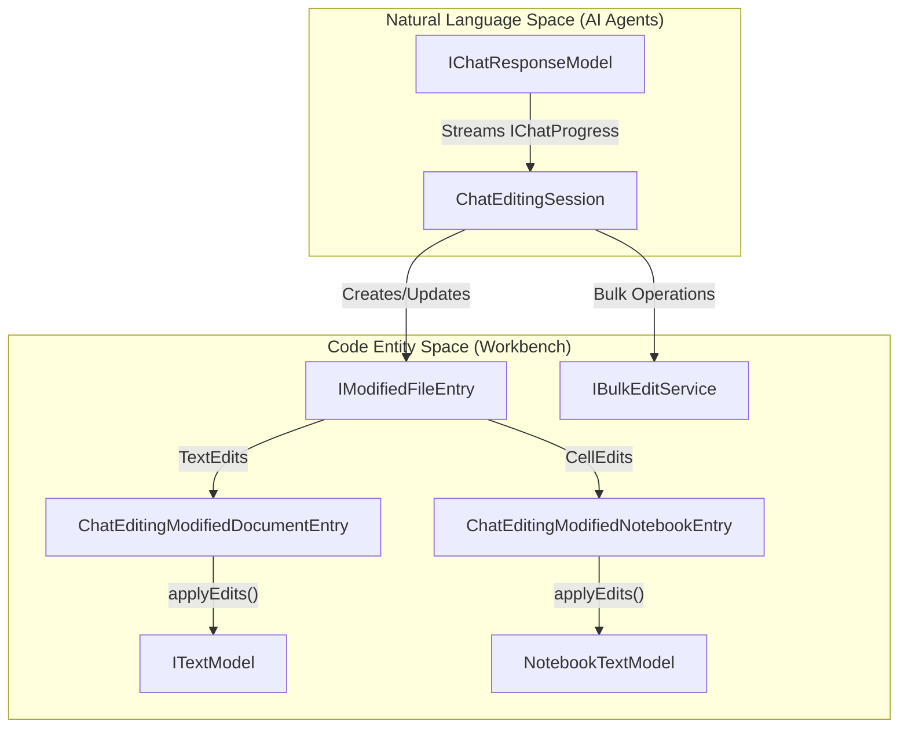
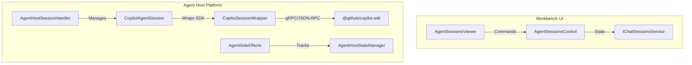

# Chat Editing and Agent Sessions

Relevant source files

The following files were used as context for generating this wiki page:

- [src/vs/platform/agentHost/common/agentModelPricing.ts](src/vs/platform/agentHost/common/agentModelPricing.ts)
- [src/vs/platform/agentHost/common/agentModelSource.ts](src/vs/platform/agentHost/common/agentModelSource.ts)
- [src/vs/platform/agentHost/common/agentService.ts](src/vs/platform/agentHost/common/agentService.ts)
- [src/vs/platform/agentHost/common/claudeProviders.ts](src/vs/platform/agentHost/common/claudeProviders.ts)
- [src/vs/platform/agentHost/common/state/sessionState.ts](src/vs/platform/agentHost/common/state/sessionState.ts)
- [src/vs/platform/agentHost/node/agentHostStateManager.ts](src/vs/platform/agentHost/node/agentHostStateManager.ts)
- [src/vs/platform/agentHost/node/agentService.ts](src/vs/platform/agentHost/node/agentService.ts)
- [src/vs/platform/agentHost/node/agentSideEffects.ts](src/vs/platform/agentHost/node/agentSideEffects.ts)
- [src/vs/platform/agentHost/node/copilot/copilotAgent.ts](src/vs/platform/agentHost/node/copilot/copilotAgent.ts)
- [src/vs/platform/agentHost/node/copilot/copilotAgentSession.ts](src/vs/platform/agentHost/node/copilot/copilotAgentSession.ts)
- [src/vs/platform/agentHost/test/node/agentHostStateManager.test.ts](src/vs/platform/agentHost/test/node/agentHostStateManager.test.ts)
- [src/vs/platform/agentHost/test/node/agentService.test.ts](src/vs/platform/agentHost/test/node/agentService.test.ts)
- [src/vs/platform/agentHost/test/node/agentSideEffects.test.ts](src/vs/platform/agentHost/test/node/agentSideEffects.test.ts)
- [src/vs/platform/agentHost/test/node/claudeModelSelection.test.ts](src/vs/platform/agentHost/test/node/claudeModelSelection.test.ts)
- [src/vs/platform/agentHost/test/node/copilotAgent.test.ts](src/vs/platform/agentHost/test/node/copilotAgent.test.ts)
- [src/vs/platform/agentHost/test/node/copilotAgentSession.test.ts](src/vs/platform/agentHost/test/node/copilotAgentSession.test.ts)
- [src/vs/platform/agentHost/test/node/mockAgent.ts](src/vs/platform/agentHost/test/node/mockAgent.ts)
- [src/vs/workbench/contrib/chat/browser/actions/chatContinueInAction.ts](src/vs/workbench/contrib/chat/browser/actions/chatContinueInAction.ts)
- [src/vs/workbench/contrib/chat/browser/actions/chatTitleActions.ts](src/vs/workbench/contrib/chat/browser/actions/chatTitleActions.ts)
- [src/vs/workbench/contrib/chat/browser/agentSessions/agentHost/agentHostChatContribution.ts](src/vs/workbench/contrib/chat/browser/agentSessions/agentHost/agentHostChatContribution.ts)
- [src/vs/workbench/contrib/chat/browser/agentSessions/agentHost/agentHostLanguageModelProvider.ts](src/vs/workbench/contrib/chat/browser/agentSessions/agentHost/agentHostLanguageModelProvider.ts)
- [src/vs/workbench/contrib/chat/browser/agentSessions/agentHost/agentHostSessionHandler.ts](src/vs/workbench/contrib/chat/browser/agentSessions/agentHost/agentHostSessionHandler.ts)
- [src/vs/workbench/contrib/chat/browser/agentSessions/agentHost/agentHostSessionListController.ts](src/vs/workbench/contrib/chat/browser/agentSessions/agentHost/agentHostSessionListController.ts)
- [src/vs/workbench/contrib/chat/browser/agentSessions/agentHost/stateToProgressAdapter.ts](src/vs/workbench/contrib/chat/browser/agentSessions/agentHost/stateToProgressAdapter.ts)
- [src/vs/workbench/contrib/chat/browser/agentSessions/agentSessions.contribution.ts](src/vs/workbench/contrib/chat/browser/agentSessions/agentSessions.contribution.ts)
- [src/vs/workbench/contrib/chat/browser/agentSessions/agentSessions.ts](src/vs/workbench/contrib/chat/browser/agentSessions/agentSessions.ts)
- [src/vs/workbench/contrib/chat/browser/agentSessions/agentSessionsActions.ts](src/vs/workbench/contrib/chat/browser/agentSessions/agentSessionsActions.ts)
- [src/vs/workbench/contrib/chat/browser/agentSessions/agentSessionsControl.ts](src/vs/workbench/contrib/chat/browser/agentSessions/agentSessionsControl.ts)
- [src/vs/workbench/contrib/chat/browser/agentSessions/agentSessionsFilter.ts](src/vs/workbench/contrib/chat/browser/agentSessions/agentSessionsFilter.ts)
- [src/vs/workbench/contrib/chat/browser/agentSessions/agentSessionsModel.ts](src/vs/workbench/contrib/chat/browser/agentSessions/agentSessionsModel.ts)
- [src/vs/workbench/contrib/chat/browser/agentSessions/agentSessionsPicker.ts](src/vs/workbench/contrib/chat/browser/agentSessions/agentSessionsPicker.ts)
- [src/vs/workbench/contrib/chat/browser/agentSessions/agentSessionsViewer.ts](src/vs/workbench/contrib/chat/browser/agentSessions/agentSessionsViewer.ts)
- [src/vs/workbench/contrib/chat/browser/agentSessions/media/agentsessionsviewer.css](src/vs/workbench/contrib/chat/browser/agentSessions/media/agentsessionsviewer.css)
- [src/vs/workbench/contrib/chat/browser/chatEditing/chatEditingActions.ts](src/vs/workbench/contrib/chat/browser/chatEditing/chatEditingActions.ts)
- [src/vs/workbench/contrib/chat/browser/chatEditing/chatEditingCheckpointTimeline.ts](src/vs/workbench/contrib/chat/browser/chatEditing/chatEditingCheckpointTimeline.ts)
- [src/vs/workbench/contrib/chat/browser/chatEditing/chatEditingCheckpointTimelineImpl.ts](src/vs/workbench/contrib/chat/browser/chatEditing/chatEditingCheckpointTimelineImpl.ts)
- [src/vs/workbench/contrib/chat/browser/chatEditing/chatEditingCodeEditorIntegration.ts](src/vs/workbench/contrib/chat/browser/chatEditing/chatEditingCodeEditorIntegration.ts)
- [src/vs/workbench/contrib/chat/browser/chatEditing/chatEditingEditorActions.ts](src/vs/workbench/contrib/chat/browser/chatEditing/chatEditingEditorActions.ts)
- [src/vs/workbench/contrib/chat/browser/chatEditing/chatEditingEditorContextKeys.ts](src/vs/workbench/contrib/chat/browser/chatEditing/chatEditingEditorContextKeys.ts)
- [src/vs/workbench/contrib/chat/browser/chatEditing/chatEditingEditorOverlay.ts](src/vs/workbench/contrib/chat/browser/chatEditing/chatEditingEditorOverlay.ts)
- [src/vs/workbench/contrib/chat/browser/chatEditing/chatEditingExplanationWidget.ts](src/vs/workbench/contrib/chat/browser/chatEditing/chatEditingExplanationWidget.ts)
- [src/vs/workbench/contrib/chat/browser/chatEditing/chatEditingModifiedDocumentEntry.ts](src/vs/workbench/contrib/chat/browser/chatEditing/chatEditingModifiedDocumentEntry.ts)
- [src/vs/workbench/contrib/chat/browser/chatEditing/chatEditingModifiedFileEntry.ts](src/vs/workbench/contrib/chat/browser/chatEditing/chatEditingModifiedFileEntry.ts)
- [src/vs/workbench/contrib/chat/browser/chatEditing/chatEditingModifiedNotebookEntry.ts](src/vs/workbench/contrib/chat/browser/chatEditing/chatEditingModifiedNotebookEntry.ts)
- [src/vs/workbench/contrib/chat/browser/chatEditing/chatEditingOperations.ts](src/vs/workbench/contrib/chat/browser/chatEditing/chatEditingOperations.ts)
- [src/vs/workbench/contrib/chat/browser/chatEditing/chatEditingServiceImpl.ts](src/vs/workbench/contrib/chat/browser/chatEditing/chatEditingServiceImpl.ts)
- [src/vs/workbench/contrib/chat/browser/chatEditing/chatEditingSession.ts](src/vs/workbench/contrib/chat/browser/chatEditing/chatEditingSession.ts)
- [src/vs/workbench/contrib/chat/browser/chatEditing/chatEditingTextModelContentProviders.ts](src/vs/workbench/contrib/chat/browser/chatEditing/chatEditingTextModelContentProviders.ts)
- [src/vs/workbench/contrib/chat/browser/chatEditing/media/chatEditingExplanationWidget.css](src/vs/workbench/contrib/chat/browser/chatEditing/media/chatEditingExplanationWidget.css)
- [src/vs/workbench/contrib/chat/browser/chatEditing/notebook/chatEditingModifiedNotebookDiff.ts](src/vs/workbench/contrib/chat/browser/chatEditing/notebook/chatEditingModifiedNotebookDiff.ts)
- [src/vs/workbench/contrib/chat/browser/chatEditing/notebook/chatEditingModifiedNotebookSnapshot.ts](src/vs/workbench/contrib/chat/browser/chatEditing/notebook/chatEditingModifiedNotebookSnapshot.ts)
- [src/vs/workbench/contrib/chat/browser/chatEditing/notebook/chatEditingNotebookCellEntry.ts](src/vs/workbench/contrib/chat/browser/chatEditing/notebook/chatEditingNotebookCellEntry.ts)
- [src/vs/workbench/contrib/chat/browser/chatEditing/notebook/chatEditingNotebookEditorIntegration.ts](src/vs/workbench/contrib/chat/browser/chatEditing/notebook/chatEditingNotebookEditorIntegration.ts)
- [src/vs/workbench/contrib/chat/browser/chatEditing/notebook/chatEditingNotebookFileSystemProvider.ts](src/vs/workbench/contrib/chat/browser/chatEditing/notebook/chatEditingNotebookFileSystemProvider.ts)
- [src/vs/workbench/contrib/chat/browser/chatEditing/notebook/overlayToolbarDecorator.ts](src/vs/workbench/contrib/chat/browser/chatEditing/notebook/overlayToolbarDecorator.ts)
- [src/vs/workbench/contrib/chat/browser/widget/input/chatInputPickerActionItem.ts](src/vs/workbench/contrib/chat/browser/widget/input/chatInputPickerActionItem.ts)
- [src/vs/workbench/contrib/chat/browser/widget/input/delegationSessionPickerActionItem.ts](src/vs/workbench/contrib/chat/browser/widget/input/delegationSessionPickerActionItem.ts)
- [src/vs/workbench/contrib/chat/browser/widget/input/modePickerActionItem.ts](src/vs/workbench/contrib/chat/browser/widget/input/modePickerActionItem.ts)
- [src/vs/workbench/contrib/chat/browser/widget/input/sessionTargetPickerActionItem.ts](src/vs/workbench/contrib/chat/browser/widget/input/sessionTargetPickerActionItem.ts)
- [src/vs/workbench/contrib/chat/common/editing/chatEditingService.ts](src/vs/workbench/contrib/chat/common/editing/chatEditingService.ts)
- [src/vs/workbench/contrib/chat/test/browser/agentSessions/agentHostChatContribution.test.ts](src/vs/workbench/contrib/chat/test/browser/agentSessions/agentHostChatContribution.test.ts)
- [src/vs/workbench/contrib/chat/test/browser/agentSessions/agentHostClientTools.test.ts](src/vs/workbench/contrib/chat/test/browser/agentSessions/agentHostClientTools.test.ts)
- [src/vs/workbench/contrib/chat/test/browser/agentSessions/agentHostLanguageModelProvider.test.ts](src/vs/workbench/contrib/chat/test/browser/agentSessions/agentHostLanguageModelProvider.test.ts)
- [src/vs/workbench/contrib/chat/test/browser/agentSessions/agentSessionViewModel.test.ts](src/vs/workbench/contrib/chat/test/browser/agentSessions/agentSessionViewModel.test.ts)
- [src/vs/workbench/contrib/chat/test/browser/agentSessions/agentSessionsDataSource.test.ts](src/vs/workbench/contrib/chat/test/browser/agentSessions/agentSessionsDataSource.test.ts)
- [src/vs/workbench/contrib/chat/test/browser/agentSessions/stateToProgressAdapter.test.ts](src/vs/workbench/contrib/chat/test/browser/agentSessions/stateToProgressAdapter.test.ts)
- [src/vs/workbench/contrib/notebook/browser/diff/inlineDiff/notebookDeletedCellDecorator.ts](src/vs/workbench/contrib/notebook/browser/diff/inlineDiff/notebookDeletedCellDecorator.ts)
- [src/vs/workbench/contrib/notebook/browser/view/notebookCellAnchor.ts](src/vs/workbench/contrib/notebook/browser/view/notebookCellAnchor.ts)
- [src/vs/workbench/contrib/notebook/browser/view/notebookCellListView.ts](src/vs/workbench/contrib/notebook/browser/view/notebookCellListView.ts)
- [src/vs/workbench/contrib/notebook/browser/viewParts/notebookViewZones.ts](src/vs/workbench/contrib/notebook/browser/viewParts/notebookViewZones.ts)
- [src/vs/workbench/contrib/notebook/test/browser/notebookCellAnchor.test.ts](src/vs/workbench/contrib/notebook/test/browser/notebookCellAnchor.test.ts)
- [src/vs/workbench/contrib/notebook/test/browser/notebookViewZones.test.ts](src/vs/workbench/contrib/notebook/test/browser/notebookViewZones.test.ts)

This page details the technical implementation of AI-driven file editing and the management of agent-led chat sessions. It covers the lifecycle of a `ChatEditingSession`, the specialized entries for text and notebook files, the `AgentHost` session management, and the UI components used to visualize and control these sessions.

## Chat Editing Sessions

A `ChatEditingSession` is the central coordinator for AI-suggested changes across multiple files within a single chat context [src/vs/workbench/contrib/chat/browser/chatEditing/chatEditingSession.ts:82-114](). It manages the state of modified files, coordinates with the `IChatService` to apply streaming edits, and provides the mechanism for bulk acceptance or rejection of changes.

### Key Components

*   **IChatEditingSession**: Manages a collection of `IModifiedFileEntry` objects and tracks the session state (e.g., `Idle`, `Streaming`, `Disposed`) [src/vs/workbench/contrib/chat/common/editing/chatEditingService.ts:41-41]().
*   **ModifiedFileEntryState**: Represents the lifecycle of an edit: `Modified`, `Accepted`, `Rejected`, or `Deleted` [src/vs/workbench/contrib/chat/common/editing/chatEditingService.ts:32-32]().
*   **ThrottledSequencer**: A specialized `Sequencer` used to queue edits with specific durations to provide a "typing" effect during AI generation, ensuring a smooth UI experience during high-frequency streaming [src/vs/workbench/contrib/chat/browser/chatEditing/chatEditingSession.ts:82-114]().
*   **ChatEditingSessionStorage**: Handles the persistence of editing session states, allowing users to resume or review AI edits across workbench restarts [src/vs/workbench/contrib/chat/browser/chatEditing/chatEditingSessionStorage.ts:53-53]().

### Data Flow: AI Edit to File System

The following diagram illustrates how an AI response is transformed into workspace edits and managed within a session.

Sources: [src/vs/workbench/contrib/chat/browser/chatEditing/chatEditingSession.ts:82-140](), [src/vs/workbench/contrib/chat/common/editing/chatEditingService.ts:32-41](), [src/vs/workbench/contrib/chat/browser/chatEditing/chatEditingModifiedDocumentEntry.ts:48-53](), [src/vs/workbench/contrib/chat/browser/chatEditing/chatEditingModifiedNotebookEntry.ts:61-104](), [src/vs/workbench/contrib/chat/browser/chatEditing/chatEditingSessionStorage.ts:53-53]()

## Modified File and Notebook Entries

Changes to files are encapsulated in implementations of `IModifiedFileEntry`. These classes handle the diffing logic, snapshots for undo/redo, and integration with the editor UI.

### Text Document Entries
`ChatEditingModifiedDocumentEntry` handles standard text files [src/vs/workbench/contrib/chat/browser/chatEditing/chatEditingModifiedDocumentEntry.ts:48-53](). It uses a `ChatEditingTextModelContentProvider` to serve the "original" version of a file (using the `modified-file-entry` scheme) for diffing purposes [src/vs/workbench/contrib/chat/browser/chatEditing/chatEditingTextModelContentProviders.ts:41-41]().

### Notebook Entries
`ChatEditingModifiedNotebookEntry` manages complex changes in `.ipynb` files [src/vs/workbench/contrib/chat/browser/chatEditing/chatEditingModifiedNotebookEntry.ts:61-104](). Because notebooks consist of multiple cells, this entry tracks:
*   **Cell Edits**: Changes to the content of existing cells, mapped via `cellEntryMap` [src/vs/workbench/contrib/chat/browser/chatEditing/chatEditingModifiedNotebookEntry.ts:85-86]().
*   **Structural Changes**: Insertion, deletion, or movement of cells, coordinated via helper functions like `adjustCellDiffAndOriginalModelBasedOnCellAddDelete` [src/vs/workbench/contrib/chat/browser/chatEditing/chatEditingModifiedNotebookEntry.ts:55-56]().
*   **Notebook Snapshots**: Uses `createSnapshot` and `restoreSnapshot` to handle complex undo/redo states that involve both cell content and metadata [src/vs/workbench/contrib/chat/browser/chatEditing/notebook/chatEditingModifiedNotebookSnapshot.ts:50-50]().

Sources: [src/vs/workbench/contrib/chat/browser/chatEditing/chatEditingModifiedNotebookEntry.ts:61-104](), [src/vs/workbench/contrib/chat/browser/chatEditing/chatEditingModifiedFileEntry.ts:43-115](), [src/vs/workbench/contrib/chat/browser/chatEditing/chatEditingTextModelContentProviders.ts:41-41](), [src/vs/workbench/contrib/chat/browser/chatEditing/notebook/chatEditingModifiedNotebookSnapshot.ts:50-50]()

## Agent Sessions and UI

Agent sessions represent long-running interactions with specialized AI participants. These are managed via the `IChatSessionsService` and visualized in the `AgentSessionsViewer`.

### AgentSessionsControl
The `AgentSessionsControl` is responsible for rendering the list of active and historical agent sessions [src/vs/workbench/contrib/chat/browser/agentSessions/agentSessionsControl.ts:84-118](). It supports:
*   **Grouping and Filtering**: Sessions can be grouped by repository or date and filtered via `AgentSessionsFilter` [src/vs/workbench/contrib/chat/browser/agentSessions/agentSessionsFilter.ts:46-46]().
*   **Status Visualization**: Displays session progress (InProgress, Failed, Completed, NeedsInput) using `AgentSessionStatus` [src/vs/workbench/contrib/chat/browser/agentSessions/agentSessionsModel.ts:17-17](). The UI uses `AgentSessionStatusIcon` to render status-specific indicators like pixel spinners for in-progress requests [src/vs/workbench/contrib/chat/browser/agentSessions/agentSessionsViewer.ts:99-126]().
*   **Interaction**: Context menus for renaming, archiving, or deleting sessions [src/vs/workbench/contrib/chat/browser/agentSessions/agentSessionsControl.ts:111-118]().

### Agent Host Architecture

The `AgentHost` platform provides the execution environment for agents like GitHub Copilot. The `CopilotAgent` class interacts with the Copilot SDK to manage the session lifecycle [src/vs/platform/agentHost/node/copilot/copilotAgent.ts:75-96]().

Sources: [src/vs/workbench/contrib/chat/browser/agentSessions/agentSessionsViewer.ts:102-126](), [src/vs/workbench/contrib/chat/browser/agentSessions/agentSessionsControl.ts:84-118](), [src/vs/platform/agentHost/node/copilot/copilotAgent.ts:75-96](), [src/vs/workbench/contrib/chat/browser/agentSessions/agentHost/agentHostSessionHandler.ts:46-70](), [src/vs/platform/agentHost/node/copilot/copilotAgentSession.ts:35-48]()

## Snapshot and Undo/Redo Controller

To ensure AI edits are safe, the system maintains snapshots of file states before agent-driven modifications.

*   **Checkpoint Timeline**: `ChatEditingCheckpointTimelineImpl` provides a filesystem-backed delegate for storing versions of files throughout an editing session [src/vs/workbench/contrib/chat/browser/chatEditing/chatEditingCheckpointTimelineImpl.ts:46-46]().
*   **Undo/Redo Integration**: AI edits are pushed to the standard `IUndoRedoService`. Edits are often tagged with a `undoStopId` to allow reverting an entire AI "turn" in one action [src/vs/workbench/contrib/chat/browser/chatEditing/chatEditingSession.ts:116-127]().
*   **External Edit Tracking**: The `_isExternalEditInProgress` flag in `AbstractChatEditingModifiedFileEntry` ensures that file system changes during AI streaming are treated as agent edits rather than user edits [src/vs/workbench/contrib/chat/browser/chatEditing/chatEditingModifiedFileEntry.ts:67-68]().
*   **Agent Host Snapshots**: The `IAgentHostCheckpointService` manages snapshots at the platform level, allowing the agent host to restore state if a turn is cancelled or fails [src/vs/platform/agentHost/node/copilot/copilotAgent.ts:34-34]().

Sources: [src/vs/workbench/contrib/chat/browser/chatEditing/chatEditingSession.ts:116-140](), [src/vs/workbench/contrib/chat/browser/chatEditing/chatEditingModifiedFileEntry.ts:67-68](), [src/vs/workbench/contrib/chat/browser/chatEditing/chatEditingCheckpointTimelineImpl.ts:46-46](), [src/vs/platform/agentHost/node/copilot/copilotAgent.ts:34-34]()

## Local vs Remote Agent Session Controllers

Agent sessions can be managed locally or delegated to a remote provider (e.g., a GitHub Copilot cloud backend). The delegation is often triggered via the "Continue Chat in..." action [src/vs/workbench/contrib/chat/browser/actions/chatContinueInAction.ts:120-128]().

| Feature | Local Controller | Remote Controller |
| :--- | :--- | :--- |
| **Implementation** | `LocalChatSessionUri` [src/vs/workbench/contrib/chat/common/model/chatUri.ts:16-16]() | `AgentHostSessionHandler` / `CopilotAgentSession` [src/vs/workbench/contrib/chat/browser/agentSessions/agentHost/agentHostSessionHandler.ts:46-70](), [src/vs/platform/agentHost/node/copilot/copilotAgentSession.ts:35-48]() |
| **Storage** | Workbench Local Storage [src/vs/workbench/contrib/chat/browser/agentSessions/agentSessionsModel.ts:23-23]() | Remote Backend Service / Extension Host via `ISessionDataService` [src/vs/platform/agentHost/node/copilot/copilotAgent.ts:52-52]() |
| **RPC Bridge** | N/A | `MainThreadChatSessions` ↔ `ExtHostChatSessions` [src/vs/workbench/api/browser/mainThreadChatSessions.ts:58-103]() |
| **Side Effects** | UI-only | `AgentSideEffects` handles filesystem, tool calls, and telemetry [src/vs/platform/agentHost/node/agentSideEffects.ts:135-146]() |

Sources: [src/vs/workbench/contrib/chat/browser/agentSessions/agentSessionsModel.ts:17-23](), [src/vs/workbench/contrib/chat/common/model/chatUri.ts:16-16](), [src/vs/workbench/api/browser/mainThreadChatSessions.ts:58-103](), [src/vs/platform/agentHost/node/copilot/copilotAgentSession.ts:35-48](), [src/vs/platform/agentHost/node/agentSideEffects.ts:135-146](), [src/vs/workbench/contrib/chat/browser/actions/chatContinueInAction.ts:120-128](), [src/vs/platform/agentHost/node/copilot/copilotAgent.ts:52-52]()36