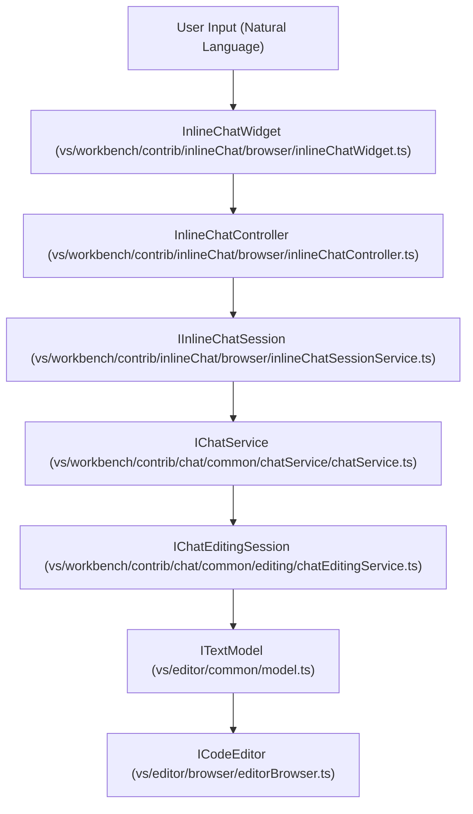
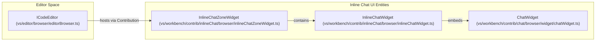

# Inline Chat

Relevant source files

The following files were used as context for generating this wiki page:

- [src/vs/editor/contrib/inlineCompletions/browser/inlineCompletionsAccessibleView.ts](src/vs/editor/contrib/inlineCompletions/browser/inlineCompletionsAccessibleView.ts)
- [src/vs/platform/accessibility/browser/accessibleViewRegistry.ts](src/vs/platform/accessibility/browser/accessibleViewRegistry.ts)
- [src/vs/workbench/browser/parts/notifications/notificationAccessibleView.ts](src/vs/workbench/browser/parts/notifications/notificationAccessibleView.ts)
- [src/vs/workbench/contrib/codeEditor/browser/emptyTextEditorHint/emptyTextEditorHint.ts](src/vs/workbench/contrib/codeEditor/browser/emptyTextEditorHint/emptyTextEditorHint.ts)
- [src/vs/workbench/contrib/comments/browser/commentsAccessibleView.ts](src/vs/workbench/contrib/comments/browser/commentsAccessibleView.ts)
- [src/vs/workbench/contrib/inlineChat/browser/inlineChat.contribution.ts](src/vs/workbench/contrib/inlineChat/browser/inlineChat.contribution.ts)
- [src/vs/workbench/contrib/inlineChat/browser/inlineChatActions.ts](src/vs/workbench/contrib/inlineChat/browser/inlineChatActions.ts)
- [src/vs/workbench/contrib/inlineChat/browser/inlineChatController.ts](src/vs/workbench/contrib/inlineChat/browser/inlineChatController.ts)
- [src/vs/workbench/contrib/inlineChat/browser/inlineChatSessionService.ts](src/vs/workbench/contrib/inlineChat/browser/inlineChatSessionService.ts)
- [src/vs/workbench/contrib/inlineChat/browser/inlineChatSessionServiceImpl.ts](src/vs/workbench/contrib/inlineChat/browser/inlineChatSessionServiceImpl.ts)
- [src/vs/workbench/contrib/inlineChat/browser/inlineChatWidget.ts](src/vs/workbench/contrib/inlineChat/browser/inlineChatWidget.ts)
- [src/vs/workbench/contrib/inlineChat/browser/inlineChatZoneWidget.ts](src/vs/workbench/contrib/inlineChat/browser/inlineChatZoneWidget.ts)
- [src/vs/workbench/contrib/inlineChat/browser/media/inlineChat.css](src/vs/workbench/contrib/inlineChat/browser/media/inlineChat.css)
- [src/vs/workbench/contrib/inlineChat/common/inlineChat.ts](src/vs/workbench/contrib/inlineChat/common/inlineChat.ts)
- [src/vs/workbench/contrib/interactive/browser/interactive.contribution.ts](src/vs/workbench/contrib/interactive/browser/interactive.contribution.ts)
- [src/vs/workbench/contrib/interactive/browser/interactiveCommon.ts](src/vs/workbench/contrib/interactive/browser/interactiveCommon.ts)
- [src/vs/workbench/contrib/interactive/browser/interactiveEditor.ts](src/vs/workbench/contrib/interactive/browser/interactiveEditor.ts)
- [src/vs/workbench/contrib/interactive/browser/interactiveEditorInput.ts](src/vs/workbench/contrib/interactive/browser/interactiveEditorInput.ts)
- [src/vs/workbench/contrib/interactive/browser/interactiveHistoryService.ts](src/vs/workbench/contrib/interactive/browser/interactiveHistoryService.ts)
- [src/vs/workbench/contrib/interactive/browser/replInputHintContentWidget.ts](src/vs/workbench/contrib/interactive/browser/replInputHintContentWidget.ts)
- [src/vs/workbench/contrib/notebook/browser/contrib/editorHint/emptyCellEditorHint.ts](src/vs/workbench/contrib/notebook/browser/contrib/editorHint/emptyCellEditorHint.ts)
- [src/vs/workbench/contrib/notebook/browser/media/notebookCellEditorHint.css](src/vs/workbench/contrib/notebook/browser/media/notebookCellEditorHint.css)
- [src/vs/workbench/contrib/notebook/browser/notebookAccessibilityHelp.ts](src/vs/workbench/contrib/notebook/browser/notebookAccessibilityHelp.ts)
- [src/vs/workbench/contrib/notebook/browser/notebookAccessibilityProvider.ts](src/vs/workbench/contrib/notebook/browser/notebookAccessibilityProvider.ts)
- [src/vs/workbench/contrib/notebook/browser/notebookAccessibleView.ts](src/vs/workbench/contrib/notebook/browser/notebookAccessibleView.ts)
- [src/vs/workbench/contrib/notebook/browser/notebookOptions.ts](src/vs/workbench/contrib/notebook/browser/notebookOptions.ts)
- [src/vs/workbench/contrib/notebook/browser/viewModel/cellOutputTextHelper.ts](src/vs/workbench/contrib/notebook/browser/viewModel/cellOutputTextHelper.ts)
- [src/vs/workbench/contrib/notebook/common/notebookDiffEditorInput.ts](src/vs/workbench/contrib/notebook/common/notebookDiffEditorInput.ts)
- [src/vs/workbench/contrib/notebook/test/browser/cellOutput.test.ts](src/vs/workbench/contrib/notebook/test/browser/cellOutput.test.ts)
- [src/vs/workbench/contrib/replNotebook/browser/repl.contribution.ts](src/vs/workbench/contrib/replNotebook/browser/repl.contribution.ts)
- [src/vs/workbench/contrib/replNotebook/browser/replEditor.ts](src/vs/workbench/contrib/replNotebook/browser/replEditor.ts)
- [src/vs/workbench/contrib/replNotebook/browser/replEditorAccessibilityHelp.ts](src/vs/workbench/contrib/replNotebook/browser/replEditorAccessibilityHelp.ts)
- [src/vs/workbench/contrib/replNotebook/browser/replEditorInput.ts](src/vs/workbench/contrib/replNotebook/browser/replEditorInput.ts)
- [src/vscode-dts/vscode.proposed.interactive.d.ts](src/vscode-dts/vscode.proposed.interactive.d.ts)
- [src/vscode-dts/vscode.proposed.notebookReplDocument.d.ts](src/vscode-dts/vscode.proposed.notebookReplDocument.d.ts)

The **Inline Chat** system provides a rich, interactive AI interface embedded directly within the VS Code editor. It allows users to perform natural language edits, ask questions about specific code blocks, and fix diagnostics without leaving the current file context. The system is built upon a "Zone Widget" architecture that shifts editor lines to create space for a dedicated chat UI.

## Architecture Overview

Inline Chat is orchestrated by the `InlineChatController`, which manages the lifecycle of sessions and the visibility of the UI components. It bridges the gap between the Monaco editor's text space and the AI's natural language processing capabilities provided by the `IChatService`.

### Key Components

| Class/Interface | Role |
| :--- | :--- |
| `InlineChatController` | Primary editor contribution that manages the widget and session state for a specific editor instance [src/vs/workbench/contrib/inlineChat/browser/inlineChatController.ts:92-94](). |
| `InlineChatWidget` | The UI layer containing the chat input, response list, and status toolbars [src/vs/workbench/contrib/inlineChat/browser/inlineChatWidget.ts:73-89](). |
| `InlineChatZoneWidget` | A specialized `ZoneWidget` that embeds the `InlineChatWidget` into the editor's vertical flow [src/vs/workbench/contrib/inlineChat/browser/inlineChatZoneWidget.ts:67-80](). |
| `IInlineChatSessionService` | A singleton service managing active sessions across all editors and linking them to `IChatModel` [src/vs/workbench/contrib/inlineChat/browser/inlineChatSessionService.ts:35-44](). |
| `IInlineChatSession` | Encapsulates the state of an active interaction, including the underlying `IChatModel` and `IChatEditingSession` [src/vs/workbench/contrib/inlineChat/browser/inlineChatSessionService.ts:24-33](). |

### Natural Language to Code Entity Mapping

The following diagram illustrates how natural language requests are transformed into code modifications through the Inline Chat subsystems.

**Request Flow: Natural Language to Code Edits**

**Sources:** [src/vs/workbench/contrib/inlineChat/browser/inlineChatController.ts:92-132](), [src/vs/workbench/contrib/inlineChat/browser/inlineChatWidget.ts:73-115](), [src/vs/workbench/contrib/inlineChat/browser/inlineChatSessionService.ts:24-44]()

---

## InlineChatController

The `InlineChatController` is an `IEditorContribution` instantiated for every code editor [src/vs/workbench/contrib/inlineChat/browser/inlineChatController.ts:92-94](). It acts as the central coordinator for triggering the chat UI and handling user actions.

### Session Lifecycle
1.  **Start**: Triggered via `run(options)` which initializes the chat interaction [src/vs/workbench/contrib/inlineChat/browser/inlineChatController.ts:404-410]().
2.  **UI Injection**: The controller lazily creates an `InlineChatZoneWidget` and positions it based on the current selection or a provided position [src/vs/workbench/contrib/inlineChat/browser/inlineChatController.ts:108-127]().
3.  **Request Handling**: When a user submits a message, the controller delegates the request to the `IChatService` using the session's context.
4.  **Termination**: Sessions can be terminated by user acceptance, rejection, or manual cancellation. The `IInlineChatSessionService` handles the cleanup of the session state [src/vs/workbench/contrib/inlineChat/browser/inlineChatSessionServiceImpl.ts:85-91]().

**Sources:** [src/vs/workbench/contrib/inlineChat/browser/inlineChatController.ts:92-132](), [src/vs/workbench/contrib/inlineChat/browser/inlineChatSessionServiceImpl.ts:71-147]()

---

## InlineChatWidget and Zone UI

The UI is divided into the **Zone Widget** (which manages the editor layout) and the **Inline Chat Widget** (which renders the chat content).

### Component Hierarchy
-   **InlineChatZoneWidget**: Extends `ZoneWidget`. It creates a container in the editor and handles vertical resizing to accommodate the chat content [src/vs/workbench/contrib/inlineChat/browser/inlineChatZoneWidget.ts:67-80]().
-   **EditorBasedInlineChatWidget**: A wrapper around the standard `ChatWidget` optimized for the inline experience. It includes:
    -   `chatWidget`: The core chat renderer [src/vs/workbench/contrib/inlineChat/browser/inlineChatWidget.ts:95]().
    -   `status`: A toolbar for actions like "Accept", "Discard", and "Regenerate" [src/vs/workbench/contrib/inlineChat/browser/inlineChatWidget.ts:80-86]().

**UI Structure Mapping**

**Sources:** [src/vs/workbench/contrib/inlineChat/browser/inlineChatZoneWidget.ts:67-80](), [src/vs/workbench/contrib/inlineChat/browser/inlineChatWidget.ts:73-95]()

---

## Session Management

The `InlineChatSessionServiceImpl` manages the state of active inline chat interactions across the workbench.

### Key Functions
-   **createSession(editor)**: Initializes a new session with the `ChatAgentLocation.EditorInline` location [src/vs/workbench/contrib/inlineChat/browser/inlineChatSessionServiceImpl.ts:71-83]().
-   **getSessionByTextModel(uri)**: Retrieves the session associated with a specific document URI [src/vs/workbench/contrib/inlineChat/browser/inlineChatSessionServiceImpl.ts:149-162]().
-   **Automatic Termination**: The service monitors the state of the editing session. If all entries are accepted or rejected and no request is in progress, the session is automatically disposed [src/vs/workbench/contrib/inlineChat/browser/inlineChatSessionServiceImpl.ts:94-129]().

### Data Flow: Session Interaction
1.  **Request**: User types in `InlineChatWidget` -> submits to `IChatService`.
2.  **Response**: `IChatService` returns progress and content parts (e.g., `markdownContent`, `textEdit`).
3.  **Edits**: If the response contains code changes, the `IChatEditingSession` (part of `IInlineChatSession`) manages these changes [src/vs/workbench/contrib/inlineChat/browser/inlineChatSessionService.ts:29]().

**Sources:** [src/vs/workbench/contrib/inlineChat/browser/inlineChatSessionServiceImpl.ts:34-172](), [src/vs/workbench/contrib/inlineChat/browser/inlineChatSessionService.ts:24-44]()

---

## Configuration and Context Keys

Inline Chat behavior is controlled by several settings and context keys defined in `vs/workbench/contrib/inlineChat/common/inlineChat.ts`.

### Important Settings
-   `inlineChat.affordance`: Controls if the inline chat affordance is shown when text is selected [src/vs/workbench/contrib/inlineChat/common/inlineChat.ts:36-50]().
-   `inlineChat.fixDiagnostics`: Controls whether the Fix action is shown for diagnostics in the editor [src/vs/workbench/contrib/inlineChat/common/inlineChat.ts:51-59]().
-   `inlineChat.askInChat`: Controls whether files in a chat editing session use "Ask in Chat" instead of "Inline Chat" [src/vs/workbench/contrib/inlineChat/common/inlineChat.ts:60-64]().

### Context Keys
-   `inlineChatVisible`: True when the interactive editor input is visible [src/vs/workbench/contrib/inlineChat/common/inlineChat.ts:76]().
-   `inlineChatFocused`: True when the interactive editor input is focused [src/vs/workbench/contrib/inlineChat/common/inlineChat.ts:77]().
-   `inlineChatPossible`: Whether a provider for inline chat exists and whether an editor for inline chat is open [src/vs/workbench/contrib/inlineChat/common/inlineChat.ts:72]().
-   `inlineChatFileBelongsToChat`: Whether the current file belongs to a chat editing session [src/vs/workbench/contrib/inlineChat/common/inlineChat.ts:83]().
-   `inlineChatTerminated`: Whether the current inline chat session is terminated [src/vs/workbench/contrib/inlineChat/common/inlineChat.ts:84]().

**Sources:** [src/vs/workbench/contrib/inlineChat/common/inlineChat.ts:16-93](), [src/vs/workbench/contrib/inlineChat/browser/inlineChatActions.ts:41-46]()

---

## Interactive API (Proposed)

The codebase references a proposed `interactive` namespace for cross-session communication, allowing transfers of active chat states.

### Proposed Capabilities
-   `transferActiveChat(toWorkspace)`: Allows moving an active chat session between different workspace contexts [src/vscode-dts/vscode.proposed.interactive.d.ts:8-10]().

**Sources:** [src/vscode-dts/vscode.proposed.interactive.d.ts:1-11]()