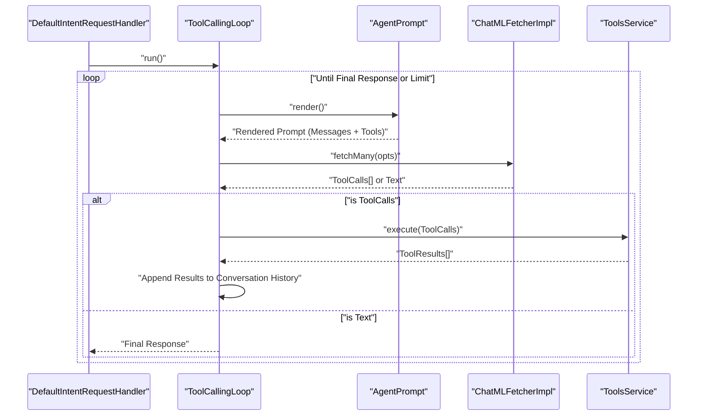
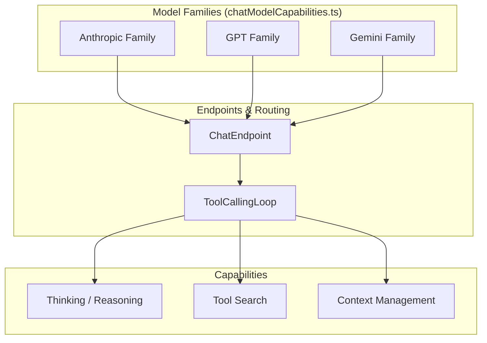
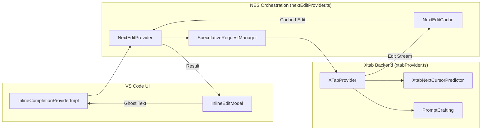

# Copilot Extension: Agent Orchestration

Relevant source files

The following files were used as context for generating this wiki page:

- [build/agent-sdk/agents/claude/package-lock.json](build/agent-sdk/agents/claude/package-lock.json)
- [build/agent-sdk/agents/claude/package.json](build/agent-sdk/agents/claude/package.json)
- [build/agent-sdk/agents/codex/package-lock.json](build/agent-sdk/agents/codex/package-lock.json)
- [build/agent-sdk/agents/codex/package.json](build/agent-sdk/agents/codex/package.json)
- [extensions/copilot/assets/prompts/skills/troubleshoot/SKILL.md](extensions/copilot/assets/prompts/skills/troubleshoot/SKILL.md)
- [extensions/copilot/src/extension/chat/vscode-node/chatDebugFileLoggerService.ts](extensions/copilot/src/extension/chat/vscode-node/chatDebugFileLoggerService.ts)
- [extensions/copilot/src/extension/chat/vscode-node/chatHookTelemetry.ts](extensions/copilot/src/extension/chat/vscode-node/chatHookTelemetry.ts)
- [extensions/copilot/src/extension/chat/vscode-node/test/chatDebugFileLoggerService.spec.ts](extensions/copilot/src/extension/chat/vscode-node/test/chatDebugFileLoggerService.spec.ts)
- [extensions/copilot/src/extension/chatSessions/copilotcli/node/copilotcliPromptResolver.ts](extensions/copilot/src/extension/chatSessions/copilotcli/node/copilotcliPromptResolver.ts)
- [extensions/copilot/src/extension/chatSessions/copilotcli/node/test/copilotcliPromptResolver.spec.ts](extensions/copilot/src/extension/chatSessions/copilotcli/node/test/copilotcliPromptResolver.spec.ts)
- [extensions/copilot/src/extension/configuration/vscode-node/configurationMigration.ts](extensions/copilot/src/extension/configuration/vscode-node/configurationMigration.ts)
- [extensions/copilot/src/extension/inlineEdits/common/editRebase.ts](extensions/copilot/src/extension/inlineEdits/common/editRebase.ts)
- [extensions/copilot/src/extension/inlineEdits/node/nesConfigs.ts](extensions/copilot/src/extension/inlineEdits/node/nesConfigs.ts)
- [extensions/copilot/src/extension/inlineEdits/node/nextEditCache.ts](extensions/copilot/src/extension/inlineEdits/node/nextEditCache.ts)
- [extensions/copilot/src/extension/inlineEdits/node/nextEditProvider.ts](extensions/copilot/src/extension/inlineEdits/node/nextEditProvider.ts)
- [extensions/copilot/src/extension/inlineEdits/node/nextEditProviderTelemetry.ts](extensions/copilot/src/extension/inlineEdits/node/nextEditProviderTelemetry.ts)
- [extensions/copilot/src/extension/inlineEdits/node/rebaseResult.ts](extensions/copilot/src/extension/inlineEdits/node/rebaseResult.ts)
- [extensions/copilot/src/extension/inlineEdits/node/speculativeRequestManager.ts](extensions/copilot/src/extension/inlineEdits/node/speculativeRequestManager.ts)
- [extensions/copilot/src/extension/inlineEdits/test/common/editRebase.spec.ts](extensions/copilot/src/extension/inlineEdits/test/common/editRebase.spec.ts)
- [extensions/copilot/src/extension/inlineEdits/test/node/nesXtabHistoryTracker.spec.ts](extensions/copilot/src/extension/inlineEdits/test/node/nesXtabHistoryTracker.spec.ts)
- [extensions/copilot/src/extension/inlineEdits/test/node/nextEditCacheCursorDistance.spec.ts](extensions/copilot/src/extension/inlineEdits/test/node/nextEditCacheCursorDistance.spec.ts)
- [extensions/copilot/src/extension/inlineEdits/test/node/nextEditCacheRebase.spec.ts](extensions/copilot/src/extension/inlineEdits/test/node/nextEditCacheRebase.spec.ts)
- [extensions/copilot/src/extension/inlineEdits/test/node/nextEditProviderCaching.spec.ts](extensions/copilot/src/extension/inlineEdits/test/node/nextEditProviderCaching.spec.ts)
- [extensions/copilot/src/extension/inlineEdits/test/node/nextEditProviderSpeculative.spec.ts](extensions/copilot/src/extension/inlineEdits/test/node/nextEditProviderSpeculative.spec.ts)
- [extensions/copilot/src/extension/inlineEdits/test/node/nextEditProviderTelemetry.spec.ts](extensions/copilot/src/extension/inlineEdits/test/node/nextEditProviderTelemetry.spec.ts)
- [extensions/copilot/src/extension/inlineEdits/vscode-node/inlineCompletionProvider.ts](extensions/copilot/src/extension/inlineEdits/vscode-node/inlineCompletionProvider.ts)
- [extensions/copilot/src/extension/inlineEdits/vscode-node/inlineEditModel.ts](extensions/copilot/src/extension/inlineEdits/vscode-node/inlineEditModel.ts)
- [extensions/copilot/src/extension/inlineEdits/vscode-node/inlineEditProviderFeature.ts](extensions/copilot/src/extension/inlineEdits/vscode-node/inlineEditProviderFeature.ts)
- [extensions/copilot/src/extension/inlineEdits/vscode-node/jointInlineCompletionProvider.ts](extensions/copilot/src/extension/inlineEdits/vscode-node/jointInlineCompletionProvider.ts)
- [extensions/copilot/src/extension/inlineEdits/vscode-node/parts/inlineEditLogger.ts](extensions/copilot/src/extension/inlineEdits/vscode-node/parts/inlineEditLogger.ts)
- [extensions/copilot/src/extension/inlineEdits/vscode-node/similarFilesContext.ts](extensions/copilot/src/extension/inlineEdits/vscode-node/similarFilesContext.ts)
- [extensions/copilot/src/extension/intents/node/agentIntent.ts](extensions/copilot/src/extension/intents/node/agentIntent.ts)
- [extensions/copilot/src/extension/intents/node/askAgentIntent.ts](extensions/copilot/src/extension/intents/node/askAgentIntent.ts)
- [extensions/copilot/src/extension/intents/node/editCodeIntent.ts](extensions/copilot/src/extension/intents/node/editCodeIntent.ts)
- [extensions/copilot/src/extension/intents/node/editCodeIntent2.ts](extensions/copilot/src/extension/intents/node/editCodeIntent2.ts)
- [extensions/copilot/src/extension/intents/node/editCodeStep.ts](extensions/copilot/src/extension/intents/node/editCodeStep.ts)
- [extensions/copilot/src/extension/intents/node/notebookEditorIntent.ts](extensions/copilot/src/extension/intents/node/notebookEditorIntent.ts)
- [extensions/copilot/src/extension/intents/node/toolCallingLoop.ts](extensions/copilot/src/extension/intents/node/toolCallingLoop.ts)
- [extensions/copilot/src/extension/log/vscode-node/requestLogTree.ts](extensions/copilot/src/extension/log/vscode-node/requestLogTree.ts)
- [extensions/copilot/src/extension/prompt/common/chatVariablesCollection.ts](extensions/copilot/src/extension/prompt/common/chatVariablesCollection.ts)
- [extensions/copilot/src/extension/prompt/common/intents.ts](extensions/copilot/src/extension/prompt/common/intents.ts)
- [extensions/copilot/src/extension/prompt/common/toolCallRound.ts](extensions/copilot/src/extension/prompt/common/toolCallRound.ts)
- [extensions/copilot/src/extension/prompt/node/chatParticipantTelemetry.ts](extensions/copilot/src/extension/prompt/node/chatParticipantTelemetry.ts)
- [extensions/copilot/src/extension/prompt/node/defaultIntentRequestHandler.ts](extensions/copilot/src/extension/prompt/node/defaultIntentRequestHandler.ts)
- [extensions/copilot/src/extension/prompt/node/telemetry.ts](extensions/copilot/src/extension/prompt/node/telemetry.ts)
- [extensions/copilot/src/extension/prompt/node/test/__snapshots__/defaultIntentRequestHandler.spec.ts.snap](extensions/copilot/src/extension/prompt/node/test/__snapshots__/defaultIntentRequestHandler.spec.ts.snap)
- [extensions/copilot/src/extension/prompt/node/test/telemetry.spec.ts](extensions/copilot/src/extension/prompt/node/test/telemetry.spec.ts)
- [extensions/copilot/src/extension/prompt/vscode-node/requestLoggerImpl.ts](extensions/copilot/src/extension/prompt/vscode-node/requestLoggerImpl.ts)
- [extensions/copilot/src/extension/prompts/node/agent/agentPrompt.tsx](extensions/copilot/src/extension/prompts/node/agent/agentPrompt.tsx)
- [extensions/copilot/src/extension/prompts/node/agent/allAgentPrompts.ts](extensions/copilot/src/extension/prompts/node/agent/allAgentPrompts.ts)
- [extensions/copilot/src/extension/prompts/node/agent/anthropicPrompts.tsx](extensions/copilot/src/extension/prompts/node/agent/anthropicPrompts.tsx)
- [extensions/copilot/src/extension/prompts/node/agent/copilotCLIPrompt.tsx](extensions/copilot/src/extension/prompts/node/agent/copilotCLIPrompt.tsx)
- [extensions/copilot/src/extension/prompts/node/agent/defaultAgentInstructions.tsx](extensions/copilot/src/extension/prompts/node/agent/defaultAgentInstructions.tsx)
- [extensions/copilot/src/extension/prompts/node/agent/geminiPrompts.tsx](extensions/copilot/src/extension/prompts/node/agent/geminiPrompts.tsx)
- [extensions/copilot/src/extension/prompts/node/agent/openai/defaultOpenAIPrompt.tsx](extensions/copilot/src/extension/prompts/node/agent/openai/defaultOpenAIPrompt.tsx)
- [extensions/copilot/src/extension/prompts/node/agent/openai/gpt51CodexPrompt.tsx](extensions/copilot/src/extension/prompts/node/agent/openai/gpt51CodexPrompt.tsx)
- [extensions/copilot/src/extension/prompts/node/agent/openai/gpt51Prompt.tsx](extensions/copilot/src/extension/prompts/node/agent/openai/gpt51Prompt.tsx)
- [extensions/copilot/src/extension/prompts/node/agent/openai/gpt52Prompt.tsx](extensions/copilot/src/extension/prompts/node/agent/openai/gpt52Prompt.tsx)
- [extensions/copilot/src/extension/prompts/node/agent/openai/gpt53CodexPrompt.tsx](extensions/copilot/src/extension/prompts/node/agent/openai/gpt53CodexPrompt.tsx)
- [extensions/copilot/src/extension/prompts/node/agent/openai/gpt54Prompt.tsx](extensions/copilot/src/extension/prompts/node/agent/openai/gpt54Prompt.tsx)
- [extensions/copilot/src/extension/prompts/node/agent/openai/gpt5CodexPrompt.tsx](extensions/copilot/src/extension/prompts/node/agent/openai/gpt5CodexPrompt.tsx)
- [extensions/copilot/src/extension/prompts/node/agent/openai/gpt5Prompt.tsx](extensions/copilot/src/extension/prompts/node/agent/openai/gpt5Prompt.tsx)
- [extensions/copilot/src/extension/prompts/node/agent/summarizedConversationHistory.tsx](extensions/copilot/src/extension/prompts/node/agent/summarizedConversationHistory.tsx)
- [extensions/copilot/src/extension/prompts/node/agent/test/__snapshots__/parseAttachments.spec.ts.snap](extensions/copilot/src/extension/prompts/node/agent/test/__snapshots__/parseAttachments.spec.ts.snap)
- [extensions/copilot/src/extension/prompts/node/agent/test/agentPrompt.spec.tsx](extensions/copilot/src/extension/prompts/node/agent/test/agentPrompt.spec.tsx)
- [extensions/copilot/src/extension/prompts/node/agent/test/copilotCLIPrompt.spec.ts](extensions/copilot/src/extension/prompts/node/agent/test/copilotCLIPrompt.spec.ts)
- [extensions/copilot/src/extension/prompts/node/agent/test/parseAttachments.spec.ts](extensions/copilot/src/extension/prompts/node/agent/test/parseAttachments.spec.ts)
- [extensions/copilot/src/extension/prompts/node/agent/test/summarization.spec.tsx](extensions/copilot/src/extension/prompts/node/agent/test/summarization.spec.tsx)
- [extensions/copilot/src/extension/prompts/node/agent/vscModelPrompts.tsx](extensions/copilot/src/extension/prompts/node/agent/vscModelPrompts.tsx)
- [extensions/copilot/src/extension/prompts/node/agent/xAIPrompts.tsx](extensions/copilot/src/extension/prompts/node/agent/xAIPrompts.tsx)
- [extensions/copilot/src/extension/prompts/node/agent/zaiPrompts.tsx](extensions/copilot/src/extension/prompts/node/agent/zaiPrompts.tsx)
- [extensions/copilot/src/extension/prompts/node/panel/chatVariables.tsx](extensions/copilot/src/extension/prompts/node/panel/chatVariables.tsx)
- [extensions/copilot/src/extension/prompts/node/panel/promptFile.tsx](extensions/copilot/src/extension/prompts/node/panel/promptFile.tsx)
- [extensions/copilot/src/extension/prompts/node/panel/test/chatVariablesHelpers.spec.ts](extensions/copilot/src/extension/prompts/node/panel/test/chatVariablesHelpers.spec.ts)
- [extensions/copilot/src/extension/prompts/node/panel/test/toolCalling.spec.ts](extensions/copilot/src/extension/prompts/node/panel/test/toolCalling.spec.ts)
- [extensions/copilot/src/extension/prompts/node/panel/toolCalling.tsx](extensions/copilot/src/extension/prompts/node/panel/toolCalling.tsx)
- [extensions/copilot/src/extension/tools/node/listDirTool.tsx](extensions/copilot/src/extension/tools/node/listDirTool.tsx)
- [extensions/copilot/src/extension/tools/node/readFileTool.tsx](extensions/copilot/src/extension/tools/node/readFileTool.tsx)
- [extensions/copilot/src/extension/tools/node/test/readFile.spec.tsx](extensions/copilot/src/extension/tools/node/test/readFile.spec.tsx)
- [extensions/copilot/src/extension/tools/node/test/toolCalling.spec.tsx](extensions/copilot/src/extension/tools/node/test/toolCalling.spec.tsx)
- [extensions/copilot/src/extension/tools/node/toolUtils.ts](extensions/copilot/src/extension/tools/node/toolUtils.ts)
- [extensions/copilot/src/extension/trajectory/vscode-node/otelChatDebugLogProvider.ts](extensions/copilot/src/extension/trajectory/vscode-node/otelChatDebugLogProvider.ts)
- [extensions/copilot/src/extension/xtab/common/diffHistoryForPrompt.ts](extensions/copilot/src/extension/xtab/common/diffHistoryForPrompt.ts)
- [extensions/copilot/src/extension/xtab/common/globalBudgetCascade.md](extensions/copilot/src/extension/xtab/common/globalBudgetCascade.md)
- [extensions/copilot/src/extension/xtab/common/lintErrors.ts](extensions/copilot/src/extension/xtab/common/lintErrors.ts)
- [extensions/copilot/src/extension/xtab/common/promptCrafting.ts](extensions/copilot/src/extension/xtab/common/promptCrafting.ts)
- [extensions/copilot/src/extension/xtab/common/recentFilesForPrompt.md](extensions/copilot/src/extension/xtab/common/recentFilesForPrompt.md)
- [extensions/copilot/src/extension/xtab/common/recentFilesForPrompt.ts](extensions/copilot/src/extension/xtab/common/recentFilesForPrompt.ts)
- [extensions/copilot/src/extension/xtab/common/similarFilesContextService.ts](extensions/copilot/src/extension/xtab/common/similarFilesContextService.ts)
- [extensions/copilot/src/extension/xtab/node/cursorLineDivergence.ts](extensions/copilot/src/extension/xtab/node/cursorLineDivergence.ts)
- [extensions/copilot/src/extension/xtab/node/xtabNextCursorPredictor.ts](extensions/copilot/src/extension/xtab/node/xtabNextCursorPredictor.ts)
- [extensions/copilot/src/extension/xtab/node/xtabProvider.ts](extensions/copilot/src/extension/xtab/node/xtabProvider.ts)
- [extensions/copilot/src/extension/xtab/test/common/lintErrors.spec.ts](extensions/copilot/src/extension/xtab/test/common/lintErrors.spec.ts)
- [extensions/copilot/src/extension/xtab/test/common/promptCrafting.spec.ts](extensions/copilot/src/extension/xtab/test/common/promptCrafting.spec.ts)
- [extensions/copilot/src/extension/xtab/test/common/recentFilesForPrompt.snapshots.spec.ts](extensions/copilot/src/extension/xtab/test/common/recentFilesForPrompt.snapshots.spec.ts)
- [extensions/copilot/src/extension/xtab/test/common/recentFilesForPrompt.spec.ts](extensions/copilot/src/extension/xtab/test/common/recentFilesForPrompt.spec.ts)
- [extensions/copilot/src/extension/xtab/test/node/cursorLineDivergence.spec.ts](extensions/copilot/src/extension/xtab/test/node/cursorLineDivergence.spec.ts)
- [extensions/copilot/src/extension/xtab/test/node/diffHistoryForPrompt.spec.ts](extensions/copilot/src/extension/xtab/test/node/diffHistoryForPrompt.spec.ts)
- [extensions/copilot/src/extension/xtab/test/node/xtabNextCursorPredictor.spec.ts](extensions/copilot/src/extension/xtab/test/node/xtabNextCursorPredictor.spec.ts)
- [extensions/copilot/src/extension/xtab/test/node/xtabProvider.spec.ts](extensions/copilot/src/extension/xtab/test/node/xtabProvider.spec.ts)
- [extensions/copilot/src/platform/chat/common/chatDebugFileLoggerService.ts](extensions/copilot/src/platform/chat/common/chatDebugFileLoggerService.ts)
- [extensions/copilot/src/platform/chat/common/hookCommandTypes.ts](extensions/copilot/src/platform/chat/common/hookCommandTypes.ts)
- [extensions/copilot/src/platform/customInstructions/common/customInstructionsService.ts](extensions/copilot/src/platform/customInstructions/common/customInstructionsService.ts)
- [extensions/copilot/src/platform/customInstructions/common/promptTypes.ts](extensions/copilot/src/platform/customInstructions/common/promptTypes.ts)
- [extensions/copilot/src/platform/customInstructions/test/node/customInstructionsService.spec.ts](extensions/copilot/src/platform/customInstructions/test/node/customInstructionsService.spec.ts)
- [extensions/copilot/src/platform/endpoint/common/chatModelCapabilities.ts](extensions/copilot/src/platform/endpoint/common/chatModelCapabilities.ts)
- [extensions/copilot/src/platform/endpoint/common/statefulMarkerContainer.tsx](extensions/copilot/src/platform/endpoint/common/statefulMarkerContainer.tsx)
- [extensions/copilot/src/platform/inlineEdits/common/dataTypes/edit.ts](extensions/copilot/src/platform/inlineEdits/common/dataTypes/edit.ts)
- [extensions/copilot/src/platform/inlineEdits/common/dataTypes/jointCompletionsProviderOptions.ts](extensions/copilot/src/platform/inlineEdits/common/dataTypes/jointCompletionsProviderOptions.ts)
- [extensions/copilot/src/platform/inlineEdits/common/dataTypes/nextCursorLinePrediction.ts](extensions/copilot/src/platform/inlineEdits/common/dataTypes/nextCursorLinePrediction.ts)
- [extensions/copilot/src/platform/inlineEdits/common/dataTypes/promptSectionTokens.ts](extensions/copilot/src/platform/inlineEdits/common/dataTypes/promptSectionTokens.ts)
- [extensions/copilot/src/platform/inlineEdits/common/dataTypes/rootedLineEdit.ts](extensions/copilot/src/platform/inlineEdits/common/dataTypes/rootedLineEdit.ts)
- [extensions/copilot/src/platform/inlineEdits/common/dataTypes/xtabPromptOptions.ts](extensions/copilot/src/platform/inlineEdits/common/dataTypes/xtabPromptOptions.ts)
- [extensions/copilot/src/platform/inlineEdits/common/inlineEditLogContext.ts](extensions/copilot/src/platform/inlineEdits/common/inlineEditLogContext.ts)
- [extensions/copilot/src/platform/inlineEdits/common/statelessNextEditProvider.ts](extensions/copilot/src/platform/inlineEdits/common/statelessNextEditProvider.ts)
- [extensions/copilot/src/platform/inlineEdits/common/utils/utils.ts](extensions/copilot/src/platform/inlineEdits/common/utils/utils.ts)
- [extensions/copilot/src/platform/inlineEdits/common/workspaceEditTracker/nesXtabHistoryTracker.ts](extensions/copilot/src/platform/inlineEdits/common/workspaceEditTracker/nesXtabHistoryTracker.ts)
- [extensions/copilot/src/platform/inlineEdits/test/common/xtabPromptOptions.spec.ts](extensions/copilot/src/platform/inlineEdits/test/common/xtabPromptOptions.spec.ts)
- [extensions/copilot/src/platform/networking/common/fetch.ts](extensions/copilot/src/platform/networking/common/fetch.ts)
- [extensions/copilot/src/platform/promptFiles/test/node/agentInstructionsLocator.spec.ts](extensions/copilot/src/platform/promptFiles/test/node/agentInstructionsLocator.spec.ts)
- [extensions/copilot/src/platform/promptFiles/vscode-node/agentInstructionsLocator.ts](extensions/copilot/src/platform/promptFiles/vscode-node/agentInstructionsLocator.ts)
- [extensions/copilot/src/platform/requestLogger/common/capturingToken.ts](extensions/copilot/src/platform/requestLogger/common/capturingToken.ts)
- [extensions/copilot/src/platform/requestLogger/common/requestLogger.ts](extensions/copilot/src/platform/requestLogger/common/requestLogger.ts)
- [extensions/copilot/src/platform/requestLogger/node/nullRequestLogger.ts](extensions/copilot/src/platform/requestLogger/node/nullRequestLogger.ts)
- [extensions/copilot/src/platform/requestLogger/node/requestLogger.ts](extensions/copilot/src/platform/requestLogger/node/requestLogger.ts)
- [extensions/copilot/src/platform/requestLogger/test/node/testRequestLogger.ts](extensions/copilot/src/platform/requestLogger/test/node/testRequestLogger.ts)
- [extensions/copilot/src/platform/test/common/testCustomInstructionsService.ts](extensions/copilot/src/platform/test/common/testCustomInstructionsService.ts)
- [extensions/copilot/src/platform/test/node/extensionContext.ts](extensions/copilot/src/platform/test/node/extensionContext.ts)
- [extensions/copilot/src/util/vs/base/common/errors.ts](extensions/copilot/src/util/vs/base/common/errors.ts)
- [extensions/copilot/src/util/vs/base/common/hash.ts](extensions/copilot/src/util/vs/base/common/hash.ts)
- [src/vs/platform/agentHost/OTEL.md](src/vs/platform/agentHost/OTEL.md)
- [src/vs/platform/agentHost/common/otel/agentHostOTelService.ts](src/vs/platform/agentHost/common/otel/agentHostOTelService.ts)
- [src/vs/platform/agentHost/common/reasoningEffort.ts](src/vs/platform/agentHost/common/reasoningEffort.ts)
- [src/vs/platform/agentHost/node/claude/CONTEXT.md](src/vs/platform/agentHost/node/claude/CONTEXT.md)
- [src/vs/platform/agentHost/node/claude/claudeAgent.ts](src/vs/platform/agentHost/node/claude/claudeAgent.ts)
- [src/vs/platform/agentHost/node/claude/claudeAgentSdkService.ts](src/vs/platform/agentHost/node/claude/claudeAgentSdkService.ts)
- [src/vs/platform/agentHost/node/claude/claudeAgentSession.ts](src/vs/platform/agentHost/node/claude/claudeAgentSession.ts)
- [src/vs/platform/agentHost/node/claude/claudeReplayMapper.ts](src/vs/platform/agentHost/node/claude/claudeReplayMapper.ts)
- [src/vs/platform/agentHost/node/claude/claudeSdkOptions.ts](src/vs/platform/agentHost/node/claude/claudeSdkOptions.ts)
- [src/vs/platform/agentHost/node/claude/claudeSdkPipeline.ts](src/vs/platform/agentHost/node/claude/claudeSdkPipeline.ts)
- [src/vs/platform/agentHost/node/claude/roadmap.md](src/vs/platform/agentHost/node/claude/roadmap.md)
- [src/vs/platform/agentHost/node/codex/codexAgent.ts](src/vs/platform/agentHost/node/codex/codexAgent.ts)
- [src/vs/platform/agentHost/node/codex/codexLaunchConfig.ts](src/vs/platform/agentHost/node/codex/codexLaunchConfig.ts)
- [src/vs/platform/agentHost/node/codex/codexPromptResolver.ts](src/vs/platform/agentHost/node/codex/codexPromptResolver.ts)
- [src/vs/platform/agentHost/node/codex/codexSessionConfigKeys.ts](src/vs/platform/agentHost/node/codex/codexSessionConfigKeys.ts)
- [src/vs/platform/agentHost/node/otel/agentHostOTelService.ts](src/vs/platform/agentHost/node/otel/agentHostOTelService.ts)
- [src/vs/platform/agentHost/test/common/reasoningEffort.test.ts](src/vs/platform/agentHost/test/common/reasoningEffort.test.ts)
- [src/vs/platform/agentHost/test/node/claudeAgent.integrationTest.ts](src/vs/platform/agentHost/test/node/claudeAgent.integrationTest.ts)
- [src/vs/platform/agentHost/test/node/claudeAgent.test.ts](src/vs/platform/agentHost/test/node/claudeAgent.test.ts)
- [src/vs/platform/agentHost/test/node/claudeReplayMapper.test.ts](src/vs/platform/agentHost/test/node/claudeReplayMapper.test.ts)
- [src/vs/platform/agentHost/test/node/claudeSdkOptions.test.ts](src/vs/platform/agentHost/test/node/claudeSdkOptions.test.ts)
- [src/vs/platform/agentHost/test/node/claudeSdkPipeline.test.ts](src/vs/platform/agentHost/test/node/claudeSdkPipeline.test.ts)
- [src/vs/platform/agentHost/test/node/claudeSubagentResolver.test.ts](src/vs/platform/agentHost/test/node/claudeSubagentResolver.test.ts)
- [src/vs/platform/agentHost/test/node/codex/codexLaunchConfig.test.ts](src/vs/platform/agentHost/test/node/codex/codexLaunchConfig.test.ts)
- [src/vs/platform/agentHost/test/node/codex/codexModelRefresh.test.ts](src/vs/platform/agentHost/test/node/codex/codexModelRefresh.test.ts)
- [src/vs/platform/agentHost/test/node/codex/codexPrewarmEviction.test.ts](src/vs/platform/agentHost/test/node/codex/codexPrewarmEviction.test.ts)
- [src/vs/platform/agentHost/test/node/codex/codexPromptResolver.test.ts](src/vs/platform/agentHost/test/node/codex/codexPromptResolver.test.ts)
- [src/vs/platform/agentHost/test/node/codex/codexSessionConfigKeys.test.ts](src/vs/platform/agentHost/test/node/codex/codexSessionConfigKeys.test.ts)
- [src/vs/platform/agentHost/test/node/otel/agentHostOTelService.integrationTest.ts](src/vs/platform/agentHost/test/node/otel/agentHostOTelService.integrationTest.ts)
- [src/vs/platform/otel/test/node/otlp/localOtlpReceiver.test.ts](src/vs/platform/otel/test/node/otlp/localOtlpReceiver.test.ts)

The Copilot extension's orchestration layer manages the complex lifecycle of AI agent interactions. It bridges the gap between high-level user intents (Natural Language Space) and concrete system operations like tool execution and file editing (Code Entity Space). The system is built around a recursive loop that builds prompts using `prompt-tsx`, invokes language models via specialized endpoints, and handles multi-step tool calling.

## AgentIntent and ToolCallingLoop

The core of agentic behavior is managed by the `ToolCallingLoop` [extensions/copilot/src/extension/intents/node/toolCallingLoop.ts:76](). When a user interacts with the Copilot agent, the system identifies the intent and initiates an orchestration loop that can span multiple model turns.

### Execution Flow
1.  **Intent Resolution**: The `DefaultIntentRequestHandler` receives a `ChatRequest` and resolves it to an `IIntent`. For general agentic queries, this resolves to `AgentIntent` [extensions/copilot/src/extension/intents/node/agentIntent.ts:84]().
2.  **Loop Initialization**: The `ToolCallingLoop` is started, managing the iterative process of model generation and tool execution [extensions/copilot/src/extension/intents/node/toolCallingLoop.ts:101-108]().
3.  **Prompt Building**: In each iteration, the loop calls `AgentPrompt` to generate the current ChatML payload [extensions/copilot/src/extension/intents/node/toolCallingLoop.ts:108-111]().
4.  **Model Invocation**: The prompt is sent to the configured `IChatEndpoint` via the `ChatMLFetcher` [extensions/copilot/src/platform/chat/common/chatMLFetcher.ts:101]().
5.  **Tool Execution**: If the model returns tool calls, the `IToolsService` executes them [extensions/copilot/src/extension/intents/node/toolCallingLoop.ts:57](). Results are fed back into the next iteration of the loop.

### Agent Orchestration Sequence
Title: "Tool Calling Loop Sequence"

Sources: [extensions/copilot/src/extension/prompt/node/defaultIntentRequestHandler.ts:75-84](), [extensions/copilot/src/extension/intents/node/toolCallingLoop.ts:76-108](), [extensions/copilot/src/extension/intents/node/agentIntent.ts:84]()

## AgentPrompt and prompt-tsx

`AgentPrompt` is a TSX-based component that dynamically constructs the system and user messages [extensions/copilot/src/extension/prompts/node/agent/agentPrompt.tsx:97](). It uses `@vscode/prompt-tsx` to manage token budgets and prioritize context.

### Key Components
*   **System Instructions**: Includes `CopilotIdentityRules` and `SafetyRules` resolved from `AgentPromptCustomizations` [extensions/copilot/src/extension/prompts/node/agent/agentPrompt.tsx:115-116]().
*   **Context Discovery**: Automatically includes workspace structure via `AgentMultirootWorkspaceStructure` [extensions/copilot/src/extension/prompts/node/agent/agentPrompt.tsx:46](), terminal state via `TerminalStatePromptElement` [extensions/copilot/src/extension/prompts/node/agent/agentPrompt.tsx:38](), and active editors.
*   **Dynamic Reminders**: Appends `DefaultReminderInstructions` [extensions/copilot/src/extension/prompts/node/agent/agentPrompt.tsx:49]() at the end of the prompt to ensure the model adheres to specific output formats (e.g., tool call syntax).
*   **Cache Breakpoints**: Optionally emits `<cacheBreakpoint />` markers to optimize performance on supported LLM providers like Anthropic [extensions/copilot/src/extension/prompts/node/agent/agentPrompt.tsx:72]().

Sources: [extensions/copilot/src/extension/prompts/node/agent/agentPrompt.tsx:97-124](), [extensions/copilot/src/extension/prompts/node/agent/agentPrompt.tsx:38-52](), [extensions/copilot/src/extension/intents/node/agentIntent.ts:56]()

## SummarizedConversationHistory (Compaction)

As conversations grow, they may exceed the model's token limit. The system provides a mechanism to compact old turns while preserving essential context through `SummarizedConversationHistory` [extensions/copilot/src/extension/prompts/node/agent/summarizedConversationHistory.tsx:60]().

*   **Compaction Thresholds**: The system calculates thresholds like `BackgroundSummarizationThresholds` to determine when to trigger compaction [extensions/copilot/src/extension/intents/node/agentIntent.ts:57]().
*   **Budget Recovery**: If the `AgentPrompt` exceeds its budget, it can force a "Simple Summary" mode via `forceSimpleSummary` to recover [extensions/copilot/src/extension/prompts/node/agent/agentPrompt.tsx:88-89]().
*   **Background Summarization**: The `BackgroundSummarizer` manages asynchronous summarization tasks to prevent blocking user interaction [extensions/copilot/src/extension/intents/node/agentIntent.ts:57]().

Sources: [extensions/copilot/src/extension/prompts/node/agent/agentPrompt.tsx:88-89](), [extensions/copilot/src/extension/prompts/node/agent/summarizedConversationHistory.tsx:60](), [extensions/copilot/src/extension/intents/node/agentIntent.ts:57-60]()

## Model Capability Hierarchy

The orchestration layer routes requests to different models (Claude, GPT, Gemini) based on capabilities and user configuration. This is managed by the `ChatEndpoint` and specialized API handlers.

### Capability Detection
The system uses heuristics and explicit metadata to determine model features:
*   **Family Detection**: Functions like `isAnthropicFamily` [extensions/copilot/src/platform/endpoint/common/chatModelCapabilities.ts:243]() or `isGpt55` [extensions/copilot/src/platform/endpoint/common/chatModelCapabilities.ts:151]() drive prompt formatting and tool selection.
*   **Reasoning and Thinking**: Models supporting "Thinking" use configuration options and specialized `ThinkingDataItem` handling [extensions/copilot/src/extension/intents/node/toolCallingLoop.ts:50]().
*   **Overrides**: Users can provide `modelCapabilityOverrides` in settings to treat unknown models as part of a known family for capability routing [extensions/copilot/src/platform/endpoint/common/chatModelCapabilities.ts:88-107]().

### Model Capability and Tool Mapping
Title: "Model Capability and Tool Mapping"

Sources: [extensions/copilot/src/platform/endpoint/common/chatModelCapabilities.ts:113-243](), [extensions/copilot/src/extension/intents/node/toolCallingLoop.ts:16-25]()

## NES (Next Edit Suggestions) System

The NES system provides speculative code edits as the user types. It uses the orchestration layer to predict the next logical change through the `NextEditProvider` [extensions/copilot/src/extension/inlineEdits/node/nextEditProvider.ts:52]().

### NES Orchestration
1.  **Speculative Requests**: The `SpeculativeRequestManager` manages outgoing LLM requests, triggering new ones as the user types or moves the cursor [extensions/copilot/src/extension/inlineEdits/node/nextEditProvider.ts:50]().
2.  **Stateless Providers**: Orchestration uses `IStatelessNextEditProvider` to generate edits without maintaining long-term session state for every character typed [extensions/copilot/src/platform/inlineEdits/common/statelessNextEditProvider.ts:26]().
3.  **Xtab Integration**: The `XTabProvider` handles low-level prompt crafting for inline edits, including neighbor file snippets [extensions/copilot/src/extension/xtab/node/xtabProvider.ts:68]() and lint errors [extensions/copilot/src/extension/xtab/node/xtabProvider.ts:65]().
4.  **Cursor Prediction**: The `XtabNextCursorPredictor` attempts to predict where the user will jump after an edit is applied [extensions/copilot/src/extension/xtab/node/xtabNextCursorPredictor.ts:77]().

### NES Data Flow
Title: "Next Edit Suggestion (NES) Architecture"

Sources: [extensions/copilot/src/extension/inlineEdits/node/nextEditProvider.ts:52-120](), [extensions/copilot/src/extension/xtab/node/xtabProvider.ts:84-120](), [extensions/copilot/src/platform/inlineEdits/common/statelessNextEditProvider.ts:26]()