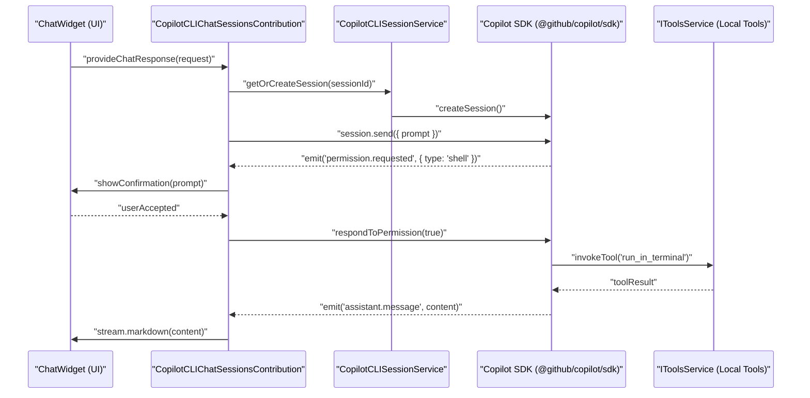
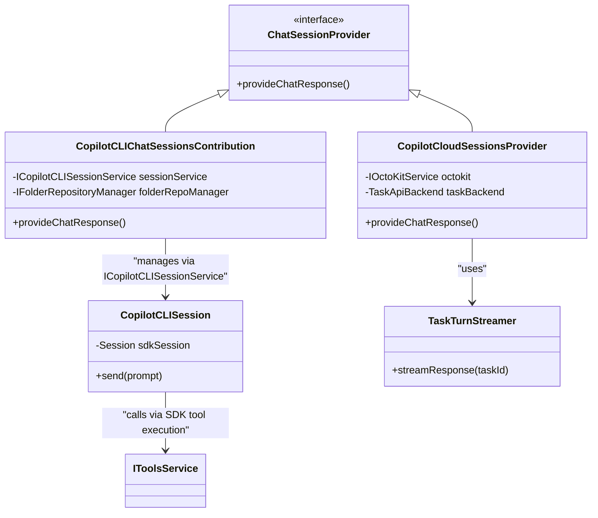

# Copilot CLI and Cloud Sessions

Relevant source files

The following files were used as context for generating this wiki page:

- [extensions/copilot/package.json](extensions/copilot/package.json)
- [extensions/copilot/package.nls.json](extensions/copilot/package.nls.json)
- [extensions/copilot/src/extension/agents/vscode-node/githubOrgChatResourcesService.ts](extensions/copilot/src/extension/agents/vscode-node/githubOrgChatResourcesService.ts)
- [extensions/copilot/src/extension/agents/vscode-node/githubOrgCustomAgentProvider.ts](extensions/copilot/src/extension/agents/vscode-node/githubOrgCustomAgentProvider.ts)
- [extensions/copilot/src/extension/agents/vscode-node/githubOrgInstructionsProvider.ts](extensions/copilot/src/extension/agents/vscode-node/githubOrgInstructionsProvider.ts)
- [extensions/copilot/src/extension/agents/vscode-node/test/githubOrgChatResourcesService.spec.ts](extensions/copilot/src/extension/agents/vscode-node/test/githubOrgChatResourcesService.spec.ts)
- [extensions/copilot/src/extension/agents/vscode-node/test/githubOrgCustomAgentProvider.spec.ts](extensions/copilot/src/extension/agents/vscode-node/test/githubOrgCustomAgentProvider.spec.ts)
- [extensions/copilot/src/extension/agents/vscode-node/test/githubOrgInstructionsProvider.spec.ts](extensions/copilot/src/extension/agents/vscode-node/test/githubOrgInstructionsProvider.spec.ts)
- [extensions/copilot/src/extension/agents/vscode-node/test/mockOctoKitService.ts](extensions/copilot/src/extension/agents/vscode-node/test/mockOctoKitService.ts)
- [extensions/copilot/src/extension/chatSessions/common/chatSessionMetadataStore.ts](extensions/copilot/src/extension/chatSessions/common/chatSessionMetadataStore.ts)
- [extensions/copilot/src/extension/chatSessions/common/chatSessionWorkspaceFolderService.ts](extensions/copilot/src/extension/chatSessions/common/chatSessionWorkspaceFolderService.ts)
- [extensions/copilot/src/extension/chatSessions/common/chatSessionWorktreeCheckpointService.ts](extensions/copilot/src/extension/chatSessions/common/chatSessionWorktreeCheckpointService.ts)
- [extensions/copilot/src/extension/chatSessions/common/chatSessionWorktreeService.ts](extensions/copilot/src/extension/chatSessions/common/chatSessionWorktreeService.ts)
- [extensions/copilot/src/extension/chatSessions/common/folderRepositoryManager.ts](extensions/copilot/src/extension/chatSessions/common/folderRepositoryManager.ts)
- [extensions/copilot/src/extension/chatSessions/common/taskApiTypes.ts](extensions/copilot/src/extension/chatSessions/common/taskApiTypes.ts)
- [extensions/copilot/src/extension/chatSessions/common/test/mockChatSessionMetadataStore.ts](extensions/copilot/src/extension/chatSessions/common/test/mockChatSessionMetadataStore.ts)
- [extensions/copilot/src/extension/chatSessions/copilotcli/common/copilotCLITools.ts](extensions/copilot/src/extension/chatSessions/copilotcli/common/copilotCLITools.ts)
- [extensions/copilot/src/extension/chatSessions/copilotcli/common/test/copilotCLITools.spec.ts](extensions/copilot/src/extension/chatSessions/copilotcli/common/test/copilotCLITools.spec.ts)
- [extensions/copilot/src/extension/chatSessions/copilotcli/node/copilotCli.ts](extensions/copilot/src/extension/chatSessions/copilotcli/node/copilotCli.ts)
- [extensions/copilot/src/extension/chatSessions/copilotcli/node/copilotcliSession.ts](extensions/copilot/src/extension/chatSessions/copilotcli/node/copilotcliSession.ts)
- [extensions/copilot/src/extension/chatSessions/copilotcli/node/copilotcliSessionService.ts](extensions/copilot/src/extension/chatSessions/copilotcli/node/copilotcliSessionService.ts)
- [extensions/copilot/src/extension/chatSessions/copilotcli/node/permissionHelpers.ts](extensions/copilot/src/extension/chatSessions/copilotcli/node/permissionHelpers.ts)
- [extensions/copilot/src/extension/chatSessions/copilotcli/node/test/copilotCliModels.spec.ts](extensions/copilot/src/extension/chatSessions/copilotcli/node/test/copilotCliModels.spec.ts)
- [extensions/copilot/src/extension/chatSessions/copilotcli/node/test/copilotCliSessionService.spec.ts](extensions/copilot/src/extension/chatSessions/copilotcli/node/test/copilotCliSessionService.spec.ts)
- [extensions/copilot/src/extension/chatSessions/copilotcli/node/test/copilotcliSession.spec.ts](extensions/copilot/src/extension/chatSessions/copilotcli/node/test/copilotcliSession.spec.ts)
- [extensions/copilot/src/extension/chatSessions/copilotcli/node/test/permissionHelpers.spec.ts](extensions/copilot/src/extension/chatSessions/copilotcli/node/test/permissionHelpers.spec.ts)
- [extensions/copilot/src/extension/chatSessions/copilotcli/node/test/testHelpers.ts](extensions/copilot/src/extension/chatSessions/copilotcli/node/test/testHelpers.ts)
- [extensions/copilot/src/extension/chatSessions/vscode-node/chatSessionWorkspaceFolderServiceImpl.ts](extensions/copilot/src/extension/chatSessions/vscode-node/chatSessionWorkspaceFolderServiceImpl.ts)
- [extensions/copilot/src/extension/chatSessions/vscode-node/chatSessionWorktreeCheckpointServiceImpl.ts](extensions/copilot/src/extension/chatSessions/vscode-node/chatSessionWorktreeCheckpointServiceImpl.ts)
- [extensions/copilot/src/extension/chatSessions/vscode-node/chatSessionWorktreeServiceImpl.ts](extensions/copilot/src/extension/chatSessions/vscode-node/chatSessionWorktreeServiceImpl.ts)
- [extensions/copilot/src/extension/chatSessions/vscode-node/chatSessions.ts](extensions/copilot/src/extension/chatSessions/vscode-node/chatSessions.ts)
- [extensions/copilot/src/extension/chatSessions/vscode-node/copilotCLIChatSessions.ts](extensions/copilot/src/extension/chatSessions/vscode-node/copilotCLIChatSessions.ts)
- [extensions/copilot/src/extension/chatSessions/vscode-node/copilotCLIChatSessionsContribution.ts](extensions/copilot/src/extension/chatSessions/vscode-node/copilotCLIChatSessionsContribution.ts)
- [extensions/copilot/src/extension/chatSessions/vscode-node/copilotCLIModelDetails.ts](extensions/copilot/src/extension/chatSessions/vscode-node/copilotCLIModelDetails.ts)
- [extensions/copilot/src/extension/chatSessions/vscode-node/copilotCloudSessionContentBuilder.ts](extensions/copilot/src/extension/chatSessions/vscode-node/copilotCloudSessionContentBuilder.ts)
- [extensions/copilot/src/extension/chatSessions/vscode-node/copilotCloudSessionsProvider.ts](extensions/copilot/src/extension/chatSessions/vscode-node/copilotCloudSessionsProvider.ts)
- [extensions/copilot/src/extension/chatSessions/vscode-node/folderRepositoryManagerImpl.ts](extensions/copilot/src/extension/chatSessions/vscode-node/folderRepositoryManagerImpl.ts)
- [extensions/copilot/src/extension/chatSessions/vscode-node/prContentProvider.ts](extensions/copilot/src/extension/chatSessions/vscode-node/prContentProvider.ts)
- [extensions/copilot/src/extension/chatSessions/vscode-node/pullArtifactResolver.ts](extensions/copilot/src/extension/chatSessions/vscode-node/pullArtifactResolver.ts)
- [extensions/copilot/src/extension/chatSessions/vscode-node/pullRequestFileChangesService.ts](extensions/copilot/src/extension/chatSessions/vscode-node/pullRequestFileChangesService.ts)
- [extensions/copilot/src/extension/chatSessions/vscode-node/sessionOptionGroupBuilder.ts](extensions/copilot/src/extension/chatSessions/vscode-node/sessionOptionGroupBuilder.ts)
- [extensions/copilot/src/extension/chatSessions/vscode-node/taskApiBackend.ts](extensions/copilot/src/extension/chatSessions/vscode-node/taskApiBackend.ts)
- [extensions/copilot/src/extension/chatSessions/vscode-node/taskTurnStreamer.ts](extensions/copilot/src/extension/chatSessions/vscode-node/taskTurnStreamer.ts)
- [extensions/copilot/src/extension/chatSessions/vscode-node/test/chatSessionWorkspaceFolderService.spec.ts](extensions/copilot/src/extension/chatSessions/vscode-node/test/chatSessionWorkspaceFolderService.spec.ts)
- [extensions/copilot/src/extension/chatSessions/vscode-node/test/copilotCLIChatSessionParticipant.spec.ts](extensions/copilot/src/extension/chatSessions/vscode-node/test/copilotCLIChatSessionParticipant.spec.ts)
- [extensions/copilot/src/extension/chatSessions/vscode-node/test/copilotCLIChatSessions.spec.ts](extensions/copilot/src/extension/chatSessions/vscode-node/test/copilotCLIChatSessions.spec.ts)
- [extensions/copilot/src/extension/chatSessions/vscode-node/test/copilotCLIModelDetails.spec.ts](extensions/copilot/src/extension/chatSessions/vscode-node/test/copilotCLIModelDetails.spec.ts)
- [extensions/copilot/src/extension/chatSessions/vscode-node/test/copilotCloudSessionsProvider.spec.ts](extensions/copilot/src/extension/chatSessions/vscode-node/test/copilotCloudSessionsProvider.spec.ts)
- [extensions/copilot/src/extension/chatSessions/vscode-node/test/folderRepositoryManager.spec.ts](extensions/copilot/src/extension/chatSessions/vscode-node/test/folderRepositoryManager.spec.ts)
- [extensions/copilot/src/extension/chatSessions/vscode-node/test/sessionOptionGroupBuilder.spec.ts](extensions/copilot/src/extension/chatSessions/vscode-node/test/sessionOptionGroupBuilder.spec.ts)
- [extensions/copilot/src/extension/chatSessions/vscode/chatSessionsUriHandler.ts](extensions/copilot/src/extension/chatSessions/vscode/chatSessionsUriHandler.ts)
- [extensions/copilot/src/extension/chatSessions/vscode/cloudAgentBackend.ts](extensions/copilot/src/extension/chatSessions/vscode/cloudAgentBackend.ts)
- [extensions/copilot/src/extension/chatSessions/vscode/copilotCodingAgentUtils.ts](extensions/copilot/src/extension/chatSessions/vscode/copilotCodingAgentUtils.ts)
- [extensions/copilot/src/extension/chatSessions/vscode/test/copilotCodingAgentUtils.spec.ts](extensions/copilot/src/extension/chatSessions/vscode/test/copilotCodingAgentUtils.spec.ts)
- [extensions/copilot/src/extension/onboardDebug/node/copilotDebugWorker/copilotDebugWorker.ps1](extensions/copilot/src/extension/onboardDebug/node/copilotDebugWorker/copilotDebugWorker.ps1)
- [extensions/copilot/src/extension/onboardDebug/node/copilotDebugWorker/index.ts](extensions/copilot/src/extension/onboardDebug/node/copilotDebugWorker/index.ts)
- [extensions/copilot/src/extension/onboardDebug/node/copilotDebugWorker/shared.ts](extensions/copilot/src/extension/onboardDebug/node/copilotDebugWorker/shared.ts)
- [extensions/copilot/src/extension/onboardDebug/vscode-node/copilotDebugCommandContribution.ts](extensions/copilot/src/extension/onboardDebug/vscode-node/copilotDebugCommandContribution.ts)
- [extensions/copilot/src/platform/configuration/common/configurationService.ts](extensions/copilot/src/platform/configuration/common/configurationService.ts)
- [extensions/copilot/src/platform/git/test/node/gitService.spec.ts](extensions/copilot/src/platform/git/test/node/gitService.spec.ts)
- [extensions/copilot/src/platform/git/vscode-node/utils.ts](extensions/copilot/src/platform/git/vscode-node/utils.ts)
- [extensions/copilot/src/platform/github/common/githubAPI.ts](extensions/copilot/src/platform/github/common/githubAPI.ts)
- [extensions/copilot/src/platform/github/common/githubService.ts](extensions/copilot/src/platform/github/common/githubService.ts)
- [extensions/copilot/src/platform/github/common/octoKitServiceImpl.ts](extensions/copilot/src/platform/github/common/octoKitServiceImpl.ts)
- [extensions/copilot/src/platform/github/node/githubRepositoryService.ts](extensions/copilot/src/platform/github/node/githubRepositoryService.ts)
- [extensions/copilot/src/platform/terminal/common/terminalService.ts](extensions/copilot/src/platform/terminal/common/terminalService.ts)
- [extensions/copilot/src/platform/terminal/vscode/terminalServiceImpl.ts](extensions/copilot/src/platform/terminal/vscode/terminalServiceImpl.ts)
- [extensions/copilot/test/e2e/cli.stest.ts](extensions/copilot/test/e2e/cli.stest.ts)
- [src/vs/workbench/api/browser/mainThreadChatSessions.ts](src/vs/workbench/api/browser/mainThreadChatSessions.ts)
- [src/vs/workbench/api/common/extHostChatSessions.ts](src/vs/workbench/api/common/extHostChatSessions.ts)
- [src/vs/workbench/api/test/browser/mainThreadChatSessions.test.ts](src/vs/workbench/api/test/browser/mainThreadChatSessions.test.ts)
- [src/vs/workbench/contrib/chat/browser/agentSessions/agentHost/agentHostChatInputPicker.contribution.ts](src/vs/workbench/contrib/chat/browser/agentSessions/agentHost/agentHostChatInputPicker.contribution.ts)
- [src/vs/workbench/contrib/chat/browser/agentSessions/agentHost/media/agentHostChatInputPicker.css](src/vs/workbench/contrib/chat/browser/agentSessions/agentHost/media/agentHostChatInputPicker.css)
- [src/vs/workbench/contrib/chat/browser/chatSessions/chatSessionPickerActionItem.ts](src/vs/workbench/contrib/chat/browser/chatSessions/chatSessionPickerActionItem.ts)
- [src/vs/workbench/contrib/chat/browser/chatSessions/chatSessions.contribution.ts](src/vs/workbench/contrib/chat/browser/chatSessions/chatSessions.contribution.ts)
- [src/vs/workbench/contrib/chat/browser/chatSessions/media/chatSessionPickerActionItem.css](src/vs/workbench/contrib/chat/browser/chatSessions/media/chatSessionPickerActionItem.css)
- [src/vs/workbench/contrib/chat/common/chatSessionsService.ts](src/vs/workbench/contrib/chat/common/chatSessionsService.ts)
- [src/vs/workbench/contrib/chat/test/common/mockChatSessionsService.ts](src/vs/workbench/contrib/chat/test/common/mockChatSessionsService.ts)
- [src/vscode-dts/vscode.proposed.chatSessionsProvider.d.ts](src/vscode-dts/vscode.proposed.chatSessionsProvider.d.ts)

The Copilot CLI and Cloud Sessions subsystem provides the integration between the VS Code Chat interface and external session backends, specifically the **Copilot CLI (Mission Control)** and **GitHub Cloud Sessions (Coding Agent)**. It leverages the VS Code Chat Sessions Provider API to allow users to interact with stateful, tool-enabled AI agents that operate on repositories, manage worktrees, and perform complex software engineering tasks.

## Copilot CLI Chat Sessions

The Copilot CLI integration allows the VS Code workbench to host sessions powered by the `@github/copilot/sdk` [extensions/copilot/src/extension/chatSessions/vscode-node/copilotCLIChatSessionsContribution.ts:6-6](). These sessions are characterized by their ability to execute local tools (shell commands, file edits) while maintaining a persistent state in the local filesystem.

### CopilotCLIChatSessionsContribution
This class acts as the primary entry point for registering the CLI session provider within the VS Code extension host [extensions/copilot/src/extension/chatSessions/vscode-node/copilotCLIChatSessionsContribution.ts:102-113](). It handles the lifecycle of chat requests and manages the mapping between VS Code chat sessions and CLI SDK sessions.

Key responsibilities include:
*   **Request Handling**: Implementation of request routing to the underlying CLI session via the Copilot SDK [extensions/copilot/src/extension/chatSessions/vscode-node/copilotCLIChatSessionsContribution.ts:468-471]().
*   **Workspace Management**: Determining the working directory and isolation mode (e.g., using git worktrees) for the session [extensions/copilot/src/extension/chatSessions/vscode-node/copilotCLIChatSessionsContribution.ts:316-320]().
*   **Tool Integration**: Providing the bridge for the CLI to invoke VS Code-specific tools like `vscode_get_modified_files_confirmation` [extensions/copilot/src/extension/chatSessions/vscode-node/test/copilotCLIChatSessionParticipant.spec.ts:112-114]().
*   **Model Details**: Persisting and retrieving model-specific details (like reasoning effort) used during the session [extensions/copilot/src/extension/chatSessions/vscode-node/copilotCLIModelDetails.ts:15-25]().

### CopilotCLISession and SessionService
The `CopilotCLISession` class wraps the GitHub Copilot SDK `Session` object [extensions/copilot/src/extension/chatSessions/copilotcli/node/copilotcliSession.ts:52-52](). It translates VS Code chat events into SDK calls and handles complex interactions like permission prompts for shell execution or file writes via `handleShellPermission` and `handleWritePermission` [extensions/copilot/src/extension/chatSessions/copilotcli/node/copilotcliSession.ts:48-48]().

`CopilotCLISessionService` manages the lifecycle of these sessions, including persistence to disk. Sessions are stored in a dedicated directory resolved via `getCopilotCLISessionDir` [extensions/copilot/src/extension/chatSessions/copilotcli/node/cliHelpers.ts:49-49](). It also manages the session tracking for multi-folder workspace environments [extensions/copilot/src/extension/chatSessions/copilotcli/node/copilotcliSessionService.ts:52-56]().

**Sources:**
*   [extensions/copilot/src/extension/chatSessions/vscode-node/copilotCLIChatSessionsContribution.ts]()
*   [extensions/copilot/src/extension/chatSessions/copilotcli/node/copilotcliSession.ts]()
*   [extensions/copilot/src/extension/chatSessions/copilotcli/node/copilotcliSessionService.ts]()
*   [extensions/copilot/src/extension/chatSessions/vscode-node/copilotCLIModelDetails.ts]()
*   [extensions/copilot/src/extension/chatSessions/vscode-node/test/copilotCLIChatSessionParticipant.spec.ts]()

### Data Flow: CLI Session Request
The following diagram illustrates the flow from a user prompt in the Chat UI to the execution of a tool via the Copilot CLI SDK.

Title: CLI Session Tool Execution Flow

**Sources:**
*   [extensions/copilot/src/extension/chatSessions/vscode-node/copilotCLIChatSessionsContribution.ts:468-550]()
*   [extensions/copilot/src/extension/chatSessions/copilotcli/node/copilotcliSession.ts:98-150]()
*   [extensions/copilot/src/extension/chatSessions/vscode-node/test/copilotCLIChatSessionParticipant.spec.ts:112-120]()

---

## Copilot Cloud Sessions

The `CopilotCloudSessionsProvider` integrates VS Code with GitHub's Cloud-based "Coding Agent" (CCA). Unlike CLI sessions which run locally, Cloud sessions run on GitHub infrastructure and are typically associated with a Pull Request or a specific GitHub Repository task [extensions/copilot/src/extension/chatSessions/vscode-node/copilotCloudSessionsProvider.ts:145-150]().

### Integration Components
*   **GitHub API Integration**: Uses `IOctoKitService` and `IGithubRepositoryService` to fetch existing sessions for a PR or repository [extensions/copilot/src/extension/chatSessions/vscode-node/copilotCloudSessionsProvider.ts:18-20]().
*   **Backend Routing**: Routes requests to either the `TaskApiBackend`, `JobsApiBackend`, or `CloudAgentBackend` depending on the session type [extensions/copilot/src/extension/chatSessions/vscode-node/copilotCloudSessionsProvider.ts:38-44]().
*   **TaskTurnStreamer**: Handles the streaming of events from the cloud backend (e.g., tool calls, progress updates, and final responses) and converts them into VS Code chat response parts [extensions/copilot/src/extension/chatSessions/vscode-node/copilotCloudSessionsProvider.ts:41-41]().
*   **Auth Handling**: Manages authentication via `IAuthenticationService` specifically for cloud access [extensions/copilot/src/extension/chatSessions/vscode-node/copilotCloudSessionsProvider.ts:10-10]().

### CopilotCloudSessionsProvider Implementation
The provider implements the `vscode.ChatSessionProvider` interface. It resolves session metadata from GitHub and manages the "Invoke" event which triggers the cloud agent to start working on a problem statement [extensions/copilot/src/extension/chatSessions/vscode-node/copilotCloudSessionsProvider.ts:22-22](). It also handles `ConfirmationMetadata` for validating references and context before submission [extensions/copilot/src/extension/chatSessions/vscode-node/copilotCloudSessionsProvider.ts:47-51]().

**Sources:**
*   [extensions/copilot/src/extension/chatSessions/vscode-node/copilotCloudSessionsProvider.ts]()
*   [extensions/copilot/src/platform/github/common/githubService.ts]()

---

## Session Architecture and Provider API

The system relies on a common set of interfaces and services to manage the differences between local CLI and remote Cloud sessions.

### Key Classes and Interfaces

| Class/Interface | Responsibility |
| :--- | :--- |
| `IChatSessionMetadataStore` | Persists session-specific metadata such as the selected model, repository properties, and custom instructions [extensions/copilot/src/extension/chatSessions/common/chatSessionMetadataStore.ts:40-40](). |
| `ICopilotCLIModels` | Manages the available AI models for CLI sessions, including fetching capabilities and costs from the GitHub API [extensions/copilot/src/extension/chatSessions/copilotcli/node/copilotCli.ts:67-67](). |
| `IFolderRepositoryManager` | Handles the mapping of workspace folders to GitHub repositories and manages "Isolation Modes" (e.g., using `git worktree` for safe agent execution) [extensions/copilot/src/extension/chatSessions/vscode-node/copilotCLIChatSessionsContribution.ts:44-44](). |
| `SessionIdForCLI` | Utility for parsing and creating URIs with the `copilotcli` scheme, used to route session-specific resources [extensions/copilot/src/extension/chatSessions/vscode-node/copilotCLIChatSessionsContribution.ts:87-101](). |
| `CopilotCLIPromptResolver` | Resolves variables and references (like `#file`) into strings for the CLI SDK [extensions/copilot/src/extension/chatSessions/copilotcli/node/copilotcliPromptResolver.ts:51-51](). |
| `ICopilotCLITerminalIntegration` | Integrates CLI session commands with the VS Code integrated terminal [extensions/copilot/src/extension/chatSessions/vscode-node/copilotCLITerminalIntegration.ts:50-50](). |
| `IChatSessionWorktreeService` | Manages the creation and lifecycle of isolated git worktrees used by CLI sessions to prevent side effects in the primary workspace [extensions/copilot/src/extension/chatSessions/vscode-node/chatSessionWorktreeServiceImpl.ts:29-29](). |

### Entity Mapping: Session Management
This diagram bridges the conceptual "Chat Session" to the specific implementation classes used in the codebase.

Title: Session Provider Entity Map

**Sources:**
*   [extensions/copilot/src/extension/chatSessions/vscode-node/copilotCLIChatSessionsContribution.ts:111-111]()
*   [extensions/copilot/src/extension/chatSessions/vscode-node/copilotCloudSessionsProvider.ts:145-145]()
*   [extensions/copilot/src/extension/chatSessions/copilotcli/node/copilotcliSession.ts:34-34]()

## CLI Model Management

The CLI integration supports multiple models (e.g., GPT-4o, Claude 3.5 Sonnet). `ICopilotCLIModels` is responsible for fetching these models from the GitHub endpoint and exposing them to the CLI SDK [extensions/copilot/src/extension/chatSessions/copilotcli/node/copilotCli.ts:85-85]().

It handles:
*   **Context Size**: Exposing model-specific context window limits via `maxContextWindowTokens` [extensions/copilot/src/extension/chatSessions/copilotcli/node/copilotCli.ts:59-59]().
*   **Reasoning Effort**: Supporting advanced model properties like reasoning effort levels (low, medium, high) for reasoning-capable models via `COPILOT_CLI_REASONING_EFFORT_PROPERTY` [extensions/copilot/src/extension/chatSessions/copilotcli/node/copilotCli.ts:32-32]().
*   **Persistence**: Persisting and retrieving the specific model ID used for a response to maintain consistency across session turns [extensions/copilot/src/extension/chatSessions/vscode-node/copilotCLIModelDetails.ts:21-25]().

**Sources:**
*   [extensions/copilot/src/extension/chatSessions/copilotcli/node/copilotCli.ts]()
*   [extensions/copilot/src/extension/chatSessions/vscode-node/copilotCLIModelDetails.ts]()

## Worktree Isolation and Repository Management

To ensure AI agents can safely modify code without corrupting the user's active working directory, the system utilizes a worktree-based isolation mechanism.

### ChatSessionWorktreeService
This service manages isolated clones of the repository [extensions/copilot/src/extension/chatSessions/vscode-node/chatSessionWorktreeServiceImpl.ts:29-32](). When a session starts with isolation enabled, `createWorktree` is called to spawn a new git worktree [extensions/copilot/src/extension/chatSessions/vscode-node/chatSessionWorktreeServiceImpl.ts:54-54](). 

Key operations:
*   **Branch Generation**: Automatically creates a unique branch name for the agent's work [extensions/copilot/src/extension/chatSessions/vscode-node/chatSessionWorktreeServiceImpl.ts:83-83]().
*   **Base Branch Resolution**: Detects if the base branch is protected and handles upstream tracking [extensions/copilot/src/extension/chatSessions/vscode-node/chatSessionWorktreeServiceImpl.ts:88-100]().
*   **Lifecycle Management**: Tracks session worktrees and cleanup [extensions/copilot/src/extension/chatSessions/vscode-node/chatSessionWorktreeServiceImpl.ts:32-32]().

### FolderRepositoryManager
The `CopilotCLIFolderRepositoryManager` handles the mapping of workspace folders to repositories and determines the appropriate `IsolationMode` (None, Worktree, or Subdirectory) [extensions/copilot/src/extension/chatSessions/vscode-node/folderRepositoryManagerImpl.ts:58-58](). It also manages trust checks, ensuring agents do not run in untrusted folders [extensions/copilot/src/extension/chatSessions/vscode-node/folderRepositoryManagerImpl.ts:108-112]().

**Sources:**
*   [extensions/copilot/src/extension/chatSessions/vscode-node/chatSessionWorktreeServiceImpl.ts]()
*   [extensions/copilot/src/extension/chatSessions/vscode-node/folderRepositoryManagerImpl.ts]()
*   [extensions/copilot/src/extension/chatSessions/common/chatSessionWorktreeService.ts]()