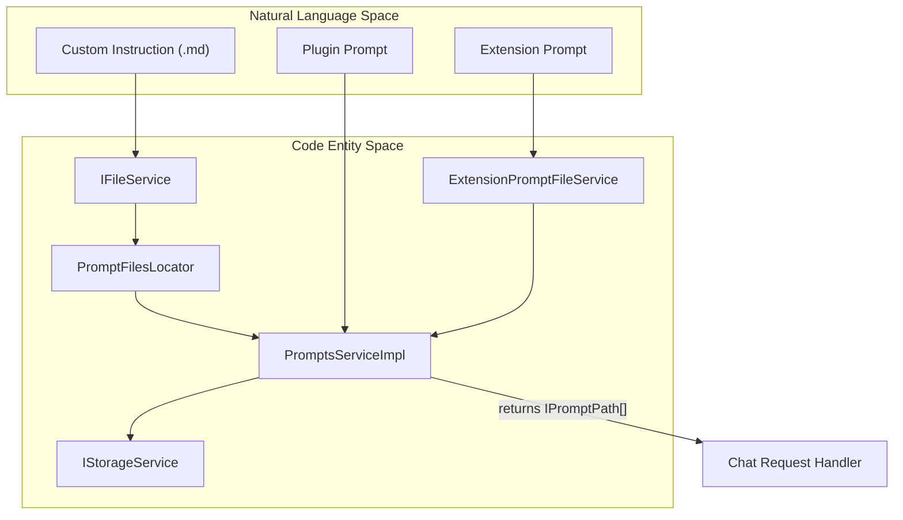
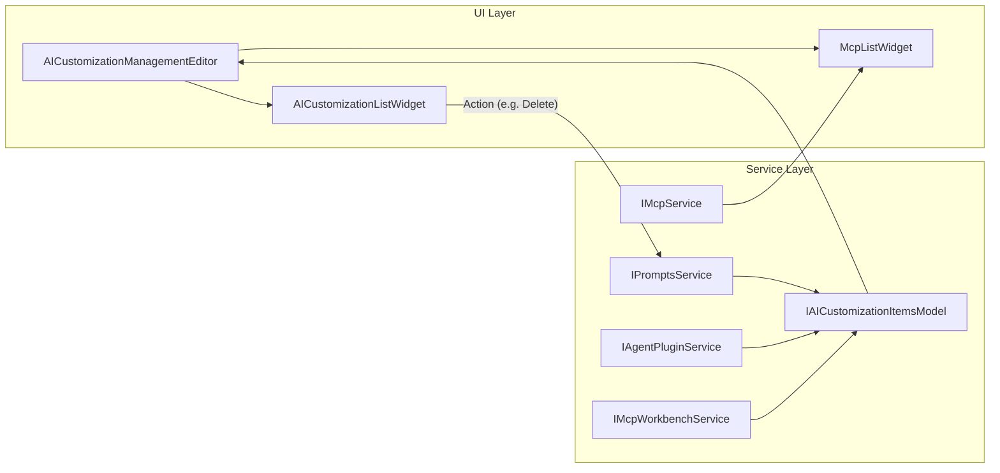

# Prompt Syntax and Custom Instructions

Relevant source files

The following files were used as context for generating this wiki page:

- [src/vs/sessions/AI_CUSTOMIZATIONS.md](https://github.com/microsoft/vscode/blob/HEAD/src/vs/sessions/AI_CUSTOMIZATIONS.md)
- [src/vs/sessions/contrib/aiCustomizationTreeView/browser/aiCustomizationOverviewView.ts](https://github.com/microsoft/vscode/blob/HEAD/src/vs/sessions/contrib/aiCustomizationTreeView/browser/aiCustomizationOverviewView.ts)
- [src/vs/sessions/contrib/aiCustomizationTreeView/browser/aiCustomizationTreeViewViews.ts](https://github.com/microsoft/vscode/blob/HEAD/src/vs/sessions/contrib/aiCustomizationTreeView/browser/aiCustomizationTreeViewViews.ts)
- [src/vs/sessions/contrib/chat/browser/aiCustomizationWorkspaceService.ts](https://github.com/microsoft/vscode/blob/HEAD/src/vs/sessions/contrib/chat/browser/aiCustomizationWorkspaceService.ts)
- [src/vs/sessions/contrib/chat/browser/customizationHarnessService.ts](https://github.com/microsoft/vscode/blob/HEAD/src/vs/sessions/contrib/chat/browser/customizationHarnessService.ts)
- [src/vs/sessions/contrib/chat/browser/promptsService.ts](https://github.com/microsoft/vscode/blob/HEAD/src/vs/sessions/contrib/chat/browser/promptsService.ts)
- [src/vs/workbench/contrib/chat/browser/aiCustomization/aiCustomizationDebugPanel.ts](https://github.com/microsoft/vscode/blob/HEAD/src/vs/workbench/contrib/chat/browser/aiCustomization/aiCustomizationDebugPanel.ts)
- [src/vs/workbench/contrib/chat/browser/aiCustomization/aiCustomizationIcons.ts](https://github.com/microsoft/vscode/blob/HEAD/src/vs/workbench/contrib/chat/browser/aiCustomization/aiCustomizationIcons.ts)
- [src/vs/workbench/contrib/chat/browser/aiCustomization/aiCustomizationItemSource.ts](https://github.com/microsoft/vscode/blob/HEAD/src/vs/workbench/contrib/chat/browser/aiCustomization/aiCustomizationItemSource.ts)
- [src/vs/workbench/contrib/chat/browser/aiCustomization/aiCustomizationItemsModel.ts](https://github.com/microsoft/vscode/blob/HEAD/src/vs/workbench/contrib/chat/browser/aiCustomization/aiCustomizationItemsModel.ts)
- [src/vs/workbench/contrib/chat/browser/aiCustomization/aiCustomizationListWidget.ts](https://github.com/microsoft/vscode/blob/HEAD/src/vs/workbench/contrib/chat/browser/aiCustomization/aiCustomizationListWidget.ts)
- [src/vs/workbench/contrib/chat/browser/aiCustomization/aiCustomizationListWidgetUtils.ts](https://github.com/microsoft/vscode/blob/HEAD/src/vs/workbench/contrib/chat/browser/aiCustomization/aiCustomizationListWidgetUtils.ts)
- [src/vs/workbench/contrib/chat/browser/aiCustomization/aiCustomizationManagement.contribution.ts](https://github.com/microsoft/vscode/blob/HEAD/src/vs/workbench/contrib/chat/browser/aiCustomization/aiCustomizationManagement.contribution.ts)
- [src/vs/workbench/contrib/chat/browser/aiCustomization/aiCustomizationManagement.ts](https://github.com/microsoft/vscode/blob/HEAD/src/vs/workbench/contrib/chat/browser/aiCustomization/aiCustomizationManagement.ts)
- [src/vs/workbench/contrib/chat/browser/aiCustomization/aiCustomizationManagementEditor.ts](https://github.com/microsoft/vscode/blob/HEAD/src/vs/workbench/contrib/chat/browser/aiCustomization/aiCustomizationManagementEditor.ts)
- [src/vs/workbench/contrib/chat/browser/aiCustomization/aiCustomizationWelcomePage.ts](https://github.com/microsoft/vscode/blob/HEAD/src/vs/workbench/contrib/chat/browser/aiCustomization/aiCustomizationWelcomePage.ts)
- [src/vs/workbench/contrib/chat/browser/aiCustomization/aiCustomizationWelcomePagePromptLaunchers.ts](https://github.com/microsoft/vscode/blob/HEAD/src/vs/workbench/contrib/chat/browser/aiCustomization/aiCustomizationWelcomePagePromptLaunchers.ts)
- [src/vs/workbench/contrib/chat/browser/aiCustomization/aiCustomizationWorkspaceService.ts](https://github.com/microsoft/vscode/blob/HEAD/src/vs/workbench/contrib/chat/browser/aiCustomization/aiCustomizationWorkspaceService.ts)
- [src/vs/workbench/contrib/chat/browser/aiCustomization/customizationCreatorService.ts](https://github.com/microsoft/vscode/blob/HEAD/src/vs/workbench/contrib/chat/browser/aiCustomization/customizationCreatorService.ts)
- [src/vs/workbench/contrib/chat/browser/aiCustomization/customizationHarnessService.ts](https://github.com/microsoft/vscode/blob/HEAD/src/vs/workbench/contrib/chat/browser/aiCustomization/customizationHarnessService.ts)
- [src/vs/workbench/contrib/chat/browser/aiCustomization/mcpListWidget.ts](https://github.com/microsoft/vscode/blob/HEAD/src/vs/workbench/contrib/chat/browser/aiCustomization/mcpListWidget.ts)
- [src/vs/workbench/contrib/chat/browser/aiCustomization/media/aiCustomizationManagement.css](https://github.com/microsoft/vscode/blob/HEAD/src/vs/workbench/contrib/chat/browser/aiCustomization/media/aiCustomizationManagement.css)
- [src/vs/workbench/contrib/chat/browser/aiCustomization/media/aiCustomizationWelcomePromptLaunchers.css](https://github.com/microsoft/vscode/blob/HEAD/src/vs/workbench/contrib/chat/browser/aiCustomization/media/aiCustomizationWelcomePromptLaunchers.css)
- [src/vs/workbench/contrib/chat/browser/aiCustomization/pluginListWidget.ts](https://github.com/microsoft/vscode/blob/HEAD/src/vs/workbench/contrib/chat/browser/aiCustomization/pluginListWidget.ts)
- [src/vs/workbench/contrib/chat/browser/aiCustomization/promptsServiceCustomizationItemProvider.ts](https://github.com/microsoft/vscode/blob/HEAD/src/vs/workbench/contrib/chat/browser/aiCustomization/promptsServiceCustomizationItemProvider.ts)
- [src/vs/workbench/contrib/chat/browser/promptSyntax/pickers/askForPromptSourceFolder.ts](https://github.com/microsoft/vscode/blob/HEAD/src/vs/workbench/contrib/chat/browser/promptSyntax/pickers/askForPromptSourceFolder.ts)
- [src/vs/workbench/contrib/chat/browser/promptSyntax/promptFileRewriter.ts](https://github.com/microsoft/vscode/blob/HEAD/src/vs/workbench/contrib/chat/browser/promptSyntax/promptFileRewriter.ts)
- [src/vs/workbench/contrib/chat/browser/promptSyntax/promptToolsCodeLensProvider.ts](https://github.com/microsoft/vscode/blob/HEAD/src/vs/workbench/contrib/chat/browser/promptSyntax/promptToolsCodeLensProvider.ts)
- [src/vs/workbench/contrib/chat/common/aiCustomizationWorkspaceService.ts](https://github.com/microsoft/vscode/blob/HEAD/src/vs/workbench/contrib/chat/common/aiCustomizationWorkspaceService.ts)
- [src/vs/workbench/contrib/chat/common/chatModes.ts](https://github.com/microsoft/vscode/blob/HEAD/src/vs/workbench/contrib/chat/common/chatModes.ts)
- [src/vs/workbench/contrib/chat/common/customizationHarnessService.ts](https://github.com/microsoft/vscode/blob/HEAD/src/vs/workbench/contrib/chat/common/customizationHarnessService.ts)
- [src/vs/workbench/contrib/chat/common/participants/chatAgents.ts](https://github.com/microsoft/vscode/blob/HEAD/src/vs/workbench/contrib/chat/common/participants/chatAgents.ts)
- [src/vs/workbench/contrib/chat/common/promptSyntax/computeAutomaticInstructions.ts](https://github.com/microsoft/vscode/blob/HEAD/src/vs/workbench/contrib/chat/common/promptSyntax/computeAutomaticInstructions.ts)
- [src/vs/workbench/contrib/chat/common/promptSyntax/config/config.ts](https://github.com/microsoft/vscode/blob/HEAD/src/vs/workbench/contrib/chat/common/promptSyntax/config/config.ts)
- [src/vs/workbench/contrib/chat/common/promptSyntax/config/promptFileLocations.ts](https://github.com/microsoft/vscode/blob/HEAD/src/vs/workbench/contrib/chat/common/promptSyntax/config/promptFileLocations.ts)
- [src/vs/workbench/contrib/chat/common/promptSyntax/languageProviders/PromptHeaderDefinitionProvider.ts](https://github.com/microsoft/vscode/blob/HEAD/src/vs/workbench/contrib/chat/common/promptSyntax/languageProviders/PromptHeaderDefinitionProvider.ts)
- [src/vs/workbench/contrib/chat/common/promptSyntax/languageProviders/promptCodeActions.ts](https://github.com/microsoft/vscode/blob/HEAD/src/vs/workbench/contrib/chat/common/promptSyntax/languageProviders/promptCodeActions.ts)
- [src/vs/workbench/contrib/chat/common/promptSyntax/languageProviders/promptHeaderAutocompletion.ts](https://github.com/microsoft/vscode/blob/HEAD/src/vs/workbench/contrib/chat/common/promptSyntax/languageProviders/promptHeaderAutocompletion.ts)
- [src/vs/workbench/contrib/chat/common/promptSyntax/languageProviders/promptHovers.ts](https://github.com/microsoft/vscode/blob/HEAD/src/vs/workbench/contrib/chat/common/promptSyntax/languageProviders/promptHovers.ts)
- [src/vs/workbench/contrib/chat/common/promptSyntax/languageProviders/promptValidator.ts](https://github.com/microsoft/vscode/blob/HEAD/src/vs/workbench/contrib/chat/common/promptSyntax/languageProviders/promptValidator.ts)
- [src/vs/workbench/contrib/chat/common/promptSyntax/promptFileParser.ts](https://github.com/microsoft/vscode/blob/HEAD/src/vs/workbench/contrib/chat/common/promptSyntax/promptFileParser.ts)
- [src/vs/workbench/contrib/chat/common/promptSyntax/promptTypes.ts](https://github.com/microsoft/vscode/blob/HEAD/src/vs/workbench/contrib/chat/common/promptSyntax/promptTypes.ts)
- [src/vs/workbench/contrib/chat/common/promptSyntax/service/promptsService.ts](https://github.com/microsoft/vscode/blob/HEAD/src/vs/workbench/contrib/chat/common/promptSyntax/service/promptsService.ts)
- [src/vs/workbench/contrib/chat/common/promptSyntax/service/promptsServiceImpl.ts](https://github.com/microsoft/vscode/blob/HEAD/src/vs/workbench/contrib/chat/common/promptSyntax/service/promptsServiceImpl.ts)
- [src/vs/workbench/contrib/chat/common/promptSyntax/utils/promptFilesLocator.ts](https://github.com/microsoft/vscode/blob/HEAD/src/vs/workbench/contrib/chat/common/promptSyntax/utils/promptFilesLocator.ts)
- [src/vs/workbench/contrib/chat/common/tools/builtinTools/runSubagentTool.ts](https://github.com/microsoft/vscode/blob/HEAD/src/vs/workbench/contrib/chat/common/tools/builtinTools/runSubagentTool.ts)
- [src/vs/workbench/contrib/chat/test/browser/aiCustomization/aiCustomizationItemsModel.test.ts](https://github.com/microsoft/vscode/blob/HEAD/src/vs/workbench/contrib/chat/test/browser/aiCustomization/aiCustomizationItemsModel.test.ts)
- [src/vs/workbench/contrib/chat/test/browser/aiCustomization/aiCustomizationListWidget.test.ts](https://github.com/microsoft/vscode/blob/HEAD/src/vs/workbench/contrib/chat/test/browser/aiCustomization/aiCustomizationListWidget.test.ts)
- [src/vs/workbench/contrib/chat/test/browser/aiCustomization/aiCustomizationManagementEditor.test.ts](https://github.com/microsoft/vscode/blob/HEAD/src/vs/workbench/contrib/chat/test/browser/aiCustomization/aiCustomizationManagementEditor.test.ts)
- [src/vs/workbench/contrib/chat/test/browser/promptSyntax/languageProviders/promptHeaderAutocompletion.test.ts](https://github.com/microsoft/vscode/blob/HEAD/src/vs/workbench/contrib/chat/test/browser/promptSyntax/languageProviders/promptHeaderAutocompletion.test.ts)
- [src/vs/workbench/contrib/chat/test/browser/promptSyntax/languageProviders/promptHovers.test.ts](https://github.com/microsoft/vscode/blob/HEAD/src/vs/workbench/contrib/chat/test/browser/promptSyntax/languageProviders/promptHovers.test.ts)
- [src/vs/workbench/contrib/chat/test/browser/promptSyntax/languageProviders/promptValidator.test.ts](https://github.com/microsoft/vscode/blob/HEAD/src/vs/workbench/contrib/chat/test/browser/promptSyntax/languageProviders/promptValidator.test.ts)
- [src/vs/workbench/contrib/chat/test/common/chatModeService.test.ts](https://github.com/microsoft/vscode/blob/HEAD/src/vs/workbench/contrib/chat/test/common/chatModeService.test.ts)
- [src/vs/workbench/contrib/chat/test/common/customizationHarnessService.test.ts](https://github.com/microsoft/vscode/blob/HEAD/src/vs/workbench/contrib/chat/test/common/customizationHarnessService.test.ts)
- [src/vs/workbench/contrib/chat/test/common/mockChatModeService.ts](https://github.com/microsoft/vscode/blob/HEAD/src/vs/workbench/contrib/chat/test/common/mockChatModeService.ts)
- [src/vs/workbench/contrib/chat/test/common/promptSyntax/computeAutomaticInstructions.test.ts](https://github.com/microsoft/vscode/blob/HEAD/src/vs/workbench/contrib/chat/test/common/promptSyntax/computeAutomaticInstructions.test.ts)
- [src/vs/workbench/contrib/chat/test/common/promptSyntax/config/config.test.ts](https://github.com/microsoft/vscode/blob/HEAD/src/vs/workbench/contrib/chat/test/common/promptSyntax/config/config.test.ts)
- [src/vs/workbench/contrib/chat/test/common/promptSyntax/config/promptFileLocations.test.ts](https://github.com/microsoft/vscode/blob/HEAD/src/vs/workbench/contrib/chat/test/common/promptSyntax/config/promptFileLocations.test.ts)
- [src/vs/workbench/contrib/chat/test/common/promptSyntax/service/mockPromptsService.ts](https://github.com/microsoft/vscode/blob/HEAD/src/vs/workbench/contrib/chat/test/common/promptSyntax/service/mockPromptsService.ts)
- [src/vs/workbench/contrib/chat/test/common/promptSyntax/service/promptsService.test.ts](https://github.com/microsoft/vscode/blob/HEAD/src/vs/workbench/contrib/chat/test/common/promptSyntax/service/promptsService.test.ts)
- [src/vs/workbench/contrib/chat/test/common/promptSyntax/utils/promptFilesLocator.test.ts](https://github.com/microsoft/vscode/blob/HEAD/src/vs/workbench/contrib/chat/test/common/promptSyntax/utils/promptFilesLocator.test.ts)
- [src/vs/workbench/contrib/chat/test/common/tools/builtinTools/runSubagentTool.test.ts](https://github.com/microsoft/vscode/blob/HEAD/src/vs/workbench/contrib/chat/test/common/tools/builtinTools/runSubagentTool.test.ts)
- [src/vs/workbench/test/browser/componentFixtures/fixtures.css](https://github.com/microsoft/vscode/blob/HEAD/src/vs/workbench/test/browser/componentFixtures/fixtures.css)
- [src/vs/workbench/test/browser/componentFixtures/sessions/aiCustomizationListWidget.fixture.ts](https://github.com/microsoft/vscode/blob/HEAD/src/vs/workbench/test/browser/componentFixtures/sessions/aiCustomizationListWidget.fixture.ts)
- [src/vs/workbench/test/browser/componentFixtures/sessions/aiCustomizationManagementEditor.fixture.ts](https://github.com/microsoft/vscode/blob/HEAD/src/vs/workbench/test/browser/componentFixtures/sessions/aiCustomizationManagementEditor.fixture.ts)
- [src/vs/workbench/test/browser/componentFixtures/sessions/aiCustomizationWelcomePages.fixture.ts](https://github.com/microsoft/vscode/blob/HEAD/src/vs/workbench/test/browser/componentFixtures/sessions/aiCustomizationWelcomePages.fixture.ts)
- [test/componentFixtures/blocks-ci-screenshots.md](https://github.com/microsoft/vscode/blob/HEAD/test/componentFixtures/blocks-ci-screenshots.md)

The prompt syntax and custom instructions subsystem provides a structured way to define, discover, and apply AI instructions across VS Code. This system enables the definition of custom agents, skills, and automatic instructions that are injected into chat sessions based on workspace context, file patterns, or explicit user selection.

## Prompts Service (`IPromptsService`)

The `IPromptsService` is the central coordinator for prompt discovery, parsing, and management. It abstracts the underlying filesystem, extension contributions, and plugin-provided content into a unified API.

### Implementation Details
The service is implemented in `PromptsService` and manages several key responsibilities:
- **Discovery**: Locates prompt files across local, user, extension, and plugin storage using the `PromptFilesLocator` [src/vs/workbench/contrib/chat/common/promptSyntax/service/promptsServiceImpl.ts:65-65](https://github.com/microsoft/vscode/blob/HEAD/src/vs/workbench/contrib/chat/common/promptSyntax/service/promptsServiceImpl.ts#L65).
- **Caching**: Maintains an optimized cache of parsed prompt files and discovery results (agents, skills, instructions, hooks) to avoid redundant parsing [src/vs/workbench/contrib/chat/common/promptSyntax/service/promptsServiceImpl.ts:70-90](https://github.com/microsoft/vscode/blob/HEAD/src/vs/workbench/contrib/chat/common/promptSyntax/service/promptsServiceImpl.ts#L70-L90).
- **Lifecycle**: Handles registration and disposal of extension-contributed prompt files via `ExtensionPromptFileService` [src/vs/workbench/contrib/chat/common/promptSyntax/service/promptsServiceImpl.ts:50-50](https://github.com/microsoft/vscode/blob/HEAD/src/vs/workbench/contrib/chat/common/promptSyntax/service/promptsServiceImpl.ts#L50).
- **Events**: Exposes events like `onDidChangeAgentInstructions` to notify the workbench when prompt definitions change on disk or in memory [src/vs/workbench/contrib/chat/common/promptSyntax/service/promptsServiceImpl.ts:92-103](https://github.com/microsoft/vscode/blob/HEAD/src/vs/workbench/contrib/chat/common/promptSyntax/service/promptsServiceImpl.ts#L92-L103).
- **Slash Commands**: Maintains a registry of `knownPromptSlashCommandNames` to allow the chat request parser to disambiguate commands without async hops [src/vs/workbench/contrib/chat/common/promptSyntax/service/promptsServiceImpl.ts:101-106](https://github.com/microsoft/vscode/blob/HEAD/src/vs/workbench/contrib/chat/common/promptSyntax/service/promptsServiceImpl.ts#L101-L106).

### Data Flow: Prompt Discovery
The following diagram illustrates how the `PromptsService` interacts with the `PromptFilesLocator` and various storage providers to aggregate prompt data.

**Prompt Discovery Architecture**

Sources: [src/vs/workbench/contrib/chat/common/promptSyntax/service/promptsServiceImpl.ts:59-118](https://github.com/microsoft/vscode/blob/HEAD/src/vs/workbench/contrib/chat/common/promptSyntax/service/promptsServiceImpl.ts#L59-L118), [src/vs/workbench/contrib/chat/common/promptSyntax/utils/promptFilesLocator.ts:45-59](https://github.com/microsoft/vscode/blob/HEAD/src/vs/workbench/contrib/chat/common/promptSyntax/utils/promptFilesLocator.ts#L45-L59), [src/vs/workbench/contrib/chat/common/promptSyntax/service/promptsService.ts:110-127](https://github.com/microsoft/vscode/blob/HEAD/src/vs/workbench/contrib/chat/common/promptSyntax/service/promptsService.ts#L110-L127)

## Prompt File Parser and Syntax

Prompt files (typically `.md` or `.prompt.md`) consist of a YAML-like header and a Markdown body. The `PromptFileParser` handles the conversion of these files into an Abstract Syntax Tree (AST) represented by `ParsedPromptFile`.

### Header Attributes
Headers are delimited by `---` and contain metadata that controls how the prompt is applied. Key attributes include:
- `name`: The identifier for the agent or skill [src/vs/workbench/contrib/chat/common/promptSyntax/service/promptsService.ts:85-85](https://github.com/microsoft/vscode/blob/HEAD/src/vs/workbench/contrib/chat/common/promptSyntax/service/promptsService.ts#L85).
- `apply-to`: A glob pattern determining which files in the workspace trigger this instruction [src/vs/workbench/contrib/chat/common/promptSyntax/computeAutomaticInstructions.ts:108-110](https://github.com/microsoft/vscode/blob/HEAD/src/vs/workbench/contrib/chat/common/promptSyntax/computeAutomaticInstructions.ts#L108-L110).
- `description`: Text used by the LLM to decide when to invoke a tool or skill [src/vs/workbench/contrib/chat/common/promptSyntax/service/promptsService.ts:88-89](https://github.com/microsoft/vscode/blob/HEAD/src/vs/workbench/contrib/chat/common/promptSyntax/service/promptsService.ts#L88-L89).
- `tools` and `subagents`: Lists of capabilities the agent can utilize [src/vs/workbench/contrib/chat/common/promptSyntax/languageProviders/promptFileAttributes.ts:46-47](https://github.com/microsoft/vscode/blob/HEAD/src/vs/workbench/contrib/chat/common/promptSyntax/languageProviders/promptFileAttributes.ts#L46-L47).

### Parsing Logic
The parser identifies the header block and uses a custom line-by-line scanner to extract `IHeaderAttribute` objects, which include the attribute name, its value (scalar or sequence), and the `OffsetRange` for diagnostic reporting [src/vs/workbench/contrib/chat/common/promptSyntax/promptFileParser.ts:34-40](https://github.com/microsoft/vscode/blob/HEAD/src/vs/workbench/contrib/chat/common/promptSyntax/promptFileParser.ts#L34-L40).

Sources: [src/vs/workbench/contrib/chat/common/promptSyntax/promptFileParser.ts:1-100](https://github.com/microsoft/vscode/blob/HEAD/src/vs/workbench/contrib/chat/common/promptSyntax/promptFileParser.ts#L1-L100), [src/vs/workbench/contrib/chat/common/promptSyntax/languageProviders/promptFileAttributes.ts:45-50](https://github.com/microsoft/vscode/blob/HEAD/src/vs/workbench/contrib/chat/common/promptSyntax/languageProviders/promptFileAttributes.ts#L45-L50)

## Automatic Instructions Computation

The `ComputeAutomaticInstructions` class handles the logic for "Auto-Instructions"—instructions that are automatically injected into a chat request based on the current workspace state or open editors.

### Collection Process
1. **Discovery**: Fetches all available instruction files via `IPromptsService.getInstructionFiles()` [src/vs/workbench/contrib/chat/common/promptSyntax/computeAutomaticInstructions.ts:101-101](https://github.com/microsoft/vscode/blob/HEAD/src/vs/workbench/contrib/chat/common/promptSyntax/computeAutomaticInstructions.ts#L101).
2. **Filtering**: Matches the `apply-to` patterns against the currently active files or workspace context using glob matching [src/vs/workbench/contrib/chat/common/promptSyntax/computeAutomaticInstructions.ts:108-110](https://github.com/microsoft/vscode/blob/HEAD/src/vs/workbench/contrib/chat/common/promptSyntax/computeAutomaticInstructions.ts#L108-L110).
3. **Injection**: Converts matching instructions into `IChatRequestVariableEntry` objects (such as `toPromptFileVariableEntry`) and adds them to the `ChatRequestVariableSet` [src/vs/workbench/contrib/chat/common/attachments/chatVariableEntries.ts:22-22](https://github.com/microsoft/vscode/blob/HEAD/src/vs/workbench/contrib/chat/common/attachments/chatVariableEntries.ts#L22), [src/vs/workbench/contrib/chat/common/promptSyntax/computeAutomaticInstructions.ts:98-108](https://github.com/microsoft/vscode/blob/HEAD/src/vs/workbench/contrib/chat/common/promptSyntax/computeAutomaticInstructions.ts#L98-L108).

### Debugging and Telemetry
The system tracks the "Instruction Collection" via `InstructionsCollectionEvent`, measuring counts for applied, referenced, and agent-specific instructions [src/vs/workbench/contrib/chat/common/promptSyntax/service/promptsService.ts:31-40](https://github.com/microsoft/vscode/blob/HEAD/src/vs/workbench/contrib/chat/common/promptSyntax/service/promptsService.ts#L31-L40). Results are cached in `lastInstructionsCollectionResult` for debug logging [src/vs/workbench/contrib/chat/common/promptSyntax/computeAutomaticInstructions.ts:46-46](https://github.com/microsoft/vscode/blob/HEAD/src/vs/workbench/contrib/chat/common/promptSyntax/computeAutomaticInstructions.ts#L46).

Sources: [src/vs/workbench/contrib/chat/common/promptSyntax/computeAutomaticInstructions.ts:61-110](https://github.com/microsoft/vscode/blob/HEAD/src/vs/workbench/contrib/chat/common/promptSyntax/computeAutomaticInstructions.ts#L61-L110), [src/vs/workbench/contrib/chat/common/promptSyntax/service/promptsService.ts:23-40](https://github.com/microsoft/vscode/blob/HEAD/src/vs/workbench/contrib/chat/common/promptSyntax/service/promptsService.ts#L23-L40)

## AI Customization Management Editor

The AI Customization Management Editor (`aiCustomizationManagementEditor`) is a specialized UI for managing agents, skills, instructions, hooks, and MCP servers. It is implemented as an `EditorPane` that uses a `SplitView` to show a sidebar of categories and a main content area [src/vs/workbench/contrib/chat/browser/aiCustomization/aiCustomizationManagementEditor.ts:19-28](https://github.com/microsoft/vscode/blob/HEAD/src/vs/workbench/contrib/chat/browser/aiCustomization/aiCustomizationManagementEditor.ts#L19-L28).

### Key Components
- **`AICustomizationManagementEditor`**: The main container managing the layout and lifecycle of the management UI [src/vs/workbench/contrib/chat/browser/aiCustomization/aiCustomizationManagementEditor.ts:26-40](https://github.com/microsoft/vscode/blob/HEAD/src/vs/workbench/contrib/chat/browser/aiCustomization/aiCustomizationManagementEditor.ts#L26-L40).
- **`AICustomizationListWidget`**: A `WorkbenchList` based widget that renders items with support for grouping (Workspace, User, Extensions) and actions like "Enable/Disable" or "Delete" [src/vs/workbench/contrib/chat/browser/aiCustomization/aiCustomizationListWidget.ts:104-115](https://github.com/microsoft/vscode/blob/HEAD/src/vs/workbench/contrib/chat/browser/aiCustomization/aiCustomizationListWidget.ts#L104-L115).
- **`McpListWidget`**: A specialized list for Model Context Protocol (MCP) servers, supporting installation states, connection status, and session-specific servers [src/vs/workbench/contrib/chat/browser/aiCustomization/mcpListWidget.ts:77-110](https://github.com/microsoft/vscode/blob/HEAD/src/vs/workbench/contrib/chat/browser/aiCustomization/mcpListWidget.ts#L77-L110).
- **`IAICustomizationItemsModel`**: The backing data model that aggregates customizations from the `IPromptsService`, `IAgentPluginService`, and `IMcpWorkbenchService` [src/vs/workbench/contrib/chat/browser/aiCustomization/aiCustomizationItemsModel.ts:43-43](https://github.com/microsoft/vscode/blob/HEAD/src/vs/workbench/contrib/chat/browser/aiCustomization/aiCustomizationItemsModel.ts#L43).

**Management Editor Data Flow**

Sources: [src/vs/workbench/contrib/chat/browser/aiCustomization/aiCustomizationManagementEditor.ts:26-50](https://github.com/microsoft/vscode/blob/HEAD/src/vs/workbench/contrib/chat/browser/aiCustomization/aiCustomizationManagementEditor.ts#L26-L50), [src/vs/workbench/contrib/chat/browser/aiCustomization/aiCustomizationListWidget.ts:21-50](https://github.com/microsoft/vscode/blob/HEAD/src/vs/workbench/contrib/chat/browser/aiCustomization/aiCustomizationListWidget.ts#L21-L50), [src/vs/workbench/contrib/chat/browser/aiCustomization/mcpListWidget.ts:21-48](https://github.com/microsoft/vscode/blob/HEAD/src/vs/workbench/contrib/chat/browser/aiCustomization/mcpListWidget.ts#L21-L48), [src/vs/sessions/AI_CUSTOMIZATIONS.md:12-33](https://github.com/microsoft/vscode/blob/HEAD/src/vs/sessions/AI_CUSTOMIZATIONS.md#L12-L33)

## Language Support: Autocompletion and Validation

To assist users in writing prompt files, VS Code provides rich language features for the `prompt` and `instructions` language IDs.

### Header Autocompletion
The `PromptHeaderAutocompletion` provider offers suggestions for YAML keys (like `name`, `apply-to`, `tools`, `subagents`) based on the current prompt type and the available metadata for tools and extensions [src/vs/workbench/contrib/chat/common/promptSyntax/languageProviders/promptHeaderAutocompletion.ts:1-20](https://github.com/microsoft/vscode/blob/HEAD/src/vs/workbench/contrib/chat/common/promptSyntax/languageProviders/promptHeaderAutocompletion.ts#L1-L20).

### Validation and Hovers
- **Validation**: Generated by a `PromptValidator` that checks for missing required attributes (like `description` for skills) or invalid values, such as invalid characters in skill names [src/vs/workbench/contrib/chat/common/promptSyntax/languageProviders/promptValidator.ts:32-85](https://github.com/microsoft/vscode/blob/HEAD/src/vs/workbench/contrib/chat/common/promptSyntax/languageProviders/promptValidator.ts#L32-L85). It also warns if chat modes (legacy) should be renamed to agents [src/vs/workbench/contrib/chat/common/promptSyntax/languageProviders/promptValidator.ts:62-68](https://github.com/microsoft/vscode/blob/HEAD/src/vs/workbench/contrib/chat/common/promptSyntax/languageProviders/promptValidator.ts#L62-L68).
- **Hovers**: The `PromptHovers` provider shows documentation for header attributes when the user hovers over them in the editor [src/vs/workbench/contrib/chat/common/promptSyntax/languageProviders/promptHovers.ts:1-20](https://github.com/microsoft/vscode/blob/HEAD/src/vs/workbench/contrib/chat/common/promptSyntax/languageProviders/promptHovers.ts#L1-L20).

Sources: [src/vs/workbench/contrib/chat/common/promptSyntax/languageProviders/promptValidator.ts:32-110](https://github.com/microsoft/vscode/blob/HEAD/src/vs/workbench/contrib/chat/common/promptSyntax/languageProviders/promptValidator.ts#L32-L110), [src/vs/workbench/contrib/chat/common/promptSyntax/languageProviders/promptHeaderAutocompletion.ts:1-20](https://github.com/microsoft/vscode/blob/HEAD/src/vs/workbench/contrib/chat/common/promptSyntax/languageProviders/promptHeaderAutocompletion.ts#L1-L20), [src/vs/workbench/contrib/chat/common/promptSyntax/languageProviders/promptHovers.ts:1-20](https://github.com/microsoft/vscode/blob/HEAD/src/vs/workbench/contrib/chat/common/promptSyntax/languageProviders/promptHovers.ts#L1-L20)

## Chat Modes and Prompt Integration

Chat modes (Ask, Edit, Agent) utilize the prompt service to resolve their behavior. The `ChatModes` class bridges the gap between static prompt files and active chat sessions.

### Custom Mode Resolution
When a chat session is initialized, the `ChatModes` service:
1. Loads cached custom modes from workspace storage using a session-type-specific key [src/vs/workbench/contrib/chat/common/chatModes.ts:105-109](https://github.com/microsoft/vscode/blob/HEAD/src/vs/workbench/contrib/chat/common/chatModes.ts#L105-L109).
2. Refreshes definitions by querying `IPromptsService` for files with the `agent` type [src/vs/workbench/contrib/chat/common/chatModes.ts:110-117](https://github.com/microsoft/vscode/blob/HEAD/src/vs/workbench/contrib/chat/common/chatModes.ts#L110-L117).
3. Monitors the `ICustomizationHarnessService` for changes to custom agents specific to the session type (e.g., `agent-host-copilot-cli`) [src/vs/workbench/contrib/chat/common/chatModes.ts:112-117](https://github.com/microsoft/vscode/blob/HEAD/src/vs/workbench/contrib/chat/common/chatModes.ts#L112-L117).

Sources: [src/vs/workbench/contrib/chat/common/chatModes.ts:75-133](https://github.com/microsoft/vscode/blob/HEAD/src/vs/workbench/contrib/chat/common/chatModes.ts#L75-L133), [src/vs/workbench/contrib/chat/common/promptSyntax/service/promptsServiceImpl.ts:126-150](https://github.com/microsoft/vscode/blob/HEAD/src/vs/workbench/contrib/chat/common/promptSyntax/service/promptsServiceImpl.ts#L126-L150), [src/vs/workbench/contrib/chat/common/customizationHarnessService.ts:1-20](https://github.com/microsoft/vscode/blob/HEAD/src/vs/workbench/contrib/chat/common/customizationHarnessService.ts#L1-L20)3a