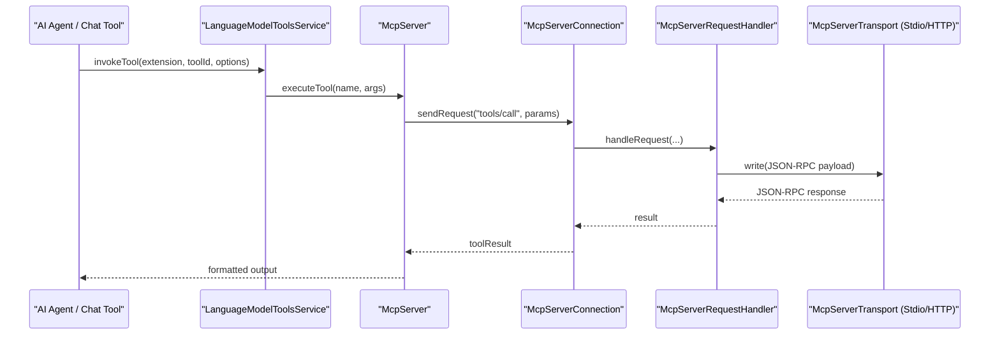

# MCP (Model Context Protocol) Integration

<details>
<summary>Relevant source files</summary>

The following files were used as context for generating this wiki page:

- [src/vs/base/common/oauth.ts](src/vs/base/common/oauth.ts)
- [src/vs/base/test/common/oauth.test.ts](src/vs/base/test/common/oauth.test.ts)
- [src/vs/platform/mcp/common/mcpGalleryManifest.ts](src/vs/platform/mcp/common/mcpGalleryManifest.ts)
- [src/vs/platform/mcp/common/mcpGalleryManifestService.ts](src/vs/platform/mcp/common/mcpGalleryManifestService.ts)
- [src/vs/platform/mcp/common/mcpGalleryService.ts](src/vs/platform/mcp/common/mcpGalleryService.ts)
- [src/vs/platform/mcp/common/mcpManagement.ts](src/vs/platform/mcp/common/mcpManagement.ts)
- [src/vs/platform/mcp/common/mcpManagementIpc.ts](src/vs/platform/mcp/common/mcpManagementIpc.ts)
- [src/vs/platform/mcp/common/mcpManagementService.ts](src/vs/platform/mcp/common/mcpManagementService.ts)
- [src/vs/platform/mcp/common/mcpPlatformTypes.ts](src/vs/platform/mcp/common/mcpPlatformTypes.ts)
- [src/vs/platform/mcp/common/mcpResourceScannerService.ts](src/vs/platform/mcp/common/mcpResourceScannerService.ts)
- [src/vs/platform/mcp/node/mcpManagementService.ts](src/vs/platform/mcp/node/mcpManagementService.ts)
- [src/vs/platform/mcp/test/common/mcpManagementService.test.ts](src/vs/platform/mcp/test/common/mcpManagementService.test.ts)
- [src/vs/platform/observable/common/observableMemento.ts](src/vs/platform/observable/common/observableMemento.ts)
- [src/vs/workbench/api/browser/mainThreadMcp.ts](src/vs/workbench/api/browser/mainThreadMcp.ts)
- [src/vs/workbench/api/common/extHostMcp.ts](src/vs/workbench/api/common/extHostMcp.ts)
- [src/vs/workbench/api/node/extHostAuthentication.ts](src/vs/workbench/api/node/extHostAuthentication.ts)
- [src/vs/workbench/api/node/extHostMcpNode.ts](src/vs/workbench/api/node/extHostMcpNode.ts)
- [src/vs/workbench/api/node/loopbackServer.ts](src/vs/workbench/api/node/loopbackServer.ts)
- [src/vs/workbench/api/test/node/extHostMcpNode.test.ts](src/vs/workbench/api/test/node/extHostMcpNode.test.ts)
- [src/vs/workbench/contrib/mcp/browser/mcp.contribution.ts](src/vs/workbench/contrib/mcp/browser/mcp.contribution.ts)
- [src/vs/workbench/contrib/mcp/browser/mcpAddContextContribution.ts](src/vs/workbench/contrib/mcp/browser/mcpAddContextContribution.ts)
- [src/vs/workbench/contrib/mcp/browser/mcpCommands.ts](src/vs/workbench/contrib/mcp/browser/mcpCommands.ts)
- [src/vs/workbench/contrib/mcp/browser/mcpCommandsAddConfiguration.ts](src/vs/workbench/contrib/mcp/browser/mcpCommandsAddConfiguration.ts)
- [src/vs/workbench/contrib/mcp/browser/mcpElicitationService.ts](src/vs/workbench/contrib/mcp/browser/mcpElicitationService.ts)
- [src/vs/workbench/contrib/mcp/browser/mcpMigration.ts](src/vs/workbench/contrib/mcp/browser/mcpMigration.ts)
- [src/vs/workbench/contrib/mcp/browser/mcpPromptArgumentPick.ts](src/vs/workbench/contrib/mcp/browser/mcpPromptArgumentPick.ts)
- [src/vs/workbench/contrib/mcp/browser/mcpResourceQuickAccess.ts](src/vs/workbench/contrib/mcp/browser/mcpResourceQuickAccess.ts)
- [src/vs/workbench/contrib/mcp/browser/mcpServerActions.ts](src/vs/workbench/contrib/mcp/browser/mcpServerActions.ts)
- [src/vs/workbench/contrib/mcp/browser/mcpServerEditor.ts](src/vs/workbench/contrib/mcp/browser/mcpServerEditor.ts)
- [src/vs/workbench/contrib/mcp/browser/mcpServerIcons.ts](src/vs/workbench/contrib/mcp/browser/mcpServerIcons.ts)
- [src/vs/workbench/contrib/mcp/browser/mcpServerWidgets.ts](src/vs/workbench/contrib/mcp/browser/mcpServerWidgets.ts)
- [src/vs/workbench/contrib/mcp/browser/mcpServersView.ts](src/vs/workbench/contrib/mcp/browser/mcpServersView.ts)
- [src/vs/workbench/contrib/mcp/browser/mcpWorkbenchService.ts](src/vs/workbench/contrib/mcp/browser/mcpWorkbenchService.ts)
- [src/vs/workbench/contrib/mcp/common/discovery/extensionMcpDiscovery.ts](src/vs/workbench/contrib/mcp/common/discovery/extensionMcpDiscovery.ts)
- [src/vs/workbench/contrib/mcp/common/discovery/installedMcpServersDiscovery.ts](src/vs/workbench/contrib/mcp/common/discovery/installedMcpServersDiscovery.ts)
- [src/vs/workbench/contrib/mcp/common/discovery/nativeMcpDiscoveryAbstract.ts](src/vs/workbench/contrib/mcp/common/discovery/nativeMcpDiscoveryAbstract.ts)
- [src/vs/workbench/contrib/mcp/common/discovery/nativeMcpDiscoveryAdapters.ts](src/vs/workbench/contrib/mcp/common/discovery/nativeMcpDiscoveryAdapters.ts)
- [src/vs/workbench/contrib/mcp/common/discovery/workspaceMcpDiscoveryAdapter.ts](src/vs/workbench/contrib/mcp/common/discovery/workspaceMcpDiscoveryAdapter.ts)
- [src/vs/workbench/contrib/mcp/common/mcpCommandIds.ts](src/vs/workbench/contrib/mcp/common/mcpCommandIds.ts)
- [src/vs/workbench/contrib/mcp/common/mcpConfiguration.ts](src/vs/workbench/contrib/mcp/common/mcpConfiguration.ts)
- [src/vs/workbench/contrib/mcp/common/mcpContextKeys.ts](src/vs/workbench/contrib/mcp/common/mcpContextKeys.ts)
- [src/vs/workbench/contrib/mcp/common/mcpIcons.ts](src/vs/workbench/contrib/mcp/common/mcpIcons.ts)
- [src/vs/workbench/contrib/mcp/common/mcpRegistry.ts](src/vs/workbench/contrib/mcp/common/mcpRegistry.ts)
- [src/vs/workbench/contrib/mcp/common/mcpRegistryTypes.ts](src/vs/workbench/contrib/mcp/common/mcpRegistryTypes.ts)
- [src/vs/workbench/contrib/mcp/common/mcpSandboxService.ts](src/vs/workbench/contrib/mcp/common/mcpSandboxService.ts)
- [src/vs/workbench/contrib/mcp/common/mcpServer.ts](src/vs/workbench/contrib/mcp/common/mcpServer.ts)
- [src/vs/workbench/contrib/mcp/common/mcpServerConnection.ts](src/vs/workbench/contrib/mcp/common/mcpServerConnection.ts)
- [src/vs/workbench/contrib/mcp/common/mcpServerRequestHandler.ts](src/vs/workbench/contrib/mcp/common/mcpServerRequestHandler.ts)
- [src/vs/workbench/contrib/mcp/common/mcpService.ts](src/vs/workbench/contrib/mcp/common/mcpService.ts)
- [src/vs/workbench/contrib/mcp/common/mcpTaskManager.ts](src/vs/workbench/contrib/mcp/common/mcpTaskManager.ts)
- [src/vs/workbench/contrib/mcp/common/mcpTypes.ts](src/vs/workbench/contrib/mcp/common/mcpTypes.ts)
- [src/vs/workbench/contrib/mcp/common/modelContextProtocol.ts](src/vs/workbench/contrib/mcp/common/modelContextProtocol.ts)
- [src/vs/workbench/contrib/mcp/test/common/mcpIcons.test.ts](src/vs/workbench/contrib/mcp/test/common/mcpIcons.test.ts)
- [src/vs/workbench/contrib/mcp/test/common/mcpRegistry.test.ts](src/vs/workbench/contrib/mcp/test/common/mcpRegistry.test.ts)
- [src/vs/workbench/contrib/mcp/test/common/mcpRegistryTypes.ts](src/vs/workbench/contrib/mcp/test/common/mcpRegistryTypes.ts)
- [src/vs/workbench/contrib/mcp/test/common/mcpServerConnection.test.ts](src/vs/workbench/contrib/mcp/test/common/mcpServerConnection.test.ts)
- [src/vs/workbench/contrib/mcp/test/common/mcpServerRequestHandler.test.ts](src/vs/workbench/contrib/mcp/test/common/mcpServerRequestHandler.test.ts)
- [src/vs/workbench/contrib/mcp/test/common/nativeMcpDiscoveryAdapters.test.ts](src/vs/workbench/contrib/mcp/test/common/nativeMcpDiscoveryAdapters.test.ts)
- [src/vs/workbench/services/mcp/browser/mcpGalleryManifestService.ts](src/vs/workbench/services/mcp/browser/mcpGalleryManifestService.ts)
- [src/vs/workbench/services/mcp/browser/mcpWorkbenchManagementService.ts](src/vs/workbench/services/mcp/browser/mcpWorkbenchManagementService.ts)
- [src/vs/workbench/services/mcp/common/mcpWorkbenchManagementService.ts](src/vs/workbench/services/mcp/common/mcpWorkbenchManagementService.ts)
- [src/vs/workbench/services/mcp/electron-browser/mcpGalleryManifestService.ts](src/vs/workbench/services/mcp/electron-browser/mcpGalleryManifestService.ts)
- [src/vs/workbench/services/mcp/electron-browser/mcpWorkbenchManagementService.ts](src/vs/workbench/services/mcp/electron-browser/mcpWorkbenchManagementService.ts)

</details>


The Model Context Protocol (MCP) integration in VS Code enables the editor to connect to external servers that provide AI-ready tools, prompts, and resources. This subsystem handles the discovery of MCP servers, manages their lifecycle (start/stop/restart), and bridges the communication between the VS Code extension host and MCP server transports (Stdio or HTTP).

## Architecture Overview

The MCP integration is split across the `vs/platform` (interfaces), `vs/workbench/services` (management), and `vs/workbench/contrib` (UI and implementation) layers. It utilizes a registry pattern where different discovery mechanisms contribute server definitions that the `McpService` then instantiates as live server objects.

### Core Architecture Diagram

This diagram shows the relationship between the management services and the underlying protocol implementation.

```mermaid
graph TD
    subgraph Workbench_Layer ["Workbench Layer"]
        McpService["McpService"] -- "instantiates" --> McpServer["McpServer"]
        McpRegistry["McpRegistry"] -- "provides definitions" --> McpService["McpService"]
        Discovery["Discovery"] -- "registers" --> McpRegistry["McpRegistry"]
    end

    subgraph Server_Lifecycle ["Server Lifecycle"]
        McpServer["McpServer"] -- "owns" --> McpServerConnection["McpServerConnection"]
        McpServerConnection["McpServerConnection"] -- "uses" --> McpServerRequestHandler["McpServerRequestHandler"]
    end

    subgraph Transport_Layer ["Transport Layer"]
        McpServerRequestHandler["McpServerRequestHandler"] -- "communicates via" --> Stdio["Stdio"]
        McpServerRequestHandler["McpServerRequestHandler"] -- "communicates via" --> HTTP["HTTP"]
    end

    McpService["McpService"] IMcpService_McpService["IMcpService (McpService)"]
    McpRegistry["McpRegistry"] IMcpRegistry_McpRegistry["IMcpRegistry (McpRegistry)"]
    Discovery["Discovery"] McpDiscovery["McpDiscovery"]
    McpServer["McpServer"] IMcpServer_McpServer["IMcpServer (McpServer)"]
    McpServerConnection["McpServerConnection"] IMcpServerConnection_McpServerConnection["IMcpServerConnection (McpServerConnection)"]
    McpServerRequestHandler["McpServerRequestHandler"] McpServerRequestHandler["McpServerRequestHandler"]
    Stdio["Stdio"] McpServerTransportType_Stdio["McpServerTransportType.Stdio"]
    HTTP["HTTP"] McpServerTransportType_HTTP["McpServerTransportType.HTTP"]
```

**Sources:**
- `IMcpService`: [src/vs/workbench/contrib/mcp/common/mcpTypes.ts:20-22]()
- `McpService` implementation: [src/vs/workbench/contrib/mcp/common/mcpService.ts:25-48]()
- `McpRegistry`: [src/vs/workbench/contrib/mcp/common/mcpRegistry.ts:44-96]()
- `McpServer`: [src/vs/workbench/contrib/mcp/common/mcpServer.ts:46-46]()
- `McpServerConnection`: [src/vs/workbench/contrib/mcp/common/mcpTypes.ts:46-46]()

---

## MCP Server Registry and Discovery

The `IMcpRegistry` acts as the central store for `McpCollectionDefinition` and `McpServerDefinition`.

### Discovery Mechanisms
Multiple discovery providers contribute to the registry:
- **Extension Discovery**: Discovers servers contributed by VS Code extensions. Collections from extensions are prefixed with `ext.` [src/vs/workbench/contrib/mcp/common/mcpTypes.ts:38-38]().
- **Configuration Discovery**: Handles servers configured via `mcp.json`-style config files (user, remote user, workspace). These use the `mcp.config.` prefix [src/vs/workbench/contrib/mcp/common/mcpTypes.ts:46-46]().
- **Workspace Discovery**: Looks for folder-root `.mcp.json` files (Claude-style). These use the `workspace-dot-mcp.` prefix [src/vs/workbench/contrib/mcp/common/mcpTypes.ts:60-60]().

### Registry Implementation
The `McpRegistry` manages trust and collection lifecycle. It handles:
- **Trust Management**: Prompts users for permission before starting servers. It uses `McpServerTrust.Kind` to differentiate between `Trusted` and `TrustedOnNonce` behaviors [src/vs/workbench/contrib/mcp/common/mcpTypes.ts:84-84]().
- **Lazy Loading**: Supports `lazy` collections that are only fully loaded when needed, such as those from extensions that haven't activated yet [src/vs/workbench/contrib/mcp/common/mcpTypes.ts:96-103]().
- **Access Control**: Filters collections based on the `mcp.access` configuration [src/vs/workbench/contrib/mcp/common/mcpRegistry.ts:51-57]().

**Sources:**
- `McpCollectionDefinition`: [src/vs/workbench/contrib/mcp/common/mcpTypes.ts:70-114]()
- `McpServerDefinition`: [src/vs/workbench/contrib/mcp/common/mcpTypes.ts:228-254]()
- `McpRegistry` logic: [src/vs/workbench/contrib/mcp/common/mcpRegistry.ts:44-102]()

---

## MCPServer Lifecycle and Connection

The `McpServer` class manages the state of a single MCP server. It transitions through various `McpConnectionState` values: `Uninitialized`, `Connecting`, `Connected`, and `Error`.

### Data Flow: Natural Language Space to Code Entities

This diagram maps the conceptual flow of an AI tool call down to the specific classes handling the protocol.



### Key Functions and Lifecycle
- `McpService.autostart()`: Orchestrates the automatic starting of servers based on configuration (`mcp.autoStart`). It handles the `McpAutoStartValue` logic (e.g., `OnlyNew`, `NewAndOutdated`) [src/vs/workbench/contrib/mcp/common/mcpService.ts:76-102]().
- `McpServer.start()`: Initiates the connection. It handles capabilities discovery, including tools, resources, and prompts [src/vs/workbench/contrib/mcp/common/mcpServer.ts:103-125]().
- `McpServerRequestHandler`: Implements the JSON-RPC 2.0 protocol over the chosen transport [src/vs/workbench/contrib/mcp/common/mcpServerRequestHandler.ts:1-40]().
- `McpTaskManager`: Tracks long-running operations and progress reporting for the server [src/vs/workbench/contrib/mcp/common/mcpServer.ts:45-45]().

**Sources:**
- `McpServer` implementation: [src/vs/workbench/contrib/mcp/common/mcpServer.ts:83-125]()
- `McpConnectionState`: [src/vs/workbench/contrib/mcp/common/mcpTypes.ts:316-328]()
- `McpService` autostart: [src/vs/workbench/contrib/mcp/common/mcpService.ts:104-157]()

---

## Extension Host MCP API

The MCP API is exposed to extensions via the `vscode` namespace, allowing them to provide server definitions or interact with the MCP gateway.

### RPC Bridge
The integration uses the VS Code RPC protocol between the Main Thread and Extension Host:
- **MainThreadMcp**: Resides in the workbench and interacts with the `IMcpRegistry`. It registers a delegate to handle server starts requested by the extension host [src/vs/workbench/api/browser/mainThreadMcp.ts:40-109]().
- **ExtHostMcpService**: Resides in the extension host and provides the API surface to extensions. It manages `McpHTTPHandle` instances for HTTP-based servers [src/vs/workbench/api/common/extHostMcp.ts:69-110]().

### API Components
| Component | Responsibility |
| :--- | :--- |
| `registerMcpConfigurationProvider` | Allows extensions to dynamically contribute MCP server definitions [src/vs/workbench/api/common/extHostMcp.ts:36-36](). |
| `startMcpGateway` | Starts an MCP gateway that exposes MCP servers via HTTP endpoints [src/vs/workbench/api/common/extHostMcp.ts:45-45](). |
| `$substituteVariables` | Main thread proxy call to resolve variables in the extension host context [src/vs/workbench/api/common/extHostMcp.ts:124-130](). |
| `$onDidChangeMcpServerDefinitions` | Syncs the set of known MCP server definitions from the main thread to the extension host [src/vs/workbench/api/common/extHostMcp.ts:106-109](). |

**Sources:**
- `MainThreadMcp`: [src/vs/workbench/api/browser/mainThreadMcp.ts:40-109]()
- `ExtHostMcpService`: [src/vs/workbench/api/common/extHostMcp.ts:69-110]()

---

## OAuth Support

MCP integration includes specialized support for OAuth 2.0 flows, particularly for servers requiring protected resource access.

### Implementation Details
- **Metadata Discovery**: Uses `fetchResourceMetadata` and `fetchAuthorizationServerMetadata` to find OAuth endpoints from `.well-known` paths [src/vs/base/common/oauth.ts:8-11]().
- **Token Exchange**: Supports RFC 8693 (Token Exchange) and RFC 7523 (JWT Bearer Grant) for "ID-JAG" (Identity Assertion Authorization Grant) flows [src/vs/base/common/oauth.ts:17-41]().
- **Secret Storage**: Client secrets for MCP servers are stored securely using `ISecretStorageService` under the key `mcp.oauth.clientSecret` [src/vs/workbench/contrib/mcp/common/mcpTypes.ts:70-70]().
- **Enterprise Managed IDP**: Supports configuration for enterprise-managed Identity Providers via the `mcp.enterpriseManagedAuth.idp` section [src/vs/workbench/api/browser/mainThreadMcp.ts:26-26]().

**Sources:**
- OAuth utilities: [src/vs/base/common/oauth.ts:1-100]()
- Auth integration in MainThread: [src/vs/workbench/api/browser/mainThreadMcp.ts:58-62]()

---

## MCP Resource Quick Access UI

The `McpResourceQuickAccess` provider allows users to browse and select resources provided by MCP servers (e.g., documentation, logs, or remote files) using the Quick Pick interface (`Ctrl+P` style).

### Implementation: `McpResourcePickHelper`
The helper class manages the hierarchical navigation of MCP resources:
- **Directory Navigation**: If a resource is a directory, the helper resolves its children and updates the picker state [src/vs/workbench/contrib/mcp/browser/mcpResourceQuickAccess.ts:127-140]().
- **Breadcrumbs**: Maintains a stack of visited resource levels to allow "back" navigation [src/vs/workbench/contrib/mcp/browser/mcpResourceQuickAccess.ts:36-60]().
- **Icons**: Resolves resource-specific icons via `McpIcons` [src/vs/workbench/contrib/mcp/browser/mcpResourceQuickAccess.ts:74-74]().

### UI Commands
- `McpCommandIds.ListServer`: Lists all available MCP servers [src/vs/workbench/contrib/mcp/browser/mcpCommands.ts:83-87]().
- `McpCommandIds.AddConfiguration`: Triggers the flow to add a new MCP server configuration [src/vs/workbench/contrib/mcp/browser/mcpCommandsAddConfiguration.ts:39-39]().
- `McpCommandIds.InstallFromManifest`: Installs an MCP server from a gallery manifest [src/vs/workbench/contrib/mcp/browser/mcpCommandsAddConfiguration.ts:72-72]().

**Sources:**
- `McpResourceQuickAccess`: [src/vs/workbench/contrib/mcp/browser/mcpResourceQuickAccess.ts:1-30]()
- `McpResourcePickHelper`: [src/vs/workbench/contrib/mcp/browser/mcpResourceQuickAccess.ts:34-118]()
- `McpCommandIds`: [src/vs/workbench/contrib/mcp/common/mcpCommandIds.ts:1-40]()
- `McpCommandsAddConfiguration`: [src/vs/workbench/contrib/mcp/browser/mcpCommandsAddConfiguration.ts:45-124]()