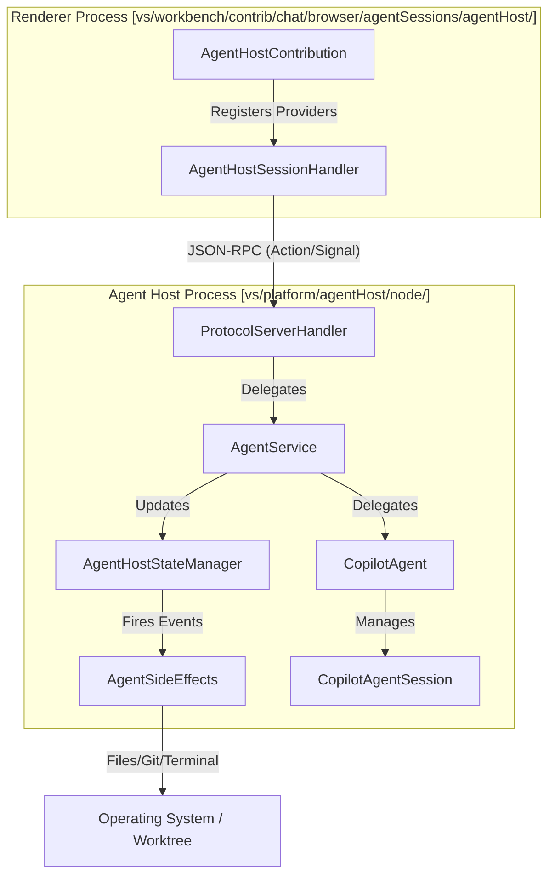
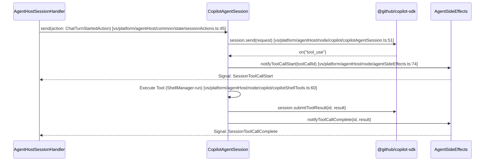

# Agent Host Platform

Relevant source files

The following files were used as context for generating this wiki page:

- [build/agent-sdk/agents/claude/package-lock.json](https://github.com/microsoft/vscode/blob/HEAD/build/agent-sdk/agents/claude/package-lock.json)
- [build/agent-sdk/agents/claude/package.json](https://github.com/microsoft/vscode/blob/HEAD/build/agent-sdk/agents/claude/package.json)
- [build/agent-sdk/agents/codex/package-lock.json](https://github.com/microsoft/vscode/blob/HEAD/build/agent-sdk/agents/codex/package-lock.json)
- [build/agent-sdk/agents/codex/package.json](https://github.com/microsoft/vscode/blob/HEAD/build/agent-sdk/agents/codex/package.json)
- [src/vs/platform/agentHost/OTEL.md](https://github.com/microsoft/vscode/blob/HEAD/src/vs/platform/agentHost/OTEL.md)
- [src/vs/platform/agentHost/common/agentModelPricing.ts](https://github.com/microsoft/vscode/blob/HEAD/src/vs/platform/agentHost/common/agentModelPricing.ts)
- [src/vs/platform/agentHost/common/agentModelSource.ts](https://github.com/microsoft/vscode/blob/HEAD/src/vs/platform/agentHost/common/agentModelSource.ts)
- [src/vs/platform/agentHost/common/agentService.ts](https://github.com/microsoft/vscode/blob/HEAD/src/vs/platform/agentHost/common/agentService.ts)
- [src/vs/platform/agentHost/common/claudeProviders.ts](https://github.com/microsoft/vscode/blob/HEAD/src/vs/platform/agentHost/common/claudeProviders.ts)
- [src/vs/platform/agentHost/common/otel/agentHostOTelService.ts](https://github.com/microsoft/vscode/blob/HEAD/src/vs/platform/agentHost/common/otel/agentHostOTelService.ts)
- [src/vs/platform/agentHost/common/reasoningEffort.ts](https://github.com/microsoft/vscode/blob/HEAD/src/vs/platform/agentHost/common/reasoningEffort.ts)
- [src/vs/platform/agentHost/common/state/sessionState.ts](https://github.com/microsoft/vscode/blob/HEAD/src/vs/platform/agentHost/common/state/sessionState.ts)
- [src/vs/platform/agentHost/node/agentHostStateManager.ts](https://github.com/microsoft/vscode/blob/HEAD/src/vs/platform/agentHost/node/agentHostStateManager.ts)
- [src/vs/platform/agentHost/node/agentService.ts](https://github.com/microsoft/vscode/blob/HEAD/src/vs/platform/agentHost/node/agentService.ts)
- [src/vs/platform/agentHost/node/agentSideEffects.ts](https://github.com/microsoft/vscode/blob/HEAD/src/vs/platform/agentHost/node/agentSideEffects.ts)
- [src/vs/platform/agentHost/node/claude/CONTEXT.md](https://github.com/microsoft/vscode/blob/HEAD/src/vs/platform/agentHost/node/claude/CONTEXT.md)
- [src/vs/platform/agentHost/node/claude/claudeAgent.ts](https://github.com/microsoft/vscode/blob/HEAD/src/vs/platform/agentHost/node/claude/claudeAgent.ts)
- [src/vs/platform/agentHost/node/claude/claudeAgentSdkService.ts](https://github.com/microsoft/vscode/blob/HEAD/src/vs/platform/agentHost/node/claude/claudeAgentSdkService.ts)
- [src/vs/platform/agentHost/node/claude/claudeAgentSession.ts](https://github.com/microsoft/vscode/blob/HEAD/src/vs/platform/agentHost/node/claude/claudeAgentSession.ts)
- [src/vs/platform/agentHost/node/claude/claudeReplayMapper.ts](https://github.com/microsoft/vscode/blob/HEAD/src/vs/platform/agentHost/node/claude/claudeReplayMapper.ts)
- [src/vs/platform/agentHost/node/claude/claudeSdkOptions.ts](https://github.com/microsoft/vscode/blob/HEAD/src/vs/platform/agentHost/node/claude/claudeSdkOptions.ts)
- [src/vs/platform/agentHost/node/claude/claudeSdkPipeline.ts](https://github.com/microsoft/vscode/blob/HEAD/src/vs/platform/agentHost/node/claude/claudeSdkPipeline.ts)
- [src/vs/platform/agentHost/node/claude/roadmap.md](https://github.com/microsoft/vscode/blob/HEAD/src/vs/platform/agentHost/node/claude/roadmap.md)
- [src/vs/platform/agentHost/node/codex/codexAgent.ts](https://github.com/microsoft/vscode/blob/HEAD/src/vs/platform/agentHost/node/codex/codexAgent.ts)
- [src/vs/platform/agentHost/node/codex/codexLaunchConfig.ts](https://github.com/microsoft/vscode/blob/HEAD/src/vs/platform/agentHost/node/codex/codexLaunchConfig.ts)
- [src/vs/platform/agentHost/node/codex/codexPromptResolver.ts](https://github.com/microsoft/vscode/blob/HEAD/src/vs/platform/agentHost/node/codex/codexPromptResolver.ts)
- [src/vs/platform/agentHost/node/codex/codexSessionConfigKeys.ts](https://github.com/microsoft/vscode/blob/HEAD/src/vs/platform/agentHost/node/codex/codexSessionConfigKeys.ts)
- [src/vs/platform/agentHost/node/copilot/copilotAgent.ts](https://github.com/microsoft/vscode/blob/HEAD/src/vs/platform/agentHost/node/copilot/copilotAgent.ts)
- [src/vs/platform/agentHost/node/copilot/copilotAgentSession.ts](https://github.com/microsoft/vscode/blob/HEAD/src/vs/platform/agentHost/node/copilot/copilotAgentSession.ts)
- [src/vs/platform/agentHost/node/otel/agentHostOTelService.ts](https://github.com/microsoft/vscode/blob/HEAD/src/vs/platform/agentHost/node/otel/agentHostOTelService.ts)
- [src/vs/platform/agentHost/test/common/reasoningEffort.test.ts](https://github.com/microsoft/vscode/blob/HEAD/src/vs/platform/agentHost/test/common/reasoningEffort.test.ts)
- [src/vs/platform/agentHost/test/node/agentHostStateManager.test.ts](https://github.com/microsoft/vscode/blob/HEAD/src/vs/platform/agentHost/test/node/agentHostStateManager.test.ts)
- [src/vs/platform/agentHost/test/node/agentService.test.ts](https://github.com/microsoft/vscode/blob/HEAD/src/vs/platform/agentHost/test/node/agentService.test.ts)
- [src/vs/platform/agentHost/test/node/agentSideEffects.test.ts](https://github.com/microsoft/vscode/blob/HEAD/src/vs/platform/agentHost/test/node/agentSideEffects.test.ts)
- [src/vs/platform/agentHost/test/node/claudeAgent.integrationTest.ts](https://github.com/microsoft/vscode/blob/HEAD/src/vs/platform/agentHost/test/node/claudeAgent.integrationTest.ts)
- [src/vs/platform/agentHost/test/node/claudeAgent.test.ts](https://github.com/microsoft/vscode/blob/HEAD/src/vs/platform/agentHost/test/node/claudeAgent.test.ts)
- [src/vs/platform/agentHost/test/node/claudeModelSelection.test.ts](https://github.com/microsoft/vscode/blob/HEAD/src/vs/platform/agentHost/test/node/claudeModelSelection.test.ts)
- [src/vs/platform/agentHost/test/node/claudeReplayMapper.test.ts](https://github.com/microsoft/vscode/blob/HEAD/src/vs/platform/agentHost/test/node/claudeReplayMapper.test.ts)
- [src/vs/platform/agentHost/test/node/claudeSdkOptions.test.ts](https://github.com/microsoft/vscode/blob/HEAD/src/vs/platform/agentHost/test/node/claudeSdkOptions.test.ts)
- [src/vs/platform/agentHost/test/node/claudeSdkPipeline.test.ts](https://github.com/microsoft/vscode/blob/HEAD/src/vs/platform/agentHost/test/node/claudeSdkPipeline.test.ts)
- [src/vs/platform/agentHost/test/node/claudeSubagentResolver.test.ts](https://github.com/microsoft/vscode/blob/HEAD/src/vs/platform/agentHost/test/node/claudeSubagentResolver.test.ts)
- [src/vs/platform/agentHost/test/node/codex/codexLaunchConfig.test.ts](https://github.com/microsoft/vscode/blob/HEAD/src/vs/platform/agentHost/test/node/codex/codexLaunchConfig.test.ts)
- [src/vs/platform/agentHost/test/node/codex/codexModelRefresh.test.ts](https://github.com/microsoft/vscode/blob/HEAD/src/vs/platform/agentHost/test/node/codex/codexModelRefresh.test.ts)
- [src/vs/platform/agentHost/test/node/codex/codexPrewarmEviction.test.ts](https://github.com/microsoft/vscode/blob/HEAD/src/vs/platform/agentHost/test/node/codex/codexPrewarmEviction.test.ts)
- [src/vs/platform/agentHost/test/node/codex/codexPromptResolver.test.ts](https://github.com/microsoft/vscode/blob/HEAD/src/vs/platform/agentHost/test/node/codex/codexPromptResolver.test.ts)
- [src/vs/platform/agentHost/test/node/codex/codexSessionConfigKeys.test.ts](https://github.com/microsoft/vscode/blob/HEAD/src/vs/platform/agentHost/test/node/codex/codexSessionConfigKeys.test.ts)
- [src/vs/platform/agentHost/test/node/copilotAgent.test.ts](https://github.com/microsoft/vscode/blob/HEAD/src/vs/platform/agentHost/test/node/copilotAgent.test.ts)
- [src/vs/platform/agentHost/test/node/copilotAgentSession.test.ts](https://github.com/microsoft/vscode/blob/HEAD/src/vs/platform/agentHost/test/node/copilotAgentSession.test.ts)
- [src/vs/platform/agentHost/test/node/mockAgent.ts](https://github.com/microsoft/vscode/blob/HEAD/src/vs/platform/agentHost/test/node/mockAgent.ts)
- [src/vs/platform/agentHost/test/node/otel/agentHostOTelService.integrationTest.ts](https://github.com/microsoft/vscode/blob/HEAD/src/vs/platform/agentHost/test/node/otel/agentHostOTelService.integrationTest.ts)
- [src/vs/platform/otel/test/node/otlp/localOtlpReceiver.test.ts](https://github.com/microsoft/vscode/blob/HEAD/src/vs/platform/otel/test/node/otlp/localOtlpReceiver.test.ts)
- [src/vs/workbench/contrib/chat/browser/agentSessions/agentHost/agentHostChatContribution.ts](https://github.com/microsoft/vscode/blob/HEAD/src/vs/workbench/contrib/chat/browser/agentSessions/agentHost/agentHostChatContribution.ts)
- [src/vs/workbench/contrib/chat/browser/agentSessions/agentHost/agentHostLanguageModelProvider.ts](https://github.com/microsoft/vscode/blob/HEAD/src/vs/workbench/contrib/chat/browser/agentSessions/agentHost/agentHostLanguageModelProvider.ts)
- [src/vs/workbench/contrib/chat/browser/agentSessions/agentHost/agentHostSessionHandler.ts](https://github.com/microsoft/vscode/blob/HEAD/src/vs/workbench/contrib/chat/browser/agentSessions/agentHost/agentHostSessionHandler.ts)
- [src/vs/workbench/contrib/chat/browser/agentSessions/agentHost/agentHostSessionListController.ts](https://github.com/microsoft/vscode/blob/HEAD/src/vs/workbench/contrib/chat/browser/agentSessions/agentHost/agentHostSessionListController.ts)
- [src/vs/workbench/contrib/chat/browser/agentSessions/agentHost/stateToProgressAdapter.ts](https://github.com/microsoft/vscode/blob/HEAD/src/vs/workbench/contrib/chat/browser/agentSessions/agentHost/stateToProgressAdapter.ts)
- [src/vs/workbench/contrib/chat/test/browser/agentSessions/agentHostChatContribution.test.ts](https://github.com/microsoft/vscode/blob/HEAD/src/vs/workbench/contrib/chat/test/browser/agentSessions/agentHostChatContribution.test.ts)
- [src/vs/workbench/contrib/chat/test/browser/agentSessions/agentHostClientTools.test.ts](https://github.com/microsoft/vscode/blob/HEAD/src/vs/workbench/contrib/chat/test/browser/agentSessions/agentHostClientTools.test.ts)
- [src/vs/workbench/contrib/chat/test/browser/agentSessions/agentHostLanguageModelProvider.test.ts](https://github.com/microsoft/vscode/blob/HEAD/src/vs/workbench/contrib/chat/test/browser/agentSessions/agentHostLanguageModelProvider.test.ts)
- [src/vs/workbench/contrib/chat/test/browser/agentSessions/stateToProgressAdapter.test.ts](https://github.com/microsoft/vscode/blob/HEAD/src/vs/workbench/contrib/chat/test/browser/agentSessions/stateToProgressAdapter.test.ts)

The **Agent Host Platform** (AHP) provides the infrastructure for running AI agents (such as GitHub Copilot) in a dedicated process, isolated from the main VS Code workbench and extension host. It manages the lifecycle of agent sessions, provides a state-driven protocol for agent-client communication, and implements the side effects (file I/O, terminal management, git operations) required by agents to perform software engineering tasks.

## Architecture Overview

The platform is split between a **host process** (running `AgentService`) and a **client** (typically the `AgentHostSessionHandler` in the renderer). Communication occurs via a JSON-RPC protocol over WebSockets or IPC.

### High-Level Component Interaction

**Sources:** [src/vs/platform/agentHost/node/agentService.ts:25-62](https://github.com/microsoft/vscode/blob/HEAD/src/vs/platform/agentHost/node/agentService.ts#L25-L62), [src/vs/workbench/contrib/chat/browser/agentSessions/agentHost/agentHostSessionHandler.ts:29-61](https://github.com/microsoft/vscode/blob/HEAD/src/vs/workbench/contrib/chat/browser/agentSessions/agentHost/agentHostSessionHandler.ts#L29-L61), [src/vs/platform/agentHost/common/agentService.ts:48-65](https://github.com/microsoft/vscode/blob/HEAD/src/vs/platform/agentHost/common/agentService.ts#L48-L65)

---

## Core Host Services

### AgentService
The `AgentService` is the primary entry point in the agent host process. It manages the registry of available agents (e.g., Copilot, Claude) and handles the creation and garbage collection of sessions.

- **Session Lifecycle:** It creates `AgentSession` objects and dispatches incoming RPC calls to the appropriate agent based on the provider identifier in the session configuration [src/vs/platform/agentHost/node/agentService.ts:25-30](https://github.com/microsoft/vscode/blob/HEAD/src/vs/platform/agentHost/node/agentService.ts#L25-L30).
- **State Management:** Uses an `AgentHostStateManager` to maintain an authoritative, serializable state tree for every session [src/vs/platform/agentHost/node/agentService.ts:50-50](https://github.com/microsoft/vscode/blob/HEAD/src/vs/platform/agentHost/node/agentService.ts#L50).
- **Protocol Server:** Integrates with `ProtocolServerHandler` (referenced via `AgentHostIpcChannels.Protocol`) to process raw JSON-RPC frames and route them to session-specific methods like `createSession` or `sendMessage` [src/vs/platform/agentHost/common/agentService.ts:55-56](https://github.com/microsoft/vscode/blob/HEAD/src/vs/platform/agentHost/common/agentService.ts#L55-L56).
- **Side Effects Wiring:** Instantiates `AgentSideEffects` to handle the physical world interactions triggered by state changes [src/vs/platform/agentHost/node/agentService.ts:53-53](https://github.com/microsoft/vscode/blob/HEAD/src/vs/platform/agentHost/node/agentService.ts#L53).

**Sources:** [src/vs/platform/agentHost/node/agentService.ts:25-65](https://github.com/microsoft/vscode/blob/HEAD/src/vs/platform/agentHost/node/agentService.ts#L25-L65), [src/vs/platform/agentHost/common/agentService.ts:48-65](https://github.com/microsoft/vscode/blob/HEAD/src/vs/platform/agentHost/common/agentService.ts#L48-L65)

### AgentSideEffects
`AgentSideEffects` bridges the pure state-machine logic of the agents with the physical world. It listens to state mutations emitted by the `AgentHostStateManager` and performs the necessary actions.

- **Tool Routing:** Maps tool call IDs to the specific agent backend that owns them, ensuring confirmations are routed back correctly [src/vs/platform/agentHost/node/agentSideEffects.ts:74-74](https://github.com/microsoft/vscode/blob/HEAD/src/vs/platform/agentHost/node/agentSideEffects.ts#L74).
- **Subagent Management:** Tracks parent-child relationships between sessions when an agent spawns a "subagent" using `buildSubagentChatUri` [src/vs/platform/agentHost/node/agentSideEffects.ts:35-35](https://github.com/microsoft/vscode/blob/HEAD/src/vs/platform/agentHost/node/agentSideEffects.ts#L35).
- **Event Buffering:** Buffers signals for subagents that haven't fully materialized yet (e.g., if a `tool_start` arrives before the `subagent_started` signal) [src/vs/platform/agentHost/node/agentSideEffects.ts:120-125](https://github.com/microsoft/vscode/blob/HEAD/src/vs/platform/agentHost/node/agentSideEffects.ts#L120-L125).
- **Session Title Generation:** Orchestrates `AgentHostSessionTitleController` to generate meaningful titles for chat sessions based on content [src/vs/platform/agentHost/node/agentSideEffects.ts:70-70](https://github.com/microsoft/vscode/blob/HEAD/src/vs/platform/agentHost/node/agentSideEffects.ts#L70).

**Sources:** [src/vs/platform/agentHost/node/agentSideEffects.ts:68-85](https://github.com/microsoft/vscode/blob/HEAD/src/vs/platform/agentHost/node/agentSideEffects.ts#L68-L85), [src/vs/platform/agentHost/node/agentSideEffects.ts:90-127](https://github.com/microsoft/vscode/blob/HEAD/src/vs/platform/agentHost/node/agentSideEffects.ts#L90-L127)

---

## Copilot Agent Implementation

The `CopilotAgent` is the implementation of the `IAgent` interface that wraps the `@github/copilot-sdk` [src/vs/platform/agentHost/node/copilot/copilotAgent.ts:56-56](https://github.com/microsoft/vscode/blob/HEAD/src/vs/platform/agentHost/node/copilot/copilotAgent.ts#L56).

### CopilotAgentSession
This class manages a single active SDK session. It handles the translation between VS Code's agent protocol and the SDK's internal events.

- **Mode Switching:** Translates between VS Code's `SessionMode` (`interactive`, `plan`, `autopilot`) and the SDK's internal `CopilotSdkMode` [src/vs/platform/agentHost/node/copilot/copilotAgentSession.ts:6-6](https://github.com/microsoft/vscode/blob/HEAD/src/vs/platform/agentHost/node/copilot/copilotAgentSession.ts#L6), [src/vs/platform/agentHost/node/copilot/copilotAgentSession.ts:49-49](https://github.com/microsoft/vscode/blob/HEAD/src/vs/platform/agentHost/node/copilot/copilotAgentSession.ts#L49).
- **Tool Handling:** Implements handlers for SDK tools such as shell execution and file editing. It uses `ShellManager` to provide a terminal environment and `FileEditTracker` to monitor changes [src/vs/platform/agentHost/node/copilot/copilotAgentSession.ts:60-65](https://github.com/microsoft/vscode/blob/HEAD/src/vs/platform/agentHost/node/copilot/copilotAgentSession.ts#L60-L65).
- **MCP Integration:** Manages Model Context Protocol (MCP) servers and auth requests through `mcpCustomizationController.ts` [src/vs/platform/agentHost/node/copilot/copilotAgent.ts:67-67](https://github.com/microsoft/vscode/blob/HEAD/src/vs/platform/agentHost/node/copilot/copilotAgent.ts#L67).
- **Branch Management:** Uses `AgentBranchNameGenerator` to create meaningful branch names for agent-initiated worktrees [src/vs/platform/agentHost/node/copilot/copilotAgent.ts:67-67](https://github.com/microsoft/vscode/blob/HEAD/src/vs/platform/agentHost/node/copilot/copilotAgent.ts#L67).

### Data Flow: Message to Tool Call

**Sources:** [src/vs/platform/agentHost/node/copilot/copilotAgentSession.ts:6-66](https://github.com/microsoft/vscode/blob/HEAD/src/vs/platform/agentHost/node/copilot/copilotAgentSession.ts#L6-L66), [src/vs/platform/agentHost/node/agentSideEffects.ts:68-75](https://github.com/microsoft/vscode/blob/HEAD/src/vs/platform/agentHost/node/agentSideEffects.ts#L68-L75), [src/vs/platform/agentHost/node/copilot/copilotAgent.ts:56-70](https://github.com/microsoft/vscode/blob/HEAD/src/vs/platform/agentHost/node/copilot/copilotAgent.ts#L56-L70)

---

## Protocol and Communication

### AgentHostSessionHandler
The renderer-side handler for agent host chat sessions. It bridges the `IChatService` with the remote `AgentService`.

- **Action Dispatch:** Dispatches `SessionAction` envelopes to the agent host via `IRemoteAgentHostService` [src/vs/workbench/contrib/chat/browser/agentSessions/agentHost/agentHostSessionHandler.ts:37-45](https://github.com/microsoft/vscode/blob/HEAD/src/vs/workbench/contrib/chat/browser/agentSessions/agentHost/agentHostSessionHandler.ts#L37-L45).
- **Progress Adaptation:** Converts incoming `AgentSignal` events into `IChatProgress` updates for the UI using `stateToProgressAdapter.ts` [src/vs/workbench/contrib/chat/browser/agentSessions/agentHost/stateToProgressAdapter.ts:16-34](https://github.com/microsoft/vscode/blob/HEAD/src/vs/workbench/contrib/chat/browser/agentSessions/agentHost/stateToProgressAdapter.ts#L16-L34).
- **Terminal Integration:** Manages terminal sessions associated with agent tools via `IAgentHostTerminalService` [src/vs/workbench/contrib/chat/browser/agentSessions/agentHost/agentHostSessionHandler.ts:58-58](https://github.com/microsoft/vscode/blob/HEAD/src/vs/workbench/contrib/chat/browser/agentSessions/agentHost/agentHostSessionHandler.ts#L58).

### stateToProgressAdapter
This utility converts the internal AHP session state into the format required by the VS Code Chat UI.

- **Tool Call Mapping:** Extracts task descriptions and agent names from tool call metadata using `readToolCallMeta` [src/vs/workbench/contrib/chat/browser/agentSessions/agentHost/stateToProgressAdapter.ts:19-19](https://github.com/microsoft/vscode/blob/HEAD/src/vs/workbench/contrib/chat/browser/agentSessions/agentHost/stateToProgressAdapter.ts#L19).
- **MCP App Rendering:** Populates `mcpAppData` so the chat renderer can mount specialized components for MCP tools [src/vs/workbench/contrib/chat/browser/agentSessions/agentHost/stateToProgressAdapter.ts:34-34](https://github.com/microsoft/vscode/blob/HEAD/src/vs/workbench/contrib/chat/browser/agentSessions/agentHost/stateToProgressAdapter.ts#L34).
- **Error Handling:** Maps protocol-level errors to user-friendly chat error details [src/vs/workbench/contrib/chat/browser/agentSessions/agentHost/stateToProgressAdapter.ts:20-20](https://github.com/microsoft/vscode/blob/HEAD/src/vs/workbench/contrib/chat/browser/agentSessions/agentHost/stateToProgressAdapter.ts#L20).

**Sources:** [src/vs/workbench/contrib/chat/browser/agentSessions/agentHost/agentHostSessionHandler.ts:29-66](https://github.com/microsoft/vscode/blob/HEAD/src/vs/workbench/contrib/chat/browser/agentSessions/agentHost/agentHostSessionHandler.ts#L29-L66), [src/vs/workbench/contrib/chat/browser/agentSessions/agentHost/stateToProgressAdapter.ts:1-71](https://github.com/microsoft/vscode/blob/HEAD/src/vs/workbench/contrib/chat/browser/agentSessions/agentHost/stateToProgressAdapter.ts#L1-L71)

---

## Session State Management

### AgentHostSnapshotController
While the `AgentHostStateManager` holds the authoritative state in the host [src/vs/platform/agentHost/node/agentHostStateManager.ts](https://github.com/microsoft/vscode/blob/HEAD/src/vs/platform/agentHost/node/agentHostStateManager.ts), the renderer uses a snapshot controller to manage session state for UI rendering and session list views.

- **State Reducers:** Uses `sessionReducer` and `chatReducer` to update local state based on incoming actions and signals [src/vs/workbench/contrib/chat/test/browser/agentSessions/agentHostChatContribution.test.ts:37-37](https://github.com/microsoft/vscode/blob/HEAD/src/vs/workbench/contrib/chat/test/browser/agentSessions/agentHostChatContribution.test.ts#L37).
- **Checkpointing:** Interfaces with `IAgentHostCheckpointService` to manage session state persistence and restoration [src/vs/platform/agentHost/node/copilot/copilotAgent.ts:34-34](https://github.com/microsoft/vscode/blob/HEAD/src/vs/platform/agentHost/node/copilot/copilotAgent.ts#L34).

### State Components Table

| Component | Description | Code Entity |
| :--- | :--- | :--- |
| **Turns** | The list of request/response pairs in the session. | `Turn` [src/vs/platform/agentHost/common/state/sessionState.ts:49-49](https://github.com/microsoft/vscode/blob/HEAD/src/vs/platform/agentHost/common/state/sessionState.ts#L49) |
| **Tool Calls** | Individual tool invocations within a turn. | `ToolCallState` [src/vs/platform/agentHost/common/state/sessionState.ts:47-47](https://github.com/microsoft/vscode/blob/HEAD/src/vs/platform/agentHost/common/state/sessionState.ts#L47) |
| **Actions** | Client-initiated mutations (e.g., `sendMessage`). | `SessionAction` [src/vs/platform/agentHost/common/state/sessionActions.ts:32-32](https://github.com/microsoft/vscode/blob/HEAD/src/vs/platform/agentHost/common/state/sessionActions.ts#L32) |
| **Signals** | Host-initiated notifications (e.g., `tool_start`). | `AgentSignal` [src/vs/platform/agentHost/common/agent.ts:45-45](https://github.com/microsoft/vscode/blob/HEAD/src/vs/platform/agentHost/common/agent.ts#L45) |
| **Customizations** | Skills, rules, and plugins attached to a session. | `Customization` [src/vs/platform/agentHost/common/state/sessionState.ts:59-59](https://github.com/microsoft/vscode/blob/HEAD/src/vs/platform/agentHost/common/state/sessionState.ts#L59) |

**Sources:** [src/vs/platform/agentHost/common/state/sessionState.ts:47-67](https://github.com/microsoft/vscode/blob/HEAD/src/vs/platform/agentHost/common/state/sessionState.ts#L47-L67), [src/vs/platform/agentHost/common/state/sessionActions.ts:19-33](https://github.com/microsoft/vscode/blob/HEAD/src/vs/platform/agentHost/common/state/sessionActions.ts#L19-L33), [src/vs/platform/agentHost/common/agent.ts:45-46](https://github.com/microsoft/vscode/blob/HEAD/src/vs/platform/agentHost/common/agent.ts#L45-L46)