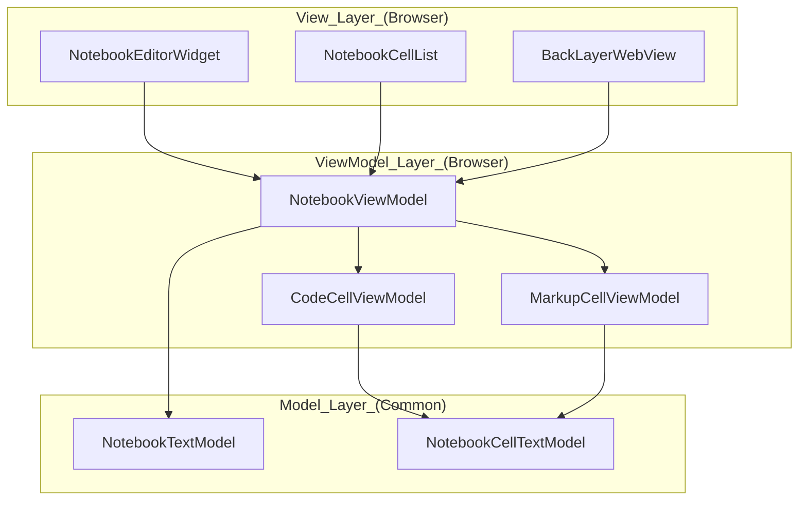

# Notebooks

<details>
<summary>Relevant source files</summary>

The following files were used as context for generating this wiki page:

- [src/vs/platform/userDataSync/common/userDataSyncLog.ts](https://github.com/microsoft/vscode/blob/HEAD/src/vs/platform/userDataSync/common/userDataSyncLog.ts)
- [src/vs/workbench/api/browser/mainThreadNotebook.ts](https://github.com/microsoft/vscode/blob/HEAD/src/vs/workbench/api/browser/mainThreadNotebook.ts)
- [src/vs/workbench/api/browser/mainThreadNotebookDocuments.ts](https://github.com/microsoft/vscode/blob/HEAD/src/vs/workbench/api/browser/mainThreadNotebookDocuments.ts)
- [src/vs/workbench/api/browser/mainThreadNotebookDocumentsAndEditors.ts](https://github.com/microsoft/vscode/blob/HEAD/src/vs/workbench/api/browser/mainThreadNotebookDocumentsAndEditors.ts)
- [src/vs/workbench/api/browser/mainThreadNotebookDto.ts](https://github.com/microsoft/vscode/blob/HEAD/src/vs/workbench/api/browser/mainThreadNotebookDto.ts)
- [src/vs/workbench/api/browser/mainThreadNotebookEditors.ts](https://github.com/microsoft/vscode/blob/HEAD/src/vs/workbench/api/browser/mainThreadNotebookEditors.ts)
- [src/vs/workbench/api/browser/mainThreadNotebookKernels.ts](https://github.com/microsoft/vscode/blob/HEAD/src/vs/workbench/api/browser/mainThreadNotebookKernels.ts)
- [src/vs/workbench/api/common/extHostNotebook.ts](https://github.com/microsoft/vscode/blob/HEAD/src/vs/workbench/api/common/extHostNotebook.ts)
- [src/vs/workbench/api/common/extHostNotebookKernels.ts](https://github.com/microsoft/vscode/blob/HEAD/src/vs/workbench/api/common/extHostNotebookKernels.ts)
- [src/vs/workbench/contrib/editSessions/common/editSessionsLogService.ts](https://github.com/microsoft/vscode/blob/HEAD/src/vs/workbench/contrib/editSessions/common/editSessionsLogService.ts)
- [src/vs/workbench/contrib/notebook/browser/contrib/editorStatusBar/editorStatusBar.ts](https://github.com/microsoft/vscode/blob/HEAD/src/vs/workbench/contrib/notebook/browser/contrib/editorStatusBar/editorStatusBar.ts)
- [src/vs/workbench/contrib/notebook/browser/contrib/kernelDetection/notebookKernelDetection.ts](https://github.com/microsoft/vscode/blob/HEAD/src/vs/workbench/contrib/notebook/browser/contrib/kernelDetection/notebookKernelDetection.ts)
- [src/vs/workbench/contrib/notebook/browser/contrib/notebookVariables/notebookVariableCommands.ts](https://github.com/microsoft/vscode/blob/HEAD/src/vs/workbench/contrib/notebook/browser/contrib/notebookVariables/notebookVariableCommands.ts)
- [src/vs/workbench/contrib/notebook/browser/contrib/notebookVariables/notebookVariableContextKeys.ts](https://github.com/microsoft/vscode/blob/HEAD/src/vs/workbench/contrib/notebook/browser/contrib/notebookVariables/notebookVariableContextKeys.ts)
- [src/vs/workbench/contrib/notebook/browser/contrib/notebookVariables/notebookVariables.ts](https://github.com/microsoft/vscode/blob/HEAD/src/vs/workbench/contrib/notebook/browser/contrib/notebookVariables/notebookVariables.ts)
- [src/vs/workbench/contrib/notebook/browser/contrib/notebookVariables/notebookVariablesDataSource.ts](https://github.com/microsoft/vscode/blob/HEAD/src/vs/workbench/contrib/notebook/browser/contrib/notebookVariables/notebookVariablesDataSource.ts)
- [src/vs/workbench/contrib/notebook/browser/contrib/notebookVariables/notebookVariablesTree.ts](https://github.com/microsoft/vscode/blob/HEAD/src/vs/workbench/contrib/notebook/browser/contrib/notebookVariables/notebookVariablesTree.ts)
- [src/vs/workbench/contrib/notebook/browser/contrib/notebookVariables/notebookVariablesView.ts](https://github.com/microsoft/vscode/blob/HEAD/src/vs/workbench/contrib/notebook/browser/contrib/notebookVariables/notebookVariablesView.ts)
- [src/vs/workbench/contrib/notebook/browser/controller/variablesActions.ts](https://github.com/microsoft/vscode/blob/HEAD/src/vs/workbench/contrib/notebook/browser/controller/variablesActions.ts)
- [src/vs/workbench/contrib/notebook/browser/media/notebook.css](https://github.com/microsoft/vscode/blob/HEAD/src/vs/workbench/contrib/notebook/browser/media/notebook.css)
- [src/vs/workbench/contrib/notebook/browser/notebook.contribution.ts](https://github.com/microsoft/vscode/blob/HEAD/src/vs/workbench/contrib/notebook/browser/notebook.contribution.ts)
- [src/vs/workbench/contrib/notebook/browser/notebookBrowser.ts](https://github.com/microsoft/vscode/blob/HEAD/src/vs/workbench/contrib/notebook/browser/notebookBrowser.ts)
- [src/vs/workbench/contrib/notebook/browser/notebookEditor.ts](https://github.com/microsoft/vscode/blob/HEAD/src/vs/workbench/contrib/notebook/browser/notebookEditor.ts)
- [src/vs/workbench/contrib/notebook/browser/notebookEditorWidget.ts](https://github.com/microsoft/vscode/blob/HEAD/src/vs/workbench/contrib/notebook/browser/notebookEditorWidget.ts)
- [src/vs/workbench/contrib/notebook/browser/notebookExtensionPoint.ts](https://github.com/microsoft/vscode/blob/HEAD/src/vs/workbench/contrib/notebook/browser/notebookExtensionPoint.ts)
- [src/vs/workbench/contrib/notebook/browser/services/notebookExecutionServiceImpl.ts](https://github.com/microsoft/vscode/blob/HEAD/src/vs/workbench/contrib/notebook/browser/services/notebookExecutionServiceImpl.ts)
- [src/vs/workbench/contrib/notebook/browser/services/notebookKernelHistoryServiceImpl.ts](https://github.com/microsoft/vscode/blob/HEAD/src/vs/workbench/contrib/notebook/browser/services/notebookKernelHistoryServiceImpl.ts)
- [src/vs/workbench/contrib/notebook/browser/services/notebookKernelServiceImpl.ts](https://github.com/microsoft/vscode/blob/HEAD/src/vs/workbench/contrib/notebook/browser/services/notebookKernelServiceImpl.ts)
- [src/vs/workbench/contrib/notebook/browser/services/notebookLoggingServiceImpl.ts](https://github.com/microsoft/vscode/blob/HEAD/src/vs/workbench/contrib/notebook/browser/services/notebookLoggingServiceImpl.ts)
- [src/vs/workbench/contrib/notebook/browser/view/notebookCellList.ts](https://github.com/microsoft/vscode/blob/HEAD/src/vs/workbench/contrib/notebook/browser/view/notebookCellList.ts)
- [src/vs/workbench/contrib/notebook/browser/view/renderers/backLayerWebView.ts](https://github.com/microsoft/vscode/blob/HEAD/src/vs/workbench/contrib/notebook/browser/view/renderers/backLayerWebView.ts)
- [src/vs/workbench/contrib/notebook/browser/view/renderers/cellRenderer.ts](https://github.com/microsoft/vscode/blob/HEAD/src/vs/workbench/contrib/notebook/browser/view/renderers/cellRenderer.ts)
- [src/vs/workbench/contrib/notebook/browser/view/renderers/webviewMessages.ts](https://github.com/microsoft/vscode/blob/HEAD/src/vs/workbench/contrib/notebook/browser/view/renderers/webviewMessages.ts)
- [src/vs/workbench/contrib/notebook/browser/view/renderers/webviewPreloads.ts](https://github.com/microsoft/vscode/blob/HEAD/src/vs/workbench/contrib/notebook/browser/view/renderers/webviewPreloads.ts)
- [src/vs/workbench/contrib/notebook/browser/viewModel/baseCellViewModel.ts](https://github.com/microsoft/vscode/blob/HEAD/src/vs/workbench/contrib/notebook/browser/viewModel/baseCellViewModel.ts)
- [src/vs/workbench/contrib/notebook/browser/viewModel/codeCellViewModel.ts](https://github.com/microsoft/vscode/blob/HEAD/src/vs/workbench/contrib/notebook/browser/viewModel/codeCellViewModel.ts)
- [src/vs/workbench/contrib/notebook/browser/viewModel/markupCellViewModel.ts](https://github.com/microsoft/vscode/blob/HEAD/src/vs/workbench/contrib/notebook/browser/viewModel/markupCellViewModel.ts)
- [src/vs/workbench/contrib/notebook/browser/viewParts/notebookKernelQuickPickStrategy.ts](https://github.com/microsoft/vscode/blob/HEAD/src/vs/workbench/contrib/notebook/browser/viewParts/notebookKernelQuickPickStrategy.ts)
- [src/vs/workbench/contrib/notebook/browser/viewParts/notebookKernelView.ts](https://github.com/microsoft/vscode/blob/HEAD/src/vs/workbench/contrib/notebook/browser/viewParts/notebookKernelView.ts)
- [src/vs/workbench/contrib/notebook/common/model/notebookCellTextModel.ts](https://github.com/microsoft/vscode/blob/HEAD/src/vs/workbench/contrib/notebook/common/model/notebookCellTextModel.ts)
- [src/vs/workbench/contrib/notebook/common/model/notebookTextModel.ts](https://github.com/microsoft/vscode/blob/HEAD/src/vs/workbench/contrib/notebook/common/model/notebookTextModel.ts)
- [src/vs/workbench/contrib/notebook/common/notebookCommon.ts](https://github.com/microsoft/vscode/blob/HEAD/src/vs/workbench/contrib/notebook/common/notebookCommon.ts)
- [src/vs/workbench/contrib/notebook/common/notebookEditorModel.ts](https://github.com/microsoft/vscode/blob/HEAD/src/vs/workbench/contrib/notebook/common/notebookEditorModel.ts)
- [src/vs/workbench/contrib/notebook/common/notebookEditorModelResolverService.ts](https://github.com/microsoft/vscode/blob/HEAD/src/vs/workbench/contrib/notebook/common/notebookEditorModelResolverService.ts)
- [src/vs/workbench/contrib/notebook/common/notebookEditorModelResolverServiceImpl.ts](https://github.com/microsoft/vscode/blob/HEAD/src/vs/workbench/contrib/notebook/common/notebookEditorModelResolverServiceImpl.ts)
- [src/vs/workbench/contrib/notebook/common/notebookExecutionService.ts](https://github.com/microsoft/vscode/blob/HEAD/src/vs/workbench/contrib/notebook/common/notebookExecutionService.ts)
- [src/vs/workbench/contrib/notebook/common/notebookKernelService.ts](https://github.com/microsoft/vscode/blob/HEAD/src/vs/workbench/contrib/notebook/common/notebookKernelService.ts)
- [src/vs/workbench/contrib/notebook/common/notebookLoggingService.ts](https://github.com/microsoft/vscode/blob/HEAD/src/vs/workbench/contrib/notebook/common/notebookLoggingService.ts)
- [src/vs/workbench/contrib/notebook/common/notebookOutputRenderer.ts](https://github.com/microsoft/vscode/blob/HEAD/src/vs/workbench/contrib/notebook/common/notebookOutputRenderer.ts)
- [src/vs/workbench/contrib/notebook/common/notebookService.ts](https://github.com/microsoft/vscode/blob/HEAD/src/vs/workbench/contrib/notebook/common/notebookService.ts)
- [src/vs/workbench/contrib/notebook/test/browser/notebookEditorModel.test.ts](https://github.com/microsoft/vscode/blob/HEAD/src/vs/workbench/contrib/notebook/test/browser/notebookEditorModel.test.ts)
- [src/vs/workbench/contrib/notebook/test/browser/notebookExecutionService.test.ts](https://github.com/microsoft/vscode/blob/HEAD/src/vs/workbench/contrib/notebook/test/browser/notebookExecutionService.test.ts)
- [src/vs/workbench/contrib/notebook/test/browser/notebookExecutionStateService.test.ts](https://github.com/microsoft/vscode/blob/HEAD/src/vs/workbench/contrib/notebook/test/browser/notebookExecutionStateService.test.ts)
- [src/vs/workbench/contrib/notebook/test/browser/notebookKernelHistory.test.ts](https://github.com/microsoft/vscode/blob/HEAD/src/vs/workbench/contrib/notebook/test/browser/notebookKernelHistory.test.ts)
- [src/vs/workbench/contrib/notebook/test/browser/notebookKernelService.test.ts](https://github.com/microsoft/vscode/blob/HEAD/src/vs/workbench/contrib/notebook/test/browser/notebookKernelService.test.ts)
- [src/vs/workbench/contrib/notebook/test/browser/notebookServiceImpl.test.ts](https://github.com/microsoft/vscode/blob/HEAD/src/vs/workbench/contrib/notebook/test/browser/notebookServiceImpl.test.ts)
- [src/vs/workbench/contrib/notebook/test/browser/notebookVariablesDataSource.test.ts](https://github.com/microsoft/vscode/blob/HEAD/src/vs/workbench/contrib/notebook/test/browser/notebookVariablesDataSource.test.ts)
- [src/vscode-dts/vscode.proposed.notebookKernelSource.d.ts](https://github.com/microsoft/vscode/blob/HEAD/src/vscode-dts/vscode.proposed.notebookKernelSource.d.ts)
- [src/vscode-dts/vscode.proposed.notebookVariableProvider.d.ts](https://github.com/microsoft/vscode/blob/HEAD/src/vscode-dts/vscode.proposed.notebookVariableProvider.d.ts)

</details>


The Notebook system in VS Code provides a rich, cell-based editor environment designed for data science, interactive coding, and documentation. It supports multiple cell types (Code and Markup), high-performance virtualization for large documents, and a sophisticated rendering pipeline for execution outputs.

## Core Architecture

The Notebook implementation follows a strict **MVVM (Model-View-ViewModel)** architecture to separate document state from UI concerns and to facilitate synchronization between the main workbench process and the extension host.

*   **Model**: `NotebookTextModel` represents the document, containing an array of `NotebookCellTextModel` objects. It handles document-level metadata, cell management, and undo/redo operations [src/vs/workbench/contrib/notebook/common/model/notebookTextModel.ts:26-31](https://github.com/microsoft/vscode/blob/HEAD/src/vs/workbench/contrib/notebook/common/model/notebookTextModel.ts#L26-L31), [src/vs/workbench/contrib/notebook/common/model/notebookCellTextModel.ts:23-23](https://github.com/microsoft/vscode/blob/HEAD/src/vs/workbench/contrib/notebook/common/model/notebookCellTextModel.ts#L23).
*   **ViewModel**: `NotebookViewModel` wraps the model and adds UI-specific state like selection, folding, and layout information [src/vs/workbench/contrib/notebook/browser/notebookEditorWidget.ts:75-75](https://github.com/microsoft/vscode/blob/HEAD/src/vs/workbench/contrib/notebook/browser/notebookEditorWidget.ts#L75).
*   **View**: `NotebookEditorWidget` is the primary UI component, utilizing a virtualized list (`NotebookCellList`) to render cells efficiently [src/vs/workbench/contrib/notebook/browser/notebookEditorWidget.ts:60-60](https://github.com/microsoft/vscode/blob/HEAD/src/vs/workbench/contrib/notebook/browser/notebookEditorWidget.ts#L60), [src/vs/workbench/contrib/notebook/browser/view/notebookCellList.ts:80-80](https://github.com/microsoft/vscode/blob/HEAD/src/vs/workbench/contrib/notebook/browser/view/notebookCellList.ts#L80).

### MVVM Entity Mapping

The following diagram illustrates how the logical notebook concepts map to specific code entities across the MVVM layers.



**Sources:** [src/vs/workbench/contrib/notebook/browser/notebookEditorWidget.ts:60-81](https://github.com/microsoft/vscode/blob/HEAD/src/vs/workbench/contrib/notebook/browser/notebookEditorWidget.ts#L60-L81), [src/vs/workbench/contrib/notebook/common/model/notebookTextModel.ts:31-31](https://github.com/microsoft/vscode/blob/HEAD/src/vs/workbench/contrib/notebook/common/model/notebookTextModel.ts#L31), [src/vs/workbench/contrib/notebook/browser/viewModel/notebookViewModelImpl.ts:75-75](https://github.com/microsoft/vscode/blob/HEAD/src/vs/workbench/contrib/notebook/browser/viewModel/notebookViewModelImpl.ts#L75)

For deep technical details on the synchronization loop and virtualization, see **[Notebook Editor Architecture](#8.1)**.

## Cell Types and Rendering

Notebooks support two primary cell kinds defined in `CellKind`: `Markup` and `Code` [src/vs/workbench/contrib/notebook/common/notebookCommon.ts:49-52](https://github.com/microsoft/vscode/blob/HEAD/src/vs/workbench/contrib/notebook/common/notebookCommon.ts#L49-L52).

| Cell Kind | Responsibility | Rendering Mechanism |
| :--- | :--- | :--- |
| **Code** | Executable logic (e.g., Python, JS) | Rendered using a Monaco Editor instance per cell via `CodeCellRenderer` [src/vs/workbench/contrib/notebook/browser/view/renderers/cellRenderer.ts:82-82](https://github.com/microsoft/vscode/blob/HEAD/src/vs/workbench/contrib/notebook/browser/view/renderers/cellRenderer.ts#L82). |
| **Markup** | Documentation (Markdown) | Rendered in the `BackLayerWebView` for rich HTML support via `MarkupCellRenderer` [src/vs/workbench/contrib/notebook/browser/view/renderers/cellRenderer.ts:112-113](https://github.com/microsoft/vscode/blob/HEAD/src/vs/workbench/contrib/notebook/browser/view/renderers/cellRenderer.ts#L112-L113). |

### Output Rendering
Outputs are rendered inside a specialized webview called the `BackLayerWebView` [src/vs/workbench/contrib/notebook/browser/view/renderers/backLayerWebView.ts:69-69](https://github.com/microsoft/vscode/blob/HEAD/src/vs/workbench/contrib/notebook/browser/view/renderers/backLayerWebView.ts#L69). This webview runs in a separate process/context to isolate potentially heavy or insecure third-party scripts. VS Code uses a "MIME type" matching strategy defined in `NOTEBOOK_DISPLAY_ORDER` to determine which renderer should handle a specific output [src/vs/workbench/contrib/notebook/common/notebookCommon.ts:54-64](https://github.com/microsoft/vscode/blob/HEAD/src/vs/workbench/contrib/notebook/common/notebookCommon.ts#L54-L64). Preload scripts like `webviewPreloads.ts` are injected into this webview to handle communication and basic rendering logic [src/vs/workbench/contrib/notebook/browser/view/renderers/webviewPreloads.ts:92-92](https://github.com/microsoft/vscode/blob/HEAD/src/vs/workbench/contrib/notebook/browser/view/renderers/webviewPreloads.ts#L92).

**Sources:** [src/vs/workbench/contrib/notebook/browser/view/renderers/cellRenderer.ts:78-85](https://github.com/microsoft/vscode/blob/HEAD/src/vs/workbench/contrib/notebook/browser/view/renderers/cellRenderer.ts#L78-L85), [src/vs/workbench/contrib/notebook/browser/view/renderers/backLayerWebView.ts:43-53](https://github.com/microsoft/vscode/blob/HEAD/src/vs/workbench/contrib/notebook/browser/view/renderers/backLayerWebView.ts#L43-L53), [src/vs/workbench/contrib/notebook/browser/view/renderers/webviewPreloads.ts:13-22](https://github.com/microsoft/vscode/blob/HEAD/src/vs/workbench/contrib/notebook/browser/view/renderers/webviewPreloads.ts#L13-L22)

## Kernel Integration and Extension API

The Notebook system interacts with "Kernels"—external processes that execute code cells. 

*   **`INotebookKernelService`**: Manages the lifecycle and selection of kernels available for a specific notebook document [src/vs/workbench/contrib/notebook/common/notebookKernelService.ts:49-49](https://github.com/microsoft/vscode/blob/HEAD/src/vs/workbench/contrib/notebook/common/notebookKernelService.ts#L49).
*   **Execution Lifecycle**: When a user triggers execution, the `INotebookExecutionService` coordinates with the selected kernel to update cell states (Pending, Executing) [src/vs/workbench/contrib/notebook/common/notebookCommon.ts:99-108](https://github.com/microsoft/vscode/blob/HEAD/src/vs/workbench/contrib/notebook/common/notebookCommon.ts#L99-L108), [src/vs/workbench/contrib/notebook/common/notebookExecutionService.ts:73-73](https://github.com/microsoft/vscode/blob/HEAD/src/vs/workbench/contrib/notebook/common/notebookExecutionService.ts#L73).
*   **Extension Host Communication**: The `ExtHostNotebookController` and `MainThreadNotebook` handle the RPC protocol for document and editor state across the process boundary [src/vs/workbench/api/common/extHostNotebook.ts:43-43](https://github.com/microsoft/vscode/blob/HEAD/src/vs/workbench/api/common/extHostNotebook.ts#L43), [src/vs/workbench/api/browser/mainThreadNotebook.ts:40-40](https://github.com/microsoft/vscode/blob/HEAD/src/vs/workbench/api/browser/mainThreadNotebook.ts#L40).
*   **Serialization**: Extensions provide `INotebookSerializer` implementations to convert raw file bytes into the `NotebookData` DTO [src/vs/workbench/api/common/extHostNotebook.ts:21-21](https://github.com/microsoft/vscode/blob/HEAD/src/vs/workbench/api/common/extHostNotebook.ts#L21).

For details on kernel selection and the execution protocol, see **[Notebook Kernels and Extension API](#8.2)**.

## Diff Editor and Specialized Windows

The Notebook system provides specialized views for different workflows:

*   **Notebook Diff Editor**: A custom diffing engine that compares notebook cells as discrete units. It uses `NotebookDiffEditorInput` and the `NotebookTextDiffEditor` to highlight changes in cell content, metadata, or outputs [src/vs/workbench/contrib/notebook/browser/notebook.contribution.ts:36-37](https://github.com/microsoft/vscode/blob/HEAD/src/vs/workbench/contrib/notebook/browser/notebook.contribution.ts#L36-L37), [src/vs/workbench/contrib/notebook/common/notebookCommon.ts:41-41](https://github.com/microsoft/vscode/blob/HEAD/src/vs/workbench/contrib/notebook/common/notebookCommon.ts#L41).
*   **Interactive Window**: A REPL-like experience identified by `INTERACTIVE_WINDOW_EDITOR_ID` that uses a notebook-like interface for historical execution [src/vs/workbench/contrib/notebook/common/notebookCommon.ts:43-44](https://github.com/microsoft/vscode/blob/HEAD/src/vs/workbench/contrib/notebook/common/notebookCommon.ts#L43-L44).

### System Interaction Diagram

This diagram shows how the `NotebookEditor` relates to the broader workbench services and the Extension Host.

```mermaid
graph LR
    subgraph Workbench_Process ["Workbench_Process"]
        NotebookEditor["NotebookEditor"]
        NotebookEditorWidget["NotebookEditorWidget"]
        INotebookKernelService["INotebookKernelService"]
        MainThreadNotebook["MainThreadNotebook"]
    end

    subgraph Extension_Host ["Extension_Host"]
        ExtHostNotebookController["ExtHostNotebookController"]
        ExtHostNotebookKernels["ExtHostNotebookKernels"]
    end

    NotebookEditor["NotebookEditor"] --> NotebookEditorWidget["NotebookEditorWidget"]
    NotebookEditorWidget["NotebookEditorWidget"] --> INotebookKernelService["INotebookKernelService"]
    [MainThreadNotebook] <== "RPC_Protocol" ==> ExtHostNotebookController["ExtHostNotebookController"]
    [ExtHostNotebookKernels] <== "Execution" ==> INotebookKernelService["INotebookKernelService"]
```

**Sources:** [src/vs/workbench/contrib/notebook/browser/notebookEditor.ts:67-68](https://github.com/microsoft/vscode/blob/HEAD/src/vs/workbench/contrib/notebook/browser/notebookEditor.ts#L67-L68), [src/vs/workbench/api/common/extHostNotebook.ts:43-46](https://github.com/microsoft/vscode/blob/HEAD/src/vs/workbench/api/common/extHostNotebook.ts#L43-L46), [src/vs/workbench/contrib/notebook/browser/notebook.contribution.ts:28-31](https://github.com/microsoft/vscode/blob/HEAD/src/vs/workbench/contrib/notebook/browser/notebook.contribution.ts#L28-L31)

For details on the diffing algorithm and the REPL implementation, see **[Notebook Diff Editor and Interactive Window](#8.3)**.3d