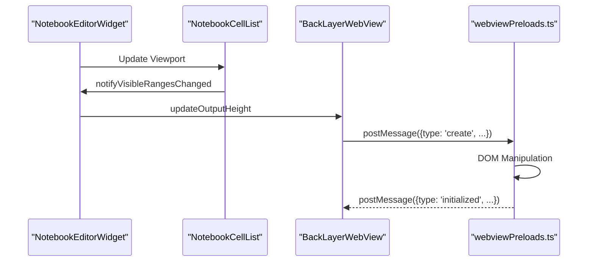
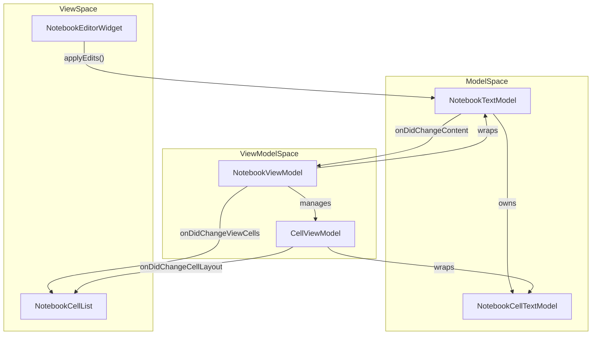

# Notebook Editor Architecture

<details>
<summary>Relevant source files</summary>

The following files were used as context for generating this wiki page:

- [src/vs/workbench/api/browser/mainThreadNotebook.ts](https://github.com/microsoft/vscode/blob/HEAD/src/vs/workbench/api/browser/mainThreadNotebook.ts)
- [src/vs/workbench/api/common/extHostNotebook.ts](https://github.com/microsoft/vscode/blob/HEAD/src/vs/workbench/api/common/extHostNotebook.ts)
- [src/vs/workbench/contrib/notebook/browser/contrib/cellStatusBar/contributedStatusBarItemController.ts](https://github.com/microsoft/vscode/blob/HEAD/src/vs/workbench/contrib/notebook/browser/contrib/cellStatusBar/contributedStatusBarItemController.ts)
- [src/vs/workbench/contrib/notebook/browser/contrib/cellStatusBar/notebookVisibleCellObserver.ts](https://github.com/microsoft/vscode/blob/HEAD/src/vs/workbench/contrib/notebook/browser/contrib/cellStatusBar/notebookVisibleCellObserver.ts)
- [src/vs/workbench/contrib/notebook/browser/contrib/execute/executionEditorProgress.ts](https://github.com/microsoft/vscode/blob/HEAD/src/vs/workbench/contrib/notebook/browser/contrib/execute/executionEditorProgress.ts)
- [src/vs/workbench/contrib/notebook/browser/contrib/gettingStarted/notebookGettingStarted.ts](https://github.com/microsoft/vscode/blob/HEAD/src/vs/workbench/contrib/notebook/browser/contrib/gettingStarted/notebookGettingStarted.ts)
- [src/vs/workbench/contrib/notebook/browser/contrib/layout/layoutActions.ts](https://github.com/microsoft/vscode/blob/HEAD/src/vs/workbench/contrib/notebook/browser/contrib/layout/layoutActions.ts)
- [src/vs/workbench/contrib/notebook/browser/contrib/profile/notebookProfile.ts](https://github.com/microsoft/vscode/blob/HEAD/src/vs/workbench/contrib/notebook/browser/contrib/profile/notebookProfile.ts)
- [src/vs/workbench/contrib/notebook/browser/contrib/troubleshoot/layout.ts](https://github.com/microsoft/vscode/blob/HEAD/src/vs/workbench/contrib/notebook/browser/contrib/troubleshoot/layout.ts)
- [src/vs/workbench/contrib/notebook/browser/controller/layoutActions.ts](https://github.com/microsoft/vscode/blob/HEAD/src/vs/workbench/contrib/notebook/browser/controller/layoutActions.ts)
- [src/vs/workbench/contrib/notebook/browser/media/notebook.css](https://github.com/microsoft/vscode/blob/HEAD/src/vs/workbench/contrib/notebook/browser/media/notebook.css)
- [src/vs/workbench/contrib/notebook/browser/notebook.contribution.ts](https://github.com/microsoft/vscode/blob/HEAD/src/vs/workbench/contrib/notebook/browser/notebook.contribution.ts)
- [src/vs/workbench/contrib/notebook/browser/notebookBrowser.ts](https://github.com/microsoft/vscode/blob/HEAD/src/vs/workbench/contrib/notebook/browser/notebookBrowser.ts)
- [src/vs/workbench/contrib/notebook/browser/notebookEditor.ts](https://github.com/microsoft/vscode/blob/HEAD/src/vs/workbench/contrib/notebook/browser/notebookEditor.ts)
- [src/vs/workbench/contrib/notebook/browser/notebookEditorWidget.ts](https://github.com/microsoft/vscode/blob/HEAD/src/vs/workbench/contrib/notebook/browser/notebookEditorWidget.ts)
- [src/vs/workbench/contrib/notebook/browser/notebookExtensionPoint.ts](https://github.com/microsoft/vscode/blob/HEAD/src/vs/workbench/contrib/notebook/browser/notebookExtensionPoint.ts)
- [src/vs/workbench/contrib/notebook/browser/view/cellPart.ts](https://github.com/microsoft/vscode/blob/HEAD/src/vs/workbench/contrib/notebook/browser/view/cellPart.ts)
- [src/vs/workbench/contrib/notebook/browser/view/cellParts/cellDecorations.ts](https://github.com/microsoft/vscode/blob/HEAD/src/vs/workbench/contrib/notebook/browser/view/cellParts/cellDecorations.ts)
- [src/vs/workbench/contrib/notebook/browser/view/cellParts/cellDnd.ts](https://github.com/microsoft/vscode/blob/HEAD/src/vs/workbench/contrib/notebook/browser/view/cellParts/cellDnd.ts)
- [src/vs/workbench/contrib/notebook/browser/view/cellParts/cellEditorOptions.ts](https://github.com/microsoft/vscode/blob/HEAD/src/vs/workbench/contrib/notebook/browser/view/cellParts/cellEditorOptions.ts)
- [src/vs/workbench/contrib/notebook/browser/view/cellParts/cellExecution.ts](https://github.com/microsoft/vscode/blob/HEAD/src/vs/workbench/contrib/notebook/browser/view/cellParts/cellExecution.ts)
- [src/vs/workbench/contrib/notebook/browser/view/cellParts/cellFocusIndicator.ts](https://github.com/microsoft/vscode/blob/HEAD/src/vs/workbench/contrib/notebook/browser/view/cellParts/cellFocusIndicator.ts)
- [src/vs/workbench/contrib/notebook/browser/view/cellParts/cellOutput.ts](https://github.com/microsoft/vscode/blob/HEAD/src/vs/workbench/contrib/notebook/browser/view/cellParts/cellOutput.ts)
- [src/vs/workbench/contrib/notebook/browser/view/cellParts/cellProgressBar.ts](https://github.com/microsoft/vscode/blob/HEAD/src/vs/workbench/contrib/notebook/browser/view/cellParts/cellProgressBar.ts)
- [src/vs/workbench/contrib/notebook/browser/view/cellParts/cellStatusPart.ts](https://github.com/microsoft/vscode/blob/HEAD/src/vs/workbench/contrib/notebook/browser/view/cellParts/cellStatusPart.ts)
- [src/vs/workbench/contrib/notebook/browser/view/cellParts/cellToolbarStickyScroll.ts](https://github.com/microsoft/vscode/blob/HEAD/src/vs/workbench/contrib/notebook/browser/view/cellParts/cellToolbarStickyScroll.ts)
- [src/vs/workbench/contrib/notebook/browser/view/cellParts/cellToolbars.ts](https://github.com/microsoft/vscode/blob/HEAD/src/vs/workbench/contrib/notebook/browser/view/cellParts/cellToolbars.ts)
- [src/vs/workbench/contrib/notebook/browser/view/cellParts/cellWidgets.ts](https://github.com/microsoft/vscode/blob/HEAD/src/vs/workbench/contrib/notebook/browser/view/cellParts/cellWidgets.ts)
- [src/vs/workbench/contrib/notebook/browser/view/cellParts/codeCell.ts](https://github.com/microsoft/vscode/blob/HEAD/src/vs/workbench/contrib/notebook/browser/view/cellParts/codeCell.ts)
- [src/vs/workbench/contrib/notebook/browser/view/cellParts/codeCellRunToolbar.ts](https://github.com/microsoft/vscode/blob/HEAD/src/vs/workbench/contrib/notebook/browser/view/cellParts/codeCellRunToolbar.ts)
- [src/vs/workbench/contrib/notebook/browser/view/cellParts/markupCell.ts](https://github.com/microsoft/vscode/blob/HEAD/src/vs/workbench/contrib/notebook/browser/view/cellParts/markupCell.ts)
- [src/vs/workbench/contrib/notebook/browser/view/notebookCellList.ts](https://github.com/microsoft/vscode/blob/HEAD/src/vs/workbench/contrib/notebook/browser/view/notebookCellList.ts)
- [src/vs/workbench/contrib/notebook/browser/view/notebookRenderingCommon.ts](https://github.com/microsoft/vscode/blob/HEAD/src/vs/workbench/contrib/notebook/browser/view/notebookRenderingCommon.ts)
- [src/vs/workbench/contrib/notebook/browser/view/renderers/backLayerWebView.ts](https://github.com/microsoft/vscode/blob/HEAD/src/vs/workbench/contrib/notebook/browser/view/renderers/backLayerWebView.ts)
- [src/vs/workbench/contrib/notebook/browser/view/renderers/cellRenderer.ts](https://github.com/microsoft/vscode/blob/HEAD/src/vs/workbench/contrib/notebook/browser/view/renderers/cellRenderer.ts)
- [src/vs/workbench/contrib/notebook/browser/view/renderers/webviewMessages.ts](https://github.com/microsoft/vscode/blob/HEAD/src/vs/workbench/contrib/notebook/browser/view/renderers/webviewMessages.ts)
- [src/vs/workbench/contrib/notebook/browser/view/renderers/webviewPreloads.ts](https://github.com/microsoft/vscode/blob/HEAD/src/vs/workbench/contrib/notebook/browser/view/renderers/webviewPreloads.ts)
- [src/vs/workbench/contrib/notebook/browser/viewModel/baseCellViewModel.ts](https://github.com/microsoft/vscode/blob/HEAD/src/vs/workbench/contrib/notebook/browser/viewModel/baseCellViewModel.ts)
- [src/vs/workbench/contrib/notebook/browser/viewModel/codeCellViewModel.ts](https://github.com/microsoft/vscode/blob/HEAD/src/vs/workbench/contrib/notebook/browser/viewModel/codeCellViewModel.ts)
- [src/vs/workbench/contrib/notebook/browser/viewModel/markupCellViewModel.ts](https://github.com/microsoft/vscode/blob/HEAD/src/vs/workbench/contrib/notebook/browser/viewModel/markupCellViewModel.ts)
- [src/vs/workbench/contrib/notebook/browser/viewParts/notebookEditorToolbar.ts](https://github.com/microsoft/vscode/blob/HEAD/src/vs/workbench/contrib/notebook/browser/viewParts/notebookEditorToolbar.ts)
- [src/vs/workbench/contrib/notebook/common/model/notebookCellTextModel.ts](https://github.com/microsoft/vscode/blob/HEAD/src/vs/workbench/contrib/notebook/common/model/notebookCellTextModel.ts)
- [src/vs/workbench/contrib/notebook/common/model/notebookTextModel.ts](https://github.com/microsoft/vscode/blob/HEAD/src/vs/workbench/contrib/notebook/common/model/notebookTextModel.ts)
- [src/vs/workbench/contrib/notebook/common/notebookCommon.ts](https://github.com/microsoft/vscode/blob/HEAD/src/vs/workbench/contrib/notebook/common/notebookCommon.ts)
- [src/vs/workbench/contrib/notebook/common/notebookEditorModel.ts](https://github.com/microsoft/vscode/blob/HEAD/src/vs/workbench/contrib/notebook/common/notebookEditorModel.ts)
- [src/vs/workbench/contrib/notebook/common/notebookOutputRenderer.ts](https://github.com/microsoft/vscode/blob/HEAD/src/vs/workbench/contrib/notebook/common/notebookOutputRenderer.ts)
- [src/vs/workbench/contrib/notebook/common/notebookService.ts](https://github.com/microsoft/vscode/blob/HEAD/src/vs/workbench/contrib/notebook/common/notebookService.ts)
- [src/vs/workbench/contrib/notebook/test/browser/notebookWorkbenchToolbar.test.ts](https://github.com/microsoft/vscode/blob/HEAD/src/vs/workbench/contrib/notebook/test/browser/notebookWorkbenchToolbar.test.ts)
- [src/vs/workbench/contrib/notebook/test/browser/view/cellPart.test.ts](https://github.com/microsoft/vscode/blob/HEAD/src/vs/workbench/contrib/notebook/test/browser/view/cellPart.test.ts)

</details>


The Notebook Editor is a high-performance UI component designed to handle large documents containing mixed content types (code and rich markdown) and interactive outputs. It utilizes a Model-View-ViewModel (MVVM) architecture to synchronize state between the underlying data models and the virtualized rendering layer.

## Core Architectural Layers

The architecture is divided into three primary layers, ensuring a separation between data persistence, UI state management, and the rendering pipeline.

### 1. Data Models (Common Layer)
*   **`NotebookTextModel`**: The primary document model representing the notebook. It manages the list of cells, document-level metadata, and the undo/redo stack for notebook-level operations [src/vs/workbench/contrib/notebook/common/model/notebookTextModel.ts:81-81](https://github.com/microsoft/vscode/blob/HEAD/src/vs/workbench/contrib/notebook/common/model/notebookTextModel.ts#L81). It uses a `NotebookOperationManager` to coordinate stack operations and undo/redo logic [src/vs/workbench/contrib/notebook/common/model/notebookTextModel.ts:124-133](https://github.com/microsoft/vscode/blob/HEAD/src/vs/workbench/contrib/notebook/common/model/notebookTextModel.ts#L124-L133).
*   **`NotebookCellTextModel`**: Represents an individual cell. It contains the cell's source code (as an `ITextModel`), its kind (`Code` or `Markup`), and its collection of outputs [src/vs/workbench/contrib/notebook/common/model/notebookCellTextModel.ts:23-23](https://github.com/microsoft/vscode/blob/HEAD/src/vs/workbench/contrib/notebook/common/model/notebookCellTextModel.ts#L23).

### 2. ViewModels (Browser Layer)
*   **`NotebookViewModel`**: A view-centric wrapper around the `NotebookTextModel`. It handles UI-specific state such as hidden ranges (folding), selection, and layout metadata [src/vs/workbench/contrib/notebook/browser/viewModel/notebookViewModelImpl.ts:75-75](https://github.com/microsoft/vscode/blob/HEAD/src/vs/workbench/contrib/notebook/browser/viewModel/notebookViewModelImpl.ts#L75).
*   **`CellViewModel`** (`CodeCellViewModel` / `MarkupCellViewModel`): Manages the UI state of a cell, including its height, focus state, and editor options [src/vs/workbench/contrib/notebook/browser/viewModel/codeCellViewModel.ts:72-72](https://github.com/microsoft/vscode/blob/HEAD/src/vs/workbench/contrib/notebook/browser/viewModel/codeCellViewModel.ts#L72), [src/vs/workbench/contrib/notebook/browser/viewModel/markupCellViewModel.ts:74-74](https://github.com/microsoft/vscode/blob/HEAD/src/vs/workbench/contrib/notebook/browser/viewModel/markupCellViewModel.ts#L74).

### 3. View Components (Browser Layer)
*   **`NotebookEditorWidget`**: The main entry point for the notebook UI. It coordinates the `NotebookCellList`, the `BackLayerWebView`, and the toolbar [src/vs/workbench/contrib/notebook/browser/notebookEditorWidget.ts:168-168](https://github.com/microsoft/vscode/blob/HEAD/src/vs/workbench/contrib/notebook/browser/notebookEditorWidget.ts#L168). It acts as a delegate for the webview to handle cell focus and height updates [src/vs/workbench/contrib/notebook/browser/view/renderers/backLayerWebView.ts:82-97](https://github.com/microsoft/vscode/blob/HEAD/src/vs/workbench/contrib/notebook/browser/view/renderers/backLayerWebView.ts#L82-L97).
*   **`NotebookCellList`**: A specialized virtualized list that renders cells. It handles the unique layout requirements of notebooks, such as variable cell heights and output padding [src/vs/workbench/contrib/notebook/browser/view/notebookCellList.ts:80-80](https://github.com/microsoft/vscode/blob/HEAD/src/vs/workbench/contrib/notebook/browser/view/notebookCellList.ts#L80).

### Entity Relationship Diagram

```mermaid
classDiagram
    class "NotebookEditorWidget" as NEW {
        +NotebookViewModel viewModel
        +NotebookCellList cellList
        +BackLayerWebView webview
    }
    class "NotebookViewModel" as NVM {
        +NotebookTextModel notebookTextModel
        +CellViewModel[] viewCells
        +NotebookEventDispatcher eventDispatcher
    }
    class "NotebookTextModel" as NTM {
        +NotebookCellTextModel[] cells
        +NotebookDocumentMetadata metadata
        +NotebookOperationManager operationManager
    }
    class "NotebookCellTextModel" as NCTM {
        +TextModel textModel
        +ICellOutput[] outputs
    }
    class "CellViewModel" as CVM {
        +NotebookCellTextModel model
        +number layoutHeight
    }

    NEW *-- NVM
    NEW *-- "NotebookCellList"
    NVM o-- NTM
    NTM *-- NCTM
    NVM *-- CVM
    CVM o-- NCTM
```
**Sources:** [src/vs/workbench/contrib/notebook/browser/notebookEditorWidget.ts:168-180](https://github.com/microsoft/vscode/blob/HEAD/src/vs/workbench/contrib/notebook/browser/notebookEditorWidget.ts#L168-L180), [src/vs/workbench/contrib/notebook/browser/viewModel/notebookViewModelImpl.ts:75-76](https://github.com/microsoft/vscode/blob/HEAD/src/vs/workbench/contrib/notebook/browser/viewModel/notebookViewModelImpl.ts#L75-L76), [src/vs/workbench/contrib/notebook/common/model/notebookTextModel.ts:81-81](https://github.com/microsoft/vscode/blob/HEAD/src/vs/workbench/contrib/notebook/common/model/notebookTextModel.ts#L81), [src/vs/workbench/contrib/notebook/common/model/notebookTextModel.ts:124-124](https://github.com/microsoft/vscode/blob/HEAD/src/vs/workbench/contrib/notebook/common/model/notebookTextModel.ts#L124).

---

## NotebookCellList Virtualization

The `NotebookCellList` handles the rendering of notebook cells using a virtualization strategy to maintain performance with thousands of cells.

*   **Virtualized Rendering**: Only cells within or near the viewport are instantiated in the DOM. The list uses `NotebookCellListDelegate` to calculate cell heights dynamically [src/vs/workbench/contrib/notebook/browser/view/renderers/cellRenderer.ts:57-68](https://github.com/microsoft/vscode/blob/HEAD/src/vs/workbench/contrib/notebook/browser/view/renderers/cellRenderer.ts#L57-L68).
*   **Dynamic Height**: Unlike standard lists, notebook cell heights change frequently (e.g., when an output is generated or a code block wraps). The list calculates height based on `getDynamicHeight` from the view model [src/vs/workbench/contrib/notebook/browser/view/renderers/cellRenderer.ts:74-76](https://github.com/microsoft/vscode/blob/HEAD/src/vs/workbench/contrib/notebook/browser/view/renderers/cellRenderer.ts#L74-L76).
*   **Cell Renderers**: The `CodeCellRenderer` and `MarkupCellRenderer` handle the instantiation of the Monaco editor for code cells and the rendering of markdown for markup cells [src/vs/workbench/contrib/notebook/browser/view/renderers/cellRenderer.ts:112-130](https://github.com/microsoft/vscode/blob/HEAD/src/vs/workbench/contrib/notebook/browser/view/renderers/cellRenderer.ts#L112-L130).
*   **Webview Boundary**: To prevent performance degradation in the browser's rendering engine, the list manages a "webview boundary" (`NOTEBOOK_WEBVIEW_BOUNDARY`) to ensure the backlayer webview remains within a performant coordinate space [src/vs/workbench/contrib/notebook/browser/view/notebookCellList.ts:73-73](https://github.com/microsoft/vscode/blob/HEAD/src/vs/workbench/contrib/notebook/browser/view/notebookCellList.ts#L73).

**Sources:** [src/vs/workbench/contrib/notebook/browser/view/notebookCellList.ts:80-81](https://github.com/microsoft/vscode/blob/HEAD/src/vs/workbench/contrib/notebook/browser/view/notebookCellList.ts#L80-L81), [src/vs/workbench/contrib/notebook/browser/view/renderers/cellRenderer.ts:57-85](https://github.com/microsoft/vscode/blob/HEAD/src/vs/workbench/contrib/notebook/browser/view/renderers/cellRenderer.ts#L57-L85).

---

## Output Rendering and BackLayerWebView

Notebook outputs are rendered inside a shared `BackLayerWebView` that manages an iframe-based environment for rich content.

### Rendering Workflow
1.  **Output Placement**: The editor calculates output offsets and requests the webview to render them via `updateOutputHeight` [src/vs/workbench/contrib/notebook/browser/view/renderers/backLayerWebView.ts:89-90](https://github.com/microsoft/vscode/blob/HEAD/src/vs/workbench/contrib/notebook/browser/view/renderers/backLayerWebView.ts#L89-L90).
2.  **Webview Synchronization**: The `BackLayerWebView` sends `ToWebviewMessage` payloads to the webview to create or update outputs [src/vs/workbench/contrib/notebook/browser/view/renderers/backLayerWebView.ts:59-59](https://github.com/microsoft/vscode/blob/HEAD/src/vs/workbench/contrib/notebook/browser/view/renderers/backLayerWebView.ts#L59).
3.  **Output Types**: Outputs are rendered using built-in HTML renderers (`RenderOutputType.Html`) or extension-contributed renderers (`RenderOutputType.Extension`) [src/vs/workbench/contrib/notebook/browser/notebookBrowser.ts:83-101](https://github.com/microsoft/vscode/blob/HEAD/src/vs/workbench/contrib/notebook/browser/notebookBrowser.ts#L83-L101).

### webviewPreloads.ts
This file contains the script injected into the webview environment. It handles:
*   **Messaging**: Facilitates `postMessage` communication between the webview and the main workbench via `acquireVsCodeApi` [src/vs/workbench/contrib/notebook/browser/view/renderers/webviewPreloads.ts:120-122](https://github.com/microsoft/vscode/blob/HEAD/src/vs/workbench/contrib/notebook/browser/view/renderers/webviewPreloads.ts#L120-L122).
*   **Output Lifecycle**: Managing the creation and destruction of output DOM elements inside the webview [src/vs/workbench/contrib/notebook/browser/view/renderers/webviewPreloads.ts:164-180](https://github.com/microsoft/vscode/blob/HEAD/src/vs/workbench/contrib/notebook/browser/view/renderers/webviewPreloads.ts#L164-L180).
*   **Dynamic Theming**: Applying VS Code theme variables to the webview content via `tokenizationStyle` [src/vs/workbench/contrib/notebook/browser/view/renderers/webviewPreloads.ts:124-125](https://github.com/microsoft/vscode/blob/HEAD/src/vs/workbench/contrib/notebook/browser/view/renderers/webviewPreloads.ts#L124-L125).


**Sources:** [src/vs/workbench/contrib/notebook/browser/view/renderers/backLayerWebView.ts:82-97](https://github.com/microsoft/vscode/blob/HEAD/src/vs/workbench/contrib/notebook/browser/view/renderers/backLayerWebView.ts#L82-L97), [src/vs/workbench/contrib/notebook/browser/view/renderers/webviewPreloads.ts:92-125](https://github.com/microsoft/vscode/blob/HEAD/src/vs/workbench/contrib/notebook/browser/view/renderers/webviewPreloads.ts#L92-L125), [src/vs/workbench/contrib/notebook/browser/notebookBrowser.ts:83-101](https://github.com/microsoft/vscode/blob/HEAD/src/vs/workbench/contrib/notebook/browser/notebookBrowser.ts#L83-L101).

---

## MVVM Synchronization Loop

The synchronization loop ensures that edits in the UI are reflected in the model and that external model changes (e.g., from a kernel execution) update the UI.

| Direction | Mechanism | Key Classes |
| :--- | :--- | :--- |
| **View → Model** | UI events trigger `applyEdits` on the `NotebookTextModel`. | `NotebookEditorWidget`, `NotebookTextModel` |
| **Model → ViewModel** | `NotebookTextModel` fires `onDidChangeContent`. `NotebookViewModel` updates its internal state. | `NotebookTextModel`, `NotebookViewModel` |
| **ViewModel → View** | `NotebookCellList` responds to view cell changes and layout updates. | `NotebookViewModel`, `NotebookCellList` |

### Synchronization Flow

1.  **Edits**: When a user types in a cell, the underlying Monaco `TextModel` is updated.
2.  **Model Changes**: Operations like "Delete Cell" or "Move Cell" call `applyEdits` which generates raw events and manages notebook content [src/vs/workbench/contrib/notebook/common/model/notebookTextModel.ts:26-26](https://github.com/microsoft/vscode/blob/HEAD/src/vs/workbench/contrib/notebook/common/model/notebookTextModel.ts#L26).
3.  **Layout**: When a cell's content or output changes, the `CellViewModel` recalculates its height, triggering a list re-layout via the `NotebookEventDispatcher` [src/vs/workbench/contrib/notebook/browser/notebookEditorWidget.ts:73-73](https://github.com/microsoft/vscode/blob/HEAD/src/vs/workbench/contrib/notebook/browser/notebookEditorWidget.ts#L73).



**Sources:** [src/vs/workbench/contrib/notebook/common/model/notebookTextModel.ts:124-150](https://github.com/microsoft/vscode/blob/HEAD/src/vs/workbench/contrib/notebook/common/model/notebookTextModel.ts#L124-L150), [src/vs/workbench/contrib/notebook/browser/notebookEditorWidget.ts:72-76](https://github.com/microsoft/vscode/blob/HEAD/src/vs/workbench/contrib/notebook/browser/notebookEditorWidget.ts#L72-L76).

## Context Keys and Integration

The Notebook Editor integrates with the workbench via specialized context keys defined in `NotebookEditorContextKeys` [src/vs/workbench/contrib/notebook/browser/viewParts/notebookEditorWidgetContextKeys.ts:78-78](https://github.com/microsoft/vscode/blob/HEAD/src/vs/workbench/contrib/notebook/browser/viewParts/notebookEditorWidgetContextKeys.ts#L78).

Key context keys include:
*   `NOTEBOOK_EDITOR_FOCUSED`: True when the notebook widget has focus [src/vs/workbench/contrib/notebook/common/notebookContextKeys.ts:83-83](https://github.com/microsoft/vscode/blob/HEAD/src/vs/workbench/contrib/notebook/common/notebookContextKeys.ts#L83).
*   `NOTEBOOK_OUTPUT_FOCUSED`: True when focus is inside a cell output [src/vs/workbench/contrib/notebook/common/notebookContextKeys.ts:83-83](https://github.com/microsoft/vscode/blob/HEAD/src/vs/workbench/contrib/notebook/common/notebookContextKeys.ts#L83).
*   `NOTEBOOK_EDITOR_EDITABLE`: Reflects whether the notebook can be edited [src/vs/workbench/contrib/notebook/common/notebookContextKeys.ts:83-83](https://github.com/microsoft/vscode/blob/HEAD/src/vs/workbench/contrib/notebook/common/notebookContextKeys.ts#L83).

**Sources:** [src/vs/workbench/contrib/notebook/browser/viewParts/notebookEditorWidgetContextKeys.ts:78-78](https://github.com/microsoft/vscode/blob/HEAD/src/vs/workbench/contrib/notebook/browser/viewParts/notebookEditorWidgetContextKeys.ts#L78), [src/vs/workbench/contrib/notebook/common/notebookContextKeys.ts:83-83](https://github.com/microsoft/vscode/blob/HEAD/src/vs/workbench/contrib/notebook/common/notebookContextKeys.ts#L83).3e:T53