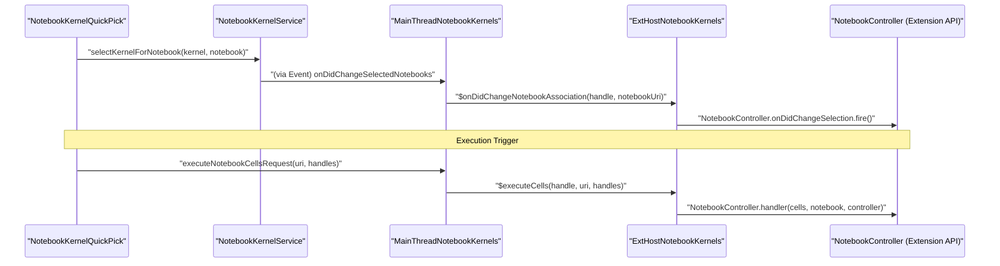
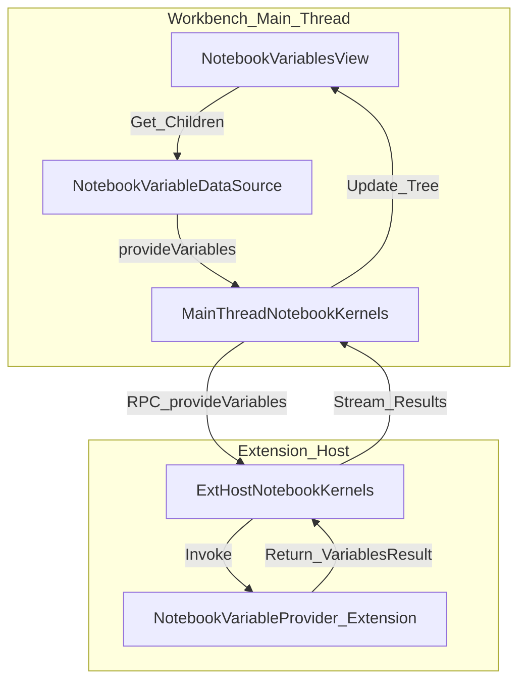

# Notebook Kernels and Extension API

Relevant source files

The following files were used as context for generating this wiki page:

- [extensions/vscode-api-tests/package.json](https://github.com/microsoft/vscode/blob/HEAD/extensions/vscode-api-tests/package.json)
- [extensions/vscode-api-tests/src/singlefolder-tests/chat.test.ts](https://github.com/microsoft/vscode/blob/HEAD/extensions/vscode-api-tests/src/singlefolder-tests/chat.test.ts)
- [extensions/vscode-colorize-tests/src/colorizer.test.ts](https://github.com/microsoft/vscode/blob/HEAD/extensions/vscode-colorize-tests/src/colorizer.test.ts)
- [src/vs/base/common/arrays.ts](https://github.com/microsoft/vscode/blob/HEAD/src/vs/base/common/arrays.ts)
- [src/vs/base/test/common/arrays.test.ts](https://github.com/microsoft/vscode/blob/HEAD/src/vs/base/test/common/arrays.test.ts)
- [src/vs/editor/common/config/editorConfigurationSchema.ts](https://github.com/microsoft/vscode/blob/HEAD/src/vs/editor/common/config/editorConfigurationSchema.ts)
- [src/vs/editor/common/config/editorOptions.ts](https://github.com/microsoft/vscode/blob/HEAD/src/vs/editor/common/config/editorOptions.ts)
- [src/vs/editor/common/languages.ts](https://github.com/microsoft/vscode/blob/HEAD/src/vs/editor/common/languages.ts)
- [src/vs/editor/common/model.ts](https://github.com/microsoft/vscode/blob/HEAD/src/vs/editor/common/model.ts)
- [src/vs/editor/common/model/textModel.ts](https://github.com/microsoft/vscode/blob/HEAD/src/vs/editor/common/model/textModel.ts)
- [src/vs/editor/common/standalone/standaloneEnums.ts](https://github.com/microsoft/vscode/blob/HEAD/src/vs/editor/common/standalone/standaloneEnums.ts)
- [src/vs/editor/common/viewModel/viewModelImpl.ts](https://github.com/microsoft/vscode/blob/HEAD/src/vs/editor/common/viewModel/viewModelImpl.ts)
- [src/vs/editor/contrib/inlineCompletions/browser/controller/commandIds.ts](https://github.com/microsoft/vscode/blob/HEAD/src/vs/editor/contrib/inlineCompletions/browser/controller/commandIds.ts)
- [src/vs/editor/contrib/inlineCompletions/browser/controller/commands.ts](https://github.com/microsoft/vscode/blob/HEAD/src/vs/editor/contrib/inlineCompletions/browser/controller/commands.ts)
- [src/vs/editor/contrib/inlineCompletions/browser/controller/inlineCompletionContextKeys.ts](https://github.com/microsoft/vscode/blob/HEAD/src/vs/editor/contrib/inlineCompletions/browser/controller/inlineCompletionContextKeys.ts)
- [src/vs/editor/contrib/inlineCompletions/browser/controller/inlineCompletionsController.ts](https://github.com/microsoft/vscode/blob/HEAD/src/vs/editor/contrib/inlineCompletions/browser/controller/inlineCompletionsController.ts)
- [src/vs/editor/contrib/inlineCompletions/browser/inlineCompletions.contribution.ts](https://github.com/microsoft/vscode/blob/HEAD/src/vs/editor/contrib/inlineCompletions/browser/inlineCompletions.contribution.ts)
- [src/vs/editor/contrib/inlineCompletions/browser/model/inlineCompletionsModel.ts](https://github.com/microsoft/vscode/blob/HEAD/src/vs/editor/contrib/inlineCompletions/browser/model/inlineCompletionsModel.ts)
- [src/vs/editor/contrib/inlineCompletions/browser/model/inlineCompletionsSource.ts](https://github.com/microsoft/vscode/blob/HEAD/src/vs/editor/contrib/inlineCompletions/browser/model/inlineCompletionsSource.ts)
- [src/vs/editor/contrib/inlineCompletions/browser/model/inlineSuggestionItem.ts](https://github.com/microsoft/vscode/blob/HEAD/src/vs/editor/contrib/inlineCompletions/browser/model/inlineSuggestionItem.ts)
- [src/vs/editor/contrib/inlineCompletions/browser/model/provideInlineCompletions.ts](https://github.com/microsoft/vscode/blob/HEAD/src/vs/editor/contrib/inlineCompletions/browser/model/provideInlineCompletions.ts)
- [src/vs/editor/contrib/inlineCompletions/browser/telemetry.ts](https://github.com/microsoft/vscode/blob/HEAD/src/vs/editor/contrib/inlineCompletions/browser/telemetry.ts)
- [src/vs/editor/contrib/inlineCompletions/browser/view/inlineEdits/inlineEditWithChanges.ts](https://github.com/microsoft/vscode/blob/HEAD/src/vs/editor/contrib/inlineCompletions/browser/view/inlineEdits/inlineEditWithChanges.ts)
- [src/vs/editor/contrib/inlineCompletions/browser/view/inlineEdits/inlineEditsModel.ts](https://github.com/microsoft/vscode/blob/HEAD/src/vs/editor/contrib/inlineCompletions/browser/view/inlineEdits/inlineEditsModel.ts)
- [src/vs/editor/contrib/inlineCompletions/browser/view/inlineEdits/inlineEditsView.ts](https://github.com/microsoft/vscode/blob/HEAD/src/vs/editor/contrib/inlineCompletions/browser/view/inlineEdits/inlineEditsView.ts)
- [src/vs/editor/contrib/inlineCompletions/browser/view/inlineEdits/inlineEditsViewInterface.ts](https://github.com/microsoft/vscode/blob/HEAD/src/vs/editor/contrib/inlineCompletions/browser/view/inlineEdits/inlineEditsViewInterface.ts)
- [src/vs/editor/contrib/inlineCompletions/browser/view/inlineEdits/inlineEditsViewProducer.ts](https://github.com/microsoft/vscode/blob/HEAD/src/vs/editor/contrib/inlineCompletions/browser/view/inlineEdits/inlineEditsViewProducer.ts)
- [src/vs/monaco.d.ts](https://github.com/microsoft/vscode/blob/HEAD/src/vs/monaco.d.ts)
- [src/vs/platform/extensions/common/extensionsApiProposals.ts](https://github.com/microsoft/vscode/blob/HEAD/src/vs/platform/extensions/common/extensionsApiProposals.ts)
- [src/vs/platform/userDataSync/common/userDataSyncLog.ts](https://github.com/microsoft/vscode/blob/HEAD/src/vs/platform/userDataSync/common/userDataSyncLog.ts)
- [src/vs/workbench/api/browser/mainThreadChatAgents2.ts](https://github.com/microsoft/vscode/blob/HEAD/src/vs/workbench/api/browser/mainThreadChatAgents2.ts)
- [src/vs/workbench/api/browser/mainThreadLanguageFeatures.ts](https://github.com/microsoft/vscode/blob/HEAD/src/vs/workbench/api/browser/mainThreadLanguageFeatures.ts)
- [src/vs/workbench/api/browser/mainThreadNotebookDocuments.ts](https://github.com/microsoft/vscode/blob/HEAD/src/vs/workbench/api/browser/mainThreadNotebookDocuments.ts)
- [src/vs/workbench/api/browser/mainThreadNotebookDocumentsAndEditors.ts](https://github.com/microsoft/vscode/blob/HEAD/src/vs/workbench/api/browser/mainThreadNotebookDocumentsAndEditors.ts)
- [src/vs/workbench/api/browser/mainThreadNotebookDto.ts](https://github.com/microsoft/vscode/blob/HEAD/src/vs/workbench/api/browser/mainThreadNotebookDto.ts)
- [src/vs/workbench/api/browser/mainThreadNotebookEditors.ts](https://github.com/microsoft/vscode/blob/HEAD/src/vs/workbench/api/browser/mainThreadNotebookEditors.ts)
- [src/vs/workbench/api/browser/mainThreadNotebookKernels.ts](https://github.com/microsoft/vscode/blob/HEAD/src/vs/workbench/api/browser/mainThreadNotebookKernels.ts)
- [src/vs/workbench/api/common/extHost.api.impl.ts](https://github.com/microsoft/vscode/blob/HEAD/src/vs/workbench/api/common/extHost.api.impl.ts)
- [src/vs/workbench/api/common/extHost.protocol.ts](https://github.com/microsoft/vscode/blob/HEAD/src/vs/workbench/api/common/extHost.protocol.ts)
- [src/vs/workbench/api/common/extHostChatAgents2.ts](https://github.com/microsoft/vscode/blob/HEAD/src/vs/workbench/api/common/extHostChatAgents2.ts)
- [src/vs/workbench/api/common/extHostLanguageFeatures.ts](https://github.com/microsoft/vscode/blob/HEAD/src/vs/workbench/api/common/extHostLanguageFeatures.ts)
- [src/vs/workbench/api/common/extHostNotebookKernels.ts](https://github.com/microsoft/vscode/blob/HEAD/src/vs/workbench/api/common/extHostNotebookKernels.ts)
- [src/vs/workbench/api/common/extHostTypeConverters.ts](https://github.com/microsoft/vscode/blob/HEAD/src/vs/workbench/api/common/extHostTypeConverters.ts)
- [src/vs/workbench/api/common/extHostTypes.ts](https://github.com/microsoft/vscode/blob/HEAD/src/vs/workbench/api/common/extHostTypes.ts)
- [src/vs/workbench/contrib/editSessions/common/editSessionsLogService.ts](https://github.com/microsoft/vscode/blob/HEAD/src/vs/workbench/contrib/editSessions/common/editSessionsLogService.ts)
- [src/vs/workbench/contrib/notebook/browser/contrib/editorStatusBar/editorStatusBar.ts](https://github.com/microsoft/vscode/blob/HEAD/src/vs/workbench/contrib/notebook/browser/contrib/editorStatusBar/editorStatusBar.ts)
- [src/vs/workbench/contrib/notebook/browser/contrib/kernelDetection/notebookKernelDetection.ts](https://github.com/microsoft/vscode/blob/HEAD/src/vs/workbench/contrib/notebook/browser/contrib/kernelDetection/notebookKernelDetection.ts)
- [src/vs/workbench/contrib/notebook/browser/contrib/notebookVariables/notebookVariableCommands.ts](https://github.com/microsoft/vscode/blob/HEAD/src/vs/workbench/contrib/notebook/browser/contrib/notebookVariables/notebookVariableCommands.ts)
- [src/vs/workbench/contrib/notebook/browser/contrib/notebookVariables/notebookVariableContextKeys.ts](https://github.com/microsoft/vscode/blob/HEAD/src/vs/workbench/contrib/notebook/browser/contrib/notebookVariables/notebookVariableContextKeys.ts)
- [src/vs/workbench/contrib/notebook/browser/contrib/notebookVariables/notebookVariables.ts](https://github.com/microsoft/vscode/blob/HEAD/src/vs/workbench/contrib/notebook/browser/contrib/notebookVariables/notebookVariables.ts)
- [src/vs/workbench/contrib/notebook/browser/contrib/notebookVariables/notebookVariablesDataSource.ts](https://github.com/microsoft/vscode/blob/HEAD/src/vs/workbench/contrib/notebook/browser/contrib/notebookVariables/notebookVariablesDataSource.ts)
- [src/vs/workbench/contrib/notebook/browser/contrib/notebookVariables/notebookVariablesTree.ts](https://github.com/microsoft/vscode/blob/HEAD/src/vs/workbench/contrib/notebook/browser/contrib/notebookVariables/notebookVariablesTree.ts)
- [src/vs/workbench/contrib/notebook/browser/contrib/notebookVariables/notebookVariablesView.ts](https://github.com/microsoft/vscode/blob/HEAD/src/vs/workbench/contrib/notebook/browser/contrib/notebookVariables/notebookVariablesView.ts)
- [src/vs/workbench/contrib/notebook/browser/controller/variablesActions.ts](https://github.com/microsoft/vscode/blob/HEAD/src/vs/workbench/contrib/notebook/browser/controller/variablesActions.ts)
- [src/vs/workbench/contrib/notebook/browser/services/notebookExecutionServiceImpl.ts](https://github.com/microsoft/vscode/blob/HEAD/src/vs/workbench/contrib/notebook/browser/services/notebookExecutionServiceImpl.ts)
- [src/vs/workbench/contrib/notebook/browser/services/notebookKernelHistoryServiceImpl.ts](https://github.com/microsoft/vscode/blob/HEAD/src/vs/workbench/contrib/notebook/browser/services/notebookKernelHistoryServiceImpl.ts)
- [src/vs/workbench/contrib/notebook/browser/services/notebookKernelServiceImpl.ts](https://github.com/microsoft/vscode/blob/HEAD/src/vs/workbench/contrib/notebook/browser/services/notebookKernelServiceImpl.ts)
- [src/vs/workbench/contrib/notebook/browser/services/notebookLoggingServiceImpl.ts](https://github.com/microsoft/vscode/blob/HEAD/src/vs/workbench/contrib/notebook/browser/services/notebookLoggingServiceImpl.ts)
- [src/vs/workbench/contrib/notebook/browser/viewParts/notebookKernelQuickPickStrategy.ts](https://github.com/microsoft/vscode/blob/HEAD/src/vs/workbench/contrib/notebook/browser/viewParts/notebookKernelQuickPickStrategy.ts)
- [src/vs/workbench/contrib/notebook/browser/viewParts/notebookKernelView.ts](https://github.com/microsoft/vscode/blob/HEAD/src/vs/workbench/contrib/notebook/browser/viewParts/notebookKernelView.ts)
- [src/vs/workbench/contrib/notebook/common/notebookEditorModelResolverService.ts](https://github.com/microsoft/vscode/blob/HEAD/src/vs/workbench/contrib/notebook/common/notebookEditorModelResolverService.ts)
- [src/vs/workbench/contrib/notebook/common/notebookEditorModelResolverServiceImpl.ts](https://github.com/microsoft/vscode/blob/HEAD/src/vs/workbench/contrib/notebook/common/notebookEditorModelResolverServiceImpl.ts)
- [src/vs/workbench/contrib/notebook/common/notebookExecutionService.ts](https://github.com/microsoft/vscode/blob/HEAD/src/vs/workbench/contrib/notebook/common/notebookExecutionService.ts)
- [src/vs/workbench/contrib/notebook/common/notebookKernelService.ts](https://github.com/microsoft/vscode/blob/HEAD/src/vs/workbench/contrib/notebook/common/notebookKernelService.ts)
- [src/vs/workbench/contrib/notebook/common/notebookLoggingService.ts](https://github.com/microsoft/vscode/blob/HEAD/src/vs/workbench/contrib/notebook/common/notebookLoggingService.ts)
- [src/vs/workbench/contrib/notebook/test/browser/notebookEditorModel.test.ts](https://github.com/microsoft/vscode/blob/HEAD/src/vs/workbench/contrib/notebook/test/browser/notebookEditorModel.test.ts)
- [src/vs/workbench/contrib/notebook/test/browser/notebookExecutionService.test.ts](https://github.com/microsoft/vscode/blob/HEAD/src/vs/workbench/contrib/notebook/test/browser/notebookExecutionService.test.ts)
- [src/vs/workbench/contrib/notebook/test/browser/notebookExecutionStateService.test.ts](https://github.com/microsoft/vscode/blob/HEAD/src/vs/workbench/contrib/notebook/test/browser/notebookExecutionStateService.test.ts)
- [src/vs/workbench/contrib/notebook/test/browser/notebookKernelHistory.test.ts](https://github.com/microsoft/vscode/blob/HEAD/src/vs/workbench/contrib/notebook/test/browser/notebookKernelHistory.test.ts)
- [src/vs/workbench/contrib/notebook/test/browser/notebookKernelService.test.ts](https://github.com/microsoft/vscode/blob/HEAD/src/vs/workbench/contrib/notebook/test/browser/notebookKernelService.test.ts)
- [src/vs/workbench/contrib/notebook/test/browser/notebookServiceImpl.test.ts](https://github.com/microsoft/vscode/blob/HEAD/src/vs/workbench/contrib/notebook/test/browser/notebookServiceImpl.test.ts)
- [src/vs/workbench/contrib/notebook/test/browser/notebookVariablesDataSource.test.ts](https://github.com/microsoft/vscode/blob/HEAD/src/vs/workbench/contrib/notebook/test/browser/notebookVariablesDataSource.test.ts)
- [src/vscode-dts/vscode.d.ts](https://github.com/microsoft/vscode/blob/HEAD/src/vscode-dts/vscode.d.ts)
- [src/vscode-dts/vscode.proposed.chatParticipantAdditions.d.ts](https://github.com/microsoft/vscode/blob/HEAD/src/vscode-dts/vscode.proposed.chatParticipantAdditions.d.ts)
- [src/vscode-dts/vscode.proposed.inlineCompletionsAdditions.d.ts](https://github.com/microsoft/vscode/blob/HEAD/src/vscode-dts/vscode.proposed.inlineCompletionsAdditions.d.ts)
- [src/vscode-dts/vscode.proposed.notebookKernelSource.d.ts](https://github.com/microsoft/vscode/blob/HEAD/src/vscode-dts/vscode.proposed.notebookKernelSource.d.ts)
- [src/vscode-dts/vscode.proposed.notebookVariableProvider.d.ts](https://github.com/microsoft/vscode/blob/HEAD/src/vscode-dts/vscode.proposed.notebookVariableProvider.d.ts)

Notebook kernels are the computational engines responsible for executing code within notebook cells. The architecture separates the management of these kernels (Workbench side) from their implementation (Extension Host side), mediated by a robust RPC protocol.

## INotebookKernelService and Kernel Management

The `INotebookKernelService` is the central authority in the workbench for discovering, selecting, and managing the lifecycle of notebook kernels [src/vs/workbench/contrib/notebook/common/notebookKernelService.ts:113-113](https://github.com/microsoft/vscode/blob/HEAD/src/vs/workbench/contrib/notebook/common/notebookKernelService.ts#L113). It maintains the association between `NotebookTextModel` instances and their selected `INotebookKernel`.

### Key Responsibilities
- **Registration**: Extensions register kernels via `createNotebookController` [src/vs/workbench/api/common/extHostNotebookKernels.ts:119-119](https://github.com/microsoft/vscode/blob/HEAD/src/vs/workbench/api/common/extHostNotebookKernels.ts#L119), which are then tracked by the service. The workbench side registers these via `registerKernel` [src/vs/workbench/contrib/notebook/common/notebookKernelService.ts:121-121](https://github.com/microsoft/vscode/blob/HEAD/src/vs/workbench/contrib/notebook/common/notebookKernelService.ts#L121).
- **Matching**: Finding kernels that support a specific notebook's `viewType` and language requirements using `getMatchingKernel` [src/vs/workbench/contrib/notebook/common/notebookKernelService.ts:123-123](https://github.com/microsoft/vscode/blob/HEAD/src/vs/workbench/contrib/notebook/common/notebookKernelService.ts#L123).
- **Affinity**: Managing user preferences for specific kernels on a per-notebook basis using `updateKernelNotebookAffinity` [src/vs/workbench/contrib/notebook/common/notebookKernelService.ts:144-144](https://github.com/microsoft/vscode/blob/HEAD/src/vs/workbench/contrib/notebook/common/notebookKernelService.ts#L144).
- **Source Actions**: Managing `IKernelSourceActionProvider` instances that contribute actions to the kernel picker (e.g., "Install Python") [src/vs/workbench/contrib/notebook/common/notebookKernelService.ts:153-158](https://github.com/microsoft/vscode/blob/HEAD/src/vs/workbench/contrib/notebook/common/notebookKernelService.ts#L153-L158).

### Kernel Matching and Selection Logic
When a notebook is opened, the system determines the best kernel using `getMatchingKernel` [src/vs/workbench/contrib/notebook/common/notebookKernelService.ts:123-123](https://github.com/microsoft/vscode/blob/HEAD/src/vs/workbench/contrib/notebook/common/notebookKernelService.ts#L123). The result, encapsulated in `INotebookKernelMatchResult`, includes:
- `selected`: The kernel explicitly chosen by the user [src/vs/workbench/contrib/notebook/common/notebookKernelService.ts:24-24](https://github.com/microsoft/vscode/blob/HEAD/src/vs/workbench/contrib/notebook/common/notebookKernelService.ts#L24).
- `suggestions`: Kernels that are highly recommended for this notebook type [src/vs/workbench/contrib/notebook/common/notebookKernelService.ts:25-25](https://github.com/microsoft/vscode/blob/HEAD/src/vs/workbench/contrib/notebook/common/notebookKernelService.ts#L25).
- `all`: All compatible kernels [src/vs/workbench/contrib/notebook/common/notebookKernelService.ts:26-26](https://github.com/microsoft/vscode/blob/HEAD/src/vs/workbench/contrib/notebook/common/notebookKernelService.ts#L26).
- `hidden`: Kernels filtered out by user preference or exclusion rules [src/vs/workbench/contrib/notebook/common/notebookKernelService.ts:27-27](https://github.com/microsoft/vscode/blob/HEAD/src/vs/workbench/contrib/notebook/common/notebookKernelService.ts#L27).

Sources: [src/vs/workbench/contrib/notebook/common/notebookKernelService.ts:23-28](https://github.com/microsoft/vscode/blob/HEAD/src/vs/workbench/contrib/notebook/common/notebookKernelService.ts#L23-L28), [src/vs/workbench/contrib/notebook/browser/contrib/editorStatusBar/editorStatusBar.ts:128-130](https://github.com/microsoft/vscode/blob/HEAD/src/vs/workbench/contrib/notebook/browser/contrib/editorStatusBar/editorStatusBar.ts#L128-L130), [src/vs/workbench/contrib/notebook/common/notebookKernelService.ts:113-161](https://github.com/microsoft/vscode/blob/HEAD/src/vs/workbench/contrib/notebook/common/notebookKernelService.ts#L113-L161)

---

## Kernel Quick Pick Strategy

The Kernel Picker UI is driven by `IKernelPickerStrategy` implementations. The primary strategy is `KernelPickerStrategyBase`, which handles the complex logic of grouping kernels by source (e.g., "Jupyter", "Local") and displaying them in a `QuickPick` [src/vs/workbench/contrib/notebook/browser/viewParts/notebookKernelQuickPickStrategy.ts:100-111](https://github.com/microsoft/vscode/blob/HEAD/src/vs/workbench/contrib/notebook/browser/viewParts/notebookKernelQuickPickStrategy.ts#L100-L111).

### Picker Workflow
1. **Trigger**: User clicks the kernel status in the toolbar or status bar (invoking `SELECT_KERNEL_ID`) [src/vs/workbench/contrib/notebook/browser/contrib/editorStatusBar/editorStatusBar.ts:155-157](https://github.com/microsoft/vscode/blob/HEAD/src/vs/workbench/contrib/notebook/browser/contrib/editorStatusBar/editorStatusBar.ts#L155-L157).
2. **Collection**: The strategy fetches matching kernels from `INotebookKernelService` [src/vs/workbench/contrib/notebook/browser/viewParts/notebookKernelQuickPickStrategy.ts:116-117](https://github.com/microsoft/vscode/blob/HEAD/src/vs/workbench/contrib/notebook/browser/viewParts/notebookKernelQuickPickStrategy.ts#L116-L117).
3. **Augmentation**: It adds "Source Actions" (e.g., "Select another kernel...") and marketplace recommendations if no local kernels are found [src/vs/workbench/contrib/notebook/browser/viewParts/notebookKernelQuickPickStrategy.ts:141-143](https://github.com/microsoft/vscode/blob/HEAD/src/vs/workbench/contrib/notebook/browser/viewParts/notebookKernelQuickPickStrategy.ts#L141-L143).
4. **Selection**: Upon selection, `selectKernelForNotebook` is called to bind the model to the kernel [src/vs/workbench/contrib/notebook/browser/viewParts/notebookKernelQuickPickStrategy.ts:134-134](https://github.com/microsoft/vscode/blob/HEAD/src/vs/workbench/contrib/notebook/browser/viewParts/notebookKernelQuickPickStrategy.ts#L134).

### Kernel Selection Data Flow
The following diagram illustrates how a user selection in the UI propagates to the Extension Host.

**Kernel Selection and Execution Flow**

Sources: [src/vs/workbench/contrib/notebook/browser/viewParts/notebookKernelQuickPickStrategy.ts:113-143](https://github.com/microsoft/vscode/blob/HEAD/src/vs/workbench/contrib/notebook/browser/viewParts/notebookKernelQuickPickStrategy.ts#L113-L143), [src/vs/workbench/api/browser/mainThreadNotebookKernels.ts:130-135](https://github.com/microsoft/vscode/blob/HEAD/src/vs/workbench/api/browser/mainThreadNotebookKernels.ts#L130-L135), [src/vs/workbench/api/common/extHostNotebookKernels.ts:119-126](https://github.com/microsoft/vscode/blob/HEAD/src/vs/workbench/api/common/extHostNotebookKernels.ts#L119-L126), [src/vs/workbench/contrib/notebook/common/notebookKernelService.ts:134-134](https://github.com/microsoft/vscode/blob/HEAD/src/vs/workbench/contrib/notebook/common/notebookKernelService.ts#L134)

---

## ExtHost vs MainThread Kernels

Notebook kernels follow the standard VS Code Extension Host pattern:
- **`ExtHostNotebookKernels`**: Resides in the Extension Host. It implements `ExtHostNotebookKernelsShape`, manages the `vscode.NotebookController` instances, and handles the actual execution logic provided by extensions [src/vs/workbench/api/common/extHostNotebookKernels.ts:43-43](https://github.com/microsoft/vscode/blob/HEAD/src/vs/workbench/api/common/extHostNotebookKernels.ts#L43).
- **`MainThreadNotebookKernels`**: Resides in the Main Process (Workbench). It implements `MainThreadNotebookKernelsShape` and the `INotebookKernel` interface by proxying requests to the Extension Host [src/vs/workbench/api/browser/mainThreadNotebookKernels.ts:112-112](https://github.com/microsoft/vscode/blob/HEAD/src/vs/workbench/api/browser/mainThreadNotebookKernels.ts#L112).

### Data Transfer Objects (DTOs)
The communication uses kernel metadata DTOs to synchronize across the RPC boundary [src/vs/workbench/api/common/extHost.protocol.ts:72-74](https://github.com/microsoft/vscode/blob/HEAD/src/vs/workbench/api/common/extHost.protocol.ts#L72-L74). This includes:
- `id`, `label`, `description`, `detail` [src/vs/workbench/api/browser/mainThreadNotebookKernels.ts:52-59](https://github.com/microsoft/vscode/blob/HEAD/src/vs/workbench/api/browser/mainThreadNotebookKernels.ts#L52-L59).
- `supportedLanguages` [src/vs/workbench/api/browser/mainThreadNotebookKernels.ts:60-60](https://github.com/microsoft/vscode/blob/HEAD/src/vs/workbench/api/browser/mainThreadNotebookKernels.ts#L60).
- `supportsInterrupt` and `supportsExecutionOrder` flags [src/vs/workbench/api/browser/mainThreadNotebookKernels.ts:56-61](https://github.com/microsoft/vscode/blob/HEAD/src/vs/workbench/api/browser/mainThreadNotebookKernels.ts#L56-L61).

### Cell Execution Lifecycle
1. **Creation**: The Extension Host creates a `NotebookCellExecutionTask` when an extension calls `createNotebookCellExecution` [src/vs/workbench/api/common/extHostNotebookKernels.ts:46-46](https://github.com/microsoft/vscode/blob/HEAD/src/vs/workbench/api/common/extHostNotebookKernels.ts#L46).
2. **Updates**: As the kernel runs, it sends updates (containing outputs, execution count, or timing) via `CellExecutionUpdateType` [src/vs/workbench/api/common/extHost.protocol.ts:73-73](https://github.com/microsoft/vscode/blob/HEAD/src/vs/workbench/api/common/extHost.protocol.ts#L73).
3. **Completion**: The execution is finalized via `$completeExecution`, which triggers the main thread to update cell metadata and state [src/vs/workbench/api/browser/mainThreadNotebookKernels.ts:143-145](https://github.com/microsoft/vscode/blob/HEAD/src/vs/workbench/api/browser/mainThreadNotebookKernels.ts#L143-L145).

Sources: [src/vs/workbench/api/common/extHostNotebookKernels.ts:58-66](https://github.com/microsoft/vscode/blob/HEAD/src/vs/workbench/api/common/extHostNotebookKernels.ts#L58-L66), [src/vs/workbench/api/browser/mainThreadNotebookKernels.ts:25-50](https://github.com/microsoft/vscode/blob/HEAD/src/vs/workbench/api/browser/mainThreadNotebookKernels.ts#L25-L50), [src/vs/workbench/api/common/extHost.protocol.ts:72-74](https://github.com/microsoft/vscode/blob/HEAD/src/vs/workbench/api/common/extHost.protocol.ts#L72-L74)

---

## Notebook Variables View

The Variables View provides a tree-based representation of the variables currently held in the active kernel's memory.

### Implementation Details
- **`NotebookVariablesView`**: The UI component (extending `ViewPane`) that hosts the variables tree [src/vs/workbench/contrib/notebook/browser/contrib/notebookVariables/notebookVariablesView.ts:37-37](https://github.com/microsoft/vscode/blob/HEAD/src/vs/workbench/contrib/notebook/browser/contrib/notebookVariables/notebookVariablesView.ts#L37).
- **`NotebookVariableDataSource`**: Fetches data for the tree by calling `provideVariables` on the selected kernel [src/vs/workbench/contrib/notebook/browser/contrib/notebookVariables/notebookVariablesDataSource.ts:20-22](https://github.com/microsoft/vscode/blob/HEAD/src/vs/workbench/contrib/notebook/browser/contrib/notebookVariables/notebookVariablesDataSource.ts#L20-L22).
- **`INotebookKernel.provideVariables`**: The interface method kernels must implement to return variable results [src/vs/workbench/contrib/notebook/common/notebookKernelService.ts:73-73](https://github.com/microsoft/vscode/blob/HEAD/src/vs/workbench/contrib/notebook/common/notebookKernelService.ts#L73).
- **Paging**: To handle large datasets, variables are requested in pages defined by `variablePageSize` (default 100) [src/vs/workbench/contrib/notebook/common/notebookKernelService.ts:50-50](https://github.com/microsoft/vscode/blob/HEAD/src/vs/workbench/contrib/notebook/common/notebookKernelService.ts#L50).

### Variables Data Flow
**Variable Inspection Data Flow**

Sources: [src/vs/workbench/contrib/notebook/browser/contrib/notebookVariables/notebookVariablesView.ts:76-77](https://github.com/microsoft/vscode/blob/HEAD/src/vs/workbench/contrib/notebook/browser/contrib/notebookVariables/notebookVariablesView.ts#L76-L77), [src/vs/workbench/api/common/extHostNotebookKernels.ts:94-114](https://github.com/microsoft/vscode/blob/HEAD/src/vs/workbench/api/common/extHostNotebookKernels.ts#L94-L114), [src/vs/workbench/api/browser/mainThreadNotebookKernels.ts:104-104](https://github.com/microsoft/vscode/blob/HEAD/src/vs/workbench/api/browser/mainThreadNotebookKernels.ts#L104), [src/vs/workbench/contrib/notebook/common/notebookKernelService.ts:73-74](https://github.com/microsoft/vscode/blob/HEAD/src/vs/workbench/contrib/notebook/common/notebookKernelService.ts#L73-L74)

---

## INotebookSerializer and Persistence

While Kernels handle execution, `INotebookSerializer` (registered via extension points) handles the conversion between the on-disk format (e.g., `.ipynb`) and the internal `NotebookTextModel`.

### Serialization Workflow
1. **Registration**: Extensions register a serializer for specific file patterns. The workbench resolves these via `INotebookService`.
2. **Loading**: When a notebook is opened, the `INotebookEditorModelResolverService` creates a model for the resource [src/vs/workbench/contrib/notebook/common/notebookEditorModelResolverService.ts:16-16](https://github.com/microsoft/vscode/blob/HEAD/src/vs/workbench/contrib/notebook/common/notebookEditorModelResolverService.ts#L16).
3. **Data Flow**:
    - **Deserialize**: The system uses the serializer to convert bytes from disk into `NotebookData` DTOs [src/vs/workbench/api/common/extHostTypes.ts:42-42](https://github.com/microsoft/vscode/blob/HEAD/src/vs/workbench/api/common/extHostTypes.ts#L42), which are then used to populate the `NotebookTextModel`.
    - **Save**: When saving, the current state of the `NotebookTextModel` is converted back to `NotebookData` and passed to the extension's serializer.

Sources: [src/vs/workbench/contrib/notebook/common/notebookEditorModelResolverService.ts:14-22](https://github.com/microsoft/vscode/blob/HEAD/src/vs/workbench/contrib/notebook/common/notebookEditorModelResolverService.ts#L14-L22), [src/vs/workbench/api/common/extHostTypes.ts:42-42](https://github.com/microsoft/vscode/blob/HEAD/src/vs/workbench/api/common/extHostTypes.ts#L42), [src/vs/workbench/api/common/extHost.protocol.ts:72-74](https://github.com/microsoft/vscode/blob/HEAD/src/vs/workbench/api/common/extHost.protocol.ts#L72-L74)