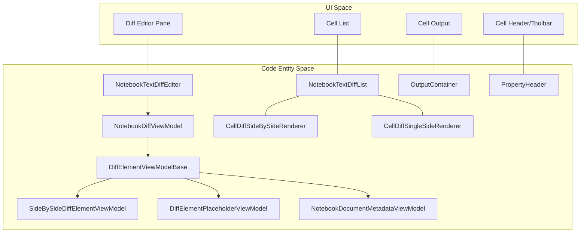
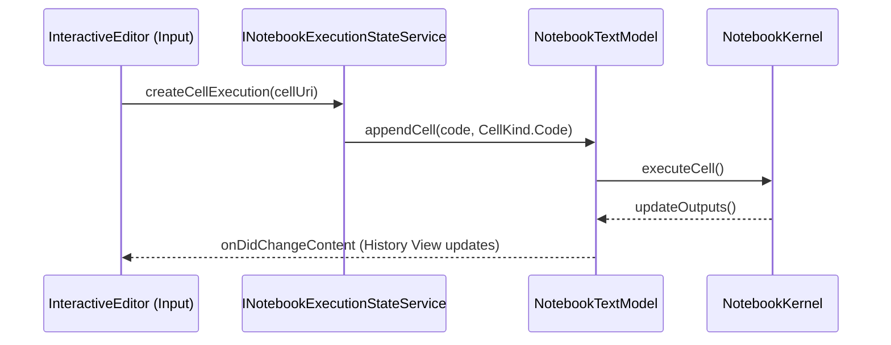

# Notebook Diff Editor and Interactive Window

Relevant source files

The following files were used as context for generating this wiki page:

- [src/vs/editor/contrib/inlineCompletions/browser/inlineCompletionsAccessibleView.ts](src/vs/editor/contrib/inlineCompletions/browser/inlineCompletionsAccessibleView.ts)
- [src/vs/platform/accessibility/browser/accessibleViewRegistry.ts](src/vs/platform/accessibility/browser/accessibleViewRegistry.ts)
- [src/vs/workbench/browser/parts/notifications/notificationAccessibleView.ts](src/vs/workbench/browser/parts/notifications/notificationAccessibleView.ts)
- [src/vs/workbench/contrib/codeEditor/browser/emptyTextEditorHint/emptyTextEditorHint.ts](src/vs/workbench/contrib/codeEditor/browser/emptyTextEditorHint/emptyTextEditorHint.ts)
- [src/vs/workbench/contrib/comments/browser/commentsAccessibleView.ts](src/vs/workbench/contrib/comments/browser/commentsAccessibleView.ts)
- [src/vs/workbench/contrib/interactive/browser/interactive.contribution.ts](src/vs/workbench/contrib/interactive/browser/interactive.contribution.ts)
- [src/vs/workbench/contrib/interactive/browser/interactiveCommon.ts](src/vs/workbench/contrib/interactive/browser/interactiveCommon.ts)
- [src/vs/workbench/contrib/interactive/browser/interactiveEditor.ts](src/vs/workbench/contrib/interactive/browser/interactiveEditor.ts)
- [src/vs/workbench/contrib/interactive/browser/interactiveEditorInput.ts](src/vs/workbench/contrib/interactive/browser/interactiveEditorInput.ts)
- [src/vs/workbench/contrib/interactive/browser/interactiveHistoryService.ts](src/vs/workbench/contrib/interactive/browser/interactiveHistoryService.ts)
- [src/vs/workbench/contrib/interactive/browser/replInputHintContentWidget.ts](src/vs/workbench/contrib/interactive/browser/replInputHintContentWidget.ts)
- [src/vs/workbench/contrib/notebook/browser/contrib/editorHint/emptyCellEditorHint.ts](src/vs/workbench/contrib/notebook/browser/contrib/editorHint/emptyCellEditorHint.ts)
- [src/vs/workbench/contrib/notebook/browser/diff/diffCellEditorOptions.ts](src/vs/workbench/contrib/notebook/browser/diff/diffCellEditorOptions.ts)
- [src/vs/workbench/contrib/notebook/browser/diff/diffComponents.ts](src/vs/workbench/contrib/notebook/browser/diff/diffComponents.ts)
- [src/vs/workbench/contrib/notebook/browser/diff/diffElementOutputs.ts](src/vs/workbench/contrib/notebook/browser/diff/diffElementOutputs.ts)
- [src/vs/workbench/contrib/notebook/browser/diff/diffElementViewModel.ts](src/vs/workbench/contrib/notebook/browser/diff/diffElementViewModel.ts)
- [src/vs/workbench/contrib/notebook/browser/diff/editorHeightCalculator.ts](src/vs/workbench/contrib/notebook/browser/diff/editorHeightCalculator.ts)
- [src/vs/workbench/contrib/notebook/browser/diff/notebookDiff.css](src/vs/workbench/contrib/notebook/browser/diff/notebookDiff.css)
- [src/vs/workbench/contrib/notebook/browser/diff/notebookDiffActions.ts](src/vs/workbench/contrib/notebook/browser/diff/notebookDiffActions.ts)
- [src/vs/workbench/contrib/notebook/browser/diff/notebookDiffEditor.ts](src/vs/workbench/contrib/notebook/browser/diff/notebookDiffEditor.ts)
- [src/vs/workbench/contrib/notebook/browser/diff/notebookDiffEditorBrowser.ts](src/vs/workbench/contrib/notebook/browser/diff/notebookDiffEditorBrowser.ts)
- [src/vs/workbench/contrib/notebook/browser/diff/notebookDiffList.ts](src/vs/workbench/contrib/notebook/browser/diff/notebookDiffList.ts)
- [src/vs/workbench/contrib/notebook/browser/diff/notebookDiffOverviewRuler.ts](src/vs/workbench/contrib/notebook/browser/diff/notebookDiffOverviewRuler.ts)
- [src/vs/workbench/contrib/notebook/browser/diff/notebookDiffViewModel.ts](src/vs/workbench/contrib/notebook/browser/diff/notebookDiffViewModel.ts)
- [src/vs/workbench/contrib/notebook/browser/diff/notebookMultiDiffEditor.ts](src/vs/workbench/contrib/notebook/browser/diff/notebookMultiDiffEditor.ts)
- [src/vs/workbench/contrib/notebook/browser/diff/unchangedEditorRegions.ts](src/vs/workbench/contrib/notebook/browser/diff/unchangedEditorRegions.ts)
- [src/vs/workbench/contrib/notebook/browser/media/notebookCellEditorHint.css](src/vs/workbench/contrib/notebook/browser/media/notebookCellEditorHint.css)
- [src/vs/workbench/contrib/notebook/browser/notebookAccessibilityHelp.ts](src/vs/workbench/contrib/notebook/browser/notebookAccessibilityHelp.ts)
- [src/vs/workbench/contrib/notebook/browser/notebookAccessibilityProvider.ts](src/vs/workbench/contrib/notebook/browser/notebookAccessibilityProvider.ts)
- [src/vs/workbench/contrib/notebook/browser/notebookAccessibleView.ts](src/vs/workbench/contrib/notebook/browser/notebookAccessibleView.ts)
- [src/vs/workbench/contrib/notebook/browser/notebookCellLayoutManager.ts](src/vs/workbench/contrib/notebook/browser/notebookCellLayoutManager.ts)
- [src/vs/workbench/contrib/notebook/browser/notebookOptions.ts](src/vs/workbench/contrib/notebook/browser/notebookOptions.ts)
- [src/vs/workbench/contrib/notebook/browser/services/notebookEditorService.ts](src/vs/workbench/contrib/notebook/browser/services/notebookEditorService.ts)
- [src/vs/workbench/contrib/notebook/browser/services/notebookEditorServiceImpl.ts](src/vs/workbench/contrib/notebook/browser/services/notebookEditorServiceImpl.ts)
- [src/vs/workbench/contrib/notebook/browser/viewModel/cellOutputTextHelper.ts](src/vs/workbench/contrib/notebook/browser/viewModel/cellOutputTextHelper.ts)
- [src/vs/workbench/contrib/notebook/browser/viewModel/cellOutputViewModel.ts](src/vs/workbench/contrib/notebook/browser/viewModel/cellOutputViewModel.ts)
- [src/vs/workbench/contrib/notebook/common/notebookDiffEditorInput.ts](src/vs/workbench/contrib/notebook/common/notebookDiffEditorInput.ts)
- [src/vs/workbench/contrib/notebook/test/browser/NotebookEditorWidgetService.test.ts](src/vs/workbench/contrib/notebook/test/browser/NotebookEditorWidgetService.test.ts)
- [src/vs/workbench/contrib/notebook/test/browser/cellOutput.test.ts](src/vs/workbench/contrib/notebook/test/browser/cellOutput.test.ts)
- [src/vs/workbench/contrib/notebook/test/browser/diff/editorHeightCalculator.test.ts](src/vs/workbench/contrib/notebook/test/browser/diff/editorHeightCalculator.test.ts)
- [src/vs/workbench/contrib/notebook/test/browser/diff/notebookDiff.test.ts](src/vs/workbench/contrib/notebook/test/browser/diff/notebookDiff.test.ts)
- [src/vs/workbench/contrib/notebook/test/browser/notebookCellLayoutManager.test.ts](src/vs/workbench/contrib/notebook/test/browser/notebookCellLayoutManager.test.ts)
- [src/vs/workbench/contrib/replNotebook/browser/repl.contribution.ts](src/vs/workbench/contrib/replNotebook/browser/repl.contribution.ts)
- [src/vs/workbench/contrib/replNotebook/browser/replEditor.ts](src/vs/workbench/contrib/replNotebook/browser/replEditor.ts)
- [src/vs/workbench/contrib/replNotebook/browser/replEditorAccessibilityHelp.ts](src/vs/workbench/contrib/replNotebook/browser/replEditorAccessibilityHelp.ts)
- [src/vs/workbench/contrib/replNotebook/browser/replEditorInput.ts](src/vs/workbench/contrib/replNotebook/browser/replEditorInput.ts)
- [src/vscode-dts/vscode.proposed.notebookReplDocument.d.ts](src/vscode-dts/vscode.proposed.notebookReplDocument.d.ts)

The Notebook system in VS Code extends beyond standard document editing to include specialized interfaces for comparing changes and providing a REPL-like (Read-Eval-Print Loop) experience. This page covers the technical implementation of the Notebook Diff Editor, the Interactive Window, and the REPL Notebook Editor.

## Notebook Diff Editor

The Notebook Diff Editor provides a rich comparison view for notebook files, allowing users to see changes in cell inputs, outputs, and metadata. Unlike standard text diffs, it operates on a per-cell basis using a specialized list view.

### Architecture and Data Flow

The Notebook Diff Editor follows an MVVM pattern similar to the standard Notebook Editor but specialized for comparison.

*   **NotebookTextDiffEditor**: The main workbench editor pane. It manages the lifecycle of the diff view, including the list widget and the webview for rendering outputs [src/vs/workbench/contrib/notebook/browser/diff/notebookDiffEditor.ts:90-104]().
*   **NotebookDiffViewModel**: Maintains the state of the diff, holding a collection of `IDiffElementViewModelBase` objects representing insertions, deletions, or modifications [src/vs/workbench/contrib/notebook/browser/diff/notebookDiffViewModel.ts:25-30]().
*   **DiffElementViewModel**: Represents a single row in the diff list. It can be a `SideBySideDiffElementViewModel` (showing original vs modified), a `SingleSideDiffElementViewModel` (for additions/deletions), or a `DiffElementPlaceholderViewModel` (for collapsed unchanged regions) [src/vs/workbench/contrib/notebook/browser/diff/diffElementViewModel.ts:48-75]().

### Rendering Pipeline

The diff editor uses a `NotebookTextDiffList` (an extension of the Monaco List) to render cells. Each cell in the list contains embedded `CodeEditorWidget` or `DiffEditorWidget` instances for the code content [src/vs/workbench/contrib/notebook/browser/diff/notebookDiffList.ts:133-135]().

#### Notebook Diff Entity Map
This diagram maps the high-level UI components to their underlying implementation classes and shows the relationship between the View and the ViewModels.

Sources: [src/vs/workbench/contrib/notebook/browser/diff/notebookDiffEditor.ts:90-104](), [src/vs/workbench/contrib/notebook/browser/diff/diffElementViewModel.ts:48-107](), [src/vs/workbench/contrib/notebook/browser/diff/diffComponents.ts:91-113](), [src/vs/workbench/contrib/notebook/browser/diff/notebookDiffList.ts:18-20]()

### Key Components

| Component | Responsibility | File Pointer |
| :--- | :--- | :--- |
| `NotebookTextDiffList` | A virtualized list that renders different types of diff elements using specialized renderers. | [src/vs/workbench/contrib/notebook/browser/diff/notebookDiffList.ts:133-135]() |
| `DiffEditorHeightCalculatorService` | Calculates the height required for cell editors by performing a hidden diff calculation. | [src/vs/workbench/contrib/notebook/browser/diff/editorHeightCalculator.ts:24-28]() |
| `OutputContainer` | Manages the rendering of notebook outputs within the diff view, handling both single and side-by-side displays. | [src/vs/workbench/contrib/notebook/browser/diff/diffElementOutputs.ts:26-43]() |
| `PropertyHeader` | Renders the collapsible headers for Metadata and Output sections in a diff cell. | [src/vs/workbench/contrib/notebook/browser/diff/diffComponents.ts:91-113]() |
| `CellDiffPlaceholderElement` | Handles the UI for hidden/collapsed unchanged cell regions in the diff list. | [src/vs/workbench/contrib/notebook/browser/diff/diffComponents.ts:67-89]() |
| `NotebookDocumentMetadataViewModel` | Specialized view model for comparing notebook-level metadata. | [src/vs/workbench/contrib/notebook/browser/diff/diffElementViewModel.ts:107-130]() |

Sources: [src/vs/workbench/contrib/notebook/browser/diff/notebookDiffList.ts:133-135](), [src/vs/workbench/contrib/notebook/browser/diff/editorHeightCalculator.ts:24-28](), [src/vs/workbench/contrib/notebook/browser/diff/diffElementOutputs.ts:26-43](), [src/vs/workbench/contrib/notebook/browser/diff/diffComponents.ts:67-113](), [src/vs/workbench/contrib/notebook/browser/diff/diffElementViewModel.ts:107-130]()

## Interactive Window

The Interactive Window is a hybrid editor that combines a read-only notebook-like history (the "History View") with a persistent code input box at the bottom.

### Interactive Window Architecture

The Interactive Window is implemented via the `InteractiveEditor` class. It manages two main parts:
1.  **NotebookEditorWidget**: Display the execution history via `_notebookWidget` [src/vs/workbench/contrib/interactive/browser/interactiveEditor.ts:91-97]().
2.  **CodeEditorWidget**: A standard monaco editor used as the input box (`_codeEditorWidget`) [src/vs/workbench/contrib/interactive/browser/interactiveEditor.ts:96-102]().

#### Data Flow: Input to History
When a user executes code in the Interactive Window, the execution state is managed by `INotebookExecutionStateService`.

Sources: [src/vs/workbench/contrib/interactive/browser/interactiveEditor.ts:87-110](), [src/vs/workbench/contrib/notebook/common/notebookExecutionStateService.ts:53-54]()

### Interactive Editor Input
The `InteractiveEditorInput` is a composite input. It wraps a `NotebookEditorInput` for the history and maintains its own state for the input box language and resource [src/vs/workbench/contrib/interactive/browser/interactiveEditorInput.ts:24-64]().

*   **Resource Scheme**: Uses `vscode-interactive-input` for the input box [src/vs/workbench/contrib/interactive/browser/interactive.contribution.ts:104-106]().
*   **History Service**: `InteractiveHistoryService` manages the command history specifically for the interactive input [src/vs/workbench/contrib/interactive/browser/interactiveHistoryService.ts:18-22]().

## REPL Notebook Editor

The REPL Notebook Editor (`ReplEditor`) is a specialized version of the notebook interface designed for a pure REPL experience, commonly used for the Debug Console.

### Implementation Details
*   **ReplEditorControl**: The control optimized for a stream of inputs and outputs [src/vs/workbench/contrib/replNotebook/browser/replEditor.ts:68-72]().
*   **ReplEditor**: The workbench editor pane that hosts the `ReplEditorControl` [src/vs/workbench/contrib/replNotebook/browser/repl.contribution.ts:88-97]().
*   **ReplInputHintContentWidget**: Provides the "Type code here..." hint in the input editor [src/vs/workbench/contrib/interactive/browser/replInputHintContentWidget.ts:19-25]().

### Configuration and Context Keys
*   **INTERACTIVE_WINDOW_EDITOR_ID**: The unique identifier for the interactive window editor [src/vs/workbench/contrib/notebook/common/notebookCommon.ts:51]().
*   **REPL_EDITOR_ID**: The unique identifier for the REPL notebook editor [src/vs/workbench/contrib/notebook/common/notebookCommon.ts:51]().
*   **NotebookSetting.InteractiveWindowPromptToSave**: Controls whether the interactive window behaves as a scratchpad [src/vs/workbench/contrib/interactive/browser/interactiveEditorInput.ts:103-106]().
*   **INTERACTIVE_INPUT_CURSOR_BOUNDARY**: Context key used to manage cursor movement between the input box and history [src/vs/workbench/contrib/interactive/browser/interactiveCommon.ts:42]().

Sources: [src/vs/workbench/contrib/replNotebook/browser/replEditor.ts:68-72](), [src/vs/workbench/contrib/interactive/browser/interactive.contribution.ts:79-100](), [src/vs/workbench/contrib/interactive/browser/interactiveEditorInput.ts:103-106](), [src/vs/workbench/contrib/interactive/browser/interactiveCommon.ts:42](), [src/vs/workbench/contrib/replNotebook/browser/repl.contribution.ts:88-97]()