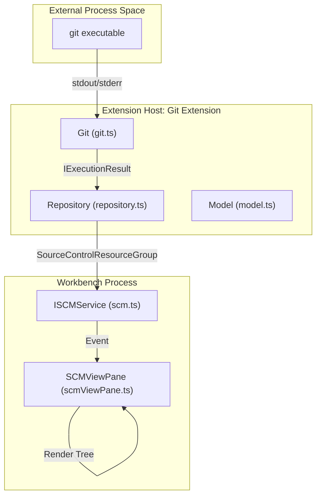
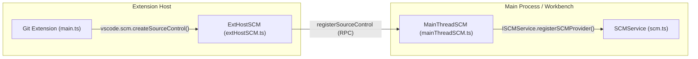

# Source Control and Git

Relevant source files

The following files were used as context for generating this wiki page:

- [extensions/git/package.json](extensions/git/package.json)
- [extensions/git/package.nls.json](extensions/git/package.nls.json)
- [extensions/git/src/actionButton.ts](extensions/git/src/actionButton.ts)
- [extensions/git/src/api/api1.ts](extensions/git/src/api/api1.ts)
- [extensions/git/src/api/git.d.ts](extensions/git/src/api/git.d.ts)
- [extensions/git/src/artifactProvider.ts](extensions/git/src/artifactProvider.ts)
- [extensions/git/src/askpass-main.ts](extensions/git/src/askpass-main.ts)
- [extensions/git/src/askpass.ts](extensions/git/src/askpass.ts)
- [extensions/git/src/autofetch.ts](extensions/git/src/autofetch.ts)
- [extensions/git/src/blame.ts](extensions/git/src/blame.ts)
- [extensions/git/src/cache.ts](extensions/git/src/cache.ts)
- [extensions/git/src/commands.ts](extensions/git/src/commands.ts)
- [extensions/git/src/decorationProvider.ts](extensions/git/src/decorationProvider.ts)
- [extensions/git/src/git-editor-main.ts](extensions/git/src/git-editor-main.ts)
- [extensions/git/src/git.ts](extensions/git/src/git.ts)
- [extensions/git/src/gitEditor.ts](extensions/git/src/gitEditor.ts)
- [extensions/git/src/historyItemDetailsProvider.ts](extensions/git/src/historyItemDetailsProvider.ts)
- [extensions/git/src/historyProvider.ts](extensions/git/src/historyProvider.ts)
- [extensions/git/src/ipc/ipcServer.ts](extensions/git/src/ipc/ipcServer.ts)
- [extensions/git/src/main.ts](extensions/git/src/main.ts)
- [extensions/git/src/model.ts](extensions/git/src/model.ts)
- [extensions/git/src/operation.ts](extensions/git/src/operation.ts)
- [extensions/git/src/postCommitCommands.ts](extensions/git/src/postCommitCommands.ts)
- [extensions/git/src/repository.ts](extensions/git/src/repository.ts)
- [extensions/git/src/statusbar.ts](extensions/git/src/statusbar.ts)
- [extensions/git/src/terminal.ts](extensions/git/src/terminal.ts)
- [extensions/git/src/timelineProvider.ts](extensions/git/src/timelineProvider.ts)
- [extensions/git/src/util.ts](extensions/git/src/util.ts)
- [extensions/git/tsconfig.json](extensions/git/tsconfig.json)
- [extensions/github/src/typings/git.d.ts](extensions/github/src/typings/git.d.ts)
- [src/vs/workbench/api/browser/mainThreadSCM.ts](src/vs/workbench/api/browser/mainThreadSCM.ts)
- [src/vs/workbench/api/common/extHostSCM.ts](src/vs/workbench/api/common/extHostSCM.ts)
- [src/vs/workbench/contrib/scm/browser/activity.ts](src/vs/workbench/contrib/scm/browser/activity.ts)
- [src/vs/workbench/contrib/scm/browser/media/scm.css](src/vs/workbench/contrib/scm/browser/media/scm.css)
- [src/vs/workbench/contrib/scm/browser/menus.ts](src/vs/workbench/contrib/scm/browser/menus.ts)
- [src/vs/workbench/contrib/scm/browser/scm.contribution.ts](src/vs/workbench/contrib/scm/browser/scm.contribution.ts)
- [src/vs/workbench/contrib/scm/browser/scmHistory.ts](src/vs/workbench/contrib/scm/browser/scmHistory.ts)
- [src/vs/workbench/contrib/scm/browser/scmHistoryViewPane.ts](src/vs/workbench/contrib/scm/browser/scmHistoryViewPane.ts)
- [src/vs/workbench/contrib/scm/browser/scmRepositoriesViewPane.ts](src/vs/workbench/contrib/scm/browser/scmRepositoriesViewPane.ts)
- [src/vs/workbench/contrib/scm/browser/scmRepositoryRenderer.ts](src/vs/workbench/contrib/scm/browser/scmRepositoryRenderer.ts)
- [src/vs/workbench/contrib/scm/browser/scmViewPane.ts](src/vs/workbench/contrib/scm/browser/scmViewPane.ts)
- [src/vs/workbench/contrib/scm/browser/scmViewService.ts](src/vs/workbench/contrib/scm/browser/scmViewService.ts)
- [src/vs/workbench/contrib/scm/browser/util.ts](src/vs/workbench/contrib/scm/browser/util.ts)
- [src/vs/workbench/contrib/scm/browser/workingSet.ts](src/vs/workbench/contrib/scm/browser/workingSet.ts)
- [src/vs/workbench/contrib/scm/common/artifact.ts](src/vs/workbench/contrib/scm/common/artifact.ts)
- [src/vs/workbench/contrib/scm/common/history.ts](src/vs/workbench/contrib/scm/common/history.ts)
- [src/vs/workbench/contrib/scm/common/scm.ts](src/vs/workbench/contrib/scm/common/scm.ts)
- [src/vs/workbench/contrib/scm/test/browser/scmHistory.test.ts](src/vs/workbench/contrib/scm/test/browser/scmHistory.test.ts)
- [src/vscode-dts/vscode.proposed.scmArtifactProvider.d.ts](src/vscode-dts/vscode.proposed.scmArtifactProvider.d.ts)
- [src/vscode-dts/vscode.proposed.scmHistoryProvider.d.ts](src/vscode-dts/vscode.proposed.scmHistoryProvider.d.ts)
- [test/automation/src/statusbar.ts](test/automation/src/statusbar.ts)

The Source Control management (SCM) system in VS Code is composed of a generic framework within the workbench and specific implementations provided by extensions. The most prominent implementation is the built-in **Git extension**, which provides comprehensive Git support by leveraging the core SCM APIs.

## SCM Framework Overview

The SCM framework provides the UI and service layer for managing source control state, regardless of the underlying engine (Git, SVN, Mercurial, etc.). It defines the structure for repositories, resource groups (e.g., "Changes", "Staged Changes"), and individual resources (files).

### Core Components and Services

*   **`ISCMService`**: The central service for registering and managing SCM providers. It tracks all active repositories across the workspace.
    *   Defined in: [src/vs/workbench/contrib/scm/common/scm.ts:507-526]()
*   **`ISCMProvider`**: The interface an extension must implement to provide SCM functionality. It includes metadata like `label` and `contextValue`.
    *   Defined in: [src/vs/workbench/contrib/scm/common/scm.ts:446-465]()
*   **`ISCMRepository`**: Represents an instance of a source control repository, linking a provider with a specific URI (usually the workspace root).
    *   Defined in: [src/vs/workbench/contrib/scm/common/scm.ts:491-505]()

### User Interface

The SCM UI is primarily hosted in the Source Control view container in the Sidebar, registered via the `SCMViewPaneContainer` [src/vs/workbench/contrib/scm/browser/scm.contribution.ts:56-65]().

*   **`SCMViewPane`**: The main view displaying changes, staged files, and the `SCMInputWidget` [src/vs/workbench/contrib/scm/browser/scmViewPane.ts:77-78]() for commit messages. It uses a `WorkbenchCompressibleAsyncDataTree` to render the resource hierarchy [src/vs/workbench/contrib/scm/browser/scmViewPane.ts:28-28]().
*   **`SCMHistoryViewPane`**: A dedicated view for visualizing source control history, including graph rendering, incoming/outgoing changes, and timeline integration [src/vs/workbench/contrib/scm/browser/scmHistoryViewPane.ts:32-33]().
*   **`SCMRepositoriesViewPane`**: A view that allows users to manage multiple repositories when working in a multi-root workspace or with submodules [src/vs/workbench/contrib/scm/browser/scmRepositoriesViewPane.ts:26-26]().

For deep technical details on the framework, history providers, and the extension host API, see **[SCM Framework](#9.1)**.

---

## Git Extension

The Git extension is a built-in extension that implements the SCM framework for Git. It communicates with the system's `git` executable to perform operations and reflect the state of the repository in the VS Code UI.

### Architecture and Model

The extension follows a model-view-controller pattern where the `Model` manages multiple `Repository` instances.

*   **`Git` Class**: A low-level wrapper around the Git CLI. It handles process execution (`spawn`), version detection, and output parsing [extensions/git/src/git.ts:24-27]().
*   **`Model`**: The root of the extension's state, responsible for repository discovery (including submodules and worktrees) and life-cycle management [extensions/git/src/model.ts:186-186]().
*   **`Repository`**: Bridges the low-level `Git` operations with the VS Code `SourceControl` API. It manages state transitions for staging, committing, and branch operations [extensions/git/src/repository.ts:13-13]().

### Interaction Flow: Git CLI to Workbench

The following diagram illustrates how a state change in the Git CLI propagates through the extension to the Workbench UI.

**Data Flow: Git State to UI**

Sources: [extensions/git/src/git.ts:210-210](), [extensions/git/src/repository.ts:13-13](), [src/vs/workbench/contrib/scm/browser/scmViewPane.ts:14-14]()

### Key Features

*   **Authentication (Askpass)**: Handles Git credentials via a custom IPC bridge (`Askpass`) between the Git process and the VS Code credentials store [extensions/git/src/askpass.ts:16-16]().
*   **CommandCenter**: Centralizes Git-specific commands (clone, init, commit, branch) and exposes them to the Command Palette and context menus [extensions/git/src/commands.ts:12-22]().
*   **History and Graph**: Provides commit history and branch visualization through the `GitHistoryProvider` [extensions/git/src/historyProvider.ts:43-44]().
*   **Autofetch**: Automatically fetches updates from remotes at configured intervals [extensions/git/src/autofetch.ts:15-15]().

For details on the Git class hierarchy, credential handling, and the public Git API, see **[Git Extension](#9.2)**.

---

## System Integration

The SCM framework and Git extension interact via the Extension Host RPC protocol, mapping extension-facing classes to internal workbench services.

**Bridge: Extension API to Core Framework**

Sources: [src/vs/workbench/api/common/extHostSCM.ts:468-468](), [src/vs/workbench/api/browser/mainThreadSCM.ts:168-168](), [extensions/git/src/main.ts:1-10](), [src/vs/workbench/contrib/scm/common/scm.ts:507-507]()

### Key Interfaces and Mappings

The following table shows how concepts in the `vscode` extension API map to the internal SCM framework entities.

| Concept | Extension API Entity (`vscode.d.ts`) | Core Framework Entity (`scm.ts`) |
| :--- | :--- | :--- |
| **Provider** | `SourceControl` | `ISCMProvider` |
| **Group** | `SourceControlResourceGroup` | `ISCMResourceGroup` |
| **Resource** | `SourceControlResourceState` | `ISCMResource` |
| **Input** | `SourceControlInputBox` | `ISCMInput` |
| **History** | `SourceControlHistoryProvider` | `ISCMHistoryProvider` |
| **Artifact** | `SourceControlArtifactProvider` | `ISCMArtifactProvider` |

Sources: [extensions/git/src/api/git.d.ts:6-6](), [src/vs/workbench/contrib/scm/common/scm.ts:14-14](), [src/vs/workbench/contrib/scm/common/history.ts:32-33](), [src/vs/workbench/contrib/scm/common/artifact.ts:1-5]()