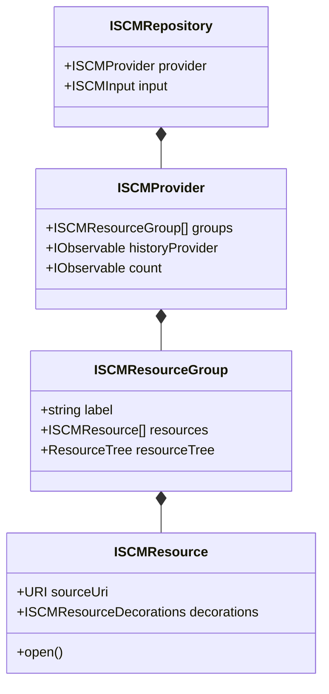

# SCM Framework

<details>
<summary>Relevant source files</summary>

The following files were used as context for generating this wiki page:

- [extensions/git/src/historyProvider.ts](https://github.com/microsoft/vscode/blob/HEAD/extensions/git/src/historyProvider.ts)
- [extensions/vscode-api-tests/package.json](https://github.com/microsoft/vscode/blob/HEAD/extensions/vscode-api-tests/package.json)
- [extensions/vscode-api-tests/src/singlefolder-tests/chat.test.ts](https://github.com/microsoft/vscode/blob/HEAD/extensions/vscode-api-tests/src/singlefolder-tests/chat.test.ts)
- [extensions/vscode-colorize-tests/src/colorizer.test.ts](https://github.com/microsoft/vscode/blob/HEAD/extensions/vscode-colorize-tests/src/colorizer.test.ts)
- [src/vs/base/common/arrays.ts](https://github.com/microsoft/vscode/blob/HEAD/src/vs/base/common/arrays.ts)
- [src/vs/base/test/common/arrays.test.ts](https://github.com/microsoft/vscode/blob/HEAD/src/vs/base/test/common/arrays.test.ts)
- [src/vs/editor/common/config/editorConfigurationSchema.ts](https://github.com/microsoft/vscode/blob/HEAD/src/vs/editor/common/config/editorConfigurationSchema.ts)
- [src/vs/editor/common/config/editorOptions.ts](https://github.com/microsoft/vscode/blob/HEAD/src/vs/editor/common/config/editorOptions.ts)
- [src/vs/editor/common/languages.ts](https://github.com/microsoft/vscode/blob/HEAD/src/vs/editor/common/languages.ts)
- [src/vs/editor/common/model.ts](https://github.com/microsoft/vscode/blob/HEAD/src/vs/editor/common/model.ts)
- [src/vs/editor/common/model/textModel.ts](https://github.com/microsoft/vscode/blob/HEAD/src/vs/editor/common/model/textModel.ts)
- [src/vs/editor/common/standalone/standaloneEnums.ts](https://github.com/microsoft/vscode/blob/HEAD/src/vs/editor/common/standalone/standaloneEnums.ts)
- [src/vs/editor/common/viewModel/viewModelImpl.ts](https://github.com/microsoft/vscode/blob/HEAD/src/vs/editor/common/viewModel/viewModelImpl.ts)
- [src/vs/editor/contrib/inlineCompletions/browser/controller/commandIds.ts](https://github.com/microsoft/vscode/blob/HEAD/src/vs/editor/contrib/inlineCompletions/browser/controller/commandIds.ts)
- [src/vs/editor/contrib/inlineCompletions/browser/controller/commands.ts](https://github.com/microsoft/vscode/blob/HEAD/src/vs/editor/contrib/inlineCompletions/browser/controller/commands.ts)
- [src/vs/editor/contrib/inlineCompletions/browser/controller/inlineCompletionContextKeys.ts](https://github.com/microsoft/vscode/blob/HEAD/src/vs/editor/contrib/inlineCompletions/browser/controller/inlineCompletionContextKeys.ts)
- [src/vs/editor/contrib/inlineCompletions/browser/controller/inlineCompletionsController.ts](https://github.com/microsoft/vscode/blob/HEAD/src/vs/editor/contrib/inlineCompletions/browser/controller/inlineCompletionsController.ts)
- [src/vs/editor/contrib/inlineCompletions/browser/inlineCompletions.contribution.ts](https://github.com/microsoft/vscode/blob/HEAD/src/vs/editor/contrib/inlineCompletions/browser/inlineCompletions.contribution.ts)
- [src/vs/editor/contrib/inlineCompletions/browser/model/inlineCompletionsModel.ts](https://github.com/microsoft/vscode/blob/HEAD/src/vs/editor/contrib/inlineCompletions/browser/model/inlineCompletionsModel.ts)
- [src/vs/editor/contrib/inlineCompletions/browser/model/inlineCompletionsSource.ts](https://github.com/microsoft/vscode/blob/HEAD/src/vs/editor/contrib/inlineCompletions/browser/model/inlineCompletionsSource.ts)
- [src/vs/editor/contrib/inlineCompletions/browser/model/inlineSuggestionItem.ts](https://github.com/microsoft/vscode/blob/HEAD/src/vs/editor/contrib/inlineCompletions/browser/model/inlineSuggestionItem.ts)
- [src/vs/editor/contrib/inlineCompletions/browser/model/provideInlineCompletions.ts](https://github.com/microsoft/vscode/blob/HEAD/src/vs/editor/contrib/inlineCompletions/browser/model/provideInlineCompletions.ts)
- [src/vs/editor/contrib/inlineCompletions/browser/telemetry.ts](https://github.com/microsoft/vscode/blob/HEAD/src/vs/editor/contrib/inlineCompletions/browser/telemetry.ts)
- [src/vs/editor/contrib/inlineCompletions/browser/view/inlineEdits/inlineEditWithChanges.ts](https://github.com/microsoft/vscode/blob/HEAD/src/vs/editor/contrib/inlineCompletions/browser/view/inlineEdits/inlineEditWithChanges.ts)
- [src/vs/editor/contrib/inlineCompletions/browser/view/inlineEdits/inlineEditsModel.ts](https://github.com/microsoft/vscode/blob/HEAD/src/vs/editor/contrib/inlineCompletions/browser/view/inlineEdits/inlineEditsModel.ts)
- [src/vs/editor/contrib/inlineCompletions/browser/view/inlineEdits/inlineEditsView.ts](https://github.com/microsoft/vscode/blob/HEAD/src/vs/editor/contrib/inlineCompletions/browser/view/inlineEdits/inlineEditsView.ts)
- [src/vs/editor/contrib/inlineCompletions/browser/view/inlineEdits/inlineEditsViewInterface.ts](https://github.com/microsoft/vscode/blob/HEAD/src/vs/editor/contrib/inlineCompletions/browser/view/inlineEdits/inlineEditsViewInterface.ts)
- [src/vs/editor/contrib/inlineCompletions/browser/view/inlineEdits/inlineEditsViewProducer.ts](https://github.com/microsoft/vscode/blob/HEAD/src/vs/editor/contrib/inlineCompletions/browser/view/inlineEdits/inlineEditsViewProducer.ts)
- [src/vs/monaco.d.ts](https://github.com/microsoft/vscode/blob/HEAD/src/vs/monaco.d.ts)
- [src/vs/platform/extensions/common/extensionsApiProposals.ts](https://github.com/microsoft/vscode/blob/HEAD/src/vs/platform/extensions/common/extensionsApiProposals.ts)
- [src/vs/workbench/api/browser/mainThreadChatAgents2.ts](https://github.com/microsoft/vscode/blob/HEAD/src/vs/workbench/api/browser/mainThreadChatAgents2.ts)
- [src/vs/workbench/api/browser/mainThreadLanguageFeatures.ts](https://github.com/microsoft/vscode/blob/HEAD/src/vs/workbench/api/browser/mainThreadLanguageFeatures.ts)
- [src/vs/workbench/api/browser/mainThreadSCM.ts](https://github.com/microsoft/vscode/blob/HEAD/src/vs/workbench/api/browser/mainThreadSCM.ts)
- [src/vs/workbench/api/common/extHost.api.impl.ts](https://github.com/microsoft/vscode/blob/HEAD/src/vs/workbench/api/common/extHost.api.impl.ts)
- [src/vs/workbench/api/common/extHost.protocol.ts](https://github.com/microsoft/vscode/blob/HEAD/src/vs/workbench/api/common/extHost.protocol.ts)
- [src/vs/workbench/api/common/extHostChatAgents2.ts](https://github.com/microsoft/vscode/blob/HEAD/src/vs/workbench/api/common/extHostChatAgents2.ts)
- [src/vs/workbench/api/common/extHostLanguageFeatures.ts](https://github.com/microsoft/vscode/blob/HEAD/src/vs/workbench/api/common/extHostLanguageFeatures.ts)
- [src/vs/workbench/api/common/extHostSCM.ts](https://github.com/microsoft/vscode/blob/HEAD/src/vs/workbench/api/common/extHostSCM.ts)
- [src/vs/workbench/api/common/extHostTypeConverters.ts](https://github.com/microsoft/vscode/blob/HEAD/src/vs/workbench/api/common/extHostTypeConverters.ts)
- [src/vs/workbench/api/common/extHostTypes.ts](https://github.com/microsoft/vscode/blob/HEAD/src/vs/workbench/api/common/extHostTypes.ts)
- [src/vs/workbench/contrib/scm/browser/activity.ts](https://github.com/microsoft/vscode/blob/HEAD/src/vs/workbench/contrib/scm/browser/activity.ts)
- [src/vs/workbench/contrib/scm/browser/media/scm.css](https://github.com/microsoft/vscode/blob/HEAD/src/vs/workbench/contrib/scm/browser/media/scm.css)
- [src/vs/workbench/contrib/scm/browser/menus.ts](https://github.com/microsoft/vscode/blob/HEAD/src/vs/workbench/contrib/scm/browser/menus.ts)
- [src/vs/workbench/contrib/scm/browser/scm.contribution.ts](https://github.com/microsoft/vscode/blob/HEAD/src/vs/workbench/contrib/scm/browser/scm.contribution.ts)
- [src/vs/workbench/contrib/scm/browser/scmHistory.ts](https://github.com/microsoft/vscode/blob/HEAD/src/vs/workbench/contrib/scm/browser/scmHistory.ts)
- [src/vs/workbench/contrib/scm/browser/scmHistoryViewPane.ts](https://github.com/microsoft/vscode/blob/HEAD/src/vs/workbench/contrib/scm/browser/scmHistoryViewPane.ts)
- [src/vs/workbench/contrib/scm/browser/scmRepositoriesViewPane.ts](https://github.com/microsoft/vscode/blob/HEAD/src/vs/workbench/contrib/scm/browser/scmRepositoriesViewPane.ts)
- [src/vs/workbench/contrib/scm/browser/scmRepositoryRenderer.ts](https://github.com/microsoft/vscode/blob/HEAD/src/vs/workbench/contrib/scm/browser/scmRepositoryRenderer.ts)
- [src/vs/workbench/contrib/scm/browser/scmViewPane.ts](https://github.com/microsoft/vscode/blob/HEAD/src/vs/workbench/contrib/scm/browser/scmViewPane.ts)
- [src/vs/workbench/contrib/scm/browser/scmViewService.ts](https://github.com/microsoft/vscode/blob/HEAD/src/vs/workbench/contrib/scm/browser/scmViewService.ts)
- [src/vs/workbench/contrib/scm/browser/util.ts](https://github.com/microsoft/vscode/blob/HEAD/src/vs/workbench/contrib/scm/browser/util.ts)
- [src/vs/workbench/contrib/scm/browser/workingSet.ts](https://github.com/microsoft/vscode/blob/HEAD/src/vs/workbench/contrib/scm/browser/workingSet.ts)
- [src/vs/workbench/contrib/scm/common/history.ts](https://github.com/microsoft/vscode/blob/HEAD/src/vs/workbench/contrib/scm/common/history.ts)
- [src/vs/workbench/contrib/scm/common/scm.ts](https://github.com/microsoft/vscode/blob/HEAD/src/vs/workbench/contrib/scm/common/scm.ts)
- [src/vs/workbench/contrib/scm/test/browser/scmHistory.test.ts](https://github.com/microsoft/vscode/blob/HEAD/src/vs/workbench/contrib/scm/test/browser/scmHistory.test.ts)
- [src/vscode-dts/vscode.d.ts](https://github.com/microsoft/vscode/blob/HEAD/src/vscode-dts/vscode.d.ts)
- [src/vscode-dts/vscode.proposed.chatParticipantAdditions.d.ts](https://github.com/microsoft/vscode/blob/HEAD/src/vscode-dts/vscode.proposed.chatParticipantAdditions.d.ts)
- [src/vscode-dts/vscode.proposed.inlineCompletionsAdditions.d.ts](https://github.com/microsoft/vscode/blob/HEAD/src/vscode-dts/vscode.proposed.inlineCompletionsAdditions.d.ts)
- [src/vscode-dts/vscode.proposed.scmHistoryProvider.d.ts](https://github.com/microsoft/vscode/blob/HEAD/src/vscode-dts/vscode.proposed.scmHistoryProvider.d.ts)

</details>


The Source Control Management (SCM) framework in VS Code provides a unified interface and UI for various version control systems (Git, SVN, Mercurial, etc.). It decouples the UI representation of changes, history, and repositories from the underlying provider implementations.

## Architecture Overview

The SCM framework follows a provider-consumer model where extensions implement specific SCM logic and the workbench provides a standardized UI and service layer.

### Core Service and Model
- **`ISCMService`**: The central registry for all SCM providers. It manages the lifecycle of `ISCMRepository` instances and provides events for repository addition/removal [src/vs/workbench/contrib/scm/common/scm.ts:179-191](https://github.com/microsoft/vscode/blob/HEAD/src/vs/workbench/contrib/scm/common/scm.ts#L179-L191).
- **`ISCMProvider`**: The interface implemented by an SCM engine (e.g., Git). It exposes resource groups, input box state, status bar commands, and history providers via observables [src/vs/workbench/contrib/scm/common/scm.ts:72-97](https://github.com/microsoft/vscode/blob/HEAD/src/vs/workbench/contrib/scm/common/scm.ts#L72-L97).
- **`ISCMRepository`**: A link between an `ISCMProvider` and an `ISCMInput` (the message box). It represents a single initialized repository in the workspace [src/vs/workbench/contrib/scm/common/scm.ts:173-177](https://github.com/microsoft/vscode/blob/HEAD/src/vs/workbench/contrib/scm/common/scm.ts#L173-L177).

### UI Components
- **`SCMViewPane`**: The primary "Source Control" view showing staged and unstaged files using a `WorkbenchCompressibleAsyncDataTree` [src/vs/workbench/contrib/scm/browser/scmViewPane.ts:28-80](https://github.com/microsoft/vscode/blob/HEAD/src/vs/workbench/contrib/scm/browser/scmViewPane.ts#L28-L80). It handles complex element types including repositories, inputs, action buttons, and resource groups [src/vs/workbench/contrib/scm/browser/scmViewPane.ts:79-80](https://github.com/microsoft/vscode/blob/HEAD/src/vs/workbench/contrib/scm/browser/scmViewPane.ts#L79-L80).
- **`SCMHistoryViewPane`**: The graph-based history view for commits and incoming/outgoing changes [src/vs/workbench/contrib/scm/browser/scmHistoryViewPane.ts:28-80](https://github.com/microsoft/vscode/blob/HEAD/src/vs/workbench/contrib/scm/browser/scmHistoryViewPane.ts#L28-L80).
- **`SCMRepositoriesViewPane`**: A list of all detected repositories, allowing users to toggle visibility and pin specific ones [src/vs/workbench/contrib/scm/browser/scmRepositoriesViewPane.ts:26-35](https://github.com/microsoft/vscode/blob/HEAD/src/vs/workbench/contrib/scm/browser/scmRepositoriesViewPane.ts#L26-L35).
- **`SCMViewPaneContainer`**: The container (usually in the Side Bar) that hosts the SCM-related views [src/vs/workbench/contrib/scm/browser/scm.contribution.ts:56-65](https://github.com/microsoft/vscode/blob/HEAD/src/vs/workbench/contrib/scm/browser/scm.contribution.ts#L56-L65).

### Data Flow: Extension to Workbench
The following diagram illustrates how an SCM extension (like Git) communicates through the Extension Host to populate the Workbench UI.

**SCM Process Boundary Bridge**
```mermaid
graph TD
    subgraph ExtensionHostProcess_extHostSCM_ts ["ExtensionHostProcess [extHostSCM.ts]"]
        Ext["vscode.SourceControl"] -- "register" --> ExtHostSCM["ExtHostSCM"]
        ExtHostSCM -- "syncs" --> ExtHostRepo["ExtHostRepository"]
    end

    subgraph RendererProcess_mainThreadSCM_ts ["RendererProcess [mainThreadSCM.ts]"]
        MainThreadSCM["MainThreadSCM"] -- "manages" --> ISCMService["ISCMService"]
        ISCMService -- "creates" --> SCMRepository["SCMRepository"]
        SCMRepository -- "updates" --> SCMViewPane["SCMViewPane"]
        SCMRepository -- "provides" --> SCMHistoryProvider["ISCMHistoryProvider"]
        SCMHistoryProvider -- "renders" --> SCMHistoryViewPane["SCMHistoryViewPane"]
    end

    ExtHostSCM <== "RPC Protocol extHost_protocol_ts["extHost.protocol.ts"]" ==> MainThreadSCM
```
Sources: [src/vs/workbench/api/browser/mainThreadSCM.ts:11-14](https://github.com/microsoft/vscode/blob/HEAD/src/vs/workbench/api/browser/mainThreadSCM.ts#L11-L14), [src/vs/workbench/api/common/extHostSCM.ts:12-30](https://github.com/microsoft/vscode/blob/HEAD/src/vs/workbench/api/common/extHostSCM.ts#L12-L30), [src/vs/workbench/contrib/scm/common/scm.ts:179-191](https://github.com/microsoft/vscode/blob/HEAD/src/vs/workbench/contrib/scm/common/scm.ts#L179-L191), [src/vs/workbench/api/common/extHost.protocol.ts:12-15](https://github.com/microsoft/vscode/blob/HEAD/src/vs/workbench/api/common/extHost.protocol.ts#L12-L15)

## Source Control History and Graph

The history system allows providers to supply a stream of history items (commits) and their relationships to form a visual graph.

### History Provider Interface
Providers implement `ISCMHistoryProvider` to support the History View [src/vs/workbench/contrib/scm/common/history.ts:100-118](https://github.com/microsoft/vscode/blob/HEAD/src/vs/workbench/contrib/scm/common/history.ts#L100-L118). Key capabilities include:
- `provideHistoryItems`: Fetches a list of `ISCMHistoryItem` [src/vs/workbench/contrib/scm/common/history.ts:102](https://github.com/microsoft/vscode/blob/HEAD/src/vs/workbench/contrib/scm/common/history.ts#L102).
- `historyItemRef`: An observable representing the current branch or reference [src/vs/workbench/contrib/scm/common/history.ts:105](https://github.com/microsoft/vscode/blob/HEAD/src/vs/workbench/contrib/scm/common/history.ts#L105).
- `provideHistoryItemChanges`: Returns the file changes for a specific commit [src/vs/workbench/contrib/scm/common/history.ts:103](https://github.com/microsoft/vscode/blob/HEAD/src/vs/workbench/contrib/scm/common/history.ts#L103).

### Graph Rendering
The history graph is rendered using "swimlanes". Each `ISCMHistoryItem` contains `ISCMHistoryItemGraphNode` data, which defines the visual connections (lines) between commits [src/vs/workbench/contrib/scm/common/history.ts:33-43](https://github.com/microsoft/vscode/blob/HEAD/src/vs/workbench/contrib/scm/common/history.ts#L33-L43).

The rendering logic in `scmHistory.ts` calculates the positions of nodes and the paths of the SVG lines connecting them [src/vs/workbench/contrib/scm/browser/scmHistory.ts:30-40](https://github.com/microsoft/vscode/blob/HEAD/src/vs/workbench/contrib/scm/browser/scmHistory.ts#L30-L40). The `SCMHistoryViewPane` utilizes `renderSCMHistoryItemGraph` to draw these visuals in the tree rows [src/vs/workbench/contrib/scm/browser/scmHistoryViewPane.ts:30](https://github.com/microsoft/vscode/blob/HEAD/src/vs/workbench/contrib/scm/browser/scmHistoryViewPane.ts#L30).

### Code Entity Mapping: History
| Concept | Code Entity | File |
| :--- | :--- | :--- |
| Commit/History Item | `ISCMHistoryItem` | [src/vs/workbench/contrib/scm/common/history.ts:45](https://github.com/microsoft/vscode/blob/HEAD/src/vs/workbench/contrib/scm/common/history.ts#L45) |
| Branch/Tag Ref | `ISCMHistoryItemRef` | [src/vs/workbench/contrib/scm/common/history.ts:68](https://github.com/microsoft/vscode/blob/HEAD/src/vs/workbench/contrib/scm/common/history.ts#L68) |
| History View | `SCMHistoryViewPane` | [src/vs/workbench/contrib/scm/browser/scmHistoryViewPane.ts:28](https://github.com/microsoft/vscode/blob/HEAD/src/vs/workbench/contrib/scm/browser/scmHistoryViewPane.ts#L28) |
| Graph Node | `ISCMHistoryItemGraphNode` | [src/vs/workbench/contrib/scm/common/history.ts:33](https://github.com/microsoft/vscode/blob/HEAD/src/vs/workbench/contrib/scm/common/history.ts#L33) |

Sources: [src/vs/workbench/contrib/scm/common/history.ts:33-118](https://github.com/microsoft/vscode/blob/HEAD/src/vs/workbench/contrib/scm/common/history.ts#L33-L118), [src/vs/workbench/contrib/scm/browser/scmHistoryViewPane.ts:28-40](https://github.com/microsoft/vscode/blob/HEAD/src/vs/workbench/contrib/scm/browser/scmHistoryViewPane.ts#L28-L40), [src/vs/workbench/contrib/scm/browser/scmHistory.ts:30-40](https://github.com/microsoft/vscode/blob/HEAD/src/vs/workbench/contrib/scm/browser/scmHistory.ts#L30-L40)

## SCM View Architecture

The SCM View uses a `WorkbenchCompressibleAsyncDataTree` to render resources [src/vs/workbench/contrib/scm/browser/scmViewPane.ts:28](https://github.com/microsoft/vscode/blob/HEAD/src/vs/workbench/contrib/scm/browser/scmViewPane.ts#L28).

### Resource Hierarchy
1. **Repository**: The top-level node (if multiple repositories are visible) [src/vs/workbench/contrib/scm/common/scm.ts:173](https://github.com/microsoft/vscode/blob/HEAD/src/vs/workbench/contrib/scm/common/scm.ts#L173).
2. **Resource Group**: A collection of changes, such as "Staged Changes" or "Merge Changes" [src/vs/workbench/contrib/scm/common/scm.ts:56](https://github.com/microsoft/vscode/blob/HEAD/src/vs/workbench/contrib/scm/common/scm.ts#L56).
3. **Resource**: An individual file change. These can be rendered as a flat list or a directory tree using `ResourceTree` [src/vs/workbench/contrib/scm/common/scm.ts:45](https://github.com/microsoft/vscode/blob/HEAD/src/vs/workbench/contrib/scm/common/scm.ts#L45), [src/vs/workbench/contrib/scm/common/scm.ts:61](https://github.com/microsoft/vscode/blob/HEAD/src/vs/workbench/contrib/scm/common/scm.ts#L61).

### The Input Box
Each repository has an `ISCMInput` which controls the commit message box [src/vs/workbench/contrib/scm/common/scm.ts:141](https://github.com/microsoft/vscode/blob/HEAD/src/vs/workbench/contrib/scm/common/scm.ts#L141). The `SCMInputWidget` provides:
- Multi-line text editing with language support (`scminput` language) [src/vs/workbench/contrib/scm/browser/scm.contribution.ts:47-52](https://github.com/microsoft/vscode/blob/HEAD/src/vs/workbench/contrib/scm/browser/scm.contribution.ts#L47-L52).
- Validation (errors/warnings/information) [src/vs/workbench/contrib/scm/common/scm.ts:104-113](https://github.com/microsoft/vscode/blob/HEAD/src/vs/workbench/contrib/scm/common/scm.ts#L104-L113).
- Command execution (e.g., `acceptInputCommand` to commit) [src/vs/workbench/contrib/scm/common/scm.ts:92](https://github.com/microsoft/vscode/blob/HEAD/src/vs/workbench/contrib/scm/common/scm.ts#L92).

**SCM Interface Hierarchy**

Sources: [src/vs/workbench/contrib/scm/common/scm.ts:45-177](https://github.com/microsoft/vscode/blob/HEAD/src/vs/workbench/contrib/scm/common/scm.ts#L45-L177), [src/vs/workbench/contrib/scm/browser/scmViewPane.ts:79-81](https://github.com/microsoft/vscode/blob/HEAD/src/vs/workbench/contrib/scm/browser/scmViewPane.ts#L79-L81)

## Working Sets

The SCM framework supports "Working Sets", which allow VS Code to save and restore the state of the SCM UI (opened editors, staged changes) when switching branches.

The `SCMWorkingSetController` listens for branch changes via the `historyItemRef` and manages the persistence of open editors associated with specific branches [src/vs/workbench/contrib/scm/browser/activity.ts:31](https://github.com/microsoft/vscode/blob/HEAD/src/vs/workbench/contrib/scm/browser/activity.ts#L31). This ensures that when a developer returns to a feature branch, their relevant files are reopened.

Sources: [src/vs/workbench/contrib/scm/browser/activity.ts:31](https://github.com/microsoft/vscode/blob/HEAD/src/vs/workbench/contrib/scm/browser/activity.ts#L31), [src/vs/workbench/contrib/scm/browser/scm.contribution.ts:32](https://github.com/microsoft/vscode/blob/HEAD/src/vs/workbench/contrib/scm/browser/scm.contribution.ts#L32)

## Extension Host API

Extensions interact with the SCM framework via the `vscode.SourceControl` namespace.

### MainThreadSCM vs ExtHostSCM
- **`ExtHostSCM`**: Located in the Extension Host. It provides the implementation of the `vscode.scm` API and proxies calls to the main thread [src/vs/workbench/api/common/extHostSCM.ts:12](https://github.com/microsoft/vscode/blob/HEAD/src/vs/workbench/api/common/extHostSCM.ts#L12). It handles resource splices and feature updates [src/vs/workbench/api/common/extHostSCM.ts:12-16](https://github.com/microsoft/vscode/blob/HEAD/src/vs/workbench/api/common/extHostSCM.ts#L12-L16).
- **`MainThreadSCM`**: Located in the Renderer. It receives RPC calls from the extension host and registers the actual `ISCMProvider` into the `ISCMService` [src/vs/workbench/api/browser/mainThreadSCM.ts:11-14](https://github.com/microsoft/vscode/blob/HEAD/src/vs/workbench/api/browser/mainThreadSCM.ts#L11-L14). It also provides a `SCMInputBoxContentProvider` for the commit message editor [src/vs/workbench/api/browser/mainThreadSCM.ts:62-79](https://github.com/microsoft/vscode/blob/HEAD/src/vs/workbench/api/browser/mainThreadSCM.ts#L62-L79).

### Activity and Status Bar
The `SCMActiveRepositoryController` manages global UI elements based on the active repository [src/vs/workbench/contrib/scm/browser/activity.ts:31](https://github.com/microsoft/vscode/blob/HEAD/src/vs/workbench/contrib/scm/browser/activity.ts#L31):
- **Activity Bar Badge**: Updates the pending change count based on the `scm.countBadge` setting [src/vs/workbench/contrib/scm/browser/activity.ts:91-107](https://github.com/microsoft/vscode/blob/HEAD/src/vs/workbench/contrib/scm/browser/activity.ts#L91-L107).
- **Status Bar**: Renders provider-specific commands (e.g., branch name, sync icon) [src/vs/workbench/contrib/scm/browser/activity.ts:109-114](https://github.com/microsoft/vscode/blob/HEAD/src/vs/workbench/contrib/scm/browser/activity.ts#L109-L114).
- **Context Keys**: Sets keys like `scmActiveRepositoryName` for use in menu contributions [src/vs/workbench/contrib/scm/browser/activity.ts:26-29](https://github.com/microsoft/vscode/blob/HEAD/src/vs/workbench/contrib/scm/browser/activity.ts#L26-L29).

Sources: [src/vs/workbench/api/browser/mainThreadSCM.ts:11-79](https://github.com/microsoft/vscode/blob/HEAD/src/vs/workbench/api/browser/mainThreadSCM.ts#L11-L79), [src/vs/workbench/api/common/extHostSCM.ts:12-16](https://github.com/microsoft/vscode/blob/HEAD/src/vs/workbench/api/common/extHostSCM.ts#L12-L16), [src/vs/workbench/contrib/scm/browser/activity.ts:26-114](https://github.com/microsoft/vscode/blob/HEAD/src/vs/workbench/contrib/scm/browser/activity.ts#L26-L114)

## Implementation Details: Repositories and Artifacts

The framework also supports rendering artifacts (e.g., GitHub Actions runs, Azure DevOps pipelines) alongside repositories.

### Repository and Artifact Rendering
- **`RepositoryRenderer`**: Responsible for rendering the repository entries in the tree. It uses observables to react to visibility changes and updates icons accordingly (e.g., `Codicon.repo` vs `Codicon.repoSelected`) [src/vs/workbench/contrib/scm/browser/scmRepositoryRenderer.ts:107-124](https://github.com/microsoft/vscode/blob/HEAD/src/vs/workbench/contrib/scm/browser/scmRepositoryRenderer.ts#L107-L124).
- **`ArtifactGroupRenderer`**: Renders groups of artifacts, often used for CI/CD integrations [src/vs/workbench/contrib/scm/browser/scmRepositoriesViewPane.ts:80-94](https://github.com/microsoft/vscode/blob/HEAD/src/vs/workbench/contrib/scm/browser/scmRepositoriesViewPane.ts#L80-L94).

### UI Styling
SCM views use a specific CSS layer to handle graph rendering and layout. For example, `.scm-view .monaco-list-row .history-item > .graph-container` handles the swimlane layout for the history graph [src/vs/workbench/contrib/scm/browser/media/scm.css:160-164](https://github.com/microsoft/vscode/blob/HEAD/src/vs/workbench/contrib/scm/browser/media/scm.css#L160-L164). Specific CSS variables like `--vscode-sideBar-background` are used to ensure the graph blends with the sidebar theme [src/vs/workbench/contrib/scm/browser/media/scm.css:169-180](https://github.com/microsoft/vscode/blob/HEAD/src/vs/workbench/contrib/scm/browser/media/scm.css#L169-L180).

Sources: [src/vs/workbench/contrib/scm/browser/scmRepositoryRenderer.ts:68-124](https://github.com/microsoft/vscode/blob/HEAD/src/vs/workbench/contrib/scm/browser/scmRepositoryRenderer.ts#L68-L124), [src/vs/workbench/contrib/scm/browser/scmRepositoriesViewPane.ts:80-120](https://github.com/microsoft/vscode/blob/HEAD/src/vs/workbench/contrib/scm/browser/scmRepositoriesViewPane.ts#L80-L120), [src/vs/workbench/contrib/scm/browser/media/scm.css:1-200](https://github.com/microsoft/vscode/blob/HEAD/src/vs/workbench/contrib/scm/browser/media/scm.css#L1-L200)