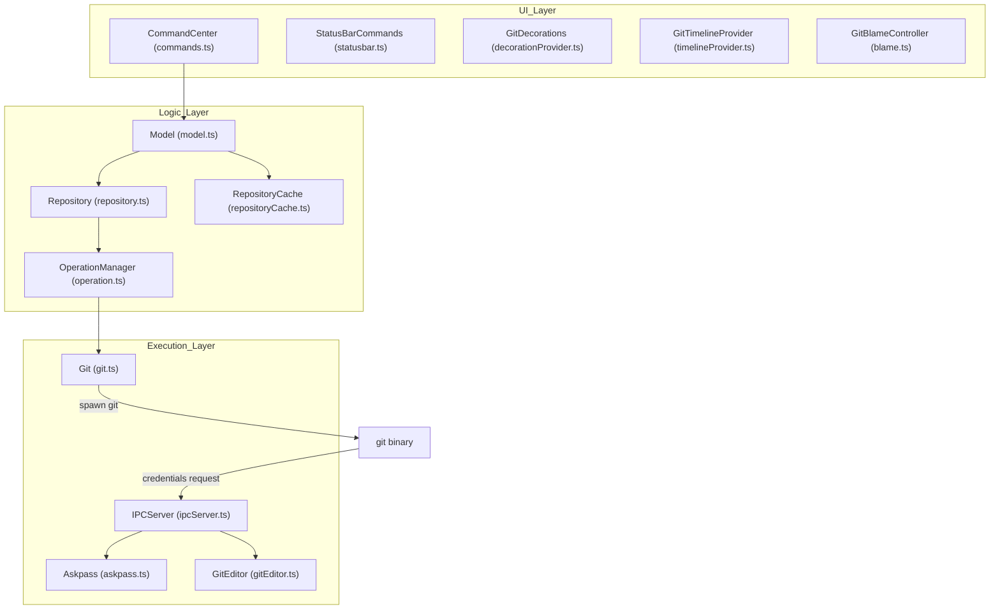
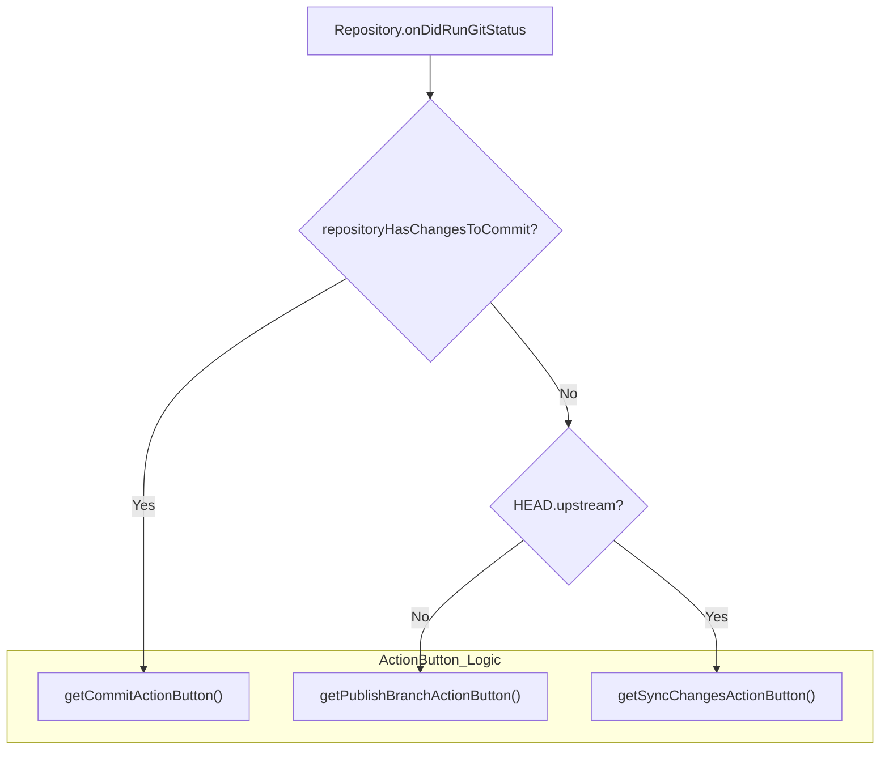

# Git Extension

Relevant source files

The following files were used as context for generating this wiki page:

- [extensions/git/package.json](extensions/git/package.json)
- [extensions/git/package.nls.json](extensions/git/package.nls.json)
- [extensions/git/src/actionButton.ts](extensions/git/src/actionButton.ts)
- [extensions/git/src/api/api1.ts](extensions/git/src/api/api1.ts)
- [extensions/git/src/api/git.d.ts](extensions/git/src/api/git.d.ts)
- [extensions/git/src/artifactProvider.ts](extensions/git/src/artifactProvider.ts)
- [extensions/git/src/askpass-main.ts](extensions/git/src/askpass-main.ts)
- [extensions/git/src/askpass.ts](extensions/git/src/askpass.ts)
- [extensions/git/src/autofetch.ts](extensions/git/src/autofetch.ts)
- [extensions/git/src/blame.ts](extensions/git/src/blame.ts)
- [extensions/git/src/cache.ts](extensions/git/src/cache.ts)
- [extensions/git/src/commands.ts](extensions/git/src/commands.ts)
- [extensions/git/src/decorationProvider.ts](extensions/git/src/decorationProvider.ts)
- [extensions/git/src/git-editor-main.ts](extensions/git/src/git-editor-main.ts)
- [extensions/git/src/git.ts](extensions/git/src/git.ts)
- [extensions/git/src/gitEditor.ts](extensions/git/src/gitEditor.ts)
- [extensions/git/src/historyItemDetailsProvider.ts](extensions/git/src/historyItemDetailsProvider.ts)
- [extensions/git/src/historyProvider.ts](extensions/git/src/historyProvider.ts)
- [extensions/git/src/ipc/ipcServer.ts](extensions/git/src/ipc/ipcServer.ts)
- [extensions/git/src/main.ts](extensions/git/src/main.ts)
- [extensions/git/src/model.ts](extensions/git/src/model.ts)
- [extensions/git/src/operation.ts](extensions/git/src/operation.ts)
- [extensions/git/src/postCommitCommands.ts](extensions/git/src/postCommitCommands.ts)
- [extensions/git/src/repository.ts](extensions/git/src/repository.ts)
- [extensions/git/src/statusbar.ts](extensions/git/src/statusbar.ts)
- [extensions/git/src/terminal.ts](extensions/git/src/terminal.ts)
- [extensions/git/src/timelineProvider.ts](extensions/git/src/timelineProvider.ts)
- [extensions/git/src/util.ts](extensions/git/src/util.ts)
- [extensions/git/tsconfig.json](extensions/git/tsconfig.json)
- [extensions/github/src/typings/git.d.ts](extensions/github/src/typings/git.d.ts)
- [src/vs/workbench/api/browser/mainThreadSCM.ts](src/vs/workbench/api/browser/mainThreadSCM.ts)
- [src/vs/workbench/api/common/extHostSCM.ts](src/vs/workbench/api/common/extHostSCM.ts)
- [src/vs/workbench/contrib/scm/browser/activity.ts](src/vs/workbench/contrib/scm/browser/activity.ts)
- [src/vs/workbench/contrib/scm/browser/media/scm.css](src/vs/workbench/contrib/scm/browser/media/scm.css)
- [src/vs/workbench/contrib/scm/browser/menus.ts](src/vs/workbench/contrib/scm/browser/menus.ts)
- [src/vs/workbench/contrib/scm/browser/scm.contribution.ts](src/vs/workbench/contrib/scm/browser/scm.contribution.ts)
- [src/vs/workbench/contrib/scm/browser/scmHistory.ts](src/vs/workbench/contrib/scm/browser/scmHistory.ts)
- [src/vs/workbench/contrib/scm/browser/scmHistoryViewPane.ts](src/vs/workbench/contrib/scm/browser/scmHistoryViewPane.ts)
- [src/vs/workbench/contrib/scm/browser/scmRepositoriesViewPane.ts](src/vs/workbench/contrib/scm/browser/scmRepositoriesViewPane.ts)
- [src/vs/workbench/contrib/scm/browser/scmRepositoryRenderer.ts](src/vs/workbench/contrib/scm/browser/scmRepositoryRenderer.ts)
- [src/vs/workbench/contrib/scm/browser/scmViewPane.ts](src/vs/workbench/contrib/scm/browser/scmViewPane.ts)
- [src/vs/workbench/contrib/scm/browser/scmViewService.ts](src/vs/workbench/contrib/scm/browser/scmViewService.ts)
- [src/vs/workbench/contrib/scm/browser/util.ts](src/vs/workbench/contrib/scm/browser/util.ts)
- [src/vs/workbench/contrib/scm/browser/workingSet.ts](src/vs/workbench/contrib/scm/browser/workingSet.ts)
- [src/vs/workbench/contrib/scm/common/artifact.ts](src/vs/workbench/contrib/scm/common/artifact.ts)
- [src/vs/workbench/contrib/scm/common/history.ts](src/vs/workbench/contrib/scm/common/history.ts)
- [src/vs/workbench/contrib/scm/common/scm.ts](src/vs/workbench/contrib/scm/common/scm.ts)
- [src/vs/workbench/contrib/scm/test/browser/scmHistory.test.ts](src/vs/workbench/contrib/scm/test/browser/scmHistory.test.ts)
- [src/vscode-dts/vscode.proposed.scmArtifactProvider.d.ts](src/vscode-dts/vscode.proposed.scmArtifactProvider.d.ts)
- [src/vscode-dts/vscode.proposed.scmHistoryProvider.d.ts](src/vscode-dts/vscode.proposed.scmHistoryProvider.d.ts)
- [test/automation/src/statusbar.ts](test/automation/src/statusbar.ts)

The Git extension provides robust Source Control Management (SCM) integration for Git repositories within VS Code. It handles everything from low-level Git process execution and credential management to high-level UI integrations like the Source Control view, status bar indicators, timeline providers, and gutter decorations.

## Architecture Overview

The Git extension is structured into three primary layers:
1.  **Low-Level Git Layer (`Git` class):** Manages the execution of the `git` binary, handles input/output streams, and parses raw Git output into structured data [extensions/git/src/git.ts:24-27]().
2.  **Model Layer (`Model` and `Repository` classes):** Tracks the state of all open repositories, manages the lifecycle of repository objects, and coordinates background tasks like fetching [extensions/git/src/model.ts:186-201]().
3.  **UI/Feature Layer (`CommandCenter`, `GitDecorations`, `StatusBarCommands`):** Maps the model state to VS Code's extensibility APIs to provide user-facing features [extensions/git/src/main.ts:115-125]().

### Data Flow and Class Hierarchy

The following diagram illustrates how a Git operation (like a status check) flows from the UI through the model to the system Git process.

**Git Extension System Hierarchy**

Sources: [extensions/git/src/main.ts:88-125](), [extensions/git/src/repository.ts:21-27](), [extensions/git/src/git.ts:210-215](), [extensions/git/src/model.ts:186-201](), [extensions/git/src/repository.ts:33]()

## The Git Execution Engine

The `Git` class in `extensions/git/src/git.ts` is the central point for interacting with the Git executable. It is responsible for finding the Git binary on the system path and executing commands via `child_process.spawn` [extensions/git/src/git.ts:159-181]().

Key features include:
*   **Version Detection:** Validates that the installed Git version meets requirements [extensions/git/src/git.ts:76-78]().
*   **Execution Wrappers:** The `exec` and `spawn` methods handle `CancellationToken` support, environment variable injection, and encoding detection [extensions/git/src/git.ts:203-210]().
*   **Output Parsing:** Converts raw command output into typed objects like `Commit`, `Branch`, and `Change` [extensions/git/src/git.ts:36-41]().

Sources: [extensions/git/src/git.ts:24-27](), [extensions/git/src/git.ts:159-181](), [extensions/git/src/git.ts:203-210]()

## Repository and Model Management

The `Model` class maintains the global state of the extension. It discovers repositories in the workspace and tracks them as `Repository` instances [extensions/git/src/model.ts:186-201](). It also manages "Unsafe Repositories" (repositories not owned by the current user) via the `UnsafeRepositoriesManager` and "Parent Repositories" via the `ParentRepositoriesManager` [extensions/git/src/model.ts:100-184]().

### The Repository Class
Each `Repository` instance represents a single Git repository on disk. It wraps a `BaseRepository` (from `git.ts`) and adds VS Code-specific SCM logic:
*   **State Management:** Tracks `HEAD`, remotes, submodules, and index changes [extensions/git/src/repository.ts:44-54]().
*   **Operation Queue:** Uses an `OperationManager` to ensure Git commands are executed sequentially where necessary to avoid index locks [extensions/git/src/repository.ts:23]().
*   **Resource Groups:** Organizes file changes into `Merge`, `Index` (Staged), `WorkingTree` (Unstaged), and `Untracked` groups for the SCM view [extensions/git/src/repository.ts:49-54]().
*   **Status Bar Integration:** Uses `StatusBarCommands` to update the branch and sync status in the VS Code status bar [extensions/git/src/repository.ts:27]().

Sources: [extensions/git/src/model.ts:186-201](), [extensions/git/src/repository.ts:13-27](), [extensions/git/src/repository.ts:44-54]()

## Credential Handling (Askpass)

Git often requires authentication for remote operations. VS Code handles this via an `Askpass` mechanism.

1.  **IPC Server:** The extension starts an IPC server during activation using `createIPCServer` [extensions/git/src/main.ts:69-73]().
2.  **Environment Variables:** When executing Git, `GIT_ASKPASS` is set to point to a small script (`askpass-main.ts`) that communicates back to the extension's IPC server [extensions/git/src/main.ts:82-83]().
3.  **Prompting:** When Git needs a password, it calls the `askpass` script, which sends a request through the IPC server. The extension then shows a VS Code input box to the user [extensions/git/src/askpass.ts:76-77]().

Sources: [extensions/git/src/main.ts:69-83](), [extensions/git/src/askpass.ts:76-77](), [extensions/git/src/ipc/ipcServer.ts:24]()

## UI Integrations

### CommandCenter
The `CommandCenter` class maps Git operations to VS Code commands (e.g., `git.commit`, `git.pull`). It handles user interaction, such as showing `QuickPick` items for branch selection (using `RefItem` and `BranchItem`) or error messages for merge conflicts [extensions/git/src/commands.ts:61-142](), [extensions/git/src/commands.ts:145-156](). It manages complex flows like `git.clone` via `CloneManager` [extensions/git/src/commands.ts:22]().

### Decoration Provider
The `GitDecorations` class implements the `FileDecorationProvider` API. It provides the colored letters (e.g., 'M' for modified, 'U' for untracked) and colors seen in the File Explorer based on the `Status` enum [extensions/git/src/repository.ts:58-91](), [extensions/git/src/decorationProvider.ts:11]().

### Action Buttons
The `ActionButton` class manages the primary button in the SCM view (e.g., "Commit", "Publish Branch", or "Sync Changes"). It dynamically updates based on the repository state (e.g., whether there are staged changes or if the branch has no upstream) [extensions/git/src/actionButton.ts:101-121]().

**Action Button State Transitions**

Sources: [extensions/git/src/actionButton.ts:101-121](), [extensions/git/src/actionButton.ts:143-176]()

### Timeline and History Providers
The `GitTimelineProvider` provides history data for the VS Code Timeline view by executing `git log` [extensions/git/src/timelineProvider.ts:95-150](). Additionally, the `GitHistoryProvider` implements the `SourceControlHistoryProvider` interface, managing `SourceControlHistoryItem` objects and their associated decorations [extensions/git/src/historyProvider.ts:44-61]().

### Blame and Hover
The `GitBlameController` provides line-level authorship information. It uses `git blame` to retrieve data and renders it via `GitBlameEditorDecoration` and `GitBlameStatusBarItem` [extensions/git/src/blame.ts:156-180]().

Sources: [extensions/git/src/blame.ts:156-180](), [extensions/git/src/main.ts:120-121](), [extensions/git/src/historyProvider.ts:44-75]()

## Post-Commit Commands and Autofetch

*   **Post-Commit Commands:** Users can configure actions to run automatically after a successful commit, such as `push` or `sync`. This is managed by the `CommitCommandsCenter` and registered via `GitPostCommitCommandsProvider` [extensions/git/src/postCommitCommands.ts:24-26](), [extensions/git/src/main.ts:126-127]().
*   **Autofetch:** When enabled, the `AutoFetcher` class periodically runs `git fetch` in the background to keep the local status of remotes up to date [extensions/git/src/autofetch.ts:18]().

Sources: [extensions/git/src/postCommitCommands.ts:24-26](), [extensions/git/src/autofetch.ts:18]()

## Public Git API

The Git extension exposes a public API that other extensions (like GitHub Pull Requests and Issues) can use to interact with repositories.

*   **API Export:** The extension exports an `API` object via its `GitExtensionImpl` implementation [extensions/git/src/main.ts:15-17]().
*   **Functionality:** Other extensions can get a list of repositories, check out branches, and subscribe to repository state changes via `ApiRepository` and `ApiRepositoryState` [extensions/git/src/api/api1.ts:38-102]().

| Interface | Purpose |
| :--- | :--- |
| `GitExtension` | Entry point to get the API version 1 [extensions/git/src/api/git.d.ts:9](). |
| `Repository` | Provides access to a single repository's state and operations [extensions/git/src/api/api1.ts:75](). |
| `API` | Global methods for repository discovery and credential provider registration [extensions/git/src/api/git.d.ts:236-260](). |

Sources: [extensions/git/src/api/api1.ts:75-102](), [extensions/git/src/api/git.d.ts:236-260]()