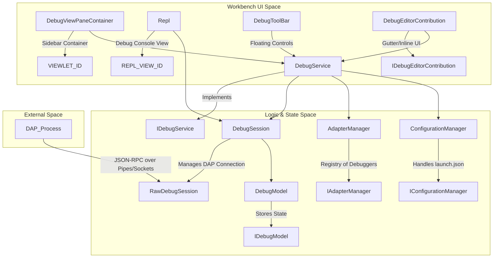
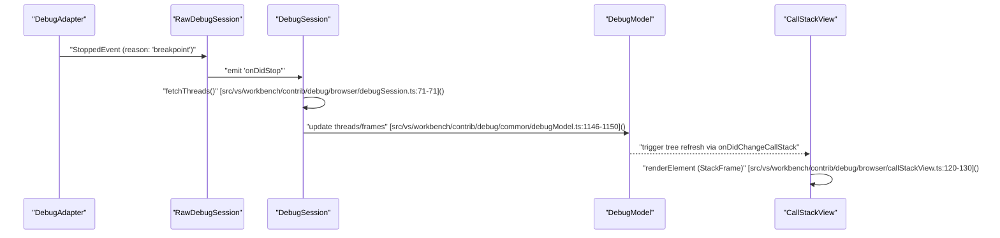

# Debugging

Relevant source files

The following files were used as context for generating this wiki page:

- [src/vs/base/browser/ui/dropdown/dropdown.css](https://github.com/microsoft/vscode/blob/HEAD/src/vs/base/browser/ui/dropdown/dropdown.css)
- [src/vs/base/test/browser/keyboardEvent.test.ts](https://github.com/microsoft/vscode/blob/HEAD/src/vs/base/test/browser/keyboardEvent.test.ts)
- [src/vs/editor/contrib/contextmenu/browser/contextmenu.ts](https://github.com/microsoft/vscode/blob/HEAD/src/vs/editor/contrib/contextmenu/browser/contextmenu.ts)
- [src/vs/editor/test/common/services/testTextResourcePropertiesService.ts](https://github.com/microsoft/vscode/blob/HEAD/src/vs/editor/test/common/services/testTextResourcePropertiesService.ts)
- [src/vs/platform/history/browser/contextScopedHistoryWidget.ts](https://github.com/microsoft/vscode/blob/HEAD/src/vs/platform/history/browser/contextScopedHistoryWidget.ts)
- [src/vs/workbench/api/browser/mainThreadDebugService.ts](https://github.com/microsoft/vscode/blob/HEAD/src/vs/workbench/api/browser/mainThreadDebugService.ts)
- [src/vs/workbench/api/common/extHostDebugService.ts](https://github.com/microsoft/vscode/blob/HEAD/src/vs/workbench/api/common/extHostDebugService.ts)
- [src/vs/workbench/contrib/codeEditor/browser/editorLineNumberMenu.ts](https://github.com/microsoft/vscode/blob/HEAD/src/vs/workbench/contrib/codeEditor/browser/editorLineNumberMenu.ts)
- [src/vs/workbench/contrib/codeEditor/browser/suggestEnabledInput/suggestEnabledInput.ts](https://github.com/microsoft/vscode/blob/HEAD/src/vs/workbench/contrib/codeEditor/browser/suggestEnabledInput/suggestEnabledInput.ts)
- [src/vs/workbench/contrib/debug/browser/baseDebugView.ts](https://github.com/microsoft/vscode/blob/HEAD/src/vs/workbench/contrib/debug/browser/baseDebugView.ts)
- [src/vs/workbench/contrib/debug/browser/breakpointEditorContribution.ts](https://github.com/microsoft/vscode/blob/HEAD/src/vs/workbench/contrib/debug/browser/breakpointEditorContribution.ts)
- [src/vs/workbench/contrib/debug/browser/breakpointWidget.ts](https://github.com/microsoft/vscode/blob/HEAD/src/vs/workbench/contrib/debug/browser/breakpointWidget.ts)
- [src/vs/workbench/contrib/debug/browser/breakpointsView.ts](https://github.com/microsoft/vscode/blob/HEAD/src/vs/workbench/contrib/debug/browser/breakpointsView.ts)
- [src/vs/workbench/contrib/debug/browser/callStackEditorContribution.ts](https://github.com/microsoft/vscode/blob/HEAD/src/vs/workbench/contrib/debug/browser/callStackEditorContribution.ts)
- [src/vs/workbench/contrib/debug/browser/callStackView.ts](https://github.com/microsoft/vscode/blob/HEAD/src/vs/workbench/contrib/debug/browser/callStackView.ts)
- [src/vs/workbench/contrib/debug/browser/debug.contribution.ts](https://github.com/microsoft/vscode/blob/HEAD/src/vs/workbench/contrib/debug/browser/debug.contribution.ts)
- [src/vs/workbench/contrib/debug/browser/debugActionViewItems.ts](https://github.com/microsoft/vscode/blob/HEAD/src/vs/workbench/contrib/debug/browser/debugActionViewItems.ts)
- [src/vs/workbench/contrib/debug/browser/debugAdapterManager.ts](https://github.com/microsoft/vscode/blob/HEAD/src/vs/workbench/contrib/debug/browser/debugAdapterManager.ts)
- [src/vs/workbench/contrib/debug/browser/debugCommands.ts](https://github.com/microsoft/vscode/blob/HEAD/src/vs/workbench/contrib/debug/browser/debugCommands.ts)
- [src/vs/workbench/contrib/debug/browser/debugConfigurationManager.ts](https://github.com/microsoft/vscode/blob/HEAD/src/vs/workbench/contrib/debug/browser/debugConfigurationManager.ts)
- [src/vs/workbench/contrib/debug/browser/debugEditorActions.ts](https://github.com/microsoft/vscode/blob/HEAD/src/vs/workbench/contrib/debug/browser/debugEditorActions.ts)
- [src/vs/workbench/contrib/debug/browser/debugEditorContribution.ts](https://github.com/microsoft/vscode/blob/HEAD/src/vs/workbench/contrib/debug/browser/debugEditorContribution.ts)
- [src/vs/workbench/contrib/debug/browser/debugHover.ts](https://github.com/microsoft/vscode/blob/HEAD/src/vs/workbench/contrib/debug/browser/debugHover.ts)
- [src/vs/workbench/contrib/debug/browser/debugIcons.ts](https://github.com/microsoft/vscode/blob/HEAD/src/vs/workbench/contrib/debug/browser/debugIcons.ts)
- [src/vs/workbench/contrib/debug/browser/debugQuickAccess.ts](https://github.com/microsoft/vscode/blob/HEAD/src/vs/workbench/contrib/debug/browser/debugQuickAccess.ts)
- [src/vs/workbench/contrib/debug/browser/debugService.ts](https://github.com/microsoft/vscode/blob/HEAD/src/vs/workbench/contrib/debug/browser/debugService.ts)
- [src/vs/workbench/contrib/debug/browser/debugSession.ts](https://github.com/microsoft/vscode/blob/HEAD/src/vs/workbench/contrib/debug/browser/debugSession.ts)
- [src/vs/workbench/contrib/debug/browser/debugToolBar.ts](https://github.com/microsoft/vscode/blob/HEAD/src/vs/workbench/contrib/debug/browser/debugToolBar.ts)
- [src/vs/workbench/contrib/debug/browser/debugViewlet.ts](https://github.com/microsoft/vscode/blob/HEAD/src/vs/workbench/contrib/debug/browser/debugViewlet.ts)
- [src/vs/workbench/contrib/debug/browser/disassemblyView.ts](https://github.com/microsoft/vscode/blob/HEAD/src/vs/workbench/contrib/debug/browser/disassemblyView.ts)
- [src/vs/workbench/contrib/debug/browser/exceptionWidget.ts](https://github.com/microsoft/vscode/blob/HEAD/src/vs/workbench/contrib/debug/browser/exceptionWidget.ts)
- [src/vs/workbench/contrib/debug/browser/media/breakpointWidget.css](https://github.com/microsoft/vscode/blob/HEAD/src/vs/workbench/contrib/debug/browser/media/breakpointWidget.css)
- [src/vs/workbench/contrib/debug/browser/media/callStackEditorContribution.css](https://github.com/microsoft/vscode/blob/HEAD/src/vs/workbench/contrib/debug/browser/media/callStackEditorContribution.css)
- [src/vs/workbench/contrib/debug/browser/media/debug.contribution.css](https://github.com/microsoft/vscode/blob/HEAD/src/vs/workbench/contrib/debug/browser/media/debug.contribution.css)
- [src/vs/workbench/contrib/debug/browser/media/debugHover.css](https://github.com/microsoft/vscode/blob/HEAD/src/vs/workbench/contrib/debug/browser/media/debugHover.css)
- [src/vs/workbench/contrib/debug/browser/media/debugToolBar.css](https://github.com/microsoft/vscode/blob/HEAD/src/vs/workbench/contrib/debug/browser/media/debugToolBar.css)
- [src/vs/workbench/contrib/debug/browser/media/debugViewlet.css](https://github.com/microsoft/vscode/blob/HEAD/src/vs/workbench/contrib/debug/browser/media/debugViewlet.css)
- [src/vs/workbench/contrib/debug/browser/media/repl.css](https://github.com/microsoft/vscode/blob/HEAD/src/vs/workbench/contrib/debug/browser/media/repl.css)
- [src/vs/workbench/contrib/debug/browser/repl.ts](https://github.com/microsoft/vscode/blob/HEAD/src/vs/workbench/contrib/debug/browser/repl.ts)
- [src/vs/workbench/contrib/debug/browser/replFilter.ts](https://github.com/microsoft/vscode/blob/HEAD/src/vs/workbench/contrib/debug/browser/replFilter.ts)
- [src/vs/workbench/contrib/debug/browser/replViewer.ts](https://github.com/microsoft/vscode/blob/HEAD/src/vs/workbench/contrib/debug/browser/replViewer.ts)
- [src/vs/workbench/contrib/debug/browser/variablesView.ts](https://github.com/microsoft/vscode/blob/HEAD/src/vs/workbench/contrib/debug/browser/variablesView.ts)
- [src/vs/workbench/contrib/debug/browser/watchExpressionsView.ts](https://github.com/microsoft/vscode/blob/HEAD/src/vs/workbench/contrib/debug/browser/watchExpressionsView.ts)
- [src/vs/workbench/contrib/debug/browser/welcomeView.ts](https://github.com/microsoft/vscode/blob/HEAD/src/vs/workbench/contrib/debug/browser/welcomeView.ts)
- [src/vs/workbench/contrib/debug/common/breakpoints.ts](https://github.com/microsoft/vscode/blob/HEAD/src/vs/workbench/contrib/debug/common/breakpoints.ts)
- [src/vs/workbench/contrib/debug/common/debug.ts](https://github.com/microsoft/vscode/blob/HEAD/src/vs/workbench/contrib/debug/common/debug.ts)
- [src/vs/workbench/contrib/debug/common/debugModel.ts](https://github.com/microsoft/vscode/blob/HEAD/src/vs/workbench/contrib/debug/common/debugModel.ts)
- [src/vs/workbench/contrib/debug/common/debugSchemas.ts](https://github.com/microsoft/vscode/blob/HEAD/src/vs/workbench/contrib/debug/common/debugSchemas.ts)
- [src/vs/workbench/contrib/debug/common/debugStorage.ts](https://github.com/microsoft/vscode/blob/HEAD/src/vs/workbench/contrib/debug/common/debugStorage.ts)
- [src/vs/workbench/contrib/debug/common/debugger.ts](https://github.com/microsoft/vscode/blob/HEAD/src/vs/workbench/contrib/debug/common/debugger.ts)
- [src/vs/workbench/contrib/debug/common/replModel.ts](https://github.com/microsoft/vscode/blob/HEAD/src/vs/workbench/contrib/debug/common/replModel.ts)
- [src/vs/workbench/contrib/debug/test/browser/baseDebugView.test.ts](https://github.com/microsoft/vscode/blob/HEAD/src/vs/workbench/contrib/debug/test/browser/baseDebugView.test.ts)
- [src/vs/workbench/contrib/debug/test/browser/breakpoints.test.ts](https://github.com/microsoft/vscode/blob/HEAD/src/vs/workbench/contrib/debug/test/browser/breakpoints.test.ts)
- [src/vs/workbench/contrib/debug/test/browser/callStack.test.ts](https://github.com/microsoft/vscode/blob/HEAD/src/vs/workbench/contrib/debug/test/browser/callStack.test.ts)
- [src/vs/workbench/contrib/debug/test/browser/debugConfigurationManager.test.ts](https://github.com/microsoft/vscode/blob/HEAD/src/vs/workbench/contrib/debug/test/browser/debugConfigurationManager.test.ts)
- [src/vs/workbench/contrib/debug/test/browser/debugHover.test.ts](https://github.com/microsoft/vscode/blob/HEAD/src/vs/workbench/contrib/debug/test/browser/debugHover.test.ts)
- [src/vs/workbench/contrib/debug/test/browser/debugSource.test.ts](https://github.com/microsoft/vscode/blob/HEAD/src/vs/workbench/contrib/debug/test/browser/debugSource.test.ts)
- [src/vs/workbench/contrib/debug/test/browser/debugViewModel.test.ts](https://github.com/microsoft/vscode/blob/HEAD/src/vs/workbench/contrib/debug/test/browser/debugViewModel.test.ts)
- [src/vs/workbench/contrib/debug/test/browser/mockDebugModel.ts](https://github.com/microsoft/vscode/blob/HEAD/src/vs/workbench/contrib/debug/test/browser/mockDebugModel.ts)
- [src/vs/workbench/contrib/debug/test/browser/rawDebugSession.test.ts](https://github.com/microsoft/vscode/blob/HEAD/src/vs/workbench/contrib/debug/test/browser/rawDebugSession.test.ts)
- [src/vs/workbench/contrib/debug/test/browser/repl.test.ts](https://github.com/microsoft/vscode/blob/HEAD/src/vs/workbench/contrib/debug/test/browser/repl.test.ts)
- [src/vs/workbench/contrib/debug/test/browser/watch.test.ts](https://github.com/microsoft/vscode/blob/HEAD/src/vs/workbench/contrib/debug/test/browser/watch.test.ts)
- [src/vs/workbench/contrib/debug/test/common/mockDebug.ts](https://github.com/microsoft/vscode/blob/HEAD/src/vs/workbench/contrib/debug/test/common/mockDebug.ts)
- [src/vs/workbench/contrib/debug/test/node/debugger.test.ts](https://github.com/microsoft/vscode/blob/HEAD/src/vs/workbench/contrib/debug/test/node/debugger.test.ts)
- [src/vs/workbench/contrib/files/browser/explorerViewlet.ts](https://github.com/microsoft/vscode/blob/HEAD/src/vs/workbench/contrib/files/browser/explorerViewlet.ts)
- [src/vs/workbench/contrib/files/browser/views/openEditorsView.ts](https://github.com/microsoft/vscode/blob/HEAD/src/vs/workbench/contrib/files/browser/views/openEditorsView.ts)
- [src/vs/workbench/contrib/markers/browser/markersViewActions.ts](https://github.com/microsoft/vscode/blob/HEAD/src/vs/workbench/contrib/markers/browser/markersViewActions.ts)

The debugging subsystem in VS Code provides a generic interface for interacting with debuggers through the **Debug Adapter Protocol (DAP)**. It abstracts away the specifics of different runtimes (Node.js, Python, C++, etc.) into a unified UI and service layer.

## Overview

The debugging architecture is built around the `IDebugService` [src/vs/workbench/contrib/debug/common/debug.ts:494-494](https://github.com/microsoft/vscode/blob/HEAD/src/vs/workbench/contrib/debug/common/debug.ts#L494), which coordinates the lifecycle of debug sessions, the state of the UI, and communication with debug adapters.

### Core Architecture
The system is divided into several key areas:
*   **Service Layer**: Managed by `DebugService`, handling session creation, lifecycle events, and global state persistence [src/vs/workbench/contrib/debug/browser/debugService.ts:63-63](https://github.com/microsoft/vscode/blob/HEAD/src/vs/workbench/contrib/debug/browser/debugService.ts#L63).
*   **Model Layer**: `DebugModel` maintains the current state of threads, stack frames, variables, and breakpoints across all sessions [src/vs/workbench/contrib/debug/common/debugModel.ts:1146-1146](https://github.com/microsoft/vscode/blob/HEAD/src/vs/workbench/contrib/debug/common/debugModel.ts#L1146).
*   **Protocol Layer**: `RawDebugSession` handles the low-level JSON-RPC communication over DAP, translating protocol events into internal workbench events [src/vs/workbench/contrib/debug/browser/debugSession.ts:50-50](https://github.com/microsoft/vscode/blob/HEAD/src/vs/workbench/contrib/debug/browser/debugSession.ts#L50).
*   **UI Layer**: Comprises the Debug Viewlet (Sidebar), the Debug Console (REPL), and various editor contributions for breakpoints, call stacks, and inline values.

### Debugging Component Relationship
This diagram illustrates how the high-level system concepts map to specific classes in the codebase.

Sources: [src/vs/workbench/contrib/debug/browser/debugService.ts:63-103](https://github.com/microsoft/vscode/blob/HEAD/src/vs/workbench/contrib/debug/browser/debugService.ts#L63-L103), [src/vs/workbench/contrib/debug/browser/debugSession.ts:54-120](https://github.com/microsoft/vscode/blob/HEAD/src/vs/workbench/contrib/debug/browser/debugSession.ts#L54-L120), [src/vs/workbench/contrib/debug/browser/debugViewlet.ts:52-52](https://github.com/microsoft/vscode/blob/HEAD/src/vs/workbench/contrib/debug/browser/debugViewlet.ts#L52), [src/vs/workbench/contrib/debug/browser/repl.ts:70-80](https://github.com/microsoft/vscode/blob/HEAD/src/vs/workbench/contrib/debug/browser/repl.ts#L70-L80), [src/vs/workbench/contrib/debug/browser/debugAdapterManager.ts:56-56](https://github.com/microsoft/vscode/blob/HEAD/src/vs/workbench/contrib/debug/browser/debugAdapterManager.ts#L56), [src/vs/workbench/contrib/debug/common/debug.ts:34-43](https://github.com/microsoft/vscode/blob/HEAD/src/vs/workbench/contrib/debug/common/debug.ts#L34-L43)

---

## Debug Service and Session Lifecycle

The `DebugSession` class represents an active debugging instance. It manages the connection to the debug adapter and tracks the state of the debugged process, such as whether it is stopped or running [src/vs/workbench/contrib/debug/browser/debugSession.ts:54-54](https://github.com/microsoft/vscode/blob/HEAD/src/vs/workbench/contrib/debug/browser/debugSession.ts#L54).

*   **Communication**: Low-level DAP communication is encapsulated in `RawDebugSession`, which is instantiated within `DebugSession` to handle the protocol [src/vs/workbench/contrib/debug/browser/debugSession.ts:50-50](https://github.com/microsoft/vscode/blob/HEAD/src/vs/workbench/contrib/debug/browser/debugSession.ts#L50).
*   **Data Model**: The `DebugModel` stores hierarchical data received from DAP: `Thread` -> `StackFrame` -> `Scope` -> `Variable` [src/vs/workbench/contrib/debug/common/debugModel.ts:36-153](https://github.com/microsoft/vscode/blob/HEAD/src/vs/workbench/contrib/debug/common/debugModel.ts#L36-L153).
*   **REPL**: The Debug Console is implemented in `Repl` [src/vs/workbench/contrib/debug/browser/repl.ts:87-87](https://github.com/microsoft/vscode/blob/HEAD/src/vs/workbench/contrib/debug/browser/repl.ts#L87), allowing users to evaluate expressions via the `ReplModel` [src/vs/workbench/contrib/debug/common/replModel.ts:253-253](https://github.com/microsoft/vscode/blob/HEAD/src/vs/workbench/contrib/debug/common/replModel.ts#L253).

For details on session management and the data model, see **[Debug Service and Session Lifecycle](#10.1)**.

Sources: [src/vs/workbench/contrib/debug/browser/debugSession.ts:50-60](https://github.com/microsoft/vscode/blob/HEAD/src/vs/workbench/contrib/debug/browser/debugSession.ts#L50-L60), [src/vs/workbench/contrib/debug/common/debugModel.ts:36-60](https://github.com/microsoft/vscode/blob/HEAD/src/vs/workbench/contrib/debug/common/debugModel.ts#L36-L60), [src/vs/workbench/contrib/debug/browser/repl.ts:70-87](https://github.com/microsoft/vscode/blob/HEAD/src/vs/workbench/contrib/debug/browser/repl.ts#L70-L87)

---

## Debug Configuration and Adapters

Before a session can start, VS Code must resolve a configuration (typically from `launch.json`). This is handled by the `ConfigurationManager` [src/vs/workbench/contrib/debug/browser/debugConfigurationManager.ts:54-54](https://github.com/microsoft/vscode/blob/HEAD/src/vs/workbench/contrib/debug/browser/debugConfigurationManager.ts#L54).

*   **Resolvers**: `IDebugConfigurationProvider` implementations can dynamically modify configurations or provide "initial" configurations for new projects [src/vs/workbench/contrib/debug/common/debug.ts:620-630](https://github.com/microsoft/vscode/blob/HEAD/src/vs/workbench/contrib/debug/common/debug.ts#L620-L630).
*   **Adapters**: `AdapterManager` tracks registered debuggers, their command-line arguments, and their capabilities [src/vs/workbench/contrib/debug/browser/debugAdapterManager.ts:56-56](https://github.com/microsoft/vscode/blob/HEAD/src/vs/workbench/contrib/debug/browser/debugAdapterManager.ts#L56).
*   **Specialized Views**: The `DisassemblyView` provides a low-level view of machine instructions for debuggers that support the `disassemble` request [src/vs/workbench/contrib/debug/browser/disassemblyView.ts:87-87](https://github.com/microsoft/vscode/blob/HEAD/src/vs/workbench/contrib/debug/browser/disassemblyView.ts#L87).

For details on configurations, adapter registration, and specialized views, see **[Debug Configuration and Adapters](#10.2)**.

Sources: [src/vs/workbench/contrib/debug/browser/debugConfigurationManager.ts:54-100](https://github.com/microsoft/vscode/blob/HEAD/src/vs/workbench/contrib/debug/browser/debugConfigurationManager.ts#L54-L100), [src/vs/workbench/contrib/debug/browser/disassemblyView.ts:87-114](https://github.com/microsoft/vscode/blob/HEAD/src/vs/workbench/contrib/debug/browser/disassemblyView.ts#L87-L114)

---

## Debugging UI Structure

The debug UI is registered via `debug.contribution.ts` [src/vs/workbench/contrib/debug/browser/debug.contribution.ts:30-63](https://github.com/microsoft/vscode/blob/HEAD/src/vs/workbench/contrib/debug/browser/debug.contribution.ts#L30-L63) and is primarily housed in the `VIEWLET_ID` (`workbench.view.debug`) [src/vs/workbench/contrib/debug/common/debug.ts:34-34](https://github.com/microsoft/vscode/blob/HEAD/src/vs/workbench/contrib/debug/common/debug.ts#L34).

| View ID | Description | Code Entity |
| :--- | :--- | :--- |
| `VARIABLES_VIEW_ID` | Displays variables in the current scope | `VariablesView` [src/vs/workbench/contrib/debug/browser/variablesView.ts:62-62](https://github.com/microsoft/vscode/blob/HEAD/src/vs/workbench/contrib/debug/browser/variablesView.ts#L62) |
| `WATCH_VIEW_ID` | User-defined watch expressions | `WatchExpressionsView` [src/vs/workbench/contrib/debug/browser/watchExpressionsView.ts:63-63](https://github.com/microsoft/vscode/blob/HEAD/src/vs/workbench/contrib/debug/browser/watchExpressionsView.ts#L63) |
| `CALLSTACK_VIEW_ID` | Sessions, threads, and stack frames | `CallStackView` [src/vs/workbench/contrib/debug/browser/callStackView.ts:39-39](https://github.com/microsoft/vscode/blob/HEAD/src/vs/workbench/contrib/debug/browser/callStackView.ts#L39) |
| `BREAKPOINTS_VIEW_ID` | List of all breakpoints | `BreakpointsView` [src/vs/workbench/contrib/debug/browser/breakpointsView.ts:37-37](https://github.com/microsoft/vscode/blob/HEAD/src/vs/workbench/contrib/debug/browser/breakpointsView.ts#L37) |

### Data Flow from DAP to UI
The following diagram traces how a `StoppedEvent` from a Debug Adapter updates the Workbench UI.

Sources: [src/vs/workbench/contrib/debug/browser/debugSession.ts:69-75](https://github.com/microsoft/vscode/blob/HEAD/src/vs/workbench/contrib/debug/browser/debugSession.ts#L69-L75), [src/vs/workbench/contrib/debug/browser/callStackView.ts:39-48](https://github.com/microsoft/vscode/blob/HEAD/src/vs/workbench/contrib/debug/browser/callStackView.ts#L39-L48), [src/vs/workbench/contrib/debug/common/debugModel.ts:1146-1160](https://github.com/microsoft/vscode/blob/HEAD/src/vs/workbench/contrib/debug/common/debugModel.ts#L1146-L1160)

---

## Key Context Keys

The debugging subsystem exports several context keys used to control menu visibility and keybindings:
*   `inDebugMode`: True when at least one debug session is active [src/vs/workbench/contrib/debug/common/debug.ts:50-50](https://github.com/microsoft/vscode/blob/HEAD/src/vs/workbench/contrib/debug/common/debug.ts#L50).
*   `debugState`: The state of the focused session (`inactive`, `initializing`, `stopped`, `running`) [src/vs/workbench/contrib/debug/common/debug.ts:46-46](https://github.com/microsoft/vscode/blob/HEAD/src/vs/workbench/contrib/debug/common/debug.ts#L46).
*   `debugUx`: Tracks if the UI should be in 'simple' or 'default' mode based on configuration availability [src/vs/workbench/contrib/debug/common/debug.ts:48-48](https://github.com/microsoft/vscode/blob/HEAD/src/vs/workbench/contrib/debug/common/debug.ts#L48).
*   `breakpointWidgetVisible`: True when the conditional breakpoint input is open [src/vs/workbench/contrib/debug/common/debug.ts:52-52](https://github.com/microsoft/vscode/blob/HEAD/src/vs/workbench/contrib/debug/common/debug.ts#L52).

Sources: [src/vs/workbench/contrib/debug/common/debug.ts:34-63](https://github.com/microsoft/vscode/blob/HEAD/src/vs/workbench/contrib/debug/common/debug.ts#L34-L63), [src/vs/workbench/contrib/debug/browser/debugService.ts:63-100](https://github.com/microsoft/vscode/blob/HEAD/src/vs/workbench/contrib/debug/browser/debugService.ts#L63-L100), [src/vs/workbench/contrib/debug/browser/debugSession.ts:54-100](https://github.com/microsoft/vscode/blob/HEAD/src/vs/workbench/contrib/debug/browser/debugSession.ts#L54-L100), [src/vs/workbench/contrib/debug/common/debugModel.ts:1146-1150](https://github.com/microsoft/vscode/blob/HEAD/src/vs/workbench/contrib/debug/common/debugModel.ts#L1146-L1150)