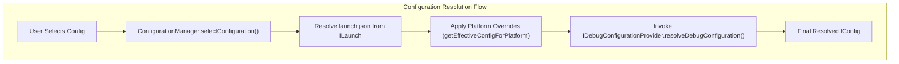
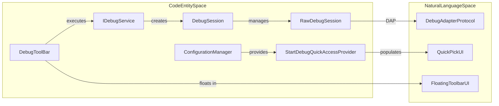
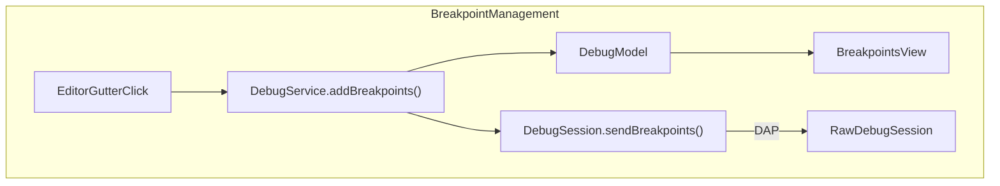

# Debug Configuration and Adapters

Relevant source files

The following files were used as context for generating this wiki page:

- [.vscode-test.js](https://github.com/microsoft/vscode/blob/HEAD/.vscode-test.js)
- [.vscode/launch.json](https://github.com/microsoft/vscode/blob/HEAD/.vscode/launch.json)
- [.vscode/tasks.json](https://github.com/microsoft/vscode/blob/HEAD/.vscode/tasks.json)
- [scripts/test-integration.bat](https://github.com/microsoft/vscode/blob/HEAD/scripts/test-integration.bat)
- [scripts/test-integration.sh](https://github.com/microsoft/vscode/blob/HEAD/scripts/test-integration.sh)
- [scripts/test-remote-integration.bat](https://github.com/microsoft/vscode/blob/HEAD/scripts/test-remote-integration.bat)
- [scripts/test-remote-integration.sh](https://github.com/microsoft/vscode/blob/HEAD/scripts/test-remote-integration.sh)
- [scripts/test-web-integration.bat](https://github.com/microsoft/vscode/blob/HEAD/scripts/test-web-integration.bat)
- [scripts/test-web-integration.sh](https://github.com/microsoft/vscode/blob/HEAD/scripts/test-web-integration.sh)
- [src/vs/base/browser/ui/dropdown/dropdown.css](https://github.com/microsoft/vscode/blob/HEAD/src/vs/base/browser/ui/dropdown/dropdown.css)
- [src/vs/base/test/browser/keyboardEvent.test.ts](https://github.com/microsoft/vscode/blob/HEAD/src/vs/base/test/browser/keyboardEvent.test.ts)
- [src/vs/editor/contrib/contextmenu/browser/contextmenu.ts](https://github.com/microsoft/vscode/blob/HEAD/src/vs/editor/contrib/contextmenu/browser/contextmenu.ts)
- [src/vs/editor/test/common/services/testTextResourcePropertiesService.ts](https://github.com/microsoft/vscode/blob/HEAD/src/vs/editor/test/common/services/testTextResourcePropertiesService.ts)
- [src/vs/platform/history/browser/contextScopedHistoryWidget.ts](https://github.com/microsoft/vscode/blob/HEAD/src/vs/platform/history/browser/contextScopedHistoryWidget.ts)
- [src/vs/workbench/api/browser/mainThreadDebugService.ts](https://github.com/microsoft/vscode/blob/HEAD/src/vs/workbench/api/browser/mainThreadDebugService.ts)
- [src/vs/workbench/api/common/extHostDebugService.ts](https://github.com/microsoft/vscode/blob/HEAD/src/vs/workbench/api/common/extHostDebugService.ts)
- [src/vs/workbench/contrib/codeEditor/browser/editorLineNumberMenu.ts](https://github.com/microsoft/vscode/blob/HEAD/src/vs/workbench/contrib/codeEditor/browser/editorLineNumberMenu.ts)
- [src/vs/workbench/contrib/codeEditor/browser/suggestEnabledInput/suggestEnabledInput.ts](https://github.com/microsoft/vscode/blob/HEAD/src/vs/workbench/contrib/codeEditor/browser/suggestEnabledInput/suggestEnabledInput.ts)
- [src/vs/workbench/contrib/debug/browser/baseDebugView.ts](https://github.com/microsoft/vscode/blob/HEAD/src/vs/workbench/contrib/debug/browser/baseDebugView.ts)
- [src/vs/workbench/contrib/debug/browser/breakpointEditorContribution.ts](https://github.com/microsoft/vscode/blob/HEAD/src/vs/workbench/contrib/debug/browser/breakpointEditorContribution.ts)
- [src/vs/workbench/contrib/debug/browser/breakpointWidget.ts](https://github.com/microsoft/vscode/blob/HEAD/src/vs/workbench/contrib/debug/browser/breakpointWidget.ts)
- [src/vs/workbench/contrib/debug/browser/breakpointsView.ts](https://github.com/microsoft/vscode/blob/HEAD/src/vs/workbench/contrib/debug/browser/breakpointsView.ts)
- [src/vs/workbench/contrib/debug/browser/callStackEditorContribution.ts](https://github.com/microsoft/vscode/blob/HEAD/src/vs/workbench/contrib/debug/browser/callStackEditorContribution.ts)
- [src/vs/workbench/contrib/debug/browser/callStackView.ts](https://github.com/microsoft/vscode/blob/HEAD/src/vs/workbench/contrib/debug/browser/callStackView.ts)
- [src/vs/workbench/contrib/debug/browser/debug.contribution.ts](https://github.com/microsoft/vscode/blob/HEAD/src/vs/workbench/contrib/debug/browser/debug.contribution.ts)
- [src/vs/workbench/contrib/debug/browser/debugActionViewItems.ts](https://github.com/microsoft/vscode/blob/HEAD/src/vs/workbench/contrib/debug/browser/debugActionViewItems.ts)
- [src/vs/workbench/contrib/debug/browser/debugAdapterManager.ts](https://github.com/microsoft/vscode/blob/HEAD/src/vs/workbench/contrib/debug/browser/debugAdapterManager.ts)
- [src/vs/workbench/contrib/debug/browser/debugCommands.ts](https://github.com/microsoft/vscode/blob/HEAD/src/vs/workbench/contrib/debug/browser/debugCommands.ts)
- [src/vs/workbench/contrib/debug/browser/debugConfigurationManager.ts](https://github.com/microsoft/vscode/blob/HEAD/src/vs/workbench/contrib/debug/browser/debugConfigurationManager.ts)
- [src/vs/workbench/contrib/debug/browser/debugEditorActions.ts](https://github.com/microsoft/vscode/blob/HEAD/src/vs/workbench/contrib/debug/browser/debugEditorActions.ts)
- [src/vs/workbench/contrib/debug/browser/debugEditorContribution.ts](https://github.com/microsoft/vscode/blob/HEAD/src/vs/workbench/contrib/debug/browser/debugEditorContribution.ts)
- [src/vs/workbench/contrib/debug/browser/debugHover.ts](https://github.com/microsoft/vscode/blob/HEAD/src/vs/workbench/contrib/debug/browser/debugHover.ts)
- [src/vs/workbench/contrib/debug/browser/debugIcons.ts](https://github.com/microsoft/vscode/blob/HEAD/src/vs/workbench/contrib/debug/browser/debugIcons.ts)
- [src/vs/workbench/contrib/debug/browser/debugQuickAccess.ts](https://github.com/microsoft/vscode/blob/HEAD/src/vs/workbench/contrib/debug/browser/debugQuickAccess.ts)
- [src/vs/workbench/contrib/debug/browser/debugService.ts](https://github.com/microsoft/vscode/blob/HEAD/src/vs/workbench/contrib/debug/browser/debugService.ts)
- [src/vs/workbench/contrib/debug/browser/debugSession.ts](https://github.com/microsoft/vscode/blob/HEAD/src/vs/workbench/contrib/debug/browser/debugSession.ts)
- [src/vs/workbench/contrib/debug/browser/debugToolBar.ts](https://github.com/microsoft/vscode/blob/HEAD/src/vs/workbench/contrib/debug/browser/debugToolBar.ts)
- [src/vs/workbench/contrib/debug/browser/debugViewlet.ts](https://github.com/microsoft/vscode/blob/HEAD/src/vs/workbench/contrib/debug/browser/debugViewlet.ts)
- [src/vs/workbench/contrib/debug/browser/disassemblyView.ts](https://github.com/microsoft/vscode/blob/HEAD/src/vs/workbench/contrib/debug/browser/disassemblyView.ts)
- [src/vs/workbench/contrib/debug/browser/exceptionWidget.ts](https://github.com/microsoft/vscode/blob/HEAD/src/vs/workbench/contrib/debug/browser/exceptionWidget.ts)
- [src/vs/workbench/contrib/debug/browser/media/breakpointWidget.css](https://github.com/microsoft/vscode/blob/HEAD/src/vs/workbench/contrib/debug/browser/media/breakpointWidget.css)
- [src/vs/workbench/contrib/debug/browser/media/callStackEditorContribution.css](https://github.com/microsoft/vscode/blob/HEAD/src/vs/workbench/contrib/debug/browser/media/callStackEditorContribution.css)
- [src/vs/workbench/contrib/debug/browser/media/debug.contribution.css](https://github.com/microsoft/vscode/blob/HEAD/src/vs/workbench/contrib/debug/browser/media/debug.contribution.css)
- [src/vs/workbench/contrib/debug/browser/media/debugHover.css](https://github.com/microsoft/vscode/blob/HEAD/src/vs/workbench/contrib/debug/browser/media/debugHover.css)
- [src/vs/workbench/contrib/debug/browser/media/debugToolBar.css](https://github.com/microsoft/vscode/blob/HEAD/src/vs/workbench/contrib/debug/browser/media/debugToolBar.css)
- [src/vs/workbench/contrib/debug/browser/media/debugViewlet.css](https://github.com/microsoft/vscode/blob/HEAD/src/vs/workbench/contrib/debug/browser/media/debugViewlet.css)
- [src/vs/workbench/contrib/debug/browser/media/repl.css](https://github.com/microsoft/vscode/blob/HEAD/src/vs/workbench/contrib/debug/browser/media/repl.css)
- [src/vs/workbench/contrib/debug/browser/repl.ts](https://github.com/microsoft/vscode/blob/HEAD/src/vs/workbench/contrib/debug/browser/repl.ts)
- [src/vs/workbench/contrib/debug/browser/replFilter.ts](https://github.com/microsoft/vscode/blob/HEAD/src/vs/workbench/contrib/debug/browser/replFilter.ts)
- [src/vs/workbench/contrib/debug/browser/replViewer.ts](https://github.com/microsoft/vscode/blob/HEAD/src/vs/workbench/contrib/debug/browser/replViewer.ts)
- [src/vs/workbench/contrib/debug/browser/variablesView.ts](https://github.com/microsoft/vscode/blob/HEAD/src/vs/workbench/contrib/debug/browser/variablesView.ts)
- [src/vs/workbench/contrib/debug/browser/watchExpressionsView.ts](https://github.com/microsoft/vscode/blob/HEAD/src/vs/workbench/contrib/debug/browser/watchExpressionsView.ts)
- [src/vs/workbench/contrib/debug/browser/welcomeView.ts](https://github.com/microsoft/vscode/blob/HEAD/src/vs/workbench/contrib/debug/browser/welcomeView.ts)
- [src/vs/workbench/contrib/debug/common/breakpoints.ts](https://github.com/microsoft/vscode/blob/HEAD/src/vs/workbench/contrib/debug/common/breakpoints.ts)
- [src/vs/workbench/contrib/debug/common/debug.ts](https://github.com/microsoft/vscode/blob/HEAD/src/vs/workbench/contrib/debug/common/debug.ts)
- [src/vs/workbench/contrib/debug/common/debugModel.ts](https://github.com/microsoft/vscode/blob/HEAD/src/vs/workbench/contrib/debug/common/debugModel.ts)
- [src/vs/workbench/contrib/debug/common/debugSchemas.ts](https://github.com/microsoft/vscode/blob/HEAD/src/vs/workbench/contrib/debug/common/debugSchemas.ts)
- [src/vs/workbench/contrib/debug/common/debugStorage.ts](https://github.com/microsoft/vscode/blob/HEAD/src/vs/workbench/contrib/debug/common/debugStorage.ts)
- [src/vs/workbench/contrib/debug/common/debugger.ts](https://github.com/microsoft/vscode/blob/HEAD/src/vs/workbench/contrib/debug/common/debugger.ts)
- [src/vs/workbench/contrib/debug/common/replModel.ts](https://github.com/microsoft/vscode/blob/HEAD/src/vs/workbench/contrib/debug/common/replModel.ts)
- [src/vs/workbench/contrib/debug/test/browser/baseDebugView.test.ts](https://github.com/microsoft/vscode/blob/HEAD/src/vs/workbench/contrib/debug/test/browser/baseDebugView.test.ts)
- [src/vs/workbench/contrib/debug/test/browser/breakpoints.test.ts](https://github.com/microsoft/vscode/blob/HEAD/src/vs/workbench/contrib/debug/test/browser/breakpoints.test.ts)
- [src/vs/workbench/contrib/debug/test/browser/callStack.test.ts](https://github.com/microsoft/vscode/blob/HEAD/src/vs/workbench/contrib/debug/test/browser/callStack.test.ts)
- [src/vs/workbench/contrib/debug/test/browser/debugConfigurationManager.test.ts](https://github.com/microsoft/vscode/blob/HEAD/src/vs/workbench/contrib/debug/test/browser/debugConfigurationManager.test.ts)
- [src/vs/workbench/contrib/debug/test/browser/debugHover.test.ts](https://github.com/microsoft/vscode/blob/HEAD/src/vs/workbench/contrib/debug/test/browser/debugHover.test.ts)
- [src/vs/workbench/contrib/debug/test/browser/debugSource.test.ts](https://github.com/microsoft/vscode/blob/HEAD/src/vs/workbench/contrib/debug/test/browser/debugSource.test.ts)
- [src/vs/workbench/contrib/debug/test/browser/debugViewModel.test.ts](https://github.com/microsoft/vscode/blob/HEAD/src/vs/workbench/contrib/debug/test/browser/debugViewModel.test.ts)
- [src/vs/workbench/contrib/debug/test/browser/mockDebugModel.ts](https://github.com/microsoft/vscode/blob/HEAD/src/vs/workbench/contrib/debug/test/browser/mockDebugModel.ts)
- [src/vs/workbench/contrib/debug/test/browser/rawDebugSession.test.ts](https://github.com/microsoft/vscode/blob/HEAD/src/vs/workbench/contrib/debug/test/browser/rawDebugSession.test.ts)
- [src/vs/workbench/contrib/debug/test/browser/repl.test.ts](https://github.com/microsoft/vscode/blob/HEAD/src/vs/workbench/contrib/debug/test/browser/repl.test.ts)
- [src/vs/workbench/contrib/debug/test/browser/watch.test.ts](https://github.com/microsoft/vscode/blob/HEAD/src/vs/workbench/contrib/debug/test/browser/watch.test.ts)
- [src/vs/workbench/contrib/debug/test/common/mockDebug.ts](https://github.com/microsoft/vscode/blob/HEAD/src/vs/workbench/contrib/debug/test/common/mockDebug.ts)
- [src/vs/workbench/contrib/debug/test/node/debugger.test.ts](https://github.com/microsoft/vscode/blob/HEAD/src/vs/workbench/contrib/debug/test/node/debugger.test.ts)
- [src/vs/workbench/contrib/files/browser/explorerViewlet.ts](https://github.com/microsoft/vscode/blob/HEAD/src/vs/workbench/contrib/files/browser/explorerViewlet.ts)
- [src/vs/workbench/contrib/files/browser/views/openEditorsView.ts](https://github.com/microsoft/vscode/blob/HEAD/src/vs/workbench/contrib/files/browser/views/openEditorsView.ts)
- [src/vs/workbench/contrib/markers/browser/markersViewActions.ts](https://github.com/microsoft/vscode/blob/HEAD/src/vs/workbench/contrib/markers/browser/markersViewActions.ts)

The debugging subsystem in VS Code manages the lifecycle of debug sessions, the discovery of debuggers, and the resolution of configurations. It bridges the gap between the UI (views and toolbars) and the Debug Adapter Protocol (DAP) through two primary managers: the `ConfigurationManager` and the `AdapterManager`.

## Debug Configuration Management

The `ConfigurationManager` is the central authority for handling `launch.json` files, dynamic configurations, and the selection of active debug targets. It interacts with the workspace to resolve variables and manage the persistence of user selections [src/vs/workbench/contrib/debug/browser/debugConfigurationManager.ts:54-82](https://github.com/microsoft/vscode/blob/HEAD/src/vs/workbench/contrib/debug/browser/debugConfigurationManager.ts#L54-L82).

### Key Components and Data Flow

*   **`ConfigurationManager`**: Manages the list of `ILaunch` objects representing different configuration sources like workspace folders or user settings [src/vs/workbench/contrib/debug/browser/debugConfigurationManager.ts:54-82](https://github.com/microsoft/vscode/blob/HEAD/src/vs/workbench/contrib/debug/browser/debugConfigurationManager.ts#L54-L82).
*   **`ILaunch`**: Represents a source of debug configurations, typically a `launch.json` file within a `.vscode` folder [src/vs/workbench/contrib/debug/common/debug.ts:37](https://github.com/microsoft/vscode/blob/HEAD/src/vs/workbench/contrib/debug/common/debug.ts#L37).
*   **Dynamic Configurations**: Extensions can contribute configurations at runtime via `IDebugConfigurationProvider`. These are often triggered by the `onDebugDynamicConfigurations` activation event [src/vs/workbench/contrib/debug/browser/debugConfigurationManager.ts:48-50](https://github.com/microsoft/vscode/blob/HEAD/src/vs/workbench/contrib/debug/browser/debugConfigurationManager.ts#L48-L50).
*   **Storage and Context**: The manager persists user selections using keys like `debug.selectedconfigname` and `debug.selectedroot` [src/vs/workbench/contrib/debug/browser/debugConfigurationManager.ts:45-46](https://github.com/microsoft/vscode/blob/HEAD/src/vs/workbench/contrib/debug/browser/debugConfigurationManager.ts#L45-L46). It also binds the `CONTEXT_DEBUG_CONFIGURATION_TYPE` context key to the type of the selected configuration [src/vs/workbench/contrib/debug/browser/debugConfigurationManager.ts:92](https://github.com/microsoft/vscode/blob/HEAD/src/vs/workbench/contrib/debug/browser/debugConfigurationManager.ts#L92).

### Configuration Resolution
When a debug session starts, the manager resolves the configuration through a multi-step process. This includes applying platform-specific overrides (e.g., `windows`, `osx`, or `linux` blocks) via `getEffectiveConfigForPlatform` and invoking registered providers [src/vs/workbench/contrib/debug/browser/debugConfigurationManager.ts:39](https://github.com/microsoft/vscode/blob/HEAD/src/vs/workbench/contrib/debug/browser/debugConfigurationManager.ts#L39).

**Diagram: Configuration Resolution Flow**

**Sources:** [src/vs/workbench/contrib/debug/browser/debugConfigurationManager.ts:54-112](https://github.com/microsoft/vscode/blob/HEAD/src/vs/workbench/contrib/debug/browser/debugConfigurationManager.ts#L54-L112), [src/vs/workbench/contrib/debug/common/debugUtils.ts:39](https://github.com/microsoft/vscode/blob/HEAD/src/vs/workbench/contrib/debug/common/debugUtils.ts#L39), [src/vs/workbench/contrib/debug/common/debug.ts:37](https://github.com/microsoft/vscode/blob/HEAD/src/vs/workbench/contrib/debug/common/debug.ts#L37)

## Debug Adapter Management

The `AdapterManager` (implemented in `debugAdapterManager.ts`) handles the registration and instantiation of debuggers. It maps debug types (e.g., `node`, `python`) to the actual executable or server that implements the DAP [src/vs/workbench/contrib/debug/browser/debugAdapterManager.ts:56](https://github.com/microsoft/vscode/blob/HEAD/src/vs/workbench/contrib/debug/browser/debugAdapterManager.ts#L56).

### Debugger Contributions
Debuggers are registered via the `debuggers` extension point in `package.json`. 

*   **Debugger Registry**: The `AdapterManager` listens for extension point changes and maintains a registry of `Debugger` objects.
*   **Launch Schema**: VS Code uses a centralized JSON schema for `launch.json` files. The `ConfigurationManager` registers the `launchSchema` into the `IJSONContributionRegistry` using `launchSchemaId` [src/vs/workbench/contrib/debug/browser/debugConfigurationManager.ts:42-43](https://github.com/microsoft/vscode/blob/HEAD/src/vs/workbench/contrib/debug/browser/debugConfigurationManager.ts#L42-L43). This schema is extended by debuggers to provide IntelliSense for debugger-specific properties [src/vs/workbench/contrib/debug/common/debugSchemas.ts:38](https://github.com/microsoft/vscode/blob/HEAD/src/vs/workbench/contrib/debug/common/debugSchemas.ts#L38).

| Entity | Role |
| :--- | :--- |
| `launchSchemaId` | Unique ID for the `launch.json` schema registration [src/vs/workbench/contrib/services/configuration/common/configuration.ts:27](https://github.com/microsoft/vscode/blob/HEAD/src/vs/workbench/contrib/services/configuration/common/configuration.ts#L27). |
| `ConfigurationManager` | Implements `IConfigurationManager` to handle configuration lifecycle [src/vs/workbench/contrib/debug/browser/debugConfigurationManager.ts:54](https://github.com/microsoft/vscode/blob/HEAD/src/vs/workbench/contrib/debug/browser/debugConfigurationManager.ts#L54). |
| `CONTEXT_DEBUG_CONFIGURATION_TYPE` | Context key indicating the type of the currently selected debug config [src/vs/workbench/contrib/debug/browser/debugConfigurationManager.ts:92](https://github.com/microsoft/vscode/blob/HEAD/src/vs/workbench/contrib/debug/browser/debugConfigurationManager.ts#L92). |

**Sources:** [src/vs/workbench/contrib/debug/browser/debugConfigurationManager.ts:42-100](https://github.com/microsoft/vscode/blob/HEAD/src/vs/workbench/contrib/debug/browser/debugConfigurationManager.ts#L42-L100), [src/vs/workbench/contrib/debug/common/debug.ts:37](https://github.com/microsoft/vscode/blob/HEAD/src/vs/workbench/contrib/debug/common/debug.ts#L37), [src/vs/workbench/contrib/services/configuration/common/configuration.ts:27](https://github.com/microsoft/vscode/blob/HEAD/src/vs/workbench/contrib/services/configuration/common/configuration.ts#L27), [src/vs/workbench/contrib/debug/common/debugSchemas.ts:38](https://github.com/microsoft/vscode/blob/HEAD/src/vs/workbench/contrib/debug/common/debugSchemas.ts#L38)

## Debug UI Components

The Debug UI consists of the Sidebar (Viewlet), the floating Toolbar, and specialized editor contributions.

### Debug Viewlet and View Panes
The `DebugViewPaneContainer` (registered as `VIEWLET_ID`) hosts several key views [src/vs/workbench/contrib/debug/common/debug.ts:34](https://github.com/microsoft/vscode/blob/HEAD/src/vs/workbench/contrib/debug/common/debug.ts#L34).
*   **Variables View**: Displays variables for the current stack frame using `VariablesView` [src/vs/workbench/contrib/debug/browser/variablesView.ts:62](https://github.com/microsoft/vscode/blob/HEAD/src/vs/workbench/contrib/debug/browser/variablesView.ts#L62).
*   **Watch View**: Manages user-defined watch expressions via `WatchExpressionsView` [src/vs/workbench/contrib/debug/browser/watchExpressionsView.ts:63](https://github.com/microsoft/vscode/blob/HEAD/src/vs/workbench/contrib/debug/browser/watchExpressionsView.ts#L63).
*   **Call Stack View**: Visualizes threads and stack frames using `CallStackView` [src/vs/workbench/contrib/debug/browser/callStackView.ts:47](https://github.com/microsoft/vscode/blob/HEAD/src/vs/workbench/contrib/debug/browser/callStackView.ts#L47).
*   **Breakpoints View**: A tree-based view for managing all breakpoint types (file, function, data, exception) [src/vs/workbench/contrib/debug/browser/breakpointsView.ts:57](https://github.com/microsoft/vscode/blob/HEAD/src/vs/workbench/contrib/debug/browser/breakpointsView.ts#L57).

### Debug Toolbar
The `DebugToolBar` is a floating widget providing session controls [src/vs/workbench/contrib/debug/browser/debugToolBar.ts:51](https://github.com/microsoft/vscode/blob/HEAD/src/vs/workbench/contrib/debug/browser/debugToolBar.ts#L51).
*   **Lifecycle**: It appears when a session enters a state that requires user interaction. The toolbar position is persisted in storage via `debug.actionswidgetposition` [src/vs/workbench/contrib/debug/browser/debugToolBar.ts:51](https://github.com/microsoft/vscode/blob/HEAD/src/vs/workbench/contrib/debug/browser/debugToolBar.ts#L51).
*   **Multi-session**: Uses `FocusSessionActionViewItem` to allow users to switch the UI focus between multiple active debug sessions [src/vs/workbench/contrib/debug/browser/debugActionViewItems.ts:74](https://github.com/microsoft/vscode/blob/HEAD/src/vs/workbench/contrib/debug/browser/debugActionViewItems.ts#L74).
*   **Commands**: Supports primary actions like `CONTINUE_ID`, `STOP_ID`, and `STEP_OVER_ID` [src/vs/workbench/contrib/debug/browser/debugCommands.ts:41](https://github.com/microsoft/vscode/blob/HEAD/src/vs/workbench/contrib/debug/browser/debugCommands.ts#L41).

**Diagram: UI to Code Entity Mapping**

**Sources:** [src/vs/workbench/contrib/debug/browser/debugToolBar.ts:51](https://github.com/microsoft/vscode/blob/HEAD/src/vs/workbench/contrib/debug/browser/debugToolBar.ts#L51), [src/vs/workbench/contrib/debug/browser/debugActionViewItems.ts:74](https://github.com/microsoft/vscode/blob/HEAD/src/vs/workbench/contrib/debug/browser/debugActionViewItems.ts#L74), [src/vs/workbench/contrib/debug/browser/debugConfigurationManager.ts:54-82](https://github.com/microsoft/vscode/blob/HEAD/src/vs/workbench/contrib/debug/browser/debugConfigurationManager.ts#L54-L82), [src/vs/workbench/contrib/debug/common/debug.ts:34-43](https://github.com/microsoft/vscode/blob/HEAD/src/vs/workbench/contrib/debug/common/debug.ts#L34-L43), [src/vs/workbench/contrib/debug/browser/debugQuickAccess.ts:47](https://github.com/microsoft/vscode/blob/HEAD/src/vs/workbench/contrib/debug/browser/debugQuickAccess.ts#L47)

## Editor Contributions and Specialized Views

### Breakpoint Editor Contribution
The `BreakpointEditorContribution` (ID `BREAKPOINT_EDITOR_CONTRIBUTION_ID`) integrates with the Monaco editor to manage breakpoints [src/vs/workbench/contrib/debug/common/debug.ts:30](https://github.com/microsoft/vscode/blob/HEAD/src/vs/workbench/contrib/debug/common/debug.ts#L30). It handles:
*   Rendering glyph margin decorations for breakpoints [src/vs/workbench/contrib/debug/browser/breakpointEditorContribution.ts:36](https://github.com/microsoft/vscode/blob/HEAD/src/vs/workbench/contrib/debug/browser/breakpointEditorContribution.ts#L36).
*   The `BreakpointWidget` for editing conditions and hit counts [src/vs/workbench/contrib/debug/browser/breakpointWidget.ts:13](https://github.com/microsoft/vscode/blob/HEAD/src/vs/workbench/contrib/debug/browser/breakpointWidget.ts#L13).

### Disassembly View
The `DisassemblyView` (ID `DISASSEMBLY_VIEW_ID`) provides a low-level view of machine instructions [src/vs/workbench/contrib/debug/common/debug.ts:41](https://github.com/microsoft/vscode/blob/HEAD/src/vs/workbench/contrib/debug/common/debug.ts#L41). 
*   **Implementation**: It uses a `WorkbenchTable` to render instructions and supports an `IDisassembledInstructionEntry` interface [src/vs/workbench/contrib/debug/browser/disassemblyView.ts:54-93](https://github.com/microsoft/vscode/blob/HEAD/src/vs/workbench/contrib/debug/browser/disassemblyView.ts#L54-L93).
*   **Data Loading**: It loads instructions in chunks and supports setting instruction breakpoints [src/vs/workbench/contrib/debug/browser/disassemblyView.ts:87-96](https://github.com/microsoft/vscode/blob/HEAD/src/vs/workbench/contrib/debug/browser/disassemblyView.ts#L87-L96).

### Debug Quick Access
The `StartDebugQuickAccessProvider` (registered with prefix `debug `) allows users to quickly select and start a configuration [src/vs/workbench/contrib/debug/browser/debugQuickAccess.ts:47](https://github.com/microsoft/vscode/blob/HEAD/src/vs/workbench/contrib/debug/browser/debugQuickAccess.ts#L47).
*   It filters through available launches and configurations via the `ConfigurationManager`.
*   It provides a "Global" pick for starting the currently selected configuration [src/vs/workbench/contrib/debug/browser/debugQuickAccess.ts:114](https://github.com/microsoft/vscode/blob/HEAD/src/vs/workbench/contrib/debug/browser/debugQuickAccess.ts#L114).

**Diagram: Breakpoint Interaction Data Flow**

**Sources:** [src/vs/workbench/contrib/debug/browser/debugQuickAccess.ts:47-114](https://github.com/microsoft/vscode/blob/HEAD/src/vs/workbench/contrib/debug/browser/debugQuickAccess.ts#L47-L114), [src/vs/workbench/contrib/debug/common/debug.ts:30-41](https://github.com/microsoft/vscode/blob/HEAD/src/vs/workbench/contrib/debug/common/debug.ts#L30-L41), [src/vs/workbench/contrib/debug/browser/debugService.ts:63](https://github.com/microsoft/vscode/blob/HEAD/src/vs/workbench/contrib/debug/browser/debugService.ts#L63), [src/vs/workbench/contrib/debug/browser/disassemblyView.ts:87-89](https://github.com/microsoft/vscode/blob/HEAD/src/vs/workbench/contrib/debug/browser/disassemblyView.ts#L87-L89), [src/vs/workbench/contrib/debug/browser/breakpointEditorContribution.ts:36](https://github.com/microsoft/vscode/blob/HEAD/src/vs/workbench/contrib/debug/browser/breakpointEditorContribution.ts#L36)