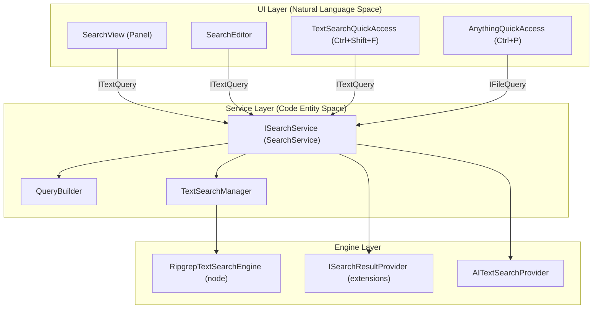
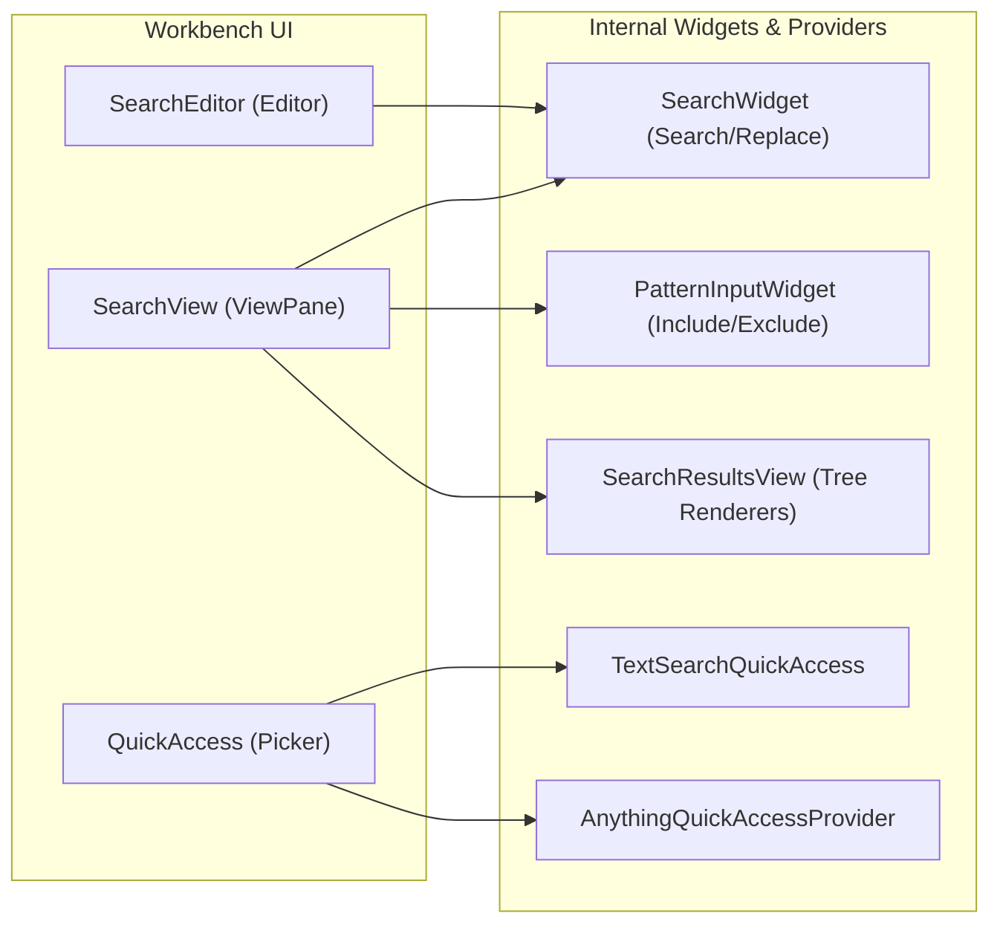

# Search

Relevant source files

The following files were used as context for generating this wiki page:

- [src/vs/base/common/fuzzyScorer.ts](https://github.com/microsoft/vscode/blob/HEAD/src/vs/base/common/fuzzyScorer.ts)
- [src/vs/base/test/common/fuzzyScorer.test.ts](https://github.com/microsoft/vscode/blob/HEAD/src/vs/base/test/common/fuzzyScorer.test.ts)
- [src/vs/editor/contrib/quickAccess/browser/editorNavigationQuickAccess.ts](https://github.com/microsoft/vscode/blob/HEAD/src/vs/editor/contrib/quickAccess/browser/editorNavigationQuickAccess.ts)
- [src/vs/editor/contrib/quickAccess/browser/gotoLineQuickAccess.ts](https://github.com/microsoft/vscode/blob/HEAD/src/vs/editor/contrib/quickAccess/browser/gotoLineQuickAccess.ts)
- [src/vs/editor/contrib/quickAccess/browser/gotoSymbolQuickAccess.ts](https://github.com/microsoft/vscode/blob/HEAD/src/vs/editor/contrib/quickAccess/browser/gotoSymbolQuickAccess.ts)
- [src/vs/editor/contrib/quickAccess/test/browser/gotoLineQuickAccess.test.ts](https://github.com/microsoft/vscode/blob/HEAD/src/vs/editor/contrib/quickAccess/test/browser/gotoLineQuickAccess.test.ts)
- [src/vs/editor/standalone/browser/quickAccess/standaloneCommandsQuickAccess.ts](https://github.com/microsoft/vscode/blob/HEAD/src/vs/editor/standalone/browser/quickAccess/standaloneCommandsQuickAccess.ts)
- [src/vs/editor/standalone/browser/quickAccess/standaloneGotoLineQuickAccess.ts](https://github.com/microsoft/vscode/blob/HEAD/src/vs/editor/standalone/browser/quickAccess/standaloneGotoLineQuickAccess.ts)
- [src/vs/editor/standalone/browser/quickAccess/standaloneGotoSymbolQuickAccess.ts](https://github.com/microsoft/vscode/blob/HEAD/src/vs/editor/standalone/browser/quickAccess/standaloneGotoSymbolQuickAccess.ts)
- [src/vs/editor/standalone/browser/quickAccess/standaloneHelpQuickAccess.ts](https://github.com/microsoft/vscode/blob/HEAD/src/vs/editor/standalone/browser/quickAccess/standaloneHelpQuickAccess.ts)
- [src/vs/platform/quickinput/browser/commandsQuickAccess.ts](https://github.com/microsoft/vscode/blob/HEAD/src/vs/platform/quickinput/browser/commandsQuickAccess.ts)
- [src/vs/platform/quickinput/browser/helpQuickAccess.ts](https://github.com/microsoft/vscode/blob/HEAD/src/vs/platform/quickinput/browser/helpQuickAccess.ts)
- [src/vs/platform/quickinput/browser/pickerQuickAccess.ts](https://github.com/microsoft/vscode/blob/HEAD/src/vs/platform/quickinput/browser/pickerQuickAccess.ts)
- [src/vs/platform/quickinput/browser/quickAccess.ts](https://github.com/microsoft/vscode/blob/HEAD/src/vs/platform/quickinput/browser/quickAccess.ts)
- [src/vs/platform/quickinput/common/quickAccess.ts](https://github.com/microsoft/vscode/blob/HEAD/src/vs/platform/quickinput/common/quickAccess.ts)
- [src/vs/workbench/api/browser/mainThreadSearch.ts](https://github.com/microsoft/vscode/blob/HEAD/src/vs/workbench/api/browser/mainThreadSearch.ts)
- [src/vs/workbench/api/common/extHostSearch.ts](https://github.com/microsoft/vscode/blob/HEAD/src/vs/workbench/api/common/extHostSearch.ts)
- [src/vs/workbench/api/node/extHostSearch.ts](https://github.com/microsoft/vscode/blob/HEAD/src/vs/workbench/api/node/extHostSearch.ts)
- [src/vs/workbench/api/test/node/extHostSearch.test.ts](https://github.com/microsoft/vscode/blob/HEAD/src/vs/workbench/api/test/node/extHostSearch.test.ts)
- [src/vs/workbench/browser/parts/editor/editorQuickAccess.ts](https://github.com/microsoft/vscode/blob/HEAD/src/vs/workbench/browser/parts/editor/editorQuickAccess.ts)
- [src/vs/workbench/browser/quickaccess.ts](https://github.com/microsoft/vscode/blob/HEAD/src/vs/workbench/browser/quickaccess.ts)
- [src/vs/workbench/contrib/codeEditor/browser/quickaccess/gotoLineQuickAccess.ts](https://github.com/microsoft/vscode/blob/HEAD/src/vs/workbench/contrib/codeEditor/browser/quickaccess/gotoLineQuickAccess.ts)
- [src/vs/workbench/contrib/codeEditor/browser/quickaccess/gotoSymbolQuickAccess.ts](https://github.com/microsoft/vscode/blob/HEAD/src/vs/workbench/contrib/codeEditor/browser/quickaccess/gotoSymbolQuickAccess.ts)
- [src/vs/workbench/contrib/quickaccess/browser/commandsQuickAccess.ts](https://github.com/microsoft/vscode/blob/HEAD/src/vs/workbench/contrib/quickaccess/browser/commandsQuickAccess.ts)
- [src/vs/workbench/contrib/quickaccess/browser/quickAccess.contribution.ts](https://github.com/microsoft/vscode/blob/HEAD/src/vs/workbench/contrib/quickaccess/browser/quickAccess.contribution.ts)
- [src/vs/workbench/contrib/quickaccess/browser/viewQuickAccess.ts](https://github.com/microsoft/vscode/blob/HEAD/src/vs/workbench/contrib/quickaccess/browser/viewQuickAccess.ts)
- [src/vs/workbench/contrib/search/browser/anythingQuickAccess.ts](https://github.com/microsoft/vscode/blob/HEAD/src/vs/workbench/contrib/search/browser/anythingQuickAccess.ts)
- [src/vs/workbench/contrib/search/browser/quickTextSearch/textSearchQuickAccess.ts](https://github.com/microsoft/vscode/blob/HEAD/src/vs/workbench/contrib/search/browser/quickTextSearch/textSearchQuickAccess.ts)
- [src/vs/workbench/contrib/search/browser/search.contribution.ts](https://github.com/microsoft/vscode/blob/HEAD/src/vs/workbench/contrib/search/browser/search.contribution.ts)
- [src/vs/workbench/contrib/search/browser/searchActionsBase.ts](https://github.com/microsoft/vscode/blob/HEAD/src/vs/workbench/contrib/search/browser/searchActionsBase.ts)
- [src/vs/workbench/contrib/search/browser/searchActionsCopy.ts](https://github.com/microsoft/vscode/blob/HEAD/src/vs/workbench/contrib/search/browser/searchActionsCopy.ts)
- [src/vs/workbench/contrib/search/browser/searchActionsFind.ts](https://github.com/microsoft/vscode/blob/HEAD/src/vs/workbench/contrib/search/browser/searchActionsFind.ts)
- [src/vs/workbench/contrib/search/browser/searchActionsNav.ts](https://github.com/microsoft/vscode/blob/HEAD/src/vs/workbench/contrib/search/browser/searchActionsNav.ts)
- [src/vs/workbench/contrib/search/browser/searchActionsRemoveReplace.ts](https://github.com/microsoft/vscode/blob/HEAD/src/vs/workbench/contrib/search/browser/searchActionsRemoveReplace.ts)
- [src/vs/workbench/contrib/search/browser/searchActionsTopBar.ts](https://github.com/microsoft/vscode/blob/HEAD/src/vs/workbench/contrib/search/browser/searchActionsTopBar.ts)
- [src/vs/workbench/contrib/search/browser/searchIcons.ts](https://github.com/microsoft/vscode/blob/HEAD/src/vs/workbench/contrib/search/browser/searchIcons.ts)
- [src/vs/workbench/contrib/search/browser/searchResultsView.ts](https://github.com/microsoft/vscode/blob/HEAD/src/vs/workbench/contrib/search/browser/searchResultsView.ts)
- [src/vs/workbench/contrib/search/browser/searchView.ts](https://github.com/microsoft/vscode/blob/HEAD/src/vs/workbench/contrib/search/browser/searchView.ts)
- [src/vs/workbench/contrib/search/browser/symbolsQuickAccess.ts](https://github.com/microsoft/vscode/blob/HEAD/src/vs/workbench/contrib/search/browser/symbolsQuickAccess.ts)
- [src/vs/workbench/contrib/search/common/constants.ts](https://github.com/microsoft/vscode/blob/HEAD/src/vs/workbench/contrib/search/common/constants.ts)
- [src/vs/workbench/electron-browser/actions/media/actions.css](https://github.com/microsoft/vscode/blob/HEAD/src/vs/workbench/electron-browser/actions/media/actions.css)
- [src/vs/workbench/electron-browser/actions/windowActions.ts](https://github.com/microsoft/vscode/blob/HEAD/src/vs/workbench/electron-browser/actions/windowActions.ts)
- [src/vs/workbench/services/search/common/fileSearchManager.ts](https://github.com/microsoft/vscode/blob/HEAD/src/vs/workbench/services/search/common/fileSearchManager.ts)
- [src/vs/workbench/services/search/common/ignoreFile.ts](https://github.com/microsoft/vscode/blob/HEAD/src/vs/workbench/services/search/common/ignoreFile.ts)
- [src/vs/workbench/services/search/common/queryBuilder.ts](https://github.com/microsoft/vscode/blob/HEAD/src/vs/workbench/services/search/common/queryBuilder.ts)
- [src/vs/workbench/services/search/common/replace.ts](https://github.com/microsoft/vscode/blob/HEAD/src/vs/workbench/services/search/common/replace.ts)
- [src/vs/workbench/services/search/common/search.ts](https://github.com/microsoft/vscode/blob/HEAD/src/vs/workbench/services/search/common/search.ts)
- [src/vs/workbench/services/search/common/searchExtConversionTypes.ts](https://github.com/microsoft/vscode/blob/HEAD/src/vs/workbench/services/search/common/searchExtConversionTypes.ts)
- [src/vs/workbench/services/search/common/searchExtTypes.ts](https://github.com/microsoft/vscode/blob/HEAD/src/vs/workbench/services/search/common/searchExtTypes.ts)
- [src/vs/workbench/services/search/common/searchService.ts](https://github.com/microsoft/vscode/blob/HEAD/src/vs/workbench/services/search/common/searchService.ts)
- [src/vs/workbench/services/search/common/textSearchManager.ts](https://github.com/microsoft/vscode/blob/HEAD/src/vs/workbench/services/search/common/textSearchManager.ts)
- [src/vs/workbench/services/search/electron-browser/searchService.ts](https://github.com/microsoft/vscode/blob/HEAD/src/vs/workbench/services/search/electron-browser/searchService.ts)
- [src/vs/workbench/services/search/node/fileSearch.ts](https://github.com/microsoft/vscode/blob/HEAD/src/vs/workbench/services/search/node/fileSearch.ts)
- [src/vs/workbench/services/search/node/rawSearchService.ts](https://github.com/microsoft/vscode/blob/HEAD/src/vs/workbench/services/search/node/rawSearchService.ts)
- [src/vs/workbench/services/search/node/ripgrepFileSearch.ts](https://github.com/microsoft/vscode/blob/HEAD/src/vs/workbench/services/search/node/ripgrepFileSearch.ts)
- [src/vs/workbench/services/search/node/ripgrepSearchProvider.ts](https://github.com/microsoft/vscode/blob/HEAD/src/vs/workbench/services/search/node/ripgrepSearchProvider.ts)
- [src/vs/workbench/services/search/node/ripgrepSearchUtils.ts](https://github.com/microsoft/vscode/blob/HEAD/src/vs/workbench/services/search/node/ripgrepSearchUtils.ts)
- [src/vs/workbench/services/search/node/ripgrepTextSearchEngine.ts](https://github.com/microsoft/vscode/blob/HEAD/src/vs/workbench/services/search/node/ripgrepTextSearchEngine.ts)
- [src/vs/workbench/services/search/test/browser/queryBuilder.test.ts](https://github.com/microsoft/vscode/blob/HEAD/src/vs/workbench/services/search/test/browser/queryBuilder.test.ts)
- [src/vs/workbench/services/search/test/common/ignoreFile.test.ts](https://github.com/microsoft/vscode/blob/HEAD/src/vs/workbench/services/search/test/common/ignoreFile.test.ts)
- [src/vs/workbench/services/search/test/common/queryBuilder.test.ts](https://github.com/microsoft/vscode/blob/HEAD/src/vs/workbench/services/search/test/common/queryBuilder.test.ts)
- [src/vs/workbench/services/search/test/common/replace.test.ts](https://github.com/microsoft/vscode/blob/HEAD/src/vs/workbench/services/search/test/common/replace.test.ts)
- [src/vs/workbench/services/search/test/node/ripgrepTextSearchEngineUtils.test.ts](https://github.com/microsoft/vscode/blob/HEAD/src/vs/workbench/services/search/test/node/ripgrepTextSearchEngineUtils.test.ts)
- [src/vs/workbench/services/search/test/node/textSearch.integrationTest.ts](https://github.com/microsoft/vscode/blob/HEAD/src/vs/workbench/services/search/test/node/textSearch.integrationTest.ts)
- [src/vs/workbench/services/search/test/node/textSearchManager.test.ts](https://github.com/microsoft/vscode/blob/HEAD/src/vs/workbench/services/search/test/node/textSearchManager.test.ts)
- [src/vscode-dts/vscode.proposed.aiTextSearchProvider.d.ts](https://github.com/microsoft/vscode/blob/HEAD/src/vscode-dts/vscode.proposed.aiTextSearchProvider.d.ts)

The search subsystem provides comprehensive capabilities for locating data across the workspace, including full-text search, file name search, and symbol search. It is divided into a high-level UI layer (the Search View and Search Editors) and a backend service layer that orchestrates various search engines and providers.

## Architecture Overview

The search system follows a provider-based architecture where the `ISearchService` acts as the central coordinator [src/vs/workbench/services/search/common/search.ts:40-45](https://github.com/microsoft/vscode/blob/HEAD/src/vs/workbench/services/search/common/search.ts#L40-L45). It dispatches queries to different engines depending on the resource scheme (e.g., `file`, `vscode-remote`) and the search type (text, file, or AI-powered) [src/vs/workbench/services/search/common/search.ts:60-64](https://github.com/microsoft/vscode/blob/HEAD/src/vs/workbench/services/search/common/search.ts#L60-L64).

### Search Process Flow

The following diagram illustrates how a search request moves from the UI through the `SearchService` to the actual search engines.

**Search Request Pipeline**

**Sources:** [src/vs/workbench/services/search/common/search.ts:45-55](https://github.com/microsoft/vscode/blob/HEAD/src/vs/workbench/services/search/common/search.ts#L45-L55), [src/vs/workbench/contrib/search/browser/searchView.ts:74-80](https://github.com/microsoft/vscode/blob/HEAD/src/vs/workbench/contrib/search/browser/searchView.ts#L74-L80), [src/vs/workbench/contrib/search/browser/search.contribution.ts:87-99](https://github.com/microsoft/vscode/blob/HEAD/src/vs/workbench/contrib/search/browser/search.contribution.ts#L87-L99), [src/vs/workbench/services/search/common/searchService.ts:82-91](https://github.com/microsoft/vscode/blob/HEAD/src/vs/workbench/services/search/common/searchService.ts#L82-L91), [src/vs/workbench/services/search/node/ripgrepTextSearchEngine.ts:78-83](https://github.com/microsoft/vscode/blob/HEAD/src/vs/workbench/services/search/node/ripgrepTextSearchEngine.ts#L78-L83)

## Search Service and Engines

The `ISearchService` is the primary entry point for programmatic search. It abstracts away the complexity of multi-root workspaces and different storage backends by managing a registry of providers for different URI schemes [src/vs/workbench/services/search/common/searchService.ts:32-39](https://github.com/microsoft/vscode/blob/HEAD/src/vs/workbench/services/search/common/searchService.ts#L32-L39).

*   **ISearchService**: Defines the contract for `textSearch`, `fileSearch`, and `aiTextSearch` [src/vs/workbench/services/search/common/search.ts:45-55](https://github.com/microsoft/vscode/blob/HEAD/src/vs/workbench/services/search/common/search.ts#L45-L55). It handles synchronization between "sync" results (from dirty/untitled files) and "async" results (from the file system) via `textSearchSplitSyncAsync` [src/vs/workbench/services/search/common/searchService.ts:116-125](https://github.com/microsoft/vscode/blob/HEAD/src/vs/workbench/services/search/common/searchService.ts#L116-L125).
*   **QueryBuilder**: A utility class used to transform UI state (like include/exclude patterns and `search.exclude` configurations) into formal `ITextQuery` or `IFileQuery` objects [src/vs/workbench/services/search/common/queryBuilder.ts:121-131](https://github.com/microsoft/vscode/blob/HEAD/src/vs/workbench/services/search/common/queryBuilder.ts#L121-L131).
*   **Ripgrep Engine**: For local file systems, VS Code utilizes `ripgrep` to perform high-performance text searches, managed through the `RipgrepTextSearchEngine` which spawns the `rg` process [src/vs/workbench/services/search/node/ripgrepTextSearchEngine.ts:78-83](https://github.com/microsoft/vscode/blob/HEAD/src/vs/workbench/services/search/node/ripgrepTextSearchEngine.ts#L78-L83).
*   **Search Providers**: Extensions can register their own providers for specific schemes using `registerSearchResultProvider` [src/vs/workbench/services/search/common/searchService.ts:54-68](https://github.com/microsoft/vscode/blob/HEAD/src/vs/workbench/services/search/common/searchService.ts#L54-L68).

For details, see [Search Service and Engines](#11.1).

**Sources:** [src/vs/workbench/services/search/common/search.ts:40-71](https://github.com/microsoft/vscode/blob/HEAD/src/vs/workbench/services/search/common/search.ts#L40-L71), [src/vs/workbench/services/search/common/searchService.ts:28-52](https://github.com/microsoft/vscode/blob/HEAD/src/vs/workbench/services/search/common/searchService.ts#L28-L52), [src/vs/workbench/services/search/common/queryBuilder.ts:142-156](https://github.com/microsoft/vscode/blob/HEAD/src/vs/workbench/services/search/common/queryBuilder.ts#L142-L156)

## Search UI and Quick Access

The user interacts with search through several distinct UI components, primarily located in the `workbench.contrib.search` namespace.

*   **SearchView**: The standard search panel in the sidebar, registered under the ID `workbench.view.search` [src/vs/workbench/contrib/search/browser/search.contribution.ts:53-60](https://github.com/microsoft/vscode/blob/HEAD/src/vs/workbench/contrib/search/browser/search.contribution.ts#L53-L60). It uses a `SearchWidget` for input [src/vs/workbench/contrib/search/browser/searchView.ts:64-64](https://github.com/microsoft/vscode/blob/HEAD/src/vs/workbench/contrib/search/browser/searchView.ts#L64) and a `WorkbenchCompressibleAsyncDataTree` to display results [src/vs/workbench/contrib/search/browser/searchView.ts:42-42](https://github.com/microsoft/vscode/blob/HEAD/src/vs/workbench/contrib/search/browser/searchView.ts#L42).
*   **Search Editor**: A full-sized editor tab that allows for persistent search results. It supports the `.code-search` file extension [src/vs/workbench/contrib/search/browser/search.contribution.ts:109-109](https://github.com/microsoft/vscode/blob/HEAD/src/vs/workbench/contrib/search/browser/search.contribution.ts#L109).
*   **Quick Access**: Provides "Quick Open" functionality for text search via `TextSearchQuickAccess` [src/vs/workbench/contrib/search/browser/search.contribution.ts:87-99](https://github.com/microsoft/vscode/blob/HEAD/src/vs/workbench/contrib/search/browser/search.contribution.ts#L87-L99). Global file search is handled by `AnythingQuickAccessProvider` [src/vs/workbench/contrib/search/browser/anythingQuickAccess.ts:97-99](https://github.com/microsoft/vscode/blob/HEAD/src/vs/workbench/contrib/search/browser/anythingQuickAccess.ts#L97-L99).

### UI Component Mapping

**Search UI Components**

**Sources:** [src/vs/workbench/contrib/search/browser/searchView.ts:54-64](https://github.com/microsoft/vscode/blob/HEAD/src/vs/workbench/contrib/search/browser/searchView.ts#L54-L64), [src/vs/workbench/contrib/search/browser/searchResultsView.ts:79-101](https://github.com/microsoft/vscode/blob/HEAD/src/vs/workbench/contrib/search/browser/searchResultsView.ts#L79-L101), [src/vs/workbench/contrib/search/browser/search.contribution.ts:87-99](https://github.com/microsoft/vscode/blob/HEAD/src/vs/workbench/contrib/search/browser/search.contribution.ts#L87-L99), [src/vs/workbench/contrib/search/browser/searchWidget.ts:19-19](https://github.com/microsoft/vscode/blob/HEAD/src/vs/workbench/contrib/search/browser/searchWidget.ts#L19), [src/vs/workbench/contrib/search/browser/anythingQuickAccess.ts:97-99](https://github.com/microsoft/vscode/blob/HEAD/src/vs/workbench/contrib/search/browser/anythingQuickAccess.ts#L97-L99)

For details, see [Search UI and Quick Access](#11.2).

**Sources:** [src/vs/workbench/contrib/search/browser/search.contribution.ts:53-60](https://github.com/microsoft/vscode/blob/HEAD/src/vs/workbench/contrib/search/browser/search.contribution.ts#L53-L60), [src/vs/workbench/contrib/search/browser/searchWidget.ts:19-19](https://github.com/microsoft/vscode/blob/HEAD/src/vs/workbench/contrib/search/browser/searchWidget.ts#L19)

## Search Types and Data Models

| Search Type | Service Method | Primary Provider / Engine | Data Entity |
| :--- | :--- | :--- | :--- |
| **Text Search** | `textSearch()` | `SearchProviderType.text` | `ITextQuery` |
| **File Search** | `fileSearch()` | `SearchProviderType.file` | `IFileQuery` |
| **AI Search** | `aiTextSearch()` | `SearchProviderType.aiText` | `IAITextQuery` |
| **Symbol Search**| `getWorkspaceSymbols()` | `IWorkspaceSymbolProvider` | `IWorkspaceSymbol` |

**Sources:** [src/vs/workbench/services/search/common/search.ts:45-55](https://github.com/microsoft/vscode/blob/HEAD/src/vs/workbench/services/search/common/search.ts#L45-L55), [src/vs/workbench/services/search/common/search.ts:60-64](https://github.com/microsoft/vscode/blob/HEAD/src/vs/workbench/services/search/common/search.ts#L60-L64), [src/vs/workbench/contrib/search/common/search.ts:25-25](https://github.com/microsoft/vscode/blob/HEAD/src/vs/workbench/contrib/search/common/search.ts#L25)

## Key Files and Components

*   `ISearchService`: [src/vs/workbench/services/search/common/search.ts:40-45](https://github.com/microsoft/vscode/blob/HEAD/src/vs/workbench/services/search/common/search.ts#L40-L45)
*   `SearchService` (Implementation): [src/vs/workbench/services/search/common/searchService.ts:28-52](https://github.com/microsoft/vscode/blob/HEAD/src/vs/workbench/services/search/common/searchService.ts#L28-L52)
*   `SearchView`: [src/vs/workbench/contrib/search/browser/searchView.ts:74-80](https://github.com/microsoft/vscode/blob/HEAD/src/vs/workbench/contrib/search/browser/searchView.ts#L74-L80)
*   `TextSearchManager`: [src/vs/workbench/services/search/common/textSearchManager.ts:34-43](https://github.com/microsoft/vscode/blob/HEAD/src/vs/workbench/services/search/common/textSearchManager.ts#L34-L43)
*   `QueryBuilder`: [src/vs/workbench/services/search/common/queryBuilder.ts:121-131](https://github.com/microsoft/vscode/blob/HEAD/src/vs/workbench/services/search/common/queryBuilder.ts#L121-L131)
*   `FuzzyScorer`: [src/vs/base/common/fuzzyScorer.ts:25-25](https://github.com/microsoft/vscode/blob/HEAD/src/vs/base/common/fuzzyScorer.ts#L25)
*   `AnythingQuickAccessProvider`: [src/vs/workbench/contrib/search/browser/anythingQuickAccess.ts:99-113](https://github.com/microsoft/vscode/blob/HEAD/src/vs/workbench/contrib/search/browser/anythingQuickAccess.ts#L99-L113)
*   `TextSearchQuickAccess`: [src/vs/workbench/contrib/search/browser/quickTextSearch/textSearchQuickAccess.ts:56-98](https://github.com/microsoft/vscode/blob/HEAD/src/vs/workbench/contrib/search/browser/quickTextSearch/textSearchQuickAccess.ts#L56-L98)

## Child Pages
- [Search Service and Engines](#11.1)
- [Search UI and Quick Access](#11.2)