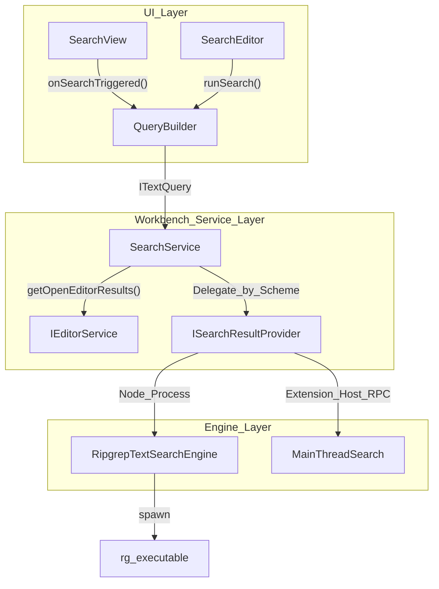
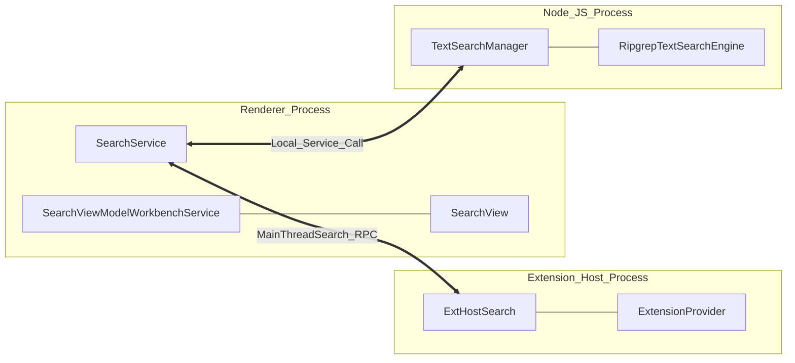

# Search Service and Engines

Relevant source files

The following files were used as context for generating this wiki page:

- [src/vs/workbench/api/browser/mainThreadSearch.ts](https://github.com/microsoft/vscode/blob/HEAD/src/vs/workbench/api/browser/mainThreadSearch.ts)
- [src/vs/workbench/api/common/extHostSearch.ts](https://github.com/microsoft/vscode/blob/HEAD/src/vs/workbench/api/common/extHostSearch.ts)
- [src/vs/workbench/api/node/extHostSearch.ts](https://github.com/microsoft/vscode/blob/HEAD/src/vs/workbench/api/node/extHostSearch.ts)
- [src/vs/workbench/api/test/node/extHostSearch.test.ts](https://github.com/microsoft/vscode/blob/HEAD/src/vs/workbench/api/test/node/extHostSearch.test.ts)
- [src/vs/workbench/contrib/search/browser/search.contribution.ts](https://github.com/microsoft/vscode/blob/HEAD/src/vs/workbench/contrib/search/browser/search.contribution.ts)
- [src/vs/workbench/contrib/search/browser/searchActionsBase.ts](https://github.com/microsoft/vscode/blob/HEAD/src/vs/workbench/contrib/search/browser/searchActionsBase.ts)
- [src/vs/workbench/contrib/search/browser/searchActionsCopy.ts](https://github.com/microsoft/vscode/blob/HEAD/src/vs/workbench/contrib/search/browser/searchActionsCopy.ts)
- [src/vs/workbench/contrib/search/browser/searchActionsFind.ts](https://github.com/microsoft/vscode/blob/HEAD/src/vs/workbench/contrib/search/browser/searchActionsFind.ts)
- [src/vs/workbench/contrib/search/browser/searchActionsNav.ts](https://github.com/microsoft/vscode/blob/HEAD/src/vs/workbench/contrib/search/browser/searchActionsNav.ts)
- [src/vs/workbench/contrib/search/browser/searchActionsRemoveReplace.ts](https://github.com/microsoft/vscode/blob/HEAD/src/vs/workbench/contrib/search/browser/searchActionsRemoveReplace.ts)
- [src/vs/workbench/contrib/search/browser/searchActionsTopBar.ts](https://github.com/microsoft/vscode/blob/HEAD/src/vs/workbench/contrib/search/browser/searchActionsTopBar.ts)
- [src/vs/workbench/contrib/search/browser/searchResultsView.ts](https://github.com/microsoft/vscode/blob/HEAD/src/vs/workbench/contrib/search/browser/searchResultsView.ts)
- [src/vs/workbench/contrib/search/browser/searchView.ts](https://github.com/microsoft/vscode/blob/HEAD/src/vs/workbench/contrib/search/browser/searchView.ts)
- [src/vs/workbench/contrib/search/common/constants.ts](https://github.com/microsoft/vscode/blob/HEAD/src/vs/workbench/contrib/search/common/constants.ts)
- [src/vs/workbench/services/search/common/fileSearchManager.ts](https://github.com/microsoft/vscode/blob/HEAD/src/vs/workbench/services/search/common/fileSearchManager.ts)
- [src/vs/workbench/services/search/common/ignoreFile.ts](https://github.com/microsoft/vscode/blob/HEAD/src/vs/workbench/services/search/common/ignoreFile.ts)
- [src/vs/workbench/services/search/common/queryBuilder.ts](https://github.com/microsoft/vscode/blob/HEAD/src/vs/workbench/services/search/common/queryBuilder.ts)
- [src/vs/workbench/services/search/common/replace.ts](https://github.com/microsoft/vscode/blob/HEAD/src/vs/workbench/services/search/common/replace.ts)
- [src/vs/workbench/services/search/common/search.ts](https://github.com/microsoft/vscode/blob/HEAD/src/vs/workbench/services/search/common/search.ts)
- [src/vs/workbench/services/search/common/searchExtConversionTypes.ts](https://github.com/microsoft/vscode/blob/HEAD/src/vs/workbench/services/search/common/searchExtConversionTypes.ts)
- [src/vs/workbench/services/search/common/searchExtTypes.ts](https://github.com/microsoft/vscode/blob/HEAD/src/vs/workbench/services/search/common/searchExtTypes.ts)
- [src/vs/workbench/services/search/common/searchService.ts](https://github.com/microsoft/vscode/blob/HEAD/src/vs/workbench/services/search/common/searchService.ts)
- [src/vs/workbench/services/search/common/textSearchManager.ts](https://github.com/microsoft/vscode/blob/HEAD/src/vs/workbench/services/search/common/textSearchManager.ts)
- [src/vs/workbench/services/search/electron-browser/searchService.ts](https://github.com/microsoft/vscode/blob/HEAD/src/vs/workbench/services/search/electron-browser/searchService.ts)
- [src/vs/workbench/services/search/node/fileSearch.ts](https://github.com/microsoft/vscode/blob/HEAD/src/vs/workbench/services/search/node/fileSearch.ts)
- [src/vs/workbench/services/search/node/rawSearchService.ts](https://github.com/microsoft/vscode/blob/HEAD/src/vs/workbench/services/search/node/rawSearchService.ts)
- [src/vs/workbench/services/search/node/ripgrepFileSearch.ts](https://github.com/microsoft/vscode/blob/HEAD/src/vs/workbench/services/search/node/ripgrepFileSearch.ts)
- [src/vs/workbench/services/search/node/ripgrepSearchProvider.ts](https://github.com/microsoft/vscode/blob/HEAD/src/vs/workbench/services/search/node/ripgrepSearchProvider.ts)
- [src/vs/workbench/services/search/node/ripgrepSearchUtils.ts](https://github.com/microsoft/vscode/blob/HEAD/src/vs/workbench/services/search/node/ripgrepSearchUtils.ts)
- [src/vs/workbench/services/search/node/ripgrepTextSearchEngine.ts](https://github.com/microsoft/vscode/blob/HEAD/src/vs/workbench/services/search/node/ripgrepTextSearchEngine.ts)
- [src/vs/workbench/services/search/test/browser/queryBuilder.test.ts](https://github.com/microsoft/vscode/blob/HEAD/src/vs/workbench/services/search/test/browser/queryBuilder.test.ts)
- [src/vs/workbench/services/search/test/common/ignoreFile.test.ts](https://github.com/microsoft/vscode/blob/HEAD/src/vs/workbench/services/search/test/common/ignoreFile.test.ts)
- [src/vs/workbench/services/search/test/common/queryBuilder.test.ts](https://github.com/microsoft/vscode/blob/HEAD/src/vs/workbench/services/search/test/common/queryBuilder.test.ts)
- [src/vs/workbench/services/search/test/common/replace.test.ts](https://github.com/microsoft/vscode/blob/HEAD/src/vs/workbench/services/search/test/common/replace.test.ts)
- [src/vs/workbench/services/search/test/node/ripgrepTextSearchEngineUtils.test.ts](https://github.com/microsoft/vscode/blob/HEAD/src/vs/workbench/services/search/test/node/ripgrepTextSearchEngineUtils.test.ts)
- [src/vs/workbench/services/search/test/node/textSearch.integrationTest.ts](https://github.com/microsoft/vscode/blob/HEAD/src/vs/workbench/services/search/test/node/textSearch.integrationTest.ts)
- [src/vs/workbench/services/search/test/node/textSearchManager.test.ts](https://github.com/microsoft/vscode/blob/HEAD/src/vs/workbench/services/search/test/node/textSearchManager.test.ts)
- [src/vscode-dts/vscode.proposed.aiTextSearchProvider.d.ts](https://github.com/microsoft/vscode/blob/HEAD/src/vscode-dts/vscode.proposed.aiTextSearchProvider.d.ts)

The search subsystem provides the infrastructure for full-text, file-name, and semantic searching across the workspace. It manages the lifecycle of search queries, coordinates between local and remote search providers (including the ripgrep-powered engine), and powers both the Search View and Search Editors.

## ISearchService and Architecture

`ISearchService` is the primary entry point for search operations in the workbench. It abstracts away whether a search is performed on the local disk, over a remote connection, or via an extension-contributed provider [src/vs/workbench/services/search/common/search.ts:40-40](https://github.com/microsoft/vscode/blob/HEAD/src/vs/workbench/services/search/common/search.ts#L40).

### Core Implementation
The `SearchService` class implements the `ISearchService` interface and manages multiple maps of providers categorized by URI scheme [src/vs/workbench/services/search/common/searchService.ts:28-38](https://github.com/microsoft/vscode/blob/HEAD/src/vs/workbench/services/search/common/searchService.ts#L28-L38).

- **Text Search**: Performed via `textSearch` which aggregates results from providers [src/vs/workbench/services/search/common/searchService.ts:82-91](https://github.com/microsoft/vscode/blob/HEAD/src/vs/workbench/services/search/common/searchService.ts#L82-L91). It splits results between synchronous results (from dirty/untitled `IModel` buffers in open editors) and asynchronous results from the disk via `textSearchSplitSyncAsync` [src/vs/workbench/services/search/common/searchService.ts:116-125](https://github.com/microsoft/vscode/blob/HEAD/src/vs/workbench/services/search/common/searchService.ts#L116-L125).
- **File Search**: Performed via `fileSearch` to locate files by name or pattern [src/vs/workbench/services/search/common/searchService.ts:167-167](https://github.com/microsoft/vscode/blob/HEAD/src/vs/workbench/services/search/common/searchService.ts#L167).
- **AI Search**: A capability for semantic search via `aiTextSearch` which uses specialized providers and can return AI-specific metadata like `AISearchKeyword` [src/vs/workbench/services/search/common/searchService.ts:93-109](https://github.com/microsoft/vscode/blob/HEAD/src/vs/workbench/services/search/common/searchService.ts#L93-L109), [src/vs/workbench/services/search/common/searchExtTypes.ts:74-74](https://github.com/microsoft/vscode/blob/HEAD/src/vs/workbench/services/search/common/searchExtTypes.ts#L74).

### Search Service Data Flow
The following diagram illustrates how a search request flows from the UI through the `ISearchService` to the underlying engines.

**Search Request Pipeline**

Sources: [src/vs/workbench/services/search/common/search.ts:45-55](https://github.com/microsoft/vscode/blob/HEAD/src/vs/workbench/services/search/common/search.ts#L45-L55), [src/vs/workbench/contrib/search/browser/searchView.ts:82-100](https://github.com/microsoft/vscode/blob/HEAD/src/vs/workbench/contrib/search/browser/searchView.ts#L82-L100), [src/vs/workbench/services/search/common/searchService.ts:82-109](https://github.com/microsoft/vscode/blob/HEAD/src/vs/workbench/services/search/common/searchService.ts#L82-L109), [src/vs/workbench/services/search/common/queryBuilder.ts:121-131](https://github.com/microsoft/vscode/blob/HEAD/src/vs/workbench/services/search/common/queryBuilder.ts#L121-L131)

## Query Construction

Before a search is executed, the `QueryBuilder` translates UI state (input boxes, include/exclude patterns) into a formal `ISearchQuery`.

### Key Components
- **`QueryBuilder`**: Converts workbench configuration and user input into `ITextQuery`, `IFileQuery`, or `IAITextQuery` [src/vs/workbench/services/search/common/queryBuilder.ts:121-140](https://github.com/microsoft/vscode/blob/HEAD/src/vs/workbench/services/search/common/queryBuilder.ts#L121-L140).
- **Glob Handling**: Handles the complex logic of merging `search.exclude` and `files.exclude` settings with user-provided patterns [src/vs/workbench/contrib/search/browser/search.contribution.ts:106-130](https://github.com/microsoft/vscode/blob/HEAD/src/vs/workbench/contrib/search/browser/search.contribution.ts#L106-L130). 
- **Folder Queries**: Supports multi-root workspaces by generating an array of `IFolderQuery` objects, each potentially having its own ignore rules and encoding [src/vs/workbench/services/search/common/search.ts:79-90](https://github.com/microsoft/vscode/blob/HEAD/src/vs/workbench/services/search/common/search.ts#L79-L90).

Sources: [src/vs/workbench/services/search/common/queryBuilder.ts:142-156](https://github.com/microsoft/vscode/blob/HEAD/src/vs/workbench/services/search/common/queryBuilder.ts#L142-L156), [src/vs/workbench/services/search/common/search.ts:151-160](https://github.com/microsoft/vscode/blob/HEAD/src/vs/workbench/services/search/common/search.ts#L151-L160), [src/vs/workbench/contrib/search/browser/search.contribution.ts:106-130](https://github.com/microsoft/vscode/blob/HEAD/src/vs/workbench/contrib/search/browser/search.contribution.ts#L106-L130)

## Ripgrep Search Engine

For local file systems, VS Code utilizes `ripgrep` via the `RipgrepTextSearchEngine`. This engine spawns the `rg` binary and parses its output to provide high-performance text search.

- **Process Spawning**: The engine uses `child_process.spawn` to execute the ripgrep binary (located via `rgDiskPath`) with arguments derived from the search query [src/vs/workbench/services/search/node/ripgrepTextSearchEngine.ts:78-78](https://github.com/microsoft/vscode/blob/HEAD/src/vs/workbench/services/search/node/ripgrepTextSearchEngine.ts#L78), [src/vs/workbench/services/search/node/ripgrepTextSearchEngine.ts:60-60](https://github.com/microsoft/vscode/blob/HEAD/src/vs/workbench/services/search/node/ripgrepTextSearchEngine.ts#L60).
- **Argument Generation**: `getRgArgs` converts VS Code search options (like `isRegExp`, `isCaseSensitive`, and `includePattern`) into ripgrep CLI flags [src/vs/workbench/services/search/node/ripgrepTextSearchEngine.ts:69-69](https://github.com/microsoft/vscode/blob/HEAD/src/vs/workbench/services/search/node/ripgrepTextSearchEngine.ts#L69).
- **Parsing**: `RipgrepParser` processes the `stdout` of the `rg` process, converting the raw text into `TextSearchResult2` objects [src/vs/workbench/services/search/node/ripgrepTextSearchEngine.ts:86-91](https://github.com/microsoft/vscode/blob/HEAD/src/vs/workbench/services/search/node/ripgrepTextSearchEngine.ts#L86-L91).

Sources: [src/vs/workbench/services/search/node/ripgrepTextSearchEngine.ts:24-48](https://github.com/microsoft/vscode/blob/HEAD/src/vs/workbench/services/search/node/ripgrepTextSearchEngine.ts#L24-L48), [src/vs/workbench/services/search/node/ripgrepTextSearchEngine.ts:109-114](https://github.com/microsoft/vscode/blob/HEAD/src/vs/workbench/services/search/node/ripgrepTextSearchEngine.ts#L109-L114)

## Search Management and UI Integration

Search results are managed through a tree model that facilitates rendering in the sidebar or panels.

### ViewModel and Providers
- **`ISearchViewModelWorkbenchService`**: Manages the lifecycle of the search model used by the UI [src/vs/workbench/contrib/search/browser/search.contribution.ts:43-43](https://github.com/microsoft/vscode/blob/HEAD/src/vs/workbench/contrib/search/browser/search.contribution.ts#L43).
- **`SearchModel`**: Orchestrates results, including `FileMatch` and `Match` objects. The UI uses `ISearchTreeMatch`, `ISearchTreeFileMatch`, and `ISearchTreeFolderMatch` interfaces for rendering [src/vs/workbench/contrib/search/browser/searchResultsView.ts:36-36](https://github.com/microsoft/vscode/blob/HEAD/src/vs/workbench/contrib/search/browser/searchResultsView.ts#L36).
- **Limit Enforcement**: The system enforces a default limit of 20,000 results via `DEFAULT_MAX_SEARCH_RESULTS` [src/vs/workbench/services/search/common/search.ts:32-32](https://github.com/microsoft/vscode/blob/HEAD/src/vs/workbench/services/search/common/search.ts#L32). `TextSearchManager` also enforces limits during the search process [src/vs/workbench/services/search/common/textSearchManager.ts:68-74](https://github.com/microsoft/vscode/blob/HEAD/src/vs/workbench/services/search/common/textSearchManager.ts#L68-L74).

### UI Rendering
The `SearchView` uses a `WorkbenchCompressibleAsyncDataTree` to display results [src/vs/workbench/contrib/search/browser/searchView.ts:42-42](https://github.com/microsoft/vscode/blob/HEAD/src/vs/workbench/contrib/search/browser/searchView.ts#L42). Rendering is handled by specific classes:
- **`FolderMatchRenderer`**: Renders folder nodes in the search tree [src/vs/workbench/contrib/search/browser/searchResultsView.ts:63-63](https://github.com/microsoft/vscode/blob/HEAD/src/vs/workbench/contrib/search/browser/searchResultsView.ts#L63).
- **`FileMatchRenderer`**: Renders file nodes with result counts [src/vs/workbench/contrib/search/browser/searchResultsView.ts:90-91](https://github.com/microsoft/vscode/blob/HEAD/src/vs/workbench/contrib/search/browser/searchResultsView.ts#L90-L91).
- **`MatchRenderer`**: Renders individual line matches with syntax highlighting and context [src/vs/workbench/contrib/search/browser/searchResultsView.ts:92-93](https://github.com/microsoft/vscode/blob/HEAD/src/vs/workbench/contrib/search/browser/searchResultsView.ts#L92-L93).
- **`TextSearchResultRenderer`**: Renders headings for result categories (e.g., AI Results vs Plain Text) [src/vs/workbench/contrib/search/browser/searchResultsView.ts:103-106](https://github.com/microsoft/vscode/blob/HEAD/src/vs/workbench/contrib/search/browser/searchResultsView.ts#L103-L106).

Sources: [src/vs/workbench/contrib/search/browser/searchView.ts:18-20](https://github.com/microsoft/vscode/blob/HEAD/src/vs/workbench/contrib/search/browser/searchView.ts#L18-L20), [src/vs/workbench/contrib/search/browser/searchResultsView.ts:79-101](https://github.com/microsoft/vscode/blob/HEAD/src/vs/workbench/contrib/search/browser/searchResultsView.ts#L79-L101), [src/vs/workbench/contrib/search/browser/search.contribution.ts:53-82](https://github.com/microsoft/vscode/blob/HEAD/src/vs/workbench/contrib/search/browser/search.contribution.ts#L53-L82)

## Search Service IPC Architecture

Search often runs across process boundaries, particularly when interacting with extensions or the local file system.

**Search Entity Process Mapping**

Sources: [src/vs/workbench/services/search/common/search.ts:40-55](https://github.com/microsoft/vscode/blob/HEAD/src/vs/workbench/services/search/common/search.ts#L40-L55), [src/vs/workbench/services/search/common/textSearchManager.ts:34-43](https://github.com/microsoft/vscode/blob/HEAD/src/vs/workbench/services/search/common/textSearchManager.ts#L34-L43), [src/vs/workbench/contrib/search/browser/search.contribution.ts:43-43](https://github.com/microsoft/vscode/blob/HEAD/src/vs/workbench/contrib/search/browser/search.contribution.ts#L43)

## Search Actions and Commands

The search subsystem contributes numerous commands for navigating and manipulating results.

- **Navigation**: Commands like `search.action.focusNextSearchResult` and `search.action.focusPreviousSearchResult` allow keyboard-driven navigation [src/vs/workbench/contrib/search/common/constants.ts:36-37](https://github.com/microsoft/vscode/blob/HEAD/src/vs/workbench/contrib/search/common/constants.ts#L36-L37).
- **Manipulation**: Users can remove results (`search.action.remove`) or replace text globally (`search.action.replace`, `search.action.replaceAllInFile`) [src/vs/workbench/contrib/search/common/constants.ts:14-23](https://github.com/microsoft/vscode/blob/HEAD/src/vs/workbench/contrib/search/common/constants.ts#L14-L23).
- **View Toggles**: Actions to switch between tree and list views (`search.action.viewAsTree`, `search.action.viewAsList`) [src/vs/workbench/contrib/search/browser/searchActionsTopBar.ts:158-183](https://github.com/microsoft/vscode/blob/HEAD/src/vs/workbench/contrib/search/browser/searchActionsTopBar.ts#L158-L183).
- **Contextual Actions**: Actions like `Restrict Search to Folder` or `Exclude Folder from Search` are available via the `SearchContext` menu [src/vs/workbench/contrib/search/browser/searchActionsFind.ts:36-106](https://github.com/microsoft/vscode/blob/HEAD/src/vs/workbench/contrib/search/browser/searchActionsFind.ts#L36-L106).

Sources: [src/vs/workbench/contrib/search/common/constants.ts:8-58](https://github.com/microsoft/vscode/blob/HEAD/src/vs/workbench/contrib/search/common/constants.ts#L8-L58), [src/vs/workbench/contrib/search/browser/searchActionsTopBar.ts:24-155](https://github.com/microsoft/vscode/blob/HEAD/src/vs/workbench/contrib/search/browser/searchActionsTopBar.ts#L24-L155), [src/vs/workbench/contrib/search/browser/searchActionsFind.ts:36-150](https://github.com/microsoft/vscode/blob/HEAD/src/vs/workbench/contrib/search/browser/searchActionsFind.ts#L36-L150)