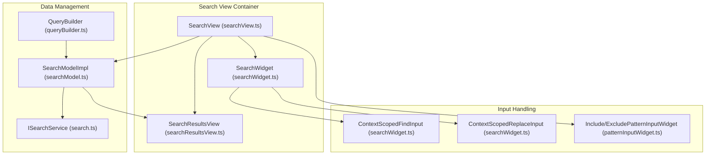
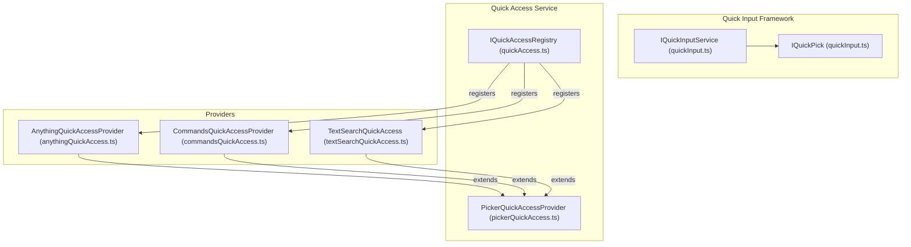
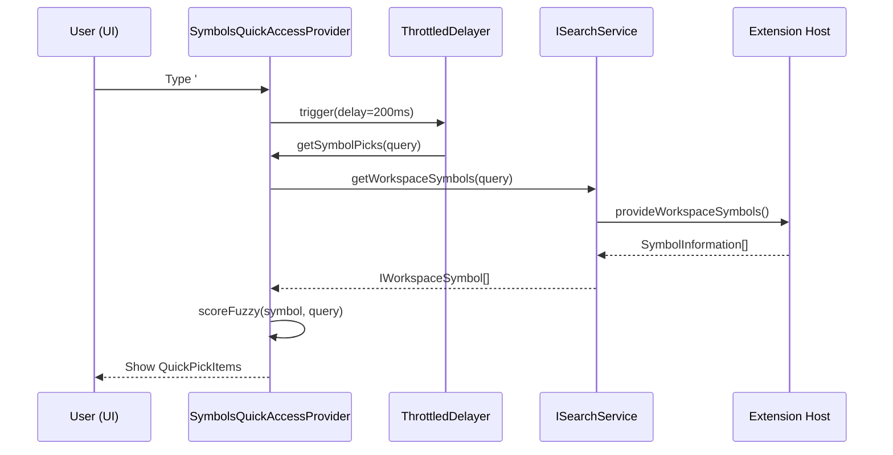

# Search UI and Quick Access

Relevant source files

The following files were used as context for generating this wiki page:

- [src/vs/base/common/fuzzyScorer.ts](https://github.com/microsoft/vscode/blob/HEAD/src/vs/base/common/fuzzyScorer.ts)
- [src/vs/base/test/common/fuzzyScorer.test.ts](https://github.com/microsoft/vscode/blob/HEAD/src/vs/base/test/common/fuzzyScorer.test.ts)
- [src/vs/editor/contrib/quickAccess/browser/editorNavigationQuickAccess.ts](https://github.com/microsoft/vscode/blob/HEAD/src/vs/editor/contrib/quickAccess/browser/editorNavigationQuickAccess.ts)
- [src/vs/editor/contrib/quickAccess/browser/gotoLineQuickAccess.ts](https://github.com/microsoft/vscode/blob/HEAD/src/vs/editor/contrib/quickAccess/browser/gotoLineQuickAccess.ts)
- [src/vs/editor/contrib/quickAccess/browser/gotoSymbolQuickAccess.ts](https://github.com/microsoft/vscode/blob/HEAD/src/vs/editor/contrib/quickAccess/browser/gotoSymbolQuickAccess.ts)
- [src/vs/editor/contrib/quickAccess/test/browser/gotoLineQuickAccess.test.ts](https://github.com/microsoft/vscode/blob/HEAD/src/vs/editor/contrib/quickAccess/test/browser/gotoLineQuickAccess.test.ts)
- [src/vs/editor/standalone/browser/quickAccess/standaloneCommandsQuickAccess.ts](https://github.com/microsoft/vscode/blob/HEAD/src/vs/editor/standalone/browser/quickAccess/standaloneCommandsQuickAccess.ts)
- [src/vs/editor/standalone/browser/quickAccess/standaloneGotoLineQuickAccess.ts](https://github.com/microsoft/vscode/blob/HEAD/src/vs/editor/standalone/browser/quickAccess/standaloneGotoLineQuickAccess.ts)
- [src/vs/editor/standalone/browser/quickAccess/standaloneGotoSymbolQuickAccess.ts](https://github.com/microsoft/vscode/blob/HEAD/src/vs/editor/standalone/browser/quickAccess/standaloneGotoSymbolQuickAccess.ts)
- [src/vs/editor/standalone/browser/quickAccess/standaloneHelpQuickAccess.ts](https://github.com/microsoft/vscode/blob/HEAD/src/vs/editor/standalone/browser/quickAccess/standaloneHelpQuickAccess.ts)
- [src/vs/platform/quickinput/browser/commandsQuickAccess.ts](https://github.com/microsoft/vscode/blob/HEAD/src/vs/platform/quickinput/browser/commandsQuickAccess.ts)
- [src/vs/platform/quickinput/browser/helpQuickAccess.ts](https://github.com/microsoft/vscode/blob/HEAD/src/vs/platform/quickinput/browser/helpQuickAccess.ts)
- [src/vs/platform/quickinput/browser/pickerQuickAccess.ts](https://github.com/microsoft/vscode/blob/HEAD/src/vs/platform/quickinput/browser/pickerQuickAccess.ts)
- [src/vs/platform/quickinput/browser/quickAccess.ts](https://github.com/microsoft/vscode/blob/HEAD/src/vs/platform/quickinput/browser/quickAccess.ts)
- [src/vs/platform/quickinput/common/quickAccess.ts](https://github.com/microsoft/vscode/blob/HEAD/src/vs/platform/quickinput/common/quickAccess.ts)
- [src/vs/workbench/browser/parts/editor/binaryEditor.ts](https://github.com/microsoft/vscode/blob/HEAD/src/vs/workbench/browser/parts/editor/binaryEditor.ts)
- [src/vs/workbench/browser/parts/editor/editorPane.ts](https://github.com/microsoft/vscode/blob/HEAD/src/vs/workbench/browser/parts/editor/editorPane.ts)
- [src/vs/workbench/browser/parts/editor/editorPanes.ts](https://github.com/microsoft/vscode/blob/HEAD/src/vs/workbench/browser/parts/editor/editorPanes.ts)
- [src/vs/workbench/browser/parts/editor/editorPlaceholder.ts](https://github.com/microsoft/vscode/blob/HEAD/src/vs/workbench/browser/parts/editor/editorPlaceholder.ts)
- [src/vs/workbench/browser/parts/editor/editorQuickAccess.ts](https://github.com/microsoft/vscode/blob/HEAD/src/vs/workbench/browser/parts/editor/editorQuickAccess.ts)
- [src/vs/workbench/browser/parts/editor/editorWithViewState.ts](https://github.com/microsoft/vscode/blob/HEAD/src/vs/workbench/browser/parts/editor/editorWithViewState.ts)
- [src/vs/workbench/browser/parts/editor/media/editorplaceholder.css](https://github.com/microsoft/vscode/blob/HEAD/src/vs/workbench/browser/parts/editor/media/editorplaceholder.css)
- [src/vs/workbench/browser/parts/editor/sideBySideEditor.ts](https://github.com/microsoft/vscode/blob/HEAD/src/vs/workbench/browser/parts/editor/sideBySideEditor.ts)
- [src/vs/workbench/browser/parts/editor/textCodeEditor.ts](https://github.com/microsoft/vscode/blob/HEAD/src/vs/workbench/browser/parts/editor/textCodeEditor.ts)
- [src/vs/workbench/browser/parts/editor/textDiffEditor.ts](https://github.com/microsoft/vscode/blob/HEAD/src/vs/workbench/browser/parts/editor/textDiffEditor.ts)
- [src/vs/workbench/browser/parts/editor/textEditor.ts](https://github.com/microsoft/vscode/blob/HEAD/src/vs/workbench/browser/parts/editor/textEditor.ts)
- [src/vs/workbench/browser/parts/editor/textResourceEditor.ts](https://github.com/microsoft/vscode/blob/HEAD/src/vs/workbench/browser/parts/editor/textResourceEditor.ts)
- [src/vs/workbench/browser/quickaccess.ts](https://github.com/microsoft/vscode/blob/HEAD/src/vs/workbench/browser/quickaccess.ts)
- [src/vs/workbench/contrib/codeEditor/browser/quickaccess/gotoLineQuickAccess.ts](https://github.com/microsoft/vscode/blob/HEAD/src/vs/workbench/contrib/codeEditor/browser/quickaccess/gotoLineQuickAccess.ts)
- [src/vs/workbench/contrib/codeEditor/browser/quickaccess/gotoSymbolQuickAccess.ts](https://github.com/microsoft/vscode/blob/HEAD/src/vs/workbench/contrib/codeEditor/browser/quickaccess/gotoSymbolQuickAccess.ts)
- [src/vs/workbench/contrib/files/browser/editors/binaryFileEditor.ts](https://github.com/microsoft/vscode/blob/HEAD/src/vs/workbench/contrib/files/browser/editors/binaryFileEditor.ts)
- [src/vs/workbench/contrib/files/browser/editors/textFileEditor.ts](https://github.com/microsoft/vscode/blob/HEAD/src/vs/workbench/contrib/files/browser/editors/textFileEditor.ts)
- [src/vs/workbench/contrib/quickaccess/browser/commandsQuickAccess.ts](https://github.com/microsoft/vscode/blob/HEAD/src/vs/workbench/contrib/quickaccess/browser/commandsQuickAccess.ts)
- [src/vs/workbench/contrib/quickaccess/browser/quickAccess.contribution.ts](https://github.com/microsoft/vscode/blob/HEAD/src/vs/workbench/contrib/quickaccess/browser/quickAccess.contribution.ts)
- [src/vs/workbench/contrib/quickaccess/browser/viewQuickAccess.ts](https://github.com/microsoft/vscode/blob/HEAD/src/vs/workbench/contrib/quickaccess/browser/viewQuickAccess.ts)
- [src/vs/workbench/contrib/search/browser/anythingQuickAccess.ts](https://github.com/microsoft/vscode/blob/HEAD/src/vs/workbench/contrib/search/browser/anythingQuickAccess.ts)
- [src/vs/workbench/contrib/search/browser/quickTextSearch/textSearchQuickAccess.ts](https://github.com/microsoft/vscode/blob/HEAD/src/vs/workbench/contrib/search/browser/quickTextSearch/textSearchQuickAccess.ts)
- [src/vs/workbench/contrib/search/browser/searchIcons.ts](https://github.com/microsoft/vscode/blob/HEAD/src/vs/workbench/contrib/search/browser/searchIcons.ts)
- [src/vs/workbench/contrib/search/browser/symbolsQuickAccess.ts](https://github.com/microsoft/vscode/blob/HEAD/src/vs/workbench/contrib/search/browser/symbolsQuickAccess.ts)
- [src/vs/workbench/contrib/searchEditor/browser/constants.ts](https://github.com/microsoft/vscode/blob/HEAD/src/vs/workbench/contrib/searchEditor/browser/constants.ts)
- [src/vs/workbench/contrib/searchEditor/browser/searchEditor.contribution.ts](https://github.com/microsoft/vscode/blob/HEAD/src/vs/workbench/contrib/searchEditor/browser/searchEditor.contribution.ts)
- [src/vs/workbench/contrib/searchEditor/browser/searchEditor.ts](https://github.com/microsoft/vscode/blob/HEAD/src/vs/workbench/contrib/searchEditor/browser/searchEditor.ts)
- [src/vs/workbench/contrib/searchEditor/browser/searchEditorActions.ts](https://github.com/microsoft/vscode/blob/HEAD/src/vs/workbench/contrib/searchEditor/browser/searchEditorActions.ts)
- [src/vs/workbench/contrib/searchEditor/browser/searchEditorInput.ts](https://github.com/microsoft/vscode/blob/HEAD/src/vs/workbench/contrib/searchEditor/browser/searchEditorInput.ts)
- [src/vs/workbench/contrib/searchEditor/browser/searchEditorModel.ts](https://github.com/microsoft/vscode/blob/HEAD/src/vs/workbench/contrib/searchEditor/browser/searchEditorModel.ts)
- [src/vs/workbench/contrib/searchEditor/browser/searchEditorSerialization.ts](https://github.com/microsoft/vscode/blob/HEAD/src/vs/workbench/contrib/searchEditor/browser/searchEditorSerialization.ts)
- [src/vs/workbench/electron-browser/actions/media/actions.css](https://github.com/microsoft/vscode/blob/HEAD/src/vs/workbench/electron-browser/actions/media/actions.css)
- [src/vs/workbench/electron-browser/actions/windowActions.ts](https://github.com/microsoft/vscode/blob/HEAD/src/vs/workbench/electron-browser/actions/windowActions.ts)
- [src/vs/workbench/services/history/browser/historyService.ts](https://github.com/microsoft/vscode/blob/HEAD/src/vs/workbench/services/history/browser/historyService.ts)
- [src/vs/workbench/services/history/common/history.ts](https://github.com/microsoft/vscode/blob/HEAD/src/vs/workbench/services/history/common/history.ts)
- [src/vs/workbench/services/history/test/browser/historyService.test.ts](https://github.com/microsoft/vscode/blob/HEAD/src/vs/workbench/services/history/test/browser/historyService.test.ts)
- [src/vs/workbench/services/untitled/common/untitledTextEditorService.ts](https://github.com/microsoft/vscode/blob/HEAD/src/vs/workbench/services/untitled/common/untitledTextEditorService.ts)

The Search subsystem provides a unified interface for full-text workspace search, file discovery, and symbol navigation. It spans multiple UI surfaces including the Search View panel, specialized Search Editors, and the Quick Access (Quick Pick) overlay.

## Search View and Widgets

The `SearchView` is the primary sidebar container for global search and replace operations. It coordinates between user input, the search engine, and the presentation of results [src/vs/workbench/contrib/search/browser/searchView.ts:74-82](https://github.com/microsoft/vscode/blob/HEAD/src/vs/workbench/contrib/search/browser/searchView.ts#L74-L82). It is registered as a view within the `VIEWLET_ID` container [src/vs/workbench/contrib/search/browser/search.contribution.ts:53-82](https://github.com/microsoft/vscode/blob/HEAD/src/vs/workbench/contrib/search/browser/search.contribution.ts#L53-L82).

### SearchWidget
The `SearchWidget` handles the input area of the Search View [src/vs/workbench/contrib/search/browser/searchWidget.ts:19-19](https://github.com/microsoft/vscode/blob/HEAD/src/vs/workbench/contrib/search/browser/searchWidget.ts#L19). It consists of:
- **Search Input**: A `ContextScopedFindInput` that supports regular expressions, case sensitivity, and whole-word matching [src/vs/workbench/contrib/search/browser/searchWidget.ts:115-125](https://github.com/microsoft/vscode/blob/HEAD/src/vs/workbench/contrib/search/browser/searchWidget.ts#L115-L125).
- **Replace Input**: A `ContextScopedReplaceInput` for defining replacement text, including a toggle for "Preserve Case" [src/vs/workbench/contrib/search/browser/searchWidget.ts:130-135](https://github.com/microsoft/vscode/blob/HEAD/src/vs/workbench/contrib/search/browser/searchWidget.ts#L130-L135).
- **Pattern Inputs**: `IncludePatternInputWidget` and `ExcludePatternInputWidget` allow users to filter search scope by glob patterns [src/vs/workbench/contrib/search/browser/patternInputWidget.ts:59-59](https://github.com/microsoft/vscode/blob/HEAD/src/vs/workbench/contrib/search/browser/patternInputWidget.ts#L59).

### Data Flow in Search View
When a search is triggered, the `SearchView` uses a `QueryBuilder` to construct an `ITextQuery` which is then passed to the `ISearchService` [src/vs/workbench/services/search/common/search.ts:45-47](https://github.com/microsoft/vscode/blob/HEAD/src/vs/workbench/services/search/common/search.ts#L45-L47). The `QueryBuilder` handles the conversion of UI state (like include/exclude patterns) into search queries [src/vs/workbench/services/search/common/queryBuilder.ts:10-10](https://github.com/microsoft/vscode/blob/HEAD/src/vs/workbench/services/search/common/queryBuilder.ts#L10).

The results are managed by the `SearchModelImpl`, which organizes matches into a hierarchy of `FolderMatch`, `FileMatch`, and `Match` objects [src/vs/workbench/contrib/search/browser/searchTreeModel/searchModel.ts:96-96](https://github.com/microsoft/vscode/blob/HEAD/src/vs/workbench/contrib/search/browser/searchTreeModel/searchModel.ts#L96).

### Implementation Diagram: Search UI Components
This diagram maps the UI components to their underlying implementation classes.

Sources: [src/vs/workbench/contrib/search/browser/searchView.ts:74-83](https://github.com/microsoft/vscode/blob/HEAD/src/vs/workbench/contrib/search/browser/searchView.ts#L74-L83), [src/vs/workbench/contrib/search/browser/searchWidget.ts:19-19](https://github.com/microsoft/vscode/blob/HEAD/src/vs/workbench/contrib/search/browser/searchWidget.ts#L19), [src/vs/workbench/services/search/common/search.ts:45-55](https://github.com/microsoft/vscode/blob/HEAD/src/vs/workbench/services/search/common/search.ts#L45-L55), [src/vs/workbench/services/search/common/queryBuilder.ts:10-10](https://github.com/microsoft/vscode/blob/HEAD/src/vs/workbench/services/search/common/queryBuilder.ts#L10), [src/vs/workbench/contrib/search/browser/searchTreeModel/searchModel.ts:96-96](https://github.com/microsoft/vscode/blob/HEAD/src/vs/workbench/contrib/search/browser/searchTreeModel/searchModel.ts#L96)

## Search Results and Rendering

The results are rendered in a virtualized tree using the `WorkbenchCompressibleAsyncDataTree` [src/vs/workbench/contrib/search/browser/searchView.ts:23-23](https://github.com/microsoft/vscode/blob/HEAD/src/vs/workbench/contrib/search/browser/searchView.ts#L23).

- **Renderers**: `FileMatchRenderer`, `FolderMatchRenderer`, and `MatchRenderer` handle the visual representation of search hits [src/vs/workbench/contrib/search/browser/searchResultsView.ts:63-63](https://github.com/microsoft/vscode/blob/HEAD/src/vs/workbench/contrib/search/browser/searchResultsView.ts#L63).
- **Progress**: The `IEditorProgressService` is used to show progress for long-running operations [src/vs/workbench/contrib/searchEditor/browser/searchEditor.ts:32-32](https://github.com/microsoft/vscode/blob/HEAD/src/vs/workbench/contrib/searchEditor/browser/searchEditor.ts#L32).
- **Search History**: The `SearchWidget` maintains a history of previous search and replace queries using `HistoryInputBox` [src/vs/workbench/contrib/search/browser/searchWidget.ts:115-135](https://github.com/microsoft/vscode/blob/HEAD/src/vs/workbench/contrib/search/browser/searchWidget.ts#L115-L135).

Sources: [src/vs/workbench/contrib/search/browser/searchResultsView.ts:63-63](https://github.com/microsoft/vscode/blob/HEAD/src/vs/workbench/contrib/search/browser/searchResultsView.ts#L63), [src/vs/workbench/contrib/search/browser/searchWidget.ts:115-135](https://github.com/microsoft/vscode/blob/HEAD/src/vs/workbench/contrib/search/browser/searchWidget.ts#L115-L135)

## Search Editor

The Search Editor provides a full-sized document experience for search results, allowing users to save results to disk (`.code-search` files) and perform bulk edits [src/vs/workbench/contrib/searchEditor/browser/searchEditor.ts:74-75](https://github.com/microsoft/vscode/blob/HEAD/src/vs/workbench/contrib/searchEditor/browser/searchEditor.ts#L74-L75).

- **SearchEditorInput**: Manages the lifecycle of a search editor document, including dirty state and serialization [src/vs/workbench/contrib/searchEditor/browser/searchEditorInput.ts:43-43](https://github.com/microsoft/vscode/blob/HEAD/src/vs/workbench/contrib/searchEditor/browser/searchEditorInput.ts#L43). It implements `IWorkingCopy` via an adapter to integrate with the workbench backup and save system [src/vs/workbench/contrib/searchEditor/browser/searchEditorInput.ts:115-131](https://github.com/microsoft/vscode/blob/HEAD/src/vs/workbench/contrib/searchEditor/browser/searchEditorInput.ts#L115-L131).
- **Context Lines**: Users can toggle context lines around matches, which are serialized into the file via `search.searchEditor.defaultNumberOfContextLines` [src/vs/workbench/contrib/searchEditor/browser/searchEditor.contribution.ts:92-96](https://github.com/microsoft/vscode/blob/HEAD/src/vs/workbench/contrib/searchEditor/browser/searchEditor.contribution.ts#L92-L96).
- **Interactions**: Navigating from a result in the editor triggers logic to open the actual source file at the specific range, controlled by `search.searchEditor.doubleClickBehaviour` settings [src/vs/workbench/contrib/searchEditor/browser/searchEditor.contribution.ts:66-76](https://github.com/microsoft/vscode/blob/HEAD/src/vs/workbench/contrib/searchEditor/browser/searchEditor.contribution.ts#L66-L76).

Sources: [src/vs/workbench/contrib/searchEditor/browser/searchEditor.ts:74-88](https://github.com/microsoft/vscode/blob/HEAD/src/vs/workbench/contrib/searchEditor/browser/searchEditor.ts#L74-L88), [src/vs/workbench/contrib/searchEditor/browser/searchEditorInput.ts:43-43](https://github.com/microsoft/vscode/blob/HEAD/src/vs/workbench/contrib/searchEditor/browser/searchEditorInput.ts#L43), [src/vs/workbench/contrib/searchEditor/browser/searchEditor.contribution.ts:66-96](https://github.com/microsoft/vscode/blob/HEAD/src/vs/workbench/contrib/searchEditor/browser/searchEditor.contribution.ts#L66-L96), [src/vs/workbench/contrib/searchEditor/browser/searchEditorInput.ts:115-131](https://github.com/microsoft/vscode/blob/HEAD/src/vs/workbench/contrib/searchEditor/browser/searchEditorInput.ts#L115-L131)

## Quick Access and Fuzzy Scoring

The Quick Access system (triggered by `Ctrl+P`) provides a fast interface for finding files, symbols, and commands. It is managed by the `IQuickInputService` [src/vs/workbench/contrib/search/browser/anythingQuickAccess.ts:7-7](https://github.com/microsoft/vscode/blob/HEAD/src/vs/workbench/contrib/search/browser/anythingQuickAccess.ts#L7).

### AnythingQuickAccessProvider
The `AnythingQuickAccessProvider` handles the default "Go to File" behavior (empty prefix `''`) [src/vs/workbench/contrib/search/browser/anythingQuickAccess.ts:99-101](https://github.com/microsoft/vscode/blob/HEAD/src/vs/workbench/contrib/search/browser/anythingQuickAccess.ts#L99-L101). It combines:
1.  **Recent Files**: Fetched from `IHistoryService` [src/vs/workbench/contrib/search/browser/anythingQuickAccess.ts:37-37](https://github.com/microsoft/vscode/blob/HEAD/src/vs/workbench/contrib/search/browser/anythingQuickAccess.ts#L37).
2.  **Global Search**: Triggers a file search via `ISearchService` if the query doesn't match history [src/vs/workbench/contrib/search/browser/anythingQuickAccess.ts:13-13](https://github.com/microsoft/vscode/blob/HEAD/src/vs/workbench/contrib/search/browser/anythingQuickAccess.ts#L13).
3.  **Editor Symbols**: If the query contains `@`, it can delegate to symbol providers for the active file via `GotoSymbolQuickAccessProvider` [src/vs/workbench/contrib/search/browser/anythingQuickAccess.ts:45-45](https://github.com/microsoft/vscode/blob/HEAD/src/vs/workbench/contrib/search/browser/anythingQuickAccess.ts#L45).

### Fuzzy Scoring
All Quick Access providers use the `fuzzyScorer` to rank results.
- **`scoreFuzzy`**: Calculates a score based on character matches, case sensitivity, and positions [src/vs/base/common/fuzzyScorer.ts:25-25](https://github.com/microsoft/vscode/blob/HEAD/src/vs/base/common/fuzzyScorer.ts#L25).
- **`prepareQuery`**: Parses user input into `IPreparedQuery`, which handles multi-part values for container-based matching [src/vs/base/common/fuzzyScorer.ts:9-9](https://github.com/microsoft/vscode/blob/HEAD/src/vs/base/common/fuzzyScorer.ts#L9).
- **`compareItemsByFuzzyScore`**: Provides a stable sort for items based on their fuzzy score [src/vs/workbench/contrib/search/browser/anythingQuickAccess.ts:9-9](https://github.com/microsoft/vscode/blob/HEAD/src/vs/workbench/contrib/search/browser/anythingQuickAccess.ts#L9).

### Specialized Providers
| Prefix | Provider Class | Purpose |
| :--- | :--- | :--- |
| `>` | `CommandsQuickAccessProvider` | Execute workbench commands [src/vs/workbench/contrib/quickaccess/browser/commandsQuickAccess.ts:45-45](https://github.com/microsoft/vscode/blob/HEAD/src/vs/workbench/contrib/quickaccess/browser/commandsQuickAccess.ts#L45) |
| `@` | `GotoSymbolQuickAccessProvider` | Navigate symbols in the active editor [src/vs/workbench/contrib/codeEditor/browser/quickaccess/gotoSymbolQuickAccess.ts:56-56](https://github.com/microsoft/vscode/blob/HEAD/src/vs/workbench/contrib/codeEditor/browser/quickaccess/gotoSymbolQuickAccess.ts#L56) |
| `#` | `SymbolsQuickAccessProvider` | Navigate workspace-wide symbols [src/vs/workbench/contrib/search/browser/symbolsQuickAccess.ts:35-35](https://github.com/microsoft/vscode/blob/HEAD/src/vs/workbench/contrib/search/browser/symbolsQuickAccess.ts#L35) |
| `%` | `TextSearchQuickAccess` | Run a text search directly from Quick Pick [src/vs/workbench/contrib/search/browser/quickTextSearch/textSearchQuickAccess.ts:56-56](https://github.com/microsoft/vscode/blob/HEAD/src/vs/workbench/contrib/search/browser/quickTextSearch/textSearchQuickAccess.ts#L56) |

### Implementation Diagram: Quick Access Architecture
This diagram shows the relationship between the `IQuickInputService`, the `IQuickAccessRegistry`, and various providers.

Sources: [src/vs/platform/quickinput/common/quickInput.ts:7-7](https://github.com/microsoft/vscode/blob/HEAD/src/vs/platform/quickinput/common/quickInput.ts#L7), [src/vs/platform/quickinput/common/quickAccess.ts:43-43](https://github.com/microsoft/vscode/blob/HEAD/src/vs/platform/quickinput/common/quickAccess.ts#L43), [src/vs/workbench/contrib/search/browser/anythingQuickAccess.ts:99-99](https://github.com/microsoft/vscode/blob/HEAD/src/vs/workbench/contrib/search/browser/anythingQuickAccess.ts#L99), [src/vs/platform/quickinput/browser/pickerQuickAccess.ts:8-8](https://github.com/microsoft/vscode/blob/HEAD/src/vs/platform/quickinput/browser/pickerQuickAccess.ts#L8), [src/vs/workbench/contrib/quickaccess/browser/commandsQuickAccess.ts:45-45](https://github.com/microsoft/vscode/blob/HEAD/src/vs/workbench/contrib/quickaccess/browser/commandsQuickAccess.ts#L45)

## Command and Symbol Discovery

### CommandsQuickAccessProvider
The `CommandsQuickAccessProvider` populates the Command Palette. It aggregates commands from the registry and services, allowing users to search and execute actions [src/vs/workbench/contrib/quickaccess/browser/commandsQuickAccess.ts:45-45](https://github.com/microsoft/vscode/blob/HEAD/src/vs/workbench/contrib/quickaccess/browser/commandsQuickAccess.ts#L45). It also supports AI-related information search if enabled [src/vs/workbench/contrib/quickaccess/browser/commandsQuickAccess.ts:117-117](https://github.com/microsoft/vscode/blob/HEAD/src/vs/workbench/contrib/quickaccess/browser/commandsQuickAccess.ts#L117).

### SymbolsQuickAccessProvider
The `SymbolsQuickAccessProvider` (prefix `#`) provides workspace-wide symbol search. It uses `ISearchService` to query symbols across all files [src/vs/workbench/contrib/search/browser/symbolsQuickAccess.ts:35-35](https://github.com/microsoft/vscode/blob/HEAD/src/vs/workbench/contrib/search/browser/symbolsQuickAccess.ts#L35). It applies a `TYPING_SEARCH_DELAY` of 200ms in the `AnythingQuickAccessProvider` to avoid excessive provider calls while the user is typing [src/vs/workbench/contrib/search/browser/anythingQuickAccess.ts:109-109](https://github.com/microsoft/vscode/blob/HEAD/src/vs/workbench/contrib/search/browser/anythingQuickAccess.ts#L109).

### Implementation Diagram: Symbol Search Flow
This diagram details how workspace symbols are retrieved and presented.

Sources: [src/vs/workbench/contrib/search/browser/symbolsQuickAccess.ts:35-35](https://github.com/microsoft/vscode/blob/HEAD/src/vs/workbench/contrib/search/browser/symbolsQuickAccess.ts#L35), [src/vs/workbench/contrib/search/browser/anythingQuickAccess.ts:109-109](https://github.com/microsoft/vscode/blob/HEAD/src/vs/workbench/contrib/search/browser/anythingQuickAccess.ts#L109), [src/vs/base/common/fuzzyScorer.ts:25-25](https://github.com/microsoft/vscode/blob/HEAD/src/vs/base/common/fuzzyScorer.ts#L25), [src/vs/workbench/contrib/search/browser/anythingQuickAccess.ts:13-13](https://github.com/microsoft/vscode/blob/HEAD/src/vs/workbench/contrib/search/browser/anythingQuickAccess.ts#L13)

## Key Classes and Functions

- **`AnythingQuickAccessProvider`**: The most complex provider, managing history, open editors, and global file search results [src/vs/workbench/contrib/search/browser/anythingQuickAccess.ts:99-99](https://github.com/microsoft/vscode/blob/HEAD/src/vs/workbench/contrib/search/browser/anythingQuickAccess.ts#L99).
- **`SearchEditor`**: A specialized editor for viewing and interacting with search results as a document [src/vs/workbench/contrib/searchEditor/browser/searchEditor.ts:74-74](https://github.com/microsoft/vscode/blob/HEAD/src/vs/workbench/contrib/searchEditor/browser/searchEditor.ts#L74).
- **`SearchWidget`**: Manages the search and replace input UI in the sidebar [src/vs/workbench/contrib/search/browser/searchWidget.ts:19-19](https://github.com/microsoft/vscode/blob/HEAD/src/vs/workbench/contrib/search/browser/searchWidget.ts#L19).
- **`HistoryService`**: Provides the list of recently opened files and editors to the `AnythingQuickAccessProvider` [src/vs/workbench/services/history/browser/historyService.ts:60-82](https://github.com/microsoft/vscode/blob/HEAD/src/vs/workbench/services/history/browser/historyService.ts#L60-L82).
- **`TextSearchQuickAccess`**: Allows running full-text searches directly from the Quick Pick interface [src/vs/workbench/contrib/search/browser/quickTextSearch/textSearchQuickAccess.ts:56-56](https://github.com/microsoft/vscode/blob/HEAD/src/vs/workbench/contrib/search/browser/quickTextSearch/textSearchQuickAccess.ts#L56).
- **`scoreFuzzy`**: The core algorithm for calculating match relevance in Quick Access [src/vs/base/common/fuzzyScorer.ts:25-25](https://github.com/microsoft/vscode/blob/HEAD/src/vs/base/common/fuzzyScorer.ts#L25).

Sources: [src/vs/workbench/contrib/search/browser/anythingQuickAccess.ts:99-99](https://github.com/microsoft/vscode/blob/HEAD/src/vs/workbench/contrib/search/browser/anythingQuickAccess.ts#L99), [src/vs/workbench/contrib/searchEditor/browser/searchEditor.ts:74-74](https://github.com/microsoft/vscode/blob/HEAD/src/vs/workbench/contrib/searchEditor/browser/searchEditor.ts#L74), [src/vs/workbench/services/history/browser/historyService.ts:60-82](https://github.com/microsoft/vscode/blob/HEAD/src/vs/workbench/services/history/browser/historyService.ts#L60-L82), [src/vs/base/common/fuzzyScorer.ts:25-25](https://github.com/microsoft/vscode/blob/HEAD/src/vs/base/common/fuzzyScorer.ts#L25)