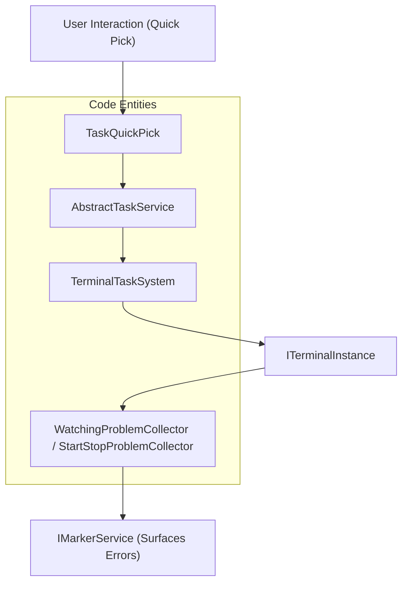
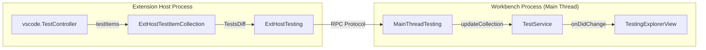

# Tasks and Testing

Relevant source files

The following files were used as context for generating this wiki page:

- [extensions/vscode-api-tests/src/singlefolder-tests/terminal.test.ts](extensions/vscode-api-tests/src/singlefolder-tests/terminal.test.ts)
- [extensions/vscode-api-tests/src/singlefolder-tests/workspace.tasks.test.ts](extensions/vscode-api-tests/src/singlefolder-tests/workspace.tasks.test.ts)
- [src/vs/platform/quickinput/browser/quickPickPin.ts](src/vs/platform/quickinput/browser/quickPickPin.ts)
- [src/vs/workbench/api/browser/mainThreadTask.ts](src/vs/workbench/api/browser/mainThreadTask.ts)
- [src/vs/workbench/api/browser/mainThreadTesting.ts](src/vs/workbench/api/browser/mainThreadTesting.ts)
- [src/vs/workbench/api/common/extHostTask.ts](src/vs/workbench/api/common/extHostTask.ts)
- [src/vs/workbench/api/common/extHostTestItem.ts](src/vs/workbench/api/common/extHostTestItem.ts)
- [src/vs/workbench/api/common/extHostTesting.ts](src/vs/workbench/api/common/extHostTesting.ts)
- [src/vs/workbench/api/common/shared/tasks.ts](src/vs/workbench/api/common/shared/tasks.ts)
- [src/vs/workbench/api/node/extHostTask.ts](src/vs/workbench/api/node/extHostTask.ts)
- [src/vs/workbench/api/test/browser/extHostTesting.test.ts](src/vs/workbench/api/test/browser/extHostTesting.test.ts)
- [src/vs/workbench/contrib/tasks/browser/abstractTaskService.ts](src/vs/workbench/contrib/tasks/browser/abstractTaskService.ts)
- [src/vs/workbench/contrib/tasks/browser/runAutomaticTasks.ts](src/vs/workbench/contrib/tasks/browser/runAutomaticTasks.ts)
- [src/vs/workbench/contrib/tasks/browser/task.contribution.ts](src/vs/workbench/contrib/tasks/browser/task.contribution.ts)
- [src/vs/workbench/contrib/tasks/browser/taskQuickPick.ts](src/vs/workbench/contrib/tasks/browser/taskQuickPick.ts)
- [src/vs/workbench/contrib/tasks/browser/tasksQuickAccess.ts](src/vs/workbench/contrib/tasks/browser/tasksQuickAccess.ts)
- [src/vs/workbench/contrib/tasks/browser/terminalTaskSystem.ts](src/vs/workbench/contrib/tasks/browser/terminalTaskSystem.ts)
- [src/vs/workbench/contrib/tasks/common/jsonSchema_v2.ts](src/vs/workbench/contrib/tasks/common/jsonSchema_v2.ts)
- [src/vs/workbench/contrib/tasks/common/taskConfiguration.ts](src/vs/workbench/contrib/tasks/common/taskConfiguration.ts)
- [src/vs/workbench/contrib/tasks/common/taskService.ts](src/vs/workbench/contrib/tasks/common/taskService.ts)
- [src/vs/workbench/contrib/tasks/common/taskSystem.ts](src/vs/workbench/contrib/tasks/common/taskSystem.ts)
- [src/vs/workbench/contrib/tasks/common/tasks.ts](src/vs/workbench/contrib/tasks/common/tasks.ts)
- [src/vs/workbench/contrib/testing/browser/codeCoverageDecorations.ts](src/vs/workbench/contrib/testing/browser/codeCoverageDecorations.ts)
- [src/vs/workbench/contrib/testing/browser/explorerProjections/index.ts](src/vs/workbench/contrib/testing/browser/explorerProjections/index.ts)
- [src/vs/workbench/contrib/testing/browser/icons.ts](src/vs/workbench/contrib/testing/browser/icons.ts)
- [src/vs/workbench/contrib/testing/browser/media/testing.css](src/vs/workbench/contrib/testing/browser/media/testing.css)
- [src/vs/workbench/contrib/testing/browser/testCoverageBars.ts](src/vs/workbench/contrib/testing/browser/testCoverageBars.ts)
- [src/vs/workbench/contrib/testing/browser/testCoverageView.ts](src/vs/workbench/contrib/testing/browser/testCoverageView.ts)
- [src/vs/workbench/contrib/testing/browser/testExplorerActions.ts](src/vs/workbench/contrib/testing/browser/testExplorerActions.ts)
- [src/vs/workbench/contrib/testing/browser/testing.contribution.ts](src/vs/workbench/contrib/testing/browser/testing.contribution.ts)
- [src/vs/workbench/contrib/testing/browser/testingDecorations.ts](src/vs/workbench/contrib/testing/browser/testingDecorations.ts)
- [src/vs/workbench/contrib/testing/browser/testingExplorerView.ts](src/vs/workbench/contrib/testing/browser/testingExplorerView.ts)
- [src/vs/workbench/contrib/testing/browser/testingOutputPeek.ts](src/vs/workbench/contrib/testing/browser/testingOutputPeek.ts)
- [src/vs/workbench/contrib/testing/browser/testingProgressUiService.ts](src/vs/workbench/contrib/testing/browser/testingProgressUiService.ts)
- [src/vs/workbench/contrib/testing/browser/theme.ts](src/vs/workbench/contrib/testing/browser/theme.ts)
- [src/vs/workbench/contrib/testing/common/configuration.ts](src/vs/workbench/contrib/testing/common/configuration.ts)
- [src/vs/workbench/contrib/testing/common/constants.ts](src/vs/workbench/contrib/testing/common/constants.ts)
- [src/vs/workbench/contrib/testing/common/testCoverage.ts](src/vs/workbench/contrib/testing/common/testCoverage.ts)
- [src/vs/workbench/contrib/testing/common/testCoverageService.ts](src/vs/workbench/contrib/testing/common/testCoverageService.ts)
- [src/vs/workbench/contrib/testing/common/testItemCollection.ts](src/vs/workbench/contrib/testing/common/testItemCollection.ts)
- [src/vs/workbench/contrib/testing/common/testResult.ts](src/vs/workbench/contrib/testing/common/testResult.ts)
- [src/vs/workbench/contrib/testing/common/testResultService.ts](src/vs/workbench/contrib/testing/common/testResultService.ts)
- [src/vs/workbench/contrib/testing/common/testResultStorage.ts](src/vs/workbench/contrib/testing/common/testResultStorage.ts)
- [src/vs/workbench/contrib/testing/common/testService.ts](src/vs/workbench/contrib/testing/common/testService.ts)
- [src/vs/workbench/contrib/testing/common/testServiceImpl.ts](src/vs/workbench/contrib/testing/common/testServiceImpl.ts)
- [src/vs/workbench/contrib/testing/common/testTypes.ts](src/vs/workbench/contrib/testing/common/testTypes.ts)
- [src/vs/workbench/contrib/testing/common/testingContentProvider.ts](src/vs/workbench/contrib/testing/common/testingContentProvider.ts)
- [src/vs/workbench/contrib/testing/common/testingContextKeys.ts](src/vs/workbench/contrib/testing/common/testingContextKeys.ts)
- [src/vs/workbench/contrib/testing/common/testingUri.ts](src/vs/workbench/contrib/testing/common/testingUri.ts)
- [src/vs/workbench/contrib/testing/test/browser/__snapshots__/Code_Coverage_Decorations_CoverageDetailsModel_3.0.snap](src/vs/workbench/contrib/testing/test/browser/__snapshots__/Code_Coverage_Decorations_CoverageDetailsModel_3.0.snap)
- [src/vs/workbench/contrib/testing/test/browser/__snapshots__/Code_Coverage_Decorations_CoverageDetailsModel_4.0.snap](src/vs/workbench/contrib/testing/test/browser/__snapshots__/Code_Coverage_Decorations_CoverageDetailsModel_4.0.snap)
- [src/vs/workbench/contrib/testing/test/browser/codeCoverageDecorations.test.ts](src/vs/workbench/contrib/testing/test/browser/codeCoverageDecorations.test.ts)
- [src/vs/workbench/contrib/testing/test/common/testResultService.test.ts](src/vs/workbench/contrib/testing/test/common/testResultService.test.ts)
- [src/vs/workbench/contrib/testing/test/common/testResultStorage.test.ts](src/vs/workbench/contrib/testing/test/common/testResultStorage.test.ts)

The Tasks and Testing subsystems provide the infrastructure for automating external processes (like builds and linters) and managing the lifecycle of software tests within VS Code. While distinct, both systems share common goals: executing external logic, reporting progress, and surfacing results (errors, warnings, or test outcomes) directly in the editor UI.

## Task System

The Task System allows users to run external tools and analyze their output. It handles everything from simple shell commands defined in `tasks.json` to complex build pipelines provided by extensions.

### Core Architecture
The central orchestrator is the `AbstractTaskService`, which manages the lifecycle of tasks and coordinates between the configuration, the UI, and the execution engine. Tasks are generally executed within the integrated terminal via the `TerminalTaskSystem`.

- **`AbstractTaskService`**: The base implementation of `ITaskService`. It handles task discovery, persistence of task states, and the quick pick UI for running tasks. [src/vs/workbench/contrib/tasks/browser/abstractTaskService.ts:116-116]()
- **`TerminalTaskSystem`**: Implements `ITaskSystem` to run tasks as terminal instances. It manages terminal creation, shell quoting, and problem collection. [src/vs/workbench/contrib/tasks/browser/terminalTaskSystem.ts:116-116]()
- **`TaskQuickPick`**: Provides the user interface for selecting and configuring tasks, including support for pinning and color-coded icons. [src/vs/workbench/contrib/tasks/browser/taskQuickPick.ts:49-49]()
- **`TaskStatusBarContributions`**: Monitors task state changes via `onDidStateChange` to update the "Running Tasks" count in the status bar and provide building progress indicators. [src/vs/workbench/contrib/tasks/browser/task.contribution.ts:61-124]()

### System Flow: NL to Code Entities
The following diagram illustrates how a user's intent to "Run a Task" flows through the system entities, mapping natural language actions to specific code classes.

Sources: [src/vs/workbench/contrib/tasks/browser/abstractTaskService.ts:116-116](), [src/vs/workbench/contrib/tasks/browser/terminalTaskSystem.ts:116-116](), [src/vs/workbench/contrib/tasks/browser/taskQuickPick.ts:49-49](), [src/vs/workbench/contrib/tasks/browser/terminalTaskSystem.ts:40-40]().

For details, see [Task System](#12.1).

---

## Test Explorer

The Test Explorer provides a unified interface for discovering, running, and debugging tests across different testing frameworks (e.g., Mocha, Jest, Pytest).

### Components
The testing system is split across the Extension Host (where test discovery and execution logic lives) and the Workbench (where results are displayed).

- **`ITestService`**: The primary service in the workbench for managing the test tree and coordinating test runs. [src/vs/workbench/contrib/testing/common/testService.ts:69-69]()
- **`TestingExplorerView`**: The sidebar tree view that displays the hierarchy of discovered tests and provides controls for running/debugging. [src/vs/workbench/contrib/testing/browser/testingExplorerView.ts:113-113]()
- **`TestingOutputPeek`**: A specialized editor widget that allows users to "peek" at test failure messages and stack traces directly at the call site. [src/vs/workbench/contrib/testing/browser/testingOutputPeek.ts:113-113]()
- **`TestingDecorations`**: Gutter icons and inline message decorations that show test status (Pass/Fail) and error messages in the code editor. [src/vs/workbench/contrib/testing/browser/testingDecorations.ts:125-125]()
- **`TestResultService`**: Manages the collection of `LiveTestResult` objects and provides access to historical results. [src/vs/workbench/contrib/testing/common/testResultService.ts:31-31]()

### Testing Architecture: Process Boundary
Test data flows between the extension-controlled `ExtHostTesting` and the workbench `MainThreadTesting` via an RPC protocol using `TestsDiff`.

Sources: [src/vs/workbench/api/common/extHostTesting.ts:55-55](), [src/vs/workbench/contrib/testing/browser/testingExplorerView.ts:113-113](), [src/vs/workbench/api/common/extHostTesting.ts:25-25](), [src/vs/workbench/api/common/extHostTestItem.ts:31-31]().

### UI and Feedback
The system provides immediate feedback through multiple channels:

| Component | Role | File |
| :--- | :--- | :--- |
| **Gutter Icons** | Show Pass/Fail status next to line numbers via `TestingDecorations`. | [src/vs/workbench/contrib/testing/browser/testingDecorations.ts:125-125]() |
| **Output Peek** | Displays failure details in an inline editor widget via `TestingOutputPeekController`. | [src/vs/workbench/contrib/testing/browser/testingOutputPeek.ts:49-49]() |
| **Coverage** | Renders code coverage bars and background highlights via `CodeCoverageDecorations`. | [src/vs/workbench/contrib/testing/browser/codeCoverageDecorations.ts:42-42]() |
| **Explorer View** | Tree-based navigation of the test suite and execution control. | [src/vs/workbench/contrib/testing/browser/testingExplorerView.ts:113-113]() |

For details, see [Test Explorer](#12.2).

---

## Related Services

- **`IConfigurationResolverService`**: Used by the Task system to resolve variables like `${workspaceFolder}` or `${file}` in `tasks.json`. [src/vs/workbench/contrib/tasks/browser/terminalTaskSystem.ts:89-113]()
- **`ITerminalService`**: The underlying service used by `TerminalTaskSystem` to spawn and manage the terminal processes where tasks run. [src/vs/workbench/contrib/tasks/browser/terminalTaskSystem.ts:44-44]()
- **`IMarkerService`**: Used by tasks to report linting or compilation errors discovered via "Problem Matchers". [src/vs/workbench/contrib/tasks/browser/abstractTaskService.ts:26-26]()
- **`IQuickInputService`**: Facilitates the task selection UI through the `TaskQuickPick` implementation. [src/vs/workbench/contrib/tasks/browser/taskQuickPick.ts:55-55]()

Sources: [src/vs/workbench/contrib/tasks/browser/abstractTaskService.ts:116-116](), [src/vs/workbench/contrib/tasks/browser/terminalTaskSystem.ts:116-116](), [src/vs/workbench/contrib/testing/browser/testingExplorerView.ts:113-113](), [src/vs/workbench/contrib/testing/browser/testingOutputPeek.ts:113-113]().