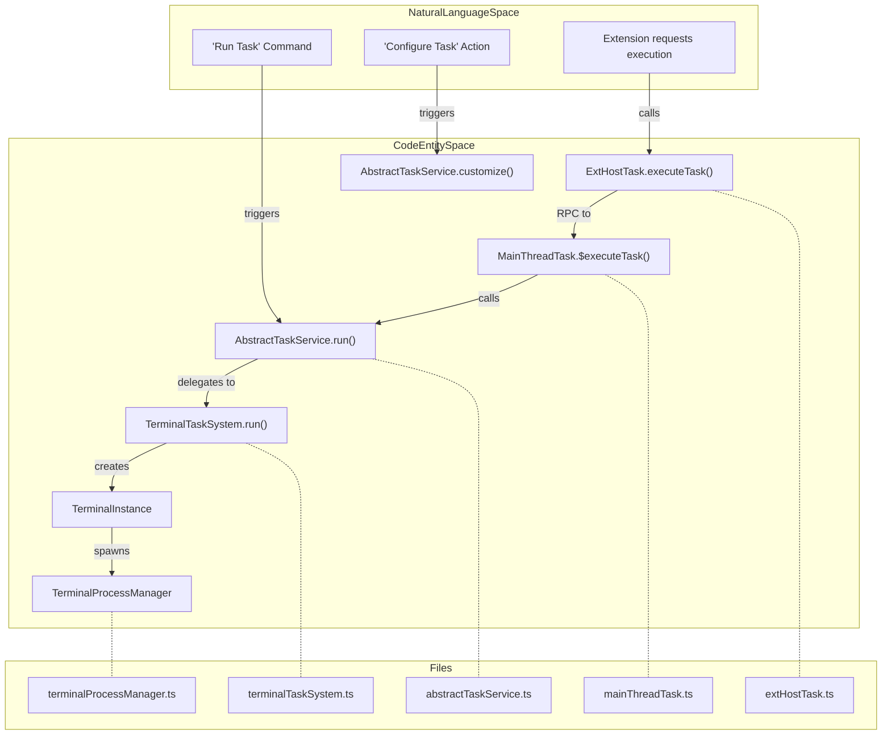
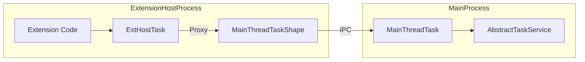
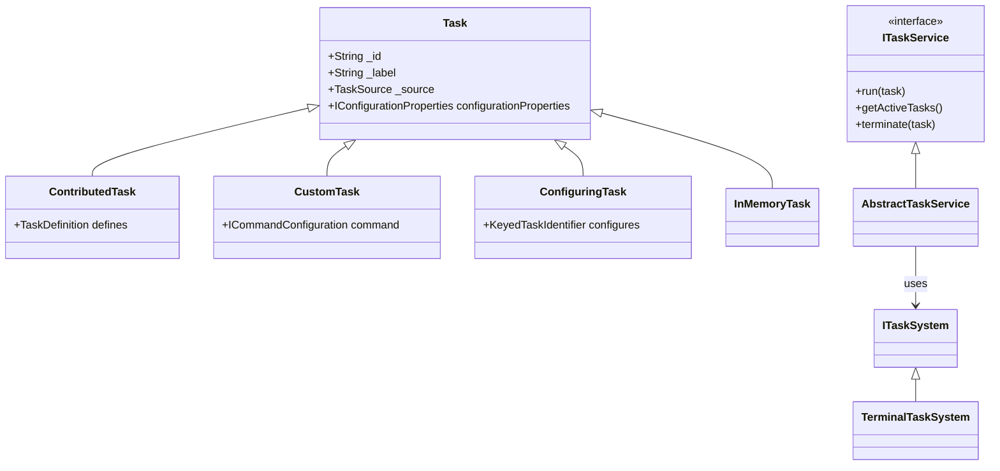

# Task System

Relevant source files

The following files were used as context for generating this wiki page:

- [extensions/vscode-api-tests/src/singlefolder-tests/terminal.test.ts](https://github.com/microsoft/vscode/blob/HEAD/extensions/vscode-api-tests/src/singlefolder-tests/terminal.test.ts)
- [extensions/vscode-api-tests/src/singlefolder-tests/workspace.tasks.test.ts](https://github.com/microsoft/vscode/blob/HEAD/extensions/vscode-api-tests/src/singlefolder-tests/workspace.tasks.test.ts)
- [src/vs/platform/quickinput/browser/quickPickPin.ts](https://github.com/microsoft/vscode/blob/HEAD/src/vs/platform/quickinput/browser/quickPickPin.ts)
- [src/vs/platform/terminal/common/terminal.ts](https://github.com/microsoft/vscode/blob/HEAD/src/vs/platform/terminal/common/terminal.ts)
- [src/vs/platform/terminal/node/ptyHostService.ts](https://github.com/microsoft/vscode/blob/HEAD/src/vs/platform/terminal/node/ptyHostService.ts)
- [src/vs/platform/terminal/node/ptyService.ts](https://github.com/microsoft/vscode/blob/HEAD/src/vs/platform/terminal/node/ptyService.ts)
- [src/vs/platform/terminal/node/terminalProcess.ts](https://github.com/microsoft/vscode/blob/HEAD/src/vs/platform/terminal/node/terminalProcess.ts)
- [src/vs/workbench/api/browser/mainThreadTask.ts](https://github.com/microsoft/vscode/blob/HEAD/src/vs/workbench/api/browser/mainThreadTask.ts)
- [src/vs/workbench/api/browser/mainThreadTerminalService.ts](https://github.com/microsoft/vscode/blob/HEAD/src/vs/workbench/api/browser/mainThreadTerminalService.ts)
- [src/vs/workbench/api/common/extHostTask.ts](https://github.com/microsoft/vscode/blob/HEAD/src/vs/workbench/api/common/extHostTask.ts)
- [src/vs/workbench/api/common/extHostTerminalService.ts](https://github.com/microsoft/vscode/blob/HEAD/src/vs/workbench/api/common/extHostTerminalService.ts)
- [src/vs/workbench/api/common/shared/tasks.ts](https://github.com/microsoft/vscode/blob/HEAD/src/vs/workbench/api/common/shared/tasks.ts)
- [src/vs/workbench/api/node/extHostTask.ts](https://github.com/microsoft/vscode/blob/HEAD/src/vs/workbench/api/node/extHostTask.ts)
- [src/vs/workbench/contrib/tasks/browser/abstractTaskService.ts](https://github.com/microsoft/vscode/blob/HEAD/src/vs/workbench/contrib/tasks/browser/abstractTaskService.ts)
- [src/vs/workbench/contrib/tasks/browser/runAutomaticTasks.ts](https://github.com/microsoft/vscode/blob/HEAD/src/vs/workbench/contrib/tasks/browser/runAutomaticTasks.ts)
- [src/vs/workbench/contrib/tasks/browser/task.contribution.ts](https://github.com/microsoft/vscode/blob/HEAD/src/vs/workbench/contrib/tasks/browser/task.contribution.ts)
- [src/vs/workbench/contrib/tasks/browser/taskQuickPick.ts](https://github.com/microsoft/vscode/blob/HEAD/src/vs/workbench/contrib/tasks/browser/taskQuickPick.ts)
- [src/vs/workbench/contrib/tasks/browser/tasksQuickAccess.ts](https://github.com/microsoft/vscode/blob/HEAD/src/vs/workbench/contrib/tasks/browser/tasksQuickAccess.ts)
- [src/vs/workbench/contrib/tasks/browser/terminalTaskSystem.ts](https://github.com/microsoft/vscode/blob/HEAD/src/vs/workbench/contrib/tasks/browser/terminalTaskSystem.ts)
- [src/vs/workbench/contrib/tasks/common/jsonSchema_v2.ts](https://github.com/microsoft/vscode/blob/HEAD/src/vs/workbench/contrib/tasks/common/jsonSchema_v2.ts)
- [src/vs/workbench/contrib/tasks/common/taskConfiguration.ts](https://github.com/microsoft/vscode/blob/HEAD/src/vs/workbench/contrib/tasks/common/taskConfiguration.ts)
- [src/vs/workbench/contrib/tasks/common/taskService.ts](https://github.com/microsoft/vscode/blob/HEAD/src/vs/workbench/contrib/tasks/common/taskService.ts)
- [src/vs/workbench/contrib/tasks/common/taskSystem.ts](https://github.com/microsoft/vscode/blob/HEAD/src/vs/workbench/contrib/tasks/common/taskSystem.ts)
- [src/vs/workbench/contrib/tasks/common/tasks.ts](https://github.com/microsoft/vscode/blob/HEAD/src/vs/workbench/contrib/tasks/common/tasks.ts)
- [src/vs/workbench/contrib/terminal/browser/media/terminal.css](https://github.com/microsoft/vscode/blob/HEAD/src/vs/workbench/contrib/terminal/browser/media/terminal.css)
- [src/vs/workbench/contrib/terminal/browser/media/xterm.css](https://github.com/microsoft/vscode/blob/HEAD/src/vs/workbench/contrib/terminal/browser/media/xterm.css)
- [src/vs/workbench/contrib/terminal/browser/remotePty.ts](https://github.com/microsoft/vscode/blob/HEAD/src/vs/workbench/contrib/terminal/browser/remotePty.ts)
- [src/vs/workbench/contrib/terminal/browser/terminal.contribution.ts](https://github.com/microsoft/vscode/blob/HEAD/src/vs/workbench/contrib/terminal/browser/terminal.contribution.ts)
- [src/vs/workbench/contrib/terminal/browser/terminal.ts](https://github.com/microsoft/vscode/blob/HEAD/src/vs/workbench/contrib/terminal/browser/terminal.ts)
- [src/vs/workbench/contrib/terminal/browser/terminalActions.ts](https://github.com/microsoft/vscode/blob/HEAD/src/vs/workbench/contrib/terminal/browser/terminalActions.ts)
- [src/vs/workbench/contrib/terminal/browser/terminalEditor.ts](https://github.com/microsoft/vscode/blob/HEAD/src/vs/workbench/contrib/terminal/browser/terminalEditor.ts)
- [src/vs/workbench/contrib/terminal/browser/terminalEditorInput.ts](https://github.com/microsoft/vscode/blob/HEAD/src/vs/workbench/contrib/terminal/browser/terminalEditorInput.ts)
- [src/vs/workbench/contrib/terminal/browser/terminalEditorService.ts](https://github.com/microsoft/vscode/blob/HEAD/src/vs/workbench/contrib/terminal/browser/terminalEditorService.ts)
- [src/vs/workbench/contrib/terminal/browser/terminalGroup.ts](https://github.com/microsoft/vscode/blob/HEAD/src/vs/workbench/contrib/terminal/browser/terminalGroup.ts)
- [src/vs/workbench/contrib/terminal/browser/terminalGroupService.ts](https://github.com/microsoft/vscode/blob/HEAD/src/vs/workbench/contrib/terminal/browser/terminalGroupService.ts)
- [src/vs/workbench/contrib/terminal/browser/terminalInstance.ts](https://github.com/microsoft/vscode/blob/HEAD/src/vs/workbench/contrib/terminal/browser/terminalInstance.ts)
- [src/vs/workbench/contrib/terminal/browser/terminalMenus.ts](https://github.com/microsoft/vscode/blob/HEAD/src/vs/workbench/contrib/terminal/browser/terminalMenus.ts)
- [src/vs/workbench/contrib/terminal/browser/terminalProcessExtHostProxy.ts](https://github.com/microsoft/vscode/blob/HEAD/src/vs/workbench/contrib/terminal/browser/terminalProcessExtHostProxy.ts)
- [src/vs/workbench/contrib/terminal/browser/terminalProcessManager.ts](https://github.com/microsoft/vscode/blob/HEAD/src/vs/workbench/contrib/terminal/browser/terminalProcessManager.ts)
- [src/vs/workbench/contrib/terminal/browser/terminalService.ts](https://github.com/microsoft/vscode/blob/HEAD/src/vs/workbench/contrib/terminal/browser/terminalService.ts)
- [src/vs/workbench/contrib/terminal/browser/terminalTabbedView.ts](https://github.com/microsoft/vscode/blob/HEAD/src/vs/workbench/contrib/terminal/browser/terminalTabbedView.ts)
- [src/vs/workbench/contrib/terminal/browser/terminalTabsList.ts](https://github.com/microsoft/vscode/blob/HEAD/src/vs/workbench/contrib/terminal/browser/terminalTabsList.ts)
- [src/vs/workbench/contrib/terminal/browser/terminalView.ts](https://github.com/microsoft/vscode/blob/HEAD/src/vs/workbench/contrib/terminal/browser/terminalView.ts)
- [src/vs/workbench/contrib/terminal/browser/xterm/decorationAddon.ts](https://github.com/microsoft/vscode/blob/HEAD/src/vs/workbench/contrib/terminal/browser/xterm/decorationAddon.ts)
- [src/vs/workbench/contrib/terminal/browser/xterm/xtermTerminal.ts](https://github.com/microsoft/vscode/blob/HEAD/src/vs/workbench/contrib/terminal/browser/xterm/xtermTerminal.ts)
- [src/vs/workbench/contrib/terminal/common/terminal.ts](https://github.com/microsoft/vscode/blob/HEAD/src/vs/workbench/contrib/terminal/common/terminal.ts)
- [src/vs/workbench/contrib/terminal/common/terminalColorRegistry.ts](https://github.com/microsoft/vscode/blob/HEAD/src/vs/workbench/contrib/terminal/common/terminalColorRegistry.ts)
- [src/vs/workbench/contrib/terminal/common/terminalConfiguration.ts](https://github.com/microsoft/vscode/blob/HEAD/src/vs/workbench/contrib/terminal/common/terminalConfiguration.ts)
- [src/vs/workbench/contrib/terminal/common/terminalStrings.ts](https://github.com/microsoft/vscode/blob/HEAD/src/vs/workbench/contrib/terminal/common/terminalStrings.ts)
- [src/vs/workbench/contrib/terminal/test/browser/terminalInstance.test.ts](https://github.com/microsoft/vscode/blob/HEAD/src/vs/workbench/contrib/terminal/test/browser/terminalInstance.test.ts)

The Task System in VS Code is responsible for discovering, configuring, and executing external processes (like compilers, linters, or build tools) and integrating their output into the workbench. It leverages the integrated terminal for execution and provides a rich UI for task selection and monitoring.

## Architectural Overview

The Task System follows a provider-based architecture where tasks can be contributed by extensions, defined in `tasks.json` configuration files, or created dynamically by the workbench.

### Key Components

| Component | Role |
| :--- | :--- |
| `ITaskService` | The primary entry point for task management, including running, terminating, and filtering tasks. [src/vs/workbench/contrib/tasks/common/taskService.ts:66-114](https://github.com/microsoft/vscode/blob/HEAD/src/vs/workbench/contrib/tasks/common/taskService.ts#L66-L114) |
| `AbstractTaskService` | A base implementation providing common logic for task discovery, configuration resolution, and UI interactions. [src/vs/workbench/contrib/tasks/browser/abstractTaskService.ts:116](https://github.com/microsoft/vscode/blob/HEAD/src/vs/workbench/contrib/tasks/browser/abstractTaskService.ts#L116) |
| `ITaskSystem` | An abstraction for the execution backend. [src/vs/workbench/contrib/tasks/common/taskSystem.ts:42](https://github.com/microsoft/vscode/blob/HEAD/src/vs/workbench/contrib/tasks/common/taskSystem.ts#L42) |
| `TerminalTaskSystem` | Executes tasks within integrated terminal instances, handling shell integration and output monitoring. [src/vs/workbench/contrib/tasks/browser/terminalTaskSystem.ts:116](https://github.com/microsoft/vscode/blob/HEAD/src/vs/workbench/contrib/tasks/browser/terminalTaskSystem.ts#L116) |
| `ITaskProvider` | Extensions register these to contribute tasks dynamically (e.g., npm, gulp). [src/vs/workbench/contrib/tasks/common/taskService.ts:30-33](https://github.com/microsoft/vscode/blob/HEAD/src/vs/workbench/contrib/tasks/common/taskService.ts#L30-L33) |

### Code Entity Mapping: Execution Flow

This diagram associates high-level system operations with the specific code entities and methods that handle them.

**Sources:** [src/vs/workbench/contrib/tasks/browser/abstractTaskService.ts:116](https://github.com/microsoft/vscode/blob/HEAD/src/vs/workbench/contrib/tasks/browser/abstractTaskService.ts#L116), [src/vs/workbench/contrib/tasks/browser/terminalTaskSystem.ts:434](https://github.com/microsoft/vscode/blob/HEAD/src/vs/workbench/contrib/tasks/browser/terminalTaskSystem.ts#L434), [src/vs/workbench/api/common/extHostTask.ts:32](https://github.com/microsoft/vscode/blob/HEAD/src/vs/workbench/api/common/extHostTask.ts#L32), [src/vs/workbench/api/browser/mainThreadTask.ts:28](https://github.com/microsoft/vscode/blob/HEAD/src/vs/workbench/api/browser/mainThreadTask.ts#L28), [src/vs/workbench/contrib/terminal/browser/terminalInstance.ts:79](https://github.com/microsoft/vscode/blob/HEAD/src/vs/workbench/contrib/terminal/browser/terminalInstance.ts#L79)

---

## Task Configuration and Discovery

Tasks are defined through multiple sources, which are merged into a unified task model.

### Task Types
The system differentiates between various task origins using specific classes defined in `tasks.ts`:
- **ContributedTask**: Provided by an extension via an `ITaskProvider`. [src/vs/workbench/contrib/tasks/common/tasks.ts:50](https://github.com/microsoft/vscode/blob/HEAD/src/vs/workbench/contrib/tasks/common/tasks.ts#L50)
- **CustomTask**: Defined by the user in `tasks.json`. [src/vs/workbench/contrib/tasks/common/tasks.ts:50](https://github.com/microsoft/vscode/blob/HEAD/src/vs/workbench/contrib/tasks/common/tasks.ts#L50)
- **ConfiguringTask**: A task from an extension that has been customized in `tasks.json`. [src/vs/workbench/contrib/tasks/common/tasks.ts:50](https://github.com/microsoft/vscode/blob/HEAD/src/vs/workbench/contrib/tasks/common/tasks.ts#L50)
- **InMemoryTask**: Tasks created programmatically that do not persist in configuration. [src/vs/workbench/contrib/tasks/common/tasks.ts:50](https://github.com/microsoft/vscode/blob/HEAD/src/vs/workbench/contrib/tasks/common/tasks.ts#L50)

### JSON Schema (v2)
The task system uses `jsonSchema_v2.ts` to validate `tasks.json`. Key properties include:
- `label`: The task's name. [src/vs/workbench/contrib/tasks/common/jsonSchema_v2.ts:110-113](https://github.com/microsoft/vscode/blob/HEAD/src/vs/workbench/contrib/tasks/common/jsonSchema_v2.ts#L110-L113)
- `type`: Either `shell`, `process`, or a type contributed by an extension. [src/vs/workbench/contrib/tasks/common/jsonSchema_v2.ts:65-74](https://github.com/microsoft/vscode/blob/HEAD/src/vs/workbench/contrib/tasks/common/jsonSchema_v2.ts#L65-L74)
- `dependsOn`: Defines task dependencies. [src/vs/workbench/contrib/tasks/common/jsonSchema_v2.ts:76-97](https://github.com/microsoft/vscode/blob/HEAD/src/vs/workbench/contrib/tasks/common/jsonSchema_v2.ts#L76-L97)
- `problemMatcher`: Patterns used to scan task output for errors/warnings. [src/vs/workbench/contrib/tasks/common/jsonSchema_v2.ts:31](https://github.com/microsoft/vscode/blob/HEAD/src/vs/workbench/contrib/tasks/common/jsonSchema_v2.ts#L31)

### Discovery Process
The `AbstractTaskService` coordinates task discovery. It queries registered `ITaskProvider` instances [src/vs/workbench/contrib/tasks/browser/abstractTaskService.ts:127-148](https://github.com/microsoft/vscode/blob/HEAD/src/vs/workbench/contrib/tasks/browser/abstractTaskService.ts#L127-L148) and parses local `.vscode/tasks.json` files via `TaskConfig.parse`. [src/vs/workbench/contrib/tasks/common/taskConfiguration.ts:56](https://github.com/microsoft/vscode/blob/HEAD/src/vs/workbench/contrib/tasks/common/taskConfiguration.ts#L56)

**Sources:** [src/vs/workbench/contrib/tasks/common/tasks.ts:50](https://github.com/microsoft/vscode/blob/HEAD/src/vs/workbench/contrib/tasks/common/tasks.ts#L50), [src/vs/workbench/contrib/tasks/browser/abstractTaskService.ts:127-148](https://github.com/microsoft/vscode/blob/HEAD/src/vs/workbench/contrib/tasks/browser/abstractTaskService.ts#L127-L148), [src/vs/workbench/contrib/tasks/common/jsonSchema_v2.ts:31-113](https://github.com/microsoft/vscode/blob/HEAD/src/vs/workbench/contrib/tasks/common/jsonSchema_v2.ts#L31-L113), [src/vs/workbench/contrib/tasks/common/taskConfiguration.ts:56](https://github.com/microsoft/vscode/blob/HEAD/src/vs/workbench/contrib/tasks/common/taskConfiguration.ts#L56)

---

## Terminal Task System

The `TerminalTaskSystem` is the default implementation of `ITaskSystem`. It maps VS Code tasks to integrated terminal instances.

### Process Management
When a task is executed, the `TerminalTaskSystem` creates a `TerminalInstance` via `ITerminalService`. It configures the `IShellLaunchConfig` based on the task's `command`, `args`, and `options`. [src/vs/workbench/contrib/tasks/browser/terminalTaskSystem.ts:116](https://github.com/microsoft/vscode/blob/HEAD/src/vs/workbench/contrib/tasks/browser/terminalTaskSystem.ts#L116), [src/vs/workbench/contrib/tasks/browser/terminalTaskSystem.ts:69-75](https://github.com/microsoft/vscode/blob/HEAD/src/vs/workbench/contrib/tasks/browser/terminalTaskSystem.ts#L69-L75)

### Key Implementation Details
- **Variable Resolution**: Uses `VariableResolver` (a wrapper around `IConfigurationResolverService`) to replace placeholders like `${workspaceFolder}`. [src/vs/workbench/contrib/tasks/browser/terminalTaskSystem.ts:87-113](https://github.com/microsoft/vscode/blob/HEAD/src/vs/workbench/contrib/tasks/browser/terminalTaskSystem.ts#L87-L113)
- **Shell Quoting**: Defines platform-specific quoting rules for `cmd`, `powershell`, `bash`, and `zsh`. [src/vs/workbench/contrib/tasks/browser/terminalTaskSystem.ts:122-150](https://github.com/microsoft/vscode/blob/HEAD/src/vs/workbench/contrib/tasks/browser/terminalTaskSystem.ts#L122-L150)
- **Reconnection**: Supports reconnecting to tasks after a window reload via `IReconnectionTaskData`. [src/vs/workbench/contrib/tasks/browser/terminalTaskSystem.ts:77-83](https://github.com/microsoft/vscode/blob/HEAD/src/vs/workbench/contrib/tasks/browser/terminalTaskSystem.ts#L77-L83)
- **Terminal Integration**: The system emits specific escape sequences (OSC) to communicate task state to the terminal, such as `VSCodeOscProperty.Task`. [src/vs/workbench/contrib/tasks/browser/terminalTaskSystem.ts:45-56](https://github.com/microsoft/vscode/blob/HEAD/src/vs/workbench/contrib/tasks/browser/terminalTaskSystem.ts#L45-L56)

### Problem Collection
Tasks use `WatchingProblemCollector` or `StartStopProblemCollector` to monitor terminal output. These collectors parse the stream for patterns defined in `problemMatcher` and report them to the `IMarkerService`. [src/vs/workbench/contrib/tasks/browser/terminalTaskSystem.ts:40](https://github.com/microsoft/vscode/blob/HEAD/src/vs/workbench/contrib/tasks/browser/terminalTaskSystem.ts#L40)

**Sources:** [src/vs/workbench/contrib/tasks/browser/terminalTaskSystem.ts:116-150](https://github.com/microsoft/vscode/blob/HEAD/src/vs/workbench/contrib/tasks/browser/terminalTaskSystem.ts#L116-L150), [src/vs/workbench/contrib/tasks/browser/terminalTaskSystem.ts:40](https://github.com/microsoft/vscode/blob/HEAD/src/vs/workbench/contrib/tasks/browser/terminalTaskSystem.ts#L40), [src/vs/workbench/contrib/tasks/browser/terminalTaskSystem.ts:87-113](https://github.com/microsoft/vscode/blob/HEAD/src/vs/workbench/contrib/tasks/browser/terminalTaskSystem.ts#L87-L113), [src/vs/workbench/contrib/tasks/browser/terminalTaskSystem.ts:45-56](https://github.com/microsoft/vscode/blob/HEAD/src/vs/workbench/contrib/tasks/browser/terminalTaskSystem.ts#L45-L56)

---

## Task Quick Pick UI

The `TaskQuickPick` class manages the "Run Task" and "Configure Task" interfaces.

### UI Structure and Logic
- **Categorization**: Groups tasks into "Recent", "Configured", and "Contributed" using `_createEntriesForGroup`. [src/vs/workbench/contrib/tasks/browser/taskQuickPick.ts:116-124](https://github.com/microsoft/vscode/blob/HEAD/src/vs/workbench/contrib/tasks/browser/taskQuickPick.ts#L116-L124)
- **Sorting**: Uses `TaskSorter` to order tasks within the picker. [src/vs/workbench/contrib/tasks/browser/taskQuickPick.ts:61](https://github.com/microsoft/vscode/blob/HEAD/src/vs/workbench/contrib/tasks/browser/taskQuickPick.ts#L61)
- **Styling**: Applies theme-specific icons and colors via `applyColorStyles`. [src/vs/workbench/contrib/tasks/browser/taskQuickPick.ts:93-101](https://github.com/microsoft/vscode/blob/HEAD/src/vs/workbench/contrib/tasks/browser/taskQuickPick.ts#L93-L101)
- **Deduplication**: Merges tasks that are both contributed by extensions and customized in `tasks.json`. [src/vs/workbench/contrib/tasks/browser/taskQuickPick.ts:149-150](https://github.com/microsoft/vscode/blob/HEAD/src/vs/workbench/contrib/tasks/browser/taskQuickPick.ts#L149-L150)

**Sources:** [src/vs/workbench/contrib/tasks/browser/taskQuickPick.ts:116-124](https://github.com/microsoft/vscode/blob/HEAD/src/vs/workbench/contrib/tasks/browser/taskQuickPick.ts#L116-L124), [src/vs/workbench/contrib/tasks/browser/taskQuickPick.ts:61](https://github.com/microsoft/vscode/blob/HEAD/src/vs/workbench/contrib/tasks/browser/taskQuickPick.ts#L61), [src/vs/workbench/contrib/tasks/browser/taskQuickPick.ts:93-101](https://github.com/microsoft/vscode/blob/HEAD/src/vs/workbench/contrib/tasks/browser/taskQuickPick.ts#L93-L101)

---

## Automatic Task Running

VS Code supports running tasks automatically when a folder is opened (e.g., a background watcher).

### RunAutomaticTasks Contribution
The `RunAutomaticTasks` class monitors workspace trust and task system readiness. It searches for tasks with `runOptions.runOn: "folderOpen"`. [src/vs/workbench/contrib/tasks/browser/runAutomaticTasks.ts:27-44](https://github.com/microsoft/vscode/blob/HEAD/src/vs/workbench/contrib/tasks/browser/runAutomaticTasks.ts#L27-L44), [src/vs/workbench/contrib/tasks/browser/runAutomaticTasks.ts:128](https://github.com/microsoft/vscode/blob/HEAD/src/vs/workbench/contrib/tasks/browser/runAutomaticTasks.ts#L128)

### User Permission and Safety
- **Workspace Trust**: Tasks only run automatically if the workspace is trusted. [src/vs/workbench/contrib/tasks/browser/runAutomaticTasks.ts:47-49](https://github.com/microsoft/vscode/blob/HEAD/src/vs/workbench/contrib/tasks/browser/runAutomaticTasks.ts#L47-L49)
- **Configuration**: Controlled by the `task.allowAutomaticTasks` setting. [src/vs/workbench/contrib/tasks/browser/runAutomaticTasks.ts:25](https://github.com/microsoft/vscode/blob/HEAD/src/vs/workbench/contrib/tasks/browser/runAutomaticTasks.ts#L25)
- **Prompting**: Users are prompted to allow automatic tasks via a notification if they haven't made a choice. [src/vs/workbench/contrib/tasks/browser/runAutomaticTasks.ts:89](https://github.com/microsoft/vscode/blob/HEAD/src/vs/workbench/contrib/tasks/browser/runAutomaticTasks.ts#L89)

**Sources:** [src/vs/workbench/contrib/tasks/browser/runAutomaticTasks.ts:27-49](https://github.com/microsoft/vscode/blob/HEAD/src/vs/workbench/contrib/tasks/browser/runAutomaticTasks.ts#L27-L49), [src/vs/workbench/contrib/tasks/browser/runAutomaticTasks.ts:89](https://github.com/microsoft/vscode/blob/HEAD/src/vs/workbench/contrib/tasks/browser/runAutomaticTasks.ts#L89), [src/vs/workbench/contrib/tasks/browser/runAutomaticTasks.ts:128](https://github.com/microsoft/vscode/blob/HEAD/src/vs/workbench/contrib/tasks/browser/runAutomaticTasks.ts#L128)

---

## Extension Host Task API

Extensions interact with the task system via the `vscode.tasks` namespace. This is implemented using a MainThread/ExtHost RPC pattern.

### RPC Architecture

### Key Classes
- `MainThreadTask`: Implements `MainThreadTaskShape`. It converts DTOs (Data Transfer Objects) from the extension host into internal workbench `Task` objects. [src/vs/workbench/api/browser/mainThreadTask.ts:28](https://github.com/microsoft/vscode/blob/HEAD/src/vs/workbench/api/browser/mainThreadTask.ts#L28)
- `ExtHostTask`: Implements `ExtHostTaskShape`. It manages task providers registered by extensions and provides the implementation for `executeTask`. [src/vs/workbench/api/common/extHostTask.ts:32](https://github.com/microsoft/vscode/blob/HEAD/src/vs/workbench/api/common/extHostTask.ts#L32)
- `CustomExecutionDTO`: Allows extensions to provide a callback that handles execution entirely in code, using a `Pseudoterminal`. [src/vs/workbench/api/common/extHostTask.ts:179-180](https://github.com/microsoft/vscode/blob/HEAD/src/vs/workbench/api/common/extHostTask.ts#L179-L180)

**Sources:** [src/vs/workbench/api/common/extHostTask.ts:32](https://github.com/microsoft/vscode/blob/HEAD/src/vs/workbench/api/common/extHostTask.ts#L32), [src/vs/workbench/api/browser/mainThreadTask.ts:28](https://github.com/microsoft/vscode/blob/HEAD/src/vs/workbench/api/browser/mainThreadTask.ts#L28), [src/vs/workbench/api/common/extHostTask.ts:179-180](https://github.com/microsoft/vscode/blob/HEAD/src/vs/workbench/api/common/extHostTask.ts#L179-L180)

---

## Implementation Details: Task Hierarchy

The following diagram shows the class hierarchy and relationships for the core task models.

**Sources:** [src/vs/workbench/contrib/tasks/common/tasks.ts:50](https://github.com/microsoft/vscode/blob/HEAD/src/vs/workbench/contrib/tasks/common/tasks.ts#L50), [src/vs/workbench/contrib/tasks/common/taskService.ts:66-114](https://github.com/microsoft/vscode/blob/HEAD/src/vs/workbench/contrib/tasks/common/taskService.ts#L66-L114), [src/vs/workbench/contrib/tasks/browser/abstractTaskService.ts:116](https://github.com/microsoft/vscode/blob/HEAD/src/vs/workbench/contrib/tasks/browser/abstractTaskService.ts#L116)