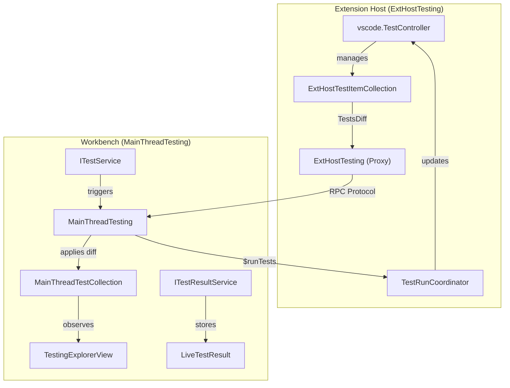
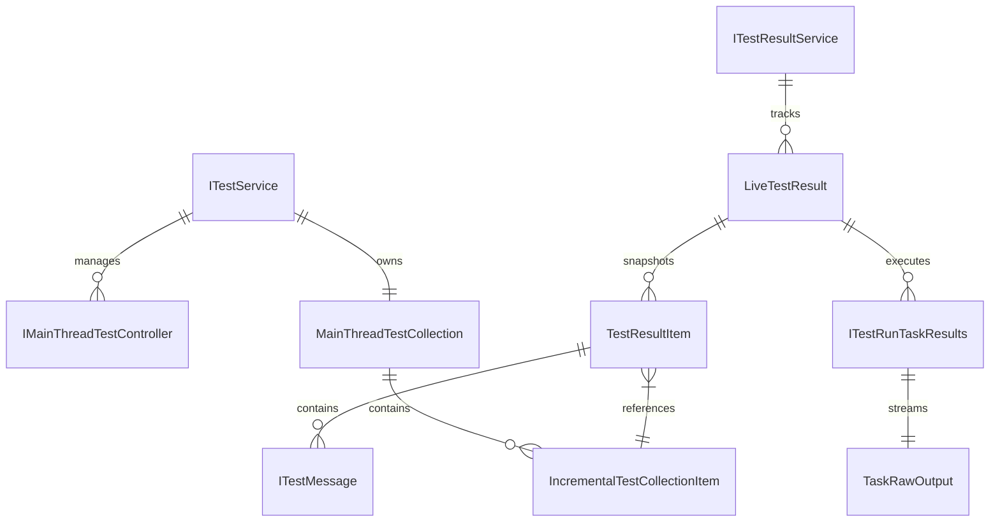

# Test Explorer

Relevant source files

The following files were used as context for generating this wiki page:

- [src/typings/editContext.d.ts](https://github.com/microsoft/vscode/blob/HEAD/src/typings/editContext.d.ts)
- [src/vs/workbench/api/browser/mainThreadTesting.ts](https://github.com/microsoft/vscode/blob/HEAD/src/vs/workbench/api/browser/mainThreadTesting.ts)
- [src/vs/workbench/api/common/extHostTestItem.ts](https://github.com/microsoft/vscode/blob/HEAD/src/vs/workbench/api/common/extHostTestItem.ts)
- [src/vs/workbench/api/common/extHostTesting.ts](https://github.com/microsoft/vscode/blob/HEAD/src/vs/workbench/api/common/extHostTesting.ts)
- [src/vs/workbench/api/test/browser/extHostTesting.test.ts](https://github.com/microsoft/vscode/blob/HEAD/src/vs/workbench/api/test/browser/extHostTesting.test.ts)
- [src/vs/workbench/contrib/testing/browser/codeCoverageDecorations.ts](https://github.com/microsoft/vscode/blob/HEAD/src/vs/workbench/contrib/testing/browser/codeCoverageDecorations.ts)
- [src/vs/workbench/contrib/testing/browser/explorerProjections/index.ts](https://github.com/microsoft/vscode/blob/HEAD/src/vs/workbench/contrib/testing/browser/explorerProjections/index.ts)
- [src/vs/workbench/contrib/testing/browser/icons.ts](https://github.com/microsoft/vscode/blob/HEAD/src/vs/workbench/contrib/testing/browser/icons.ts)
- [src/vs/workbench/contrib/testing/browser/media/testing.css](https://github.com/microsoft/vscode/blob/HEAD/src/vs/workbench/contrib/testing/browser/media/testing.css)
- [src/vs/workbench/contrib/testing/browser/testCoverageBars.ts](https://github.com/microsoft/vscode/blob/HEAD/src/vs/workbench/contrib/testing/browser/testCoverageBars.ts)
- [src/vs/workbench/contrib/testing/browser/testCoverageView.ts](https://github.com/microsoft/vscode/blob/HEAD/src/vs/workbench/contrib/testing/browser/testCoverageView.ts)
- [src/vs/workbench/contrib/testing/browser/testExplorerActions.ts](https://github.com/microsoft/vscode/blob/HEAD/src/vs/workbench/contrib/testing/browser/testExplorerActions.ts)
- [src/vs/workbench/contrib/testing/browser/testing.contribution.ts](https://github.com/microsoft/vscode/blob/HEAD/src/vs/workbench/contrib/testing/browser/testing.contribution.ts)
- [src/vs/workbench/contrib/testing/browser/testingDecorations.ts](https://github.com/microsoft/vscode/blob/HEAD/src/vs/workbench/contrib/testing/browser/testingDecorations.ts)
- [src/vs/workbench/contrib/testing/browser/testingExplorerView.ts](https://github.com/microsoft/vscode/blob/HEAD/src/vs/workbench/contrib/testing/browser/testingExplorerView.ts)
- [src/vs/workbench/contrib/testing/browser/testingOutputPeek.ts](https://github.com/microsoft/vscode/blob/HEAD/src/vs/workbench/contrib/testing/browser/testingOutputPeek.ts)
- [src/vs/workbench/contrib/testing/browser/testingProgressUiService.ts](https://github.com/microsoft/vscode/blob/HEAD/src/vs/workbench/contrib/testing/browser/testingProgressUiService.ts)
- [src/vs/workbench/contrib/testing/browser/theme.ts](https://github.com/microsoft/vscode/blob/HEAD/src/vs/workbench/contrib/testing/browser/theme.ts)
- [src/vs/workbench/contrib/testing/common/configuration.ts](https://github.com/microsoft/vscode/blob/HEAD/src/vs/workbench/contrib/testing/common/configuration.ts)
- [src/vs/workbench/contrib/testing/common/constants.ts](https://github.com/microsoft/vscode/blob/HEAD/src/vs/workbench/contrib/testing/common/constants.ts)
- [src/vs/workbench/contrib/testing/common/testCoverage.ts](https://github.com/microsoft/vscode/blob/HEAD/src/vs/workbench/contrib/testing/common/testCoverage.ts)
- [src/vs/workbench/contrib/testing/common/testCoverageService.ts](https://github.com/microsoft/vscode/blob/HEAD/src/vs/workbench/contrib/testing/common/testCoverageService.ts)
- [src/vs/workbench/contrib/testing/common/testItemCollection.ts](https://github.com/microsoft/vscode/blob/HEAD/src/vs/workbench/contrib/testing/common/testItemCollection.ts)
- [src/vs/workbench/contrib/testing/common/testResult.ts](https://github.com/microsoft/vscode/blob/HEAD/src/vs/workbench/contrib/testing/common/testResult.ts)
- [src/vs/workbench/contrib/testing/common/testResultService.ts](https://github.com/microsoft/vscode/blob/HEAD/src/vs/workbench/contrib/testing/common/testResultService.ts)
- [src/vs/workbench/contrib/testing/common/testResultStorage.ts](https://github.com/microsoft/vscode/blob/HEAD/src/vs/workbench/contrib/testing/common/testResultStorage.ts)
- [src/vs/workbench/contrib/testing/common/testService.ts](https://github.com/microsoft/vscode/blob/HEAD/src/vs/workbench/contrib/testing/common/testService.ts)
- [src/vs/workbench/contrib/testing/common/testServiceImpl.ts](https://github.com/microsoft/vscode/blob/HEAD/src/vs/workbench/contrib/testing/common/testServiceImpl.ts)
- [src/vs/workbench/contrib/testing/common/testTypes.ts](https://github.com/microsoft/vscode/blob/HEAD/src/vs/workbench/contrib/testing/common/testTypes.ts)
- [src/vs/workbench/contrib/testing/common/testingContentProvider.ts](https://github.com/microsoft/vscode/blob/HEAD/src/vs/workbench/contrib/testing/common/testingContentProvider.ts)
- [src/vs/workbench/contrib/testing/common/testingContextKeys.ts](https://github.com/microsoft/vscode/blob/HEAD/src/vs/workbench/contrib/testing/common/testingContextKeys.ts)
- [src/vs/workbench/contrib/testing/common/testingUri.ts](https://github.com/microsoft/vscode/blob/HEAD/src/vs/workbench/contrib/testing/common/testingUri.ts)
- [src/vs/workbench/contrib/testing/test/browser/__snapshots__/Code_Coverage_Decorations_CoverageDetailsModel_3.0.snap](https://github.com/microsoft/vscode/blob/HEAD/src/vs/workbench/contrib/testing/test/browser/__snapshots__/Code_Coverage_Decorations_CoverageDetailsModel_3.0.snap)
- [src/vs/workbench/contrib/testing/test/browser/__snapshots__/Code_Coverage_Decorations_CoverageDetailsModel_4.0.snap](https://github.com/microsoft/vscode/blob/HEAD/src/vs/workbench/contrib/testing/test/browser/__snapshots__/Code_Coverage_Decorations_CoverageDetailsModel_4.0.snap)
- [src/vs/workbench/contrib/testing/test/browser/codeCoverageDecorations.test.ts](https://github.com/microsoft/vscode/blob/HEAD/src/vs/workbench/contrib/testing/test/browser/codeCoverageDecorations.test.ts)
- [src/vs/workbench/contrib/testing/test/common/testResultService.test.ts](https://github.com/microsoft/vscode/blob/HEAD/src/vs/workbench/contrib/testing/test/common/testResultService.test.ts)
- [src/vs/workbench/contrib/testing/test/common/testResultStorage.test.ts](https://github.com/microsoft/vscode/blob/HEAD/src/vs/workbench/contrib/testing/test/common/testResultStorage.test.ts)
- [src/vs/workbench/services/driver/browser/driver.ts](https://github.com/microsoft/vscode/blob/HEAD/src/vs/workbench/services/driver/browser/driver.ts)
- [test/automation/src/application.ts](https://github.com/microsoft/vscode/blob/HEAD/test/automation/src/application.ts)
- [test/automation/src/code.ts](https://github.com/microsoft/vscode/blob/HEAD/test/automation/src/code.ts)
- [test/automation/src/debug.ts](https://github.com/microsoft/vscode/blob/HEAD/test/automation/src/debug.ts)
- [test/automation/src/editor.ts](https://github.com/microsoft/vscode/blob/HEAD/test/automation/src/editor.ts)
- [test/automation/src/editors.ts](https://github.com/microsoft/vscode/blob/HEAD/test/automation/src/editors.ts)
- [test/automation/src/extensions.ts](https://github.com/microsoft/vscode/blob/HEAD/test/automation/src/extensions.ts)
- [test/automation/src/notebook.ts](https://github.com/microsoft/vscode/blob/HEAD/test/automation/src/notebook.ts)
- [test/automation/src/playwrightDriver.ts](https://github.com/microsoft/vscode/blob/HEAD/test/automation/src/playwrightDriver.ts)
- [test/automation/src/scm.ts](https://github.com/microsoft/vscode/blob/HEAD/test/automation/src/scm.ts)
- [test/automation/src/search.ts](https://github.com/microsoft/vscode/blob/HEAD/test/automation/src/search.ts)
- [test/automation/src/settings.ts](https://github.com/microsoft/vscode/blob/HEAD/test/automation/src/settings.ts)
- [test/smoke/src/areas/extensions/extensions.test.ts](https://github.com/microsoft/vscode/blob/HEAD/test/smoke/src/areas/extensions/extensions.test.ts)
- [test/smoke/src/areas/languages/languages.test.ts](https://github.com/microsoft/vscode/blob/HEAD/test/smoke/src/areas/languages/languages.test.ts)
- [test/smoke/src/areas/multiroot/multiroot.test.ts](https://github.com/microsoft/vscode/blob/HEAD/test/smoke/src/areas/multiroot/multiroot.test.ts)
- [test/smoke/src/areas/notebook/notebook.test.ts](https://github.com/microsoft/vscode/blob/HEAD/test/smoke/src/areas/notebook/notebook.test.ts)
- [test/smoke/src/areas/preferences/preferences.test.ts](https://github.com/microsoft/vscode/blob/HEAD/test/smoke/src/areas/preferences/preferences.test.ts)
- [test/smoke/src/areas/search/search.test.ts](https://github.com/microsoft/vscode/blob/HEAD/test/smoke/src/areas/search/search.test.ts)
- [test/smoke/src/areas/statusbar/statusbar.test.ts](https://github.com/microsoft/vscode/blob/HEAD/test/smoke/src/areas/statusbar/statusbar.test.ts)
- [test/smoke/src/areas/workbench/data-loss.test.ts](https://github.com/microsoft/vscode/blob/HEAD/test/smoke/src/areas/workbench/data-loss.test.ts)
- [test/smoke/src/areas/workbench/launch.test.ts](https://github.com/microsoft/vscode/blob/HEAD/test/smoke/src/areas/workbench/launch.test.ts)
- [test/smoke/src/areas/workbench/localization.test.ts](https://github.com/microsoft/vscode/blob/HEAD/test/smoke/src/areas/workbench/localization.test.ts)
- [test/smoke/src/main.ts](https://github.com/microsoft/vscode/blob/HEAD/test/smoke/src/main.ts)
- [test/smoke/src/utils.ts](https://github.com/microsoft/vscode/blob/HEAD/test/smoke/src/utils.ts)

The Test Explorer subsystem provides a unified interface for discovering, running, and analyzing tests within VS Code. It bridges the gap between the VS Code Extension API and the workbench UI, handling test discovery, result persistence, editor decorations, and code coverage visualization.

## Architecture Overview

The testing system follows a classic VS Code multi-process architecture where test discovery and execution logic reside in the **Extension Host**, while the UI and result management reside in the **Main Thread (Workbench)**.

### Data Flow: Discovery and Execution

1.  **Discovery**: Extensions use the `vscode.tests.createTestController` API [src/vs/workbench/api/common/extHostTesting.ts:128-128](https://github.com/microsoft/vscode/blob/HEAD/src/vs/workbench/api/common/extHostTesting.ts#L128). This creates an `ExtHostTestItemCollection` [src/vs/workbench/api/common/extHostTesting.ts:134-134](https://github.com/microsoft/vscode/blob/HEAD/src/vs/workbench/api/common/extHostTesting.ts#L134) which syncs a `TestsDiff` to the `MainThreadTesting` via RPC [src/vs/workbench/api/browser/mainThreadTesting.ts:132-135](https://github.com/microsoft/vscode/blob/HEAD/src/vs/workbench/api/browser/mainThreadTesting.ts#L132-L135).
2.  **UI Representation**: The `MainThreadTestCollection` [src/vs/workbench/contrib/testing/common/testServiceImpl.ts:100-100](https://github.com/microsoft/vscode/blob/HEAD/src/vs/workbench/contrib/testing/common/testServiceImpl.ts#L100) receives these diffs and updates the `TestingExplorerView` [src/vs/workbench/contrib/testing/browser/testingExplorerView.ts:115-115](https://github.com/microsoft/vscode/blob/HEAD/src/vs/workbench/contrib/testing/browser/testingExplorerView.ts#L115).
3.  **Execution**: When a user clicks "Run", the `ITestService` [src/vs/workbench/contrib/testing/common/testService.ts:27-27](https://github.com/microsoft/vscode/blob/HEAD/src/vs/workbench/contrib/testing/common/testService.ts#L27) calls `runTests` on the registered `IMainThreadTestController` [src/vs/workbench/contrib/testing/common/testService.ts:39-39](https://github.com/microsoft/vscode/blob/HEAD/src/vs/workbench/contrib/testing/common/testService.ts#L39), which proxies the request back to the extension host's `TestRunCoordinator` [src/vs/workbench/api/common/extHostTesting.ts:79-79](https://github.com/microsoft/vscode/blob/HEAD/src/vs/workbench/api/common/extHostTesting.ts#L79).

### Process Boundary Diagram

The following diagram maps the logical flow of test data across the RPC boundary, associating system names with their corresponding code entities.

**Test System Process Bridge**

Sources: [src/vs/workbench/api/common/extHostTesting.ts:55-80](https://github.com/microsoft/vscode/blob/HEAD/src/vs/workbench/api/common/extHostTesting.ts#L55-L80), [src/vs/workbench/api/browser/mainThreadTesting.ts:26-50](https://github.com/microsoft/vscode/blob/HEAD/src/vs/workbench/api/browser/mainThreadTesting.ts#L26-L50), [src/vs/workbench/contrib/testing/common/testService.ts:27-40](https://github.com/microsoft/vscode/blob/HEAD/src/vs/workbench/contrib/testing/common/testService.ts#L27-L40)

## Core Services

### ITestService
The primary entry point for testing functionality in the workbench. It manages the global `MainThreadTestCollection` and coordinates with test controllers.
- **Implementation**: `TestService` in [src/vs/workbench/contrib/testing/common/testServiceImpl.ts:34-34](https://github.com/microsoft/vscode/blob/HEAD/src/vs/workbench/contrib/testing/common/testServiceImpl.ts#L34).
- **Responsibilities**: Tracking registered controllers in a `testControllers` observable [src/vs/workbench/contrib/testing/common/testServiceImpl.ts:41-41](https://github.com/microsoft/vscode/blob/HEAD/src/vs/workbench/contrib/testing/common/testServiceImpl.ts#L41), managing test exclusions via `TestExclusions` [src/vs/workbench/contrib/testing/common/testServiceImpl.ts:107-107](https://github.com/microsoft/vscode/blob/HEAD/src/vs/workbench/contrib/testing/common/testServiceImpl.ts#L107), and handling test refresh requests [src/vs/workbench/contrib/testing/common/testServiceImpl.ts:135-135](https://github.com/microsoft/vscode/blob/HEAD/src/vs/workbench/contrib/testing/common/testServiceImpl.ts#L135).

### ITestResultService
Manages the lifecycle of test results, including current runs and historical data.
- **Implementation**: `TestResultService` [src/vs/workbench/contrib/testing/common/testResultService.ts:31-31](https://github.com/microsoft/vscode/blob/HEAD/src/vs/workbench/contrib/testing/common/testResultService.ts#L31).
- **Key Classes**:
    - `LiveTestResult`: Represents an active test run, tracking state changes (Queued, Running, Passed, Failed) [src/vs/workbench/contrib/testing/common/testResult.ts:446-446](https://github.com/microsoft/vscode/blob/HEAD/src/vs/workbench/contrib/testing/common/testResult.ts#L446).
    - `HydratedTestResult`: A result loaded from storage, typically used for historical runs [src/vs/workbench/contrib/testing/common/testResult.ts:241-241](https://github.com/microsoft/vscode/blob/HEAD/src/vs/workbench/contrib/testing/common/testResult.ts#L241).
    - `TaskRawOutput`: Handles the streaming output (ANSI/terminal data) from a test task via `VSBuffer` chunks [src/vs/workbench/contrib/testing/common/testResult.ts:119-119](https://github.com/microsoft/vscode/blob/HEAD/src/vs/workbench/contrib/testing/common/testResult.ts#L119).

### ITestingDecorationsService
Coordinates the rendering of test-related UI elements in the editor gutter and inline.
- **Implementation**: `TestingDecorationService` [src/vs/workbench/contrib/testing/browser/testingDecorations.ts:125-125](https://github.com/microsoft/vscode/blob/HEAD/src/vs/workbench/contrib/testing/browser/testingDecorations.ts#L125).
- **Decorations**: Manages `RunTestDecoration` for the gutter [src/vs/workbench/contrib/testing/browser/testingDecorations.ts:89-123](https://github.com/microsoft/vscode/blob/HEAD/src/vs/workbench/contrib/testing/browser/testingDecorations.ts#L89-L123) and integrates with `TestingOutputPeekController` for inline error messages [src/vs/workbench/contrib/testing/browser/testingOutputPeek.ts:113-113](https://github.com/microsoft/vscode/blob/HEAD/src/vs/workbench/contrib/testing/browser/testingOutputPeek.ts#L113).

## UI Components

### Testing Explorer View
The `TestingExplorerView` [src/vs/workbench/contrib/testing/browser/testingExplorerView.ts:115-115](https://github.com/microsoft/vscode/blob/HEAD/src/vs/workbench/contrib/testing/browser/testingExplorerView.ts#L115) provides the tree representation of tests. It uses "projections" to transform the flat test collection into hierarchical views.
- **Projections**: `TreeProjection` [src/vs/workbench/contrib/testing/browser/explorerProjections/treeProjection.ts](https://github.com/microsoft/vscode/blob/HEAD/src/vs/workbench/contrib/testing/browser/explorerProjections/treeProjection.ts) for the standard hierarchical view and `ListProjection` [src/vs/workbench/contrib/testing/browser/explorerProjections/listProjection.ts](https://github.com/microsoft/vscode/blob/HEAD/src/vs/workbench/contrib/testing/browser/explorerProjections/listProjection.ts) for a flat failure list.
- **Filter State**: Managed by `TestExplorerFilterState` [src/vs/workbench/contrib/testing/common/testExplorerFilterState.ts:42-42](https://github.com/microsoft/vscode/blob/HEAD/src/vs/workbench/contrib/testing/common/testExplorerFilterState.ts#L42), allowing filtering by glob patterns or test states.

### Test Output Peek
When a test fails, the `TestingOutputPeekController` [src/vs/workbench/contrib/testing/browser/testingOutputPeek.ts:113-113](https://github.com/microsoft/vscode/blob/HEAD/src/vs/workbench/contrib/testing/browser/testingOutputPeek.ts#L113) allows users to view failure details directly in the editor.
- **Navigation**: Supports jumping between messages using `GoToNextMessageAction` and `GoToPreviousMessageAction` [src/vs/workbench/contrib/testing/browser/testingOutputPeek.ts:49-49](https://github.com/microsoft/vscode/blob/HEAD/src/vs/workbench/contrib/testing/browser/testingOutputPeek.ts#L49).
- **Diff View**: If a test message includes expected/actual values, it renders an `EmbeddedDiffEditorWidget` [src/vs/workbench/contrib/testing/browser/testingOutputPeek.ts:24-24](https://github.com/microsoft/vscode/blob/HEAD/src/vs/workbench/contrib/testing/browser/testingOutputPeek.ts#L24).

### Code Coverage
The `CodeCoverageDecorations` [src/vs/workbench/contrib/testing/browser/codeCoverageDecorations.ts:42-42](https://github.com/microsoft/vscode/blob/HEAD/src/vs/workbench/contrib/testing/browser/codeCoverageDecorations.ts#L42) class handles the visualization of statement, branch, and function coverage.
- **Data Source**: `ITestCoverageService` [src/vs/workbench/contrib/testing/common/testCoverageService.ts:27-27](https://github.com/microsoft/vscode/blob/HEAD/src/vs/workbench/contrib/testing/common/testCoverageService.ts#L27).
- **UI**: Renders coverage bars in the explorer [src/vs/workbench/contrib/testing/browser/testCoverageBars.ts:18-18](https://github.com/microsoft/vscode/blob/HEAD/src/vs/workbench/contrib/testing/browser/testCoverageBars.ts#L18) and highlighted backgrounds in the editor using CSS variables like `--vscode-testing-iconPassed` [src/vs/workbench/contrib/testing/browser/media/testing.css:18-19](https://github.com/microsoft/vscode/blob/HEAD/src/vs/workbench/contrib/testing/browser/media/testing.css#L18-L19).

## Implementation Details: Test Result State Machine

Test results transition through states defined in `TestResultState` [src/vs/workbench/contrib/testing/common/testTypes.ts:121-121](https://github.com/microsoft/vscode/blob/HEAD/src/vs/workbench/contrib/testing/common/testTypes.ts#L121). The `LiveTestResult` class manages these transitions and computes aggregate states for parent nodes.

**State Management Logic**
| Component | Function | Description |
| :--- | :--- | :--- |
| `LiveTestResult` | `updateState()` | Updates a specific test's state and triggers a recomputation of parent states [src/vs/workbench/contrib/testing/common/testResult.ts:646-646](https://github.com/microsoft/vscode/blob/HEAD/src/vs/workbench/contrib/testing/common/testResult.ts#L646). |
| `LiveTestResult` | `setAllToState()` | Bulk updates tests (e.g., setting all to "Queued" at start) [src/vs/workbench/contrib/testing/common/testResult.ts:616-616](https://github.com/microsoft/vscode/blob/HEAD/src/vs/workbench/contrib/testing/common/testResult.ts#L616). |
| `TestingProgressTrigger` | UI Progress | Listens to `ITestResultService` to update the workbench progress bar during active runs [src/vs/workbench/contrib/testing/browser/testingProgressUiService.ts:32-32](https://github.com/microsoft/vscode/blob/HEAD/src/vs/workbench/contrib/testing/browser/testingProgressUiService.ts#L32). |

**Entity Relationship Diagram**
The following diagram describes the relationships between core testing entities in the Main Thread.

Sources: [src/vs/workbench/contrib/testing/common/testService.ts:27-40](https://github.com/microsoft/vscode/blob/HEAD/src/vs/workbench/contrib/testing/common/testService.ts#L27-L40), [src/vs/workbench/contrib/testing/common/testResult.ts:446-460](https://github.com/microsoft/vscode/blob/HEAD/src/vs/workbench/contrib/testing/common/testResult.ts#L446-L460), [src/vs/workbench/contrib/testing/common/testTypes.ts:22-25](https://github.com/microsoft/vscode/blob/HEAD/src/vs/workbench/contrib/testing/common/testTypes.ts#L22-L25), [src/vs/workbench/contrib/testing/common/testResult.ts:24-39](https://github.com/microsoft/vscode/blob/HEAD/src/vs/workbench/contrib/testing/common/testResult.ts#L24-L39)

## Key Files and Roles

- `testingExplorerView.ts`: The primary Sidebar view implementation using `TestingObjectTree` [src/vs/workbench/contrib/testing/browser/testingExplorerView.ts:115-115](https://github.com/microsoft/vscode/blob/HEAD/src/vs/workbench/contrib/testing/browser/testingExplorerView.ts#L115).
- `testingOutputPeek.ts`: Logic for the inline error "peek" widget and the `TestResultsView` panel [src/vs/workbench/contrib/testing/browser/testingOutputPeek.ts:113-113](https://github.com/microsoft/vscode/blob/HEAD/src/vs/workbench/contrib/testing/browser/testingOutputPeek.ts#L113).
- `testingDecorations.ts`: Gutter icon management and editor integration, providing `TestingDecorationService` [src/vs/workbench/contrib/testing/browser/testingDecorations.ts:125-125](https://github.com/microsoft/vscode/blob/HEAD/src/vs/workbench/contrib/testing/browser/testingDecorations.ts#L125).
- `extHostTesting.ts`: The Extension Host side of the testing API, managing `ControllerInfo` [src/vs/workbench/api/common/extHostTesting.ts:55-60](https://github.com/microsoft/vscode/blob/HEAD/src/vs/workbench/api/common/extHostTesting.ts#L55-L60).
- `mainThreadTesting.ts`: The Workbench side of the RPC bridge, handling `$publishTestResults` [src/vs/workbench/api/browser/mainThreadTesting.ts:73-73](https://github.com/microsoft/vscode/blob/HEAD/src/vs/workbench/api/browser/mainThreadTesting.ts#L73).
- `testResult.ts`: Core models for test results, `TaskRawOutput` buffers, and `LiveTestResult` [src/vs/workbench/contrib/testing/common/testResult.ts:446-446](https://github.com/microsoft/vscode/blob/HEAD/src/vs/workbench/contrib/testing/common/testResult.ts#L446).

Sources: [src/vs/workbench/contrib/testing/browser/testingExplorerView.ts](https://github.com/microsoft/vscode/blob/HEAD/src/vs/workbench/contrib/testing/browser/testingExplorerView.ts), [src/vs/workbench/contrib/testing/browser/testingOutputPeek.ts](https://github.com/microsoft/vscode/blob/HEAD/src/vs/workbench/contrib/testing/browser/testingOutputPeek.ts), [src/vs/workbench/contrib/testing/browser/testingDecorations.ts](https://github.com/microsoft/vscode/blob/HEAD/src/vs/workbench/contrib/testing/browser/testingDecorations.ts), [src/vs/workbench/api/common/extHostTesting.ts](https://github.com/microsoft/vscode/blob/HEAD/src/vs/workbench/api/common/extHostTesting.ts), [src/vs/workbench/api/browser/mainThreadTesting.ts](https://github.com/microsoft/vscode/blob/HEAD/src/vs/workbench/api/browser/mainThreadTesting.ts), [src/vs/workbench/contrib/testing/common/testResult.ts](https://github.com/microsoft/vscode/blob/HEAD/src/vs/workbench/contrib/testing/common/testResult.ts)